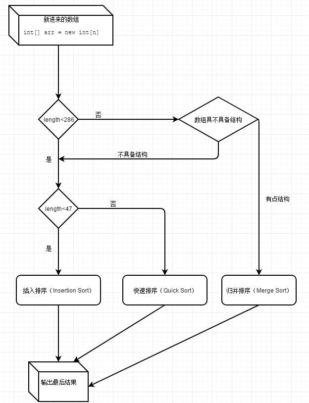
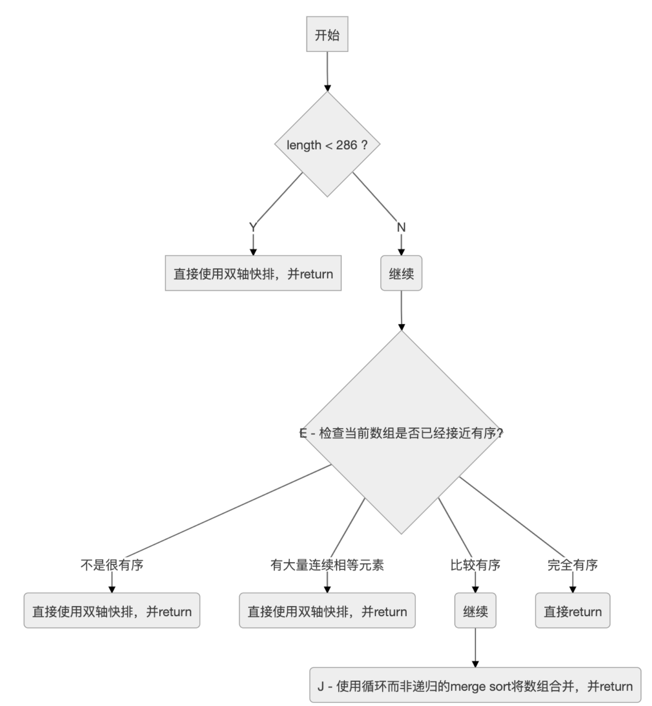
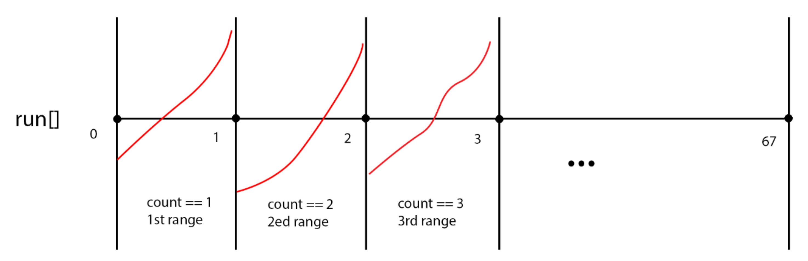
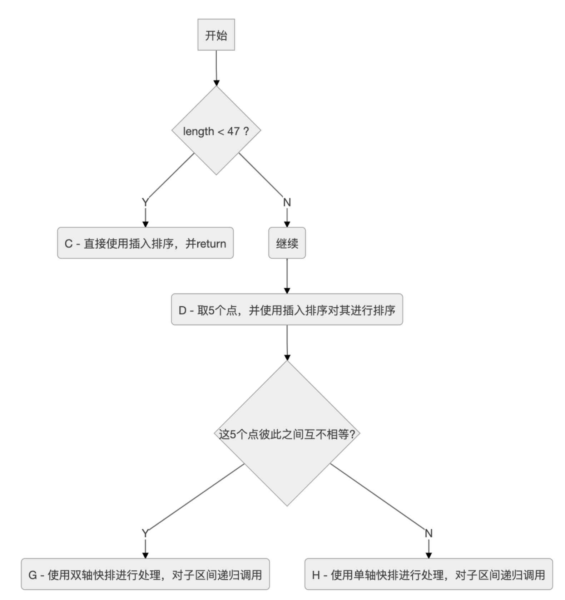
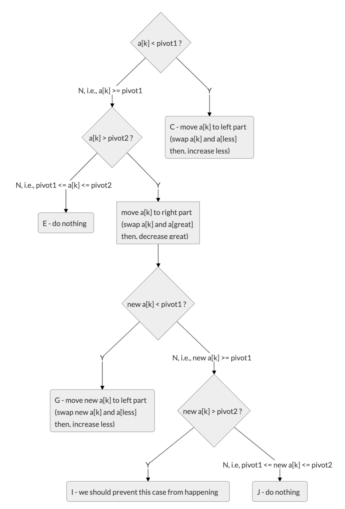

# Java的Arrays.sort()方法到底用的什么排序算法

数组一进来，会碰到第一个阀值QUICKSORT_THRESHOLD（286），注解上说，小过这个阀值的进入Quicksort （快速排序），其实并不全是，点进去sort(a, left, right, true);方法：

```java
// Use Quicksort on small arrays
if (right - left < QUICKSORT_THRESHOLD)
{
       //QUICKSORT_THRESHOLD = 286
        sort(a, left, right, true);
        return;
 }
```

## 1. 元素少于47用插入排序

点进去后我们看到第二个阀值INSERTION_SORT_THRESHOLD（47），如果元素少于47这个阀值，就用插入排序，往下看确实如此：

```java
// Use insertion sort on tiny arrays
if (length < INSERTION_SORT_THRESHOLD)
{
    if (leftmost)
    {
        ......
```

```java
/*
 * Traditional (without sentinel) insertion sort,
 * optimized for server VM, is used in case of
 * the leftmost part.
 */
for (int i = left, j = i; i < right; j = ++i)
{
     int ai = a[i + 1];
     while (ai < a[j])
     {
          a[j + 1] = a[j];
          if (j-- == left)
          {
               break;
           }
      }
      a[j + 1] = ai;
```

## 2. 快速排序（Quick Sort）47-286  

　　至于大过INSERTION_SORT_THRESHOLD（47）的，用一种快速排序的方法：

　　1.从数列中挑出五个元素，称为 “基准”（pivot）；

　　2.重新排序数列，所有元素比基准值小的摆放在基准前面，所有元素比基准值大的摆在基准的后面（相同的数可以到任一边）。在这个分区退出之后，该基准就处于数列的中间位置。这个称为分区（partition）操作；

　　3.递归地（recursive）把小于基准值元素的子数列和大于基准值元素的子数列排序。

这是少于阀值QUICKSORT_THRESHOLD（286）的两种情况，至于大于286的，它会进入归并排序（Merge Sort），但在此之前，它有个小动作：

```java
// Check if the array is nearly sorted
    for (int k = left; k < right; run[count] = k) {        if (a[k] < a[k + 1]) { // ascending
            while (++k <= right && a[k - 1] <= a[k]);
        } else if (a[k] > a[k + 1]) { // descending
            while (++k <= right && a[k - 1] >= a[k]);            for (int lo = run[count] - 1, hi = k; ++lo < --hi; ) {                int t = a[lo]; a[lo] = a[hi]; a[hi] = t;
            }
        } else { // equal
            for (int m = MAX_RUN_LENGTH; ++k <= right && a[k - 1] == a[k]; ) {                if (--m == 0) {
                    sort(a, left, right, true);                    return;
                }
            }
        }        /*
         * The array is not highly structured,
         * use Quicksort instead of merge sort.
         */
        if (++count == MAX_RUN_COUNT) {
            sort(a, left, right, true);            return;
        }
    }
```

这里主要作用是看他数组具不具备结构：实际逻辑是分组排序，每降序为一个组，像1,9,8,7,6,8。9到6是降序，为一个组，然后把降序的一组排成升序：1,6,7,8,9,8。然后最后的8后面继续往后面找。

　　每遇到这样一个降序组，++count，当count大于MAX_RUN_COUNT（67），被判断为这个数组不具备结构（也就是这数据时而升时而降），然后送给之前的sort(里面的快速排序)的方法（The array is not highly structured,use Quicksort instead of merge sort.）

　　如果count少于MAX_RUN_COUNT（67）的，说明这个数组还有点结构，就继续往下走下面的归并排序。

总结：

　　从上面分析，Arrays.sort并不是单一的排序，而是插入排序，快速排序，归并排序三种排序的组合，为此我画了个流程图：



## 3. 归并排序 >286

O(nlogn)只代表增长量级，同一个量级前面的常数也可以不一样，不同数量下面的实际运算时间也可以不一样。

　　数量非常小的情况下（就像上面说到的，少于47的），插入排序等可能会比快速排序更快。 所以数组少于47的会进入插入排序。  

　　快排数据越无序越快（加入随机化后基本不会退化），平均常数最小，不需要额外空间，不稳定排序。

　　归排速度稳定，常数比快排略大，需要额外空间，稳定排序。

　　所以大于或等于47或少于286会进入快排，而在大于或等于286后，会有个小动作：“// Check if the array is nearly sorted”。这里第一个作用是先梳理一下数据方便后续的归并排序，第二个作用就是即便大于286，但在降序组太多的时候（被判断为没有结构的数据，The array is not highly structured,use Quicksort instead of merge sort.），要转回快速排序。

> 在JDK 1.7中，`DualQuickSort`被首次引入，在1.8中做了一些优化，具体的变化我这里就不再对比了，有兴趣的同学可以去自己对比一下。接下来的分析基于JDK 1.8.1 u121的代码

#### 3.1双轴快排 - `DualQuickSort`

> 入口函数是`+Arrays.sort(int[] a)`，涉及到的函数有
>
> - `~DualPivotQuicksort.sort(int[] a, int left, int right, int[] work, int workBase, int workLen)`
> - `-DualPivotQuicksort.sort(int[] a, int left, int right, boolean leftmost)`

实际的执行函数有两个，我们依次来看。

双轴快排对外入口 - `~DualPivotQuicksort.sort(int[] a, int left, int right, int[] work, int workBase, int workLen)`

我们先看一下它的调用流程



从图中可以看出，虽然本身的类名是双轴快排(`DualPivotQuicksort`)。但是还会综合其它排序方法。比如上图中，如果检测出数组比较有序的情况下，则会使用`merge sort`的思路来进行处理。

接下来，我们来看一下图中`E`, `J`是如何实现的。

我们先参考一下这部分的原始代码

```java
        /*
         * Index run[i] is the start of i-th run
         * (ascending or descending sequence).
         */
        int[] run = new int[MAX_RUN_COUNT + 1]; // MAX_RUN_COUNT = 67
        int count = 0; run[0] = left;

        // Check if the array is nearly sorted
        for (int k = left; k < right; run[count] = k) {
            if (a[k] < a[k + 1]) { // ascending
                while (++k <= right && a[k - 1] <= a[k]);
            } else if (a[k] > a[k + 1]) { // descending
                while (++k <= right && a[k - 1] >= a[k]);
                for (int lo = run[count] - 1, hi = k; ++lo < --hi; ) {
                    int t = a[lo]; a[lo] = a[hi]; a[hi] = t;
                }
            } else { // equal
                for (int m = MAX_RUN_LENGTH; ++k <= right && a[k - 1] == a[k]; ) {  // MAX_RUN_LENGTH = 33
                    if (--m == 0) {
                        sort(a, left, right, true);
                        return;
                    }
                }
            }

            /*
             * The array is not highly structured,
             * use Quicksort instead of merge sort.
             */
            if (++count == MAX_RUN_COUNT) {
                sort(a, left, right, true);
                return;
            }
        }

        // Check special cases
        // Implementation note: variable "right" is increased by 1.
        if (run[count] == right++) { // The last run contains one element
            run[++count] = right;
        } else if (count == 1) { // The array is already sorted
            return;
        }
```

在上述代码中，搞清楚变量`run`, `count`, `k`, `m`这4个变量的含义就比较容易理解代码的实现了。

我理解下来，它们分别的含义如下

- `run` - 记录每一个连续区间，对应的开始元素的下标
- `count` - 记录到目前为止，已经检测到有多少个递增的区间，同时也是for循环的次数。注意其值从0开始，所以第1个区间的范围是`[run[0], run[1])`，以此类推
- `k` - 游标，整个for循环中，指向当前所遍历到的元素
- `m` - 用于辅助判断一段连续相等的元素区间的的长度是否已经达到指定的上限

上面几个变量虽然用文字解释了一下，依然比较晦涩。这里我画一个简单的示意图，你就明白到底是如何检测是否有序，以及所谓有序的标准是什么了。



> 至于两个常量`MAX_RUN_COUNT`与`MAX_RUN_LENGTH`的值是怎么来的，猜测依然是经验值吧。有清楚的同学可以告诉我。

for循环开始有`if-elseif-else`的语句。是把当前元素与下一个元素做比较，将结果分成了3种情况

- 当前元素 < 下一个元素
- 当前元素 > 下一个元素
- 当前元素 = 下一个元素

其中`<`这种情况最简单，已经是期望的升序区间。该block里边的`while`循环则用于向右移动游标，直到找到第一个降序的元素。即

```java
while (++k <= right && a[k - 1] <= a[k]);
```

`>`这种情况相对复杂一些，这个block里边是找一个连续的降序区间。然后将该区间从两端到中间的方向首尾交换元素，从而将原本的降序区间转变成一个升序区间。即

```java
while (++k <= right && a[k - 1] >= a[k]);
for (int lo = run[count] - 1, hi = k; ++lo < --hi; ) {
    int t = a[lo]; a[lo] = a[hi]; a[hi] = t;
}
```

`=`这种情况下有一个特殊的处理，当侦测到连续相等区间的长度`>=33`的时候，即上图中的某个区间`有大量连续相等元素`的时候，停止后续的侦测，直接转用`双轴快排`。代码如下

```java
for (int m = MAX_RUN_LENGTH; ++k <= right && a[k - 1] == a[k]; ) {
    if (--m == 0) {
        sort(a, left, right, true);
        return;
    }
}
```

在for循环接下来的逻辑里，判断`count`的值是否已经达到`67`这个上限。即我们到目前为止已经找出了`67`个递增的区间，但是还没有遍历结束，那么就认为当前数组`不是很有序`，那么就会转用`双轴快排`进行处理。代码如下

```java
/*
 * The array is not highly structured,
 * use Quicksort instead of merge sort.
 */
if (++count == MAX_RUN_COUNT) {
    sort(a, left, right, true);
    return;
}
```

for循环结束后，如果没有return，那说明递增区间划分完成。接下来的代码比较简单

```java
// Check special cases
// Implementation note: variable "right" is increased by 1.
if (run[count] == right++) { // The last run contains one element
    run[++count] = right;
} else if (count == 1) { // The array is already sorted
    return;
}
```

`else-if` 的条件判断 `count == 1`说明只有一个递增区间，即数组已经完全有序，直接return，比较很容易理解。

但是与其对应的`if`逻辑不太容易理解，有些文章解读为添加一个哨兵元素，但是仔细阅读下来其实并不是这样的。就像注释里边说的，它是用于处理特殊情况 - 最后一个区间只包括一个元素。

我们仔细观察整个for循环可以发现，每执行完1次循环，count计数加1，run[count]则记录的是刚刚测量过的区间的结束位置(不包含)。当最后一个区间只有一个元素的时候，run[count]其实记录的是最后一个区间的开始的位置(包含)，没有记录其对应的结束位置，即`right+1`。所以这里的逻辑是对种情况的补充处理，并不是什么哨兵。

#### 3.2 J

这部分代码是将前边检测出来的升序区间，即一个一个有序小数组，合并最终成为一个有序的大数组。所以其实它是`merge sort`中合并函数的`迭代版本`。

它简单可以分成两部分逻辑：

- 确定并创建临时数组`b`，以供合并时使用
- 迭代而非递归进行合并

在写文章的时候我也参考过其他人的分析，但很多都是一笔带过或者语焉不详，并没有讲得很清楚，所以我准备自己把它搞明白。

我们先来看看第一部分 - 确定并创建临时数组`b`，以供合并时使用

这里是原始代码

```java
// Determine alternation base for merge
byte odd = 0;
for (int n = 1; (n <<= 1) < count; odd ^= 1) ;

// Use or create temporary array b for merging
int[] b;                 // temp array; alternates with a
int ao, bo;              // array offsets from 'left'
int blen = right - left; // space needed for b
if (work == null || workLen < blen || workBase + blen > work.length) {
    work = new int[blen];
    workBase = 0;
}
if (odd == 0) {
    System.arraycopy(a, left, work, workBase, blen);
    b = a;
    bo = 0;
    a = work;
    ao = workBase - left;
} else {
    b = work;
    ao = 0;
    bo = workBase - left;
}
```

上边的代码中最让人困惑的可能就是变量`odd`的含义了。

经过多次调试，明白了作者的意图是想计算出针对`count`个有序的子数组，需要循环合并多少次才能变为1个大数组，是奇数次还是偶数次。

为什么只关心奇偶呢？

我们先看下合并的实现逻辑，再回过来思考这个问题。

```java
// Merging
for (int last; count > 1; count = last) {
    for (int k = (last = 0) + 2; k <= count; k += 2) {
        int hi = run[k], mi = run[k - 1];
        for (int i = run[k - 2], p = i, q = mi; i < hi; ++i) {
            if (q >= hi || p < mi && a[p + ao] <= a[q + ao]) {
                b[i + bo] = a[p++ + ao];
            } else {
                b[i + bo] = a[q++ + ao];
            }
        }
        run[++last] = hi;
    }
    if ((count & 1) != 0) {
        for (int i = right, lo = run[count - 1]; --i >= lo;
             b[i + bo] = a[i + ao]
            );
        run[++last] = right;
    }
    int[] t = a; a = b; b = t;
    int o = ao; ao = bo; bo = o;
}
```

这里从外到内共有3层循环，其中

- 最内层循环 - 是将两个有序的子数组合并成一个有序的数组，结果会被写入到临时数组`b`中
- 中间层循环 - 将目前的子数组序列两两合并
- 最外层循环 - 中间层循环执行完毕后，如果有`落单`的子数组，则直接将其复制过来(参考`(count & 1) != 0`处的逻辑)，然后交换`a`/`b`数组的引用。**注意，这是执行过一次`循环合并`的效果 - 即将原始的`count`个子数组“压缩合并”为`(count+1)/2`个数组**。当最后`count`变为`1`的时候，整个循环结束，完成排序。

从上面的分析中可以发现，每执行1次`循环合并`，`a`/`b`数组的引用会交换1次。我们把上边的整个合并过程当中`循环合并`的次数记为`loop_merge_times`，那么在这个过程当中`a`/`b`数组的引用共交换了`loop_merge_times`次。

引用交换1次意味着什么呢？

> 主要是为下一次`循环合并`做准备，因为本次`循环合并`是把结果写入了临时数组`b`中，那么交换`a`/`b`的引用之后，下次`循环合并`就会把结果写入真正的数组`a`中。这里的“真正”指的是形参`a`所对应的实参。(这里有点绕，可以仔细体会一下)
>
> 所以，交换偶数次引用后，合并后的结果是写入到了原始的`a`中，这也是我们所期望的。

经过上面的分析，我们就明白了合并之前计算`odd`的作用了。`loop_merge_times`的值是一个`>=1`的正整数，当它为偶数时，我们不需要做什么额外处理。但是为奇数时，我们需要怎么处理才能保证最后合并完成之后`a`存储的是最终合并的结果呢？

答案也很简单，我们在合并之前做一次预处理，先将`a`/`b`的引用交换1次就可以满足需求了。

但是合并之前的代码中的`odd`其实记录的是比实际的`循环合并`少1次的结果。因为终止条件`(n <<= 1) < count`终止后，仍需要再进行1次`循环合并`，才会完成全部合并。所以在代码里边当`odd == 0`时才执行`a`/`b`的引用交换。

我们可以将此处的逻辑改写一下，更加便于理解

```java
// Determine alternation base for merge
byte odd = 0;
int loop_merge_times = 0;
for (int n = 1; (n <<= 1) < count; odd ^= 1, ++loop_merge_times) ;
loop_merge_times += 1;

if ((loop_merge_times & 1) != 0) {
    // swap a and b
} else {
    // ...
}
```

关于`loop_merge_times`的计算，也可以使用数学公式直接计算出来 - 将`log2(count)`的结果向上取整。

为什么作者使用位运算而不是直接求解数值的方法？原因还是源自对速度的追求。你可以使用下面的代码对比一下两者的运行时间。

```java
static void compareCalcSpeed() {
    int count = 66;
    byte odd = 0;

    // Approach 1
    long start = System.nanoTime();
    for (int n = 1; (n <<= 1) < count; odd ^= 1) ;
    odd ^= 1;
    long period = System.nanoTime() - start;

    System.out.printf("loop time: %d ns\n", period);

    // Approach 2
    start = System.nanoTime();
    double logValue = Math.log(count) / Math.log(2);
    int mergeLoopTimes = (int) Math.ceil(logValue);
    period = System.nanoTime() - start;

    System.out.printf("calc time: %d ns\n", period);
}
```

双轴快排函数 - `-DualPivotQuicksort.sort(int[] a, int left, int right, boolean leftmost)`

函数`~DualPivotQuicksort.sort(int[] a, int left, int right, boolean leftmost)`的调用流程



前边分析了那么多，其实还没有真正到`双轴快排`，上图才是`双轴快排`代码所在的地方。

接下来，我们分别看看`C`, `D`, `H`, `G`是怎么实现的。

### 3.3 代码实现

这里的插入排序会分成两种情况

- 要排序的`[left, right]`区间是数组`a`的最左侧部分，即`left==0`
- 另一种就是要排序的`[left, right]`区间在数组`a`的非最左侧部分，即`left>0`

第一种情况的代码比较简单，如下

```java
        /*
         * Traditional (without sentinel) insertion sort,
         * optimized for server VM, is used in case of
         * the leftmost part.
         */
        for (int i = left, j = i; i < right; j = ++i) {
            int ai = a[i + 1];
            while (ai < a[j]) {
                a[j + 1] = a[j];
                if (j-- == left) {
                    break;
                }
            }
            a[j + 1] = ai;
        }
```

正如注释中所说的，使用`传统`的插入排序，即不使用`哨兵`。

同样的，我们搞明白变量`i`和`j`的作用之后代码就非常容易理解。

- `i` - 该变量将`[left, right]`区间划分为两部分 - 已排序区间`[left, i]`与未排序区间`(i, right]`
- `j` - 游标，从已排序区间`[left, i]`的最右侧开始，向左查找元素`a[i+1]`合适的位置；并且在查找的过程当中，依次将元素向右移动1位

第二种情况的代码相比就复杂很多，如下

```java
        /*
         * Skip the longest ascending sequence.
         */
        do {
            if (left >= right) {
                return;
            }
        } while (a[++left] >= a[left - 1]);

        /*
         * Every element from adjoining part plays the role
         * of sentinel, therefore this allows us to avoid the
         * left range check on each iteration. Moreover, we use
         * the more optimized algorithm, so called pair insertion
         * sort, which is faster (in the context of Quicksort)
         * than traditional implementation of insertion sort.
         */
        for (int k = left; ++left <= right; k = ++left) {
            int a1 = a[k], a2 = a[left];

            if (a1 < a2) {
                a2 = a1; a1 = a[left];
            }
            while (a1 < a[--k]) {
                a[k + 2] = a[k];
            }
            a[++k + 1] = a1;

            while (a2 < a[--k]) {
                a[k + 1] = a[k];
            }
            a[k + 1] = a2;
        }
        int last = a[right];

        while (last < a[--right]) {
            a[right + 1] = a[right];
        }
        a[right + 1] = last;
```

这里使用一种改进的插入排序 - `成对插入排序(pair insertion sort)`的方法。

这个方法的基本思想是在普通插入排序的基础上

1. 1次从未排序区间取出2个元素 - `a1`和`a2`，并且保证`a1>=a2`（即如果`a1<a2`，则交换两者的值）
2. 从右向左找到`a1`的合适位置；并且在查找的过程当中，依次将元素向右移动1位
3. 然后从`a1`开始，继续向左找到`a2`的合适位置；同样，在查找的过程当中，依次将元素向右移动1位

这里边的关键点在于(…, left)区间的值都是`<a[left]`的，这也就是注释中所说的连接部分的每一个元素都天然扮演着哨兵的角色，所以我们不需要额外的去显式判断游标`k`是否已经移出了左边界。

#### 3.3.1 D

这部分的代码相对比较直观，如下

```java
        // Inexpensive approximation of length / 7
        int seventh = (length >> 3) + (length >> 6) + 1;

        /*
         * Sort five evenly spaced elements around (and including) the
         * center element in the range. These elements will be used for
         * pivot selection as described below. The choice for spacing
         * these elements was empirically determined to work well on
         * a wide variety of inputs.
         */
        int e3 = (left + right) >>> 1; // The midpoint
        int e2 = e3 - seventh;
        int e1 = e2 - seventh;
        int e4 = e3 + seventh;
        int e5 = e4 + seventh;

        // Sort these elements using insertion sort
        if (a[e2] < a[e1]) { int t = a[e2]; a[e2] = a[e1]; a[e1] = t; }

        if (a[e3] < a[e2]) { int t = a[e3]; a[e3] = a[e2]; a[e2] = t;
            if (t < a[e1]) { a[e2] = a[e1]; a[e1] = t; }
        }
        if (a[e4] < a[e3]) { int t = a[e4]; a[e4] = a[e3]; a[e3] = t;
            if (t < a[e2]) { a[e3] = a[e2]; a[e2] = t;
                if (t < a[e1]) { a[e2] = a[e1]; a[e1] = t; }
            }
        }
        if (a[e5] < a[e4]) { int t = a[e5]; a[e5] = a[e4]; a[e4] = t;
            if (t < a[e3]) { a[e4] = a[e3]; a[e3] = t;
                if (t < a[e2]) { a[e3] = a[e2]; a[e2] = t;
                    if (t < a[e1]) { a[e2] = a[e1]; a[e1] = t; }
                }
            }
        }
```

其中计算`1/7`的近似值的方法比较巧妙，使用位运算然后相加，比单纯的除法会快不少 `int seventh = (length >> 3) + (length >> 6) + 1`

随后以中间点为中心，向左右依次各取2个点，共5个点。然后手动地使用插入排序对上边的5个点进行排序。

#### 3.3.2H

我们先来看下这个方法里边的`单轴快排`的实现，与`JDK 1.6`中的实现又不一样，这里边的实现整体较为简单，也和我们在常见书籍/文章中的实现方法一致。

> 关于`JDK 1.6`中的`单轴快排`的实现，可以参考我之前的分析文章 - [Java SDK中的排序算法小议 - 02 单轴快排](https://www.imooc.com/article/296820)

我们看一下整体的实现代码，如下

```java
        // Pointers
        int less  = left;  // The index of the first element of center part
        int great = right; // The index before the first element of right part

        /*
         * Use the third of the five sorted elements as pivot.
         * This value is inexpensive approximation of the median.
         */
        int pivot = a[e3];

        /*
         * Partitioning degenerates to the traditional 3-way
         * (or "Dutch National Flag") schema:
         *
         *   left part    center part              right part
         * +-------------------------------------------------+
         * |  < pivot  |   == pivot   |     ?    |  > pivot  |
         * +-------------------------------------------------+
         *              ^              ^        ^
         *              |              |        |
         *             less            k      great
         *
         * Invariants:
         *
         *   all in (left, less)   < pivot
         *   all in [less, k)     == pivot
         *   all in (great, right) > pivot
         *
         * Pointer k is the first index of ?-part.
         */
        for (int k = less; k <= great; ++k) {
            if (a[k] == pivot) {
                continue;
            }
            int ak = a[k];
            if (ak < pivot) { // Move a[k] to left part
                a[k] = a[less];
                a[less] = ak;
                ++less;
            } else { // a[k] > pivot - Move a[k] to right part
                while (a[great] > pivot) {
                    --great;
                }
                if (a[great] < pivot) { // a[great] <= pivot
                    a[k] = a[less];
                    a[less] = a[great];
                    ++less;
                } else { // a[great] == pivot
                    /*
                     * Even though a[great] equals to pivot, the
                     * assignment a[k] = pivot may be incorrect,
                     * if a[great] and pivot are floating-point
                     * zeros of different signs. Therefore in float
                     * and double sorting methods we have to use
                     * more accurate assignment a[k] = a[great].
                     */
                    a[k] = pivot;
                }
                a[great] = ak;
                --great;
            }
        }

        /*
         * Sort left and right parts recursively.
         * All elements from center part are equal
         * and, therefore, already sorted.
         */
        sort(a, left, less - 1, leftmost);
        sort(a, great + 1, right, false);
```

这里的轴点直接使用前边计算并且排序后的中间点`a[e3]`，这部分代码里边出现了几个变量，我们分别看下它们的含义是什么

- `less` - 初始值是待排序区间的左端点`left`，它是`<pivot`与`=pivot`的连接点
- `great` - 初始值是待排序区间的右端点`right`，它是`=pivot`与`>pivot`的连接点
- `k` - 游标，在`[less, great]`区间内移动
- `pivot` - 轴心点，值为`a[e3]`

前边的`for`循环会将数据分成3个区间，正如注释中所说的

- `[left, less) < pivot`
- `[less, k) == pivot`
- `(great, right] > pivot`

在移动游标`k`的时候，我们将`a[k]`与`pivot`作比较，那么就有3种情况

1. `a[k]==pivot`
2. `a[k]<pivot`
3. `a[k]>pivot`

第1种情况比较简单，我们什么都不做，继续下一次循环。

第2种情况会将`a[k]`的值移动到左边，即将`a[k]`与`a[less]`进行交换，然后`++less`。

第3种情况会将`a[k]`的值移动到右边，即将`a[k]`与`a[great]`进行交换，然后`--great`。但是交换过来的`a[great]`我们需要考虑它和`pivot`的大小关系，所以同样又有了3种子情况

1. `a[great]>pivot`
2. `a[great]<pivot`
3. `a[great]=pivot`

针对子情况1，我们前边将`a[great]`直接交换过来是没有意义的。所以这里边有一个小技巧，我们先找到第1个`<=pivot`的`a[great]`，再进行交换，就避免了这种情况的发生。代码如下

```java
        while (a[great] > pivot) {
            --great;
        }
```

针对子情况2，我们需要将交换过来的`a[great]`(`a[k]`)与`a[less]`进行交换，然后`++less`。其实相当于前边的情况2。

针对子情况3，我们不需要做什么特别的。即只是交换`a[k]`和`a[great]`即可。

因为子情况2, 3都需要将`a[k]`和`a[great]`进行交换，所有才会写成前边参考代码里的样子。

前边分区完成之后，分别对左右两个子区间进行递归调用即可。

#### 3.3.3G

终于到了真正的`双轴快排`的代码了。这部分的代码相对较长，我们一步一步来看。

首先，选取2个轴心点，然后通过`for`循环建立3个区间，即

| 区间           | 含义              |
| :------------- | :---------------- |
| [left, less)   | <pivot1           |
| [less, great]  | pivot1<=x<=pivot2 |
| (great, right] | >pivot2           |

然后我们看一下这部分的代码，如下

> 代码本身其实不算太多，中间的注释比较详细，占了不小的篇幅

```java
        int less  = left;  // The index of the first element of center part
        int great = right; // The index before the first element of right part

        /*
         * Use the second and fourth of the five sorted elements as pivots.
         * These values are inexpensive approximations of the first and
         * second terciles of the array. Note that pivot1 <= pivot2.
         */
        int pivot1 = a[e2];
        int pivot2 = a[e4];

        /*
         * The first and the last elements to be sorted are moved to the
         * locations formerly occupied by the pivots. When partitioning
         * is complete, the pivots are swapped back into their final
         * positions, and excluded from subsequent sorting.
         */
        a[e2] = a[left];
        a[e4] = a[right];

        /*
         * Skip elements, which are less or greater than pivot values.
         */
        while (a[++less] < pivot1);
        while (a[--great] > pivot2);

        /*
         * Partitioning:
         *
         *   left part           center part                   right part
         * +--------------------------------------------------------------+
         * |  < pivot1  |  pivot1 <= && <= pivot2  |    ?    |  > pivot2  |
         * +--------------------------------------------------------------+
         *               ^                          ^       ^
         *               |                          |       |
         *              less                        k     great
         *
         * Invariants:
         *
         *              all in (left, less)   < pivot1
         *    pivot1 <= all in [less, k)     <= pivot2
         *              all in (great, right) > pivot2
         *
         * Pointer k is the first index of ?-part.
         */
        outer:
        for (int k = less - 1; ++k <= great; ) {
            int ak = a[k];
            if (ak < pivot1) { // Move a[k] to left part
                a[k] = a[less];
                /*
                 * Here and below we use "a[i] = b; i++;" instead
                 * of "a[i++] = b;" due to performance issue.
                 */
                a[less] = ak;
                ++less;
            } else if (ak > pivot2) { // Move a[k] to right part
                while (a[great] > pivot2) {
                    if (great-- == k) {
                        break outer;
                    }
                }
                if (a[great] < pivot1) { // a[great] <= pivot2
                    a[k] = a[less];
                    a[less] = a[great];
                    ++less;
                } else { // pivot1 <= a[great] <= pivot2
                    a[k] = a[great];
                }
                /*
                 * Here and below we use "a[i] = b; i--;" instead
                 * of "a[i--] = b;" due to performance issue.
                 */
                a[great] = ak;
                --great;
            }
        }
```

通过代码我们可以看出变量`less`，`great`的作用

- `less` - 指向第1个`>=pivot1`的值的元素
- `great` - 指向最后1个`<=pivot2`的值的元素

开始的2个`while`循环是为了缩小我们需要遍历的区间`[less, great]`，即

```java
while (a[++less] < pivot1);
while (a[--great] > pivot2);
```

然后我们就在`label`为`outer`的`for`循环里使用变量`k`来遍历区间`[less, great]`。这个遍历的过程其实和前边`单轴快排`里边的分区很像。在每一步的时候，`a[k]`需要和两个`轴心点`比较以确定移动到哪个区间内。我们可以先分析下所有的可能情况，然后对比代码就非常容易理解了。


按照将`a[k]`划分到前边说的3个区间的思路，我们可以列举出所有的情况，如上图所示。

我们来看一下图中的5个叶子结点 - `C`, `E`, `G`, `I`, `J`

- `E`节点什么也不需要做，我们可以将其`剪枝`剪掉。
- `I`节点，我们要避免这种情况发生，可以在交换之前移动`great`，找到第一个`<=pivot2`的`a[great]`
- `J`节点虽然什么也不需要做，但是其父节点需要将`a[k]`与`a[great]`进行交换，所以可以将两者合并到一起。
- `C`节点和`G`节点的处理方式其实是一样的，不过`G`节点由于需要合并父节点的操作，所以代码上稍有不同。

此时再看上边的`for`循环里边的代码，就比较明朗了。

完成分区之后，接下来我们需要将`pivot1`, `pivot2`放到他们应该在的位置，即区间`[less, great]`的左右端点外侧相邻的1个元素。为了腾出来这两个位置，我们需要先将这两个位置原来的值放到`a[left]`, `a[right]`这两个“空位”上。

然后对左右两个子区间分别进行递归调用，这部分的代码如下

```java
        // Swap pivots into their final positions
        a[left]  = a[less  - 1]; a[less  - 1] = pivot1;
        a[right] = a[great + 1]; a[great + 1] = pivot2;

        // Sort left and right parts recursively, excluding known pivots
        sort(a, left, less - 2, leftmost);
        sort(a, great + 2, right, false);
```

接下来是一个优化，如果中间区间`[less, great]`(即`pivot1<=x<=pivot2`)比较大的话(超过`4/7`的待排序区间长度)，就执行里边的代码。从而将这个区间继续划分为3部分

| 区间          | 含义            |
| :------------ | :-------------- |
| （, less)     | =pivot1         |
| [less, great] | pivot1<x<pivot2 |
| (great, )     | =pivot2         |

这部分具体的实现也同样可以使用上面画图的方法来进行分析，而且实际实现也与前边的非常相似，这里就不再重复了。这部分代码如下

```java
        /*
         * If center part is too large (comprises > 4/7 of the array),
         * swap internal pivot values to ends.
         */
        if (less < e1 && e5 < great) {
            /*
             * Skip elements, which are equal to pivot values.
             */
            while (a[less] == pivot1) {
                ++less;
            }

            while (a[great] == pivot2) {
                --great;
            }

            /*
             * Partitioning:
             *
             *   left part         center part                  right part
             * +----------------------------------------------------------+
             * | == pivot1 |  pivot1 < && < pivot2  |    ?    | == pivot2 |
             * +----------------------------------------------------------+
             *              ^                        ^       ^
             *              |                        |       |
             *             less                      k     great
             *
             * Invariants:
             *
             *              all in (*,  less) == pivot1
             *     pivot1 < all in [less,  k)  < pivot2
             *              all in (great, *) == pivot2
             *
             * Pointer k is the first index of ?-part.
             */
            outer:
            for (int k = less - 1; ++k <= great; ) {
                int ak = a[k];
                if (ak == pivot1) { // Move a[k] to left part
                    a[k] = a[less];
                    a[less] = ak;
                    ++less;
                } else if (ak == pivot2) { // Move a[k] to right part
                    while (a[great] == pivot2) {
                        if (great-- == k) {
                            break outer;
                        }
                    }
                    if (a[great] == pivot1) { // a[great] < pivot2
                        a[k] = a[less];
                        /*
                         * Even though a[great] equals to pivot1, the
                         * assignment a[less] = pivot1 may be incorrect,
                         * if a[great] and pivot1 are floating-point zeros
                         * of different signs. Therefore in float and
                         * double sorting methods we have to use more
                         * accurate assignment a[less] = a[great].
                         */
                        a[less] = pivot1;
                        ++less;
                    } else { // pivot1 < a[great] < pivot2
                        a[k] = a[great];
                    }
                    a[great] = ak;
                    --great;
                }
            }
        }
```

最后就是针对我们的中间区间(可能已经被上边的代码优化而将区间`[less, great]`进一步缩小)进行递归调用

```java
// Sort center part recursively
sort(a, less, great, false);
```

至此，整个`双轴快排`分析就结束了。

``

### 4. 小结

总结一下，我们首先从双轴快排的入口函数开始，学习了针对大数组的一种优化处理思路 - 检测数组是否有序以及使用迭代版本的`merge sort`进行排序。

那么如果数组没有达到设定的有序的标准的话，就转到真正的`双轴快排了`。但是在双轴快排里边在特殊情况下也会“退化”成`单轴快排`。

在分析的过程当中，采用了画流程图或者具体的示意图的方式方便对原始代码的理解。

在此也深深地感受到任何一种排序算法都不是孤立存在的。在实际的问题当中，更多的是对这些算法综合应用，针对不同的分支情况选取对应比较优的算法进行处理。

但是这并不是终点，2018年，`双轴快排`的作者`Vladimir Yaroslavskiy`在JDK 1.8的基础之上，又做了很多优化。据作者自己说，优化过的版本可以保证在任意输入的情况下达到`nlog(n)`的时间复杂度。感兴趣的同学，可以阅读 [The new optimized version of Dual-Pivot Quicksort](https://mail.openjdk.java.net/pipermail/core-libs-dev/2018-January/051000.html) 以了解更多信息。

## 参考

1. https://www.imooc.com/article/297781
2. https://www.cnblogs.com/baichunyu/p/11935995.html


