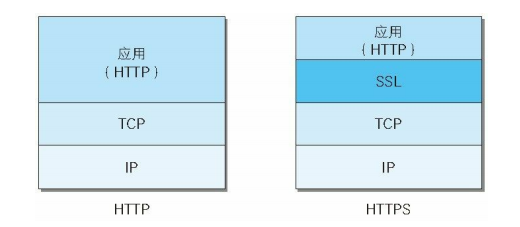
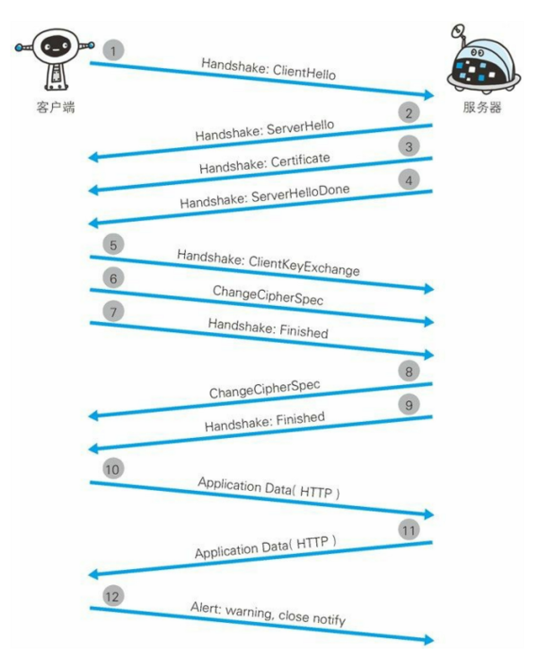
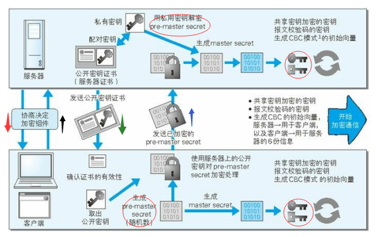

## HTTPS是什么

# 1. HTTP

## 1.1 HTTP 状态码

| 分类 | 分类描述                                       |
| ---- | ---------------------------------------------- |
| 1**  | 信息，服务器收到请求，需要请求者继续执行       |
| 2**  | 成功，操作被成功接收并处理                     |
| 3**  | 重定向，需要进一步的操作以完成请求             |
| 4**  | 客户端错误，请求包含语法错误或无法完成请求     |
| 5**  | 服务器错误，服务器在处理请求的过程中发生了错误 |

| 状态码 | 状态码英文名称                | 中文描述                                                     |
| ------ | ----------------------------- | ------------------------------------------------------------ |
| 100    | Continue                      | 继续，客户端应继续其请求                                     |
| 101    | Switching Protocols           | 切换协议                                                     |
| 200    | OK                            | 请求成功。一般用于GET与POST请求。                            |
| 201    | Created                       | 已创建，成功请求并创建新的资源                               |
| 202    | Accepted                      | 已接受，已经接收请求，但未处理完成                           |
| 203    | Non-Authoritative Information | 非授权信息。请求成功，但返回的meta信息不在原始服务器，而是一个副本 |
| 204    | No Content                    | 无内容。服务器处理成功，但未返回内容。在未更新网页的情况下，可确保浏览器继续显示当前文档。 |
|        |                               |                                                              |
|        |                               |                                                              |

| 状态码 | 状态码英文名称        |      | 中文描述                               |
| ------ | --------------------- | ---- | -------------------------------------- |
| 500    | Internal Server Error |      | 服务器内部错误，无法完成请求。         |
| 501    | Not Implemented       |      | 服务器不支持请求的功能，无法完成请求。 |
| 502    | Bad Gateway           |      | 响应无效                               |
| 503    | Service Unavailable   |      |                                        |
| 504    | GateWay Time-out      |      | 响应超时                               |
| 505    |                       |      |                                        |

#### Http1.x

- **缺陷**：线程阻塞，在同一时间，同一域名的请求有一定数量限制，超过限制数目的请求会被阻塞

#### http1.0

- **缺陷**：浏览器与服务器只保持短暂的连接，浏览器的每次请求都需要与服务器建立一个TCP连接（T**CP连接的新建成本很高，因为需要客户端和服务器三次握手**），服务器完成请求处理后立即断开TCP连接，服务器不跟踪每个客户也不记录过去的请求；
- **解决方案**：
  - 添加头信息——非标准的Connection字段`Connection: keep-alive`

#### http1.1：

- **改进点：**

1. **持久连接**
   - 引入了持久连接，即TCP连接默认不关闭，可以被多个请求复用，不用声明`Connection: keep-alive`(对于同一个域名，大多数浏览器允许同时建立6个持久连接)
2. **管道机制**
   - 即在同一个TCP连接里面，客户端可以同时发送多个请求。
3. **分块传输编码**
   - 即服务端每产生一块数据，就发送一块，采用”流模式”而取代”缓存模式”。
4. **新增请求方式**
   - PUT:请求服务器存储一个资源;
   - DELETE：请求服务器删除标识的资源；
   - OPTIONS：请求查询服务器的性能，或者查询与资源相关的选项和需求；
   - TRACE：请求服务器回送收到的请求信息，主要用于测试或诊断；
   - CONNECT：保留将来使用

- **缺点：**
  - 虽然允许复用TCP连接，但是同一个TCP连接里面，所有的数据通信是**按次序进行**的。服务器只有处理完一个请求，才会接着处理下一个请求。如果前面的处理特别慢，后面就会有许多请求排队等着。这将导致“队头堵塞”
  - **避免方式：**一是减少请求数，二是同时多开持久连接

#### HTTP/2.0

- #### 特点：

  

  1. 采用二进制格式而非文本格式；
  2. 完全多路复用，而非有序并阻塞的、只需一个连接即可实现并行；
  3. 使用报头压缩，降低开销
  4. 服务器推送

**1. 二进制协议**

- HTTP/1.1 版的头信息肯定是文本（ASCII编码），数据体可以是文本，也可以是二进制。HTTP/2 则是一个彻底的二进制协议，头信息和数据体都是二进制，并且统称为”帧”：头信息帧和数据帧。
- 二进制协议解析起来更高效、“线上”更紧凑，更重要的是错误更少。

**2. 完全多路复用**

- HTTP/2 复用TCP连接，在一个连接里，客户端和浏览器都可以同时发送多个请求或回应，而且不用按照顺序一一对应，这样就避免了”队头堵塞”。

**3. 报头压缩**

- HTTP 协议是没有状态，导致每次请求都必须附上所有信息。所以，请求的很多头字段都是重复的，比如Cookie，一样的内容每次请求都必须附带，这会浪费很多带宽，也影响速度。
- 对于相同的头部，不必再通过请求发送，只需发送一次；
- HTTP/2 对这一点做了优化，引入了头信息压缩机制；
- 一方面，头信息使用gzip或compress压缩后再发送；
- 另一方面，客户端和服务器同时维护一张头信息表，所有字段都会存入这个表，产生一个索引号，之后就不发送同样字段了，只需发送索引号。

**4. 服务器推送**

- HTTP/2 允许服务器未经请求，主动向客户端发送资源；
- 通过推送那些服务器任务客户端将会需要的内容到客户端的缓存中，避免往返的延迟

### HTTP存在问题

由于HTTP协议过于简单：

- 通信使用明文（不加密），内容可能会被窃听。
- 不验证通信方的身份，因此可能遭遇伪装
- 无法验证报文的完整性，所以有可能已遭篡改。

为了解决诸多问题，HTTPS应运而生。

### HTTPS的实质

HTTP加上**加密处理**、**认证机制**、以及**完整性保护**后的就是HTTPS。

需要知道的是，HTTPS并非是应用层的一种新的协议。只是HTTP通信接口部分用SSL或TLS协议代替而已。也就是说，所谓的HTTPS，**其实就是身披SSL协议外壳的HTTP。**

值得一提的是，SSL是独立于HTTP协议的，也就是说其他运行在应用层的协议均可配合SSL协议使用。现今SSL是最为广泛的网络安全技术。

### SSL和TLS

HTTPS中使用了SSL和TLS这两个协议。

TLS以SSL3.0为基准，后又制定了TLS1.0、TLS1.1和TLS1.2。当前主流的版本是SSL3.0和TLS1.0。

**TLS是以SSL为原型开发的协议，有时候会统称该协议为SSL。**

## HTTPS的加密原理

近代的加密算法中加密算法是公开的，而密钥是保密的。通过这种方式来保持加密方法的安全性。

加密和解密要用到密钥，如果没有密钥就没有办法对密码解密。换句话来说，任何人只要持有密钥就能够对密文进行解密。

HTTPS在加密过程中使用了**非对称加密技术**和**对称加密技术**。

### 对称加密算法

> 采用单钥密码系统的加密方式，同一个密钥可以同时做信息的加密和解密，这种加密的方法称为对称加密，也称为单密钥加密。

下面会把对称加密算法称为共享密钥加密算法。

假如现在，SSL在通信过程中，使用了对称加密算法，也就是说客户端和服务器同时共享一个密钥。

于是，以共享密钥的方式加密，必须将密钥发给对方。这个时候，假如通信过程被监听，密钥被攻击者获取了，那么这个时候也就失去了加密的意义了。

那么，有没有办法解决这个问题呢？答案是肯定的，也就是使用两把密钥。

下面先看使用两把密钥的非对称加密算法。

### 非对称加密算法

> 与对称加密算法相反，非对称加密算法需要两个密钥来进行加密和解密，这两个密钥是配对的，分别是公开密钥（公钥）和私有密钥（私钥）。

一般情况下，公钥是可以被**公开**的，它主要用来加密明文。而相应的，私钥**不能被公开**，用来解密公钥加密的密文。

值得注意的是：**公钥加密后的密文只能通过对应的私钥来解密，而私钥加密的密文却可以通过对应的公钥来解密。**

以上，公钥加密私钥解密用来加密，私钥加密公钥解密用来签名。相关用途后面会讲到。

下面会把非对称加密算法称为公开密钥加密算法。

于是现在，假设现在由服务器来生成一对公钥和私钥。

当客户端第一次发请求和服务器协商的时候，**服务器就生成了一对公钥和私钥**。

紧接着，服务器把公钥发给客户端（明文，不需要做任何加密），客户端接收后，随机生成一个密钥，**使用服务器发过来的公钥进行加密**。

再接着，客户端把使用公钥加密的密钥发给服务器，服务器接收到了以后，**用配对的私钥进行解密**，就得到了客户端随机生成的那个密钥。

这个时候，客户端和服务端所持的密钥都是相同的。此时，交换密钥环节就完成了。

于是**通信**开始时就可进行上面所述的**共享密钥加密方式**来进行加密。

### 同时使用

可能，有小伙伴就会问，为什么要大费周章使用非对称加密的方式，然后再得到相同的密钥，进行共享密钥加密的通信呢？

由于公开密钥加密处理起来比共享密钥加密方式更为复杂，因此在通信的时候使用公开密钥加密的方式，效率很低。

于是，我们需要使用非对称加密的方式来保证密钥共享的过程中密钥的安全性，而后在通信的过程中使用对称加密算法，这是最合理的设计方式，在保证安全性的同时又保证了性能。

所以，HTTPS采用共享密钥加密和公开密钥加密两者并用的混合加密机制。**在交换密钥使用环节使用公开密钥加密方式，之后建立的通信交换报文阶段则使用共享密钥加密方式。**

以上，大概就是使用对称加密和非对称加密的过程。看似过程很完美，其实还存在着一个问题，就是：**如何保证服务器传过来的公开密钥的正确性。换句话说，就是保证它不被拦截篡改。**

## 使用证书保证公钥的正确性

假如现在正准备和某台服务器建立公开密钥加密方式下的通信，如何证明客户端收到的公钥就是原本预想的那台服务器发行的公开密钥呢？或许，在公钥传输的过程中，真正的公钥可能已经被攻击者替换掉了。

为了解决这个问题，可以使用由数字证书机构和其相关颁发的公开密钥证书。

下面阐述一下数字证书认证机构（简称CA）的业务流程：

首先，服务器的运营人员向数字证书机构提出公开密钥的申请。数字证书认证机构在判明提出申请者的身份之后，会对已申请的公开密钥做数字签名，然后分配这个已签名的公开密钥，并将该公开密钥放入公钥证书后绑定在一起。
我们用**白话文**来翻译一下上面这段话：

- 首先，CA会向申请者颁发一个证书，这个证书里面的内容有：签发者、证书用途、使用的HASH算法、签名所使用的算法、证书到期的时间等等。
- 紧接着，把上面所提到的内容，做一次HASH求值，得到一个HASH值。
- 再接着，用CA的**私钥**对这个HASH值和所使用的HASH算法加密，这样就完成了数字签名。而用CA的私钥加密后，就生成了类似人体指纹的签名，任何篡改证书的尝试，都会被数字签名发现。
- 最后，把数字签名，附在数字证书的末尾，传输给服务器。

接下来，服务器会把这份由数字证书认证机构颁发的公钥证书发给客户端。这个时候，客户端可以使用数字证书机构的公开密钥对其进行验证。一旦验证成功，客户端便能够确定这个公开密钥是可信的。
我们再用**白话文**来翻译一下：

- 客户端拿到这个数字证书以后，用CA私钥对应的公钥，可以解密数字证书末尾的数字签名，得到HASH值和所采用的HASH算法。
- 紧接着，客户端按照解密到的这个HASH算法，对证书的内容求HASH值。如果通过CA公钥解密的HASH和通过计算求得的HASH值相同，那么认证通过，否则失败。
- 如果认证通过，就可以取得服务器的公开密钥。

那客户端上面的CA公钥是从哪里来的呢？

其实，CA除了给申请者发布证书，它自己本身也有自己的证书。CA自身的数字证书（一般由它自己生成）在我们操作系统刚安装好的时候，这些CA自身的数字证书就已经被微软（或者其它操作系统的开发机构）安装在操作系统中了。而CA的公钥就包含在其中。这样，CA就可以通过自身的私钥对发布的数字证书进行签名，而在客户端就能够用对应的公钥来对其进行解密。

其具体过程是这样子的（图中简化了数字签名的过程）：

这里其实就用到了**非对称加密算法**，只不过现在这个加密算法用来**签名**而不是**加密**。

使用私钥加密，公钥解密，用于公钥的持有者验证通过私钥加密的内容是否被篡改，但是不用来保证内容是否被他人获得。

而使用公钥加密，私钥解密，则是相反的，它不保证信息被他人截获篡改，但是保证信息无法被中间人获得。

### 客户端证书

HTTPS中不仅可以使用服务器证书，还可以使用客户端证书。以客户端证书进行客户端认证，它的作用与服务器证书是相同的。

由于客户端获取证书需要用户自行安装客户端证书，同时也面临着费用的问题。

因此，现状是，安全性极高的认证机构可办法客户端证书但是仅用于特殊用途的业务。比如那些可支撑客户端证书支出费用的业务。

例如，银行的网上银行就采用了客户端证书。在登录网银时不仅要求用户确认输入ID和密码，还会要求用户的客户端证书，以确认用户是否从特定的终端访问网银。

## HTTPS通信的过程

现在我们来理清一下SSL建立的过程：

1. 客户端通过发送Client Hello报文开始SSL通信。报文中包含客户端支持的SSL的指定版本、加密组件（Cipher Suite）列表（所使用的加密算法及密钥长度等）。
   注意：客户端还会附加一个**随机数**，这里记为A。

   

2. 服务器可进行SSL通信时，会以Server Hello报文作为应答。和客户端一样，在报文中包含SSL版本以及加密组件。服务器的加密组件内容是从接收到的客户端加密组件内筛选出来的。
   注意：这里服务器同样会附加一个**随机数**，发给客户端，这里记为B。

   

3. 之后服务器发送Certificate报文。报文中包含公开密钥证书。（具体的数字签名请看证书一节）

   

4. 最后服务器发送Server Hello Done报文通知客户端，最初阶段的SSL握手协商部分结束。

   

5. SSL第一次握手结束后，客户端会对服务器发过来的证书进行验证，如果验证成功，解密取出证书中的公钥。（具体查看证书一节）
   接着，客户端以Client Key Exchange报文作为回应。报文中包含通信加密中使用的一种被称为`Pre-master secret`的随机密码串。该报文使用从证书中解密获得的公钥进行加密（其实就是服务器的公钥）。

   

6. 客户端继续发送Change Cipher Spec报文。用于告知服务端，客户端已经切换到之前协商好的加密套件（Cipher Suite）的状态，准备使用之前协商好的加密套件加密数据并传输了。

   

7. 客户端发送Finished报文。该报文包含连接至今全部报文的整体校验值（也就是HASH值），用来供服务器校验。

   

8. 服务器接收到客户端的请求之后，使用私钥解密报文，把`Pre-master secret`取出来。接着，服务器同样发送Change Cipher Spec报文。

   

9. 服务器同样发送Finished报文，用来供客户端校验。

   

10. 服务器和客户端的Finished报文交换完毕之后，SSL连接就算建立完成。当然，通信会受到SSL的保护。从此处开始进行应用层协议的通信，即发送HTTP请求。

    

11. 应用层协议通信，即发送HTTP响应。

    

12. 最后由客户端断开连接。断开连接时，发送close_notify报文。上图做了一些省略，这步之后再发送TCP FIN报文来关闭与TCP的通信。

读到这里，你可能会对上面的一些细节产生很多疑惑，现在我们一个个来理清楚？

#### 问题一

为什么最后客户端和服务端都要发送一个Finish报文？

上面已经提及，Finish报文是对至今全部报文的整体校验值（也就是HASH值）。当客户端把这个值通过得到的公钥进行加密的时候，服务器得到之后对其进行解密，然后再对全部报文进行一个HASH求值。如果这个值跟解密得到的值相等的话，那么说明客户端是可信赖的。
同样的，服务器发送这样的一个整体校验值，用来客户端验证服务器是否是真正要进行通信的那一个。
综上，这个Finish报文就是用来校验双方的身份的。

#### 问题二

整个过程中产生的三个**随机数**有什么用呢？还有，后面进行HTTP通信的时候，是用哪一个密钥进行加密，还有怎么保证报文的完整性。

看下面这张图。

对于**客户端**：
当其生成了`Pre-master secret`之后，会结合原来的A、B随机数，用DH算法计算出一个`master secret`，紧接着根据这个`master secret`推导出`hash secret`和`session secret`。

对于**服务端**：
当其解密获得了`Pre-master secret`之后，会结合原来的A、B随机数，用DH算法计算出一个`master secret`，紧接着根据这个`master secret`推导出`hash secret`和`session secret`。

> 在客户端和服务端的`master secret`是依据三个随机数推导出来的，它是不会在网络上传输的，只有双方知道，不会有第三者知道。同时，客户端推导出来的`session secret`和`hash secret`与服务端也是完全一样的。

那么现在双方如果开始使用对称算法加密来进行通讯，使用哪个作为共享的密钥呢？过程是这样子的：

双方使用对称加密算法进行加密，用`hash secret`对HTTP报文做一次运算生成一个`MAC`，附在HTTP报文的后面，然后用`session-secret`加密所有数据（`HTTP+MAC`），然后发送。

接收方则先用`session-secret`解密数据，然后得到`HTTP+MAC`，再用相同的算法计算出自己的`MAC`，如果两个`MAC`相等，证明数据没有被篡改。

> MAC(Message Authentication Code)称为报文摘要，能够查知报文是否遭到篡改，从而保护报文的完整性。

#### 问题三

为什么要使用三个随机数呢？

网友dog250是这么解释的：

> "不管是客户端还是服务器，都需要随机数，这样生成的密钥才不会每次都一样。由于SSL协议中证书是静态的，因此十分有必要引入一种随机因素来保证协商出来的密钥的随机性。
> 对于RSA密钥交换算法来说，`pre-master secret`本身就是一个随机数，再加上hello消息中的随机，三个随机数通过一个密钥导出器最终导出一个对称密钥。
> `pre-master secret`的存在在于SSL协议不信任每个主机都能产生完全随机的随机数，如果随机数不随机，那么`pre-master secret`就有可能被猜出来，那么仅适用`pre-master secret`作为密钥就不合适了，因此必须引入新的随机因素，那么客户端和服务器加上`pre-master secret`三个随机数一同生成的密钥就不容易被猜出了，一个伪随机可能完全不随机，可是是三个伪随机就十分接近随机了，每增加一个自由度，随机性增加的可不是一。"

注：我们在计算机所使用的随机数都是伪随机，而不是物理上所说的真正随机。

另外，黑客可能拦截了这样的一个加密的报文，他不对报文进行修改，而是不停的向报文的接受者发送重复的报文，以扰乱通信的建立。于是，就可以加这么一个随机数。只要任何一个通信方，接收到的报文中的随机数出现重复的情况，就可以知道有中间者对通信的过程进行了扰乱，可以立即中断通信。

#### 问题四

如果黑客拦截了服务器把证书发送给客户端，并对证书进行恶意修改，会出现什么情况？

第一种情况，假如黑客只是单纯的修改数字证书中的内容，那么由于数字签名的存在，客户端会很容易的判断出报文是否被篡改。

第二种情况，黑客不仅修改了数字证书的内容，并且把数字签名替换掉了，由于黑客不可能知道CA的私钥，于是在客户端用CA的公钥进行解密的时候，解密之后得不到正确的信息，也很容易判断出报文是否被修改。

第三种情况，黑客恶意的从相同的第三方CA申请了一个数字证书。由于这个CA是真实存在的，所以客户端是可以用CA的公钥进行解密，得到了黑客提供的数字证书中的公钥。但是，由于数字证书在申请的时候，会绑定一个**域名**，当客户端比如说浏览器，检测到这个数字证书中的域名和我们现在网页访问的域名不一致，便会发出警告，此时我们也能得知数字证书被替换了。发出的警告如下：

## 一定要用HTTPS吗

当HTTP披上SSL外壳之后，由于加入了诸多验证的机制，虽然安全性大大提高了，但是它的处理速度会变慢。慢的原因分以下两种：

- 服务器在与客户端协商次数增多，也就是说整体上处理**通信量**会不可避免的增加。
- SSL进行加密处理，在服务端和客户端都需要进行加密和解密的**运算处理**。结果会消耗更多的硬件资源，导致负载增加。

可见，使用HTTPS会消耗更多的资源。如果每次通信都加密，那么平摊到一台计算机上，能够处理的请求数量也必定会减少。

同时，使用HTTPS需要向CA购买证书，于是**开销**也成为考虑是否使用HTTPS的原因之一。

所以，大部分的Web网站都采取了一个折中的方法。对于一些需要隐藏、私密的信息进行加密，而普通的信息不进行加密处理，以节省资源。

## fiddler拦截HTTPS请求的原理

很多时候我们可以通过fiddler来进行抓HTTP包，但是当遇到连接采用的是HTTPS的时候，过程可能就不那么愉快了。但实际上实现拦截也十分简单。

fiddler拦截HTTPS请求最核心的地方在于真正的**客户端**需要**安装fiddler的证书**。这样子的话，fiddler能够伪造出CA证书，达到欺骗客户端，拿到需要的信息并推算出之后双方正常通信的对称加密密钥。

## 最后

这学期刚好有《信息安全》这门课程，那就简明的介绍一下公钥密码密码体系RSA算法原理是什么。

它是这样子工作的：

1. 选取两个大素数`p`和`q`，相乘得到`n`。
2. `p-1`和`q-1`相乘，得到`f(n)`。
3. 随机选取一个`e`与`f(n)`互质，然后得到公钥`(e, n)`。
4. 私钥的求法为`ed = 1 mod f(n)`。 [这是一个等价关系而不是一个表达式！也就是`ed`模`fn(n)`的结果是1，这是求模运算的逆运算，可以用欧几里德辗转相除法求得]
5. 最后得到的私钥为`(d, n)`。

> 整个RSA公钥密码算法的难度其实在于分解这一个大数`n`，`pq=n`正向运算很容易，逆向运算很困难，随着这个数越来越大，想要逆向分解需要很多年的时间。

