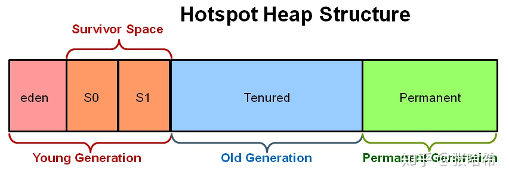
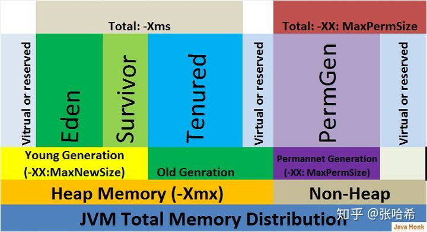
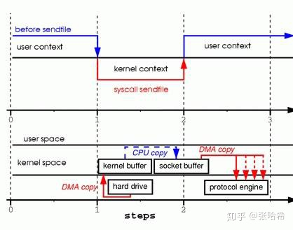
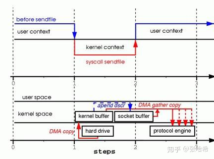
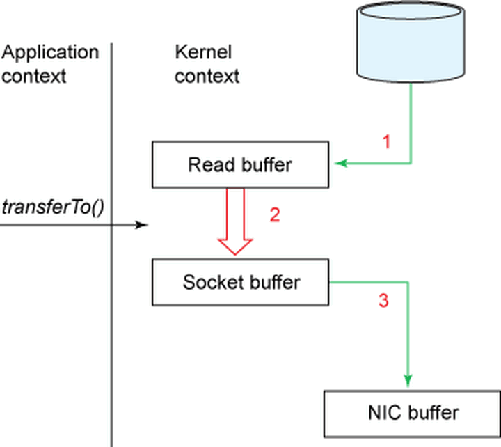
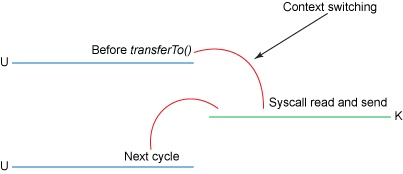
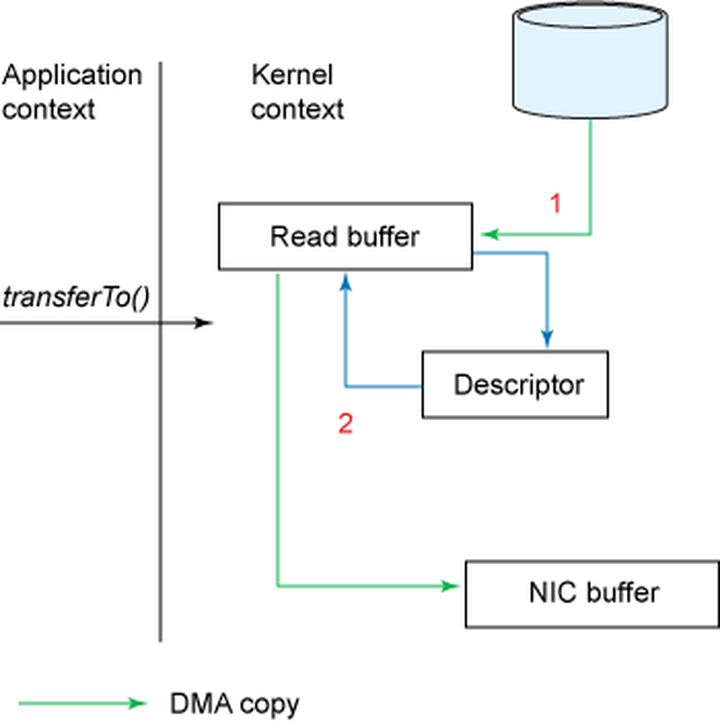
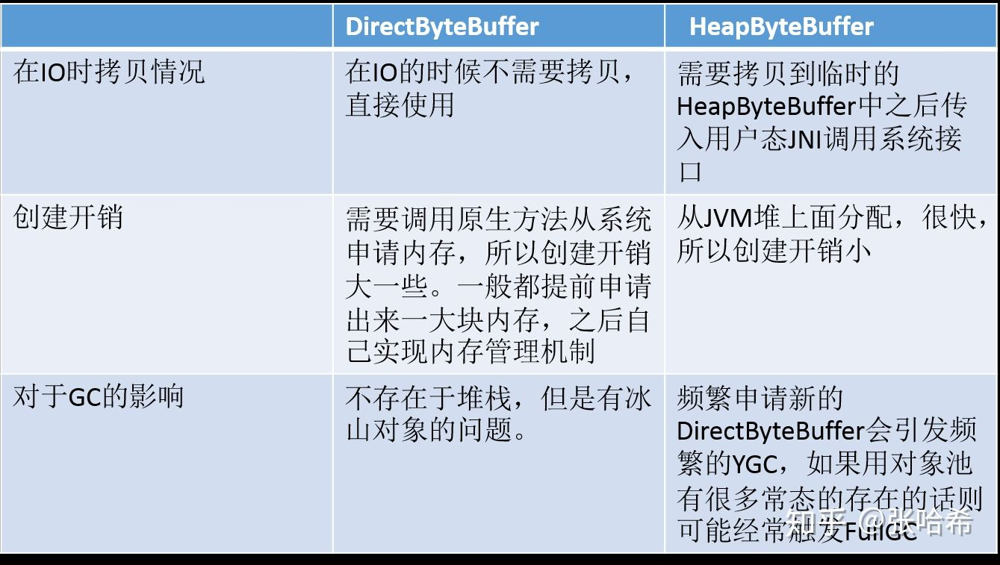
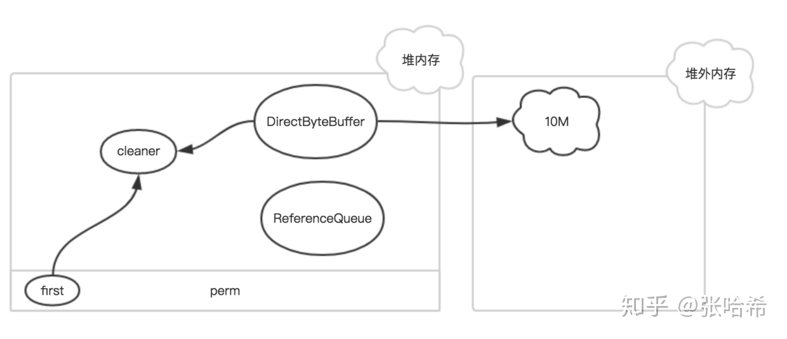
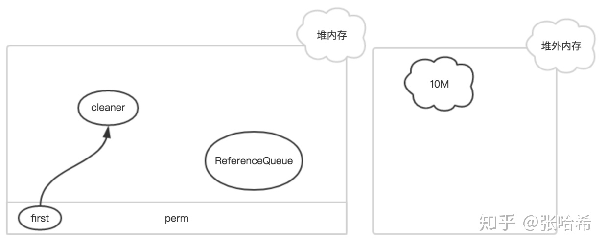

## Java堆栈内存与堆外内存

参考至：[Java 堆外内存、零拷贝、直接内存以及针对于NIO中的FileChannel的思考 - 知乎 (zhihu.com)](https://zhuanlan.zhihu.com/p/161939673)

## 1. 堆栈内存

堆栈内存指的是堆内存和栈内存：堆内存是GC管理的内存，栈内存是线程内存。

堆内存结构：





还有一个更细致的结构图（包括MetaSpace还有code cache）：

**注意在Java8以后PermGen被MetaSpace代替，运行时可自动扩容，并且默认是无限大**




我们看下面一段代码来简单理解下堆栈的关系：

```text
public static void main(String[] args) {
    Object o = new Object();
}
```

其中`new Object()`是在堆上面分配，而Object o这个变量，是在main这个线程栈上面。

- 应用程序所有的部分都使用堆内存，然后栈内存通过一个线程运行来使用。
- 不论对象什么时候创建，他都会存储在堆内存中，栈内存包含它的引用。栈内存只包含原始值变量好和堆中对象变量的引用。
- 存储在堆中的对象是全局可以被访问的，然而栈内存不能被其他线程所访问。
- 通过JVM参数`-Xmx`我们可以指定最大堆内存大小，通过`-Xss`我们可以指定每个线程线程栈占用内存大小

## 2. 堆外内存

### 2.1. 广义的堆外内存

除了堆栈内存，剩下的就都是堆外内存了，包括了jvm本身在运行过程中分配的内存，codecache，jni里分配的内存，DirectByteBuffer分配的内存等等

### 2.2. 狭义的堆外内存 - DirectByteBuffer

而作为java开发者，我们常说的堆外内存溢出了，其实是狭义的堆外内存，这个主要是指java.nio.DirectByteBuffer在创建的时候分配内存，我们这篇文章里也主要是讲狭义的堆外内存，因为它和我们平时碰到的问题比较密切

**为啥要使用堆外内存。通常因为：**

- 在进程间可以共享，减少虚拟机间的复制
- 对垃圾回收停顿的改善：如果应用某些长期存活并大量存在的对象，经常会出发YGC或者FullGC，可以考虑把这些对象放到堆外。过大的堆会影响Java应用的性能。如果使用堆外内存的话，堆外内存是直接受操作系统管理( 而不是虚拟机 )。这样做的结果就是能保持一个较小的堆内内存，以减少垃圾收集对应用的影响。
- 在某些场景下可以提升程序I/O操纵的性能。少去了将数据从堆内内存拷贝到堆外内存的步骤。

## 3. JNI调用与内核态及用户态

- 内核态：cpu可以访问内存的所有数据，包括外围设备，例如硬盘，网卡，cpu也可以将自己从一个程序切换到另一个程序。
- 用户态：只能受限的访问内存，且不允许访问外围设备，占用cpu的能力被剥夺，cpu资源可以被其他程序获取。
- 系统调用：为了使上层应用能够访问到这些资源，内核为上层应用提供访问的接口

**Java调用原生方法即JNI就是系统调用的一种。**

我们举个例子，文件读取；Java本身并不能读取文件，因为用户态没有权限访问外围设备。需要通过系统调用切换内核态进行读取。

目前，JAVA的IO方式有基于流的传统IO还有基于块的NIO方式（虽然文件读取其实不是严格意义上的NIO，哈哈）。面向流意味着从流中一次可以读取一个或多个字节，拿到读取的这些做什么你说了算，这里没有任何缓存（这里指的是使用流没有任何缓存，接收或者发送的数据是缓存到操作系统中的，流就像一根水管从操作系统的缓存中读取数据）而且只能顺序从流中读取数据，如果需要跳过一些字节或者再读取已经读过的字节，你必须将从流中读取的数据先缓存起来。面向块的处理方式有些不同，数据是先被 读/写到buffer中的，根据需要你可以控制读取什么位置的数据。这在处理的过程中给用户多了一些灵活性，然而，你需要额外做的工作是检查你需要的数据是否已经全部到了buffer中，你还需要保证当有更多的数据进入buffer中时，buffer中未处理的数据不会被覆盖。

我们这里只分析基于块的NIO方式，在JAVA中这个块就是ByteBuffer。

## 4. Linux下零拷贝原理

大部分web服务器都要处理大量的静态内容，而其中大部分都是从磁盘文件中读取数据然后写到socket中。我们以这个过程为例子，来看下不同模式下Linux工作流程

### 4.1. 普通Read/Write模式

涉及的代码抽象：

```text
//从文件中读取，存入tmp_buf
read(file, tmp_buf, len);
//将tmp_buf写入socket
write(socket, tmp_buf, len);
```

看上去很简单的步骤但是经过了很多复制：

1. 当调用 read 系统调用时，通过 DMA（Direct Memory Access）将数据 copy 到内核模式
2. 然后由 CPU 控制将内核模式数据 copy 到用户模式下的 buffer 中
3. read 调用完成后，write 调用首先将用户模式下 buffer 中的数据 copy 到内核模式下的 socket buffer 中
4. 最后通过 DMA copy 将内核模式下的 socket buffer 中的数据 copy 到网卡设备中传送。

从上面的过程可以看出，数据白白从内核模式到用户模式走了一圈，浪费了两次 copy(第一次，从kernel模式拷贝到user模式；第二次从user模式再拷贝回kernel模式，即上面4次过程的第2和3步骤。)，而这两次 copy 都是 CPU copy，即占用CPU资源

### 4.2. sendfile模式





通过 sendfile 传送文件只需要一次系统调用，当调用 sendfile 时：

1. 首先通过 DMA copy 将数据从磁盘读取到 kernel buffer 中
2. 然后通过 CPU copy 将数据从 kernel buffer copy 到 sokcet buffer 中
3. 最终通过 DMA copy 将 socket buffer 中数据 copy 到网卡 buffer 中发送 sendfile 与 read/write 方式相比，少了 一次模式切换一次 CPU copy。但是从上述过程中也可以发现从 kernel buffer 中将数据 copy 到socket buffer 是没必要的。

### 4.3. sendfile模式改进

Linux2.4 内核对sendFile模式进行了改进：




改进后的处理过程如下：

1. DMA copy 将磁盘数据 copy 到 kernel buffer 中 2.向 socket buffer 中追加当前要发送的数据在 kernel buffer 中的位置和偏移量
2. DMA gather copy 根据 socket buffer 中的位置和偏移量直接将 kernel buffer 中的数据 copy 到网卡上。

经过上述过程，数据只经过了 2 次 copy 就从磁盘传送出去了。（事实上这个 Zero copy 是针对内核来讲的，数据在内核模式下是 Zero－copy 的）。

当前许多高性能 http server 都引入了 sendfile 机制，如 nginx，lighttpd 等。

## 5. Java零拷贝实现的变化

Zero-Copy技术省去了将操作系统的read buffer拷贝到程序的buffer，以及从程序buffer拷贝到socket buffer的步骤，直接将read buffer拷贝到socket buffer. Java NIO中的FileChannal.transferTo()方法就是这样的实现

```text
public void transferTo(long position,long count,WritableByteChannel target);
```

transferTo()方法将数据从一个channel传输到另一个可写的channel上，其内部实现依赖于操作系统对zero copy技术的支持。在unix操作系统和各种linux的发型版本中，这种功能最终是通过sendfile()系统调用实现。下边就是这个方法的定义：

```text
#include <sys/socket.h>
ssize_t sendfile(int out_fd, int in_fd, off_t *offset, size_t count);
```

### 5.1. Linux 2.4之前的底层实现

和之前所述一样，我们用下面两幅图更清楚的展示一下发生的复制以及内核态用户态切换：







内核、用户态切换的次数只有两次，将数据的复制次只有三次(只有一次用到cpu资源) 在Linux2.4之后，我们可以将这仅有的一次cpu复制也去掉

### 5.2. Linux 2.4之后的底层实现





在内核为2.4或者以上版本的linux系统上，socket缓冲区描述符将被用来满足这个需求。这个方式不仅减少了内核用户态间的切换，而且也省去了那次需要cpu参与的复制过程。 从用户角度来看依旧是调用transferTo()方法，但是其本质发生了变化：

1. 调用transferTo方法后数据被DMA从文件复制到了内核的一个缓冲区中。
2. 数据不再被复制到socket关联的缓冲区中了，仅仅是将一个描述符（包含了数据的位置和长度等信息）追加到socket关联的缓冲区中。DMA直接将内核中的缓冲区中的数据传输给协议引擎，消除了仅剩的一次需要cpu周期的数据复制。

### 5.3 对于JAVA普通字节流IO与NIOFileChannel实现的零拷贝性能：

直接上源码：

```java
import java.io.BufferedInputStream;
import java.io.BufferedOutputStream;
import java.io.File;
import java.io.FileInputStream;
import java.io.FileNotFoundException;
import java.io.FileOutputStream;
import java.io.IOException;
import java.io.InputStream;
import java.io.OutputStream;
import java.nio.channels.FileChannel;

public class FileCopyTest {

    /**
     * 通过字节流的方式复制文件
     * @param fromFile 源文件
     * @param toFile   目标文件
     * @throws FileNotFoundException 未找到文件异常
     */
    public static void fileCopyNormal(File fromFile, File toFile) throws FileNotFoundException {
        InputStream inputStream = null;
        OutputStream outputStream = null;
        try {
            inputStream = new BufferedInputStream(new FileInputStream(fromFile));
            outputStream = new BufferedOutputStream(new FileOutputStream(toFile));
            //用户态缓冲有1kB这么大，不算小了
            byte[] bytes = new byte[1024];
            int i;
            //读取到输入流数据，然后写入到输出流中去，实现复制
            while ((i = inputStream.read(bytes)) != -1) {
                outputStream.write(bytes, 0, i);
            }
        } catch (Exception e) {
            e.printStackTrace();
        } finally {
            try {
                if (inputStream != null) {
                    inputStream.close();
                }
                if (outputStream != null) {
                    outputStream.close();
                }
            } catch (IOException e) {
                e.printStackTrace();
            }
        }
    }

    /**
     * 用filechannel进行文件复制
     *
     * @param fromFile 源文件
     * @param toFile   目标文件
     */
    public static void fileCopyWithFileChannel(File fromFile, File toFile) {
        FileInputStream fileInputStream = null;
        FileOutputStream fileOutputStream = null;
        FileChannel fileChannelInput = null;
        FileChannel fileChannelOutput = null;
        try {
            fileInputStream = new FileInputStream(fromFile);
            fileOutputStream = new FileOutputStream(toFile);
            //得到fileInputStream的文件通道
            fileChannelInput = fileInputStream.getChannel();
            //得到fileOutputStream的文件通道
            fileChannelOutput = fileOutputStream.getChannel();
            //将fileChannelInput通道的数据，写入到fileChannelOutput通道
            fileChannelInput.transferTo(0, fileChannelInput.size(), fileChannelOutput);
        } catch (IOException e) {
            e.printStackTrace();
        } finally {
            try {
                if (fileInputStream != null) {
                    fileInputStream.close();
                }
                if (fileChannelInput != null) {
                    fileChannelInput.close();
                }
                if (fileOutputStream != null) {
                    fileOutputStream.close();
                }
                if (fileChannelOutput != null) {
                    fileChannelOutput.close();
                }
            } catch (IOException e) {
                e.printStackTrace();
            }
        }
    }

    public static void main(String[] args) throws IOException {
        File fromFile = new File("D:/readFile.txt");
        File toFile = new File("D:/outputFile.txt");

        //预热
        fileCopyNormal(fromFile, toFile);
        fileCopyWithFileChannel(fromFile, toFile);

        //计时
        long start = System.currentTimeMillis();
        for (int i = 0; i < 1000; i++) {
            fileCopyNormal(fromFile, toFile);
        }
        System.out.println("fileCopyNormal time: " + (System.currentTimeMillis() - start));

        start = System.currentTimeMillis();
        for (int i = 0; i < 1000; i++) {
            fileCopyWithFileChannel(fromFile, toFile);
        }
        System.out.println("fileCopyWithFileChannel time: " + (System.currentTimeMillis() - start));
    }
}
```

测试结果：

```text
fileCopyNormal time: 14271
fileCopyWithFileChannel time: 6632
```

差了一倍多的时间（文件大小大概8MB），如果文件更大这个差距应该更加明显。

## 6. DirectBuffer分配

Java中NIO的核心缓冲就是ByteBuffer，所有的IO操作都是通过这个ByteBuffer进行的；Bytebuffer有两种： **分配HeapByteBuffer**

```java
ByteBuffer buffer = ByteBuffer.allocate(int capacity);
```

**分配DirectByteBuffer**

```java
ByteBuffer buffer = ByteBuffer.allocateDirect(int capacity);
```

两者的区别：




### 6.1. 为何HeapByteBuffer会多一次拷贝？

### 6.1.1. FileChannel的force api说明

FileChannel的force方法： FileChannel.force()方法将通道里尚未写入磁盘的数据强制写到磁盘上。出于性能方面的考虑，操作系统会将数据缓存在内存中，所以无法保证写入到FileChannel里的数据一定会即时写到磁盘上。要保证这一点，需要调用force()方法。 force()方法有一个boolean类型的参数，指明是否同时将文件元数据（权限信息等）写到磁盘上。

### 6.1.2. FileChannel和SocketChannel依赖的IOUtil源码解析

无论是FileChannel还是SocketChannel，他们的读写方法都依赖IOUtil的相同方法，我们这里来看下： **IOUtil.java**

```java
static int write(FileDescriptor var0, ByteBuffer var1, long var2, NativeDispatcher var4) throws IOException {
    //如果是DirectBuffer，直接写
    if (var1 instanceof DirectBuffer) {
        return writeFromNativeBuffer(var0, var1, var2, var4);
    } else {
        //非DirectBuffer
        //获取已经读取到的位置
        int var5 = var1.position();
        //获取可以读到的位置
        int var6 = var1.limit();

        assert var5 <= var6;
        //申请一个源buffer可读大小的DirectByteBuffer
        int var7 = var5 <= var6 ? var6 - var5 : 0;
        ByteBuffer var8 = Util.getTemporaryDirectBuffer(var7);

        int var10;
        try {

            var8.put(var1);
            var8.flip();
            var1.position(var5);
            //通过DirectBuffer写
            int var9 = writeFromNativeBuffer(var0, var8, var2, var4);
            if (var9 > 0) {
                var1.position(var5 + var9);
            }

            var10 = var9;
        } finally {
            //回收分配的DirectByteBuffer
            Util.offerFirstTemporaryDirectBuffer(var8);
        }

        return var10;
    }
}
//读的方法和写类似，这里省略
```

### 6.1.3. 为何一定要复制到DirectByteBuffer来读写（系统调用）

首先，先说一点，执行native方法的线程，被认为是处于SafePoint，所以，会发生 NIO 如果不复制到 DirectByteBuffer，就会有 GC 发生重排列对象内存的情况（可以参考我的另一篇文章： [https://blog.csdn.net/zhxdick/article/details/107450858）。](https://link.zhihu.com/?target=https%3A//blog.csdn.net/zhxdick/article/details/107450858%EF%BC%89%E3%80%82)

传统 BIO 是面向 Stream 的，底层实现可以理解为写入的是 byte 数组，调用 native 方法写入 IO，传的参数是这个数组，就算GC改变了内存地址，但是拿这个数组的引用照样能找到最新的地址，，对应的方法时是：FileOutputStream.write

```java
private native void writeBytes(byte b[], int off, int len, boolean append)
        throws IOException;
```

但是NIO，为了提升效率，传的是内存地址，省去了一次间接应用，但是就必须用 DirectByteBuffer 防止内存地址改变，对应的是 NativeDispatcher.write

```java
abstract int write(FileDescriptor fd, long address, int len)
        throws IOException;
```

那为何内存地址会改变呢？GC会回收无用对象，同时还会进行碎片整理，移动对象在内存中的位置，来减少内存碎片。DirectByteBuffer不受GC控制。如果不用DirectByteBuffer而是用HeapByteBuffer，如果在调用系统调用时，发生了GC，导致HeapByteBuffer内存位置发生了变化，但是内核态并不能感知到这个变化导致系统调用读取或者写入错误的数据。所以一定要通过不受GC影响的DirectByteBuffer来进行IO系统调用。

假设我们要从网络中读入一段数据，再把这段数据发送出去的话，采用Non-direct ByteBuffer的流程是这样的：

```text
网络 –> 临时的DirectByteBuffer –> 应用 Non-direct ByteBuffer –> 临时的Direct ByteBuffer –> 网络
```

这种方式是直接在堆外分配一个内存(即，native memory)来存储数据， 程序通过JNI直接将数据读/写到堆外内存中。因为数据直接写入到了堆外内存中，所以这种方式就不会再在JVM管控的堆内再分配内存来存储数据了，也就不存在堆内内存和堆外内存数据拷贝的操作了。这样在进行I/O操作时，只需要将这个堆外内存地址传给JNI的I/O的函数就好了。

采用Direct ByteBuffer的流程是这样的：

```text
网络 –> 应用 Direct ByteBuffer –> 网络
```

可以看到，除开构造和析构临时Direct ByteBuffer的时间外，起码还能节约两次内存拷贝的时间。那么是否在任何情况下都采用Direct Buffer呢？

不是。对于大部分应用而言，两次内存拷贝的时间几乎可以忽略不计，而构造和析构DirectBuffer的时间却相对较长。在JVM的实现当中，某些方法会缓存一部分临时Direct ByteBuffer，意味着如果采用Direct ByteBuffer仅仅能节约掉两次内存拷贝的时间， 而无法节约构造和析构的时间。就用Sun的实现来说，write(ByteBuffer)和read(ByteBuffer)方法都会缓存临时Direct ByteBuffer，而write(ByteBuffer[])和read(ByteBuffer[])每次都生成新的临时Direct ByteBuffer。

### 6.2. ByteBuffer创建

### 6.2.1. ByteBuffer创建HeapByteBuffer

分配在堆上的，直接由Java虚拟机负责垃圾收集，你可以把它想象成一个字节数组的包装类

```java
class HeapByteBuffer
    extends ByteBuffer
{
    HeapByteBuffer(int cap, int lim) {            // package-private
        super(-1, 0, lim, cap, new byte[cap], 0);
        /*
        hb = new byte[cap];
        offset = 0;
        */
    }
}
    
public abstract class ByteBuffer
    extends Buffer
    implements Comparable<ByteBuffer>
{
    // These fields are declared here rather than in Heap-X-Buffer in order to
    // reduce the number of virtual method invocations needed to access these
    // values, which is especially costly when coding small buffers.
    //
    final byte[] hb;                  // Non-null only for heap buffers
    final int offset;
    boolean isReadOnly;                 // Valid only for heap buffers
    // Creates a new buffer with the given mark, position, limit, capacity,
    // backing array, and array offset
    //
    ByteBuffer(int mark, int pos, int lim, int cap,   // package-private
                 byte[] hb, int offset)
    {
        super(mark, pos, lim, cap);
        this.hb = hb;
        this.offset = offset;
    }
```

### 6.2.2. DirectByteBuffer

这个类就没有HeapByteBuffer简单了

```java
DirectByteBuffer(int cap) {                   // package-private
    super(-1, 0, cap, cap);
    boolean pa = VM.isDirectMemoryPageAligned();
    int ps = Bits.pageSize();
    long size = Math.max(1L, (long)cap + (pa ? ps : 0));
    Bits.reserveMemory(size, cap);
    long base = 0;
    try {
        base = unsafe.allocateMemory(size);
    } catch (OutOfMemoryError x) {
        Bits.unreserveMemory(size, cap);
        throw x;
    }
    unsafe.setMemory(base, size, (byte) 0);
    if (pa && (base % ps != 0)) {
        // Round up to page boundary
        address = base + ps - (base & (ps - 1));
    } else {
        address = base;
    }
    cleaner = Cleaner.create(this, new Deallocator(base, size, cap));
    att = null;
```

Bits.reserveMemory(size, cap) 方法

```java
static void reserveMemory(long size, int cap) {
    synchronized (Bits.class) {
        if (!memoryLimitSet && VM.isBooted()) {
            maxMemory = VM.maxDirectMemory();
            memoryLimitSet = true;
        }
        // -XX:MaxDirectMemorySize limits the total capacity rather than the
        // actual memory usage, which will differ when buffers are page
        // aligned.
        if (cap <= maxMemory - totalCapacity) {
            reservedMemory += size;
            totalCapacity += cap;
            count++;
            return;
        }
    }
    System.gc();
    try {
        Thread.sleep(100);
    } catch (InterruptedException x) {
        // Restore interrupt status
        Thread.currentThread().interrupt();
    }
    synchronized (Bits.class) {
        if (totalCapacity + cap > maxMemory)
            throw new OutOfMemoryError("Direct buffer memory");
        reservedMemory += size;
        totalCapacity += cap;
        count++;
    }
}
```

在DirectByteBuffer中，首先向Bits类申请额度，Bits类有一个全局的totalCapacity变量，记录着全部DirectByteBuffer的总大小，每次申请，都先看看是否超限,堆外内存的限额默认与堆内内存(由-Xmx 设定)相仿，可用 -XX:MaxDirectMemorySize 重新设定。

> 如果不指定，该参数的默认值为Xmx的值减去1个Survior区的值。 如设置启动参数-Xmx20M -Xmn10M -XX：SurvivorRatio=8,那么申请20M-1M=19M的DirectMemory

如果已经超限，会主动执行Sytem.gc()，期待能主动回收一点堆外内存。System.gc()会触发一个full gc，当然前提是你没有显示的设置-XX:+DisableExplicitGC来禁用显式GC。并且你需要知道，调用System.gc()并不能够保证full gc马上就能被执行。然后休眠一百毫秒，看看totalCapacity降下来没有，如果内存还是不足，就抛出OOM异常。如果额度被批准，就调用大名鼎鼎的sun.misc.Unsafe去分配内存,返回内存基地址

**所以，一般的框架里面，会在启动时申请一大块DirectByteBuffer，然后自己做内存管理**

最后，创建一个Cleaner，并把代表清理动作的Deallocator类绑定 – 降低Bits里的totalCapacity，并调用Unsafe调free去释放内存。

### 6.2.3. ByteBuffer回收

HeapByteBuffer就不要说了，GC就帮忙处理了。这儿主要说下DirectByteBuffer 存在于堆内的DirectByteBuffer对象很小，只存着基地址和大小等几个属性，和一个Cleaner，但它代表着后面所分配的一大段内存，是所谓的冰山对象。



其中first是Cleaner类的静态变量，Cleaner对象在初始化时会被添加到Clener链表中，和first形成引用关系，ReferenceQueue是用来保存需要回收的Cleaner对象。

如果该DirectByteBuffer对象在一次GC中被回收了



此时，只有Cleaner对象唯一保存了堆外内存的数据（开始地址、大小和容量），在下一次Full GC时，把该Cleaner对象放入到ReferenceQueue中，并触发clean方法。

快速回顾一下堆内的GC机制，当新生代满了，就会发生young gc；如果此时对象还没失效，就不会被回收；撑过几次young gc后，对象被迁移到老生代；当老生代也满了，就会发生full gc。

这里可以看到一种尴尬的情况，因为DirectByteBuffer本身的个头很小，只要熬过了young gc，即使已经失效了也能在老生代里舒服的呆着，不容易把老生代撑爆触发full gc，如果没有别的大块头进入老生代触发full gc，就一直在那耗着，占着一大片堆外内存不释放。

这时，就只能靠前面提到的申请额度超限时触发的system.gc()来救场了。但这道最后的保险其实也不很好，首先它会中断整个进程，然后它让当前线程睡了整整一百毫秒，而且如果gc没在一百毫秒内完成，它仍然会无情的抛出OOM异常。还有，万一，万一大家迷信某个调优指南设置了-DisableExplicitGC禁止了system.gc()，那就不好玩了。

所以，堆外内存还是自己主动点回收更好，比如Netty就是这么做的

## 7. 查看DirectBuffer使用情况的方法：

### 7.1. 进程内获取：

```text
MBeanServer mbs = ManagementFactory. getPlatformMBeanServer() ;
ObjectName objectName = new ObjectName("java.nio:type=BufferPool,name=direct" ) ;
MBeanInfo info = mbs.getMBeanInfo(objectName) ;
for(MBeanAttributeInfo i : info.getAttributes()) {
    System.out .println(i.getName() + ":" + mbs.getAttribute(objectName , i.getName()));
}
```

### 7.2. 远程进程

JMX获取 如果目标机器没有启动JMX，那么添加jvm参数：

```text
-Dcom.sun.management.jmxremote.port=9999 
-Dcom.sun.management.jmxremote.authenticate=false 
-Dcom.sun.management.jmxremotAe.ssl=false
```

重启进程 然后本机通过JMX连接访问：

```text
String jmxURL = "service:jmx:rmi:///jndi/rmi://10.125.6.204:9999/jmxrmi" ;
JMXServiceURL serviceURL = new JMXServiceURL(jmxURL);
Map map = new HashMap() ;
String[] credentials = new String[] { "monitorRole" , "QED" } ;
map.put( "jmx.remote.credentials" , credentials) ;
JMXConnector connector = JMXConnectorFactory. connect(serviceURL , map);
MBeanServerConnection mbsc = connector.getMBeanServerConnection() ;
ObjectName objectName = new ObjectName("java.nio:type=BufferPool,name=direct" ) ;
MBeanInfo mbInfo = mbsc.getMBeanInfo(objectName) ;
for(MBeanAttributeInfo i : mbInfo.getAttributes()) {
    System.out .println(i.getName() + ":" + mbsc.getAttribute(objectName , i.getName()));
}
```

本地也可以通过 JConsole 工具查看：

**但是注意，采集不要太频繁。否则会触发所有线程进入安全点（也就是 Stop the world）**