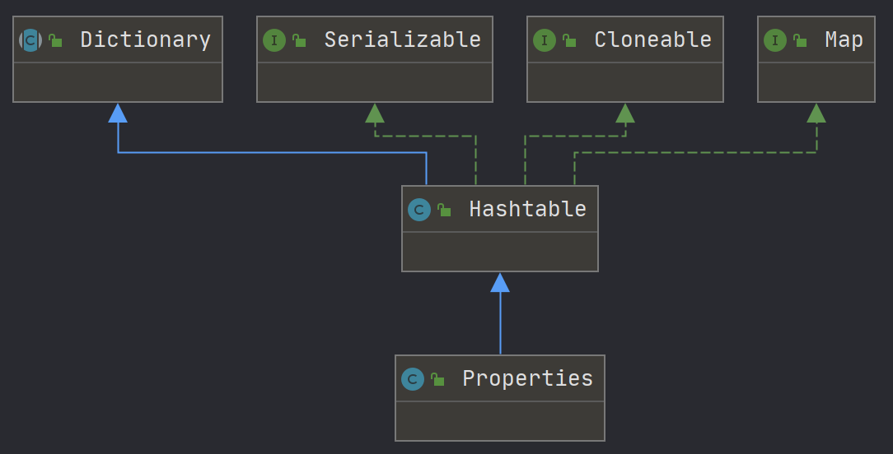

# Properties



它提供了几个主要方法：

1. `getProperty(String key)`，用指定的键在此属性列表中搜索属性。也就是通过参数key，得到key所对应的value。
2. `load(InputStream inStream)`，从输入流中读取属性列表（键和元素对）。
3. `setProperty(String key, String value)`，调用Hashtable的方法put。他通过调用基类的put方法来设置键值对。
4. `store(OutputStream out, String comments)`，使用load方法加载到Properties表中的格式，将此Properties表中的属性列表（键和元素对）写入输入流。与load方法相反，该方法将键值对写入到指定的文件中去。 
5. `clear()`，清除所有装载的键值对。该方法在基类中提供。

### 2. 读取文件

```java
InputStream in = getClass().getResourceAsStream("资源Name");
```


