# 安装

[Redis](https://www.linuxidc.com/topicnews.aspx?tid=22) (远程字典服务器Remote Dictionary Server)是一个开源的内存数据库，用作缓存和消息代理。它也被称为数据结构服务器。它与其他主要数据库的不同之处在于它能够存储高级数据类型（包括地图，列表，集合等），易于使用的界面，对数据进行原子操作以及其他人无法找到的出色性能现有数据库。

这就是在本教程中，我们将向您展示如何在[Ubuntu](https://www.linuxidc.com/topicnews.aspx?tid=2) 18.04上安装Redis。

为什么要使用Redis？

如上所述，Redis的性能和卓越功能使其比传统数据库更好。 Redis的典型用法是：

- 缓存–其增强的数据持久存储到磁盘的能力使其成为传统缓存解决方案的一个更好的选择
- 队列– Redis可用于在后台对作业进行排队。
- 数器-Redis允许简单地创建和实现计数器，而无需读取数据或更新数据库的方案。 Redis中的计数器将保持一致
- 发布和订阅–用户可以使用“发布/订阅”范式轻松分发数据

**如何在Ubuntu上安装Redis？**

Redis存在于Ubuntu的官方软件包存储库中。现在让我们在Ubuntu上安装Redis：

1、更新APT存储库缓存

为了安装Redis，首先需要更新Ubuntu的APT存储库缓存。您可以使用以下命令进行操作：

[linuxidc@linux:~/www.linuxidc.com]$ `sudo apt update`

2、使用APT命令在Ubuntu上安装Redis

[linuxidc@linux:~/www.linuxidc.com]$ `sudo apt install redis`


按y，然后按Enter键继续。

3、检查Redis版本

为了检查Redis是否正确安装并正常工作，可以输入以下命令：

[linuxidc@linux:~/www.linuxidc.com]$ redis-cli --version


输出将显示计算机上当前安装的实用程序的版本。

**启动和停止Redis**

完成安装后，可以检查Redis是否正在运行。 您可以使用以下命令执行此操作：

[linuxidc@linux:~/www.linuxidc.com]$ sudo systemctl status redis

In the output, locate Active: active (running).

在输出中，找到“ Active**: active (running)**“。


如果尚未启动Redis，则可以通过输入以下命令来启动它：

[linuxidc@linux:~/www.linuxidc.com]$ `sudo systemctl start redis-server`

如果Redis已经在运行并且要停止它，则可以使用以下命令：

[linuxidc@linux:~/www.linuxidc.com]$ `sudo systemctl stop redis`

此后，您将在本节中第一个命令的输出中看到“**Active: inactive (dead)** ”。


**如何在Ubuntu上配置Redis服务器**

Redis的默认配置位于/etc/redis/redis.conf中。 默认情况下，服务器侦听来自服务器上所有可用接口的连接。 您可以让它侦听您选择的接口，根据需要可以是一个或多个接口。 这可以通过使用绑定配置指令来完成，该指令后跟一个或多个IP地址。

要指示Redis服务器侦听特定的IP地址，您需要编辑/etc/redis/redis.conf文件。 用您喜欢的编辑器打开它。 我们将使用vi。 我们使用以下命令打开文件：

`sudo vim /etc/redis/redis.conf`

找到 `bind 127.0.0.1 ::1`


现在，通过输入您希望Redis服务器监听的接口的值来更改IP地址。 例如：

bind 192.168.213.135

如果您想添加多个IP地址，只需将它们用空格隔开即可：

bind 192.168.213.135 192.168.213.136

在这里您需要输入自己网络的IP地址。

但是，如果希望服务器侦听网络上的所有接口，则可以使用以下命令：

`bind 0.0.0.0`

完成更改后，保存并关闭文件。 在vim中，您可以通过点击：并执行wq!来做到这一点。 然后重新启动Redis服务器以应用更改。 重新启动的命令是：

`sudo systemctl restart redis-server`

## 1. NoSQL 数据模型

### 1.1聚合模型

1. KV键值
2. Bson
3. 列族 （列的形式扩展）
4. 图形 （网络结构）

### 1.2 四大分类

1. KV键值

2. 文档型数据库（bson格式比较多）

   1. CouchDB

   2. MongoDB

      基于分布式文件存储的数据库。由C++语言编写，旨在为WEB应用提供可扩展的高性能数据存储解决方案。MongoDB是一个介于关系数据库和非关系数据库之间的产品，是非关系数据库当中功能最丰富，最像关系数据库的。

3. 列存储数据库

   1. Cassandra,HBase
   2. 分布式文件系统

4. 图关系数据库

   1. Neo4J,InfoGrid
   2. 不是放图形的，放的是关系比如：朋友圈社交网络、广告推荐系统。构建关系图谱。

### 1.3 CAP + BASE 

C：Consistency（强一致性）

A：Availability（可用性）

P：Partition tolerance（分区容错性）

三选二。在分布式中，P是必须要实现的。

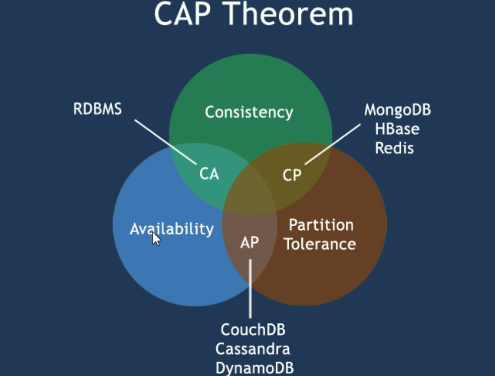

**BASE**：为了解决关系数据库强一致性引起的问题而引起的可用性降低而提出的解决方案。

基本可用(Basically Available)

软状态(Soft state)

最终一致(Eventually consistent)

它的思想是通过让系统放松对某一时刻数据一致性的要求来换取系统整体伸缩性和性能上改观。缘由就在于大型系统往往由于地域分布和极高性能的要求，不可能采用分布式事务来完成这些指标，要想获得这些指标，base是一种解决方案。

# Redis

## 1. benchmark 性能测试

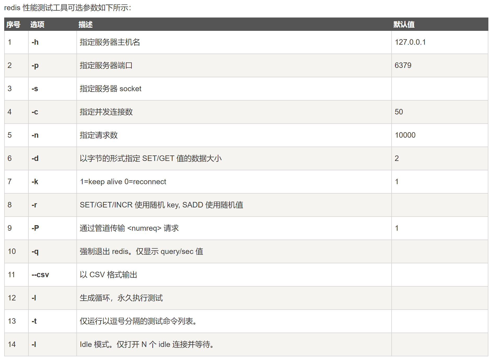

## 2. 基础

Redis默认16个数据库。默认使用第0个数据库。

Redis是单线程的，Redis是基于内存操作，CPU不是Redis性能瓶颈，Redis的瓶颈是根据机器的内存和网络带宽，既然可以使用单线程，就是用了单线程。

Redis是c语言写的，官方提供的数据是100000+的QPS，这个不比Memecache差！

### 2.1 Redis数据类型

1. String的应用场景：

商品编号、订单号可以使用INCR KEY 这个命令生成

是否喜欢某个文章，点一下加个1。

分布式锁： setnx key value 

2. hash的应用场景：

hash 对应 java中的 map<String, map<object, object>>

购物车：点击购买数量，对某个键的值加1。

新增商品就直接hset KV即可。

全部选择 hgetAll即可。

3. list

微信公众号 订阅公众号。谁订阅了我，那么就加进list。

喜欢的文章列表啥的。

4. set

微信抽奖小程序 抽取一个幸运用户。 srandmember set 1 抽取一个。 Scard len 看几个人参与抽奖。SPOP key 3 元素删除。

微信朋友圈点赞 点赞的就加到set集合里面， 取消点赞 srem 用户id。 展现所有点赞用户 Smembers 用户数统计 Scard。

好友的关注社交关系 共同关注 sadd sinter

QQ可能认识的人 Sdiff 差集

5. zset

定义销售排行榜 zadd 100 id1 90 id2 

点击量增加 zincrby name 2 id id就会增加2


#### 2.1.1 Redis-Key

```bash
keys * #查看所有
EXPIRE name 10 #过期时间
ttl name #剩余时间
type name # 查看类型
```

#### 2.1.2 String

```bash
步长
set views 1 #设置
get views
incr views	#增加
decr views #减少
decrby views 10
incrby views 10
getrange views 0 3 #截取views中的1-3位字符
getrange views 0 -1 #获得全部字符
setnx views #不存在则设置成功
setex views #设置过期时间 (分布式锁中常用)
mset k1 v1 k2 v2 k3 v3 #同时设置多个值
mget k1 k2 k3 # 同时得到
msetnx k1 v1 k4 v4# 原子操作，要么一起成功，要么一起失败
# 对象
set user:1{name:zhangsan,age:3}
#或这么写 user:{id}:{filed}，如此设计是Redis完全ok的
mset user:1:name zhangsan user:1:age 3
###########
getset db redis #如果存在值，获取原来值，设置新的值，没有的话得到nil，并set db redis
```

String类似的场景：value除了是字符串还可以是数字

#### 2.1.3 List

列表。list可以玩成栈、队列、或阻塞队列。

所有list命令都是l开头的。

```bash
LPUSH list one
LPUSH list two
LPUSH list three
LRANGE list 0 -1 #全部
LRANGE list 0 1 # three two
RPUSH list four #右边
LPOP
RPOP
############
LINDEX list 0 #左侧第一个值
Llen list #长度
Lrem list 1 one # 移除 one 1个
ltrim list 1 2 # 通过截取指定的长度
rpoplpush list anotherlist # 移除list中右侧第一个数据然后放入anotherlist中
exists list #判断列表是否存在
####
lset list 0 item #将列表中对应下标的值替换
linsert list before "item" "other" # 在item值前面插入other这个值
linsert list after "item" "new" # 在item值后面插入new这个值
```

总结：L

* 是一个链表，before Node after left right 都可以插入值
* 如果key不存在，创建新链表
* 如果存在，新增内容
* 如果移除了所有值，空链表，代表不存在
* 在两边插入或改动，效率最高，中间元素，相对来说效率低一点。

消息排队，消息队列 LPUSH RPOP 啥的

#### 2.1.4 Set

set开头都是s

```bash
# set 值不能重复
sadd myset "hello"
smembers myset #查看元素
sismember myset hello #查看元素是否存在

###
srem myset hello #移除set集合中的指定元素
scard myset # 获取set集合中的元素个数

###
srandmember myset # 无需不重复集合。抽随机

###
spop myset # 随机删除一个元素

###
# 差集 交集 并集
Sdiff set1 set2
sinter set1 set2
sunion set1 set 2
```

#### 2.1.5 Hash()

Map集合。key-map，值是map集合

命令以h开头

```bash
hset myhash field1 kuangshen
hget myhash field1
hmset myhash field1 hello field2 world #同时设置值

hgetall myhash # 得到全部的值
hdel myhash field1 #删除哈希指定的值字段！对应的value值也就消失了。
hlen myhash #获取hash长度
hexists myhash field1 # 判断hash中指定字段是否存在
```

hash保存变更数据 user name age 

#### 2.1.6 Zset（有序集合）

在set的基础上增加了一个值， set k1 v1 , zset k1 score v1

```bash
#增加
zadd myset 1 one # 中间的是1序号，表示第一个序号，自动排序
zrange myset 0 -1 # 查看范围，这个-1就是看的全部了
#排序如何实现
zrangebyscore salary -inf +inf # 从最小值到最大值排序
zrevrange salary 0 -1 # 倒叙，从大到小排序
# 获取有序集合的个数
zcard myset 
zcard myset 1 hello
zcount myset 1 3 # 获取指定区间的数量
```

其余的一些API，剩下的如果工作中有需要这个时候可以去查官方文档。

### 2.2 三种特殊的数据类型

朋友的定位，附近的人，打车距离计算？

#### 2.2.1 地理空间

Redis的Geo在Redis 3.2 版本就推出了。这个功能可以推算地理位置的信息，两地之间的距离，方圆几里的人！

```bash
GEOADD #将指定的经度、纬度、名称添加到指定的key中。地球两极无法添加，通过java程序一次性导入 参数 key

geoadd china:city 116.40 39.90 beijing

#############
GEODIST # 给定两个位置之间的距离
# m 单位 米
# km 单位是千米
# mi 单位是英里
# ft 单位是英尺
geodist china:city beijing chongqin km 

##############
GEOHASH # 返回一个或多个位置元素的Geohash表示
# 返回11个字符的Geohash字符串
geohash china:city beijing # 将当前经纬度转换为一维的字符串，如果两个字符串越接近，那么则距离越近！

#######################
GEOPOS # 获取当前定位：一定是一个坐标值
geopos china:city beijing # 获取指定的城市的经度和纬度


#########################
GEORADIUS # 以给定的经度纬度为中心，半径内的
georadius china:city 110 30 1000 km # 以 110 30 为中心，找方圆1000km内的城市
georadius china:city 110 30 1000 km [withcoord] [withdist] # withcode打印时带上经度纬度 withdist打印时带上距离


###########################
GEORADIUSBYMEMBER # 找出位于指定范围内的元素，中心点是由给定的位置元素决定的
georadiusbymember china:city shanghai 400 km # 找出上海附近400km的城市


```

#### 2.2.2 Hyperloglog

基数：不重复的元素。比如A = {1,3,5,7,8}，基数（不重复的元素） = 5，可以接受误差。

Redis 2.8.9版本就更新了 Hyperloglog数据结构。是基数统计的算法。

网页UV（一个人访问一个网站多次，但是还是算作一个人）。我们的目的是为了计数，而不是保护用户id。

* 优点：占用的内存是固定，2^64不同的元素的技术，只需要废12KB内存！如果要从内存的角度来比较的话，hyperloglog是首选！
* 0.81%错误率。

这个命令都以PF开头。

```bash
# 添加
PFadd mykey a b c d e f g h i j
# 计数
PFcount mykey

# 合并
PFmerge mykey3 mykey


```

如果业务需求不能容错，那么就换成set。

### 2.2.3 Bitmaps

位存储，操作二进制位进行操作，只有0和1两个状态。

```bash
setbit sign 5 0

bitcount sign # 统计1的个数
```

## 3. 事务

Redis单条命令要么同时成功，要么同时失败，原子性！

<font color = "red">但是Redis事务不保证原子性！</font>一个事务所有命令被序列化，在事务执行过程中，会按照顺序执行！

Redis事务并没有隔离级别的概念！

Redis事务：

1. 开启事务（multi)
2. 命令入队
3. 执行事务（exec)

放弃事务：discard

**悲观锁**：

很悲观，什么时候都要加锁。

**乐观锁**：

很乐观，什么时候都不想加锁。更新数据时去判断以下，在此期间是否有人修改过这个数据。

Redis 监视测试：

```bash
watch money #可以当作乐观锁操作

multi

decrby money 10
incrby out 10
exec #执行之前另一个线程修改了我们的值，这个时候会导致事务执行失败
unwatch 进行解锁

```

## 3. Jedis

需要使用Java来操作Redis。

Jedis官方推荐的java连接工具，使用java操作Redis。

```xml
<dependencies>
    <dependency>
        <groupId>redis.clients</groupId>
        <artifactId>jedis</artifactId>
        <version>3.5.2</version>
    </dependency>

    <!-- https://mvnrepository.com/artifact/com.alibaba/fastjson -->
    <dependency>
        <groupId>com.alibaba</groupId>
        <artifactId>fastjson</artifactId>
        <version>1.2.75</version>
    </dependency>

</dependencies>
```

## 4. SpringBoot 整合

SpringBoot操作数据:spring-data jpa jdbc mongodb redis！

SpringData 也是和 SpringBoot齐名的项目。

在springBoot2.x之后，原来使用的jedis被替换成了lettuce

jedis:采用直连，多个线程操作不安全。如果避免不安全，需要使用jedis pool连接池！BIO

lettuce:采用netty，实例可以在多个线程共享，不存在线程不安全的情况，可以减少线程数据，更像NIO模式。

```java
public class RedisAutoConfiguration {
    public RedisAutoConfiguration() {
    }

    @Bean
    @ConditionalOnMissingBean(
        name = {"redisTemplate"}
    )
    @ConditionalOnSingleCandidate(RedisConnectionFactory.class)
    public RedisTemplate<Object, Object> redisTemplate(RedisConnectionFactory redisConnectionFactory) {
        RedisTemplate<Object, Object> template = new RedisTemplate();
        template.setConnectionFactory(redisConnectionFactory);
        return template;
    }

    @Bean
    @ConditionalOnMissingBean
    @ConditionalOnSingleCandidate(RedisConnectionFactory.class)
    public StringRedisTemplate stringRedisTemplate(RedisConnectionFactory redisConnectionFactory) {
        StringRedisTemplate template = new StringRedisTemplate();
        template.setConnectionFactory(redisConnectionFactory);
        return template;
    }
}
```


## 5. Config

* 配置文件对大小写不敏感

> 网络

```bash
bind 127.0.0.1 #绑定ip
protected-mode yes # 保护模式
port 6379 # 端口设置
```

> 通用

```bash
daemonize yes # 以守护进程的方式运行，默认是no，我们需要自己开启为yes
pidfile /var/run/redis_6379.pid # 如果以后台方式运行，我们就要指定一个 pid 进程文件

# Specify the server verbosity level.
# This can be one of:
# debug (a lot of information, useful for development/testing)
# verbose (many rarely useful info, but not a mess like the debug level)
# notice (moderately verbose, what you want in production probably) 生产环境适用
# warning (only very important / critical messages are logged)
loglevel notice
logfile "" # 日志的文件位置名
databases 16 # 数据库的数量，默认16个数据库
always-show-logo yes #是否显示logo

```

> 快照

```bash
save 900 1 # 900s内如何至少有一个key进行了修改，我们就进行持久化操作
# 300s内至少10个key 进行了修改，我们及进行持久化操作
save 300 10
# 60s内至少10000个key进行了修改，持久化
save 60 10000

stop-writes-on-bgsave-error yes # 持久化如果错误了，Redis是否还继续工作
rdbcompression yes # 是否压缩 rdb 文件，需要消耗一些cpu资源。

rdbchecksum yes # 保存rdb文件的时候，进行错误的检查校验

dir ./ # rdb 文件保存的目录
```

持久化，在规定的时间内，执行了多少次操作，则会持久化到文件 .rdb .aof

redis是内存数据库，如果没有持久化，那么数据断电即失。

> security

可以修改密码，默认没有设置密码！

```bash
config get requirepass

config set requirepass "123456" # 设置redis密码

```

> 限制clients

```bash
maxclients 10000 # 最大连接数量
maxmemory <bytes> # redis 配置最大的内存容量
maxmemory-policy noeviction # 内存到达上限之后的处理策略，移除一些过期的key
maxmemory-policy 六种方式：
1、volatile-lru：只对设置了过期时间的key进行LRU（默认值） 

2、allkeys-lru ： 删除lru算法的key   

3、volatile-random：随机删除即将过期key   

4、allkeys-random：随机删除   

5、volatile-ttl ： 删除即将过期的   

6、noeviction ： 永不过期，返回错误
```

> APPEND ONLY 模式 aof配置

```bash
appendonly no # 默认不开启，因为rdb大部分场景够用了，这个还特别慢
appendfilename "appendonly.aof" # 持久化的文件的名字 .rdb
appendfsync always # 每次修改都会sync，消耗性能。
appendfsync everysec # 每秒执行一次 sync，可能会丢失这1s的数据
appendfsync no # 不执行 sync，这个时候操作系统自己同步数据，速度最快
```

## 6. 持久化

Redis是内存数据库。

### 6.1 rdb

#### 6.1.1 是什么

rdb(Redis Database)是Redis持久化的最常用的方式。redis将内存中的数据库快照（以数据结构的形式保存数据）以二进制形式保存到磁盘上。

#### 6.1.2 为什么

防止下一次使用数据库时，当前数据库的数据仍然可以使用。

#### 6.1.3 怎么做

![digraph persistent {      rankdir = LR;      node [shape = circle, style = filled];      edge [style = bold];      redis_object [label = "内存中的\n数据对象", fillcolor = "#A8E270"];      rdb [label = "磁盘中的\nRDB文件", fillcolor = "#95BBE3"];      redis_object -> rdb [label = "rdbSave"];      rdb -> redis_object [label = "rdbLoad"]; }](Redis基础/graphviz-cd96bfa5c61ef2b8dd69a9b0a97cde047cb722a8.svg)


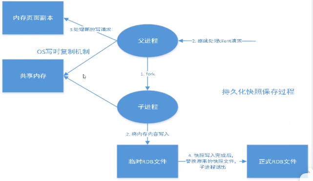

在指定的时间间隔内将内存中的数据集快照写入磁盘，也就是Snapshot快照，它恢复时是将快照文件直接读到内存里。

Redis会单独创建（fork）一个子进程来进行持久化，会先将数据写入到一个临时文件中，待持久化过程都结束了，再用这个临时文件替换上次持久化好的文件。整个过程中，主进程是不进行任何IO操作的。这就确保了极高的性能。如果需要进行大规模数据的回复，且对于数据恢复的完整性不是非常敏感，那么RDB方式要比AOF方式更加高效。RDB的缺点是最后一次持久化后的数据可能丢失。

rdb保存的文件是dump.rdb的。

> 触发机制

1. save的规则满足的情况下，会自动触发rdb规则。
2. 执行flushall命令，也会触发我们的rdb规则。
3. 推出redis，产生rdb文件。

> 恢复rdb文件

只需要将rdb文件放在redis启动目录即可，redis启动的时候就会自动检查dump.rdb恢复其中的数据。

```bash
config get dir # 查看启动目录
```

### 6.2 AOF （Append Only File)

默认不开启，手动进行配置。如果aof有错误，可以使用命令 `redis-check-aof --fix`即可。（会丢弃错误的数据）

将我们所有命令都记录，

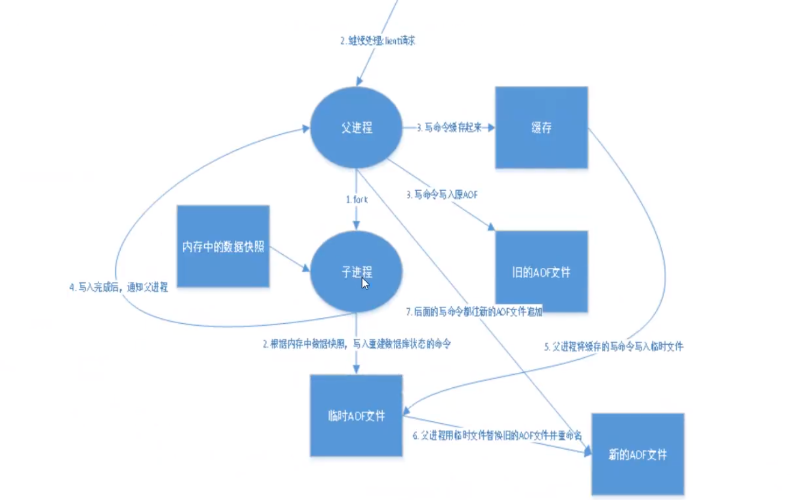

以日志形式来记录每个写操作，将Redis执行过的所有指令记录下来（读操作不记录），只许追加文件但不可以改写文件，redis启动之初会根据该文件读取重新构建数据，redis重启的话就是根据日志文件的内容将写指令从前到后执行一次以完成数据的恢复工作。


## 7. Redis发布订阅

### 7.1 是什么

发布订阅(pub/sub)是一种消息通信模式：发送者（pub）发送消息，订阅者（sub）接收消息。

### 7.2 为什么

因为我们日常中微信公众号、微博订阅号，需要推送给订阅的客户端信息，这种行为就需要Redis的发布订阅。

### 7.3 怎么做

Redis客户端可以订阅任意数量的频道。

订阅/发布消息图：

第一个：消息发送者，第二个：频道 第三个：消息订阅者。

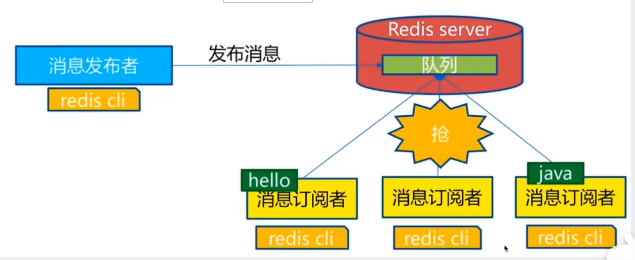

作为例子， 下图展示了频道 `channel1` ， 以及订阅这个频道的三个客户端 —— `client2` 、 `client5` 和 `client1` 之间的关系：


当有新消息通过 [PUBLISH](http://redis.readthedocs.org/en/latest/pub_sub/publish.html#publish) 命令发送给频道 `channel1` 时， 这个消息就会被发送给订阅它的三个客户端：


在后面的内容中， 我们将探讨 [SUBSCRIBE](http://redis.readthedocs.org/en/latest/pub_sub/subscribe.html#subscribe) 和 [PUBLISH](http://redis.readthedocs.org/en/latest/pub_sub/publish.html#publish) 命令的实现， 以及这套订阅与发布机制的运作原理。

#### 7.3.1 订阅机制

每个 Redis 服务器进程都维持着一个表示服务器状态的 `redis.h/redisServer` 结构， 结构的 `pubsub_channels` 属性是一个字典， 这个字典就用于保存订阅频道的信息：

```c
struct redisServer {
    // ...
    dict *pubsub_channels;
    // ...
};
```

其中，字典的键为正在被订阅的频道， 而字典的值则是一个链表， 链表中保存了所有订阅这个频道的客户端。

比如说，在下图展示的这个 `pubsub_channels` 示例中， `client2` 、 `client5` 和 `client1` 就订阅了 `channel1` ， 而其他频道也分别被别的客户端所订阅：


当客户端调用 [SUBSCRIBE](http://redis.readthedocs.org/en/latest/pub_sub/subscribe.html#subscribe) 命令时， 程序就将客户端和要订阅的频道在 `pubsub_channels` 字典中关联起来。

举个例子，如果客户端 `client10086` 执行命令 `SUBSCRIBE channel1 channel2 channel3` ，那么前面展示的 `pubsub_channels` 将变成下面这个样子：


[SUBSCRIBE](http://redis.readthedocs.org/en/latest/pub_sub/subscribe.html#subscribe) 命令的行为可以用伪代码表示如下：

```
def SUBSCRIBE(client, channels):

    # 遍历所有输入频道
    for channel in channels:

        # 将客户端添加到链表的末尾
        redisServer.pubsub_channels[channel].append(client)
```

通过 `pubsub_channels` 字典， 程序只要检查某个频道是否为字典的键， 就可以知道该频道是否正在被客户端订阅； 只要取出某个键的值， 就可以得到所有订阅该频道的客户端的信息。

#### 7.3.2 发送信息到频道

了解了 `pubsub_channels` 字典的结构之后， 解释 [PUBLISH](http://redis.readthedocs.org/en/latest/pub_sub/publish.html#publish) 命令的实现就非常简单了： 当调用 `PUBLISH channel message` 命令， 程序首先根据 `channel` 定位到字典的键， 然后将信息发送给字典值链表中的所有客户端。

比如说，对于以下这个 `pubsub_channels` 实例， 如果某个客户端执行命令 `PUBLISH channel1 "hello moto"` ，那么 `client2` 、 `client5` 和 `client1` 三个客户端都将接收到 `"hello moto"` 信息：


[PUBLISH](http://redis.readthedocs.org/en/latest/pub_sub/publish.html#publish) 命令的实现可以用以下伪代码来描述：

```python
def PUBLISH(channel, message):

    # 遍历所有订阅频道 channel 的客户端
    for client in server.pubsub_channels[channel]:

        # 将信息发送给它们
        send_message(client, message)
```

#### 7.3.3 退订频道

使用 [UNSUBSCRIBE](http://redis.readthedocs.org/en/latest/pub_sub/unsubscribe.html#unsubscribe) 命令可以退订指定的频道， 这个命令执行的是订阅的反操作： 它从 `pubsub_channels` 字典的给定频道（键）中， 删除关于当前客户端的信息， 这样被退订频道的信息就不会再发送给这个客户端。

#### 7.3.4 模式的订阅与信息发送

当使用 [PUBLISH](http://redis.readthedocs.org/en/latest/pub_sub/publish.html#publish) 命令发送信息到某个频道时， 不仅所有订阅该频道的客户端会收到信息， 如果有某个/某些模式和这个频道匹配的话， 那么所有订阅这个/这些频道的客户端也同样会收到信息。

下图展示了一个带有频道和模式的例子， 其中 `tweet.shop.*` 模式匹配了 `tweet.shop.kindle` 频道和 `tweet.shop.ipad` 频道， 并且有不同的客户端分别订阅它们三个：

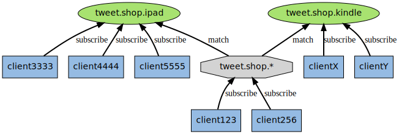

当有信息发送到 `tweet.shop.kindle` 频道时， 信息除了发送给 `clientX` 和 `clientY` 之外， 还会发送给订阅 `tweet.shop.*` 模式的 `client123` 和 `client256` ：


另一方面， 如果接收到信息的是频道 `tweet.shop.ipad` ， 那么 `client123` 和 `client256` 同样会收到信息：


#### 7.3.5 订阅模式

`redisServer.pubsub_patterns` 属性是一个链表，链表中保存着所有和模式相关的信息：

```c
struct redisServer {
    // ...
    list *pubsub_patterns;
    // ...
};
```

链表中的每个节点都包含一个 `redis.h/pubsubPattern` 结构：

```c
typedef struct pubsubPattern {
    redisClient *client;
    robj *pattern;
} pubsubPattern;
```

`client` 属性保存着订阅模式的客户端，而 `pattern` 属性则保存着被订阅的模式。

每当调用 `PSUBSCRIBE` 命令订阅一个模式时， 程序就创建一个包含客户端信息和被订阅模式的 `pubsubPattern` 结构， 并将该结构添加到 `redisServer.pubsub_patterns` 链表中。

作为例子，下图展示了一个包含两个模式的 `pubsub_patterns` 链表， 其中 `client123` 和 `client256` 都正在订阅 `tweet.shop.*` 模式：


如果这时客户端 `client10086` 执行 `PSUBSCRIBE broadcast.list.*` ， 那么 `pubsub_patterns` 链表将被更新成这样：


通过遍历整个 `pubsub_patterns` 链表，程序可以检查所有正在被订阅的模式，以及订阅这些模式的客户端。

#### 7.3.6 发送信息到模式

发送信息到模式的工作也是由 [PUBLISH](http://redis.readthedocs.org/en/latest/pub_sub/publish.html#publish) 命令进行的， 在前面讲解频道的时候， 我们给出了这样一段伪代码， 说它定义了 [PUBLISH](http://redis.readthedocs.org/en/latest/pub_sub/publish.html#publish) 命令的行为：

```python
def PUBLISH(channel, message):

    # 遍历所有订阅频道 channel 的客户端
    for client in server.pubsub_channels[channel]:

        # 将信息发送给它们
        send_message(client, message)
```

但是，这段伪代码并没有完整描述 [PUBLISH](http://redis.readthedocs.org/en/latest/pub_sub/publish.html#publish) 命令的行为， 因为 [PUBLISH](http://redis.readthedocs.org/en/latest/pub_sub/publish.html#publish) 除了将 `message` 发送到所有订阅 `channel` 的客户端之外， 它还会将 `channel` 和 `pubsub_patterns` 中的模式进行对比， 如果 `channel` 和某个模式匹配的话， 那么也将 `message` 发送到订阅那个模式的客户端。

完整描述 [PUBLISH](http://redis.readthedocs.org/en/latest/pub_sub/publish.html#publish) 功能的伪代码定于如下：

```python
def PUBLISH(channel, message):

    # 遍历所有订阅频道 channel 的客户端
    for client in server.pubsub_channels[channel]:

        # 将信息发送给它们
        send_message(client, message)

    # 取出所有模式，以及订阅模式的客户端
    for pattern, client in server.pubsub_patterns:

        # 如果 channel 和模式匹配
        if match(channel, pattern):

            # 那么也将信息发给订阅这个模式的客户端
            send_message(client, message)
```

举个例子，如果 Redis 服务器的 `pubsub_patterns` 状态如下：


那么当某个客户端发送信息 `"Amazon Kindle, $69."` 到 `tweet.shop.kindle` 频道时， 除了所有订阅了 `tweet.shop.kindle` 频道的客户端会收到信息之外， 客户端 `client123` 和 `client256` 也同样会收到信息， 因为这两个客户端订阅的 `tweet.shop.*` 模式和 `tweet.shop.kindle` 频道匹配。

#### 7.3.7 退订模式

使用 [PUNSUBSCRIBE](http://redis.readthedocs.org/en/latest/pub_sub/punsubscribe.html#punsubscribe) 命令可以退订指定的模式， 这个命令执行的是订阅模式的反操作： 程序会删除 `redisServer.pubsub_patterns` 链表中， 所有和被退订模式相关联的 `pubsubPattern` 结构， 这样客户端就不会再收到和模式相匹配的频道发来的信息。

## 8. 主从复制

### 8.1 是什么

主从复制，指的是将一台Redis服务器的数据，复制到其他的Redis服务器。前者称为主节点（master/leader），后者称为从节点（slave/follower）；数据的复制都是单向的，只能由主节点到从节点。Master以写为主，Slave以读为主。

### 8.2 为什么

1. 数据冗余：主从复制实现了数据的热备份，是持久化之外的一种数据冗余方式。
2. 故障恢复：当主节点出现了问题，可以由从节点提供服务，实现快速的故障恢复；实际上是一种服务的冗余。
3. 负载均衡：主从复制的基础上，配合读写分离，可以由主节点提供写服务，从节点提供读服务（即写Redis数据时应用连接主节点，读Redis数据时应用连接从节点），分担服务器负载；尤其是在写少读多的场景下，通过多个从节点分担负载，可以大大提高Redis服务器的并发量。
4. 高可用基石：除了上述作用以外，主从复制还是哨兵和集群能够实施的基础，因此主从复制是Redis高可用的基础。

### 8.3 怎么做

Slave启动成功成功连接到master会发送一个sync同步命令。

Master收到同步命令，启动后台存盘进程，同时收集所有接收到的用于修改数据集命令，在后台进程执行完毕之后，master将传送整个数据文件到slave，并完成一次完全同步。

全量复制：slave服务在接收到master数据库文件数据，将其存盘并加载到内存中。

增量复制：Master继续将新的所有收集到的修改命令依次传给slave，完成同步。

## 9. 哨兵模式

### 9.1 是什么

自动选择Master。能够让后台监控主机是否故障，如果故障了根据投票数自动将从库转换为主库。

### 9.2 为什么

主从切换技术，当主服务器宕机后，需要手动把一台服务器切换为主服务器，这就需要人工干预，费时费力，还会造成一段时间内服务不可用。这不是一种推荐的方式，更多时候，优先考虑哨兵模式。Redis2.8正式提供了Sentinel（哨兵）架构来解决这个问题。

### 9.3 怎么做

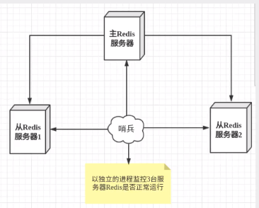

假设主服务器宕机，哨兵1先检测到这个结果，系统并不会马上进行failover过程，仅仅是哨兵1主观的认为主服务器不可用，这个现象称为主观下线。

当后面的哨兵也检测到主服务器不可用，并且数量达到一定值时，那么哨兵之间就会进行一次投票，投票的结果由一个哨兵发起，进行failover（故障转移）操作。切换成功后，就会发布订阅模式，让各个哨兵把自己监控的从服务器实现切换主机，这个过程称为客观下线。

## 10. Redis 缓存穿透和雪崩

都是高可用问题。

### 10.1 缓存穿透

#### 10.1.1 是什么

用户想要查询的数据缓存（redis内存数据库）没有，于是向持久层数据库查询。很多用户出现时，都向持久层数据库去查询，给持久层数据库造成很大压力，这就是缓存穿透。

#### 10.1.2 为什么

因为不得不要解决这个问题。

#### 10.1.3 怎么做

怎么防止：

* 方案一：布隆过滤器

布隆过滤器是一种数据结构，对所有可能查询的参数以hash形式存储，在控制层先进行校验，不符合则丢弃，从而笔迷拿了对底层存储系统的查询压力。

* 方案二：缓存空对象

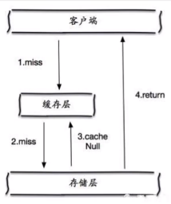


这种方法有两个问题：

1. 空值能够被缓存，意味着缓存需要更多的空间存储更多的键，因为这当中可能会有很多的空值键。
2. 即使对空值设置过期时间，还是会存在缓存层和存储层数据会有一段时间不一致，这对于保持一致性的业务会有影响。

### 10.2 缓存击穿

#### 10.2.1 是什么

一个key非常热点，key对应的数据存在，但在redis中正好过期。在过期的时间段内若有大量并发请求过来，这些请求发现缓存过期一般都会从后端DB加载数据并回设到缓存，这个时候大并发的请求可能会瞬间把后端DB压垮。

#### 10.2.2 为什么


#### 10.2.3 怎么做

* 方案一：SETNX 使用互斥锁。只有不存在的时候才设置，可以利用它来实现锁的效果。

```java
public String get(key) {
      String value = redis.get(key);
      if (value == null) { //代表缓存值过期
          //设置3min的超时，防止del操作失败的时候，下次缓存过期一直不能load db
      if (redis.setnx(key_mutex, 1, 3 * 60) == 1) {  //代表设置成功
               value = db.get(key);
                      redis.set(key, value, expire_secs);
                      redis.del(key_mutex);
              } else {  //这个时候代表同时候的其他线程已经load db并回设到缓存了，这时候重试获取缓存值即可
                      sleep(50);
                      get(key);  //重试
              }
          } else {
              return value;      
          }
 }
```

* 方案二：设置数据永不过期。（内存需要很大）

### 10.3 雪崩

#### 10.3.1 是什么

当缓存服务器重启或者大量缓存集中在某一个时间段失效，这样在失效的时候，也会给后端系统(比如DB)带来很大压力。

#### 10.3.2 为什么


#### 10.3.3 怎么做

* 方案一：redis高可用

既然redis有可能挂掉，那我多几台redis，这样一台挂掉后其他还可以继续工作，其实就是搭建的集群。

* 方案二：限流降级

缓存失效后，通过加锁或者队列来控制数据库写缓存的线程数量。比如对某个key只允许一个线程查询数据和写缓存，其他线程等待。

* 方案三：数据预热

在正式部署之前，把所有可能加载到的数据预先访问一遍，这样部分可能大量访问的数据就会加载到缓存中。即将发生大并发访问前手动触发加载缓存不同的key，设置不同的过期时间，让缓存的时间点尽量均匀。

## 11. 数据不一致问题

Redis和MySQL的数据不一致产生的根源是业务需要进行更新(写入)操作。

先操作Redis 还是 先操作MySQL是个问题，操作时序不同产生的影响也不同。

尺有所短，寸有所长，说到底是一种权衡，哪一种组合产生的负面影响对业务最小，就倾向于哪种方案。

缓存系统的数据不一致问题，是个经典的问题，因此肯定有很多解决问题的套路，所以让我们带着分析和思考去看看，各个方案的利弊。

**思路一：设置缓存过期时间**

当向Redis写入一条数据时，同时设置过期时间x秒，业务不同过期时间不同。

过期时间到达时Redis就会删掉这条数据，后续读请求Redis出现Cache Miss，进而读取MySQL，然后把数据写到Redis。

如果发生更新操作时，只操作MySQL，那么Redis中的数据更新就只是依赖于过期时间来保底，淘汰后再被加载就是新数据了。

画外音：这种方案是最简单的，如果业务对短时间不一致问题并不在意，设置过期时间的方案就足够了，没有必要搞太复杂。

**思路二：先淘汰缓存&再更新主存**

进行更新操作时，为了防止其他线程读到缓存中的旧数据，干脆淘汰掉，然后把数据更新到主存储，后续的请求再次读取时触发Cache Miss，从而读取MySQL再将新数据更新到Redis。

[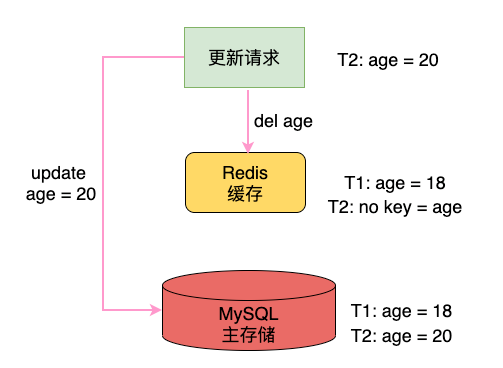](https://s5.51cto.com/oss/202104/18/32ced2ae2665c3a2482d7eaa2d880cfa.png)

- 在T1时刻：Redis和MySQL对于age的值都是18，二者一致;
- 在T2时刻：有更新请求需要设置age=20，此时Redis中就没有age这个数据了;在完成Redis淘汰后，进行MySQL数据更新age=20;

这个方案听着还不错的样子，但是读写请求都是并发的，先后顺序完全无法预测，甚至后发出的请求先处理完成，也是很常见的。

可见一个明显的漏洞：在淘汰Redis的数据完成后，更新MySQL完成之前，这个时间段内如果有新的读请求过来，发现Cache Miss了，就会把旧数据重新写到Redis中，再次造成不一致，并且毫无察觉后续读的都是旧数据。

[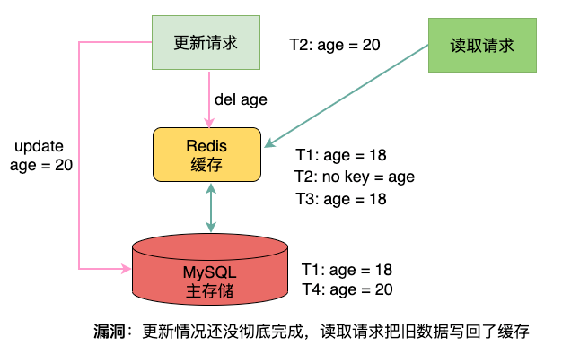](https://s3.51cto.com/oss/202104/18/222bab6d0ea863ad4e2e97c39c4ed5e4.png)

画外音：这个方案其实不能说完全没有用，但是至少不完美吧。

### 思路三：先更新主存&再淘汰缓存

进行更新操作时，先更新MySQL，成功之后，淘汰缓存，后续读取请求时触发Cache Miss再将新数据回写Redis。

[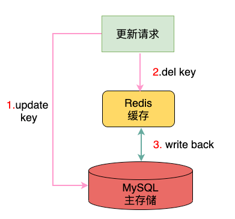](https://s5.51cto.com/oss/202104/18/7b22bb7a62cff14508fd7009905828d7.png)

这种模式在更新MySQL和淘汰Redis这段时间内，请求读取的还是Redis的旧数据，不过等MySQL更新完成，就可以立刻恢复一致，影响相对比较小。

[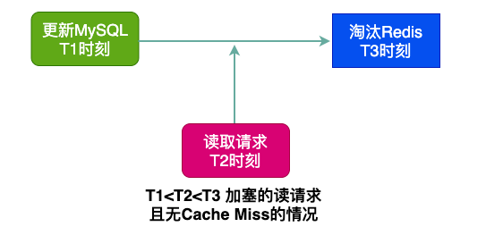](https://s4.51cto.com/oss/202104/18/4d460d288713e562d017f8f2cdb2cb8b.png)

上述是在缓存中有数据的情况，也就是T2时刻的读请求没有触发Cache Miss，也就不会更新缓存，因此问题不大。

但是，假如T2时刻读取的数据在缓存没有，那么触发Cache Miss后会产生回写，假如这个回写动作是在T4时刻完成，那么写入的还是老数据，如图：

[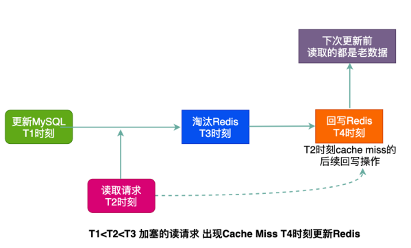](https://s4.51cto.com/oss/202104/18/5985e39605da8ddbe03ebfe3dffd8946.png-wh_600x-s_290050075.png)

这种情况确实有问题，但是真是太巧了吧，分析一下：

- 事件A：淘汰Redis前来了一个读请求;
- 事件B：T2时刻的读请求触发了Cache Miss;
- 事件C：回写Redis发生在淘汰缓存之后;

那么发生问题的概率就是P(A)*P(B)*P(C)，从实际考虑这种综合事件发生的概率非常低，因为写操作远慢于读操作，也就是图上的T4事件大概率是发生在T3事件之前的。

画外音：先更新MySQL再淘汰Redis的方案，虽然存在小概率不一致问题，但是总体来说工程上是可用的，比如非要说写完MySQL挂了，Redis就没淘汰，这种情况只能说确实有问题。

### 思路四：延时双删(淘汰)

前面提到的思路二和思路三都只有一次Redis淘汰操作，这里要说的延时双删本质上是思路二和思路三的结合：

[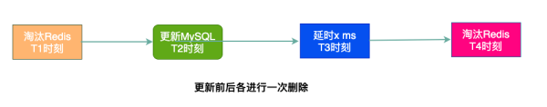](https://s2.51cto.com/oss/202104/18/debdfb9c6c6e7d93e0959d240ce75d54.png-wh_600x-s_3948280338.png)

说实话个人觉得，这个方案有点堆操作的感觉，而且设置延时的目的是为了避免思路三的小概率问题，延时设置多久不好确定，二来延时降低了并发性能，同时前置的删除缓存操作起到的作用并不大。

这个方案倒是透露出一种思想：多删几次，可能一致性更有保证，那确实如此，但是命中率也就低了，命中率和一致性看来也是一对矛盾。

画外音：这个方案也不是说不行，其实有点麻烦，并且在复杂高并发场景中反而影响性能，要是一般的场景或许也能用起来。

### 思路五：异步更新缓存

既然直接操作MySQL和Redis都多少存在一些问题，那么能不能引入中间层来解决问题呢?

把MySQL的更新操作完成后不直接操作Redis，而是把这个操作命令(消息)扔到一个中间层，然后由Redis自己来消费更新数据，这是一种解耦的异步方案。

[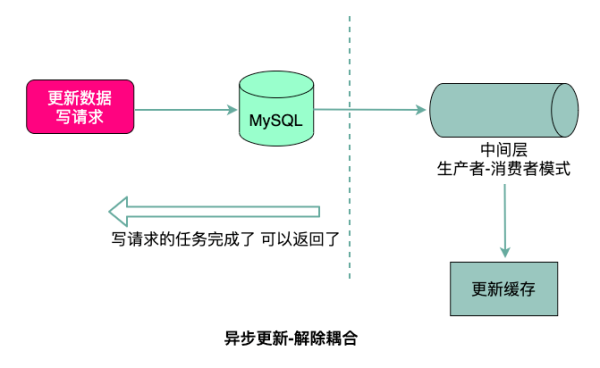](https://s5.51cto.com/oss/202104/18/a098eb9f48abb2d5e3be936259d1ee56.png-wh_600x-s_2588560741.png)

单纯为了更新缓存引入中间件确实有些复杂，但是像MySQL提供了binlog的同步机制，此时Redis就作为Slave进行主从同步，实现数据的更新，成本也还可以接受。

### 12. 面试题（1）

#### 12.1 Redis与Memcached


### 12.2 redis分布式锁

多个服务间，保证同一时刻内同一个用户只能由一个请求，防止关键业务出现数据冲突。

电商库存 会出现超卖现象。

redis做分布式锁要注意哪些问题？

1. 单机版的JVM 锁解决不了同时并发访问redis的问题，比如电商库存会出现超卖现象。
2. 使用set锁时，不加过期时间，如果程序业务逻辑崩了，那么后面的程序都无法继续业务逻辑。
3. set必须加过期时间，并且过期时间和获得锁的语句是原子性的才行，防止获得锁了但是崩了没设置过期时间。
4. 如果业务执行超过了过期时间，锁自动过期了，然后另外一个线程拿到了锁，结果刚才那个业务执行完把锁删了。（**我正在在上厕所，明明记得锁厕所门了。结果突然锁没了，另外一个人又进来了，那我。。。哦不好像那个线程也尴尬**）。所以只能删除自己的锁。
5. 当前线程判断是不是删除的自己的锁。key是锁，value是UUID和当前线程名字。
6. 但是finally中的delete删除操作不是原子性的 lua脚本，保证原子性删除。**如果不用lua脚本，开启redis的事务。**

redis事务是个集合队列，会把队列中的命令执行完毕(multi exec watch discard)。

7. 还有一个解决的问题，确保redisLock过期时间大于业务执行时间的问题。redis分布式锁要续期。**使用redisson**如果直接使用lock和unlock，那么会出现illegalmonitor状态异常，上锁和解锁的不是同一个线程。

所以需要：

```java
if (redissonLock.isLocked()) {
	if (redissonLock.isHeldByCurrentThread()) {// 判断是不是当前线程进行解锁
        redissonLock.unlock();
    }
}
```


redis单点部署，会有什么问题？


集群模式下，比如主从模式，有没有问题？

CAP集群故障。master和slave模式下，redis本身是AP，master刚刚加上锁，master宕机了但是slave没来得及锁同步。从机成了master导致了锁丢失。Zookeeper 是CP，全部同步完成了才会告诉对方有锁了。

然后为了redis牛逼这种情况下也牛逼，出现了redisson。

redissson 的redlock。


RedLock redission 谈一谈


redis分布式锁如何续期 看门狗知道吗？

这是redisson的一些操作，看门狗机制。


### 12.3 redis设置内存

redis 配置文件 maxmemory byte （859行） 

64位机子默认 占用全部内存 32位 3G大小

还可以动态修改， `config get maxmemory` `config set maxmeroty xxx`

### 12.4 如果redis内存大于设定的

redis会OOM报错，报错大于maxmerory。

### 12.5 过期策略

如果一个键过期时间到了，不会立马删除。立即删除对CPU不友好。

它会：

定时删除，定期删除，惰性删除。 定期是对另外两种操作的折中。每间隔一段时间执行删除操作做，通过限制删除操作执行的时长和频率来减少删除操作对CPU时间的影响（周期性抽查存储空间，随机抽查，重点抽查）。

定期删除会产生漏网之鱼，定期删除时某个key一直没有被抽查过，会有大量的key堆积内存中。


所以有了内存淘汰策略产生了。

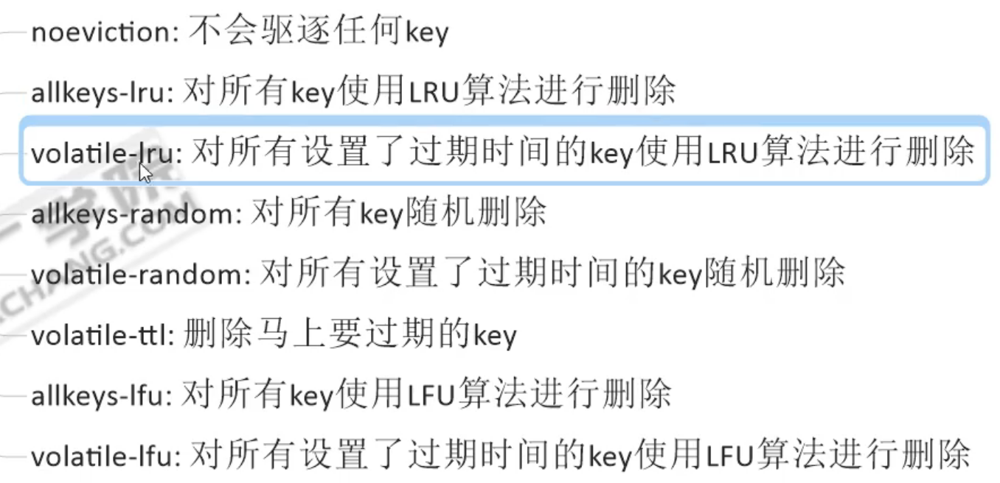


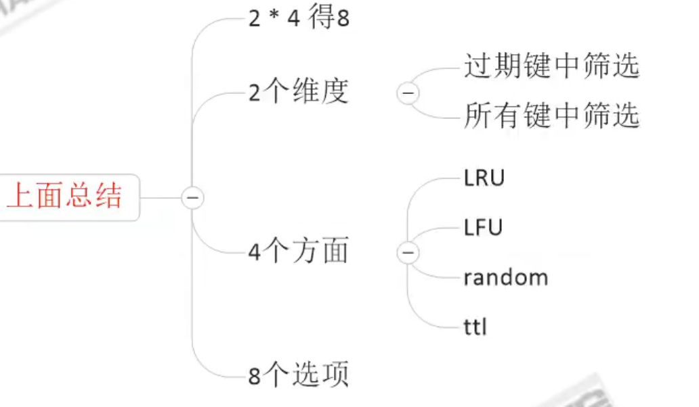

一般都是用LRU算法。随机的不可控啊。

通过命令和配置文件进行修改。 配置文件中`maxmemory policy all-keys-lru` `config  


