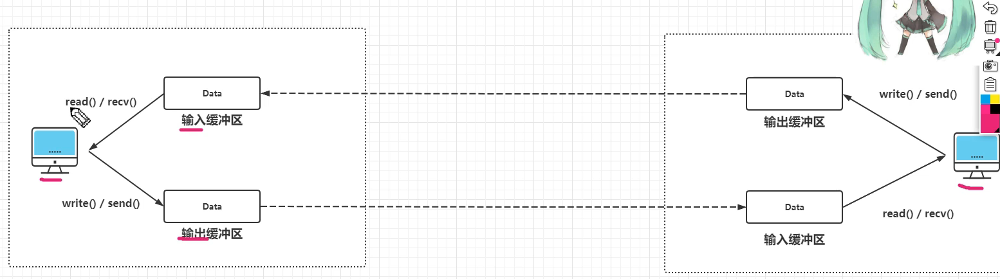
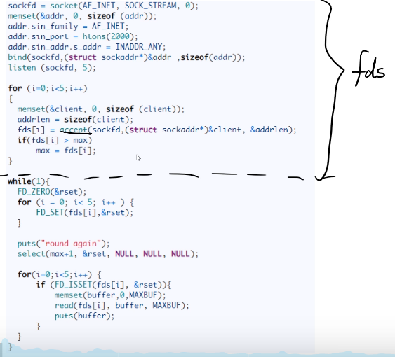
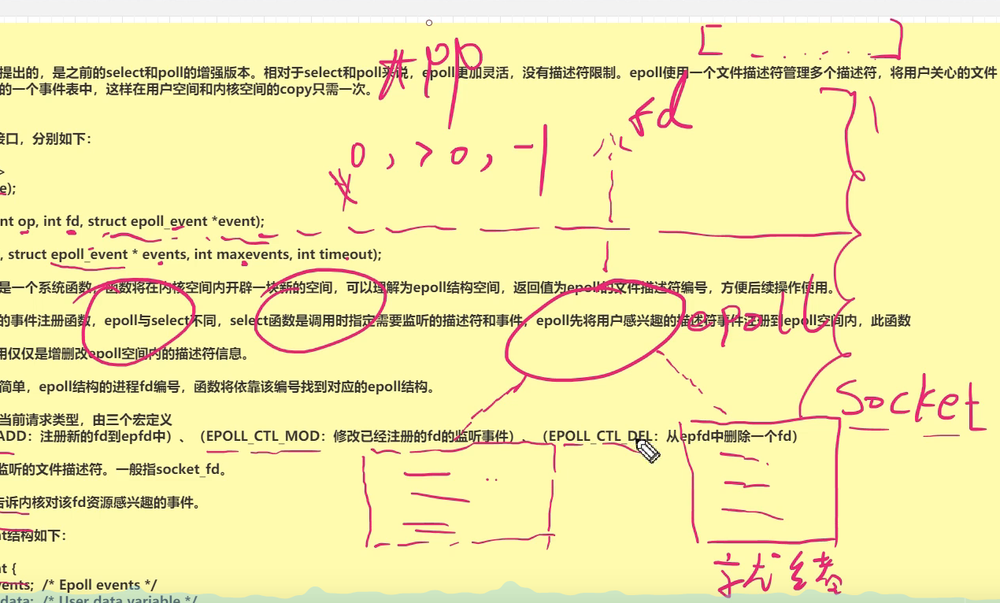
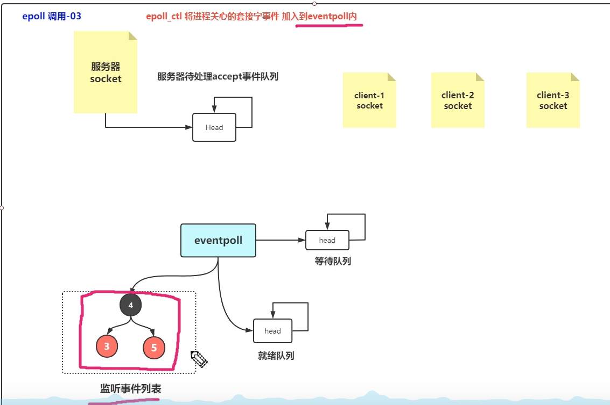

# Socket

### 1. socket读写缓冲区的工作机制

每个socket都有两个缓冲区，一个是输入缓冲区，一个是输出缓冲区。



<font color = "red">有这么一种特殊情况</font>，如果你的`socket`已经`close`了，你的输出缓冲区还有数据，这时TCP会继续将剩下的缓冲区数据发送给对方。

但是socket去close时输入缓冲区还有数据，这时输入缓冲区的数据就丢失了。


## 一、I/O 模型

一个输入操作通常包括两个阶段：

- 等待数据准备好
- 从内核向进程复制数据

对于一个套接字上的输入操作，第一步通常涉及等待数据从网络中到达。当所等待数据到达时，它被复制到内核中的某个缓冲区。第二步就是把数据从内核缓冲区复制到应用进程缓冲区。

Unix 有五种 I/O 模型：

- 阻塞式 I/O
- 非阻塞式 I/O
- I/O 复用（select 和 poll）
- 信号驱动式 I/O（SIGIO）
- 异步 I/O（AIO）

### 1. 阻塞式 I/O

应用进程被阻塞，直到数据从内核缓冲区复制到应用进程缓冲区中才返回。

应该注意到，在阻塞的过程中，其它应用进程还可以执行，因此阻塞不意味着整个操作系统都被阻塞。因为其它应用进程还可以执行，所以不消耗 CPU 时间，这种模型的 CPU 利用率会比较高。

下图中，recvfrom() 用于接收 Socket 传来的数据，并复制到应用进程的缓冲区 buf 中。这里把 recvfrom() 当成系统调用。

```c
ssize_t recvfrom(int sockfd, void *buf, size_t len, int flags, struct sockaddr *src_addr, socklen_t *addrlen);
```


### 2. 非阻塞式 I/O

应用进程执行系统调用之后，内核返回一个错误码。应用进程可以继续执行，但是需要不断的执行系统调用来获知 I/O 是否完成，这种方式称为轮询（polling）。

由于 CPU 要处理更多的系统调用，因此这种模型的 CPU 利用率比较低。


### I/O 复用

因为在多线程中上下文切换代价太高，将其转换为单线程的思路。

```java
//单线程轮询的方式，如果数据没读完就一直读下去
while (1) {
    for (fdx in (cache)) {
        if (fdx have data) {//这里的判断还是我们自己的程序做的，效率可能不是很高，用上系统内部的东西就好了
            read(fdx);
            process...
        }
    }
}
```

#### **1. select 函数的代码**



select函数实现I/O端口的复用，传递给select函数的参数会告诉内核：

1. 我们所关心的文件描述符
2. 对每个文件描述符，我们所关心的状态
3. 我们要等待多长时间

从select函数返回后，内核告诉我们以下信息：

1. 对我们的要求已经做好准备的描述符个数
2. 对于三种条件哪些描述符已经做好准备（读，写，异常）。

Linux select 函数接口：

```c++
#include <sys/select.h>
int select(int maxfdp1, fd_set *readset, fd_set *writeset, fd_set *exceptset, struct timeval *timeout);
```

其中的timeval结构定义如下：

```c++
struct timeval {
    long tv_sec;//秒
    long tv_usec;//微秒
}
```

有三种情况

1. timeout == NULL 等待无限长的时间
2. timeout -> tv_sec == 0 && timeout -> tv_usec == 0 不等待，直接返回。（非阻塞）
3. timeout -> tv_sec != 0 && timeout -> tv_usec != 0 等待指定的时间。

中间的三个参数readset，writeset和exceptset，指向描述符集。这些参数指明了我们关心哪些描述符，和满足什么条件（可写，可读，异常）。

一个文件描述符存储在fd_set类型中，fd_set其实就是位图(bitmap)；这个fd_set的长度是1024，但是有的时候我们仅仅需要个位数的读取，所以使用maxfdp1来设置最大真正的有效位。

```c++
fdset  = 0001110000000000000000000000000......
maxfdp1 = 5 (index start from 0,和网上说的有效位数+1是一个意思)
```

linux提供了一组宏，来为fd_set进行赋值等操作。

```c++
#include <sys/select.h>

// FD_ZERO宏将一个fd_set类型的所有位设置为0
int FD_ZERO(fd_set *fdset);

//清除某个位时用 FD_CLR
int FD_CLR(int fd, fdset *fdset);

//使用FD_SET将指定位置的bit值设置为1
int FD_SET(int fd, fdset *fdset);

//FD_ISSET 来测试某个位是否被置位
int FD_ISSET(int fd, fd_set *fdset);
```

参数中int maxfdp 是一个整数值，是指集合中所有文件描述符的范围，即所有文件描述符的最大值加1，不能错。

C++中使用 linux select 函数的demo

```c++
#include "sys/select.h"

//socket 建立连接
sockfd = socket(AF_INEF, SOCK_STREAM, 0);
memset(&addr, 0, sizeof(addr));
addr.sin_family = AF_INET;
addr.sin_port = htons(2000);
addr.sin_addr.s.addr = INADDR_ANY;
bind(sockfd, (struct sockaddr*)&addr, sizeof(addr));
listen(sockfd, s);

for(int i = 0; i < 5; i++) {
    memset(&client, 0, sizeof(client));
    addrlen = sizeof(client);
    fds[i] = accept(sockfd, (struct sockaddr*)&client, &addrlen);
    if(fds[i] > max) {
        max = fds[i];
    }
}

while (1) {
    FD_ZERO(&rset);
    for (int i = 0; i < 5; i++) {
        FD_SET(fds[i], &rset);
    }
    print("round again");
    select(max + 1, &rset, NULL, NULL, NULL);
    
    for (int i = 0; i < 5; i++) {
        if (FD_ISSET(fds[i], &rset)) {
            memset(buffer, 0, MAXBUF);
            read(fds[i], buffer, MAXBUF);
            print(buffer);
        }
    }   
}
```

缺点：

1. reset每次不能复用，需要重新设置。从用户空间复制到内核空间，总是拷贝。
2. fd_set 1024个大小限制。

#### 2. epoll

是在2.6内核中提出的。是之前`select`和`poll`的增强版本。epoll没有描述符大小限制，使用一个文件描述符管理多个文件描述符，将用户关心的文件描述符的时间存放到内核的一个事件表中，这样在用户空间和内核空间的copy只需要一次。

大体结构：



fd指定epoll里面哪个socket，epoll里面有个列表保存很多个事件（对应socket）。然后有很多个不同的epoll。

每个epoll里面有事件列表和就绪列表。就绪列表里面保存已经注册的事件信息。就绪列表主要是由`epoll_wait()`进行访问，当就绪列表里面有信息时可以直接返回，当没有信息，则需要阻塞（指定的timeout，当timeout设定为 -1 时一直阻塞直到有信息）。


————————————————

epoll过程需要三个接口：

```c++
#include <sys/epoll.h>
//这个函数是个系统函数，函数将在内核空间内开辟一块新的空间，可以理解为epoll结构空间，返回值为epoll的文件描述符编号，方便后续操作使用。
int epoll_create(int size);
//是epoll函数的事件注册函数，把事件放到事件列表里面。这样事件的任何改动内核可以直到，不用来回改动。（实际上事件的注册与销毁频率不会太高，所以和内核态交互不会太频繁）。epoll与select不同，select函数是调用时指定需要监听的描述符和事件，epoll先将用户感兴趣的描述符事件注册到epoll空间，此函数//是非阻塞函数，作用仅仅是增删改epoll空间内的描述符信息。
//参数：epfd，指定哪个epoll，从而可以让后面的进程fd编号找到匹配的socket，函数将依靠编号找到对应的epoll结构。
//op，表示当前请求类型，由三个宏定义(EPOLL_CTL_ADD:注册新的fd到epfd中、EPOLL_CTL_MOD:修改已经注册的fd的监听事件、EPOLL_CTL_DEL：从epfd中删除一个fd)
int epoll_ctl(int epfd, int op, int fd, struct epoll_event *event);
//epoll_wait 等待事件的产生，类似于select()调用，根据参数timeout，来决定是否阻塞。
//返回回来的事件都是就绪事件，不用像select一位一位检查是否就绪。
//
int epoll_wait(int epfd, struct epoll_event * events, int maxevents, int timeout);
```

epoll_event结构：

```c++
struct epoll_event {
    _unit32_t events; //Epoll events
    epoll_data_t data // User data variable
}
```

events可以是以下几个宏的集合：表明对哪种事件感兴趣

EPOLLIN（读事件）、EPOLLOUT、EPOLLRPI、EPOLLERR、EPOLLHUP（挂断）、EPOLLET（边缘触发）、EPOLLONESHOT（只监听一次，事件触发后自动清除该fd，从epoll列表）。

**工作模式：**

1.LT（水平触发）和ET（边缘触发）。LT是默认模式，LT模式与ET模式的区别如下：

LT：事件就绪后，用户可以选择处理或者不处理，如果用户本次未处理，那么下次调用epoll_wait时仍然会将未处理的事件打包给你。

ET：事件就绪后，用户必须处理，因为内核不给你兜底了，内核把就绪事件打包给你后，就把对应的就绪事件删除。

ET模式很大程度上减少了epoll事件被重复触发的次数，因此效率比LT模式高。


**代码示例：**

```c++
int epfd = epoll_create(10);

struct epoll_event events[5];
for (int i = 0; i < 5; i++) {
    static struct epoll_event ev;
    memset(&client, 0, sizeof(client));
    addlen = sizeof(client);
    ev.data.fd = accept(sockfd, (struct sockaddr*)&client, &addrlen);
    ev.events = EPOLLIN;
    epoll_ctl(epfd, EPOLL_CTL_ADD, ev.data.fd, &ev);
}

while (1) {
    print("round again");
    nfds = epoll_wait(epfd, events, 5, 10000);

    for (int i = 0; i < nfds; i++) {
        memset(buffer, 0, MAXBUF);
        read(events[i].data.fd, buffer, MAXBUF);
        prints(buffer);
    }
}
```

**epoll原理**:



监听事件列表是个红黑树，加快寻找速度。


使用 select 或者 poll 等待数据，并且可以等待多个套接字中的任何一个变为可读。这一过程会被阻塞，当某一个套接字可读时返回，之后再使用 recvfrom 把数据从内核复制到进程中。

它可以让单个进程具有处理多个 I/O 事件的能力。又被称为 Event Driven I/O，即事件驱动 I/O。

如果一个 Web 服务器没有 I/O 复用，那么每一个 Socket 连接都需要创建一个线程去处理。如果同时有几万个连接，那么就需要创建相同数量的线程。相比于多进程和多线程技术，I/O 复用不需要进程线程创建和切换的开销，系统开销更小。


场景：设计高性能服务器。


### 信号驱动 I/O

应用进程使用 sigaction 系统调用，内核立即返回，应用进程可以继续执行，也就是说等待数据阶段应用进程是非阻塞的。内核在数据到达时向应用进程发送 SIGIO 信号，应用进程收到之后在信号处理程序中调用 recvfrom 将数据从内核复制到应用进程中。

相比于非阻塞式 I/O 的轮询方式，信号驱动 I/O 的 CPU 利用率更高。


### 异步 I/O

应用进程执行 aio_read 系统调用会立即返回，应用进程可以继续执行，不会被阻塞，内核会在所有操作完成之后向应用进程发送信号。

异步 I/O 与信号驱动 I/O 的区别在于，异步 I/O 的信号是通知应用进程 I/O 完成，而信号驱动 I/O 的信号是通知应用进程可以开始 I/O。


### 五大 I/O 模型比较

- 同步 I/O：将数据从内核缓冲区复制到应用进程缓冲区的阶段（第二阶段），应用进程会阻塞。
- 异步 I/O：第二阶段应用进程不会阻塞。

同步 I/O 包括阻塞式 I/O、非阻塞式 I/O、I/O 复用和信号驱动 I/O ，它们的主要区别在第一个阶段。

非阻塞式 I/O 、信号驱动 I/O 和异步 I/O 在第一阶段不会阻塞。


## 二、I/O 复用

select/poll/epoll 都是 I/O 多路复用的具体实现，select 出现的最早，之后是 poll，再是 epoll。

### select

```c
int select(int n, fd_set *readfds, fd_set *writefds, fd_set *exceptfds, struct timeval *timeout);
```

select 允许应用程序监视一组文件描述符，等待一个或者多个描述符成为就绪状态，从而完成 I/O 操作。

- fd_set 使用数组实现，数组大小使用 FD_SETSIZE 定义，所以只能监听少于 FD_SETSIZE 数量的描述符。有三种类型的描述符类型：readset、writeset、exceptset，分别对应读、写、异常条件的描述符集合。
- timeout 为超时参数，调用 select 会一直阻塞直到有描述符的事件到达或者等待的时间超过 timeout。
- 成功调用返回结果大于 0，出错返回结果为 -1，超时返回结果为 0。

```c
fd_set fd_in, fd_out;
struct timeval tv;

// Reset the sets
FD_ZERO( &fd_in );
FD_ZERO( &fd_out );

// Monitor sock1 for input events
FD_SET( sock1, &fd_in );

// Monitor sock2 for output events
FD_SET( sock2, &fd_out );

// Find out which socket has the largest numeric value as select requires it
int largest_sock = sock1 > sock2 ? sock1 : sock2;

// Wait up to 10 seconds
tv.tv_sec = 10;
tv.tv_usec = 0;

// Call the select
int ret = select( largest_sock + 1, &fd_in, &fd_out, NULL, &tv );

// Check if select actually succeed
if ( ret == -1 )
    // report error and abort
else if ( ret == 0 )
    // timeout; no event detected
else
{
    if ( FD_ISSET( sock1, &fd_in ) )
        // input event on sock1

    if ( FD_ISSET( sock2, &fd_out ) )
        // output event on sock2
}
```

### poll

```c
int poll(struct pollfd *fds, unsigned int nfds, int timeout);
```

poll 的功能与 select 类似，也是等待一组描述符中的一个成为就绪状态。

poll 中的描述符是 pollfd 类型的数组，pollfd 的定义如下：

```c
struct pollfd {
               int   fd;         /* file descriptor */
               short events;     /* requested events */
               short revents;    /* returned events */
           };
// The structure for two events
struct pollfd fds[2];

// Monitor sock1 for input
fds[0].fd = sock1;
fds[0].events = POLLIN;

// Monitor sock2 for output
fds[1].fd = sock2;
fds[1].events = POLLOUT;

// Wait 10 seconds
int ret = poll( &fds, 2, 10000 );
// Check if poll actually succeed
if ( ret == -1 )
    // report error and abort
else if ( ret == 0 )
    // timeout; no event detected
else
{
    // If we detect the event, zero it out so we can reuse the structure
    if ( fds[0].revents & POLLIN )
        fds[0].revents = 0;
        // input event on sock1

    if ( fds[1].revents & POLLOUT )
        fds[1].revents = 0;
        // output event on sock2
}
```

### 比较

#### 1. 功能

select 和 poll 的功能基本相同，不过在一些实现细节上有所不同。

- select 会修改描述符，而 poll 不会；
- select 的描述符类型使用数组实现，FD_SETSIZE 大小默认为 1024，因此默认只能监听少于 1024 个描述符。如果要监听更多描述符的话，需要修改 FD_SETSIZE 之后重新编译；而 poll 没有描述符数量的限制；
- poll 提供了更多的事件类型，并且对描述符的重复利用上比 select 高。
- 如果一个线程对某个描述符调用了 select 或者 poll，另一个线程关闭了该描述符，会导致调用结果不确定。

#### 2. 速度

select 和 poll 速度都比较慢，每次调用都需要将全部描述符从应用进程缓冲区复制到内核缓冲区。

#### 3. 可移植性

几乎所有的系统都支持 select，但是只有比较新的系统支持 poll。

### epoll

```c
int epoll_create(int size);
int epoll_ctl(int epfd, int op, int fd, struct epoll_event *event)；
int epoll_wait(int epfd, struct epoll_event * events, int maxevents, int timeout);
```

epoll_ctl() 用于向内核注册新的描述符或者是改变某个文件描述符的状态。已注册的描述符在内核中会被维护在一棵红黑树上，通过回调函数内核会将 I/O 准备好的描述符加入到一个链表中管理，进程调用 epoll_wait() 便可以得到事件完成的描述符。

从上面的描述可以看出，epoll 只需要将描述符从进程缓冲区向内核缓冲区拷贝一次，并且进程不需要通过轮询来获得事件完成的描述符。

epoll 仅适用于 Linux OS。

epoll 比 select 和 poll 更加灵活而且没有描述符数量限制。

epoll 对多线程编程更有友好，一个线程调用了 epoll_wait() 另一个线程关闭了同一个描述符也不会产生像 select 和 poll 的不确定情况。

```c
// Create the epoll descriptor. Only one is needed per app, and is used to monitor all sockets.
// The function argument is ignored (it was not before, but now it is), so put your favorite number here
int pollingfd = epoll_create( 0xCAFE );

if ( pollingfd < 0 )
 // report error

// Initialize the epoll structure in case more members are added in future
struct epoll_event ev = { 0 };

// Associate the connection class instance with the event. You can associate anything
// you want, epoll does not use this information. We store a connection class pointer, pConnection1
ev.data.ptr = pConnection1;

// Monitor for input, and do not automatically rearm the descriptor after the event
ev.events = EPOLLIN | EPOLLONESHOT;
// Add the descriptor into the monitoring list. We can do it even if another thread is
// waiting in epoll_wait - the descriptor will be properly added
if ( epoll_ctl( epollfd, EPOLL_CTL_ADD, pConnection1->getSocket(), &ev ) != 0 )
    // report error

// Wait for up to 20 events (assuming we have added maybe 200 sockets before that it may happen)
struct epoll_event pevents[ 20 ];

// Wait for 10 seconds, and retrieve less than 20 epoll_event and store them into epoll_event array
int ready = epoll_wait( pollingfd, pevents, 20, 10000 );
// Check if epoll actually succeed
if ( ret == -1 )
    // report error and abort
else if ( ret == 0 )
    // timeout; no event detected
else
{
    // Check if any events detected
    for ( int i = 0; i < ready; i++ )
    {
        if ( pevents[i].events & EPOLLIN )
        {
            // Get back our connection pointer
            Connection * c = (Connection*) pevents[i].data.ptr;
            c->handleReadEvent();
         }
    }
}
```

### 工作模式

epoll 的描述符事件有两种触发模式：LT（level trigger）和 ET（edge trigger）。

#### 1. LT 模式

当 epoll_wait() 检测到描述符事件到达时，将此事件通知进程，进程可以不立即处理该事件，下次调用 epoll_wait() 会再次通知进程。是默认的一种模式，并且同时支持 Blocking 和 No-Blocking。

#### 2. ET 模式

和 LT 模式不同的是，通知之后进程必须立即处理事件，下次再调用 epoll_wait() 时不会再得到事件到达的通知。

很大程度上减少了 epoll 事件被重复触发的次数，因此效率要比 LT 模式高。只支持 No-Blocking，以避免由于一个文件句柄的阻塞读/阻塞写操作把处理多个文件描述符的任务饿死。

### 应用场景

很容易产生一种错觉认为只要用 epoll 就可以了，select 和 poll 都已经过时了，其实它们都有各自的使用场景。

#### 1. select 应用场景

select 的 timeout 参数精度为微秒，而 poll 和 epoll 为毫秒，因此 select 更加适用于实时性要求比较高的场景，比如核反应堆的控制。

select 可移植性更好，几乎被所有主流平台所支持。

#### 2. poll 应用场景

poll 没有最大描述符数量的限制，如果平台支持并且对实时性要求不高，应该使用 poll 而不是 select。

#### 3. epoll 应用场景

只需要运行在 Linux 平台上，有大量的描述符需要同时轮询，并且这些连接最好是长连接。

需要同时监控小于 1000 个描述符，就没有必要使用 epoll，因为这个应用场景下并不能体现 epoll 的优势。

需要监控的描述符状态变化多，而且都是非常短暂的，也没有必要使用 epoll。因为 epoll 中的所有描述符都存储在内核中，造成每次需要对描述符的状态改变都需要通过 epoll_ctl() 进行系统调用，频繁系统调用降低效率。并且 epoll 的描述符存储在内核，不容易调试。


# 三、 linux 网络监控

### 3.1 netstat 和 ss 的原理

ss比netstat快的主要原因是，netstat是遍历/proc下面每个PID目录，ss直接读/proc/net下面的统计信息。所以ss执行的时候消耗资源以及消耗的时间都比netstat少很多。

当服务器的socket连接数量非常大时（如上万个），无论是使用netstat命令还是直接cat /proc/net/tcp执行速度都会很慢，相比之下ss可以节省很多时间。ss快的秘诀在于，它利用了TCP协议栈中tcp_diag，这是一个用于分析统计的模块，可以获得Linux内核中的第一手信息。如果系统中没有tcp_diag，ss也可以正常运行，只是效率会变得稍微慢但仍然比netstat要快。


