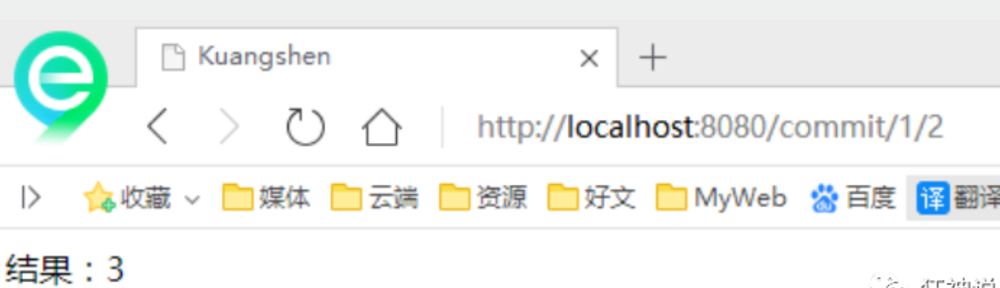

# SpringMVC

1. 模型 dao service 数据模型，提供要展示的数据，他们的行为由service提供。

2. 视图 jsp

3. 控制器 Servlet：（转发，重定向）接收用户请求，委托给模型进行处理（状态改变），处理完毕后把返回的模型数据返回给视图，由视图负责展示。控制器做了调度员的工作。

它是一种软件设计规范。将业务逻辑、数据和显示分离。


## 1 创建项目

* 导入依赖：junit,数据库驱动，连接池，servlet,jsp,mybatis,mybatis-spring,spring

```xml
<dependency>
    <groupId>junit</groupId>
    <artifactId>junit</artifactId>
    <version>4.12</version>
    <scope>test</scope>
</dependency>
<dependency>
    <groupId>mysql</groupId>
    <artifactId>mysql-connector-java</artifactId>
    <version>5.1.46</version>
</dependency>
<dependency>
    <groupId>com.mchange</groupId>
    <artifactId>c3p0</artifactId>
    <version>0.9.5.4</version>
</dependency>
<dependency>
    <groupId>javax.servlet</groupId>
    <artifactId>servlet-api</artifactId>
    <version>2.5</version>
</dependency>
<dependency>
    <groupId>javax.servlet.jsp</groupId>
    <artifactId>jsp-api</artifactId>
    <version>2.2</version>
</dependency>
<dependency>
    <groupId>org.springframework</groupId>
    <artifactId>spring-webmvc</artifactId>
    <version>5.2.4.RELEASE</version>
</dependency>
```

web.xml下的：

```xml
<?xml version="1.0" encoding="UTF-8"?>
<web-app xmlns="http://xmlns.jcp.org/xml/ns/javaee"
         xmlns:xsi="http://www.w3.org/2001/XMLSchema-instance"
         xsi:schemaLocation="http://xmlns.jcp.org/xml/ns/javaee http://xmlns.jcp.org/xml/ns/javaee/web-app_4_0.xsd"
         version="4.0">

    <!--    配置DispatchServlet：这是SpringMVC的核心-->
    <servlet>
        <servlet-name>SpringMVC</servlet-name>
        <servlet-class>org.springframework.web.servlet.DispatcherServlet</servlet-class>
        <init-param>
            <param-name>contextConfigLocation</param-name>
            <param-value>classpath:springmvc-servlet.xml</param-value>
        </init-param>
        <!--        启动级别-->
        <load-on-startup>1</load-on-startup>
    </servlet>
    <!--    在springmvc / 和 /* 有区别
    / 只匹配所有请求，不会匹配jsp页面，一般写/就可以了
    /* 匹配所有请求，包括jsp
    -->
    <servlet-mapping>
        <servlet-name>SpringMVC</servlet-name>
        <url-pattern>/</url-pattern>
    </servlet-mapping>

</web-app>
```

servlet configuration配置文件：

```xml
<?xml version="1.0" encoding="UTF-8" ?>
<beans xmlns="http://www.springframework.org/schema/beans"
       xmlns:xsi="http://www.w3.org/2001/XMLSchema-instance"
       xmlns:context="http://www.springframework.org/schema/context"
       xmlns:mvc="http://www.springframework.org/schema/mvc"
       xsi:schemaLocation="http://www.springframework.org/schema/beans
       https://www.springframework.org/schema/beans/spring-beans.xsd http://www.springframework.org/schema/context https://www.springframework.org/schema/context/spring-context.xsd http://www.springframework.org/schema/mvc https://www.springframework.org/schema/mvc/spring-mvc.xsd">


    <context:component-scan base-package="com.kuang.controller"/>
    <mvc:default-servlet-handler/>
    <mvc:annotation-driven/>


<!--    支持mvc注解驱动
        在spring中一般采用@RequestMapping注解来完成映射关系
        要想使@RequestMapping注解生效
        必须向上下文注册DefaultAnnotationHandlerMapping
        和一个AnnotationMethodHandlerAdapter实例
        这两个实例分别在类同级别和方法级别处理。
        而annotation-driven配置帮助我们自动完成上述两个实例的注入。
-->

<!--    视图解析器-->
<bean class="org.springframework.web.servlet.view.InternalResourceViewResolver"
      id="internalResourceViewResolver">
    <property name="prefix" value="/WEB-INF/jsp/"/>
    <property name="suffix" value=".jsp"/>
</bean>


</beans>
```

## 2. Controller及RestFul风格

### 1.控制器Controller

* 控制器复杂提供访问应用程序的行为，通常通过接口定义或注解定义两种方法实现。
* 控制器负责解析用户的请求并将其转换为一个模型。
* 在SpringMVC中一个控制器类可以包含多个方法。
* 在SpringMVC中，对于controller的配置方式有很多种。

### 2. 实现Controller接口

`Controller`是一个接口，在`org.springframework.web.servlet.mvc`包下，接口中只有一个方法。

```java
@FunctionalInterface
public interface Controller {
    @Nullable
    ModelAndView handleRequest(HttpServletRequest var1, HttpServletResponse var2) throws Exception;
}
```

### 3. 注解@Controller

在类加上`@Controller`, 方法加上`RequestMapping("/hello")`(“/hello"是起的名字)。

### 4.RequestMapping

**@RequestMapping**

- @RequestMapping注解用于映射url到控制器类或一个特定的处理程序方法。可用于类或方法上。用于类上，表示类中的所有响应请求的方法都是以该地址作为父路径。

- 只注解在方法上面

  ```java
  @Controller
  public class TestController {
     @RequestMapping("/h1")
     public String test(){
         return "test";
    }
  }
  ```

  访问路径：http://localhost:8080 / 项目名 / h1

- 同时注解类与方法

  ```java
  @Controller
  @RequestMapping("/admin")
  public class TestController {
     @RequestMapping("/h1")
     public String test(){
         return "test";
    }
  }
  ```

  访问路径：http://localhost:8080 / 项目名/ admin /h1  , 需要先指定类的路径再指定方法的路径；

### 5. RestFul风格

RestFul风格就是一个资源定位及资源操作的风格。不是标准也不是协议，只是一种风格。基于这个风格设计的软件可以更简洁，更有层次，更易于实现缓存等机制。

通过不同的请求方式来实现不同的效果！

#### 5.1 作用

安全 统一 高效

**传统方式操作资源**  ：通过不同的参数来实现不同的效果！方法单一，post 和 get

​	http://127.0.0.1/item/queryItem.action?id=1 查询,GET

​	http://127.0.0.1/item/saveItem.action 新增,POST

​	http://127.0.0.1/item/updateItem.action 更新,POST

​	http://127.0.0.1/item/deleteItem.action?id=1 删除,GET或POST

**使用RESTful操作资源** ：可以通过不同的请求方式来实现不同的效果！如下：请求地址一样，但是功能可以不同！

​	http://127.0.0.1/item/1 查询,GET

​	http://127.0.0.1/item 新增,POST

​	http://127.0.0.1/item 更新,PUT

​	http://127.0.0.1/item/1 删除,DELETE

### 5.2 测试

1. 在新建一个类 RestFulController

   ```
   @Controller
   public class RestFulController {
   }
   ```

2. 在Spring MVC中可以使用  @PathVariable 注解，让方法参数的值对应绑定到一个URI模板变量上。

   ```
   @Controller
   public class RestFulController {
   
      //映射访问路径
      @RequestMapping("/commit/{p1}/{p2}")
      public String index(@PathVariable int p1, @PathVariable int p2, Model model){
          
          int result = p1+p2;
          //Spring MVC会自动实例化一个Model对象用于向视图中传值
          model.addAttribute("msg", "结果："+result);
          //返回视图位置
          return "test";
          
     }
      
   }
   ```

3. 我们来测试请求查看下




**使用method属性指定请求类型**

用于约束请求的类型，可以收窄请求范围。指定请求谓词的类型如GET, POST, HEAD, OPTIONS, PUT, PATCH, DELETE, TRACE等

我们来测试一下：

- 增加一个方法

  ```java
  //映射访问路径,必须是POST请求
  @RequestMapping(value = "/hello",method = {RequestMethod.POST})
  public String index2(Model model){
     model.addAttribute("msg", "hello!");
     return "test";
  }
  ```

- 我们使用浏览器地址栏进行访问默认是Get请求，会报错405：

如果将POST修改为GET则正常了；

```java
//映射访问路径,必须是Get请求
@RequestMapping(value = "/hello",method = {RequestMethod.GET})
public String index2(Model model){
   model.addAttribute("msg", "hello!");
   return "test";
}
```

**小结：**

Spring MVC 的 @RequestMapping 注解能够处理 HTTP 请求的方法, 比如 GET, PUT, POST, DELETE 以及 PATCH。

**所有的地址栏请求默认都会是 HTTP GET 类型的。**

方法级别的注解变体有如下几个：组合注解

```java
@GetMapping
@PostMapping
@PutMapping
@DeleteMapping
@PatchMapping
```

@GetMapping 是一个组合注解，平时使用的会比较多！

它所扮演的是 @RequestMapping(method =RequestMethod.GET) 的一个快捷方式。

## 3.SpringMVC 结果跳转方式

### 3.1 ModelAndView

设置ModelAndView对象 , 根据view的名称 , 和视图解析器跳到指定的页面 .

页面 : {视图解析器前缀} + viewName +{视图解析器后缀}

```xml
<!-- 视图解析器 -->
<bean class="org.springframework.web.servlet.view.InternalResourceViewResolver"
     id="internalResourceViewResolver">
   <!-- 前缀 -->
   <property name="prefix" value="/WEB-INF/jsp/" />
   <!-- 后缀 -->
   <property name="suffix" value=".jsp" />
</bean>
```

对应的controller类

```java
public class ControllerTest1 implements Controller {

   public ModelAndView handleRequest(HttpServletRequest httpServletRequest, HttpServletResponse httpServletResponse) throws Exception {
       //返回一个模型视图对象
       ModelAndView mv = new ModelAndView();
       mv.addObject("msg","ControllerTest1");
       mv.setViewName("test");
       return mv;
  }
}
```

### 3.2 ServletAPI

通过设置ServletAPI , 不需要视图解析器 .

1、通过HttpServletResponse进行输出

2、通过HttpServletResponse实现重定向

3、通过HttpServletResponse实现转发

```java
@Controller
public class ResultGo {

   @RequestMapping("/result/t1")
   public void test1(HttpServletRequest req, HttpServletResponse rsp) throws IOException {
       rsp.getWriter().println("Hello,Spring BY servlet API");
  }

   @RequestMapping("/result/t2")
   public void test2(HttpServletRequest req, HttpServletResponse rsp) throws IOException {
       rsp.sendRedirect("/index.jsp");
  }

   @RequestMapping("/result/t3")
   public void test3(HttpServletRequest req, HttpServletResponse rsp) throws Exception {
       //转发
       req.setAttribute("msg","/result/t3");
       req.getRequestDispatcher("/WEB-INF/jsp/test.jsp").forward(req,rsp);
  }

}
```

### 3.3 SpringMVC

**通过SpringMVC来实现转发和重定向 - 无需视图解析器；**

测试前，需要将视图解析器注释掉

```java
@Controller
public class ResultSpringMVC {
   @RequestMapping("/rsm/t1")
   public String test1(){
       //转发
       return "/index.jsp";
  }

   @RequestMapping("/rsm/t2")
   public String test2(){
       //转发二
       return "forward:/index.jsp";
  }

   @RequestMapping("/rsm/t3")
   public String test3(){
       //重定向
       return "redirect:/index.jsp";
  }
}
```


**通过SpringMVC来实现转发和重定向 - 有视图解析器；**

重定向 , 不需要视图解析器 , 本质就是重新请求一个新地方嘛 , 所以注意路径问题.

可以重定向到另外一个请求实现 .

```java
@Controller
public class ResultSpringMVC2 {
   @RequestMapping("/rsm2/t1")
   public String test1(){
       //转发
       return "test";
  }

   @RequestMapping("/rsm2/t2")
   public String test2(){
       //重定向
       return "redirect:/index.jsp";
       //return "redirect:hello.do"; //hello.do为另一个请求/
  }

}
```

## 4.数据处理

### 4.1处理提交数据

**1、提交的域名称和处理方法的参数名一致**

提交数据 : http://localhost:8080/hello?name=kuangshen

处理方法 :

```java
@RequestMapping("/hello")
public String hello(String name){
   System.out.println(name);
   return "hello";
}
```

后台输出 : kuangshen


**2、提交的域名称和处理方法的参数名不一致**

提交数据 : http://localhost:8080/hello?username=kuangshen

处理方法 :

```java
//@RequestParam("username") : username提交的域的名称 .
@RequestMapping("/hello")
public String hello(@RequestParam("username") String name){
   System.out.println(name);
   return "hello";
}
```

后台输出 : kuangshen


**3、提交的是一个对象**

要求提交的表单域和对象的属性名一致  , 参数使用对象即可

1、实体类

```java
public class User {
   private int id;
   private String name;
   private int age;
   //构造
   //get/set
   //tostring()
}
```

2、提交数据 : http://localhost:8080/mvc04/user?name=kuangshen&id=1&age=15

3、处理方法 :

```java
@RequestMapping("/user")
public String user(User user){
   System.out.println(user);
   return "hello";
}
```

后台输出 : User { id=1, name='kuangshen', age=15 }

说明：如果使用对象的话，前端传递的参数名和对象名必须一致，否则就是null。


### 4.2数据显示到前端

**第一种 : 通过ModelAndView**

我们前面一直都是如此 . 就不过多解释

```java
public class ControllerTest1 implements Controller {

   public ModelAndView handleRequest(HttpServletRequest httpServletRequest, HttpServletResponse httpServletResponse) throws Exception {
       //返回一个模型视图对象
       ModelAndView mv = new ModelAndView();
       mv.addObject("msg","ControllerTest1");
       mv.setViewName("test");
       return mv;
  }
}
```


**第二种 : 通过ModelMap**

ModelMap(继承了linkedhashmap)

```java
@RequestMapping("/hello")
public String hello(@RequestParam("username") String name, ModelMap model){
   //封装要显示到视图中的数据
   //相当于req.setAttribute("name",name);
   model.addAttribute("name",name);
   System.out.println(name);
   return "hello";
}
```


**第三种 : 通过Model**

Model (精简，大部分情况使用model即可，只有几个方法)

```java
@RequestMapping("/ct2/hello")
public String hello(@RequestParam("username") String name, Model model){
   //封装要显示到视图中的数据
   //相当于req.setAttribute("name",name);
   model.addAttribute("msg",name);
   System.out.println(name);
   return "test";
}
```


### 4.3对比

就对于新手而言简单来说使用区别就是：

```
Model 只有寥寥几个方法只适合用于储存数据，简化了新手对于Model对象的操作和理解；

ModelMap 继承了 LinkedMap ，除了实现了自身的一些方法，同样的继承 LinkedMap 的方法和特性；

ModelAndView 可以在储存数据的同时，可以进行设置返回的逻辑视图，进行控制展示层的跳转。
```

当然更多的以后开发考虑的更多的是性能和优化，就不能单单仅限于此的了解。

**请使用80%的时间打好扎实的基础，剩下18%的时间研究框架，2%的时间去学点英文，框架的官方文档永远是最好的教程。**

## 5. 乱码问题

测试步骤：

1、我们可以在首页编写一个提交的表单

```xml
<form action="/e/t" method="post">
 <input type="text" name="name">
 <input type="submit">
</form>
```

2、后台编写对应的处理类

```java
@Controller
public class Encoding {
   @RequestMapping("/e/t")
   public String test(Model model,String name){
       model.addAttribute("msg",name); //获取表单提交的值
       return "test"; //跳转到test页面显示输入的值
  }
}
```

3、输入中文测试，发现乱码

不得不说，乱码问题是在我们开发中十分常见的问题，也是让我们程序猿比较头大的问题！

以前乱码问题通过过滤器解决 , 而SpringMVC给我们提供了一个过滤器 , 可以在web.xml中配置 .

修改了xml文件需要重启服务器！

```xml
<filter>
   <filter-name>encoding</filter-name>
   <filter-class>org.springframework.web.filter.CharacterEncodingFilter</filter-class>
   <init-param>
       <param-name>encoding</param-name>
       <param-value>utf-8</param-value>
   </init-param>
</filter>
<filter-mapping>
   <filter-name>encoding</filter-name>
   <url-pattern>/*</url-pattern>
</filter-mapping>
```

但是我们发现 , 有些极端情况下.这个过滤器对get的支持不好 .

处理方法 :

1、修改tomcat配置文件 ：设置编码！

```xml
<Connector URIEncoding="utf-8" port="8080" protocol="HTTP/1.1"
          connectionTimeout="20000"
          redirectPort="8443" />
```

2、自定义过滤器

```java
package com.kuang.filter;

import javax.servlet.*;
import javax.servlet.http.HttpServletRequest;
import javax.servlet.http.HttpServletRequestWrapper;
import javax.servlet.http.HttpServletResponse;
import java.io.IOException;
import java.io.UnsupportedEncodingException;
import java.util.Map;

/**
* 解决get和post请求 全部乱码的过滤器
*/
public class GenericEncodingFilter implements Filter {

   @Override
   public void destroy() {
  }

   @Override
   public void doFilter(ServletRequest request, ServletResponse response, FilterChain chain) throws IOException, ServletException {
       //处理response的字符编码
       HttpServletResponse myResponse=(HttpServletResponse) response;
       myResponse.setContentType("text/html;charset=UTF-8");

       // 转型为与协议相关对象
       HttpServletRequest httpServletRequest = (HttpServletRequest) request;
       // 对request包装增强
       HttpServletRequest myrequest = new MyRequest(httpServletRequest);
       chain.doFilter(myrequest, response);
  }

   @Override
   public void init(FilterConfig filterConfig) throws ServletException {
  }

}

//自定义request对象，HttpServletRequest的包装类
class MyRequest extends HttpServletRequestWrapper {

   private HttpServletRequest request;
   //是否编码的标记
   private boolean hasEncode;
   //定义一个可以传入HttpServletRequest对象的构造函数，以便对其进行装饰
   public MyRequest(HttpServletRequest request) {
       super(request);// super必须写
       this.request = request;
  }

   // 对需要增强方法 进行覆盖
   @Override
   public Map getParameterMap() {
       // 先获得请求方式
       String method = request.getMethod();
       if (method.equalsIgnoreCase("post")) {
           // post请求
           try {
               // 处理post乱码
               request.setCharacterEncoding("utf-8");
               return request.getParameterMap();
          } catch (UnsupportedEncodingException e) {
               e.printStackTrace();
          }
      } else if (method.equalsIgnoreCase("get")) {
           // get请求
           Map<String, String[]> parameterMap = request.getParameterMap();
           if (!hasEncode) { // 确保get手动编码逻辑只运行一次
               for (String parameterName : parameterMap.keySet()) {
                   String[] values = parameterMap.get(parameterName);
                   if (values != null) {
                       for (int i = 0; i < values.length; i++) {
                           try {
                               // 处理get乱码
                               values[i] = new String(values[i]
                                      .getBytes("ISO-8859-1"), "utf-8");
                          } catch (UnsupportedEncodingException e) {
                               e.printStackTrace();
                          }
                      }
                  }
              }
               hasEncode = true;
          }
           return parameterMap;
      }
       return super.getParameterMap();
  }

   //取一个值
   @Override
   public String getParameter(String name) {
       Map<String, String[]> parameterMap = getParameterMap();
       String[] values = parameterMap.get(name);
       if (values == null) {
           return null;
      }
       return values[0]; // 取回参数的第一个值
  }

   //取所有值
   @Override
   public String[] getParameterValues(String name) {
       Map<String, String[]> parameterMap = getParameterMap();
       String[] values = parameterMap.get(name);
       return values;
  }
}
```

这个也是我在网上找的一些大神写的，一般情况下，SpringMVC默认的乱码处理就已经能够很好的解决了！

**然后在web.xml中配置这个过滤器即可！**

乱码问题，需要平时多注意，在尽可能能设置编码的地方，都设置为统一编码 UTF-8！


