# 数据库

## 一、绪论

数据、数据库、数据库管理系统和数据库系统是4个基本概念。

1. 数据（data）

数据是数据库种存储的基本对象。（数字、字符、音视频等等）

<font color = "green">描述事物的符号记录称为数据。</font>

2. 数据库（Data Base,DB)

数据库是存放数据的仓库。<font color = "green">数据库是长期存储在计算机内、有组织的、可共享的大量数据的集合。数据库中的数据按一定的数据模型组织、描述和存储，具有较小的冗余度、较高的数据独立性和易扩展性，并可为各种用户共享</font>

3. 数据库管理系统

它有以下功能：

1）数据定义功能。

2）数据组织、存储和管理

3）数据操纵功能

4）数据库的事务管理和运行管理

5）数据库的建立和维护功能

6）其他功能

4. 数据库系统

数据库系统是由数据库、数据库管理系统、应用程序和数据库管理员组成的存储、管理、处理和维护数据的系统。

### 1. 两类数据模型

第一类是概念模型，第二类是逻辑模型和物理模型。

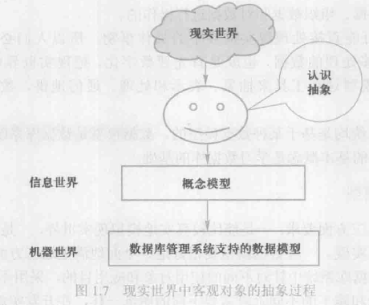

* **概念模型**

也叫信息模型,是现实世界到机器世界的一个中间层次。

信息世界中基本概念：

1） 实体。 客观存在并可相互区别的事物称为实体。

2） 属性。 实体所具有的某一特性称为属性。

3） 码。 唯一标识实体的属性集成为码。

4）实体性。 用实体名及其属性名集合来抽象和刻画同类实体，称为实体性。

5） 实体集。 同一类型实体的集合称为实体集。

6） 联系。 实体之间的联系通常是指不同实体集之间的联系。

实体之间的联系有一对一、一对多和多对多等多种类型。

概念模型的一种表示方法：实体-联系方法，该方法使用**ER图**，E-R方法也称为E-R模型。

* **数据模型**

通常由数据结构、数据操作和数据的完整性约束条件三部分组成。

1） 数据结构。描述数据库的组成对象以及对象之间的联系。

2） 数据操作。对数据库中的各种对象的实例允许执行的操作的集合，包括操作及有关的操作规则。

3）数据的完整性约束。

常用的数据模型：

1） 层次模型 （树）

* 有且只有一个结点没有双亲结点，这个结点是根节点。

* 根以外的其他结点没有双亲结点。

2）网状模型

* 允许一个以上的结点无双亲。
* 一个结点可以有多于一个的双亲。

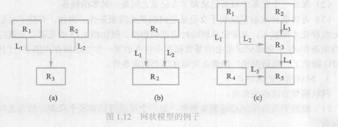

* 关系模型

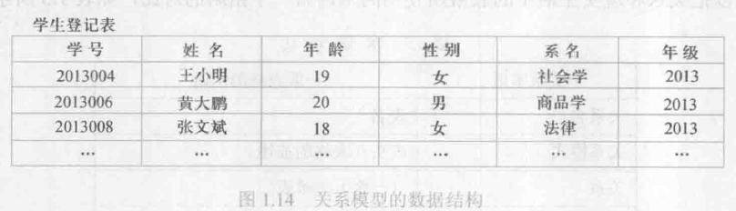


关系：一个关系对应通常说的一张表。

元组：表中的一行。

属性：表中的一列。

码：也称为码键。表中的某个属性组，它可以唯一确定一个元组。

域：域是一组具有相同数据类型的值的集合。属性的取值范围来自某个域。

分量：元组中的一个属性值。

关系模式：对关系的描述，一般表示为：关系名（属性1，属性2，...，属性n）

关系模型要求关系必须是规范化的，<font color = "green">关系的每一个分量必须是一个不可分的数据项</font>。

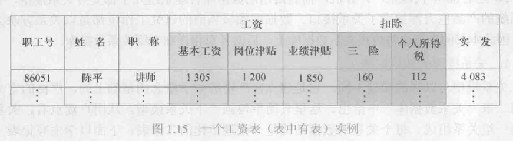

### 2.数据库系统的结构

在数据模型中有“型(type)”和“值”的概念。型是指对某一类数据的结构和属性的说明，值是型的一个具体赋值。模式是数据库中全体数据的逻辑结构和特征的描述，它仅仅涉及型的描述，不涉及具体的值。

* 数据库系统的三级模式结构

外模式、模式和内模式三级构成。

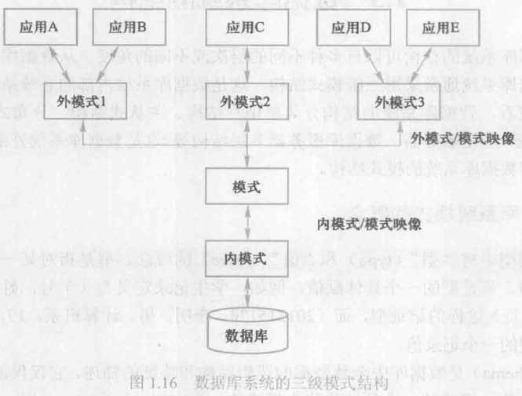

1. 模式

模式也成为逻辑模式，是数据库中全体数据的逻辑结构和特征的描述，是所有用户的公共数据视图。一个数据库只有一个模式。数据库模式以某一种数据模型为基础，同意综合地考虑了所有用户的需求。

2. 外模式

外模式也称为子模式或用户模式，它是数据库用户能够看见和使用的局部数据的逻辑结构和特征的描述，是数据库用户的数据视图，是与某一应用有关的数据的逻辑表示。

外模式是模式的子集。

3. 内模式

内模式也称为存储模式，一个数据库只有一个内模式。它是数据物理结构和存储方式的描述，是数据在数据库内部的组织方式。

 <font color = "green">外模式/模式映像</font>

模式描述的是数据的全局逻辑结构，外模式描述的是数据的局部逻辑结构。每一个外模式，都有一个外模式/模式映像，它定义了外模式和模式之间的对应关系。这些映像定义通常包含各自外模式的描述。

<font color = "green">模式/内模式映像</font>

模式内模式映像是唯一的，它定义了数据全局逻辑结构与存储结构之间的对应关系。

## 二、关系数据库

### 1.关系数据结构及其形式化定义

关系模型是建立在集合代数的基础上的。

笛卡尔积：

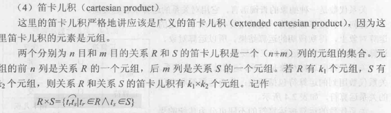

* <font color = "red" size = 5>关系</font>

$D_1 \times D_2 \times .... \times D_n$ 的子集叫做在域$D_1, D_2, ...,D_n$上的关系。表示为$R(D_1,D_2,...,D_n)$

这里的R表示关系的名字，n是关系的目或度（degree)。

n = 1，表示是单元关系。

n = 2，表示是二元关系。

<font color = "green">若关系中某一个属性组的值能唯一地标识一个元组，而其子集不能，则称该属性组为**候选码**</font>

若一个关系有多个候选码，则选定其中一个为**主码**。候选码的诸属性称为**主属性**。

* <font color = "red" size = 5>关系模式</font> 

关系数据库中，关系模式是型，关系是值。关系模式是对关系的描述。

关系模式可以形式化地表示为$R(U,D,DOM,F)$，其中R为关系名，U为组成该关系的属性名集合，D为U中属性所来自的域，DOM为属性向域的映像集合，F为属性间数据的依赖关系集合。

关系数据库：所有关系的集合。


关系操作：查询和插入、删除、修改。

查询操作可以分为选择、投影、连接、除、并、差、交、笛卡尔积等。其中选择、投影、并、差、笛卡尔积是5中基本操作。操作的对象和结果都是集合。非关系数据模型的数据操作方式则为一次一记录的方式。


# InnoDB 技术内幕

连接MySQL操作是一个连接进程和MySQL数据库实例进行通信。比如通过TCP/IP连接到MySQL实例，数据库会先检查一张权限视图，用来判断发起请求的客户端IP是否允许连接到Mysql实例。

### 1. InnoDB体系架构

1. Master Thread

核心的后台线程，主要负责将缓冲池中的数据异步刷新到磁盘，保证数据的一致性，包括脏页的刷新、合并插入缓冲、UNDO页的回收。

2. IO Thread

InnoDB存储引擎大量使用AIO（Async IO）来处理写IO请求，这样可以大大提高数据库的性能。InnoDB 1.0 版本之前共有4个IO Tread。write、read、insert buffer、log IO thread。

3. Purge Thread

PurgeThread来回收已经使用并分配的undo页。


## 基础查询

### 1、`Select`

```mysql
Select 查询列表 from 表名;
SELECT last_name,email,salary from employees; #查询多个字段
SELECT 100*98;#查询表达式
SELECT VERSION();#查询函数
SELECT DISTINCT department_id FROM employees;#去重复
SELECT 100+90;
SELECT '123'+90;#看3点
```

1. 查询列表可以是字段、常量值、函数和表达式。

2. 查询的结果是一个虚拟的表格。

3. `+`的作用：

   a. 两个操作数都为数值型，则做加法运算。

   b.其中一方为字符型，试图将字符型数值转换为数值型。如果转换成功，则继续做加法运算。如果失败，则字符型转换为0

   c. 只要其中一方为`null`，则结果肯定为`null`。

4. `CONCAT` 连接

```mysql
SELECT CONCAT('a','b','c') As 结果;
```


### 单行函数

1. 字符函数

`length` 

```mysql
SELECT LENGTH('john');
```

`concat` 拼接字符串

```mysql
SELECT CONCAT(last_name,'_',first_name) 姓名 FROM employees;
```

`upper` `lower`

```
SELECT UPPER('john');
SELECT LOWER('joHn');
```

`substr` `substring`

```mysql
SELECT SUBSTR('李莫愁爱上了陆展元',6) out_put;// 陆展元
SELECT SUBSTR("李莫愁爱上了陆展元"，1，3) output //李莫愁
```

`instr`

```mysql
SELECT INSTR('杨不悔爱上了殷六侠','殷六侠') AS out_put; 返回子串第一次出现的索引，如果找不到返回0
```

`trim`

```mysql
SELECT TRIM('      张翠山    ') AS out_put;
```

`lpad`

```mysql
SELECT LPAD('殷素素',10,'*') AS out_put;//左侧填充
```

`rpad`

```mysql
SELECT RPAD('殷素素',10,'*') AS out_put;//右侧填充
```

`replace`

```mysql
SELECT REPLACE ('张无忌爱上了周芷若周芷若爱上了张无忌','周芷若'，'赵敏') AS out_put;
```


2. 数学函数

`round` 四舍五入

```mysql
SELECT ROUND(1.65);
```

`ceil` 向上取整

```mysql
SELECT CEIL(1.00); # 返回该参数的最小整数
```

`floor` 向下取整

```mysql
SELECT FLOOR(-9.99)
```

`truncate` 截断

```mysql
SELECT TRUNCATE(1.6999,1);
```

`mod`

```
SELECT MOD(-10,3);

```


2. 日期函数
3. 其他函数
4. 流程控制函数


#### Union 联合查询

多张表合并成一个结果。（要查询的结果来自于多个表，且多个表没有直接的关系，但查询的信息一般是一致的）。

# 高级部分


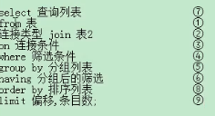

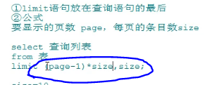

### Explain + SQL 语句优化

#### id


#### TYPE

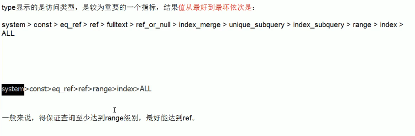

### 2.六大约束


#### 2.1 事务

### 2.1.1 是什么

一组原子性的SQL查询，后者说是一个独立的工作单元。

### 2.1.2 为什么

比如现实生活中银行的转账操作，必须打包在一个事务中（从转账方减去，收款方加上）。

### 2.1.3 怎么做

通过满足ACID的要求。

数据库中有四种隔离级别：

1. READ UNCOMMITED （未提交读）
2. READ COMMMITTED （提交读）
3. REPEATABLE READ （可重复读）MYSQL默认的隔离级别。
4. SERIALIZABLE （可串行化）

设置回滚点

```mysql
savepoint 回滚点名
rollback to 回滚点名
```

并发事务

多个事务 同时操作  同一个数据库的相同数据时。


并发问题都有哪些：

脏读：一个事务读取了其他事务还没有提交的数据

不可重复读：一个事务多次读取，结果不一样。

幻读：一个事务读取了其他事务还没有提交的数据，只是读到的是其他事务“插入”的数据。


通过设置隔离级别来解决并发问题。


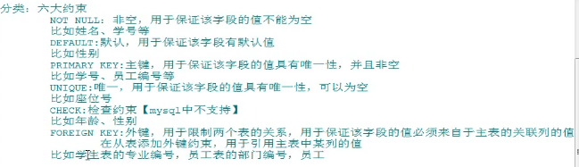

tips: 

* 创建表时添加
* 修改表时添加

```mysql
CREATE TABLE TEST{
	字段名 字段类型 列级约束
	表级约束
}
```

#### 2.1 约束分类

NOT NULL 非空，该字段

UNIQUE 唯一，该字段的值不可重复

DEFAULT 默认，该字段的值不用手动插入有默认值。

CHECK 检查，mysql不支持。

PRIMARY KEY

FOREIGN KEY


主键和唯一的区别：

主键不允许为空，唯一允许为空

一个表至多一个主键，唯一可以多个。

相同点：都具有唯一性。


* 列级约束

  六大约束都支持，但外键约束咩有效果。 不可以起约束名字。

  ```mysql
  CREATE TABLE stuinfo{
  	id INT PRIMARY KEY,
  	stuName VARCHAR(20) NOT NULL,
  	gender CHAR(1) CHECK(gender = '男' OR gender = '女',
  	seat INT UNIQUE,
      age INT DEFAULT 18,
      majorId INT FOREIGN KEY REFERENCE major(id)
  }
  CREATE TABLE major{
      id INT PRIMARY KEY,                 
  }                               
  ```

* 表级约束

  除了非空、默认，其他都支持。 可以起约束名字，但对主键无效。

```mysql
CREATE TABLE stuinfo{
	id INT,
	stuName VARCHAR(20) NOT NULL,
	gender CHAR(1) CHECK(gender = '男' OR gender = '女',
	seat INT UNIQUE,
    age INT DEFAULT 18,
    majorId INT,
    CONSTRAINT pk PRIMARY KEY(id),
    CONSTRAINT ue UNIQUE(seat),
    CONSTRAINT fp_stuinfo_major FOREIGN KEY(majorID) REFERENCE major(id)                     
}
CREATE TABLE major{
    id INT PRIMARY KEY,                 
}  
```

通用写法：

```mysql
CREATE TABLE stuinfo{
	id INT PRIMARY KEY,
	stuName VARCHAR(20) NOT NULL,
	gender CHAR(1) CHECK(gender = '男' OR gender = '女',
	seat INT UNIQUE,
    age INT DEFAULT 18,
    CONSTRAINT fp_stuinfo_major FOREIGN KEY(majorID) REFERENCE major(id) ## 只写外键
                         
}
CREATE TABLE major{
    id INT PRIMARY KEY,                 
}  
```

#### 2.2 主键和唯一键区别

| name   | 唯一性 | 允许空 | 一个表中多少个 | 允许组合 |
| ------ | ------ | ------ | -------------- | -------- |
| 主键   | 是     | 不允许 | 最多一个       | 允许     |
| 唯一键 | 是     | 允许   | 可以多个unique | 允许     |

唯一键`null`只能有一个

### 2.3 外键的特点

1. 要求从表设置外键关系。
2. 从表外键列类型和主表类型一致或兼容，名称无所谓。
3. 主表的关联列必须是key（一般是主键或唯一）
4. 插入数据先插入主表再从表，删除顺序相反。

#### 2.4 修改表添加约束

```mysql
ALTER TABLE stuInfo MODIFY COLUMN stuname VARCHAR(20) NOT NULL # 非空约束
# 列级约束
ALTER TABLE stuInfo MODIFY COLUMN id INT PRIMARY KEY;
# 表级约束
ALTER TABLE stuInfo ADD PRIMARY KEY(id);
```

#### 2.5 修改表时删除约束

```mysql
# 删除唯一键
ALTER TABLE stuInfo DROP INDEX seat;
# 删除主键
ALTER TABLE stuInfo DROP PRIMARY KEY;

# 删除外键
ALTER TABLE stuInfo DROP FOREIGN KEY majorid;
# 或者可以直接更改原来的形式 not null ---> null
ALTER TABLE stuInfo MODIFY stuname VARCHAR(20) NULL;
```

### 3. 标识列

* 自增长列，系统提供默认的序列值（1开始）
* 一个表只能有一个标识列
* 只能是数值型 （INT FLOAT DOUBLE)
* mysql 可以设置步长

#### 3.1 创建表时

```mysql
CRATE TABLE test{
	id INT PRIMARY KEY AUTO_INCREMENT,
	NAME VARCHAR(20)
}

set auto_increment_increment=3 #步长每次加3
```

#### 3.2 修改表时

```mysql
ALTER TABLE tab_identity MODIFY COLUMN id PRIMARY KEY AUTO_INCREMENT;
# 删除自增
ALTER TABLE tab_identity MODIFY COLUMN id PRIMARY KEY;
```

#### 3.3 隔离级别

4种事务隔离级别。

MYSQL四种都支持，默认REPEATEBLE READ。 

READ UNCOMMITTED

READ COMMITED 避免脏读

REPEATABLE READ 脏读和不可重复读都避免

SERIALIZABLE 串行化，效率十分低下。

### 4. 视图

#### 4.1 视图

概念：虚拟表，和普通表一样使用。通过表动态生成的数据。<font color = "red">只保存sql逻辑。</font>

```mysql
CREATE VIEW name 
AS
...

```

多个地方用到同样的查询结果，或sql语句较为复杂。

#### 4.2 视图修改

```mysql
create or replace veiw 视图名  #方式一
as 
查询语句

alter view 视图名
as 
查询语句
```

#### 4.3 视图删除

```mysql
DROP VIEW 视图名，视图名...
```

#### 4.4 显示视图

```mysql
show create view 视图名
```

#### 4.5 视图更新

```mysql
INSERT INTO 视图名 VALUES(‘zhangfei’,'1940')
```

有一些语句是不能更新的，具备以下特点的是不能更新的

1:

```mysql
SELECT 语句中包含子查询
JOIN
GROUP BY
JOIN（查询时使用到了JOIN）
from 一个不能更新的视图
WHERE 子句的子查询引用了from子句中的表
DISTINCT
union union all
```


#### 4.6 delete 和 truncate 在事务使用时的区别

`trancate`不支持回滚

delete每次删除一行。

trancate table一次性删除所有数据且不记录日志保存，执行速度快。

执行速度上：drop > trancate > delete


### 5. 变量

#### 5.1 系统变量

变量有系统提供，不是用户定义，属于服务器层面。

1. 查看所有的系统变量。

`SHOW GLOBAL | 【SESSION】 VARIABLES`

2. 查看满足条件的部分系统变量

`SHOW GLOBAL | 【SESSION】 variables like '%char%'`

3. 查看指定的某个系统变量的值。

   `select @@global | 【session】.系统变量名`

4. 为某个系统变量赋值

`set @@global | session.系统变量名 = 值`

#### 5.2 自定义变量

用户自定义的，不是由系统提供的。

声明 赋值 使用

1. 用户变量

作用域：针对当前会话连接有效，同于会话变量的作用域。

`SET @用户变量名=值` 或

`set @用户变量名:=值；`或

`select @用户变量名:=值`

2. 局部变量

a 声明

`declare 变量名 类型`

`declare 变量名 类型 default  值`

b 赋值

通过SET 或 SELECT

`SET @局部变量名=值` 或

`set @局部变量名:=值；`或

`select @局部变量名:=值`

c 使用

`select 局部变量名`

#### 5.3 存储过程和函数

类似于java中的方法。

1. 提高代码的重用性。

2. 简化操作。
3. 减少了编译次数，减少了和数据库的连接次数。

* 概念：一组预先编译好的SQL语句的集合，理解成批处理语句。

* 创建

  ```mysql
  create procedure 存储过程名(参数列表)
  BEGIN
  	存储过程体（一组合法的SQL语句）
  END
  ```

  注意：

  1. 参数列表包括三部分

     参数模式 参数名 参数类型

     举例：

     IN stuname VARCHAR(20)

     参数模式：

     IN ：该参数可以作为输入，该参数需要调用方法传入值

     OUT:该参数可以作为输出，也就是该参数可以作为返回值

     INOUT:该参数既可以作为输入又可以作为输出，也就是该参数既需要传入值又可以返回值。

  2. 如果存储过程体仅仅只有一句话，BEGIN END可以省略

* 调用

```mysql
CALL 存储过程名(实参列表)
```

```mysql
DELIMITER $
CREATE PROCEDURE myp1(IN beautyName VARCHAR(20), IN newName VARCHAR(20), OUT boyName VARCHAR(20),OUT userCP INT) # 还有一个INOUT
BEGIN
	INSERT INTO admin(username, 'password') values('','')
END $

CALL myp1('柳岩')$
```


#### 5.4 存储过程的删除和查看

```mysql
DROP PROCEDURE P1;
SHOW CREATE PROCEDURE P1;
```


## 6. 函数

* 概念

适合做处理数据返回一个结果。（增删改是适合存储过程）

```mysql
CREATE FUNCTION 函数名（参数列表）RETURNS 返回类型
begin
函数体
end
```

### 6.1 调用语法

```mysql
select 函数名(参数列表)
```

```mysql
返回公司的员工个数
CREATE FUNCTION myf1() RETURNS INT
BEGIN
	DECLARE c INT DEFAULT 0;
	SELECT COUNT(*)
	FROM employees;
	RETURN c;
END $

SELECT myf1() $
DROP FUNCTION P1;
SHOW CREATE FUNCTION P1;
```


## 7. 分支结构


### 7.2 case

情况一：（作为独立语句才可返回语句，并且只能放在BEGIN END中）

 case 变量|表达式|字段

when 要判断的值 THEN 返回的值或语句1；

...

else 要返回的值或语句

END CASE;

情况二：

 case 变量|表达式|字段

when 要判断的值 THEN 返回的值或语句；

...

else 要返回的值

END CASE;


### 7.3 IF结构

实现多重分支。


## 8. 循环结构

### 8.1 WHILE 

while 循环条件 do

循环体

end while;

### 8.2 loop

loop

循环体；//要搭配leave。

end loop;

### 8.3 repeat

类似于do while

repeat

循环体

until 结束循环条件

end repeat。


## 1. MYSQL 架构

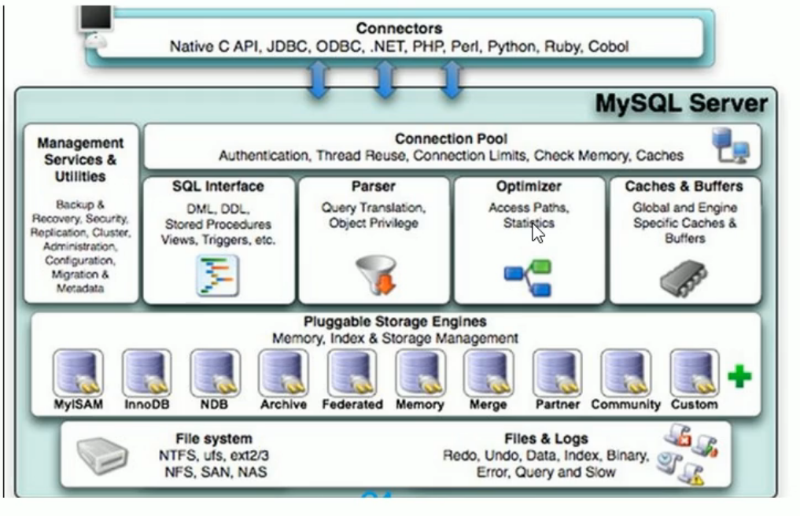

1. 连接层
2. 服务层
3. 引擎层
4. 存储层


## 1. 索引

```mysql
CREATE [UNIQUE] INDEX indexname ON mytable(columnname(length));#或
ALTER mytable ADD [UNIQUE] INDEX [indexname] ON (columnname(length))
```

### 1.1 删除索引

```mysql
DROP INDEX [indexname] ON mytable;
```

### 1.2 查看索引

```mysql
SHOW INDEX FROM tablename;
```

### 1.3 建立索引条件


### 1.4 不建立索引条件

1. 表的记录太少
2. 经常增删改的表
3. 某个列包含很多重复的数据，建立索引没有太大的实际效果。

### 1.5 索引失效场景

1. 组合索引未使用最左前缀，例如组合索引（A，B），where B=b不会使用索引；
2. like未使用最左前缀，where A like '%China'；
3. 搜索一个索引而在另一个索引上做order by，where A=a order by B，只使用A上的索引，因为查询只使用一个索引 ；
4. or会使索引失效。如果查询字段相同，也可以使用索引。例如where A=a1 or A=a2（生效），where A=a or B=b（失效）
5. 如果列类型是字符串，要使用引号。例如where A='China'，否则索引失效（会进行类型转换）；
6. 在索引列上的操作，函数（upper()等）、or、！=(<>)、not in等；

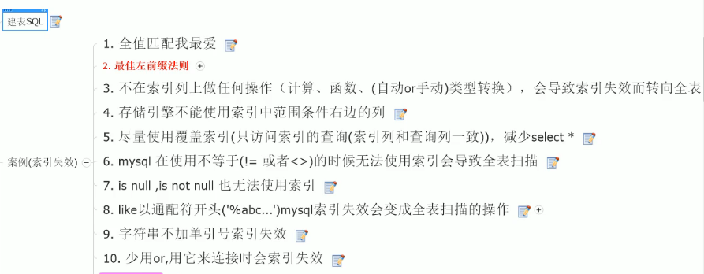

### 1.6 性能下降

1. 查询语句写的烂
2. 索引失效
3. 关联查询太多join
4. 服务器调优及各个参数的设置。

### 1.7 row\gap lock\next_key lock

首先，要明白锁是建立在索引上的，所以如果不是索引，那么就会锁住整张表。

其次，分情况讨论索引类型：

比如我数据库中有这么一张表user2：

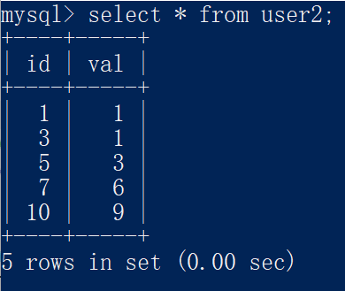

1. UNIQUE （唯一键索引 id）

   执行 `select * from user2 where id = 5 for update`；

   1. 锁有此纪录（5），next_key lock退化成行锁，只锁定这一行。
   2. 锁无此记录（比如将上面的语句改为id=6），唯一索引都是确定的不用边界，退化成gap 锁，锁定这个范围（开区间 （5，7））。

1. 普通索引 （val）

   执行 `select * from user2 where val = 3 for update`；

   1. 锁有记录(val = 3)，锁定范围是(1,3] [3,6]
   2. 锁无记录(上面语句 val = 4) ,锁定范围是(3,6]。

   普通索引锁定范围+下边界。

这句话是别人的总结：
1，Record Lock：单个行记录上的锁
2，Gap Lock：间隙锁，锁定一个范围，但不包括记录本身。GAP锁的目的，是为了防止同一事务的两次当前读，出现幻读的情况
3，Next-Key Lock：1+2，锁定一个范围，并且锁定记录本身。对于行的查询，都是采用该方法，主要目的是解决幻读的问题。


## 2. 7种JOIN 

```mysql
SELECT DISTINCT 
	<select_list>
FROM
	< left_table> <join_type >
JOIN < right_table> ON <join_condition>
where
	< where_condition >
GROUP BY
	< group_by_list >
HAVING
	< having_condition >
ORDER BY
	< order_by_condition >
LIMIT < limit_number >
```

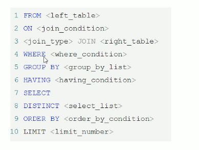


### 7.1 SQL 优化器

* 概念

它按照自己搜集的统计信息给出它认为最优的执行计划。

### 7.2 EXPLAIN

1. 慢查询的开启并捕获。
2. explain + 慢SQL分析
3. show profile查询SQL在Mysql服务器里面的执行细节和生命周期情况。
4. SQL数据库服务器的参数调优。


| id                                                           | select_type                                                  | table                                     | type | possible_keys | key  | key_len | ref  | rows | Extra |
| ------------------------------------------------------------ | ------------------------------------------------------------ | ----------------------------------------- | ---- | ------------- | ---- | ------- | ---- | ---- | ----- |
| select查询的序列号，包含的一组数字，表示查询中执行select子句或操作表的顺序。 | SIMPLE、PRIMARY、SUBQUERY、DERIVED、UNION、UNION RESULT 查询的类型，普通查询、联合查询、子查询等复杂查询 | 衍生 = derived (给这个表重新起了一个名字) |      |               |      |         |      |      |       |
| id相同，执行顺序由上到下                                     |                                                              |                                           |      |               |      |         |      |      |       |
| id 不相同，id的序号会递增，id值越大优先级越高，越先被执行。  |                                                              |                                           |      |               |      |         |      |      |       |
| id 相同不同，同时存在                                        |                                                              |                                           |      |               |      |         |      |      |       |

* id 表的读取顺序


* select_type 数据读取操作的操作类型

  * 简单的select查询，查询中不包含子查询或者UNION

  * PRIMARY 鸡蛋壳，最后加载的那个
  * SUBQUERY 括号里的子查询
  * DERIVED 临时表，把结果放在临时表里的。FROM 列表包含子查询表记derived。
  * UNION 若第二个SELECT出现在UNION之后，则被标记为UNION。若UNION出现在FROM的子查询中，外层SELECT被标记为DERIVED。
  * UNION RESULT 从union表中获取union结果。

* type 访问类型

  *  |ALL|index|range|ref|eq_ref|const| system|null|

  *  从最好到最差依次如下： system > const > eq_ref > ref > range > index > ALL
  *  只要达到range级别，就够好了。
  *  system 表只有一行记录（等于系统表）。这是类型的特例，平时不会出现，这个也可以忽略不计。
  *  const 表示通过索引一次就找到了，const用于比较primary key或者unique索引。因为只匹配一行数据，所以很快。如将主键置于`where`中，MYSQL就只能将该查询转换为一个常量。
  *  eq_ref 唯一性索引扫描，对于每个索引键，表中只有一条记录与之匹配。常见于主键或唯一索引扫描。
  *  ref 非唯一性索引扫描，返回匹配某个单独值得所有行。本质上也是一种索引访问，它返回所有匹配某个单独值的行。它可能会找到多个符合条件的行，所以它属于查找和扫描的混合体。
  *  range 只检索给定范围的行，使用一个索引来选择行。key列显示使用了哪个索引。 where 里面用了between啥的
  *  index 只遍历索引树。 select id from table1.
  *  ALL 全表扫描。


* pobbible_keys

显示可能应用在这张表中的索引，一个或多个。

查询涉及到的字段上若存在索引，则该索引被列出，但不一定被查询实际使用。

* key

实际用到的索引。如果为NULL ，则没有使用索引。查询中若使用了覆盖索引，则该索引仅出现在key列表中。

* key_len

表示索引中使用的字节数，可通过该列计算查询中使用的索引的长度。在不损失精确性的情况下，长度越短越好。ken_len显示的值为索引字段的最大可能长度，并非实际使用长度，即key_len是根据表定义计算而得，不是通过表内检索得出的。

* ref

显示索引的哪一列被使用了，如果可能的话，是一个常数。哪些列或常量被用于查找索引列上的值。

* rows （每张表有多少行被查询优化器查询）

根据表统计信息及索引选用情况，大致估算出找到所需的记录所需要读取的行数。

* Extra

包含不适合在其他列中显示但十分重要的信息。

​	* Using filesort 

​	文件内排序。说明mysql会对数据使用一个外部的索引排序，而不是按照表内的索引顺序进行读取。MYSQL中无法利用索引完成的排序称之为“文件内排序”。（复合索引，排序没有用建立索引时的顺序）

​	* using temporary

使用了临时表保存中间结果。MYSQL在对查询结果排序时使用临时表。常见于排序order by 和 分布查询 group by。group by 语句一般会产生临时表。

​	* using Index

表示相应的select操作中使用了覆盖索引(Covering Index)，避免访问了表的数据行，效率不错！！！（覆盖索引指的就是现在索引里面已经覆盖了你要查的东西了，你不用再读取数据文件了。）

如果同时出现using where， 表明索引被用来执行索引键值的查找。

如果没有出现using where， 表明索引被用来读取数据而非执行查找动作。

 * using where 

   使用where过滤

* using join buffer 使用连接缓冲

* impossible where where子句总是false，不能用来获取元素

* select tables optimized away 没有groupby字句的情况下，基于索引优化MIN/MAX操作或者对于myisam存储引擎优化count(*)操作，不必等到执行阶段再进行计算，查询执行计划生成阶段即完成优化。

* distinct 优化distinct操作，在找到第一匹配的元组后即停止找同样值的动作。


1. 表的读取顺序


2. 数据读取操作的操作类型


3. 哪些索引可以使用


4. 哪些索引被实际使用


5. 表之间的引用


6. 每张表有多少行被优化器查询


### 7.3 小表驱动大表

当B表的数据集必须小于A表数据集时，用in优于exists。

exists子查询只返回`true`或`false`。

### 7.4 ORDER BY  使用index排序

1. ORDER BY 语句使用索引最左前列。
2. 使用where子句与Order BY 子句条件列组合满足索引最左前列。

### 7.5 filesort 

1. 双路排序

MYSQL 4.1之前使用双路排序，意思是两次扫描磁盘，最终得到数据。（从磁盘读取排序字段，在buffer进行排序，再从磁盘读取其他字段）。

读取行指针和`orderby`列，对他们进行排序，然后扫描已经排序好的列表，按照列表中的值重新从列表中

2. 单路排序

从磁盘读取查询需要的所有列，按照orderby列在buffer对它们进行排序，然后扫描排序后的列表进行输出，它的效率更快一些，避免出现了第二次读取数据。并且把随机IO变成了顺序IO，但是它会使用更多空间，因为把每一行都保存在内存。

<font color = "red">MYSQL两种排序：文件排序和扫描有序索引排序。

### 7.6 慢查询日志

mysql默认没有开启慢查询日志，需要手动设置。如果不是调优，一般不开启。

`SHOW VARIABLES LIKE '%slow_query_log%'`

由`long_query_time`控制，默认情况下`long_query_time`的值为10秒。

`mysqldumpslow -s r -t 10 XXX.log` 得到返回记录集最多的10个SQL。


第一步，发现问题

第二步， 开启慢查询 抓取和截取

第三步，explain 

第四步， show profile 更改配置

### 7.7 Show Profile

`Show Profile`是mysql提供可以用来分析当前会话中语句执行的资源消耗情况。可以用于SQL的调优的测量。

默认情况下，参数处于关闭状态，并保存最近15次的运行结果。

使用步骤：

1. `Show variables like 'prifiling'` 查看是否关闭，准备将其打开

2. `set profiling=on`

3. 查看结果 `show profiles`

4. `show profile cpu,block io for query 2;` 2表示查询语句的id

   这里语句中只写了cpu和io，还有其他信息，参数有：

   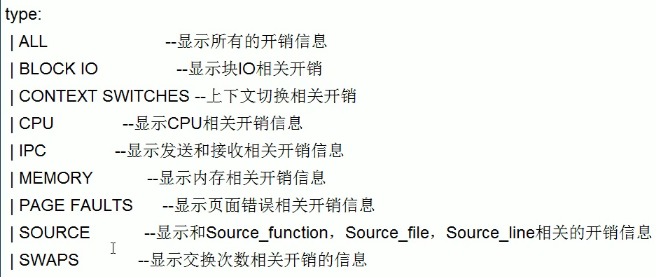

5. 


### 7.8 全局查询日志

不要在生产环境中开启这个功能。测试环境下使用。

`set global general_log=1`

`set global log_output='TABLE'`此后，所编写的sql语句，将会记录到mysql库里的general_log表里，可以用下面命令查看：

`select * from mysql.general_log`

## 3. 锁机制


### 3.1 表锁

* `show open tables`
* 手动上锁

`lock table 表名字 read(write)， 表名字2 read(write)， 其他`

* 释放锁

`unlock tables`

读锁的使用：

加了读锁，可以读，但是不能写这个表了，这个数据库中的其他表也不能读了。（读写复制的原因）

第二个session再来此数据库中的更改其他表也只能阻塞。

写锁的使用：

加了写锁，可以更改此表，不能查询其他表。

第二个session可以查其他表，但是不能查此表。

#### 3.1.1 MYISAM

偏读锁。在执行查询语句(select)前，会自动给涉及的所有表加读锁，在执行增删改操作前，会自动给涉及的表加写锁。

* 表级锁有两种模式

表共享读锁（Table Read Lock)

表独占写锁（Table Write Lock）

| 锁类型 | 可否兼容 | 读锁 | 写锁 |
| :----: | :------: | :--: | :--: |
|  读锁  |    是    |  是  |  否  |
|  写锁  |    是    |  否  |  否  |

1. 对Myisam表的读操作（加读锁），不会阻塞其他进程对同一表的读请求，但会阻塞对同一表的写请求。只有当读锁释放后，才会执行其他进程的写操作。
2. 对MyISAM表的写操作（加写锁），会阻塞其他进程对同一表的读和写操作，只有当写锁释放后，才会执行其他进程的读写操作。

#### 3.2.1 分析表的锁定

`show status like 'table%'`

### 3.2 行级锁

查看命令：

`show status like 'innodb_row_lock%'`;

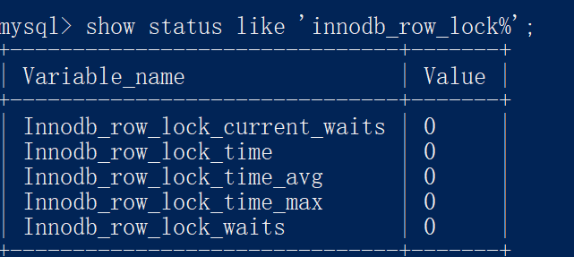

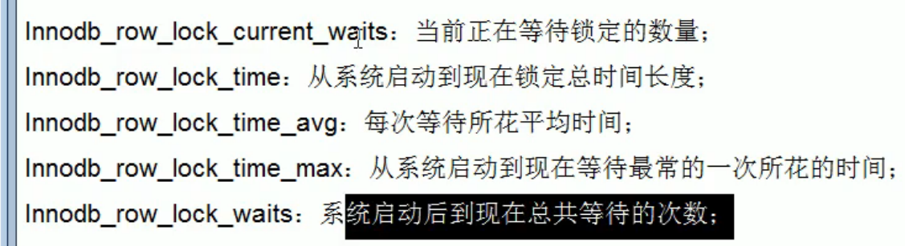


Innodb支持，myisam不支持。

索引失效，将会使得行锁变表锁。

#### 3.2.1 间隙锁

当使用范围条件而不是相等条件检索数据，并请求共享或排他锁时，InnoDB会给符合条件的已有数据记录的索引项加锁。对于键值在条件范围内但并不存在的记录，叫做”间隙锁“。InnoDB也会给这个”间隙“加锁，这种锁机制就是所谓的间隙锁。

#### 3.2.2 锁定某一行

```mysql
begin;
select * from test_innodb_lock where a = 8 for update;#锁定一行后，其他操作会被阻塞，直到commit；
commit;
```

## 4. 主从复制

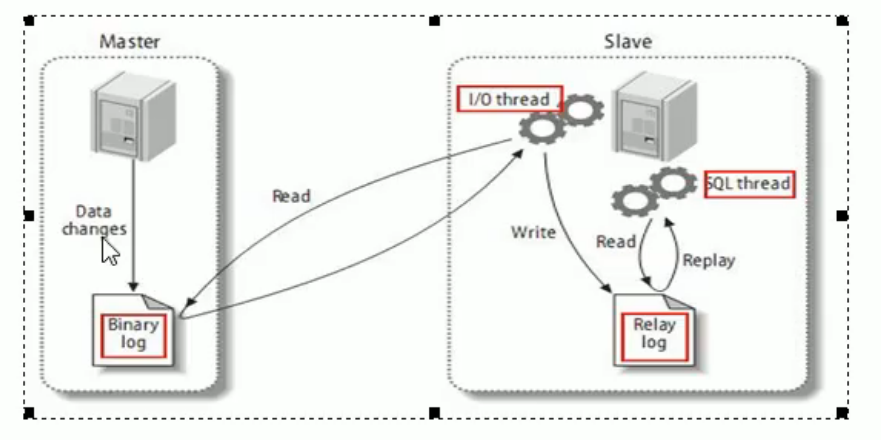

复制分为三步：

1. master将改变记录到二进制日志(binary log)。这些记录过程叫做二进制日志事件，binary log events。
2. slave将master的binary log events拷贝到它的中继日志（relay log);
3. slave重做中继日志的事件，将改变应用到自己的数据库中。mysql复制是异步且串行化。

#### 4.1 配置

1. 主服务唯一ID
2. 启用二进制日志
   1. `log-bin = 自己本地的路径/mysqlbin`
3. [可选]启用错误日志
   1. `log-err = 自己本地路径/mysqlerr`
4. [可选]根目录
   1. `basedir = "自己本地路径"`
5. [可选]临时目录
   1. `tmpdir = "自己本地路径"`
6. [可选]数据目录
   1. `datadir = "自己本地路径/Data/"`
7. [可选]设置不要复制的数据库
   1. `binlog-ignore-db = mysql`

配置文件更改后，重启数据库服务。


# MYSQL 面试题

### 0. **SQL 语句主要可以划分为以下 3 个类别。** DDL DML DCL

**DDL（Data Definition Languages）语句：**数据定义语言，这些语句定义了不同的数据段、数据库、表、列、索引等数据库对象的定义。常用的语句关键字主要包括 create、drop、alter等。

**DML（Data Manipulation Language）语句：**数据操纵语句，用于添加、删除、更新和查询数据库记录，并检查数据完整性，常用的语句关键字主要包括 insert、delete、udpate 和select 等。(增添改查）

**DCL（Data Control Language）语句：**数据控制语句，用于控制不同数据段直接的许可和访问级别的语句。这些语句定义了数据库、表、字段、用户的访问权限和安全级别。主要的语句关键字包括 grant、revoke 等。

### 1. 数据库三大范式是什么

第一范式：每个列都不可以再拆分。

第二范式：在第一范式的基础上，非主键列完全依赖于主键，消除非主键堆码的部分函数依赖。（比如通过码，必须可以确定表中的其他所有属性。如果还有其他属性无法推测，则不符合第二范式）

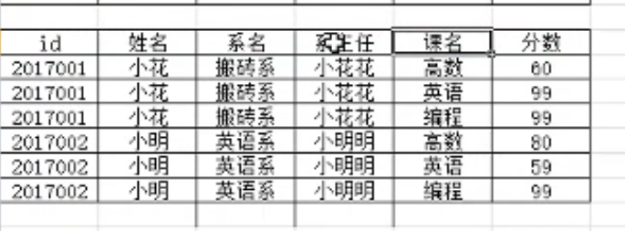

图中通过id 和姓名组成了码，可以推断系名和系主任，但是课名无法推测，所以不是第二范式。

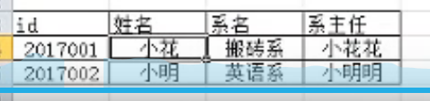

插入异常：往这张表新插入一个系id空的，插不进去。

删除异常：删除id系也删除了。


第三范式：在第二范式的基础上，消除传递函数依赖。非主键列只依赖于主键，不依赖于其他非主键。 

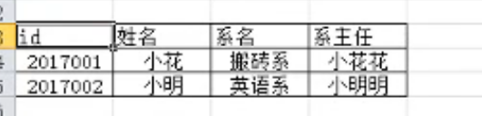

系主任依赖于系名，系名又依赖于id，系主任又依赖于id（传递了）。


还有BCNF范式 4范式 5范式，这几个很少说了

### 2. 数据库的权限表

MySQL服务器通过权限表来控制用户对数据库的访问，权限表存放在`mysql`数据库里，由mysql_install_db脚本初始化。这些权限表分别user，db，table_priv，columns_priv和host。下面分别介绍一下这些表的结构和内容：

- user权限表：记录允许连接到服务器的用户帐号信息，里面的权限是全局级的。
- db权限表：记录各个帐号在各个数据库上的操作权限。
- table_priv权限表：记录数据表级的操作权限。
- columns_priv权限表：记录数据列级的操作权限。
- host权限表：配合db权限表对给定主机上数据库级操作权限作更细致的控制。这个权限表不受GRANT和REVOKE语句的影响。

### 3. innodb myisam

   1.支持事务与不支持。

2. 支持外键与否。
3. 聚集索引和非聚集索引。
4. innodb表级查询，不保存具体行数。myisam用一个变量保存了整个表的行数。（查行数。其他innodb快）
5. Innodb支持表锁和行锁，myisam只有表锁。且Innobdb支持全文检索。

叶子结点保存完整的数据。 

非聚集 索引和数据分开存储。叶子节点只保存


### 1. 为什么设计索引

索引可以加快数据访问，快速定位数据。举个例子：我们平时写代码，一个数组存了很多数据。我们不就是通过那个指针直接访问那个数据吗？

MYSQL 使用B+数和哈希（单值索引）。

### 2. 为什么设计成B+树

哈希会碰撞和冲突。因为要查询，这种方式需要把所有数据全部放到内存里，耗费内存空间。

实际工程中大部分是范围查询。

二叉树和红黑树太深了（只存储一个值），io次数过多影响读取效率。

B树每个节点m个子树 （m - 1）个结点。

### 4. 面试中常问的存储引擎

MEMORY 使用哈希存储。（还有 InnoDB 和 MyIsam）。

存储引擎的区别就i是不同的数据存储方式。比如MyISAM是数据索引分开放，InnoDB是索引数据一起放。（聚簇索引和非聚簇索引）

### 5. 局部性原理

1. 时间局部性 放过的数据在最近很大可能还会被访问
2. 空间局部性 访问过的位置的附近很大可能会被访问


### 6. InnoDB 每次规定，预读4*4K = 16K 的数据

### 7. B+树的高度取决于你的索引是用什么类型存储的，一般使用int类型建立索引。（数值越小越好）。

### 8. B+树两种查找运算

1. 主键的范围查找和分页查找。
2. 根节点开始，进行随机查找。

InnoDB叶子节点中存储记录，如果没有主键，那么选择唯一键。如果没有唯一键，那么会生成一个6字节的row_id来作为主键。

如果创建索引的键是其他字段，那么叶子节点中存储的是该记录的主键，然后再通过主键索引找到对应的记录，叫做回表。

### 9. 为什么推荐主键自增

分布式，不建议。

单机，建议自增。（跟业务场景相关）。如果是乱序插入，插到中间（B+树开始分裂），分裂完了还得合并，还影响到了索引列。

### 10. 回表 索引覆盖 索引下推 最左匹配

如果创建索引的键是其他字段，那么叶子节点中存储的是该记录的主键，然后再通过主键索引找到对应的记录，叫做回表。（使用了辅助索引）

直接从索引全部命中数据——索引覆盖。

组合索引中，先从左侧的顺序匹配。

比如(select * from table where name = ? and age = ? )没有索引下推时，MYSQL会先从存储引擎中拉取数据（根据name筛选的数据），再从musql server 根据age进行数据的筛选。

有索引下推时，拉取数据直接根据name，age获取数据，不需要server做任何的数据筛选。（缺点：需要在磁盘上多做数据筛选）。

（举例：索引下推是先把所有字段拿出来再做关联，原来是先把表所有内容拿出来，查询字段）。

### 11. 优化器两种方式

1. CBO 基于成本优化。（大部分采用）

2. RBO 基于规则优化

### 12. MRR

mult_range read。索引排序好了，加了一个排序的环节。把随机磁盘读取转化为顺序磁盘读，提高了索引查询的性能。

### 13. FIC

fast index create。只作用于辅助索引，对于主键的创建和删除同样需要重建一张表。

插入和删除数据，先创建临时表，将数据导入到临时表中。把原始表删除。修改临时表的名字替换原始表。

有了FIC，给当前表添加一个Share锁，不会有创建临时文件的资源消耗，还是在源文件做。但是此时如果有人发起DML操作，很明显数据会不一致，所以添加share锁。

### 14. 索引分类

主键索引 唯一索引 普通索引 组合索引 全文索引

### 15. 索引的匹配方式

1. 全值匹配 

   和索引中所有的列进行匹配。

2. 匹配最左前缀


3. 匹配列前缀

匹配其中一部分，列前缀。比如 like%。

4. 匹配范围值


5. 精确匹配某一列并范围匹配另外一列


6. 只访问索引的查询

### 16. 哈希索引

精确匹配。只有memory存储引擎显示支持哈希索引。

限制：

1. 只包含哈希值和行指针，不存储字段值。
2. 无法排序。不是按照索引顺序存储的。
3. 哈希使用索引列的全部内容查找，不支持列部分匹配。
4. 支持等值比较查询，也不支持任何范围查询。
5. 访问哈希索引速度快，当出现哈希冲突时，必须遍历链表中所所有行指针直到找到符合条件的行。
6. 哈希冲突比较多的话，维护的代价很高。


CRC32 循环冗余加密规则。

### 17. 索引优化

1. 使用索引列查询不要使用表达式，把计算逻辑放在业务层。否则就不走索引了。
2. 尽量使用主键查询，不会触发回表查询。自然主键和代理主键（跟业务无关性）。
3. 前缀索引。比如字符串的前7个字符。
4. 使用索引扫描来排序。 防止出现 using filesort。
5. union all，in，or都能够使用索引，但是推荐使用in。如果是单列索引，or会使用索引。如果是组合索引：如果全部是组合索引，使用表中全部列所对应的索引，如果部分列是组合索引，不会走索引。
6. 范围列可以用到索引。< <= > >= between。如果某索引使用到了范围，那么其后面的索引列不会再走索引。
7. 强制类型转换会触发全表扫描。
8. 更新频繁的索引不适合建立索引。typeloglog，distinct value。
9. 创建索引的列，不允许为null，可能会得到不符合预期的结果。
10. 进行表连接时，最好不要超过三个表，因为join字段数据类型必须一致。
11. 能使用limit的时候尽量使用limit。limit主要目的时限制输出。
12. 单表索引控制在5个以内（现在没有太多的限制）。
13. 单索引字段数不允许超过5个（组合索引）。
14. 创建索引应该避免以下错误观念（1.索引越多越好2. 过早优化，不了解系统的情况下进行优化）。


————————

监控SQL、数据库连接不要过多、数据库设计之初、索引、SQL语句的优化、设置MYSQL参数、分布式集群如何设计。


### 18.索引监控

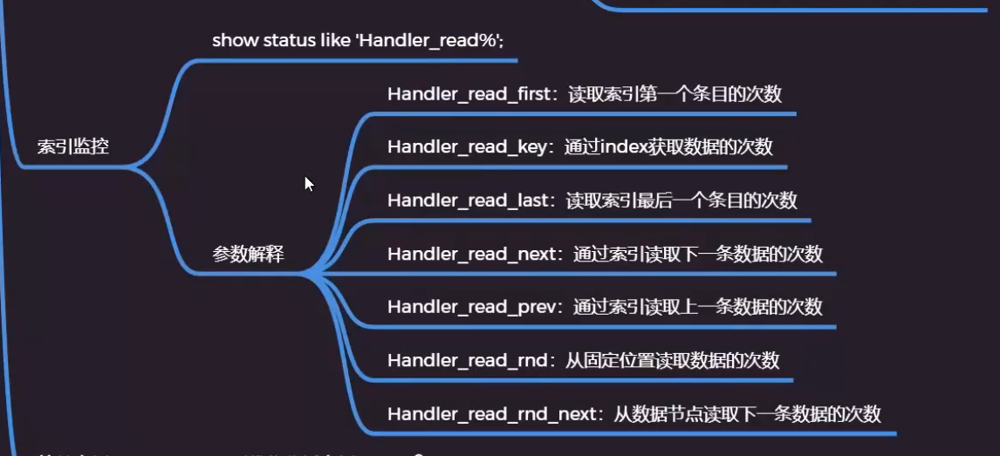

### 19. Count(1) COUNT(*)

**count详解：**

`count(1)`跟`count(主键)`一样，只扫描主键。

`count(*)`跟`count(非主键)`：

　　count(*)将返回表格中所有存在的行的总数包括值为null的行，然而count(列名)将返回表格中除去null以外的所有行的总数(有默认值的列也会被计入）.
　　distinct 列名,得到的结果将是除去值为null和重复数据后的结果

1.优先考虑count(*)，因为数据库做了特别的优化处理。

有主键或联合主键的情况下，count(\*)略比count(1)快一些。 
没有主键的情况下count(1)比count(\*)快一些。 
如果表只有一个字段，则count(*)是最快的。
2.使用count()聚合函数后，最好不要跟where age = 1；这样的条件，会导致不走索引，降低查询效率。除非该字段已经建立了索引。使用count()聚合函数后，若有where条件，且where条件的字段未建立索引，则查询不会走索引，直接扫描了全表。 
3.count(字段),非主键字段，这样的使用方式最好不要出现。因为它不会走索引.

[(3条消息) mysql count（*）优化_youcijibi的博客-CSDN博客](https://blog.csdn.net/youcijibi/article/details/99633252)

### 20. 主从复制

客户发请求给代理，代理给每个分库读或者写。要保证每个分库数据一致，binlog进行主从复制。master  和 slave 库，客户端操作master进行DML操作，


### 21 读写分离

客户发请求给代理，代理给每个分库读或者写。要保证每个分库数据一致，binlog进行主从复制。master  和 slave 库，客户端操作master，

### 22. 分库分表

水平切分和垂直切分

#### 22.1 水平切分

分为水平分表 和 水平分库。

水平分表： 

就是两个表字段是一样的，但是数据不一样。比如id一个表存储奇数id的数据，一个表存储偶数id的数据。

水平分库：

分成好几个库，几个库里的表是一样的。按照数据对应到不同的库里去存放。

垂直分表：

将一张表里的字段切成两部分或者多个部分，每个部分用单独的一张表存放。

垂直分库：

将不同的表放到不同的数据库里。

**应用**

1. 在数据库设计时候考虑垂直分库和垂直分表。
2. 随着数据库数据量增加，不要马上考虑做水平切分，首先考虑缓存处理，读写分离，使用索引等等方式，如果这些方式不能解决问题，再考虑水平分库和水平分表。

**问题**

1. 跨节点连接查询问题（分页、排序）。比如垂直切分，但是我需要全部的数据，所以需要把每张表的数据查出来然后mysql合并再分页和排序，所以性能上出现了问题。
2. 多数据源管理的问题（操作管理比较慢）。

### 23 MVCC


### 24. 锁

表锁、行锁、页锁。

表锁（偏向MYISAM引擎。


### 25. 日志系统

`binlog` ——》 MYSQL服务的   `undo log` 和  `redo log` ——》innodb存储引擎的

### 26. MYSQL 结构

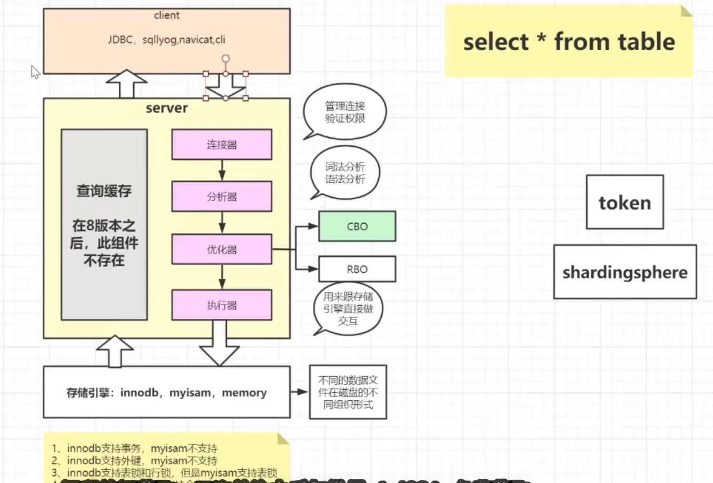