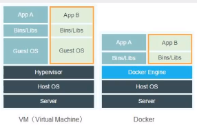
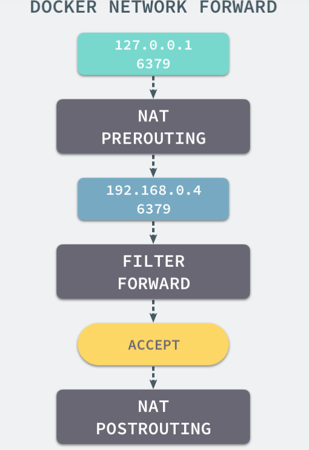
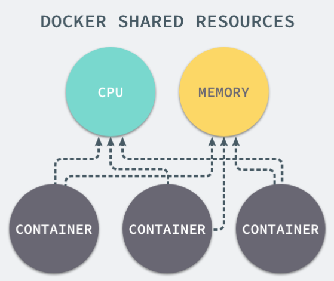
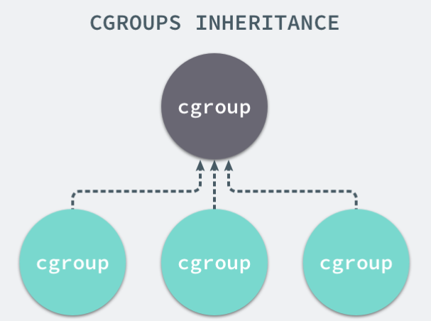
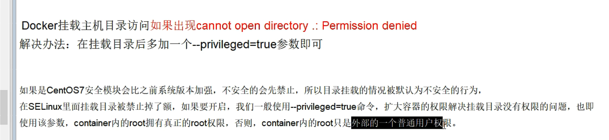

# Docker

## 1. 概述

### 1.1 为什么

我的代码在我的机子上能跑，在你的机子上竟然崩了！！！docker解决这个问题！

### 1.2 是什么

通过docker直接把运行环境打包且跨平台。隔离是docker的核心思想。

### 1.3 怎么做



通过Docker Engine 直接使用宿主机的内核，相比虚拟机少了一层Guest OS的抽象层，所以占用空间少。


### ## 1 实现原理

### 1.1 命名空间

命名空间是Linux提供共的分离进程资源的方法（比如nginx、redis等服务之间互不干扰）。Docker通过Namespaces对不同的容器实现了隔离。

（Linux提供了七种不同的命名空间，通过这些选项能够创建新的进程时设置新进程应该在哪些资源上与宿主机器进行隔离）。

1. iptable 对网络请求重定向

Docker 默认的网络设置模式：网桥模式。在这种模式下，除了分配隔离的网络命名空间之外，Docker 还会为所有的容器设置 IP 地址。当 Docker 服务器在主机上启动之后会创建新的虚拟网桥 docker0，随后在该主机上启动的全部服务在默认情况下都与该网桥相连。网桥 docker0 通过 iptables 中的配置与宿主机器上的网卡相连，所有符合条件的请求都会通过 iptables 转发到 docker0 并由网桥分发给对应的机器



### 1.2 控制组 CGroups （Control Groups）

对进程资源进行控制，实现了CPU内存等资源的隔离。



某个容器执行CPU密集型任务，那么就会影响其他容器任务的性能和效率，导致多个容器相互影响并抢占资源。如何对多个容器的资源使用进行限制，CGroups能够隔离宿主机器上的物理资源。



每一个CGroup都是一组被相同标准和参数限制的过程，不同的CGroup之间有层级关系，也就是它们之间可以从父类继承一些用于限制资源使用的标准和参数。

所有的资源控制都是以 CGroup 作为单位实现的，每一个进程都可以随时加入一个 CGroup 也可以随时退出一个 CGroup。


### 1.3 UnionFS 

UnionFS 其实是一种为Linux操作系统设计的把多个文件系统联合到同一个挂载点的文件系统服务。

镜像的本质就是压缩包。Docker中的每一个镜像都是由一系列只读的层构成，Dockerfile中每一个命令都会在已有的层上创建一个新的层：

一个容器其实等于镜像加上一个可读写的层，也就是同一个镜像可以对应多个容器。


## 2. 常用命令

官方命令地址：[docker login | Docker Documentation](https://docs.docker.com/engine/reference/commandline/login/)

```shell
docker verison # 显示docker的版本信息
docker info # 显示docker的系统信息，包括镜像和容器的数量
docker 命令 --help #万能命令


```

### 2.1 搜索

```shell
docker search

docker search mysql --filter=STARS=3000
```

### 2.2 拉取

```shell
docker pull 
# docker pull 镜像名字:tag
# 如果不写tag就下载最新的 latest
# 
```


### 2.3 运行

```shell
docker run [可选参数] image

--name="name" #名字
-d #后台运行
-it #交互方式进行
-p 指定容器的端口， -p 8080:8080
-P 随机指定端口
```

### 2.4 列出容器

```shell
docker ps 正在运行
-a 正在运行+历史运行
```

### 2.5 退出容器

```shell
exit #直接退出容器并停止
Ctrl + P + Q #容器不停止退出
```

### 2.6 删除容器

```shell
docker rm id #镜像是rmi
docker rm -f $(docker ps -aq)
```

### 2.7 停止容器

```shell
docker stop id
docker kill id
docker start id
docker restart id
```


### 2.8 查看内部信息

```shell
docker top id # 查看内部信息
```


### 2.9 常用其他命令

#### 2.9.1 后台启动命令

```shell
docker run -d centos

# 问题docker ps 如果退出会停止，容器使用后台进程，容器中必须要有一个进程在跑着，不然就自动停了。
```

#### 2.9.2 查看日志

```shell
docker logs -ft --tail 10 容器id #查看id容器的日志，且一开始打印最新的10条log（如果还有新日志，会一直增加显示新日志）
docker inspect 容器id # 查看容器信息
```

#### 2.9.3 进入当前容器

```xml
docker exec -it 容器id /bin/bash # 进入容器后开启新的终端，可以在里面操作（常用）
docker attach 容器id # 进入容器正在执行的终端，不会启动新的进程
```

#### 2.9.4 容器内的文件拷贝到机子上

```shell
# 进入容器后！！！
docker cp 容器id:/dir/XXX.java /home
```

### 2.10 容器卷

将docker容器内的数据保存到宿主机中，防止数据丢失，做数据备份。

* 容器卷中的更改可以实时更改生效。
* 容器卷可在容器之间共享或重用
* 数据卷中的更改不会包含在镜像的更新中
* 数据卷的声明周期一直持续到没有容器使用它为止

#### 2.10.1 宿主机和容器映射添加容器卷

```bash
docker run -it --privileged=true -v /宿主机绝对路径目录:/容器内目录 镜像名
```

查看是否挂载成功

#### 2.10.2 容器卷的读写规则

默认支持同时读和写。

```bash
docker run -it --privileged=true -v /宿主机绝对路径目录:/容器内目录:rw 镜像名
```

只读：限制容器内只能读不能写

```bash
docker run -it --privileged=true -v /宿主机绝对路径目录:/容器内目录:ro   镜像名
```

#### 2.10.3 容器的继承和共享

```bash
docker run -it --privileged=true --volumes-from u1 --name u2 ubuntu
```


### 2.11 拷贝文件

容器到主机：

```bash
docker cp 容器ID:容器内路径 目的主机路径
```


# 3.可视化管理Portainer

官方安装说明 `portainer.io/installation/`

```shell
docker pull portainer/portainer 
docker volume create portainer_data
docker run -d -p 8000:8000 -p 9000:9000 --name=portainer --restart=always -v /var/run/docker.sock:/var/run/docker.sock -v portainer_data:/dataportainer/portainer portainer/portainer
```

使用ip+9000端口进行访问。

# 问题




