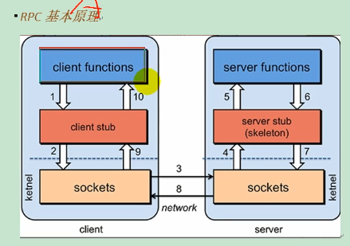
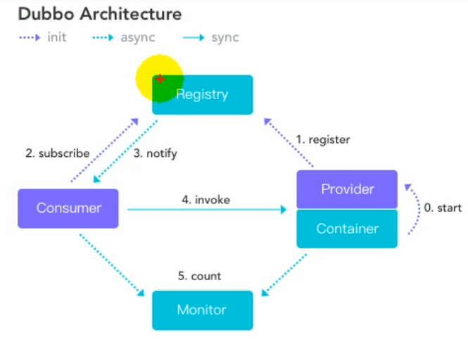
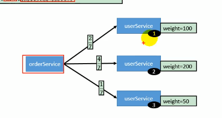
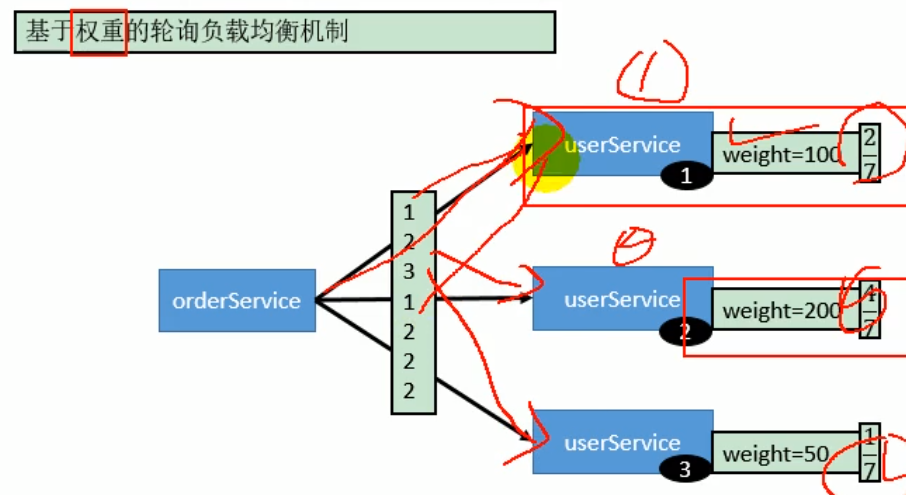
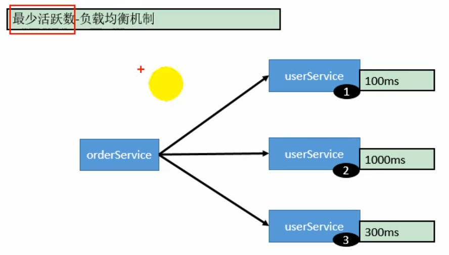
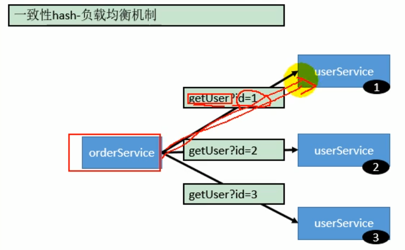

# Dubbo

## 1. 分布式基础

### 1.1 为什么

随着应用规模的不断扩大，常规的垂直应用架构已经无法应对，分布式服务架构以及流动计算架构势在必行。分布式系统规模如果做大，多台机子之间的交互如何进行处理需要一种机制进行保证，于是出现了dubbo。

如果垂直应用越来越多

* 界面和业务逻辑的实现如何进行分离。
* 各个应用之间需要互相调用。
* 。。。

### 1.2 是什么

分布式系统是若干独立计算机的集合，这些计算机对于用户来说就像单个相关系统。

### 1.3 怎么做

两个不同的服务在两个不同的机子A、B上，A要调用B的信息，就需要使用远程过程调用(RPC)。将一个大应用拆成几个独立的小应用。

RPC框架基本原理

### 1.4 幂等

幂等（设置重置次数）【查询、删除、修改】、非幂等（不能设置重试次数）【新增】。

`retries = "0"` dubbo中的`retries`中的次数，不包括第一次尝试，所以最终尝试次数=retries + 1；

## 3. 整合SpringBoot

1. 导入dubbo-starter，在application.properties配置属性，使用@Service【暴露服务】使用@Reference【引用服务】
2. 保留dubbo xml配置文件。导入dubbo-starter，使用@ImportResource导入dubbo的配置文件即可。

`@ImportResource("xxx.xml")`

3. 使用注解API方式。单独写一个配置类，手动配置到容器中。让dubbo扫描其中的组件。

### 3.1 映射规则

官网：[属性配置 | Apache Dubbo](https://dubbo.apache.org/zh/docs/v2.7/user/configuration/properties/)

### 3.2 多版本

### 3.2.1 是什么

当代码升级出现不兼容时，可以用版本号过渡，版本号不同的服务相互间不引用。

### 3.2.1 Dubbo 架构

服务提供者`provider`，将提供的服务注册到`Registry`。Registry可以通过长连接的方式将这次服务变更发送给消费者。

所以在编写代码的时候，应该先把服务写好，注册到注册中心，然后消费者进行调用。

### 3.3 服务存根

#### 3.3.1 为什么

主要是在调用远程服务之前，做一些判断或者实现一些小功能等。判断通过后，再去调用远程服务。

#### 3.3.2 是什么

利用本地存根在客户端执行部分逻辑。

[本地存根 | Apache Dubbo](https://dubbo.apache.org/zh/docs/v2.7/user/examples/local-stub/#m-zhdocsv27userexampleslocal-stub)

#### 3.3.3. 怎么做

远程服务后，客户端通常只剩下接口，而实现全在服务器端，但提供方有些时候想在客户端也执行部分逻辑，那么就在服务消费者这一端提供了一个Stub类，然后当消费者调用provider方提供的dubbo服务时，客户端生成 Proxy 实例，这个Proxy实例就是我们正常调用dubbo远程服务要生成的代理实例，然后消费者这方会把 Proxy 通过构造函数传给消费者方的Stub ，然后把 Stub 暴露给用户，Stub 可以决定要不要去调 Proxy。会通过代理类去完成这个调用，这样在Stub类中，就可以做一些额外的事，来对服务的调用过程进行优化或者容错的处理。

### 3.4 注解配置

#### 3.4.1 为什么

有的时候，xml配置的方式配置很繁琐，springboot+properties的方式配置的属性又不够详细。所以出现了注解配置的方式，将xml中所有可以配置的属性全部对应到代码中进行配置即可。

[注解配置 | Apache Dubbo](https://dubbo.apache.org/zh/docs/v2.7/user/configuration/annotation/)

#### 3.4.2 是什么

[注解配置 | Apache Dubbo](https://dubbo.apache.org/zh/docs/v2.7/user/configuration/annotation/)

#### 3.4.2 怎么做

开发中可以参考上述官网。

原理：

都是注解的那一套实现原理。

## 4. 高可用

通用设计，减少系统不能提供服务的时间。

zookeeper宕机与dubbo直连，还可以消费dubbo暴露的服务。

原因：

* 监控中心宕机不影响使用，只是丢失部分采样数据。
* 数据库宕机后，注册中心仍能通过缓存提供服务列表查询
* 注册中心对等集群，任意一台宕机后，将自动切换到另一台。
* 注册中心全部宕机后，服务提供者和服务消费者仍能通过 本地缓存通讯。
* 服务提供者无状态，任何一台宕机后，不影响使用。
* 服务提供者全部宕机后，服务消费者应用将无法使用，并无限次重连等待服务提供者恢复。

### 4.1 负载均衡

#### 4.1 随机负载均衡机制

1. 基于权重的随机负载均衡机制

2. 基于权重的轮询负载均衡机制

3. 最少活跃数

4. 一致性哈希

#### 4.2 服务降级

当服务器压力剧增的情况下，根据实际业务情况及流量，对一些服务和页面有策略的不处理或换种简单的方式处理，从而释放服务器资源以保证核心交易正常运作或高效运作。

本质上就是不让他调用此服务了。

里面还有一个容错的概念，容错在调用失败时才返回为`null`。

#### 4.3 服务容错

1. FailFast Cluster

快速失败，只发起一次调用，失败立即报错。通常用于非幂等性的写操作，比如新增记录。

2. FailSast Cluster

失败安全，出现异常则直接忽略。通常用于写入审计日志等操作。

3. FailBack Cluster

失败自动恢复，后台记录失败请求，定时重发。通常用于消息通知操作。

4. Forcking Cluster

并行调度多个服务器，只要一个成功即返回。比如一个客户端向3个提供者发起服务请求（太浪费资源了）。通常用于实时性较高的读操作，但需要浪费更多服务资源。可通过`forks=2`来设置最大并行数。

5. Broadcast Cluster

广播调用所有提供者，逐个调用，任意一台报错即报错。通常用于通知所有提供者更新缓存或日志等本地资源信息。

集群模式配置

<dubbo:service cluster="failsafe">

在实际开发中，一般整合hystrix提供更强大的容错能力。

`<HystrixCommand(fallbackMethod="hello")`

## 5. 原理

### 5.1 RPC

1. 服务消费方(Client)调用以本地调用方式调用服务。
2. client stub 接收到调用后负责将方法、参数等组装成能够进行网络传输的消息体。
3. client stub 找到服务地址，并将消息发送到服务端。
4. serve stub 收到消息后进行解码。
5. server stub 根据解码结果调用本地服务。
6. 本地服务执行并将结果返回给server stub。
7. serve stub 将返回结果打包成消息并发送至消费方。
8. client stub 接收到信息，并进行解码。
9. 服务消费方得到最终结果。

RPC 框架就是将这些步骤都封装起来。

### 5.2 框架设计

### 5.3 服务暴露

### 5.4 服务引用

### 5.5 服务调用

