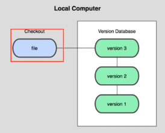
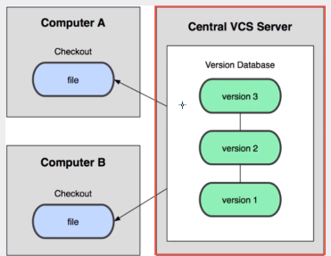
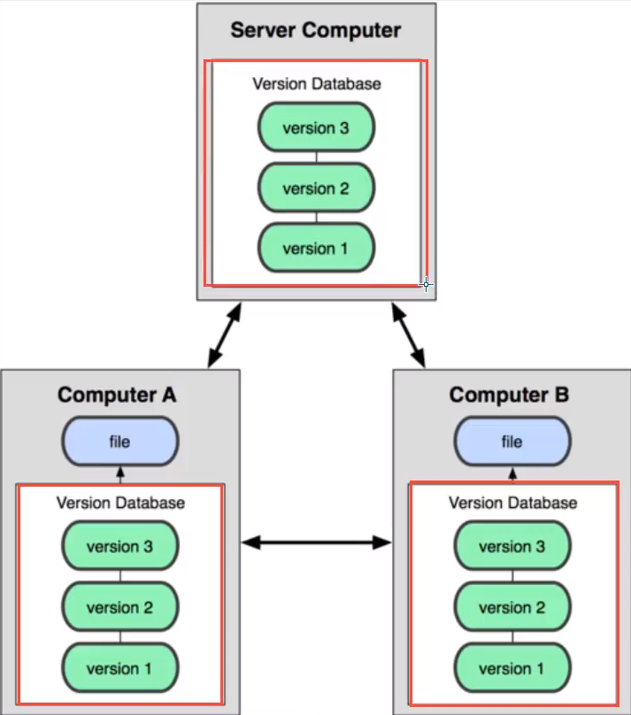
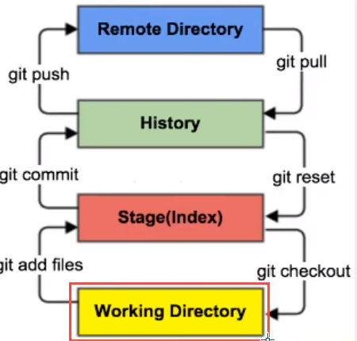
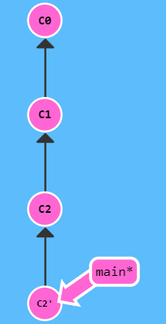
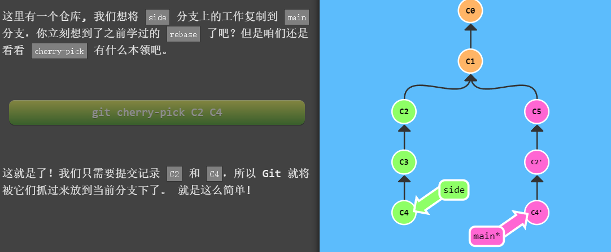

# Git

## 1. 简介

开发中版本迭代，新的和老的版本之间进行管理。

### 1.1 本地版本控制

记录文件每次的更新，可以对每个版本做一个快照，或是记录补丁文件，适合个人用，如RCS。



### 1.2 集中式版本控制



所有版本数据保存在一个服务器上，协同开发者从服务器上同步更新自己的修改。

代表作：SVN

一旦服务器坏了，那工程直接没了。

### 1.3 分布式版本控制



所有版本信息仓库全部同步到本地的每个用户，这样

### 1.1 git和svn的区别

* svn 

集中式版本控制系统，版本库是集种放在中央服务器的。而工作的时候，用的都是自己的电脑，所以首先要从中央服务器得到最新的版本，然后工作，完成工作后，需要把自己做完的活推送到中央服务器。集中式版本控制系统是必须联网才能工作，对网络带宽要求较高。

* git

分布式版本控制系统，没有中央服务器，每个人的电脑就是一个完整的版本库，工作的时候不需要联网，因为版本都在自己电脑上。

有个人在自己电脑上改了文件A，其他人也在电脑上改了文件A，这时只需要把各自修改推送给对方，就可以看到对方的修改了。

## 2. 环境配置

下载下来无脑next安装。

### 2.1 git配置

```bash
# 查看系统config
git config --system --list

# 查看当前用户(global)配置
git config --global --list
```

1. Git\etc\gitconfig：Git安装目录下的gitconfig --system 系垃圾
2. C:\Users\Admin\.gitconfig 当前登录用户的配置 --global 全局 这里可以直接编辑配置文件，通过命令设置后会响应到这里。

```bash
git config --global user.name "kuangshen" #名称
git config --global user.email 1256211675@qq.com #邮箱
```

`git config -l` 查看配置

## 3. 基本理论

### 3.1 工作原理

工作目录(Working Directory)、暂存区(stage/Index)、资源库(Repository)。



### 3.2 工作流程

1. 在工作目录添加、修改文件。
2. 将需要进行版本管理的文件放入暂存区。
3. 将暂存区的文件提交到git仓库。

git管理的文件有三种状态：已修改(modified)、已暂存(staged)、已提交(commited)

## 4. 文件操作

对文件的修改、提交等操作，需要知道文件当前在什么状态。

1. Untracked：未跟踪，此文件在文件夹中，但并没有加入到git库，不参与版本控制。通过`git add` 状态变为`staged`。
2. Unmodify:未修改，文件入库未修改，即版本库中的文件快照内容与文件夹中完全一致。这种类型的文件有两种去处，如果它被修改，而变为`Modified`。如果使用`git rm`移出版本库，则成为`Untracked`文件。
3. Modified：已修改，仅仅是修改，并没有进行其他操作。通过`git add`进入暂存`staged`状态，使用`git checkout`则丢弃修改过，返回到`unmodify`状态，这个`git checkout`即从库中取出文件，覆盖当前修改。
4. Stage：暂存状态，执行`git commit`则将修改同步到库中，这时库中的文件和本地文件又变为一致，文件为`Unmodify`状态。执行`git reset HEAD filename`取消暂存，文件变为`Modified`。

```bash

# 为注释
*.txt #忽略所有.txt结尾的文件
!lib.txt #但lib.txt除外
/temp #仅忽略项目根目录下的TODO文件，不包括其他目录temp
build/ #忽略build/目录下的所有文件
doc/*.txt #会忽略 doc/noted.txt 但不包括 doc/server/arch.txt
```


```bash
# 新建一个分支，但依然停留在当前分支
git branch [branch-name]

# 新建一个分支，并切换到该分支
git checkout -b [branch]

# 切换到已有分支
git switch [branch]

# 合并指定分支到当前分支
git merge [branch]

# 删除分支
git brach -d [branch-name]

# 删除远程分支
git push origin --delete [branch-name]
git branch -dr [remote/branch]
```


## 5. HEAD

```shell
# 查看HEAD指向
cat .git/HEAD
# 如果Head指向一个引用
git symbolic-ref HEAD
```

使用`^` 向上移动1个提交记录。 使用`~num` 向上移动多个提交记录。:ice_cream: 例子： `~3`

`git branch -f HEAD^3` 将main分支强制指向HEAD的3级父提交。

移动分支指向： :ice_cream: `git checkout HEAD^` 将HEAD指向向上一级父节点。

`git checkout HEAD~3`

`git branch -f HEAD main~3` 

## 6. 撤销变更

`git revert` 和 `git reset`



这样你就可以远程分享给别人了。:ice_cream: `git revert c2`

`git reset` 彻底撤销回退至从`c1` ，<font color = "red">但是这个回退只对本地有效。</font> :ice_cream: `git reset c1` 

也可以通过，`rebase` 调整提交记录的顺序：

`git rebase -i HEAD^4`  `-i 指的是interactive`

## 7. 复制

想将一些提交复制到当前位置`HEAD`下面的话，`cherry-pick` 是最直接的方式。



## 8. 加速

 ```bash
 #原地址
 git clone https://github.com/kubernetes/kubernetes.git
 #改为
 git clone https://github.com.cnpmjs.org/kubernetes/kubernetes.git
 #或者
 git clone https://hub.fastgit.org/kubernetes/kubernetes.git
 #或者
 git clone https://gitclone.com/github.com/kubernetes/kubernetes.git
 
 ```

如果git clone 等命令很慢的话，可以替换为上述地址，后面是具体的仓库。


