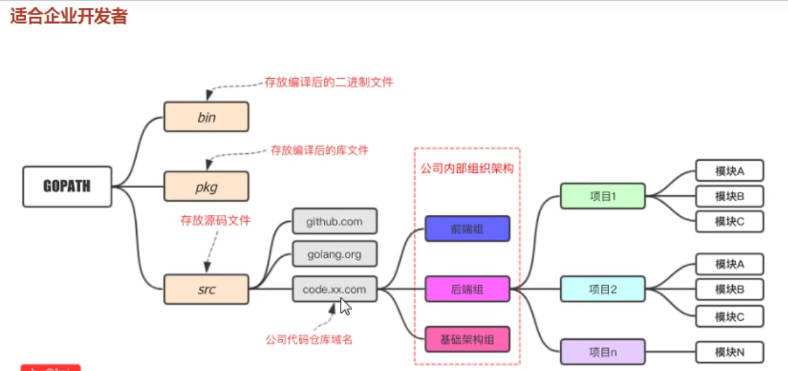
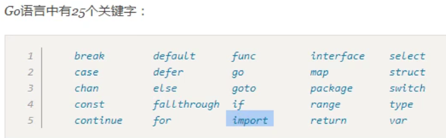
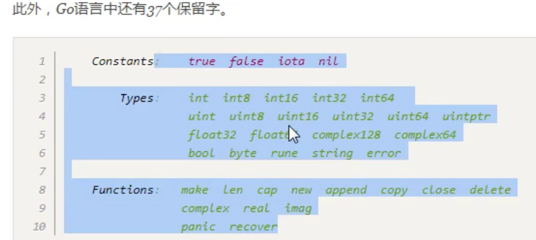
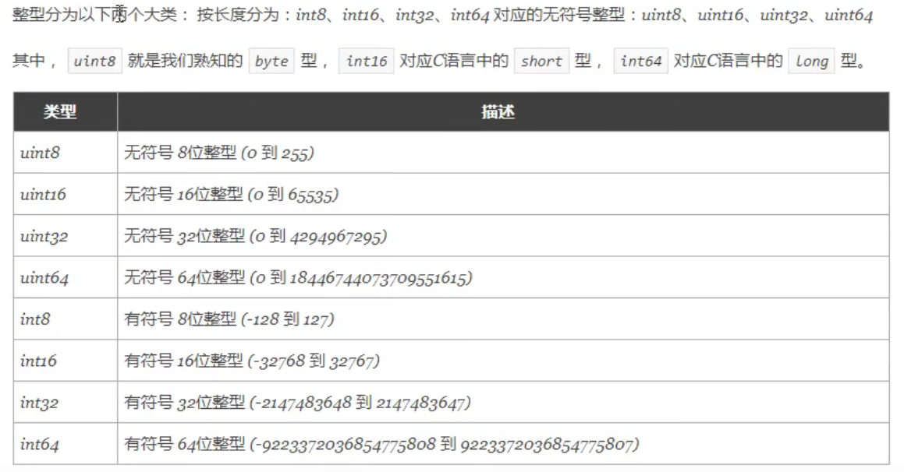
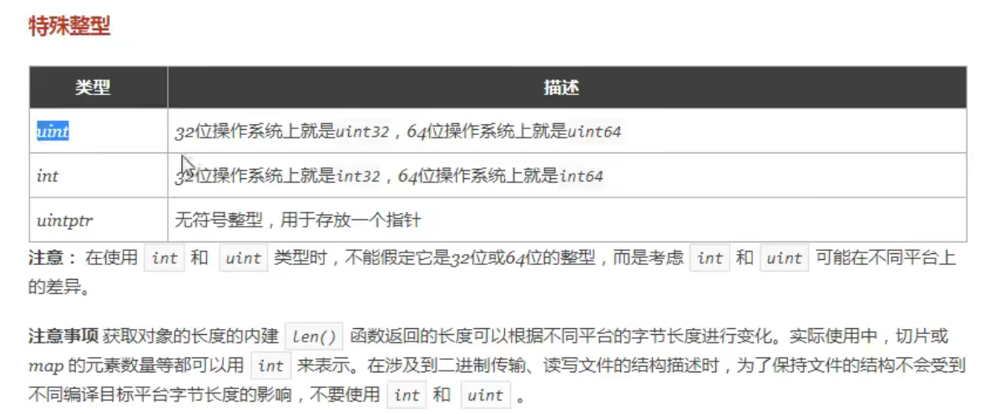
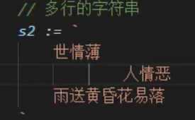
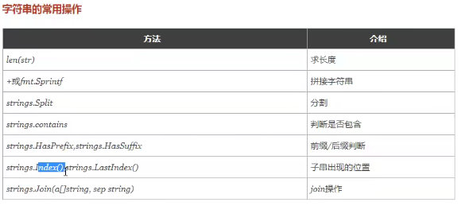
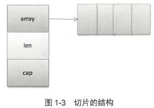
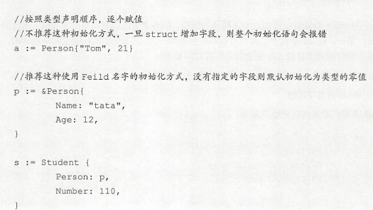

## 1. 安装问题

### 1.1 解决VSCode安装Go tools失败的问题

May 26, 2020 | 1548 阅读

**测试环境**

```
$ go version
go version go1.14.3 darwin/amd64
$ sw_vers
ProductName:	Mac OS X
ProductVersion:	10.14.6
BuildVersion:	18G4032
```

安装Go后，打开VS Code，按照提示安装了微软官方的GO插件。但在安装go tools时，出现了下面的一大堆错误。

```
go.toolsGopath setting is not set. Using GOPATH /Users/l2m2/go
Installing 17 tools at /Users/l2m2/go/bin in module mode.
  gocode
  gopkgs
  go-outline
  go-symbols
  guru
  gorename
  gotests
  gomodifytags
  impl
  fillstruct
  goplay
  godoctor
  dlv
  gocode-gomod
  godef
  goimports
  golint

Installing github.com/mdempsky/gocode FAILED
Installing github.com/uudashr/gopkgs/v2/cmd/gopkgs FAILED
Installing github.com/ramya-rao-a/go-outline FAILED
Installing github.com/acroca/go-symbols FAILED
Installing golang.org/x/tools/cmd/guru FAILED
Installing golang.org/x/tools/cmd/gorename FAILED
Installing github.com/cweill/gotests/... FAILED
Installing github.com/fatih/gomodifytags FAILED
Installing github.com/josharian/impl FAILED
Installing github.com/davidrjenni/reftools/cmd/fillstruct FAILED
Installing github.com/haya14busa/goplay/cmd/goplay FAILED
Installing github.com/godoctor/godoctor FAILED
Installing github.com/go-delve/delve/cmd/dlv FAILED
Installing github.com/stamblerre/gocode FAILED
Installing github.com/rogpeppe/godef FAILED
Installing golang.org/x/tools/cmd/goimports FAILED
Installing golang.org/x/lint/golint FAILED

17 tools failed to install.

gocode:
Error: Command failed: /usr/local/go/bin/go get -v github.com/mdempsky/gocode
go get github.com/mdempsky/gocode: module github.com/mdempsky/gocode: Get "https://proxy.golang.org/github.com/mdempsky/gocode/@v/list": dial tcp 172.217.160.113:443: i/o timeout
go get github.com/mdempsky/gocode: module github.com/mdempsky/gocode: Get "https://proxy.golang.org/github.com/mdempsky/gocode/@v/list": dial tcp 172.217.160.113:443: i/o timeout
```

**解决方案**

设置代理：

```
$ go env -w GO111MODULE=on
$ go env -w GOPROXY=https://goproxy.io,direct
```

设置完成后重启VS Code，按照提示安装即可。

# go开发

## 企业开发结构



### 编译

`go build`

`go build -o hello.exe`

```go
分两步，第一步先编译得到可执行文件。第二步将可执行文件拷贝到`GOPATH/bin`目录。
go install
```

```go
go run
像执行脚本的方式运行
```

#### 跨平台编译

需要指定目标操作系统的平台和处理器架构即可：

```go
set CGO_ENABLED=0 //禁用go
set GOOS=linux // 目标平台是linux
set GOARCH=amd64 //目标处理器架构是amd64
```

然后再执行`go build`命令，得到的就是能够在linux平台运行的可执行文件了。

# 基础语法

## 1.关键字





## 2.变量

函数外只能放置标识符的声明。（变量、常量、函数、类型可以放在函数外面）

`var s1 string` 声明一个保存字符串类型数据的s1变量

```go
var age int
var isOk bool
// 批量声明
var (
	name string
    age int
    isOk bool
)
ss := "heihei" // 简短变量声明
```

自动格式化：`go fmt xxx.go`

#### 2.1匿名变量

`_` 下划线表示匿名变量。这个用来占位。

## 3.常量和iota

```go
const pi = 3.14
const e = 2.8
```

声明了`pi`和`e`这两个常量之后，在整个程序运行期间它们的值都不能再变化了。

多个变量可以一起声明：

```go
const (
	pi = 3.14
    e = 2.8
)
```

const同时声明多个变量时，如果省略了值表示和上面一行的值相同。:ice_cream:例如：

```go
const (
	n1 = 100
    n2
    n3
)
```

#### 3.1iota

`iota`是go语言的常量计数器，只能在常量的表达式中使用。

`iota`在const关键字出现时将被重置为0。`const`中每新增一行常量声明将使`iota`计数一次（iota可理解为const语句块中的索引）。

:ice_cream:例子：

```go
const (
	n1 = iota //0
    n2 //1
    n3 //2
    n4 //3
)

const (
	c1 = iota //0
    c2 = 100
    c3 = iota // 2 `const`中每新增一行常量声明将使`iota`计数一次
    c4 
)

const (
	d1, d2 = iota + 1, iota + 2 // d1 = 1 d2 = 2 iota为0，在同一行
    d3, d4 = iota + 3, iota + 4 // d3 = 4, d4 = 5
)
```

:ice_cream: 典型的例子：

```go
const (
	_ = iota
    KB = 1 << (10 * iota)
    MB = 1 << (10 * iota)
    GB = 1 << (10 * iota)
    TB = 1 << (10 * iota)
    PB = 1 << (10 * iota)
)
```

## 4.基本数据类型

### 4.1 整型





* 查看变量的类型 `%T` :ice_cream: `fmt.printf("%T", in1)`

### 4.2 浮点数

go支持两种浮点数：`float32` 和 `float64`。 最大值分别为`math.MaxFloat32`和 `math.MaxFloat64`。 go语言中默认是`float64`。

### 4.3 布尔值

默认`false`。

### 4.4 字符串

双引号括起来。单引号括起来的是字符。

多行字符串可以使用 ` 表示。

aa

* :ice_cream: springf

  `s1 = Sprintf("%s%s", a,b)` a和b拼接，返回值赋给s1变量

* :ice_cream: Split("")

  `s = strings.Split(" ")` 返回值赋给s变量

* :ice_cream: Contians("理想") HasPrefix() HasSuffix

  判断是否包含字符串 `s = strings.Contains(ss, "理想")`



### 4.5 字符

go内置两种字符。`byte`和`rune`。rune4个byte，支持`unicode`编码。

## 5. 复合数据类型

### 5.1 指针

`*p` 和 `**p` go语言的指针同样支持多级指针。`&` 取对象的地址。

:ice_cream: 例子：

```go
var v1 = 6
p := &v1
```

:ice_cream: 例子：

```go
type User struct {
    name string
    age int16
}
adam := User {
    "adam",
    23,
}
p := &adam
fmt.printf("%d", p.age) // 对属性的访问也是使用 . 
```

* go禁止指针运算，因为go支持垃圾回收，指针运算会带来垃圾回收不便。

:ice_cream:例子： go允许返回地址

```go
func sum (a, b int) *int {
    sum := a + b
    return &sum
}
```

go使用”栈逃逸“机制将局部变量分配到堆上。

### 5.2 数组

`[n]elemenType` n是数组元素，elementType是数组元素类型。

:ice_cream: 例子：初始化

```go
array1 := [3]int{1,2,3}
array2 := [...]int{1,2,3}
array3 := [3]int{1:1, 2:3} // 指定长度，并且由索引值初始化元素。没有初始化元素时使用类型默认值。
array4 := [...]int{1:1, 2:3} // 不指定长度，数组长度由最后一个索引值确定。没有指定索引的元素被初始化为类型的零值
```

数组是值类型的 ，数组复制或作为函数参数都是值拷贝。

:ice_cream: 访问数组：

```go
array := [...]int{1,2,3}
b := array[0]
// 方式1
for i,val := range array {
    
}
// 方式2
alength := len(array)
for i := 0, i < alength; i++ {
    
}

```

### 5.3 切片

数组的定长和值拷贝限制了使用场景。使用切片`slice`。其数据结构中有只想数组的指针，是一种引用类型。

切片的数据结构：

```go
type slice struct {
    array Unsafe.Pointer
    len int
    cap int
}
```

`go`为切片维护三个元素——指向底层数组的指针、切片的元素数量和底层数组的容量。



```go
声明：
1. 通过数组
array := [...]int{1,2,3}
s1 := array[b:e] // 生成从b到e - 1 的共 e - b个元素的切片。

2. 通过make
// len = 10， cap = 10
a := make([]int, 10)
// len = 10, cap = 15
a := make([]int, 10, 15)
```

* 支持的操作

```go
len() 返回切片的长度。
cap() 返回底层数组的容量。
append() 追加元素
copy() 复制一个切片
```

### 5.4 字典

`map [K]v` K是任何可以比较的类型，v是值类型。

:ice_cream: 创建例子：

```go
1. map1 := [string]int{"a":1, "b":2}
fmt.Println(map1[0])
fmt.Println(map1[1])
2. 使用内置make创建

mp1 := make([int]string)
mp2 := make([int]string, 10)
mp1[1] = "tom"
mp2[1] = "jerry"

```

:ice_cream: 支持的操作：

```go
for k,v := range mp1 {
    
}
delete(mp1, 3)
```

map并不是并发安全的，并发安全的map可以使用sync中的map。

```go
注意，不能直接修改map中某个元素的值。如果要修改map中某个元素的值，必须整体对其进行修改。
```

```go
type User struct {
    name string
    age int32
}
mp1[1].age = 12 // 错误
adam.age = 12
mp1[1] = adam // 才行
```

```go
struct {
    FieldName  FieldType
    FieldName  FieldType
    FieldName  FieldType
}

type TypeName struct {
    FieldName  FieldType
    FieldName  FieldType
    FieldName  FieldType
}
```




### 5.5 通道


### 5.6 结构


### 5.7 接口


