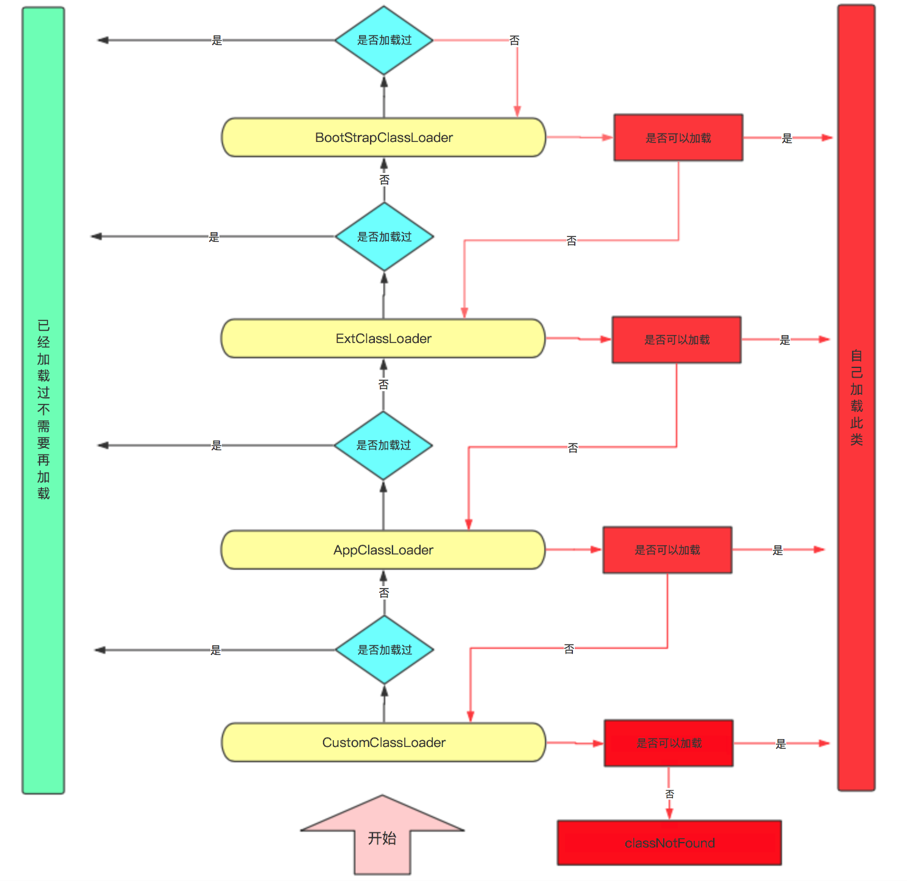
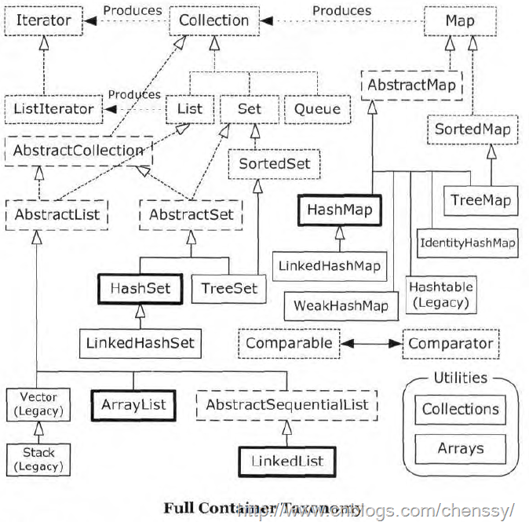
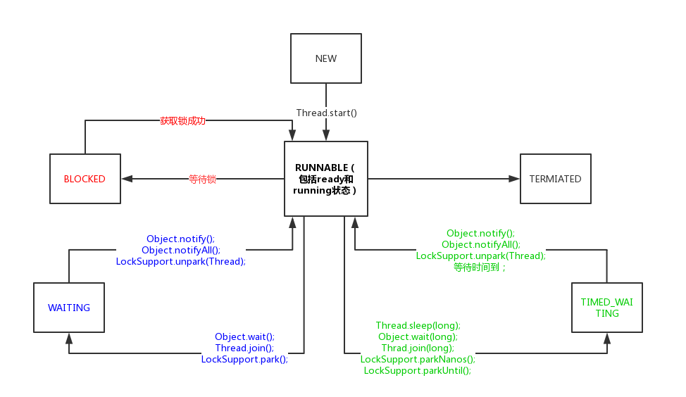
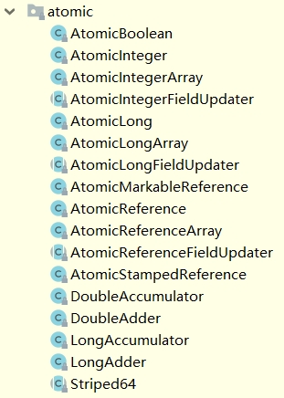

---

title: java
top: false
cover: true
toc: true
mathjax: true
date: 2021-03-15 15:47:03
password:
summary:
tags: Java基础
categories: Java
---

# JAVA 常问知识点

# 安装

首先下载jdk进官网下载jdk

http://www.oracle.com/technetwork/java/javase/downloads/jdk8-downloads-2133151.html

本篇文章下载1.8的


选择相应的系统。

一键安装即可。

安装后会有两个jre，一个jdk内部的，和jdk外部的

关于两套jre的解释

一个jre文件在JDK的外部，一个jre文件在JDK内部，这就是所谓的专用JRE和公用JRE

- - 专用 JRE 
    安装 JDK 时，会安装一个专用 JRE，并且您可以选择安装一个公共副本。需要专用 JRE 才能运行 JDK 中包含的工具。专用 JRE 没有注册表设置，并且完全包含在仅对 JDK 已知的 Java 目录位置（通常位于 C:\Program Files\Java\jdk1.8.0_162\jre）中。
  - 公共 JRE 
    可由其他 Java 应用程序使用，并且包含在 JDK 外部（通常位于C:\Program Files\Java\jre1.8.0_162）。公共 JRE 会注册到 Windows 注册表（位于 HKEY_LOCAL_MACHINE\SOFTWARE\JavaSoft）中。公共 JRE 可以使用“添加/删除程序”进行删除，并且还会注册到浏览器。

### 配置环境变量

对我的电脑点右键，然后选择属性


 进入之后选择高级系统设置，然后选择环境变量

在打开的环境变量对话框后，单击下方【系统变量】下的【新建】按钮；

 然后输入JAVA_HOME,对应的变量值为你jdk安装的目录。


点击确定。

然后新建变量名：classpath     变量值：.;%JAVA_HOME%\lib;%JAVA_HOME%\lib\tools.jar点确定


 

然后在系统变量中找到名为“Path”的变量并双击，新建变量为 %JAVA_HOME%\bin

 

确定以后，分别输入“java”、“java -version”（java -version代表你安装的java的版本）和javac，若都正常运行则代表java已经正确安装。

## ubuntu18.04 安装

java下载

1.进入官网下载页面http://www.oracle.com/technetwork/java/javase/downloads/index.html

2.选择需要的版本，进入下载页面

选中红框才可以下载

3.下载完成解压

本人安装目录是/usr/java下，需要cd /usr进入usr目录

创建java文件夹，命令sudo mkdir java

为了后续方便，将java目录赋予最高权限，命令sudo chmod 777 java

将下载的文件移动到java目录下，具体根据你的是桌面版还是服务器版本自行移动。

解压java包 tar -zxvf jdk文件名

本人的是tar -zxvf jdk-8u144-linux-x64.gz

解压完成

三、配置java

输入sudo vim /etc/profile

如果没有vim，使用vi也可以，或者其他编辑器，都可以

在文件中添加如下，根据自己实际情况填写

安装目录

```bash
export   JAVA_HOME=/home/tclab/env/jdk1.8.0_301
```

#下面都一样啦

```bash
export   CLASSPATH=.:$JAVA_HOME/lib:$JRE_HOME/lib:$CLASSPATH
export  PATH=$JAVA_HOME/bin:$JRE_HOME/bin:$PATH
export   JRE_HOME=$JAVA_HOME/jre
```

## 远程开发 IDEA

官网 [Run targets | IntelliJ IDEA (jetbrains.com)](https://www.jetbrains.com/help/idea/run-targets.html)


### <font color = "green"> 求时间复杂度 </font>

1. 递归树法

$T(n) = 2 * T(\frac{n}{2}) + n $


2. 主定理分析法

$T(n) = a * T(\frac{n}{b}) + f(n)$


## 1. JVM虚拟机

虚拟机的启动是通过引导类加载器（bootstrap class loader）创建一个初始类（initial class）来完成的，这个类是由虚拟机的具体实现指定的。

执行引擎：


### > 类加载子系统

1. 加载 引导类加载器、扩展类加载器、系统类加载器
2. 链接 验证、准备、解析
3. 初始化阶段 初始化

加载：

类加载子系统负责从文件系统或者网络中加载Class文件，class文件在文件开头有特定的标识。

ClassLoader只负责class文件的加载，至于它是否可以运行，由Execution Engine决定。

加载的类信息存放于一块被称为方法区的内存空间。

链接：

1. 验证 确保class文件的字节流信息符合当前虚拟机要求。文件格式、元数据、字节码和符号引用验证。
2. 准备。为类变量分配内存并设置该类默认初始值。这里不包括final，final在编译就分配了，准备阶段回显式初始化。这里不会为实例变量分配初始化，类变量会分配在方法区中，而实例变量是会随着对象一起分配到Java堆中。
3. 解析。将常量池内符号引用转换为直接引用的过程。符号引用就是一组符号来描述所引用的目标。直接引用就是直接指向目标的指针、相对偏移量或一个间接定位。

初始化：

cinit()方法会把显示初始化和静态代码块中的初始化放到一起的方法。类构造器会生成方法cinit（）过程。JVM自动手机所有类变量和赋值动作和静态代码块中的语句合并而来。

虚拟机必须保证一个类的<cinit>()方法在多线程环境下被同步加锁。


常见的虚拟机有：

1. Sun Classic VM。
2. Exact VM。
3. Sum HotSpot VM
4. BEA JRockit
5. IBM J9

架构：基于栈式架构的。

1. 设计和实现更简单，适用于资源受限的系统。
2. 避开了寄存器的分配难题：使用零地址指令方式分配。
3. 指令流中的指令大部分是零地址指令，其执行流程依赖于操作栈。

3. 指令更多。

### >JVM生命周期

1. 启动通过引导类加载器bootstrap class loader创建一个初始类 initial class 来完成的。

2. 执行。
3. 退出。正常执行结束、运行时异常。


### <font color = "green"> > 面向对象和面向过程的区别</font>

* 面向过程 ： 面向过程性能很好。类调用时需要实例化，开销大消耗资源。但是面向过程没有面向对象易于维护、复扩展。
* 面向对象：易维护、复用、扩展。因为面向对象有封装、继承、多态的特性，低耦合系统。

类加载子系统


### <font color="green">> 对象加载的5个步骤</font>

1. **类加载检查**。当使用new 生成一个对象时，会首先去检查常量池中有没有对这个对象的引用。如果没有，再检查这个对象是否已经<font color="purple">加载、解析、初始化</font>过，如果没有，会进行类加载。
2. **分配内存**。在JAVA堆中为对象分配内存。内存分配机制有两种，第一种是**指针碰撞**，第二种是**空闲列表**。分配方式由JAVA堆是否规整决定，JAVA堆是否规整又由所采用的垃圾回收器是否有压缩整理功能决定。
3. **初始化零值**。为内存中已经分配的对象数据初始化零值，这样对象可以不赋初始值直接使用。
4. **分配对象头**。对象头包括类元数据、对象的哈希码以及对象的GC分代年龄等。
5. **init初始化**。按照程序员的意愿对类中的数据进行初始化。

### <font color="green">>对象的内存布局</font>

1. **对象头**。包括对象的哈希码、GC分代年龄等。
2. **实例数据**。程序中所s定义的各种字段内容。
3. **对齐填充**。由于对象占位必须是8字节的整数倍，所以当对象实例部分空间未占满时（对象头本身是8字节的1倍或2倍），会对剩余空间进行填充。

### <font color="green">> 句柄和直接引用</font>

1. **句柄**。指针的指针。JAVA堆中分配句柄池，存储实例对象的地址。


**优点**：一个对象被多个变量引用，那么只需要更改句柄池一个。当对象地址改变时，只需改变句柄池内容即可。

**缺点**：速度慢。

2. **直接指针**。指针，直接保存对象地址。速度快，省去了句柄池还得再次寻找地址。

**优点**：速度快。

**缺点**：对象被移动时，所有指向该对象的reference都需要被改变，耗时。

### > <font color="green">双亲委派机制</font>

当要加载某个类时，需要把任务委托给上级类加载器，递归询问是否已经加载此类，如果没有，自己才会加载。



1. 启动类加载器（BootstrapClassLoader）`C++` 编写

加载`java`核心库 `java.*`,构造`ExtClassLoader`和`AppClassLoader`。涉及到虚拟机本地实现细节，开发者无法获取到启动类加载器的引用，不允许直接通过引用进行操作。

2. 标准扩展类加载器（ExtClassLoader）`java` 编写 (java官方其实从这里就开始叫做自定义加载器了，所有继承自classloader的类都是自定义加载器)

加载扩展库如`classpath`中的`jre` ，`javax.*`或者
`java.ext.dir` 指定位置中的类，开发者可使用标准扩展类加载器。

3. 系统类加载器 （AppClassLoader）`java` 编写

加载程序所在的目录，如`user.dir`所在的位置的`class`。

4. 用户自定义类加载器（CustomClassLoader）`java` 编写

用户自定义的类加载器,可加载指定路径的`class`文件。 需要隔离加载类、修改类加载方式、扩展加载源、防止源码泄露等需要自定义加载器。

作用：

1.防止重复加载同一个类。

2.防止代码被篡改。（只能有一个被加载的类，已经加载的类不能被篡改）。

注意，这4种是包含关系，不是上下级关系。

双亲委派机制保证了Java的沙箱安全机制。比如你自定义String类，但是在加载自定义String类的时候会率先使用引导类加载器加载，而引导类加载器在加载的过程中会先加载jdk自带的文件。

### <font color="green">< JVM结构</font>

HotSpot是使用指针的方式来访问对象：java堆中存放访问类元数据（描述数据的数据，也就是模板）的地址，reference存储的就直接是对象的地址。


```
程序计数器
```

1. 程序计数器 **线程私有**

* 概念：记录当前线程执行的**指令字节码地址**。

* 功能：改变这个计数器的值来选取下一条需要执行指令的字节码指令，分支、循环、跳转、异常处理、线程恢复等基础功能都需要依赖计数器完成。
* **唯一一个不会出现 `OutOfMemoryError `的内存区域**，它的生命周期随着线程的创建而创建，随着线程的结束而死亡。

```
虚拟机栈
```

2. 虚拟机栈 **线程私有**


* 栈存储的是对象的引用变量、8种基本类型和实例方法。

* 栈帧理解成java中的方法。stackoverflowerror是个错误。

* Java虚拟机栈是由一个个栈帧组成，而每个栈帧中都拥有：局部变量表、操作数栈、动态链接、方法出口信息。

* **局部变量表主要存放了编译器可知的各种数据类型**（boolean、byte、char、short、int、float、long、double）、**对象引用**（reference类型，它不同于对象本身，可能是一个指向对象起始地址的引用指针，也可能是指向一个代表对象的句柄或其他与此对象相关的位置）。

* Java 虚拟机栈会出现两种异常：StackOverFlowError 和 OutOfMemoryError。

  **StackOverFlowError：** 若Java虚拟机栈的内存大小不允许动态扩展，那么当线程请求栈的深度超过当前Java虚拟机栈的最大深度的时候，就抛出StackOverFlowError异常。

  **OutOfMemoryError：** 若 Java 虚拟机栈的内存大小允许动态扩展，且当线程请求栈时内存用完了，无法再动态扩展了，此时抛出OutOfMemoryError异常。

* Java方法有两种返回方式：

1. return 语句。

2. 抛出异常。

   不管哪种返回方式都会导致栈帧被弹出。

* **i++ 和 ++i 的区别：**
  1. i++：从局部变量表取出 i 并压入操作栈(load memory)，然后对局部变量表中的 i 自增 1(add&store memory)，将操作栈栈顶值取出使用，如此线程从操作栈读到的是自增之前的值。
  2. ++i：先对局部变量表的 i 自增 1(load memory&add&store memory)，然后取出并压入操作栈(load memory)，再将操作栈栈顶值取出使用，线程从操作栈读到的是自增之后的值。

```
本地方法栈
```

3. 本地方法栈 **线程私有**

*  **虚拟机栈为虚拟机执行 Java 方法 （也就是字节码）服务，而本地方法栈则为虚拟机使用到的 Native 方法服务。** 在 HotSpot 虚拟机中和 Java 虚拟机栈合二为一。（本地方法=android 里面的JNI 用其他语言例如C++)

*  本地方法被执行的时候，在本地方法栈也会创建一个栈帧，用于存放该本地方法的局部变量表、操作数栈、动态链接、出口信息。

*  也会出现 StackOverFlowError 和 OutOfMemoryError 两种异常。

```
java堆
```

4. 堆 线程**共享**

* 存放**对象实例**，几乎所有的对象实例以及**数组**都在这里分配内存。

* 主要记**垃圾回收机制**。

```
方法区
```

5. 方法区 线程**共享** JDK1.8替换为元空间

* 存储已被虚拟机加载的类信息、常量、静态变量、即时编译器编译后的代码等数据。
* 别名叫做 Non-Heap（非堆）。永久代也叫方法区。

```
运行时常量池
```

6. 运行时常量池 线程**共享**

* 是方法区的一部分。Class 文件中除了有类的版本、字段、方法、接口等描述信息外，还有一项信息是常量池（Constant Pool Table），用于存放编译期生成的各种字面量和符号引用，这部分内容将在类加载后进入方法区的运行时常量池中存放。

* 运行期间也可能将新的常量放入池中，例如 String 类的 intern() 方法。

```
直接内存
```

7. 直接内存 线程**共享**

* 不是 Java 虚拟机规范中定义的内存区域。

* 受到本机总内存（包括 RAM 以及 SWAP 区或者分页文件）大小以及处理器寻址空间的限制。

```
元空间
```

8. 元空间 线程**共享**

* 使用本地内存（直接内存）来存储类元数据信息并称之为：元空间（Metaspace）
* java8中移除了永久代（就是**方法区**），新增元空间，这两者之间存储的内容（常量池，类信息，还有class的static变量）几乎没怎么变化，而是在内存限制、垃圾回收等机制上改变较大。元空间的出现就是为了解决突出的类和类加载器元数据过多导致的内存溢出问题。

1. 使用JDK1.7运行Java程序，监控并耗尽默认设定的85MB大小的PermGen（1.7之前是PermGen，1.8改为元空间）内存空间。
2. 使用JDK1.8运行Java程序，监控新Metaspace内存空间的动态增长和垃圾回收过程。
3. 使用JDK1.8运行Java程序，模拟耗尽通过“MaxMetaspaceSize”参数设定的128MB大小的Metaspace内存空间。


9. 堆参数调优

| -Xms                     | 设置初始分配大小，默认为物理内存的“1/64” |
| ------------------------ | ---------------------------------------- |
| -Xmx                     | 最大分配内存，默认为物理内存的"1/4"      |
| -XX:+PrintGCDetails      | 输出详细的GC处理日志                     |
| -XX:MaxTenuringThreshold | 设置对象在新生代中的存活的次数           |

```java
public 
{
    Runtime.GetRuntime().availableProcessors();
    Runtime.GetRuntime().maxMemory();
    Runtime.GetRuntime().totalMemory();
}
```

* 最好初始内存和最大内存设置成一样的。避免内存忽高忽低。


### <font color="green">< 垃圾回收机制</font>

GC = YGC = 轻量级GC

养老区满了 FULL GC = FGC 重量级GC，如果没办法腾空间，则OOM

1. **判定**哪些对象是垃圾

* 引用计数法

每个对象都分配一个引用计数器，用来存储该对象被引用的个数。当有地方引用它，计数器加1。当个数为0，则可以回收。

此方法有一个**缺陷**：两个对象互相引用，计数器永远不为0。所以JAVA没采用此方法。

* 可达性分析

把所有引用对象抽象成一棵树，从树**GC Roots**根结点出发，遍历所有树枝。找到的就是可达，判定存活，不能找到的就是可回收对象。


* GC Roots的种类：

虚拟机栈中引用的对象。

方法区中静态属性引用的对象。

方法区中常量引用的对象。

本地方法栈中JNI引用的对象。


2. **回收垃圾算法** （4个）

* 标记-清理

1）标记，利用可达性分析，找到垃圾对象。

优点：简单快捷。

缺点：产生内存碎片。


* 标记-整理

标记清理会产生内存碎片所以：

1）可达性分析找到垃圾对象和存活对象。

2）把所有存活对象堆到同一个地方，没有内存碎片。

适合存活对象多，垃圾少的情况。


* 复制

将内存划分为大小相等的两块，每次使用其中一块。这一块用完了，将活着的队形复制到另一块，然后把使用过的内存空间一次性清理掉。


优点：简单快速、不会产生碎片

缺点：内存利用率很低，只用了一半。

* **分代回收算法**

java堆分为刚刚创建的对象、存活了一段时间的对象和永久存在的对象。

新生代与老年代的比例为1：2。


**设置两个 Survivor 区解决内存碎片化**。Survivor 如果只有一个区域，Minor GC 执行后，Eden 区被清空了，存活的对象放到了 S1（from） 区，而之前 S1 区中的对象，可能也有一些是需要被清除的。这时候我们怎么清除它们？在这种场景下，我们只能标记清除，标记清除最大的问题就是内存碎片。有了s2（to），将之前 Eden 区和 From 区（s1)中的存活对象复制到 To 区域(s2)。第二次 Minor GC 时，From 与 To 职责换一下，这时候会将 Eden 区和 s2 区中的存活对象再复制到 s1 区域，以此反复。

**新生代-复制 回收机制**：

区域大小比例Eden:s1:s2= 8: 1:1（Hotspot虚拟机这样划分）。新生代每次都有大量对象死亡，只有少量存活。因此采用复制算法，回收时GC把少量存活对象复制过去即可。

**只有经历16次 Minor GC 还能在新生代中存活的对象，才会被送到老年代。**


工作原理：

1）Eden区域快满了，**触发垃圾回收机制（Young GC)**。此轮存活对象放入From(s1)。

2）Eden再次满，**触发垃圾回收机制（Young GC)**，回收Eden和From（s1），存活放入To（s2）。此时s1空了，下一次回收时**s1和s2职责对换**，下一次Eden满时将Eden和To（s2）的存活对象放入From（s1）， 如此往复。多次后一些对象在s1和s2之间多次复制，复制次数超过某个阈值**（16）**后，把存活对象复制到Old区域。

3）当某个s区域不足以存放存活对象，将多余对象放到Old区域。

4）Old区域满了，**触发垃圾回收机制（Full GC）**，进行整个堆的垃圾回收（老年代也要回收了，用老年代自己的回收算法），跳到1）进行新一轮垃圾回收算法。

**老年代-标记整理 回收机制**：

老年代存活对象多、垃圾少。老年代仅仅通过少量地移动存活对象就能清理垃圾。

**Full GC** 触发情况：

　　1）年老代（Tenured）被写满

　　2）持久代（Perm）被写满 

　　3）System.gc()被显示调用 

　　4）上一次GC之后Heap的各域分配策略动态变化


3. **垃圾回收器** （hotspot虚拟机）

* 吞吐量

CPU 用于运行用户代码的时间与 CPU 总消耗时间的比值。比如说虚拟机总运行了 100 分钟，用户代码时间 99 分钟，垃圾回收 时间 1 分钟，那么吞吐量就是 99%。

* 停顿时间

停顿时间 指垃圾回收器正在运行时，应用程序 的 暂停时间。

* GC的名词

新生代GC：Minor GC 

老年代GC：Major GC

* 并发与并行

（1）串行（Parallel）

垃圾回收线程 进行垃圾回收工作，但此时 用户线程 仍然处于 等待状态。

（2）并发（Concurrent）

这里的并发指 用户线程 与 垃圾回收线程 交替执行。

（3）并行（Parallel）

这里的并行指 用户线程 和多条 垃圾回收线程 分别在不同 CPU 上同时工作。


回收器种类：

**1）Serial（单线程）**

Serial 回收器是最基本的 新生代垃圾回收器，是单线程的垃圾回收器。采用的是 **复制**算法。垃圾清理时，Serial回收器不存在线程间的切换，因此，在单 CPU的环境下，垃圾清除效率比较高。

**2）Serial Old（单线程）**

Serial Old回收器是 Serial回收器的老生代版本，单线程回收器，使用 **标记-整理算法**。在 JDK1.5 及其以前，它常与Parallel Scavenge回收器配合使用，达到较好的吞吐量，另外它也是 CMS 回收器在Concurrent Mode Failure时的后备方案。

**3）ParNew（多线程）**

ParNew回收器是在Serial回收器的基础上演化而来的，属于Serial回收器的多线程版本，采用**复制**算法。运行在新生代区域。在实现上，两者共用很多代码。在不同运行环境下，根据CPU核数，开启不同的线程数，从而达到最优的垃圾回收效果。


**4）Parallel Scavenge（多线程）**

运行在新生代区域，属于多线程的回收器，采用**复制**算法。与ParNew不同的是，ParNew回收器是通过控制垃圾回收的线程数来进行参数调整，而Parallel Scavenge回收器更关心的是程序运行的吞吐量。即一段时间内用户代码运行时间占总运行时间的百分比。

**5）Parallel Old（多线程）**

Parallel Old回收器是Parallel Scavenge回收器的老生代版本，属于多线程回收器，采用**标记-整理算法**。Parallel Old回收器和Parallel Scavenge回收器同样考虑了吞吐量优先这一指标，非常适合那些注重吞吐量和CPU资源敏感的场合。


**6）CMS（多线程回收）**

CMS回收器是回收老年代收集器。在最短回收停顿时间为前提的回收器，属于多线程回收器，采用标记-清除算法。


初始标记 ：标记GC Roots能直接关联到的对象，需要在safepoint位置暂停所有执行线程。

并发标记 ：进行GC Roots Tracing，遍历完从root可达的所有对象。该阶段与工作线程并发执行。

重新标记 ：修正并发标记期间因用户程序继续运作而导致标记产生表动的那一部分对象的标记记录。需要在safepoint位置暂停所有执行线程。

并发清理 ：内存回收阶段，将死亡的内存对象占用的空间增加到一个空闲列表(free list),供以后的分配使用。

重置 ：清理数据结构,为下一个并发收集做准备。

**7）G1回收器**

以前的回收器，都需要完全回收整个年轻代和老年代，随着技术的发展，垃圾越来越大，处理垃圾需要很大延迟。G1是 JDK 1.7中正式投入使用的用于取代CMS的压缩回收器。**基于标记整理**的垃圾回收器。年轻代分为Eden和Survivor两个区，老年代分为Old和Humongous（大对象，占用的空间超过了分区容量50%）两个区。

* 无需回收整个堆，而是选择一个Collection Set(CS)。

* 两种GC： Full yong GC Mixed GC
* 估计每个region中的垃圾比例，优先回收垃圾多的Region。


为了解决跨代引用，发明了Card Table 和 Remember Set（用c语言写的HashTable）。Card Table 指， 比如我将某个内存区域大小划分为512个，Rememberset保存是指向Card Table中的entry。 在实际写代码时，每次=这种赋值代码，JVM其实会使用write barrier，它注入一小段代码，用于记录这种变化从而更新rememberset。因为我们程序经常是多线程的 ，所以我们需要一种更新RS的机制：

这种更新RS的线程被定义为Refinement线程。


G1的基本流程：

1. YOUG GC

   STW（stop the world 收集）

   * 构建CS （Eden + Survivor)

   * 扫描GC Roots

   * Update RS：排空Dirty Card Queue

   * Process RS：找到被老年代对象引用

   * Object copy

   * reference processing

     G1记录每个阶段的时间，用于自动调优。记录Eden、Survivor的数量和GC时间，根据暂停目标自动调整Region的数量。

     暂停目标越短，Eden数量越少（回收的次数多了）。

2. MIXED GC

   当堆的用量达到一定程度时触发：

   如何在不停止应用程序的情况下能够标记所有活对象。使用**三色标记算法**（黑色、灰色和白色），不暂停应用线程的情况下进行标记。比如：

   一开始都是白色，然后GC ROOT变成黑色，他们所引用的对象变成灰色，这些灰色的变成队列，接下来从灰色队列里拿出来活的对象，然后把它引用的对象标记成灰色。 有时会发生Lost Object问题，活对象没有被标记出来：

   

每当C被从B删除（B=null），把它记录下来（write barrier），也认为是活对象，最后会STW进行判断是否真的是活的还是清除。

* 利用年轻代信息（会进行一次yong gc）STW
* 恢复线程，并发标记
* STW 重新标记，进行回收全空的区。
* 恢复应用线程。


1. G1首先将堆分为大小相等的 Region，避免全区域的垃圾回收。

   * `-XX:G1HeapRegionSize=N` 默认2048个区域大小

   * G1的分区示例如下图所示：（新生代、幸存区、老年代和大对象(humongous)


G1把堆内存分为大小相等的内存分段，默认情况下会把内存分为2048个内存分段。比如32G堆内存，2048个内存分段每段的大小为16M。这相当于把内存化整为零。内存分段是物理概念，代表实际的物理内存空间。每个内存分段都可以被标记为Eden区，Survivor区，Old区，或者Humongous区。

这样划分有问题，不同的区域之间存在互相引用，造成跨代引用的问题。如何去标记另外一个区域引用了当前这个对象，引入了卡表和RS。每个区域内每个卡表占512byte，当此卡表对应的对象发生改变时，标记为dirty。每个对象的RS（RememberSet)记录谁引用了此对象。如下图所示：卡表引用Region1引用Region2区域的对象，Region2区域的RS记录Region1引用了它本身。


如何去实现这个RS记录的过程？G1中有`Write Barrier`机制，这个机制由编译器动态生成一小段代码。

**Write Barrier机制**

每当执行`object.field = <reference>(putfield)`赋值操作时，JVM会注入一小段代码。

当赋值操作需要让RS更新时，把即将改变的卡表比如上图中的Region 1 卡表新指向了 Region 2，需要将Region 1中的这个卡表标记为 dirty。然后将此card放入队列(Dirty Card Queue)，这个队列有白、绿、黄、红四个颜色。根据更新的频率G1自动设定等级，比如更新的非常剧烈，红色。

1. 白色

   天下太平，无事发生

2. 绿色 (-XX:G1ConcRefinementGreenZone = N)

   Refinement线程开始被激活，开始更新RS

3. 黄色 （-XX：G1ConcRefinementYellowZone=N)

   全部Refinement线程激活

4. 红色 (-XX:G1ConcRefinementRedZone=N)

   应用线程也参与排空队列的工作。（把应用线程拖慢）

* 无需回收整个堆，而是选择一个`Collection Set(CS)`

当一个地址空间被引用时，这个地址空间对应的数组索引的值被标记为”0″，即标记为脏被引用，此外RSet也将这个数组下标记录下来。一般情况下，这个RSet其实是一个Hash Table，Key是别的Region的起始地址，Value是一个集合，里面的元素是Card Table的Index。

Mixed GC （老年代和年轻代一起回收） 不一定立即发生，选择若干个Region进行，默认1/8的Old Region（选择垃圾最多的老年代优先进行）。STW,Parallel,Copying回收，它和年轻代是完全相同的做法。


总结：

G1垃圾回收过程主要包括三个：

- 年轻代回收（young gc）过程，这个过程是`stop the world`方法，需要暂停应用程序，通过上述的卡表和RS更新引用对象。
- 老年代并发标记（concurrent marking）过程，这个是并发标记的过程，使用三色标记法标记（白色，黑色，灰色）。
- 混合回收过程（mixed gc）。

1）Young GC

- 阶段1：根扫描
  静态和本地对象被扫描
- 阶段2：更新RS
  处理dirty card队列更新RS
- 阶段3：处理RS
  检测从年轻代指向年老代的对象
- 阶段4：对象拷贝
  拷贝存活的对象到survivor/old区域
- 阶段5：处理引用队列
  软引用，弱引用，虚引用处理

2）并发标记+垃圾回收

- 初始标记（initial mark，STW）
  在此阶段，G1 GC 对根进行标记。该阶段与常规的 (STW) 年轻代垃圾回收密切相关。
- 根区域扫描（root region scan）
  G1 GC 在初始标记的存活区扫描对老年代的引用，并标记被引用的对象。该阶段与应用程序（非 STW）同时运行，并且只有完成该阶段后，才能开始下一次 STW 年轻代垃圾回收。
- 并发标记（Concurrent Marking）
  G1 GC 在整个堆中查找可访问的（存活的）对象。该阶段与应用程序同时运行，可以被 STW 年轻代垃圾回收中断
- 最终标记（Remark，STW）
  该阶段是 STW 回收，帮助完成标记周期。G1 GC 清空 SATB 缓冲区，跟踪未被访问的存活对象，并执行引用处理。
- 清除垃圾（Cleanup，STW）
  在这个最后阶段，G1 GC 执行统计和 RSet 净化的 STW 操作。在统计期间，G1 GC 会识别完全空闲的区域和可供进行混合垃圾回收的区域。清理阶段在将空白区域重置并返回到空闲列表时为部分并发。

了解并发标记的**三色标记算法**。


收集器总结：

|      收集器       | 执行方式 |   分代   |     算法      |     目标     |             场景             |
| :---------------: | :------: | :------: | :-----------: | :----------: | :--------------------------: |
|      Serial       |   串行   |  新生代  |     复制      | 响应速度优先 |     单CPU下的客户端模式      |
|    Serial Old     |   串行   |  老年代  |   标记-整理   | 响应速度优先 | 单CPU下的客户端和CMS后备方案 |
|      ParNew       |   并行   |  新生代  |     复制      | 响应速度优先 | 多CPU在服务器模式下与CMS配合 |
| Parallel Scavenge |   并行   |  新生代  |     复制      |  吞吐量优先  |  后台计算不需要太多交互任务  |
|   Parallel Old    |   并行   |  老年代  |   标记-整理   |  吞吐量优先  |  后台计算不需要太多交互任务  |
|        CMS        |   并发   |  老年代  |   标记-清除   | 响应速度优先 |   集中在网站或B/S系统服务    |
|        G1         |   并发   | 两者都有 | 标记整理+复制 | 响应速度优先 |   面向服务端应用，替换CMS    |

* 4.方法区回收条件：

只有同时满足以下三个条件才会被回收！

1）所有实例被回收

2）加载该类的ClassLoader被回收

3）Class对象无法通过任何途径访问(包括反射)


## 2. Java基础

### <font color="green"><static 关键字</font>

> static 关键字

java中不存在“全局变量”概念，可以用static表示“伪全局”概念。

被static修饰就是静态变量，所以JVM肯定将其放在单独的常量池里。JVM可以方便访问它们。

要点：

1. 被 static 修饰的成员变量和成员方法是独立于该类的。

   静态变量和静态方法是随着类加载时被完成初始化的（类加载时已经存在），它在内存中仅有一个，且 JVM 也只会为它分配一次内存，同时类所有的实例都共享静态变量，可以直接通过类名来访问它。

   可如下直接使用：

```java
ClassName.propertyName
ClassName.methodName(……)
```

2. 它只能调用 static 变量和方法。
3. 不能以任何形式引用 this、super。
4. static 变量在定义时必须要进行初始化，且初始化时间要早于非静态变量。

静态方法里面为什么不能用this指针，从底层上来说，操作数栈中的没有this指针，而普通方法index=0永远是this。

### <font color="green"><final关键字</font>

某些数据不可更改。final修饰的叫常量。“常量”的使用有以下两个地方：

1. 编译期常量，永远不可改变。
2. 运行期初始化时，不可改变。根据对象的不同而表现不同，但同时又不希望它被改变，这个时候我们就可以使用运行期常量。

```java
private final String final_01 = "demo";//编译期常量，必须要进行初始化，且不可更改

public class test{
    public final String str;
    private static Random random = new Random();
    private final int final_03 = random.nextInt(50);  //使用随机数来进行初始化,运行期初始化，每次new新的类都会改变内容（random）。
    test(String s){
        this.str=s;
    }
}
```

注意点：

1. final修饰的方法不能被修改重写，可以被继承。
2. final修饰的类不能修改不能继承，最终类。
3. 匿名内部类中参数必须为final。

> ### <font color="green">java compator</font>

- 保持这个顺序就返回-1 (> 还是 <)
- 交换顺序就返回1
- 什么都不做就返回0；所以 升序的话 如果1<2,返回-1,保持顺序[1,2],如果3>2,返回-1,交换顺序[2,3]

```
if (a > b) return -1; 保持a> b的顺序
if (a > b) return 1; 交换ab
```

### <font color = "green"><java异常</font>

1. 异常的体系结构

什么是异常？

异常指的就是程序的不正常，简单理解就是程序所发生的错误。

* 分类

a 编译时异常： 编译期间，编译器检测到某段代码可能会发生某些问题，需要程序员提前给代码做出错误的解决方案，否则编译无法通过。

b 运行时异常 编译正常，运行时出现了错误。

* 体系结构

a throwable

​	Error:严重错误

​	Exception:

​		RuntimeException

​		IRuntimeException

* 异常出现的原理

  java对异常的默认处理方式是抛出问题给上一级，如果出现了问题，java会根据问题所描述的异常类创建一个对象，底层通过throw关键字将该对象抛出给上一级。（mehtod -> main -> jvm -> 将异常位置和错误原因打印）

* 异常的处理方式

  * 问题可以自己处理的

    try catch处理方式 (后面的代码还可以继续执行)

  * 问题处理不掉的

    throw处理方式。 如果是RuntimeException异常，则方法上面无需throws声明。

throws 和 throw throws是仅仅对方法进行声明，告知调用者此方法存在异常。

throw是抛出。

* Spring框架的事务默认是RuntimeException才进行回滚

  * 解决方案 

  修改Transactional注解中的rollbackFor属性可以指定为exception异常回滚。

  ```java
  @Transactional(rollbackFor={Exception.class})
  ```


自己定义异常 （规范的异常类名，找一个类继承exception）。

```java
class MyPersonAgeException extends RuntimeExceptoin(或 Exception)
    
    记得加入字符串的构造参数
```

### <font color="green"><JAVA 集合</font>



1. **Collection**

最基本的集合接口，它不提供直接的实现，JAVA SDK提供的类都是继承自Collection的**子接口**。所有实现Collection的接口类必须实现两类构造函数

a) 无参构造函数。创建空的Collection。

b) 有参构造函数，用于创建新的Collection。

解决ArrayLlist的线程不安全(`concurrentModificationException`)。

1. 换成`vector`。
2. 换成`Collections.synchronizeList(new ArrayList());
3. new copyOnWriteArrayList();写时赋值。

```java
1.List

a) ArrayList 

初始容量10。基于数组实现。每次扩容1.5倍。

b) LinkedList

基于双向链表实现，近开头或结尾（靠近索引）遍历链表。

c) Vector

与ArrayList一样，不同在于它是线程安全。

d) Stack

继承自Vector，后进先出的栈。提供push pop peek empty search。

2.Set

与list区别是不包含重复元素。

a）EnumSet

枚举专用Set，所有元素都是枚举类型。

b）HashSet

查询速度最快的集合，内部以Hashcode实现，顺序也以哈希码排序。

c）TreeSet

排序状态的Set，以TreeMap实现，以自然元素顺序或用户自定义`Comparator`排序。

3.Queue
（1）不阻塞的： PriorityQueue 和 ConcurrentLinkedQueue
　　PriorityQueue 和 ConcurrentLinkedQueue 类在 Collection Framework 中加入两个具体集合实现。 
　　PriorityQueue 类实质上维护了一个有序列表。加入到 Queue 中的元素根据它们的天然排序（通过其 java.util.Comparable 实现）或者根据传递给构造函数的 java.util.Comparator 实现来定位。
　　ConcurrentLinkedQueue 是基于链接节点的、线程安全的队列。并发访问不需要同步。因为它在队列的尾部添加元素并从头部删除它们，所以只要不需要知道队列的大 小，ConcurrentLinkedQueue 对公共集合的共享访问就可以工作得很好。收集关于队列大小的信息会很慢，需要遍历队列。
（2）阻塞的：
　　五个阻塞队列类。它实质上就是一种带有一点扭曲的 FIFO 数据结构。不是立即从队列中添加或者删除元素，线程执行操作阻塞，直到有空间或者元素可用。
五个队列所提供的各有不同：
　　 ArrayBlockingQueue ：一个由数组支持的有界队列。
　　 LinkedBlockingQueue ：一个由链接节点支持的可选有界队列。
　　 PriorityBlockingQueue ：一个由优先级堆支持的无界优先级队列。
　　 DelayQueue ：一个由优先级堆支持的、基于时间的调度队列。
　　 SynchronousQueue ：一个利用 BlockingQueue 接口的简单聚集（rendezvous）机制。
    
  3.1 ArrayDeque
    默认16，最小8。 object[]数组存储。
    栈操作：push pop peek 队列：offer poll peek
    一般操作：add//尾 
    remove //首
    public E remove() {
        return removeFirst();
    }
    

```


2. **Map**

与List和set不同，由一对键值对组成的集合，key到value的映射。

a) HashMap

**链表+数组**.内部定义hash表数组`Entry[] table`，元素通过哈希函数的到哈希地址转为数组存放索引，当有冲突同一个索引处保存链表。


**初始大小16**，容量必须为$2^{n}$（`h & (length-1)`这条规律成立前提长度必须是2的n次方）。JDK1.8 链表升级为**红黑树**结构。当本索引冲突**大于8**链表就转为红黑树，当冲突值小于6再转为普通链表。

高位右移动是为了扰动，防止哈希冲突


在对数组长度进行按位与运算后得到的结果相同，就发生了冲突。

`h >>> 16`过扰动计算之后，最终得到的index的值不一样了.

更多细节参考其他博客，写的比较详细，记住常问的就行。https://blog.csdn.net/xu_dongdong/article/details/80251936 https://blog.csdn.net/woshimaxiao1/article/details/83661464

b) HashTable

* **线程安全**，`(hash & 0x7FFFFFFF) % tab.length`它是通过这句话直接对hash地址取模，不是像HashMap按位与。0x7FFFFFFF做一次按位与操作，主要是为了保证得到的index的第一位为0，也就是为了得到一个正数。因为有符号数第一位0代表正数，1代表负数。
* **初始大小为11**，之后每次扩充为**原来的2n+1**。HashTable的链表数组的默认大小是一个素数、奇数。之后的每次扩充结果也都是奇数。
* 当哈希表的大小为素数时，简单的取模哈希的结果会更加**均匀**。

* 和HashMap**区别**

1、继承的父类不同

   Hashtable继承自Dictionary类，而HashMap继承自AbstractMap类。但二者都实现了Map接口。

2、线程安全性不同

 如果多个线程同时访问一个哈希映射，而其中至少一个线程从结构上修改了该映射，则它必须保持外部同步。Hashtable 中的方法是Synchronize的，而HashMap中的方法在缺省情况下是非Synchronize的。在多线程并发的环境下，可以直接使用Hashtable，不需要自己为它的方法实现同步，但使用HashMap时就必须要自己增加同步处理。

3、只有HashMap可以让你将空值作为一个表的条目的key或value


c) ConcurrentHashMap

* ConcurrentHashMap的hash实现和HashMap一样，但是**用了不同的哈希算法**（Wang/Jenkins 哈希算法）。
* **线程安全** **“分段锁”的概念**，具体可以理解为把一个大的Map拆分成N个小的HashTable，根据key.hashCode()来决定把key放到哪个HashTable中。

ConcurrentHashMap中，就是把Map分成了N个Segment，put和get的时候，都是现根据key.hashCode()算出放到哪个Segment中。

* 通过把整个Map分为N个Segment（类似HashTable），可以提供相同的线程安全，**但是效率提升N倍，默认提升16倍**。

ConcurrentHashMap原理可参考https://blog.csdn.net/xuefeng0707/article/details/40834595

### <font color = "green">> hashset 添加元素怎么判断对象是否重复的？</font>

1.第一，任何类都继承了Object类的hashcode（）方法，如果未重写hashcode，hashset会使用默认hashcode转化对象属性字段为散列码。
2.第二，当得到散列码确定插入的位置后，接下来hashset会调用 要添加对象的equals()方法 与已经在该位置上的所有对象进行比较，如果有一个为true，则不插入，如果为false，则插入。
注意，是调用的插入对象的equals方法，不是已经在hashset中的对象。


### ><font color = "green">迭代器Iterator</font>

迭代器是一种模式，可以使得序列类型的结构数据的遍历行为与被遍历的对象分离。无需关心对象底层的实现，只要拿到这个对象，就可以使用迭代器遍历这个对象的内部。

* Iterable 实现这个接口的集合对象支持迭代。实现Iterable后可以配合foreach使用。
* Iterator 迭代器，提供迭代机制的对象。

Iterator三个方法经常使用`hasnext()` `next()` `remove()`。其中`remove()`的使用需要先调用`next()`。

迭代出的对象也是引用的拷贝，结果还是引用。可以根据迭代出的元素直接修改对象。

Iterator的remove方法可以保证不跑出ModificationException异常即`Fail-fast`机制。

* for 和 Iterator的区别

1. ArrayList对随机访问快速，而for循环中的`get()`方法采用的是随机访问的方法，因此在ArrayList里，for循环较快。
2. LinkedList顺序访问较快，Iterator中的`next()`方法使用顺序访问，因此在LinkedList里，使用iterator更快。
3. for循环适合快速指定元素拿取数据。Iterator适合链式结构。

### <font color="green"><有没有`goto`语句</font>

有，也有`const`。JAVA只保留但基本不用了。

> 一个`.class`文件可不可以有多个类

可以有多个，但是public只有一个。两个以上public就不知道加载哪个类，会报错。

### <font color="green">< String 常量池</font>

字符串常量池底层是用**HashTable**实现的。

1. 创建对象的两种方式。

```java
String s1 = "hello";     
String s2 = new String("hello");     System.out.println(s1==s2);//false
//第一种方式是在常量池中拿对象，第二种方式是直接在堆内存空间创建一个新的对象。 
```

2. JDK版本中(1.7后), 字符串常量池被实现在Java堆内存中。

```
String str1 = "abc"; 
String str2 = "abc"; 
String str3 = "abc"; 
String str4 = new String("abc");
String str5 = new String("abc");
System.out.println(str4==str5);//false
```


3. **“双引号""声明字符串的方式**, 

   JVM首先会去**字符串池**中查找是否存在"abc"这个对象：

* 不存在，在字符串池中创建"abc"这个对象，将"abc"这个对象的引用地址返回给字符串常量s1。
* 如果存在，直接将池中"abc"这个对象的地址返回，赋给字符串常量。

4. **new字符串**

   JVM首先在字符串池中查找有没有"abc"这个字符串对象：

* 存在，**直接在堆**中创建一个"abc"字符串对象，然后将堆中的"abc"对象的地址返回赋给引用str4。
* 不存在，**字符串池**中创建一个"abc"字符串对象，然后再在**堆**中创建一个"abc"字符串对象，将堆中"abc"字符串对象的地址返回赋给s3引用。

5. **intern()** 

调用 intern方法时，查字符串池中：

* 与此对象字符串**内容相同**，如果池已经包含一个等于此String对象的字符串（用**equals(object)**方法确定），则返回池中的字符串。

* 不相同，将此String对象添加到池中，并返回此String对象在常量池中的引用。 对于任意两个字符串s和t，所有字面值字符串和字符串赋值常量表达式都使用 intern()进行操作。

```java
String str1 = "abc"; 
String str2 = new StringBuilder("ab").apend("c").toString();
String str3 = str2.intern();
System.out.println(str1==str2);//false
System.out.println(str1==str3);//true
```

例题：

```java
String s1 = "a";
String s2 = s1 + "b";
String s3 = "a" + "b";
System.out.println(s2 == "ab");
System.out.println(s3 == "ab");
```

第一条语句打印的结果为false，第二条语句打印的结果为true，这说明javac编译可以对字符串常量直接相加的表达式进行优化，不必要等到运行期再去进行加法运算处理，而是在编译时去掉其中的加号，直接将其编译成一个这些常量相连的结果。由于s2只能在运行期间才能确定，所以s2指向的不是常量池中的“ab”。

```java
/**
 * 编译期确定
 * 对于final修饰的变量，它在编译时被解析为常量值的一个本地拷贝存储到自己的常量池中或嵌入到它的字节码流中。
 * 所以此时的"a" + s1和"a" + "b"效果是一样的。故结果为true。
 */
String s0 = "ab"; 
final String s1 = "b"; 
String s2 = "a" + s1;  
System.out.println((s0 == s2)); //result = true
```

题目中的第一行代码被编译器在编译时优化后，相当于直接定义了一个”abcd”的字符串，所以，上面的代码应该只创建了一个String对象。写如下两行代码，

```java
String s ="a" + "b" +"c" + "d";
System.out.println(s== "abcd");
```

最终打印的结果应该为true。


> java switch 作用于哪些类型

char byte short int Charator Byte Short Integer String Enum枚举类型。

> short a=a+1; short a+=1;是否报错？

short a =a+1。int转short强制类型编译报错。

+=是java内置符号，不会报错。

### <font color="green">< java 内存模型</font>


Java内存模型的主要目标是定义程序中**变量的访问规则**。即在虚拟机中将变量存储到主内存或者将变量从主内存取出这样的底层细节。需要注意的是这里的**变量跟我们写java程序中的变量不是完全等同的**。这里的变量是指实例字段，静态字段，构成数组对象的元素，但是不包括局部变量和方法参数(因为这是线程私有的)。这里可以简单的认为主内存是java虚拟机内存区域中的堆，局部变量和方法参数是在虚拟机栈中定义的。但是在堆中的变量如果在多线程中都使用，就涉及到了堆和不同虚拟机栈中变量的值的一致性问题了。

* 主内存：java虚拟机规定所有的变量(不是程序中的变量)都必须在主内存中产生，可以**简单**认为是堆区（仅仅做解释，实际不是）。不是物理内存，这里指的是虚拟机的主内存，它是虚拟机内存中的一部分。

* 工作内存：java虚拟机中每个线程都有自己的工作内存，该内存是线程私有的为了方便理解，可以认为是虚拟机栈。线程的工作内存保存了线程需要的变量在主内存中的副本。**线程对主内存变量的修改必须在线程的工作内存中进行，不能直接读写主内存中的变量**。不同的线程之间也不能相互访问对方的工作内存。如果线程之间需要传递变量的值，必须通过主内存来作为中介进行传递。

java内存中线程的工作内存和主内存的交互是由java虚拟机定义了如下的8种操作来完成的。

* **lock(锁定)**:作用于主内存的变量，一个变量在同一时间只能一个线程锁定，该操作表示这条线成独占这个变量

* **unlock(解锁)**:作用于主内存的变量，表示这个变量的状态由处于锁定状态被释放，这样其他线程才能对该变量进行锁定

* **read(读取)**:作用于主内存变量，表示把一个主内存变量的值传输到线程的工作内存，以便随后的load操作使用

* **load(载入)**:作用于线程的工作内存的变量，表示把read操作从主内存中读取的变量的值放到工作内存的变量副本中(副本是相对于主内存的变量而言的)

* **use(使用)**:作用于线程的工作内存中的变量，表示把工作内存中的一个变量的值传递给执行引擎，每当虚拟机遇到一个需要使用变量的值的字节码指令时就会执行该操作

* **assign(赋值)**:作用于线程的工作内存的变量，表示把执行引擎返回的结果赋值给工作内存中的变量，每当虚拟机遇到一个给变量赋值的字节码指令时就会执行该操作

* **store(存储)**:作用于线程的工作内存中的变量，把工作内存中的一个变量的值传递给主内存，以便随后的write操作使用

* **write(写入)**:作用于主内存的变量，把store操作从工作内存中得到的变量的值放入主内存的变量中

执行这些操作需要遵循文中一开始记录的**Happens-before**原则。

### <font color="green">< 引用类型</font>

JAVA **4种**引用类型。

1. 强引用

java默认的声明就是强引用。

```java
Object obj = new Object(); //只要obj还指向Object对象，Object对象就不会被回收
obj = null;  //手动置null
```

只要强引用存在，垃圾回收就不会回收它。除非你手动置为空，或者对象的生存周期结束（局部对象，函数调用完毕）。

2. 软引用

JAVA 1.2之后，用`java.lang.ref.SoftReference`表示软引用。

当内存不够用时，才会回收软引用对象。如果回收后内存还不够用，才会OOM（Out Of  Memory)。

```java
byte[] buff = new byte[1024 * 1024];
SoftReference<byte[]> sr = new SoftReference<>(buff);
if(sr.get()!=null) { 
	rev = (byte[]) sr.get();           // 还没有被回收器回收，直接获取
} else {
	buff = new new byte[1024 * 1024];      // 由于内存吃紧，所以对软引用的对象回收了
	sr = new SoftReference<>(buff);       // 重新构建
}
```


如果设置JVM内存只有**2M**，下面这个代码每次分配1M的内存，看看什么结果：

```java
public class TestOOM {
	private static List<Object> list = new ArrayList<>();
	public static void main(String[] args) {
	     testSoftReference();
	}
	private static void testSoftReference() {
		for (int i = 0; i < 10; i++) {
			byte[] buff = new byte[1024 * 1024];
			SoftReference<byte[]> sr = new SoftReference<>(buff);
			list.add(sr);
		}
		
		System.gc(); //主动通知垃圾回收
		
		for(int i=0; i < list.size(); i++){
			Object obj = ((SoftReference) list.get(i)).get();
			System.out.println(obj);
		}
		
	}
	
}
```


调用了很多次，只有一个对象时存在的，其他都是`null`被回收了。

3. 弱引用

比软引用还弱。**无论内存是否足够，只要JVM开始进行垃圾回收，那些被弱引用关联的对象都要回收。**

```java
private static void testWeakReference() {
		for (int i = 0; i < 10; i++) {
			byte[] buff = new byte[1024 * 1024];
			WeakReference<byte[]> sr = new WeakReference<>(buff);
			list.add(sr);
		}
		
		System.gc(); //主动通知垃圾回收
		
		for(int i=0; i < list.size(); i++){
			Object obj = ((WeakReference) list.get(i)).get();
			System.out.println(obj);
		}
	}
```

还是限定内存2M，每次byte数组使用1M，让其内存不够用，看结果：


所有对象都回收了。

4. 虚引用

`PhantomReference`表示虚引用，它是最弱的引用。**对象仅有虚引用，和没有引用一样，随时可能被回收**。**必须要和`ReferenceQueue`引用队列一起使用。**

看它的`PhantomReference`类的源代码：

```java
public class PhantomReference<T> extends Reference<T> {
    /**
     * Returns this reference object's referent.  Because the referent of a
     * phantom reference is always inaccessible, this method always returns
     * <code>null</code>.
     *
     * @return  <code>null</code>
     */
    public T get() {
        return null;
    }
    public PhantomReference(T referent, ReferenceQueue<? super T> q) {
        super(referent, q);
    }
}
```

它的get永远返回`null`。无法通过虚引用引用对象。

```java
Object obj = new Object();
ReferenceQueue refQueue = new ReferenceQueue();
PhantomReference<Object> phantomReference = new PhantomReference<Object>(obj,refQueue);
```

这没法引用对象，有**他妈的**啥用呢？

**可以用来跟踪对象呗。**它的作用在于跟踪垃圾回收过程，在对象被收集器回收时收到一个系统通知。 当垃圾回收器准备回收一个对象时，如果发现它还有虚引用，就会在垃圾回收后，将这个虚引用加入引用队列，在其关联的虚引用出队前，不会彻底销毁该对象。 所以可以通过检查引用队列中是否有相应的虚引用来判断对象是否已经被回收了。

与软引用和弱引用不同，显式使用虚引用可以阻止对象被清除，只有在程序中显式或者隐式移除这个虚引用时，这个已经执行过finalize方法的对象才会被清除。想要显式的移除虚引用的话，只需要将其从引用队列中取出然后扔掉（置为null）即可。

有个例子：

```java
public class PhantomReferenceTest {
    private static final List<Object> TEST_DATA = new LinkedList<>();
    private static final ReferenceQueue<TestClass> QUEUE = new ReferenceQueue<>();

    public static void main(String[] args) {
        TestClass obj = new TestClass("Test");
        PhantomReference<TestClass> phantomReference = new PhantomReference<>(obj, QUEUE);

        // 该线程不断读取这个虚引用，并不断往列表里插入数据，以促使系统早点进行GC
        new Thread(() -> {
            while (true) {
                TEST_DATA.add(new byte[1024 * 100]);
                try {
                    Thread.sleep(1000);
                } catch (InterruptedException e) {
                    e.printStackTrace();
                    Thread.currentThread().interrupt();
                }
                System.out.println(phantomReference.get());
            }
        }).start();

        // 这个线程不断读取引用队列，当弱引用指向的对象被回收时，该引用就会被加入到引用队列中
        new Thread(() -> {
            while (true) {
                Reference<? extends TestClass> poll = QUEUE.poll();
                if (poll != null) {
                    System.out.println("--- 虚引用对象被jvm回收了 ---- " + poll);
                    System.out.println("--- 回收对象 ---- " + poll.get());
                }
            }
        }).start();

        obj = null;

        try {
            Thread.currentThread().join();
        } catch (InterruptedException e) {
            e.printStackTrace();
            System.exit(1);
        }
    }

    static class TestClass {
        private String name;

        public TestClass(String name) {
            this.name = name;
        }

        @Override
        public String toString() {
            return "TestClass - " + name;
        }
    }
}
```

程序输出：


### <font color="green">< 内存泄漏</font>

JAVA GC回收本质上还是判断一个对象是否被引用的方式。如果，**JVM误以为此对象还在引用中，无法回收，造成内存泄漏。**

8种常见情况：

1）**static字段太多**

原因：静态字段拥有和整个应用程序一样的生命周期。**想一想单例模式的static，对象如果太大就gg了**

解决办法：最大限度的减少静态变量的使用；单例模式时，依赖于延迟加载对象而不是立即加载方式。

2）**未关闭资源**

原因：每次使用JAVA IO流等创建读取流时，JVM都会为这些资源分配内存。

解决办法：使用finally块关闭资源；关闭资源的代码，不应该有异常；jdk1.7后，可以使用try-with-resource块。

3）**hashcode()和不正确的equals()**

原因：在HashMap和HashSet这种集合中，equal()和hashCode()来比较对象，如果重写不合理，将会成为潜在的内存泄露问题。

比如：当一个对象被存储进HashSet集合中，不能修改这个对象中的那些参与计算哈希值的字段了，否则，对象修改后的哈希值与最初存储进HashSet集合中时的哈希值就不同，始终让GC以为对象有引用，无法回收。

解决办法：用最佳的方式重写equals()和hashCode。

4) **引用外部类的内部类**

原因： **非静态内部类**的初始化，需要外部类实例才能使用；默认情况下，每个非静态内部类有对外部类的引用，引用了这个内部类，那么外部类对象超出范围后，它也不会被垃圾收集。

解决办法：如果内部类不需要访问包含的类成员，考虑转换为静态类。

5）**finalize()方法造成的内存泄露**

原因：重写finalize()方法时，该类的对象不会立即被垃圾收集器收集，如果finalize()方法的代码有问题，那么会潜在的引发OOM；

解决办法：避免重写finalize()。

6）**ThreadLocal**

使用ThreadLocal时，每个线程只要处于存活状态就可保留对ThreadLocal变量的调用。使用不当，就会引起内存泄露。

一旦线程不在存在，ThreadLocals就应该被垃圾收集，而现在线程的创建都是使用线程池，线程池有线程重用的功能，因此线程就不会被垃圾回收器回收。所以使用到ThreadLocals来保留线程池中线程的变量副本时，ThreadLocals没有显示的删除时，就会一直保留在内存中，不会被垃圾回收。

解决办法：不在使用ThreadLocal时，调用remove()方法，该方法删除了此变量的当前线程值。不要使用ThreadLocal.set(null)，它只是查找与当前线程关联的Map并将键值对设置为当前线程为null。

7）**常量字符串**

原因：读取一个很大的String对象，并调用了intern(），它将放到字符串池中，只要应用程序运行，该字符串就会保留，这就会占用内存，可能造成OOM。

解决办法：增加PermGen的大小，-XX:MaxPermSize=512m（1.7前）；升级Java版本，JDK1.7后字符串池转移到了堆中。

### <font color="green">> 栈溢出</font>


### <font color="green">> 栈泄露</font>


B+树缺点


### <font color="green">< Fail-Fast机制</font>

HashMap 中有这种描述：

注意，迭代器的**快速失败**行为不能得到保证，一般来说，存在非同步的并发修改时，不可能作出任何坚决的保证。快速失败迭代器尽最大努力抛出 `ConcurrentModificationException`。因此，编写依赖于此异常的程序的做法是错误的，正确做法是：迭代器的快速失败行为应该仅用于检测程序错误。

“快速失败”也就是 fail-fast，它是 Java 集合的一种**错误检测机制。**

当多个线程对集合进行结构上的改变的操作时，有可能会产生 fail-fast 机制。记住是有可能，而不是一定。

* 产生原因

 fail-fast 产生的原因就在于程序在对 collection 进行迭代时，某个线程对该 collection 在结构上对其做了修改，这时迭代器就会抛出 `ConcurrentModificationException` 异常信息，从而产生 fail-fast。

你可以自己翻翻看`ArrayList`的源代码，发现有如下判断：

`modCount != expectedModCount` ，就会抛出这个异常。

下面是`ArrayList`的迭代器示例代码：

```java
private class Itr implements Iterator<E> {
            int cursor;
            int lastRet = -1;
            int expectedModCount = ArrayList.this.modCount;//传进来时是外部的modCount，arraylist的实际大小

            public boolean hasNext() {
                return (this.cursor != ArrayList.this.size);
            }

            public E next() {
                checkForComodification();
                /** 省略此处代码 */
            }

            public void remove() {
                if (this.lastRet < 0)
                    throw new IllegalStateException();
                checkForComodification();
                /** 省略此处代码 */
            }

            final void checkForComodification() {
                if (ArrayList.this.modCount == this.expectedModCount)
                    return;
                throw new ConcurrentModificationException();
            }
        }
```

`int expectedModCount = ArrayList.this.modCount;`所以调用这个方法后它的值是不可能会修改的，所以会变的就是 `modCount`。`modCount` 是在 AbstractList 中定义的，为全局变量，记录集合的实际大小。

`ArrayList` 中无论` add、remove、clear` 方法只要是涉及了改变` ArrayList `元素的个数的方法都会导致 `modCount `的改变。

两个线程（线程 A，线程 B），其中线程 A 负责遍历 list、线程B修改 list。线程 A 在遍历 list 过程的某个时候（此时 `expectedModCount = modCount=N`），线程启动，同时线程B增加一个元素，这是 modCount 的值发生改变（`modCount + 1 = N + 1`）。线程 A 继续遍历执行 next 方法时，通告 `checkForComodification` 方法发现 `expectedModCount = N `，而 `modCount = N + 1`，两者不等，这时就抛出`ConcurrentModificationException` 异常，从而产生 fail-fast 机制。

### <font color="green">< final关键字修饰一个变量</font>

final关键字修饰一个变量是引用不能变，还是引用的对象不能变？

**引用不能变，对象内容可以变。**

### <font color = "green"><finally关键字</font>

final : 修饰类时，不能被继承。

​			修饰方法时，不能被重写。

​			修饰变量时，只能赋值一次。

finally:是try语句中的一个语句体，不能单独使用，用来释放资源。

finalize:是一个方法，当垃圾回收器确定不存在该对象的更多引用时，由对象的垃圾回收器调用此方法。

finally是在`return`语句之后执行。如果catch里面有return语句，此时会先执行return将返回值打包并创建一个返回路径等待，接着往下搜寻有没有finally语句，如果有则需先执行finally语句，再根据创建好的返回路径返回。


<font color = "red">匿名内部类参数必须是final的。这是因为实例变量是在堆中的，局部变量在栈中，Lambda表达式会在另一个线程中执行。如果在线程中要访问一个局部变量，可能线程执行时该局部变量被销毁了，而final类型的局部变量在Lamda表达式中其实是一个拷贝。</font>

### <font color="green">< 接口和抽象类</font>

接口是否可继承接口?抽象类是否可实现(implements)接口?抽象类是否可继承具体类(concreteclass)?抽象类中是否可以有静态的main方法？

接口可以继承接口。抽象类可以实现(implements)接口，抽象类可以继承具体类。抽象类中可以有静态的main方法。

备注：只要明白了接口和抽象类的本质和作用，这些问题都很好回答，你想想，如果你是java语言的设计者，你是否会提供这样的支持，如果不提供的话，有什么理由吗？如果你没有道理不提供，那答案就是肯定的了。

只要记住抽象类与普通类的唯一区别就是不能创建实例对象和允许有abstract方法。

抽象类和接口中都可以包含静态成员变量，抽象类中的静态成员变量的访问类型可以任意，但接口中定义的变量只能是`public static final`类型，并且默认即为`public static final`类型。

<font color = "red">接口强调特定功能的实现，而抽象类强调所属关系。</font>

### <font color="green">< 8种基本类型的包装类和常量池</font>

- Java 基本类型的包装类除了Float和Double，即Byte,Short,Integer,Long,Character；这几种包装类默认创建了数值**[-128，127]**的相应类型的**缓存**数据，但是超出此范围仍然会去创建新的对象。

```java
Integer i1 = 33;
Integer i2 = 33;
System.out.println(i1 == i2);// 输出true
Integer i11 = 333;
Integer i22 = 333;
System.out.println(i11 == i22);// 输出false 因为两个对象比较
Double i3 = 1.2;
Double i4 = 1.2;
System.out.println(i3 == i4);// 输出false
```

Integer 源代码：

```java
/**
*始终缓存-128到127（包括端点）范围内的值，其他值是创建的对象。
*/
    public static Integer valueOf(int i) {
        if (i >= IntegerCache.low && i <= IntegerCache.high)
            return IntegerCache.cache[i + (-IntegerCache.low)];
        return new Integer(i);
    }
```

Integer i1=40；Java 在编译的时候会直接将代码封装成Integer i1=Integer.valueOf(40);，从而使用常量池中的对象。

Integer i1 = new Integer(40);这种情况下会创建新的对象。

**JAVA8的ConcurrentHashMap为什么放弃了分段锁？**

原因：通过 JDK 的源码和官方文档看来， 他们认为的弃用分段锁的原因由以下几点： 1、加入多个分段锁浪费内存空间。 2、生产环境中， map 在放入时竞争同一个锁的概率非常小，分段锁反而会造成更新等操作的长时间等待。 3、为了提高 GC 的效率

既然弃用了分段锁， 那么一定由新的线程安全方案， 我们来看看源码是怎么解决线程安全的呢？CAS

首先通过 hash 找到对应链表过后， 查看是否是第一个object， 如果是， 直接用cas原则插入，无需加锁，然后如果不是链表第一个object， 则直接用链表第一个object加锁，这里加的锁是synchronized，虽然效率不如 ReentrantLock， 但节约了空间，这里会一直用第一个object为锁， 直到重新计算map大小， 比如扩容或者操作了第一个object为止。

https://blog.csdn.net/ddxd0406/article/details/81389583

https://www.cnblogs.com/nullzx/p/8647220.html

### <font color="green">< 静态代码块、构造代码块、构造函数执行顺序</font>

```java
public class Test {
        /**
         * 构造代码
         */
        {
            System.out.println("执行构造代码块...");
        }

        /**
         * 无参构造函数
         */
        public Test(){
            System.out.println("执行无参构造函数...");
        }

        /**
         * 有参构造函数
         * @param id  id
         */
        public Test(String id){
            System.out.println("执行有参构造函数...");
        }
    }
```

上面定义了一个非常简单的类，该类包含无参构造函数、有参构造函数以及构造代码块，同时在上面也提过代码块是没有独立运行的能力，他必须要有一个可以承载的载体，那么编译器会如何来处理构造代码块呢？编译器会将代码块**按照他们的顺序(假如有多个代码块)插入到所有的构造函数的最前端**，这样就能保证不管调用哪个构造函数都会执行所有的构造代码块。

静态代码块，静态，其作用级别为类，构造代码块、构造函数，构造，其作用级别为对象。

1、静态代码块，它是随着类的加载而被执行，只要类被加载了就会执行，而且只会加载一次，主要用于给类进行初始化。

2、构造代码块，每创建一个对象时就会执行一次，且优先于构造函数，主要用于初始化不同对象共性的初始化内容和初始化实例环境。

3、构造函数，每创建一个对象时就会执行一次。同时构造函数是给特定对象进行初始化，而构造代码是给所有对象进行初始化，作用区域不同。

通过上面的分析，他们三者的执行顺序应该为：静态代码块 > 构造代码块 > 构造函数。

### <font color = "green">java 反射</font>

* 概念

程序在运行时可以获取某个类的所有信息。

* 优点

静态编译：在编译时确定类型，绑定对象，即通过。

动态编译：在运行时确定类型，绑定对象。动态编译最大限度发挥了java的灵活性，体现了多态的应用，降低类之间的耦合性。

（主要是体现了很大的灵活性）

* 缺点

反射是一种解释操作，我们告诉JVM某个类要做什么，这种方式慢于直接执行相同的操作。

* 三种创建方式

1. Class.forName()
2. .class
3. .getClass();

* 和new的区别

1. new出来的对象无法访问其私有属性，但反射可以通过设置`setAccessible()`方法访问私有属性。

2. 使用new创建实例必须知道类名，但是反射机制创建对象不知道类名也可。（比如说某个变量var已经定义好了 var.class 你就可以获得其类名是啥了,然后你再调用`newInstance()`）。

###  <font color="green">< switch语句能否作用在byte上，能否作用在long上，能否作用在String上?</font>

在switch（e）中，e只能是一个整数表达式或者枚举常量（更大字体），整数表达式可以是int基本类型或Integer包装类型，由于byte,short,char都可以隐含转换为int，所以，这些类型以及这些类型的包装类型也是可以的。显然，long和String类型都不符合switch的语法规定，并且不能被隐式转换成int类型，所以，它们不能作用于swtich语句中。

*switch语句能否作用在String上说错了，Java1.7之后已经支持这种写法了！*

 ### <font color="green">< **a.hashCode() 有什么用？与 a.equals(b) 有什么关系？**</font>

hashCode() 方法对应对象整型的 hash 值。它常用于基于 hash 的集合类，如 Hashtable、HashMap、LinkedHashMap等等。它与 equals() 方法关系特别紧密。根据 Java 规范，两个使用 equal() 方法来判断相等的对象，必须具有相同的 hash code。

###  <font color="green">< Enum枚举</font>

参考：[A Guide to Java Enums | Baeldung](https://www.baeldung.com/a-guide-to-java-enums)

一些使用例子：

```java
public class Pizza {

    private PizzaStatus status;
    public enum PizzaStatus {
        ORDERED (5){
            @Override
            public boolean isOrdered() {
                return true;
            }
        },
        READY (2){
            @Override
            public boolean isReady() {
                return true;
            }
        },
        DELIVERED (0){
            @Override
            public boolean isDelivered() {
                return true;
            }
        };

        private int timeToDelivery;

        public boolean isOrdered() {return false;}

        public boolean isReady() {return false;}

        public boolean isDelivered(){return false;}

        public int getTimeToDelivery() {
            return timeToDelivery;
        }

        PizzaStatus (int timeToDelivery) {
            this.timeToDelivery = timeToDelivery;
        }
    }

    public boolean isDeliverable() {
        return this.status.isReady();
    }

    public void printTimeToDeliver() {
        System.out.println("Time to delivery is " + 
          this.getStatus().getTimeToDelivery());
    }
    
    // Methods that set and get the status variable.
}
```

1. 比较

   由于枚举类型在JVM中仅仅有一个实例，所以可以使用"=="进行比较两个变量。

2. Switch用法

   ```java
   public int getDeliveryTimeInDays() {
       switch (status) {
           case ORDERED: return 5;
           case READY: return 2;
           case DELIVERED: return 0;
       }
       return 0;
   }
   ```

3. `EnumSet` 

   这个类是个抽象类，两个具体的实现类分别是：`RegularEnumSet`和`JumboEnumSet`。选择哪个取决于枚举类中常量初始化的数量。

   ```java
   public class Pizza {
   
       private static EnumSet<PizzaStatus> undeliveredPizzaStatuses =
         EnumSet.of(PizzaStatus.ORDERED, PizzaStatus.READY);
   
       private PizzaStatus status;
   
       public enum PizzaStatus {
           ...
       }
   
       public boolean isDeliverable() {
           return this.status.isReady();
       }
   
       public void printTimeToDeliver() {
           System.out.println("Time to delivery is " + 
             this.getStatus().getTimeToDelivery() + " days");
       }
   
       public static List<Pizza> getAllUndeliveredPizzas(List<Pizza> input) {
           return input.stream().filter(
             (s) -> undeliveredPizzaStatuses.contains(s.getStatus()))
               .collect(Collectors.toList());
       }
   
       public void deliver() { 
           if (isDeliverable()) { 
               PizzaDeliverySystemConfiguration.getInstance().getDeliveryStrategy()
                 .deliver(this); 
               this.setStatus(PizzaStatus.DELIVERED); 
           } 
       }
       
       // Methods that set and get the status variable.
   }
   ```

4. EnumMap

   ```java
   public static EnumMap<PizzaStatus, List<Pizza>> 
     groupPizzaByStatus(List<Pizza> pizzaList) {
       EnumMap<PizzaStatus, List<Pizza>> pzByStatus = 
         new EnumMap<PizzaStatus, List<Pizza>>(PizzaStatus.class);
       
       for (Pizza pz : pizzaList) {
           PizzaStatus status = pz.getStatus();
           if (pzByStatus.containsKey(status)) {
               pzByStatus.get(status).add(pz);
           } else {
               List<Pizza> newPzList = new ArrayList<Pizza>();
               newPzList.add(pz);
               pzByStatus.put(status, newPzList);
           }
       }
       return pzByStatus;
   }
   ```

   


### <font color="green"> 3. 多线程</font>

### >notify和wait

1. 这两个的使用必须放到同一个代码块里面，否则会报IllegalMonitorStateException异常，因为它底层是根据monitor进行判断的。

2. notify不能放在wait，否则调用wait的方法会不停的阻塞。

await和notify方法同理

所以，这中锁的等待唤醒机制会有问题。发明了LockSupport类。

### > LockSupport类

用来创建锁和其他同步类的基本线程阻塞原语。

主要是park()和unpart()方法。

阻塞：park（）

底层是UNSAFE类。将当前的permit设置为0。直到别的线程将当前线程的permit设置为1。

唤醒：unpark（）

底层是UNSAFE类。发放许可证。

unpark可以在park之前执行，unpark之后，park会失去作用，直接绕过执行，因为有了许可证。permit许可证是不可以累计的，There is at most one.

使用方法：

LockSupport.park();

LockSupport.unpark(threadname);


### <font color="green">> volatile关键字</font>

MESI缓存一致性协议。

多CPU从主存读取同一数据到各自缓存区中，该数据在lock前缀指令执行期间已经在处理器内存的缓存中被锁定，缓存被锁定期间其他CPU无法读写该数据，直到该缓存数据被修改同步回主存后，其他CPU通过总线嗅探机制感知数据变化及时失效自己缓存中的数据，在下一轮指令周期从主存重新load数据。

缓存一致性协议,也就是说的MESI，目前大多数cpu就是采用的缓存一致性协议，于是就

有了以下的架构。

    M:修改，该cache line有效，数据被修改了，和内存中的数据不一样，数据只存在于本cache中
    E:独享、互斥，该cache line有效，数据和内存中的数据一致，数据只存在于本cache中'
    S:共享，该cache line有效，数据和内存中的数据一致，数据存在于很多cache中
    I:无效，该cache无效。

MESI是怎么保证缓存一直性的呢？举个栗子：

    假设主内存中有一个变量x=1，当cpu1读取了之后，cpu1中就会有缓存变量x(E)就会有一个时刻监听(总线嗅探机制)去监听主内存，,这时候，加入cpu2也读取了，那么cpu1中就会变成x(S),而cpu2中也会存在x(S)，cpu2也会对主内存监听，这时候，当cpu1对x做了修改，那么cpu1中就变成了X(M),当cpu通知了主内存之后，cpu1中就变成了X(E),而cpu2中则变成了X(I),于是cpu2中的x就被抛弃，这时候会重新获取，重新获取之后，cpu1和2中都会变成X(S)。

那么假如两个线程同时修改了X，怎么办？

    加入同时修改，当在一个指令周期内，会进行裁决，裁决胜利的就可以修改，失败的话，怎么处理看cpu，不同的cpu指令不一样。取决于指令(像java中，就有unsafe来处理)。

从主内存中，读取锁的最小单位是缓存行，加入一个数据的长度大于一个缓存行，这时候就会出现缓存行失效问题，当缓存行失 效，就会走总线加锁。

1.保持可见性。

可见性是指当多个线程访问同一个变量时，一个线程修改了这个变量的值，其他线程能够立即看得到修改的值。（强制重读）

可见性不能保证线程安全。线程安全的三个条件：原子性、可见性、禁止重排序。三者的解释可参考https://www.cnblogs.com/dolphin0520/p/3920373.html

2.禁止指令重排序。

```
x = 10;         //语句1
y = x;         //语句2
x++;           //语句3
x = x + 1;     //语句4
```

如果语句3是带有volatile关键字的，位于语句3前面的语句不能重排序至其后面，语句3后面的语句不能重排序到3前面。语句3前面的语句可以随便重排序，只要自己不要越过语句3就行。

**经典问题**：

```java
	public volatile int inc = 0;
     
    public static void main(String[] args) {
        final Test test = new Test();
        for(int i=0;i<10;i++){
            new Thread(){
                public void run() {
                    for(int j=0;j<1000;j++)
                        test.increase();
                };
            }.start();
        }
    public void increase() {
        inc++;
    }

```

运行结果小于10000。原因：

假如某个时刻变量inc的值为10，

　　线程1对变量进行自增操作，线程1先读取了变量inc的原始值，线程2对变量进行自增操作，然后线程1被阻塞了；

　　由于线程1只是对变量inc进行读取操作，而没有对变量进行修改操作，所以不会导致线程2的工作内存中缓存变量inc的缓存行无效，所以线程2会直接去主存读取inc的值，发现inc的值时10，然后进行加1操作，并把11写入工作内存，最后写入主存。

```
 i++操作可以被拆分为三步：
      1，线程读取i的值
      2、i进行自增计算
      3、刷新回i的值
```

　　然后线程1接着进行加1操作，注意此时在线程1的工作内存中inc的值更新为11（volatile强制重读），但是线程1之前卡在了自增计算（非原子性操作，操作的还是10自增）所以线程1对inc进行加1操作后inc的值为11，然后将11写入工作内存（11替换强制更新的11），最后写入主存。

　　那么两个线程分别进行了一次自增操作后，inc只增加了1，结果都为11。

* **单例模式中的volatile** 双检锁机制

```java
public class DoubleCheckedLocking { // 1
	private volatile static Instance instance; // 2
	public static Instance getInstance() { // 3
		if (instance == null) { // 4:第一次检查
			synchronized (DoubleCheckedLocking.class) { // 5:加锁
				if (instance == null) // 6:第二次检查
				instance = new Instance(); // 7:问题的根源出在这里
			} // 8
		} // 9
		return instance; // 10
	} // 11
}
```

第7行实际上编译后分为3步：

```java
memory = allocate();　　// 1：分配对象的内存空间
ctorInstance(memory);　// 2：初始化对象
instance = memory;　　// 3：设置instance指向刚分配的内存地址
```

编译期会做指令重排序，所以会有：

```java
memory = allocate();　　// 1：分配对象的内存空间
instance = memory;　　// 3：设置instance指向刚分配的内存地址
// 注意，此时对象还没有被初始化！
ctorInstance(memory);　// 2：初始化对象
```

当A线程上面132的顺序分配了对象，但是当A刚刚执行完毕3，B看到了instance已经不为`null`，B此时调用了空对象，发生<font color="red">错误</font>。

### <font color="green">< happens-before原则</font>

- 程序次序法则：线程中的每个动作A都happens-before于该线程中的每一个动作B，其中，在程序中，所有的动作B都能出现在A之后。
- 监视器锁法则：对一个监视器锁的解锁 happens-before于每一个后续对同一监视器锁的加锁。
- volatile变量法则：对volatile域的写入操作happens-before于每一个后续对同一个域的读写操作。
- 线程启动法则：在一个线程里，对Thread.start的调用会happens-before于每个启动线程的动作。
- 线程终结法则：线程中的任何动作都happens-before于其他线程检测到这个线程已经终结、或者从Thread.join调用中成功返回，或Thread.isAlive返回false。
- 中断法则：一个线程调用另一个线程的interrupt happens-before于被中断的线程发现中断。
- 终结法则：一个对象的构造函数的结束happens-before于这个对象finalizer的开始。
- 传递性：如果A happens-before于B，且B happens-before于C，则A happens-before于C

### <font color="green">< JAVA 并发</font>

最初的计算机只能接受一些特定的指令，用户每输入一个指令，计算机就做出一个操作。当用户在思考或者输入时，计算机就在等待。这样效率非常低下，在很多时候，计算机都处在等待状态。

**批处理操作系统**

后来有了**批处理操作系统**,把一系列需要操作的指令写下来，形成一个**清单**，一次性交给计算机。

批处理操作系统在一定程度上提高了计算机的效率，但是由于**批处理操作系统的指令运行方式仍然是串行的，内存中始终只有一个程序在运行**，后面的程序需要等待前面的程序执行完成后才能开始执行，而前面的程序有时会由于I/O操作、网络等原因阻塞，所以**批处理操作效率也不高**。

**进程的提出**

批处理操作系统的瓶颈在于内存中只存在一个程序，那么内存中能不能存在多个程序呢？进程应运而生。

进程就是**应用程序在内存中分配的空间，也就是正在运行的程序**，各个进程之间互不干扰。同时进程保存着程序每一个时刻运行的状态。

> 程序：用某种编程语言(java、python等)编写，能够完成一定任务或者功能的代码集合,是指令和数据的有序集合，是**一段静态代码**。

此时，CPU采用时间片轮转的方式运行进程：CPU为每个进程分配一个时间段，称作它的时间片。如果在时间片结束时进程还在运行，则暂停这个进程的运行，并且CPU分配给另一个进程（这个过程叫做上下文切换）。如果进程在时间片结束前阻塞或结束，则CPU立即进行切换，不用等待时间片用完。 

> 当进程暂停时，它会保存当前进程的状态（进程标识，进程使用的资源等），在下一次切换回来时根据之前保存的状态进行恢复，接着继续执行。

使用进程+CPU时间片轮转方式的操作系统，在宏观上看起来同一时间段执行多个任务，**进程让操作系统的并发成为了可能**。虽然并发从宏观上看有多个任务在执行，但在事实上，对于**单核CPU**来说，任意具体时刻都只有一个任务在占用CPU资源。

**对操作系统的要求进一步提高**

虽然进程的出现，使得操作系统的性能大大提升，但是随着时间的推移，人们并不满足一个进程在一段时间只能做一件事情，如果一个进程有多个子任务时，只能逐个得执行这些子任务，很影响效率。

> 比如杀毒软件在检测用户电脑时，如果在某一项检测中卡住了，那么后面的检测项也会受到影响。或者说当你使用杀毒软件中的扫描病毒功能时，在扫描病毒结束之前，无法使用杀毒软件中清理垃圾的功能，这显然无法满足人们的要求。

**线程的提出**

**让一个线程执行一个子任务，这样一个进程就包含了多个线程，每个线程负责一个单独的子任务。**

> 使用线程之后，事情就变得简单多了。当用户使用扫描病毒功能时，就让扫描病毒这个线程去执行。同时，如果用户又使用清理垃圾功能，那么可以先暂停扫描病毒线程，先响应用户的清理垃圾的操作，让清理垃圾这个线程去执行。响应完后再切换回来，接着执行扫描病毒线程。

总之，进程和线程的提出极大的提高了操作系统的性能。**进程让操作系统的并发性成为了可能，而线程让进程的内部并发成为了可能。**

**多进程的方式也可以实现并发，为什么要使用多线程？**

多进程方式确实可以实现并发，但使用多线程，有以下几个好处：

- 进程间的通信比较复杂，而线程间的通信比较简单，通常情况下，我们需要使用共享资源，这些资源在线程间的通信比较容易。
- 进程是重量级的，而线程是轻量级的，故多线程方式的系统开销更小。

**进程和线程的区别**

进程是一个独立的运行环境，而线程是在进程中执行的一个任务。他们两个本质的区别是**是否单独占有内存地址空间及其它系统资源（比如I/O）**：

- 进程单独占有一定的内存地址空间，所以进程间存在内存隔离，数据是分开的，数据共享复杂但是同步简单，各个进程之间互不干扰；而线程共享所属进程占有的内存地址空间和资源，数据共享简单，但是同步复杂。 
- 进程单独占有一定的内存地址空间，一个进程出现问题不会影响其他进程，不影响主程序的稳定性，可靠性高；一个线程崩溃可能影响整个程序的稳定性，可靠性较低。 
- 进程单独占有一定的内存地址空间，进程的创建和销毁不仅需要保存寄存器和栈信息，还需要资源的分配回收以及页调度，开销较大；线程只需要保存寄存器和栈信息，开销较小。

**进程是操作系统进行资源分配的基本单位，而线程是操作系统进行调度的基本单位**，即CPU分配时间的单位 。

### <font color="green">< 上下文切换</font>

上下文切换（有时也称做进程切换或任务切换）是指 CPU 从一个进程（或线程）切换到另一个进程（或线程）。上下文是指**某一时间点 CPU 寄存器和程序计数器的内容。**

> 寄存器是cpu内部的少量的速度很快的闪存，通常存储和访问计算过程的中间值提高计算机程序的运行速度。
>
> 程序计数器是一个专用的寄存器，用于表明指令序列中 CPU 正在执行的位置，存的值为正在执行的指令的位置或者下一个将要被执行的指令的位置，具体实现依赖于特定的系统。
>
> 举例说明 线程A - B  
>
> 1.先挂起线程A，将其在cpu中的状态保存在内存中。  
>
> 2.在内存中检索下一个线程B的上下文并将其在 CPU 的寄存器中恢复,执行B线程。  
>
> 3.当B执行完，根据程序计数器中指向的位置恢复线程A。

CPU通过为每个线程分配CPU时间片来实现多线程机制。CPU通过时间片分配算法来循环执行任务，当前任务执行一个时间片后会切换到下一个任务。

但是，在切换前会保存上一个任务的状态，以便下次切换回这个任务时，可以再加载这个任务的状态。所以任务从保存到再加载的过程就是一次上下文切换。

上下文切换通常是计算密集型的，意味着此操作会**消耗大量的 CPU 时间，故线程也不是越多越好**。减少系统中上下文切换次数.


### <font color = "green"> >进程创建的几种方式</font>

1. Thread 继承Tread，重写run方法。
2. Runnable 接口 重写run方法。
3. Callable接口，使用FutureTask类创建线程。
4. 使用线程池。

### <font color="green">< JAVA 线程状态</font>

java线程有6个状态：

```java
public enum State{
    NEW,
    RUNNABLE,
    BLOCKED,
    WAITING,
    TIMED_WAITING,
    TERMINATED;
}
```

1. NEW状态

线程此时尚未启动。（还没有调用`start()`方法。）

注意：不可反复调用`start()`方法，会抛出不合法线程异常。

一个线程执行完毕（TERMINATED)，这个线程不可再调用start方法（仍然会返回TERMINATED状态）。

2. RUNNABLE

正在虚拟机种运行。

3. BLOCKED

等待锁释放。

4. WAITING

等待状态，处于等待状态的线程变为RUNNABLE状态需要被其他线程唤醒。以下三个方法：

* `Object.wait()`：使得当前线程处于等待状态直到另一个线程唤醒它。
* `Thread.join()`：等待线程执行完毕，底层调用的时Object实例的wait方法。
* `LockSupport.park()`：除非获得调用许可，否则禁用当前线程进行调度。

5. 超时等待

- `Thread.sleep(long millis)`：使当前线程睡眠指定时间；
- `Object.wait(long timeout)`：线程休眠指定时间，等待期间可以通过notify()/notifyAll()唤醒；
- `Thread.join(long millis)`：等待当前线程最多执行millis毫秒，如果millis为0，则会一直执行；
- `LockSupport.parkNanos(long nanos)`： 除非获得调用许可，否则禁用当前线程进行线程调度指定时间；
- `LockSupport.parkUntil(long deadline)`：同上，也是禁止线程进行调度指定时间；

6. TERMINATED

终止状态，此时线程执行完毕。



### <font color="green">< CAS 与原子操作</font>

比较与交换（**Compare And Swap**）。在CAS中，有这样三个值：

* V：要更新的变量（var）
* E：预期值（expected）
* N：新值（new）

过程如下：判断V是否等于E，如果等于，则将V的值设置为N。如果不等，则说明已经有其他线程更新了V，则当前线程放弃更新，什么不做。

**预期值E的本质就是指上一次的“旧值”。**

举个例子：

1. 如果有一个多个线程共享的变量`i`原本等于5，我现在在线程A中，想把它设置为新的值6;
2. 我们使用CAS来做这个事情；
3. 首先我们用i去与5对比，发现它等于5，说明没有被其它线程改过，那我就把它设置为新的值6，此次CAS成功，`i`的值被设置成了6；
4. 如果不等于5，说明`i`被其它线程改过了（比如现在`i`的值为2），那么我就什么也不做，此次CAS失败，`i`的值仍然为2

`i`就是V，5就是E，6就是N。

CAS是一种原子操作，是一种系统原语，是一条CPU的原子指令，从CPU层面保证它的原子性。当多个线程同时使用CAS操作一个变量，只有一个会胜出并更新，但失败的进程不会挂起，仅被告知失败，并且允许再次尝试，当然也允许失败的线程放弃操作。

#### JAVA 实现CAS原理

使用了Unsafe类

```java
boolean compareAndSwapObject(Object o, long offset,Object expected, Object x);
boolean compareAndSwapInt(Object o, long offset,int expected,int x);
boolean compareAndSwapLong(Object o, long offset,long expected,long x);
```

Unsafe中对CAS的实现是C++写的，它的具体实现和操作系统、CPU都有关系。

Linux的X86下主要是通过`cmpxchgl`这个指令在CPU级完成CAS操作的，但在多处理器情况下必须使用`lock`指令加锁来完成。当然不同的操作系统和处理器的实现会有所不同，大家可以自行了解。

当然，Unsafe类里面还有其它方法用于不同的用途。比如支持线程挂起和恢复的`park`和`unpark`， LockSupport类底层就是调用了这两个方法。还有支持反射操作的`allocateInstance()`方法。

### java.util.concurrent.atomic 原子操作

JDK提供了一些用于原子操作的类，在`java.util.concurrent.atomic`包下面。在JDK 11中，有如下17个类：



从名字看出大概用途：

- 原子更新基本类型
- 原子更新数组
- 原子更新引用
- 原子更新字段（属性）

### <font color = "green">java线程池用过没有？</font>

> Executors提供了四种方法来创建线程池。

1. newFixedThreadPool() :创建固定大小的线程池。
2. newCachedThreadPool(): 创建无限大小的线程池，线程池中线程数量不固定，可根据需求自动更改。
3. newSingleThreadPool() : 创建单个线程池，线程池中只有一个线程。
4. newScheduledThreadPool() 创建固定大小的线程池，可以延迟或定时的执行任务。

##### 线程池作用

1. 限制线程个数，避免线程过多导致系统运行缓慢或崩溃。
2. 不需要频繁的创建和销毁，节约资源、响应更快。

### <font color = "green">Synchronized与ReetrantLock锁区别</font>

Synchronized 和ReetrantLock都是阻塞式同步。

其中Synchronized是Java关键字，需要jvm实现。它进入编译，会在同步块前后形成`monitorenter`和`monitorexit`两个字节码指令。执行`monitorenter`指令时，首先要尝试获取对象锁，如果这个对象锁没被锁定，或者当前线程已经拥有了那个对象锁，把锁的计算器加1。相应的，在执行monitorexit指令时会将锁计算器减1，当计算器为0时，锁被释放。如果对象所获得失败，就要阻塞。

ReentrantLock 是juc(java.util.concurrent)包下提供的一套互斥锁，属于API层面。它有以下Synchronized没有的功能：

1. 等待可中断。持有锁的线程长期不释放时，等待的线程选择放弃等待。
2. 公平锁。默认构造函数改为true。
3. 可绑定多个对象。

```java
public synchronized void test(){
    wait();
    notify();
}

Lock lock = new ReetrantLock();
Condition contidtion = lock.newCondition();

condition.await();
condition.signal();

```

### <font color = "green">Synchronized与锁</font>

对外的依赖多少。

1. 无锁状态
2. 偏向锁状态
3. 轻量级锁状态
4. 重量级锁状态


偏向锁CAS机制while 改成if。轻量级锁就是CAS（C++写的），如果竞争激烈，就转换为重量级锁（调用操作系统的阻塞）。

无锁就是没有对资源进行锁定，任何线程都可以尝试去修改它。

锁的升级很容易发生，但是锁降级发生的条件比较苛刻，锁降级发生在`Stop the world`期间，当JVM进入安全点的时候，会检查是否有闲置锁，然后进行降级。

* JAVA对象头

java对象的锁都是基于对象的。非数组类型，则用2个字宽来存储对象头（64位机子，一个字宽64位）。数组类型用3个字宽来存储对象头。对象头内容如下表：

|   长度   |          内容          |             说明             |
| :------: | :--------------------: | :--------------------------: |
| 32/64bit |       Mark Word        | 存储对象的hashCode或锁信息等 |
| 32/64bit | Class Metadata Address |   存储到对象类型数据的指针   |
| 32/64bit |      Array length      |   数组的长度（如果是数组）   |

我们主要来看看Mark Word的格式：

|  锁状态  |       29 bit 或 61 bit       |    1 bit 是否是偏向锁？    | 2 bit 锁标志位 |
| :------: | :--------------------------: | :------------------------: | :------------: |
|   无锁   |                              |             0              |       01       |
|  偏向锁  |            线程ID            |             1              |       01       |
| 轻量级锁 |     指向栈中锁记录的指针     | 此时这一位不用于标识偏向锁 |       00       |
| 重量级锁 | 指向互斥量（重量级锁）的指针 | 此时这一位不用于标识偏向锁 |       10       |
|  GC标记  |                              | 此时这一位不用于标识偏向锁 |       11       |

当对象状态为偏向锁时，`Mark Word`存储的是偏向的线程ID；当状态为轻量级锁时，`Mark Word`存储的是指向线程栈中`Lock Record`的指针；当状态为重量级锁时，`Mark Word`为指向堆中的monitor对象的指针。

* 偏向锁

偏向锁偏向于第一个访问锁的线程，如果在接下来的运行过程中，该锁没有被其他线程访问，则持有偏向锁的线程将永远不需要触发同步。 **偏向锁在资源无竞争的情况下消除了同步语句，连CAS操作都不做，提高了程序的运行性能。**


偏向锁使用一种**等待竞争出现才释放锁的机制**。

偏向锁升级成轻量级锁时，会暂停拥有偏向锁的线程，重置偏向锁标识，这个过程看起来容易，实则开销还是很大的，大概的过程如下：

1. 在一个安全点（在这个时间点上没有字节码正在执行）停止拥有锁的线程。
2. 遍历线程栈，如果存在锁记录的话，需要修复锁记录和Mark Word，使其变成无锁状态。
3. 唤醒被停止的线程，将当前锁升级成轻量级锁。


* 轻量级锁

多个线程在不同时段获取同一把锁，不存在锁竞争的情况，使用轻量级锁来避免线程的阻塞和唤醒。

加锁：JVM为每个线程在当前线程的栈帧中创建用于存储锁记录的空间——`Displaced Mark Word`。如果一个线程获得锁时发现时轻量级锁，会把`Mark Word`复制到自己的`Displaced Marked Word`中。

然后线程尝试用CAS将锁的`Mark Word`替换为指向锁记录的指针。成功则获得锁，失败则`Mark World`被替换成了其他线程的锁记录，说明与其他线程存在竞争锁，当前线程就尝试使用`自旋`来获取锁。

<font color = "green">自旋</font>

自旋要消耗CPU，如果一直获不得锁，则一直处于自旋状态。JDK使用<font color = "green">自适应自旋</font>，如果线程自旋成功，则下次自旋的次数会更多，如果失败了，则自旋的次数会减少。

如果一直自旋失败，则这个线程阻塞，同时锁升级为重量级锁。

<font color = "green">轻量级锁的释放：</font>

释放锁时，当前线程使用CAS将`Dispalced Mark Word`的内容复制回锁的`Mark Word`里面。如果没有发生竞争，则这个复制操作成功。如果因为竞争升级成了重量级锁，那么CAS操作会操作失败，此时释放锁并唤醒被阻塞的线程。


* 重量级锁

重量级锁依赖于操作系统的互斥量（mutex)实现，而操作系统线程间状态的转换需要比较长的时间，所以重量级锁的效率很低，但被阻塞的线程不会消耗CPU。

每一个对象都可以当成一个锁，当多个线程同时请求某一个对象锁时，对象锁设置几种状态用来区分请求的线程：

```
Contention List：所有请求锁的线程将被首先放置到该竞争队列
Entry List：Contention List中那些有资格成为候选人的线程被移到Entry List
Wait Set：那些调用wait方法被阻塞的线程被放置到Wait Set
OnDeck：任何时刻最多只能有一个线程正在竞争锁，该线程称为OnDeck
Owner：获得锁的线程称为Owner
!Owner：释放锁的线程
```

如果线程获得锁后调用`Object.wait`方法，则会将线程加入到WaitSet中，当被`Object.notify`唤醒后，会将线程从WaitSet移动到Contention List或EntryList中去。需要注意的是，当调用一个锁对象的`wait`或`notify`方法时，**如当前锁的状态是偏向锁或轻量级锁则会先膨胀成重量级锁**。

### 总结锁的升级流程

每一个线程在准备获取共享资源时： 第一步，检查MarkWord里面是不是放的自己的ThreadId ,如果是，表示当前线程是处于 “偏向锁” 。

第二步，如果MarkWord不是自己的ThreadId，锁升级，这时候，用CAS来执行切换，新的线程根据MarkWord里面现有的ThreadId，通知之前线程暂停，之前线程将Markword的内容置为空。

第三步，两个线程都把锁对象的HashCode复制到自己新建的用于存储锁的记录空间，接着开始通过CAS操作， 把锁对象的MarKword的内容修改为自己新建的记录空间的地址的方式竞争MarkWord。

第四步，第三步中成功执行CAS的获得资源，失败的则进入自旋 。

第五步，自旋的线程在自旋过程中，成功获得资源(即之前获的资源的线程执行完成并释放了共享资源)，则整个状态依然处于 轻量级锁的状态，如果自旋失败 。

第六步，进入重量级锁的状态，这个时候，自旋的线程进行阻塞，等待之前线程执行完成并唤醒自己。


| 锁       | 优点                                                         | 缺点                                             | 适用场景                             |
| -------- | ------------------------------------------------------------ | ------------------------------------------------ | ------------------------------------ |
| 偏向锁   | 加锁和解锁不需要额外的消耗，和执行非同步方法比仅存在纳秒级的差距。 | 如果线程间存在锁竞争，会带来额外的锁撤销的消耗。 | 适用于只有一个线程访问同步块场景。   |
| 轻量级锁 | 竞争的线程不会阻塞，提高了程序的响应速度。                   | 如果始终得不到锁竞争的线程使用自旋会消耗CPU。    | 追求响应时间。同步块执行速度非常快。 |
| 重量级锁 | 线程竞争不使用自旋，不会消耗CPU。                            | 线程阻塞，响应时间缓慢。                         | 追求吞吐量。同步块执行时间较长。     |

### <font color = "green">CountDownLatch和Semaphore的区别和底层原理</font>

`CountDownLatch`是计数器，给它设置一个数字，一个线程调用`CountDownLatch`的`await()`将会阻塞，其他线程可以调用`CountDownLatch`的`countDown()`方法来对数字减一，当数字减为0后，所以偶await线程都将会被唤醒。

对应的底层原理是：调用`await（）`方法的线程会利用AQS排队，一旦数字被减为0，则会被AQS中排队的线程依次唤醒。

Semophore表示信号量，可以设置许可的个数，表示同时允许最多多少个线程使用该信号量，通过acquire()来获取许可，如果没有许可则用线程阻塞，并通过AQS来排队，可以通过`release()`方法来释放许可，当某个线程释放许可后，会从AQS中正在排队的第一个线程依次唤醒，直到没有空闲许可。

泛型

**把类型明确的工作推迟到创建对象或调用方法的时候**

## 4. JAVA 8 新特性

接口中的`default`新方法、`static`可以修饰方法了，并且提供实现。

```java
interface Formula{
    double calculate(int a);
    
    default double sqrt(int a){
        return Math.sqrt(a);
    }
    
    static void process(String hello){
            
    }
}
```

通过使用`default`方法可以在接口中实现具体方法（非抽象方法）<font color=  "red"> `default`方法不能被子类重写，只能继承</font>。

### 4.1 Stream

`1. 中间操作`（返回`Stream<T>`和`终端操作`（返回定义类型的结果）。

```java
long count = list.stream().distinct().count();
```

2. 可以替代循环的`anymatch`

```java
for (String string : list){
    if (string.contains("a")){
        return true;
    }
}
//可以替换为如下：
boolean isExist = list.stream().anyMatch(element -> element.contains("a"));
```

3. 过滤，选出想要的元素 `Filtering`

```java
ArrayList<String> list = new ArrayList<>();
list.add("One");
list.add("OneAndOnly");
list.add("Derek");
list.add("Change");
list.add("factory");
list.add("justBefore");
list.add("Italy");
list.add("Italy");
list.add("Thursday");
list.add("");
list.add("");

Stream<String> stream = list.stream().filter(element -> contains("d"));
```

4. 通过一个函数转换你想得到的结果 `Mapping`

```java
List<String> uris = new ArrayList<>();
uris.add("C:\\My.txt");
Stream<Path> stream = uris.stream().map(uri -> Paths.get(uri));
```

5. `Matching`

```java
boolean isValid = list.stream().anyMatch(element -> element.contains("h"));
boolean isValidOne = list.stream().allMatch(element -> element.contains("h"));
boolean isvalidTwo = list.stream().noneMatch(element - > element.contains("h"));
```

6. `Reduction` 

Imagine that you have a `List<Integer>` and you want to have a sum of all these elements and some initial *Integer* (in this example 23). So, you can run the following code and result will be 26 (23 + 1 + 1 + 1).

```java
List<Integer> integers = Arrays.asList(1,1,1);
Integer reduced = integers.stream().reduce(23, (a,b) -> a + b);
```

7. `Collecting`

把stream转为Collection或map。

```java
List<String> resultList = list.stream().map(element -> element.toUpperCase()).collect(Collectors.toList());
```

### 4.2 lambda expressions

如果一个接口只有一个抽象方法，那么这个接口可以标注为`FuncitonalInterface`。通过lambda表达式可以用更简短的代码更清楚地写明一个表达式。其形式如下：

```java
(argument-list)->{body}
```

* Argument-list: 可以是空或者非空的。
* arrow：链接参数和body（{}）。
* Body：包含各种表达式和语句。

```java
() -> {
    //Body of no parameter lambda
}

(p1) -> {
    // Body of single parameter lambda
}

(p1, p2) -> {
    // Body of multiple parameter lambda
}
```

:ice_cream:例子：

```java
interface Drawable{  
    public void draw();  
}  
public class LambdaExpressionExample {  
    public static void main(String[] args) {  
        int width=10;  
  
        //without lambda, Drawable implementation using anonymous class  
        Drawable d=new Drawable(){  
            public void draw(){System.out.println("Drawing "+width);}  
        };  
        d.draw();  
    }  
}
_______________________________________________________
@FunctionalInterface  //It is optional  
interface Drawable{  
    public void draw();  
}  
  
public class LambdaExpressionExample2 {  
    public static void main(String[] args) {  
        int width=10;  
          
        //with lambda  
        Drawable d2=()->{  
            System.out.println("Drawing "+width);  
        };  
        d2.draw();  
    }  
}  
```

### 4.3 方法引用

方法引用是用来引用函数接口。也是很方便书写的lambda表达式的一种。有三种形式：

1. 引用static 方法。
2. 引用实例方法。
3. 引用构造函数。

举个:ice_cream:例子：

```java
ContainingClass::staticMethodName 
```

```java
interface Sayable{  
    void say();  
}  
public class MethodReference {  
    public static void saySomething(){  
        System.out.println("Hello, this is static method.");  
    }  
    public static void main(String[] args) {  
        // Referring static method  
        Sayable sayable = MethodReference::saySomething;  
        // Calling interface method  
        sayable.say();  
    }  
}  
```

引用实例方法：

```java
interface Sayable{  
    void say();  
}  
public class InstanceMethodReference {  
    public void saySomething(){  
        System.out.println("Hello, this is non-static method.");  
    }  
    public static void main(String[] args) {  
        InstanceMethodReference methodReference = new InstanceMethodReference(); // Creating object  
        // Referring non-static method using reference  
            Sayable sayable = methodReference::saySomething;  
        // Calling interface method  
            sayable.say();  
            // Referring non-static method using anonymous object  
            Sayable sayable2 = new InstanceMethodReference()::saySomething; // You can use anonymous object also  
            // Calling interface method  
            sayable2.say();  
    }  
}
```

引用构造器

```java
interface Messageable{  
    Message getMessage(String msg);  
}  
class Message{  
    Message(String msg){  
        System.out.print(msg);  
    }  
}  
public class ConstructorReference {  
    public static void main(String[] args) {  
        Messageable hello = Message::new;  
        hello.getMessage("Hello");  
    }  
}  
```

### 4.4 函数接口

上面提到的，一个接口中只有一个抽象方法就是函数接口。它可以有任意的默认和静态方法。举个例子:ice_cream:：

```java
@FunctionalInterface  
interface sayable{  
    void say(String msg);   // abstract method  
    // It can contain any number of Object class methods.  
    int hashCode();  
    String toString();  
    boolean equals(Object obj);  
}  
public class FunctionalInterfaceExample2 implements sayable{  
    public void say(String msg){  
        System.out.println(msg);  
    }  
    public static void main(String[] args) {  
        FunctionalInterfaceExample2 fie = new FunctionalInterfaceExample2();  
        fie.say("Hello there");  
    }  
}
```

函数式接口可以继承自非函数式接口：

```java
interface Doable{  
    default void doIt(){  
        System.out.println("Do it now");  
    }  
}  
@FunctionalInterface  
interface Sayable extends Doable{  
    void say(String msg);   // abstract method  
}  
public class FunctionalInterfaceExample3 implements Sayable{  
    public void say(String msg){  
        System.out.println(msg);  
    }  
    public static void main(String[] args) {  
        FunctionalInterfaceExample3 fie = new FunctionalInterfaceExample3();  
        fie.say("Hello there");  
        fie.doIt();  
    }  
}  
```

java提供了一些函数式接口：[Java 8 函数式接口 | 菜鸟教程 (runoob.com)](https://www.runoob.com/java/java8-functional-interfaces.html)

### 4.5 Optional


