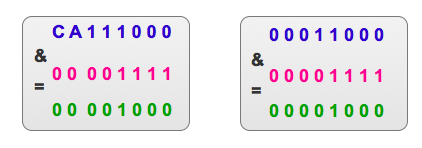

### 哈希

**Hash，一般翻译做“散列”，也有直接音译为“哈希”的，就是把任意长度的输入，通过散列算法，变换成固定长度的输出，该输出就是散列值。**这种转换是一种压缩映射，也就是，散列值的空间通常远小于输入的空间，不同的输入可能会散列成相同的输出，所以不可能从散列值来唯一的确定输入值。简单的说就是一种将任意长度的消息压缩到某一固定长度的消息摘要的函数。

所有散列函数都有如下一个基本特性：**根据同一散列函数计算出的散列值如果不同，那么输入值肯定也不同。但是，根据同一散列函数计算出的散列值如果相同，输入值不一定相同。**

**两个不同的输入值，根据同一散列函数计算出的散列值相同的现象叫做碰撞。**

常见的Hash函数有以下几个：

> 直接定址法：直接以关键字k或者k加上某个常数（k+c）作为哈希地址。
>
> 数字分析法：提取关键字中取值比较均匀的数字作为哈希地址。
>
> 除留余数法：用关键字k除以某个不大于哈希表长度m的数p，将所得余数作为哈希表地址。
>
> 分段叠加法：按照哈希表地址位数将关键字分成位数相等的几部分，其中最后一部分可以比较短。然后将这几部分相加，舍弃最高进位后的结果就是该关键字的哈希地址。
>
> 平方取中法：如果关键字各个部分分布都不均匀的话，可以先求出它的平方值，然后按照需求取中间的几位作为哈希地址。
>
> 伪随机数法：采用一个伪随机数当作哈希函数。

上面介绍过碰撞。衡量一个哈希函数的好坏的重要指标就是发生碰撞的概率以及发生碰撞的解决方案。任何哈希函数基本都无法彻底避免碰撞，常见的解决碰撞的方法有以下几种：

- 开放定址法：
  - 开放定址法就是一旦发生了冲突，就去寻找下一个空的散列地址，只要散列表足够大，空的散列地址总能找到，并将记录存入。
- 链地址法
  - 将哈希表的每个单元作为链表的头结点，所有哈希地址为i的元素构成一个同义词链表。即发生冲突时就把该关键字链在以该单元为头结点的链表的尾部。
- 再哈希法
  - 当哈希地址发生冲突用其他的函数计算另一个哈希函数地址，直到冲突不再产生为止。
- 建立公共溢出区
  - 将哈希表分为基本表和溢出表两部分，发生冲突的元素都放入溢出表中。

## 1. HashMap 的数据结构

在Java中，保存数据有两种比较简单的数据结构：数组和链表。**数组的特点是：寻址容易，插入和删除困难；而链表的特点是：寻址困难，插入和删除容易。**上面我们提到过，常用的哈希函数的冲突解决办法中有一种方法叫做链地址法，其实就是将数组和链表组合在一起，发挥了两者的优势，我们可以将其理解为链表的数组。

[](http://www.hollischuang.com/wp-content/uploads/2018/03/640.png)

我们可以从上图看到，左边很明显是个数组，数组的每个成员是一个链表。该数据结构所容纳的所有元素均包含一个指针，用于元素间的链接。我们根据元素的自身特征把元素分配到不同的链表中去，反过来我们也正是通过这些特征找到正确的链表，再从链表中找出正确的元素。其中，根据元素特征计算元素数组下标的方法就是哈希算法，即本文的主角hash()函数（当然，还包括indexOf()函数）。

### 1. 自动扩容

> 最小可用原则，容量超过一定阈值便自动进行扩容。

扩容是通过`resize()`方法实现的。扩容放生在putVal方法的最后，即写入元素之后才会判断是否需要扩容，当自增后数组的size大于之前所计算好的`threshold`，即执行`resize`操作。


扩容(resize)就是重新计算容量，向HashMap对象里不停的添加元素，而HashMap对象内部的数组无法装载更多的元素时，对象就需要扩大数组的长度，以便能装入更多的元素。当然Java里的数组是无法自动扩容的，方法是使用一个新的数组代替已有的容量小的数组，就像我们用一个小桶装水，如果想装更多的水，就得换大水桶。

我们分析下resize的源码，鉴于JDK1.8融入了红黑树，较复杂，为了便于理解使用JDK1.7的代码，好理解一些，本质上区别不大，具体区别后文再说。

```java
 1 void resize(int newCapacity) {   //传入新的容量
 2     Entry[] oldTable = table;    //引用扩容前的Entry数组
 3     int oldCapacity = oldTable.length;         
 4     if (oldCapacity == MAXIMUM_CAPACITY) {  //扩容前的数组大小如果已经达到最大(2^30)了
 5         threshold = Integer.MAX_VALUE; //修改阈值为int的最大值(2^31-1)，这样以后就不会扩容了
 6         return;
 7     }
 8  
 9     Entry[] newTable = new Entry[newCapacity];  //初始化一个新的Entry数组
10     transfer(newTable);                         //！！将数据转移到新的Entry数组里
11     table = newTable;                           //HashMap的table属性引用新的Entry数组
12     threshold = (int)(newCapacity * loadFactor);//修改阈值
13 }
```

这里就是使用一个容量更大的数组来代替已有的容量小的数组，transfer()方法将原有Entry数组的元素拷贝到新的Entry数组里。

```java
 1 void transfer(Entry[] newTable) {
 2     Entry[] src = table;                   //src引用了旧的Entry数组
 3     int newCapacity = newTable.length;
 4     for (int j = 0; j < src.length; j++) { //遍历旧的Entry数组
 5         Entry<K,V> e = src[j];             //取得旧Entry数组的每个元素
 6         if (e != null) {
 7             src[j] = null;//释放旧Entry数组的对象引用（for循环后，旧的Entry数组不再引用任何对象）
 8             do {
 9                 Entry<K,V> next = e.next;
10                 int i = indexFor(e.hash, newCapacity); //！！重新计算每个元素在数组中的位置
11                 e.next = newTable[i]; //标记[1]
12                 newTable[i] = e;      //将元素放在数组上
13                 e = next;             //访问下一个Entry链上的元素
14             } while (e != null);
15         }
16     }
17 }
```

newTable[i]的引用赋给了e.next，也就是使用了单链表的头插入方式，同一位置上新元素总会被放在链表的头部位置；这样先放在一个索引上的元素终会被放到Entry链的尾部(如果发生了hash冲突的话），这一点和Jdk1.8有区别，下文详解。在旧数组中同一条Entry链上的元素，通过重新计算索引位置后，有可能被放到了新数组的不同位置上。

下面举个例子说明下扩容过程。假设了我们的hash算法就是简单的用key mod 一下表的大小（也就是数组的长度）。其中的哈希桶数组table的size=2， 所以key = 3、7、5，put顺序依次为 5、7、3。在mod 2以后都冲突在table[1]这里了。这里假设负载因子 loadFactor=1，即当键值对的实际大小size 大于 table的实际大小时进行扩容。接下来的三个步骤是哈希桶数组 resize成4，然后所有的Node重新rehash的过程。


下面我们讲解下JDK1.8做了哪些优化。经过观测可以发现，我们使用的是2次幂的扩展(指长度扩为原来2倍)，所以，元素的位置要么是在原位置，要么是在原位置再移动2次幂的位置。看下图可以明白这句话的意思，n为table的长度，图（a）表示扩容前的key1和key2两种key确定索引位置的示例，图（b）表示扩容后key1和key2两种key确定索引位置的示例，其中hash1是key1对应的哈希与高位运算结果。


元素在重新计算hash之后，因为n变为2倍，那么n-1的mask范围在高位多1bit(红色)，因此新的index就会发生这样的变化：


因此，我们在扩充HashMap的时候，不需要像JDK1.7的实现那样重新计算hash，只需要看看原来的hash值新增的那个bit是1还是0就好了，是0的话索引没变，是1的话索引变成“原索引+oldCap”，可以看看下图为16扩充为32的resize示意图：


这个设计确实非常的巧妙，既省去了重新计算hash值的时间，而且同时，由于新增的1bit是0还是1可以认为是随机的，因此resize的过程，均匀的把之前的冲突的节点分散到新的bucket了。这一块就是JDK1.8新增的优化点。有一点注意区别，JDK1.7中rehash的时候，旧链表迁移新链表的时候，如果在新表的数组索引位置相同，则链表元素会倒置，但是从上图可以看出，JDK1.8不会倒置。

```java
 1 final Node<K,V>[] resize() {
 2     Node<K,V>[] oldTab = table;
 3     int oldCap = (oldTab == null) ? 0 : oldTab.length;
 4     int oldThr = threshold;
 5     int newCap, newThr = 0;
 6     if (oldCap > 0) {
 7         // 超过最大值就不再扩充了，就只好随你碰撞去吧
 8         if (oldCap >= MAXIMUM_CAPACITY) {
 9             threshold = Integer.MAX_VALUE;
10             return oldTab;
11         }
12         // 没超过最大值，就扩充为原来的2倍
13         else if ((newCap = oldCap << 1) < MAXIMUM_CAPACITY &&
14                  oldCap >= DEFAULT_INITIAL_CAPACITY)
15             newThr = oldThr << 1; // double threshold
16     }
17     else if (oldThr > 0) // initial capacity was placed in threshold
18         newCap = oldThr;
19     else {               // zero initial threshold signifies using defaults
20         newCap = DEFAULT_INITIAL_CAPACITY;
21         newThr = (int)(DEFAULT_LOAD_FACTOR * DEFAULT_INITIAL_CAPACITY);
22     }
23     // 计算新的resize上限
24     if (newThr == 0) {
25 
26         float ft = (float)newCap * loadFactor;
27         newThr = (newCap < MAXIMUM_CAPACITY && ft < (float)MAXIMUM_CAPACITY ?
28                   (int)ft : Integer.MAX_VALUE);
29     }
30     threshold = newThr;
31     @SuppressWarnings({"rawtypes"，"unchecked"})
32         Node<K,V>[] newTab = (Node<K,V>[])new Node[newCap];
33     table = newTab;
34     if (oldTab != null) {
35         // 把每个bucket都移动到新的buckets中
36         for (int j = 0; j < oldCap; ++j) {
37             Node<K,V> e;
38             if ((e = oldTab[j]) != null) {
39                 oldTab[j] = null;
40                 if (e.next == null)
41                     newTab[e.hash & (newCap - 1)] = e;
42                 else if (e instanceof TreeNode)
43                     ((TreeNode<K,V>)e).split(this, newTab, j, oldCap);
44                 else { // 链表优化重hash的代码块
45                     Node<K,V> loHead = null, loTail = null;
46                     Node<K,V> hiHead = null, hiTail = null;
47                     Node<K,V> next;
48                     do {
49                         next = e.next;
50                         // 原索引
51                         if ((e.hash & oldCap) == 0) {
52                             if (loTail == null)
53                                 loHead = e;
54                             else
55                                 loTail.next = e;
56                             loTail = e;
57                         }
58                         // 原索引+oldCap
59                         else {
60                             if (hiTail == null)
61                                 hiHead = e;
62                             else
63                                 hiTail.next = e;
64                             hiTail = e;
65                         }
66                     } while ((e = next) != null);
67                     // 原索引放到bucket里
68                     if (loTail != null) {
69                         loTail.next = null;
70                         newTab[j] = loHead;
71                     }
72                     // 原索引+oldCap放到bucket里
73                     if (hiTail != null) {
74                         hiTail.next = null;
75                         newTab[j + oldCap] = hiHead;
76                     }
77                 }
78             }
79         }
80     }
81     return newTab;
82 }
```

上图中的putval方法可以看出，如果table还是空的，那么扩容数组大小。

如果table的在（n-1）&hash的值是空，就新建一个节点插入在该位置，否则表示有冲突,开始处理冲突。检查第一个node是不是要找的值，否则需要遍历链表。如果冲突的节点数已经大于8个，需要将存储结构变为红黑树(treeifyBin(tab, hash));

### 2. 线程安全性

在多线程使用场景中，应该尽量避免使用线程不安全的HashMap，而使用线程安全的ConcurrentHashMap。那么为什么说HashMap是线程不安全的，下面举例子说明在并发的多线程使用场景中使用HashMap可能造成死循环。代码例子如下(便于理解，仍然使用JDK1.7的环境)：

```java
public class HashMapInfiniteLoop {  

    private static HashMap<Integer,String> map = new HashMap<Integer,String>(2，0.75f);  
    public static void main(String[] args) {  
        map.put(5， "C");  

        new Thread("Thread1") {  
            public void run() {  
                map.put(7, "B");  
                System.out.println(map);  
            };  
        }.start();  
        new Thread("Thread2") {  
            public void run() {  
                map.put(3, "A);  
                System.out.println(map);  
            };  
        }.start();        
    }  
}
```

其中，map初始化为一个长度为2的数组，loadFactor=0.75，threshold=2*0.75=1，也就是说当put第二个key的时候，map就需要进行resize。

通过设置断点让线程1和线程2同时debug到transfer方法(3.3小节代码块)的首行。注意此时两个线程已经成功添加数据。放开thread1的断点至transfer方法的“Entry next = e.next;” 这一行；然后放开线程2的的断点，让线程2进行resize。结果如下图。


注意，Thread1的 e 指向了key(3)，而next指向了key(7)，其在线程二rehash后，指向了线程二重组后的链表。

线程一被调度回来执行，先是执行 newTalbe[i] = e， 然后是e = next，导致了e指向了key(7)，而下一次循环的next = e.next导致了next指向了key(3)。


e.next = newTable[i] 导致 key(3).next 指向了 key(7)。注意：此时的key(7).next 已经指向了key(3)， 环形链表就这样出现了。


于是，当我们用线程一调用map.get(11)时，悲剧就出现了——Infinite Loop。

#### 2.1 死链

在JDK1.8之前，HashMap在并发场景下扩容时存在一个bug，形成死链，导致get该位置元素的时候，会死循环，使CPU利用率高居不下。这也说明了HashMap不适于用在高并发的场景，高并发应该优先考虑JUC中的ConcurrentHashMap。然而，精益求精的JDK开发者们并没有选择绕过问题，而是选择直面问题并解决它。在JDK1.8之中，引入了高低位链表（双端链表）。

什么是高低位链表呢？在扩容时，哈希桶数组buckets会扩容一倍，以容量为8的HashMap为例，原有容量8扩容至16，将[0, 7]称为低位，[8, 15]称为高位，低位对应loHead、loTail，高位对应hiHead、hiTail。

扩容时会依次遍历旧buckets数组的每一个位置上面的元素：

- 若不存在冲突，则重新进行hash取模，并copy到新buckets数组中的对应位置。
- 若存在冲突元素，则采用高低位链表进行处理。通过e.hash & oldCap来判断取模后是落在高位还是低位。举个例子：假设当前元素hashCode为0001（忽略高位），其运算结果等于0，说明扩容后结果不变，取模后还是落在低位[0, 7]，即0001 & 1000 = 0000，还是原位置，再用低位链表将这类的元素链接起来。假设当前元素的hashCode为1001， 其运算结果不为0，即1001 & 1000 = 1000 ，扩容后会落在高位，新的位置刚好是旧数组索引（1） + 旧数据长度（8） = 9，再用高位链表将这些元素链接起来。最后，将高低位链表的头节点分别放在扩容后数组newTab的指定位置上，即完成了扩容操作。这种实现降低了对共享资源newTab的访问频次，先组织冲突节点，最后再放入newTab的指定位置。避免了JDK1.8之前每遍历一个元素就放入newTab中，从而导致并发扩容下的死链问题。


### 3. 初始化与懒加载

> 初始化的时候只会设置默认的负载因子，并不会进行其他初始化的操作，在首次使用的时候才会进行初始化。

当new一个新的HashMap的时候，不会立即对哈希数组进行初始化，而是在首次put元素的时候，通过resize()方法进行初始化。


resize()中会设置默认的初始化容量DEFAULT_INITIAL_CAPACITY为16，扩容的阈值为0.75*16 = 12，即哈希桶数组中元素达到12个便进行扩容操作。

最后创建容量为16的Node数组，并赋值给成员变量哈希桶table，即完成了HashMap的初始化操作。


### 4 确定哈希桶数组大小

> 找到大于等于给定值的最小2的整数次幂。

tableSizeFor根据输入容量大小cap来计算最终哈希桶数组的容量大小，找到大于等于给定值cap的最小2的整数次幂。乍眼一看，这一行一行的位运算让人云里雾里，莫不如采用类似找规律的方式来探索其中的奥秘。


当cap为3时，计算过程如下：

```java
cap = 3
n = 2
n |= n >>> 1       010  | 001 = 011   n = 3
n |= n >>> 2       011  | 000 = 011   n = 3
n |= n >>> 4       011  | 000 = 011   n = 3
….
n = n + 1 = 4
```

当cap为5时，计算过程如下：

```java
cap = 5
n = 4
n |= n >>> 1    0100 | 0010 = 0110  n = 6
n |= n >>> 2    0110 | 0001 = 0111  n = 7
….
n = n + 1 = 8
```

因此，计算的意义在于找到大于等于cap的最小2的整数次幂。整个过程是找到cap对应二进制中最高位的1，然后每次以2倍的步长（依次移位1、2、4、8、16）复制最高位1到后面的所有低位，把最高位1后面的所有位全部置为1，最后进行+1，即完成了进位。

类似二进制位的变化过程如下：

```java
0100 1010
0111 1111
1000 0000
```

找到输入cap的最小2的整数次幂作为最终容量可以理解为最小可用原则，尽可能地少占用空间，但是为什么必须要2的整数次幂呢？答案是，为了提高计算与存储效率，使每个元素对应hash值能够准确落入哈希桶数组给定的范围区间内。确定数组下标采用的算法是 hash & (n - 1)，n即为哈希桶数组的大小。由于其总是2的整数次幂，这意味着n-1的二进制形式永远都是0000111111的形式，即从最低位开始，连续出现多个1，该二进制与任何值进行&运算都会使该值映射到指定区间[0, n-1]。比如：当n=8时，n-1对应的二进制为0111，任何与0111进行&运算都会落入[0,7]的范围内，即落入给定的8个哈希桶中，存储空间利用率100%。举个反例，当n=7，n-1对应的二进制为0110，任何与0110进行&运算会落入到第0、6、4、2个哈希桶，而不是[0,6]的区间范围内，少了1、3、5三个哈希桶，这导致存储空间利用率只有不到60%，同时也增加了哈希碰撞的几率。

## 2. ConcurrentHashMap并发


### 1 ASHIFT偏移量计算

> 获取给定值的最高有效位数（移位除了能够进行乘除运算，还能用于保留高、低位操作，右移保留高位，左移保留低位）。

ConcurrentHashMap中的ABASE+ASHIFT是用来计算哈希数组中某个元素在实际内存中的初始位置，ASHIFT采取的计算方式是31与scale前导0的数量做差，也就是scale的实际位数-1。scale就是哈希桶数组Node[]中每个元素的大小，通过((long)i << ASHIFT) + ABASE)进行计算，便可得到数组中第i个元素的起始内存地址。


我们继续看下前导0的数量是怎么计算出来的，numberOfLeadingZeros是Integer的静态方法，还是沿用找规律的方式一探究竟。


假设 i = 0000 0000 0000 0100 0000 0000 0000 0000，n = 1

```java
i >>> 16  0000 0000 0000 0000 0000 0000 0000 0100   不为0

i >>> 24  0000 0000 0000 0000 0000 0000 0000 0000   等于0
```

右移了24位等于0，说明24位到31位之间肯定全为0，即n = 1 + 8 = 9，由于高8位全为0，并且已经将信息记录至n中，因此可以舍弃高8位，即 i <<= 8。此时，

```java
i = 0000 0100 0000 0000 0000 0000 0000 0000
```

类似地，i >>> 28 也等于0，说明28位到31位全为0，n = 9 + 4 = 13，舍弃高4位。此时，

```java
i = 0100 0000 0000 0000 0000 0000 0000 0000
```

继续运算，

```java
i >>> 30  0000 0000 0000 0000 0000 0000 0000 0001   不为0
i >>> 31  0000 0000 0000 0000 0000 0000 0000 0000   等于0
```

最终可得出n = 13，即有13个前导0。n -= i >>> 31是检查最高位31位是否是1，因为n初始化为1，如果最高位是1，则不存在前置0，即n = n - 1 = 0。

总结一下，以上的操作其实是基于二分法的思想来定位二进制中1的最高位，先看高16位，若为0，说明1存在于低16位；反之存在高16位。由此将搜索范围由32位（确切的说是31位）减少至16位，进而再一分为二，校验高8位与低8位，以此类推。

计算过程中校验的位数依次为16、8、4、2、1，加起来刚好为31。为什么是31不是32呢？因为前置0的数量为32的情况下i只能为0，在前面的if条件中已经进行过滤。这样一来，非0值的情况下，前置0只能出现在高31位，因此只需要校验高31位即可。最终，用总位数减去计算出来的前导0的数量，即可得出二进制的最高有效位数。代码中使用的是31 - Integer.numberOfLeadingZeros(scale)，而不是总位数32，这是为了能够得到哈希桶数组中第i个元素的起始内存地址，方便进行CAS等操作。

### 分段锁

针对HashTable中锁粒度过粗的问题，在JDK1.8之前，ConcurrentHashMap引入了分段锁机制。整体的存储结构如下图所示，在原有结构的基础上拆分出多个segment，每个segment下再挂载原来的entry（上文中经常提到的哈希桶数组），每次操作只需要锁定元素所在的segment，不需要锁定整个表。因此，锁定的范围更小，并发度也会得到提升。


### 2 乐观锁

### Synchronized+CAS

虽然引入了分段锁的机制，即可以保证线程安全，又可以解决锁粒度过粗导致的性能低下问题，但是对于追求极致性能的工程师来说，这还不是性能的天花板。因此，在JDK1.8中，ConcurrentHashMap摒弃了分段锁，使用了乐观锁的实现方式。放弃分段锁的原因主要有以下几点：

- 使用segment之后，会增加ConcurrentHashMap的存储空间。
- 当单个segment过大时，并发性能会急剧下降。

ConcurrentHashMap在JDK1.8中的实现废弃了之前的segment结构，沿用了与HashMap中的类似的Node数组结构。


ConcurrentHashMap中的乐观锁是采用synchronized+CAS进行实现的。这里主要看下put的相关代码。

当put的元素在哈希桶数组中不存在时，则直接CAS进行写操作。


这里涉及到了两个重要的操作，tabAt与casTabAt。可以看出，这里面都使用了Unsafe类的方法。Unsafe这个类在日常的开发过程中比较罕见。我们通常对Java语言的认知是：Java语言是安全的，所有操作都基于JVM，在安全可控的范围内进行。然而，Unsafe这个类会打破这个边界，使Java拥有C的能力，可以操作任意内存地址，是一把双刃剑。这里使用到了前文中所提到的ASHIFT，来计算出指定元素的起始内存地址，再通过getObjectVolatile与compareAndSwapObject分别进行取值与CAS操作。

在获取哈希桶数组中指定位置的元素时为什么不能直接get而是要使用getObjectVolatile呢？因为在JVM的内存模型中，每个线程有自己的工作内存，也就是栈中的局部变量表，它是主存的一份copy。因此，线程1对某个共享资源进行了更新操作，并写入到主存，而线程2的工作内存之中可能还是旧值，脏数据便产生了。Java中的volatile是用来解决上述问题，保证可见性，任意线程对volatile关键字修饰的变量进行更新时，会使其它线程中该变量的副本失效，需要从主存中获取最新值。虽然ConcurrentHashMap中的Node数组是由volatile修饰的，可以保证可见性，但是Node数组中元素是不具备可见性的。因此，在获取数据时通过Unsafe的方法直接到主存中拿，保证获取的数据是最新的。


继续往下看put方法的逻辑，当put的元素在哈希桶数组中存在，并且不处于扩容状态时，则使用synchronized锁定哈希桶数组中第i个位置中的第一个元素f（头节点2），接着进行double check，类似于DCL单例模式的思想。校验通过后，会遍历当前冲突链上的元素，并选择合适的位置进行put操作。此外，ConcurrentHashMap也沿用了HashMap中解决哈希冲突的方案，链表+红黑树。这里只有在发生哈希冲突的情况下才使用synchronized锁定头节点，其实是比分段锁更细粒度的锁实现，只在特定场景下锁定其中一个哈希桶，降低锁的影响范围。


Java Map针对并发场景解决方案的演进方向可以归结为，从悲观锁到乐观锁，从粗粒度锁到细粒度锁，这也可以作为我们在日常并发编程中的指导方针。

### 3 并发求和

CounterCell是JDK1.8中引入用来并发求和的利器，而在这之前采用的是【尝试无锁求和】+【冲突时加锁重试】的策略。看下CounterCell的注释，它是改编自LongAdder和Striped64。我们先看下求和操作，其实就是取baseCount作为初始值，然后遍历CounterCell数组中的每一个cell，将各个cell的值进行累加。这里额外说明下@sun.misc.Contender注解的作用，它是Java8中引入用来解决缓存行伪共享问题的。什么是伪共享呢？简单说下，考虑到CPU与主存之间速度的巨大差异，在CPU中引入了L1、L2、L3多级缓存，缓存中的存储单位是缓存行，缓存行大小为2的整数次幂字节，32-256个字节不等，最常见的是64字节。因此，这将导致不足64字节的变量会共享同一个缓存行，其中一个变量失效会影响到同一个缓存行中的其他变量，致使性能下降，这就是伪共享问题。考虑到不同CPU的缓存行单位的差异性，Java8中便通过该注解将这种差异性屏蔽，根据实际缓存行大小来进行填充，使被修饰的变量能够独占一个缓存行。


再来看下CounterCell是如何实现计数的，每当map中的容量有变化时会调用addCount进行计数，核心逻辑如下：

- 当counterCells不为空，或counterCells为空且对baseCount进行CAS操作失败时进入到后续计数处理逻辑，否则对baseCount进行CAS操作成功，直接返回。
- 后续计数处理逻辑中会调用核心计数方法fullAddCount，但需要满足以下4个条件中的任意一个：1、counterCells为空；2、counterCells的size为0；3、counterCells对应位置上的counterCell为空；4、CAS更新counterCells对应位置上的counterCell失败。这些条件背后的语义是，当前情况下，计数已经或曾经出现过并发冲突，需要优先借助于CounterCell来解决。若counterCells与对应位置上的元素已经初始化（条件4），则先尝试CAS进行更新，若失败则调用fullAddCount继续处理。若counterCells与对应位置上的元素未初始化完成（条件1、2、3），也要调用AddCount进行后续处理。
- 这里确定cell下标时采用了ThreadLocalRandom.getProbe()作为哈希值，这个方法返回的是当前Thread中threadLocalRandomProbe字段的值。而且当哈希值冲突时，还可以通过advanceProbe方法来更换哈希值。这与HashMap中的哈希值计算逻辑不同，因为HashMap中要保证同一个key进行多次哈希计算的哈希值相同并且能定位到对应的value，即便两个key的哈希值冲突也不能随便更换哈希值，只能采用链表或红黑树处理冲突。然而在计数场景，我们并不需要维护key-value的关系，只需要在counterCells中找到一个合适的位置放入计数cell，位置的差异对最终的求和结果是没有影响的，因此当冲突时可以基于随机策略更换一个哈希值来避免冲突。


接着，我们来看下核心计算逻辑fullAddCount，代码还是比较多的，核心流程是通过一个死循环来实现的，循环体中包含了3个处理分支，为了方便讲解我将它们依次定义A、B、C。

- A：表示counterCells已经初始化完成，因此可以尝试更新或创建对应位置的CounterCell。
- B：表示counterCells未初始化完成，且无冲突（拿到cellsBusy锁），则加锁初始化counterCells，初始容量为2。
- C：表示counterCells未初始化完成，且有冲突（未能拿到cellsBusy锁），则CAS更新baseCount，baseCount在求和时也会被算入到最终结果中，这也相当于是一种兜底策略，既然counterCells正在被其他线程锁定，那当前线程也没必要再等待了，直接尝试使用baseCount进行累加。

其中，A分支中涉及到的操作又可以拆分为以下几点：

- a1：对应位置的CounterCell未创建，采用锁+Double Check的策略尝试创建CounterCell，失败的话则continue进行重试。这里面采用的锁是cellsBusy，它保证创建CounterCell并放入counterCells时一定是串行执行，避免重复创建，其实就是使用了DCL单例模式的策略。在CounterCells的创建、扩容中都需要使用该锁。

- a2：冲突检测，变量wasUncontended是调用方addCount中传入的，表示前置的CAS更新cell失败，有冲突，需要更换哈希值【a7】后继续重试。

- a3：对应位置的CounterCell不为空，直接CAS进行更新。

- a4：

- - 冲突检测，当counterCells的引用值不等于当前线程对应的引用值时，说明有其他线程更改了counterCells的引用，出现冲突，则将collide设为false，下次迭代时可进行扩容。
  - 容量限制，counterCells容量的最大值为大于等于NCPU（实际机器CPU核心的数量）的最小2的整数次幂，当达到容量限制时后面的扩容分支便永远不会执行。这里限制的意义在于，真实并发度是由CPU核心来决定，当counterCells容量与CPU核心数量相等时，理想情况下就算所有CPU核心在同时运行不同的计数线程时，都不应该出现冲突，每个线程选择各自的cell进行处理即可。如果出现冲突，一定是哈希值的问题，因此采取的措施是重新计算哈希值a7，而不是通过扩容来解决。时间换空间，避免不必要的存储空间浪费，非常赞的想法~


- a5：更新扩容标志位，下次迭代时将会进行扩容。
- a6：进行加锁扩容，每次扩容1倍。
- a7：更换哈希值。

```java
private final void fullAddCount(long x, boolean wasUncontended) {
        int h;
        // 初始化probe
        if ((h = ThreadLocalRandom.getProbe()) == 0) {
            ThreadLocalRandom.localInit();      // force initialization
            h = ThreadLocalRandom.getProbe();
            wasUncontended = true;
        }
        // 用来控制扩容操作
        boolean collide = false;                // True if last slot nonempty
        for (;;) {
            CounterCell[] as; CounterCell a; int n; long v;
            // 【A】counterCells已经初始化完毕
            if ((as = counterCells) != null && (n = as.length) > 0) {
                // 【a1】对应位置的CounterCell未创建
                if ((a = as[(n - 1) & h]) == null) {
                    // cellsBusy其实是一个锁，cellsBusy=0时表示无冲突
                    if (cellsBusy == 0) {            // Try to attach new Cell
                        // 创建新的CounterCell
                        CounterCell r = new CounterCell(x); // Optimistic create
                        // Double Check，加锁（通过CAS将cellsBusy设置1）
                        if (cellsBusy == 0 &&
                            U.compareAndSwapInt(this, CELLSBUSY, 0, 1)) {
                            boolean created = false;
                            try {               // Recheck under lock
                                CounterCell[] rs; int m, j;
                                // Double Check
                                if ((rs = counterCells) != null &&
                                    (m = rs.length) > 0 &&
                                    rs[j = (m - 1) & h] == null) {
                                    // 将新创建的CounterCell放入counterCells中
                                    rs[j] = r;
                                    created = true;
                                }
                            } finally {
                                // 解锁，这里为什么不用CAS？因为当前流程中需要在获取锁的前提下进行，即串行执行，因此不存在并发更新问题，只需要正常更新即可
                                cellsBusy = 0;
                            }
                            if (created)
                                break;
                            // 创建失败则重试
                            continue;           // Slot is now non-empty
                        }
                    }
                    // cellsBusy不为0，说明被其他线程争抢到了锁，还不能考虑扩容
                    collide = false;
                }
                //【a2】冲突检测
                else if (!wasUncontended)       // CAS already known to fail
                    // 调用方addCount中CAS更新cell失败，有冲突，则继续尝试CAS
                    wasUncontended = true;      // Continue after rehash

                //【a3】对应位置的CounterCell不为空，直接CAS进行更新
                else if (U.compareAndSwapLong(a, CELLVALUE, v = a.value, v + x))
                    break;
                //【a4】容量限制
                else if (counterCells != as || n >= NCPU)
                    // 说明counterCells容量的最大值为大于NCPU（实际机器CPU核心的数量）最小2的整数次幂。
                    // 这里限制的意义在于，并发度是由CPU核心来决定，当counterCells容量与CPU核心数量相等时，理论上讲就算所有CPU核心都在同时运行不同的计数线程时，都不应该出现冲突，每个线程选择各自的cell进行处理即可。如果出现冲突，一定是哈希值的问题，因此采取的措施是重新计算哈希值（h = ThreadLocalRandom.advanceProbe(h)），而不是通过扩容来解决

                    // 当n大于NCPU时后面的分支就不会走到了
                    collide = false;            // At max size or stale
                // 【a5】更新扩容标志位
                else if (!collide)
                    // 说明映射到cell位置不为空，并且尝试进行CAS更新时失败了，则说明有竞争，将collide设置为true，下次迭代时执行后面的扩容操作，降低竞争度
                    // 有竞争时，执行rehash+扩容，当容量大于CPU核心时则停止扩容只进行rehash
                    collide = true;
                // 【a6】加锁扩容
                else if (cellsBusy == 0 &&
                         U.compareAndSwapInt(this, CELLSBUSY, 0, 1)) {
                    // 加锁扩容
                    try {
                        if (counterCells == as) {// Expand table unless stale
                            // 扩容1倍
                            CounterCell[] rs = new CounterCell[n << 1];
                            for (int i = 0; i < n; ++i)
                                rs[i] = as[i];
                            counterCells = rs;
                        }
                    } finally {
                        cellsBusy = 0;
                    }
                    collide = false;
                    continue;                   // Retry with expanded table
                }
                //【a7】更换哈希值
                h = ThreadLocalRandom.advanceProbe(h);
            }
            // 【B】counterCells未初始化完成，且无冲突，则加锁初始化counterCells
            else if (cellsBusy == 0 && counterCells == as &&
                     U.compareAndSwapInt(this, CELLSBUSY, 0, 1)) {
                boolean init = false;
                try {                           // Initialize table
                    if (counterCells == as) {
                        CounterCell[] rs = new CounterCell[2];
                        rs[h & 1] = new CounterCell(x);
                        counterCells = rs;
                        init = true;
                    }
                } finally {
                    cellsBusy = 0;
                }
                if (init)
                    break;
            }
            // 【C】counterCells未初始化完成，且有冲突，则CAS更新baseCount
            else if (U.compareAndSwapLong(this, BASECOUNT, v = baseCount, v + x))
                break;                          // Fall back on using base
        }
```

CounterCell的设计很巧妙，它的背后其实就是JDK1.8中的LongAdder。核心思想是：在并发较低的场景下直接采用baseCount累加，否则结合counterCells，将不同的线程散列到不同的cell中进行计算，尽可能地确保访问资源的隔离，减少冲突。LongAdder相比较于AtomicLong中无脑CAS的策略，在高并发的场景下，能够减少CAS重试的次数，提高计算效率。


## 2. hash方法

我们拿JDK 1.7的HashMap为例，其中定义了一个final int hash(Object k) 方法，其主要被以下方法引用。

[](http://www.hollischuang.com/wp-content/uploads/2018/03/hash-use.png)

上面的方法主要都是增加和删除方法，这不难理解，当我们要对一个链表数组中的某个元素进行增删的时候，首先要知道他应该保存在这个链表数组中的哪个位置，即他在这个数组中的下标。而hash()方法的功能就是根据Key来定位其在HashMap中的位置。HashTable、ConcurrentHashMap同理。

首先，在同一个版本的Jdk中，HashMap、HashTable以及ConcurrentHashMap里面的hash方法的实现是不同的。再不同的版本的JDK中（Java7 和 Java8）中也是有区别的。我会尽量全部介绍到。相信，看文这篇文章，你会彻底理解hash方法。

在上代码之前，我们先来做个简单分析。我们知道，hash方法的功能是根据Key来定位这个K-V在链表数组中的位置的。也就是hash方法的输入应该是个Object类型的Key，输出应该是个int类型的数组下标。如果让你设计这个方法，你会怎么做？

其实简单，我们只要调用Object对象的hashCode()方法，该方法会返回一个整数，然后用这个数对HashMap或者HashTable的容量进行取模就行了。没错，其实基本原理就是这个，只不过，在具体实现上，由两个方法`int hash(Object k)`和`int indexFor(int h, int length)`来实现。但是考虑到效率等问题，HashMap的实现会稍微复杂一点。

> hash ：该方法主要是将Object转换成一个整型。
>
> indexFor ：该方法主要是将hash生成的整型转换成链表数组中的下标。

#### HashMap In Java 7

```java
final int hash(Object k) {
    int h = hashSeed;
    if (0 != h && k instanceof String) {
        return sun.misc.Hashing.stringHash32((String) k);
    }
    h ^= k.hashCode();
    h ^= (h >>> 20) ^ (h >>> 12);
    return h ^ (h >>> 7) ^ (h >>> 4);
}

static int indexFor(int h, int length) {
    return h & (length-1);
}
```

前面我说过，`indexFor`方法其实主要是将hash生成的整型转换成链表数组中的下标。那么`return h & (length-1);`是什么意思呢？其实，他就是取模。Java之所有使用位运算(&)来代替取模运算(%)，最主要的考虑就是效率。**位运算(&)效率要比代替取模运算(%)高很多，主要原因是位运算直接对内存数据进行操作，不需要转成十进制，因此处理速度非常快。**

那么，为什么可以使用位运算(&)来实现取模运算(%)呢？这实现的原理如下：

> X % 2^n = X & (2^n – 1)
>
> 2^n表示2的n次方，也就是说，一个数对2^n取模 == 一个数和(2^n – 1)做按位与运算 。
>
> 假设n为3，则2^3 = 8，表示成2进制就是1000。2^3 = 7 ，即0111。
>
> 此时X & (2^3 – 1) 就相当于取X的2进制的最后三位数。
>
> 从2进制角度来看，X / 8相当于 X >> 3，即把X右移3位，此时得到了X / 8的商，而被移掉的部分(后三位)，则是X % 8，也就是余数。

上面的解释不知道你有没有看懂，没看懂的话其实也没关系，你只需要记住这个技巧就可以了。或者你可以找几个例子试一下。

> 6 % 8 = 6 ，6 & 7 = 6
>
> 10 & 8 = 2 ，10 & 7 = 2

[](http://www.hollischuang.com/wp-content/uploads/2018/03/640-1.png)

所以，`return h & (length-1);`只要保证length的长度是`2^n`的话，就可以实现取模运算了。而HashMap中的length也确实是2的倍数，初始值是16，之后每次扩充为原来的2倍。

分析完`indexFor`方法后，我们接下来准备分析`hash`方法的具体原理和实现。在深入分析之前，至此，先做个总结。

HashMap的数据是存储在链表数组里面的。在对HashMap进行插入/删除等操作时，都需要根据K-V对的键值定位到他应该保存在数组的哪个下标中。而这个通过键值求取下标的操作就叫做哈希。HashMap的数组是有长度的，Java中规定这个长度只能是2的倍数，初始值为16。简单的做法是先求取出键值的hashcode，然后在将hashcode得到的int值对数组长度进行取模。为了考虑性能，Java总采用按位与操作实现取模操作。

接下来我们会发现，无论是用取模运算还是位运算都无法直接解决冲突较大的问题。比如：`CA11 0000`和`0001 0000`在对`0000 1111`进行按位与运算后的值是相等的。[](http://www.hollischuang.com/wp-content/uploads/2018/03/640-2.png)

两个不同的键值，在对数组长度进行按位与运算后得到的结果相同，这不就发生了冲突吗。那么如何解决这种冲突呢，来看下Java是如何做的。

其中的主要代码部分如下：

```java
h ^= k.hashCode();
h ^= (h >>> 20) ^ (h >>> 12);
return h ^ (h >>> 7) ^ (h >>> 4);
```

这段代码是为了对key的hashCode进行扰动计算，防止不同hashCode的高位不同但低位相同导致的hash冲突。简单点说，就是为了把高位的特征和低位的特征组合起来，降低哈希冲突的概率，也就是说，尽量做到任何一位的变化都能对最终得到的结果产生影响。

举个例子来说，我们现在想向一个HashMap中put一个K-V对，Key的值为“hollischuang”，经过简单的获取hashcode后，得到的值为“1011000110101110011111010011011”，如果当前HashTable的大小为16，即在不进行扰动计算的情况下，他最终得到的index结果值为11。由于15的二进制扩展到32位为“00000000000000000000000000001111”，所以，一个数字在和他进行按位与操作的时候，前28位无论是什么，计算结果都一样（因为0和任何数做与，结果都为0）。如下图所示。

[](http://www.hollischuang.com/wp-content/uploads/2018/03/640-3.png)

可以看到，后面的两个hashcode经过位运算之后得到的值也是11 ，虽然我们不知道哪个key的hashcode是上面例子中的那两个，但是肯定存在这样的key，这就产生了冲突。

那么，接下来，我看看一下经过扰动的算法最终的计算结果会如何。

[](http://www.hollischuang.com/wp-content/uploads/2018/03/640-4.png)

从上面图中可以看到，之前会产生冲突的两个hashcode，经过扰动计算之后，最终得到的index的值不一样了，这就很好的避免了冲突。

> 其实，使用位运算代替取模运算，除了性能之外，还有一个好处就是可以很好的解决负数的问题。因为我们知道，hashcode的结果是int类型，而int的取值范围是-2^31 ~ 2^31 – 1，即[ -2147483648, 2147483647]；这里面是包含负数的，我们知道，对于一个负数取模还是有些麻烦的。如果使用二进制的位运算的话就可以很好的避免这个问题。首先，不管hashcode的值是正数还是负数。length-1这个值一定是个正数。那么，他的二进制的第一位一定是0（有符号数用最高位作为符号位，“0”代表“+”，“1”代表“-”），这样里两个数做按位与运算之后，第一位一定是个0，也就是，得到的结果一定是个正数。

### 3.HashTable In Java 7

上面是Java 7中HashMap的`hash`方法以及`indexOf`方法的实现，那么接下来我们要看下，线程安全的HashTable是如何实现的，和HashMap有何不同，并试着分析下不同的原因。以下是Java 7中HashTable的hash方法的实现。

```java
private int hash(Object k) {
    // hashSeed will be zero if alternative hashing is disabled.
    return hashSeed ^ k.hashCode();
}
```

我们可以发现，很简单，相当于只是对k做了个简单的hash，取了一下其hashCode。而HashTable中也没有`indexOf`方法，取而代之的是这段代码：`int index = (hash & 0x7FFFFFFF) % tab.length;`。也就是说，HashMap和HashTable对于计算数组下标这件事，采用了两种方法。HashMap采用的是位运算，而HashTable采用的是直接取模。

> 为啥要把hash值和0x7FFFFFFF做一次按位与操作呢，主要是为了保证得到的index的第一位为0，也就是为了得到一个正数。因为有符号数第一位0代表正数，1代表负数。

我们前面说过，HashMap之所以不用取模的原因是为了提高效率。有人认为，因为HashTable是个线程安全的类，本来就慢，所以Java并没有考虑效率问题，就直接使用取模算法了呢？但是其实并不完全是，Java这样设计还是有一定的考虑在的，虽然这样效率确实是会比HashMap慢一些。

其实，HashTable采用简单的取模是有一定的考虑在的。这就要涉及到HashTable的构造函数和扩容函数了。由于篇幅有限，这里就不贴代码了，直接给出结论：

> HashTable默认的初始大小为11，之后每次扩充为原来的2n+1。
>
> 也就是说，HashTable的链表数组的默认大小是一个素数、奇数。之后的每次扩充结果也都是奇数。
>
> 由于HashTable会尽量使用素数、奇数作为容量的大小。当哈希表的大小为素数时，简单的取模哈希的结果会更加均匀。（这个是可以证明出来的，由于不是本文重点，暂不详细介绍，可参考：http://zhaox.github.io/algorithm/2015/06/29/hash）

至此，我们看完了Java 7中HashMap和HashTable中对于hash的实现，我们来做个简单的总结。

- HashMap默认的初始化大小为16，之后每次扩充为原来的2倍。
- HashTable默认的初始大小为11，之后每次扩充为原来的2n+1。
- 当哈希表的大小为素数时，简单的取模哈希的结果会更加均匀，所以单从这一点上看，HashTable的哈希表大小选择，似乎更高明些。因为hash结果越分散效果越好。
- 在取模计算时，如果模数是2的幂，那么我们可以直接使用位运算来得到结果，效率要大大高于做除法。所以从hash计算的效率上，又是HashMap更胜一筹。
- 但是，HashMap为了提高效率使用位运算代替哈希，这又引入了哈希分布不均匀的问题，所以HashMap为解决这问题，又对hash算法做了一些改进，进行了扰动计算。

### 4.ConcurrentHashMap In Java 7

```java
private int hash(Object k) {
    int h = hashSeed;

    if ((0 != h) && (k instanceof String)) {
        return sun.misc.Hashing.stringHash32((String) k);
    }

    h ^= k.hashCode();
    // Spread bits to regularize both segment and index locations,
    // using variant of single-word Wang/Jenkins hash.
    h += (h <<  15) ^ 0xffffcd7d;

    h ^= (h >>> 10);

    h += (h <<   3);
    h ^= (h >>>  6);
    h += (h <<   2) + (h << 14);
    return h ^ (h >>> 16);
}
int j = (hash >>> segmentShift) & segmentMask;
```

上面这段关于ConcurrentHashMap的hash实现其实和HashMap如出一辙。都是通过位运算代替取模，然后再对hashcode进行扰动。区别在于，ConcurrentHashMap 使用了一种变种的Wang/Jenkins 哈希算法，其主要母的也是为了把高位和低位组合在一起，避免发生冲突。至于为啥不和HashMap采用同样的算法进行扰动，我猜这只是程序员自由意志的选择吧。至少我目前没有办法证明哪个更优。

### 5.HashMap In Java 8

在Java 8 之前，HashMap和其他基于map的类都是通过链地址法解决冲突，它们使用单向链表来存储相同索引值的元素。在最坏的情况下，这种方式会将HashMap的get方法的性能从`O(1)`降低到`O(n)`。为了解决在频繁冲突时hashmap性能降低的问题，Java 8中使用平衡树来替代链表存储冲突的元素。这意味着我们可以将最坏情况下的性能从`O(n)`提高到`O(logn)`。关于HashMap在Java 8中的优化，我后面会有文章继续深入介绍。

如果恶意程序知道我们用的是Hash算法，则在纯链表情况下，它能够发送大量请求导致哈希碰撞，然后不停访问这些key导致HashMap忙于进行线性查找，最终陷入瘫痪，即形成了拒绝服务攻击（DoS）。

关于Java 8中的hash函数，原理和Java 7中基本类似。Java 8中这一步做了优化，只做一次16位右位移异或混合，而不是四次，但原理是不变的。

```java
static final int hash(Object key) {
    int h;
    return (key == null) ? 0 : (h = key.hashCode()) ^ (h >>> 16);
}
```

在JDK1.8的实现中，优化了高位运算的算法，通过hashCode()的高16位异或低16位实现的：(h = k.hashCode()) ^ (h >>> 16)，主要是从速度、功效、质量来考虑的。以上方法得到的int的hash值，然后再通过`h & (table.length -1)`来得到该对象在数据中保存的位置。

HashTable In Java 8

在Java 8的HashTable中，已经不在有hash方法了。但是哈希的操作还是在的，比如在put方法中就有如下实现：

```java
    int hash = key.hashCode();
    int index = (hash & 0x7FFFFFFF) % tab.length;
```

这其实和Java 7中的实现几乎无差别，就不做过多的介绍了。

### 6.ConcurrentHashMap In Java 8

Java 8 里面的求hash的方法从hash改为了spread。实现方式如下：

```java
static final int spread(int h) {

    return (h ^ (h >>> 16)) & HASH_BITS;

}
```

Java 8的ConcurrentHashMap同样是通过Key的哈希值与数组长度取模确定该Key在数组中的索引。同样为了避免不太好的Key的hashCode设计，它通过如下方法计算得到Key的最终哈希值。不同的是，Java 8的ConcurrentHashMap作者认为引入红黑树后，即使哈希冲突比较严重，寻址效率也足够高，所以作者并未在哈希值的计算上做过多设计，只是将Key的hashCode值与其高16位作异或并保证最高位为0（从而保证最终结果为正整数）。