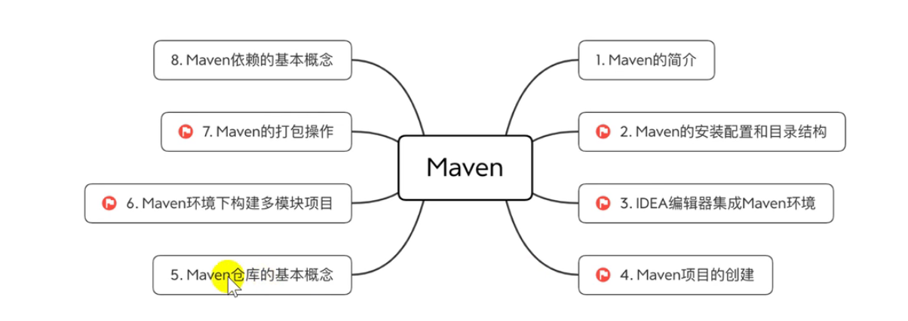
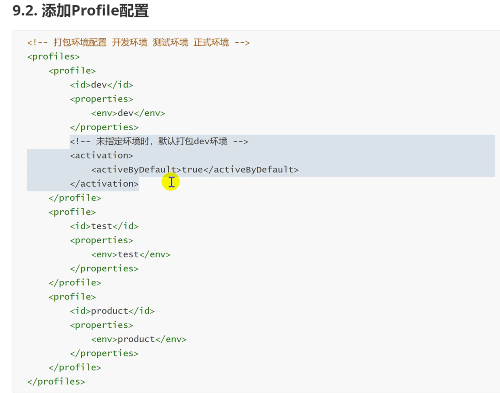
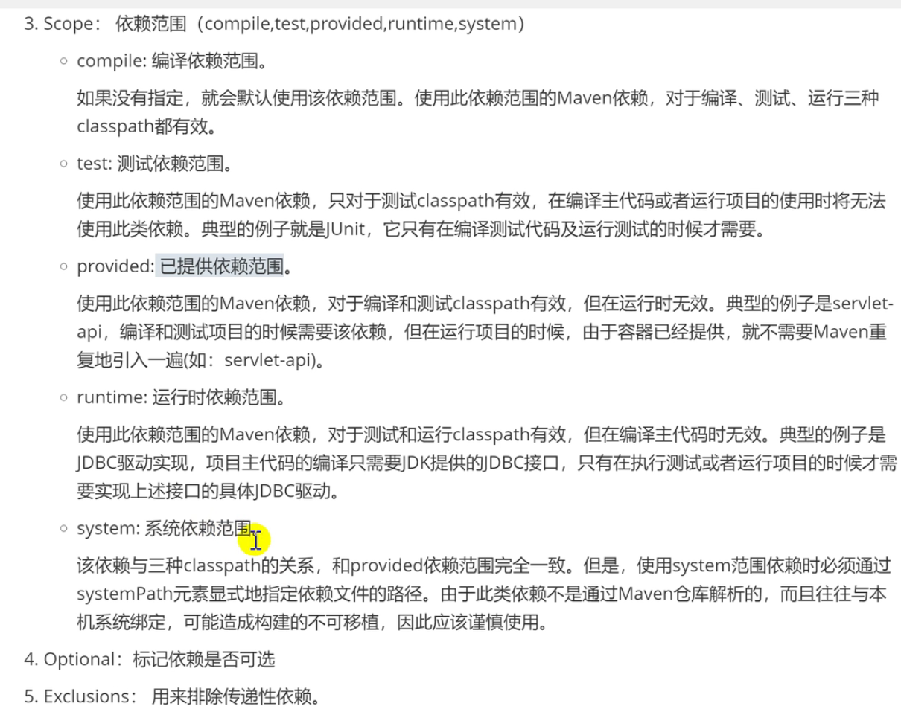
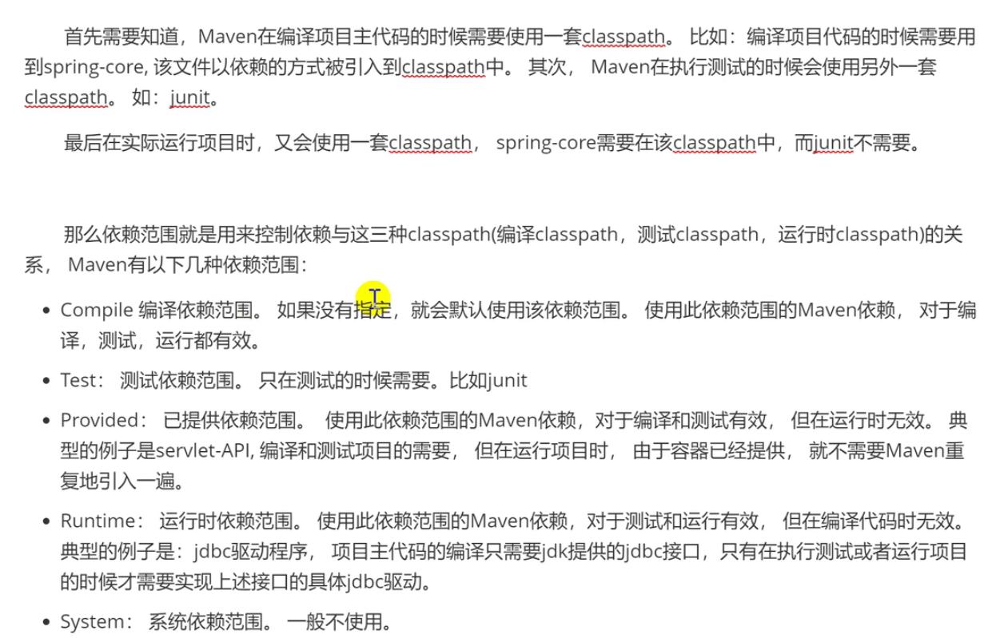

## 1.打包问题

项目结构如下：

parent（父类工程）

| - - - - - common（通用工具类子工程）

| - - - - - projectA（springboot子工程，依赖common工程）

pom.xml

问题描述：

通过parent父工程进行Maven install，parent父工程和common子工程打包成功，projectA子工程打包失败并报错

[ERROR] Failed to execute goal org.apache.maven.plugins:maven-compiler-plugin:3.1:compile (default-compile) on project projectA: Compilation failure
[ERROR] /xxxx.java:[14,36] 程序包com.xxx.xxx.utils不存在

解决办法：

在common子工程下的pom.xml，添加以下配置

```xml
    <build>
        <plugins>
            <plugin>
                <groupId>org.springframework.boot</groupId>
                <artifactId>spring-boot-maven-plugin</artifactId>
                <configuration>
                    <classifier>exec</classifier>
                </configuration>
            </plugin>
        </plugins>
    </build>
```

原因分析：

common也是SpringBoot工程，SpringBoot工程打包编译时，会生成两种jar包，一种是普通的jar，另一种是可执行jar。

默认情况下，这两种jar的名称相同，在不做配置的情况下，普通的jar先生成，可执行jar后生成，造成可执行jar会覆盖普通的jar。而projectA工程无法依赖common工程的可执行jar，所以编译失败：程序包xxx不存在。

# 2.本地仓库配置

1.去maven官网下载maven的二进制文件


 

2.下载完后，把它解压至任意文件路径，这里我放到C盘

3.配置MAVEN_HOME环境变量。


 

4.在window10环境变量path中添加%MAVEN_HOME%\bin


 

5.在window命令行窗口里面执行maven命令 mvn -v，查看maven是否安装成功，环境变量是否设置成功。

[](javascript:void(0);)

C:\Users\Administrator>mvn -v
Apache Maven 3.6.3 (cecedd343002696d0abb50b32b541b8a6ba2883f)
Maven home: C:\Program Files\apache-maven-3.6.3\bin\..
Java version: 1.8.0_221, vendor: Oracle Corporation, runtime: C:\Program Files\Java\jdk1.8.0_221\jre
Default locale: en_US, platform encoding: GBK
OS name: "windows 10", version: "10.0", arch: "amd64", family: "windows"

[](javascript:void(0);)


 

6.maven的repository默认是在C:\Users\用户名.m2，这里我设置自己喜欢的路径（以下为可选步骤）

*C:\Program Files\apache-maven-3.6.3\maven-repository*


 

7.在maven安装路径里面找到conf这个文件夹，找到settings.xml文件.

在settings.xml找到localRepository,并更改为我们自己的maven repository路径. localRepository默认是注释掉的。

*<localRepository>C:\Program Files\apache-maven-3.6.3\maven-repository</localRepository>*


 

8.在dos执行以下maven命令，如果local repository设置成功，local repository里面会生成一些东西。

```
mvn help:system
```

 

idea配置maven并更改maven的中央仓库为阿里云

https://www.cnblogs.com/majestyking/p/12329535.html

# 学习笔记

超级pom ，可以在这里查询标签：

[Maven POM | 菜鸟教程 (runoob.com)](https://www.runoob.com/maven/maven-pom.html) 网页中往下拉

## 1. 主要内容



Maven 这个词可以翻译为专家，内行。作为Apache组织中得一个项目，Maven主要服务于java平台的项目构建，依赖管理和信息项目管理。

### 1.1 项目构建

编译、测试、打包、部署，这些东西就是构建。构建可以像全自动流水线一样，只需要一条简单的命令，所有繁琐的步骤都能够自动完成，很快得到最终结果。

市面比较大的项目管理工具：

ant、Maven、Gradle。大部分使用Maven。

### 1.2 四大特性

#### 1. 依赖管理系统

Maven为java引入依赖管理系统jar包管理。jar升级时修改配置文件即可。

java世界中，可以用groupId（jar包所在的公司）、artifactId（公司的项目）、version组成的Coordination（坐标）唯一坐标标识一个依赖。

**groupId**

定义当前Maven项目隶属的实际项目-公司名称。（jar包所在的仓库路径）。

**artifactId**

该元素定义实际项目中的一个Maven模块-项目名，推荐的做法是使用实际项目名称作为artifactId的前缀。

**version**

该元素定义Maven项目当前所处的版本。

#### 2. 多模块构建

#### 3. 一致的项目结构

#### 4. 一致的构建模型和插件机制

plugin


## 2. 命令

命令的格式：

```shell
mvn [plugin-name]:[goal-name]
```

命令代表的含义：执行`plugin-name`插件的`goal-name`目标。

| 命令                   | 描述                                                    |
| ---------------------- | ------------------------------------------------------- |
| mvn -version           | 显示版本信息                                            |
| mvn clean              | 清理项目生产的临时文件，一般是模块下的target目录        |
| mvn compile            | 编译源代码，一般编译模块下的src/main/java目录           |
| mvn package            | 项目打包工具，会在模块下的target目录生成jar或war等文件  |
| mvn test               | 测试命令，或执行src/test/java/下的junit的测试用例       |
| mvn install            | 将打包的jar/war文件复制到你的本地仓库中，共其他模块使用 |
| mvn deploy             | 将打包的文件发布到远程参考，提供其他人员进行依赖下载    |
| mvn site               | 生成项目相关信息的网站                                  |
| mvn eclipse:eclipse    | 将项目转换为eclipse项目                                 |
| mvn dependecy:tree     | 打印出项目的整个依赖树                                  |
| mvn archetype:generate | 创建maven的普通java项目                                 |
| mvn tomcat7:run        | 在tomcat容器中运行web应用                               |
| mvn jetty:run          | 调用jetty插件的Run目标在Jetty Servlet容器启动web应用    |

```
注意：运行maven命令的时候，首先需要定位到maven项目的目录，也就是项目的pom.xml文件所在的目录。否则必须通过参数来指定项目的目录。
```

### 2.1 -D 传入参数属性

:ice_cream: 例子 ：

​		`mvn package -Dmaven.test.skip=true`

​		以`-D`开头，将`maven.test.skip`的值设为`true`，就是告诉maven打包的时候跳过单元测试。

### 2.2 -P 使用指定的Profile配置

:ice_cream: 例子：

​		`mvn package -Pdev -Dmaven.test.skip=true`

​		表示使用dev环境，打包本地环境，并跳过单元测试。



`pom`中的`profiles`定义了各个环境的变量`id`，`filters`中定义了变量配置文件的地址，其中地址中的环境变量就是上面的`profile`中定义的值，`resources`中定义哪些目录下的文件会被配置文件中的定义的变量替换。

## 3.仓库

下载依赖原理：

当依赖本地仓库找不到，找私服仓库，私服没有，找远程仓库。

### 3.1 远程仓库

一般就是中央仓库，在国外。

### 3.2 私服仓库

公司搭建的，可以节省外网流量、保持依赖的稳定性等好处。

### 3.3  公共仓库

比如阿里云。

### 3.4 本地仓库

本地保存的。

## 4. maven依赖概念



### 10.1 依赖范围




