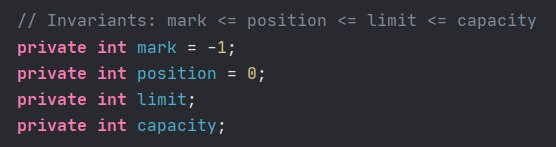
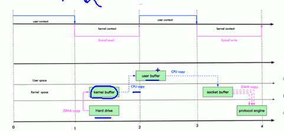
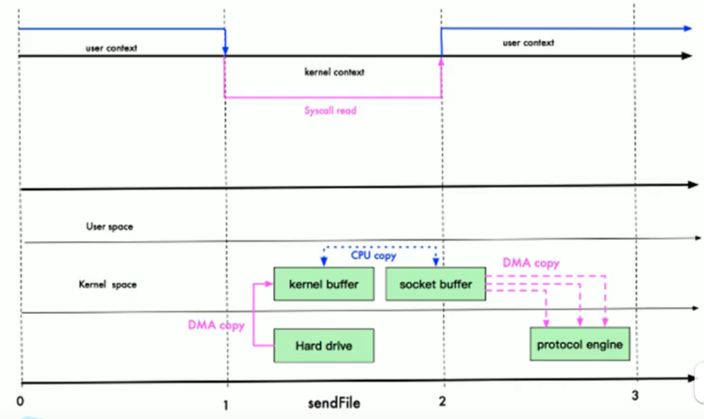
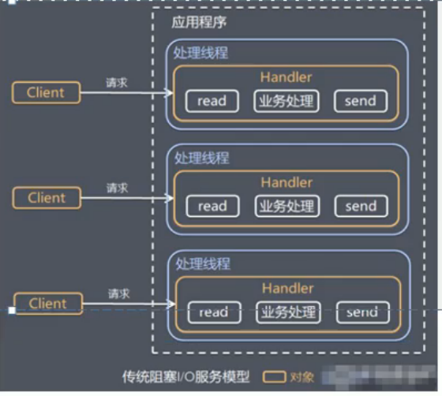
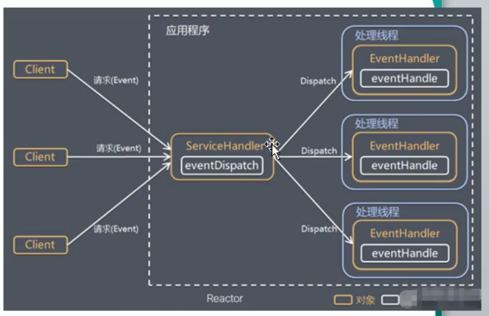
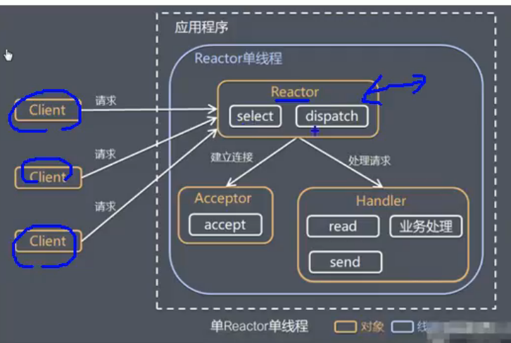
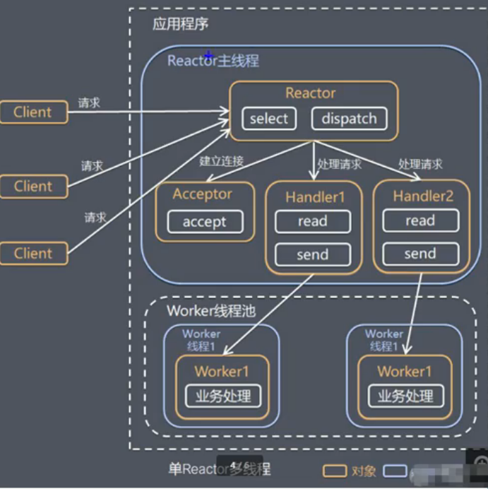
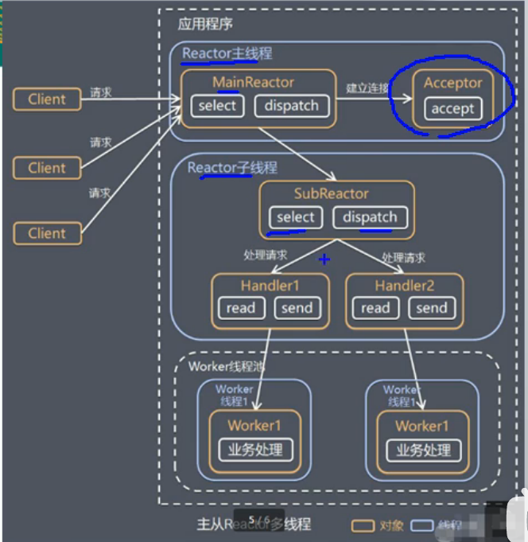
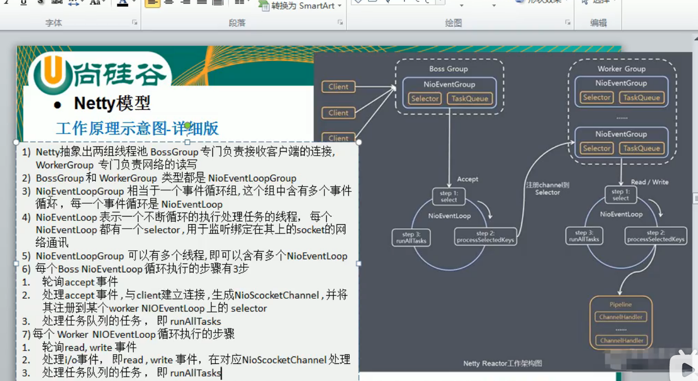

# Netty

## 1. IO模型

* BIO 适用于连接数目较小且固定的架构，这种方式对于服务器资源要求较高，有并发局限，JDK1.4以前的唯一选择，但程序简单易理解。基于字节流和字符流，以流的方式进行，阻塞。
* NIO 适用于连接数目多且连接比较短（轻操作）的架构，比如聊天服务器，弹幕系统，服务器间通讯等。编程比较复杂，JDK1.4开始支持。基于channel和buffer，以块的方式进行，不阻塞。
* AIO 适用于连接数目多且连接时间长（重操作）的架构，比如相册服务器，充分调用OS参与并发操作，编程比较复杂，JDK7开始支持。

netty基于NIO。


### 1.1 NIO

#### **1.1.1 buffer**

（为什么）它是为了实现缓冲区的概念而产生的。

（是什么）是一种缓冲区的抽象类（`abstract class`）。本质上是一个可以读写数据的内存块，可以理解成是一个容器对象（含数组），该对象提供了一组方法，可以更轻松地使用内存块，缓冲区对象内置了一些机制，能够跟踪和记录缓冲区的状态变化情况。

（怎么做）四个属性：



1. capacity 容量，即可以容纳的最大数据量。在缓冲区创建时被设定并且不能改变。
2. limit 缓冲区当前终点，不能对缓冲区超过极限位置进行读写操作。且极限位置可以修改的
3. position 位置，下一个要被读或写的元素的索引，每次读写缓冲区数据时都会改变值，为下次读写作准备。
4. mark 标记


* 注意

  buffer中存放的数据类型，放入和取除的数据类型必须一致。否则抛出`BufferUnderflowException`异常。


使用：

##### 1.ReadOnlyBuffer

```java
ByteBuffer readBuffer = buffer.asReadOnlyBuffer();
while (readOnlyBuffer.hasRemaining()) {
    System.out.println(readOnlyBuffer.get());
}
// 错误的异常
readOnlyBuffer.put((byte)100);//ReadOnlyBufferException
```

##### 2. MappedByteBuffer

这个buffer可以让文件直接在内存中进行修改，而如何同步到文件由NIO来完成。

```java
@Test
    public void run() throws IOException {
        RandomAccessFile accessFile = new RandomAccessFile("1.txt", "rw");
        //获取对应的通道
        FileChannel channel = accessFile.getChannel();
        /**
         * 使用的读写模式
         * 可以直接修改的读写位置
         * 映射到内存的大小，即将 1.txt 的多少个字节映射到内存
         * 可以直接修改的范围是 0-5
         */
        java.nio.MappedByteBuffer mappedByteBuffer = channel.map(FileChannel.MapMode.READ_WRITE, 0, 5);
        mappedByteBuffer.put(0, (byte) 'H');
        //抛出异常，超出索引范围
        mappedByteBuffer.put(5, (byte) '0');

        accessFile.close();

    }
```

##### 3. buffer分散和聚集

```java
@Test
    public void run() throws Exception{
        // 使用ServerSocketChannel 和 SocketChannel
        ServerSocketChannel serverSocketChannel = ServerSocketChannel.open();
        InetSocketAddress inetSocketAddress = new InetSocketAddress(7000);

        serverSocketChannel.socket().bind(inetSocketAddress);

        ByteBuffer[] byteBuffers = new ByteBuffer[2];
        byteBuffers[0] = ByteBuffer.allocate(5);
        byteBuffers[1] = ByteBuffer.allocate(3);

        SocketChannel socketChannel = serverSocketChannel.accept();

        // 等客户端连接
        // 循环读取
        int clientByteLen = 8;
        while (true) {
            int byteRead = 0;
            while (byteRead < clientByteLen) {
                long read = socketChannel.read(byteBuffers);
                byteRead += read;
                System.out.println("byteRead = " + byteRead);

                // 使用流打印，看看当前这个buffer的position 和 limit
                Arrays.asList(byteBuffers).stream().map(buffer -> "posiiton" + buffer.position() + ", limit=" + buffer.limit()).forEach(System.out:: println);
                // 将所有的buffer进行反转
                Arrays.asList(byteBuffers).forEach(byteBuffer -> byteBuffer.flip());

                // 将数据读出显示到客户端
                long byteWrite = 0;
                while (byteWrite < clientByteLen) {
                    long write = socketChannel.write(byteBuffers);
                    byteWrite += write;
                }
                Arrays.asList(byteBuffers).forEach(byteBuffer -> byteBuffer.clear());
                System.out.println("byteRead:=" + byteRead + " byteWrite = " + byteWrite);
            }
        }
```

**1.2 Channel** 通道

（是什么）是一个接口(interface)

* 通道可以同时读写，而流只能读或者只能写
* 通道可以实现异步读写数据
* 可以从缓冲区读数据，也可以写数据到缓冲

```java
public interface Channel extends Closeable {

    /**
     * Tells whether or not this channel is open.
     *
     * @return <tt>true</tt> if, and only if, this channel is open
     */
    public boolean isOpen();

    /**
     * Closes this channel.
     *
     * <p> After a channel is closed, any further attempt to invoke I/O
     * operations upon it will cause a {@link ClosedChannelException} to be
     * thrown.
     *
     * <p> If this channel is already closed then invoking this method has no
     * effect.
     *
     * <p> This method may be invoked at any time.  If some other thread has
     * already invoked it, however, then another invocation will block until
     * the first invocation is complete, after which it will return without
     * effect. </p>
     *
     * @throws  IOException  If an I/O error occurs
     */
    public void close() throws IOException;

}
```

常用的`Channel`类有：`FileChannel`、`DatagramChannel`、`ServerSocketChannel`和`SocketChannel`。

`FileChannel`用于文件的读写，`DatagramChannel`用于UDP的数据读写，`ServerSocketChannel`和`SocketChannel`用于TCP的数据读写。

### **1.2 Selector**

是什么？

Selector能够检测多个注册的通道上是否有事件发生。注意：多个Channel以事件的方式可以注册到同一个Selector。如果有事件发生，便获取事件然后针对每个事件进行相应的处理。这样就可以只用一个单线程去管理多个通道，也就是管理多个连接和请求。


怎么做？

Netty的IO线程`NioEventLoop`聚合了`Selector（选择器）`（也叫多路复用器），可以同时并发处理成百上千个客户端连接。

当线程从某客户端Socket通道进行读写数据时，若没有数据可用时，该线程可以进行其他任务。


##### 1. 实现

Selector类是一个抽象类

* select()阻塞。

* select(long timeout) 监控所有注册的通道，当其中有IO操作可以进行时，将对应的`SelectionKey`加入到内部集合中并返回，参数用来设置超时时间。
* wakeup() 唤醒selector
* selectNow() 不阻塞，立马返回。

* Set<SelectionKey> selectedKeys(); //从内部集合中得到所有的SelectionKey。

##### 2. NIO 非阻塞网络编程原理分析图

1. 当客户端连接时，会通过`ServerSocketChannel`得到`SocketChannel`。
2. 将socketChannel注册到Selector上，register(Selector sel, int ops)， 一个selector上可以注册多个SocketChannel。
3. 注册后返回一个SelectionKey，会和该Selector关联（集合）。
4. Selector进行监听select方法，返回有事件发生的通道的个数。
5. 进一步得到各个SelectionKey。
6. 再通过SelectionKey得到注册的Channel。
7. 通过得到的Channel完成业务处理。


## 2. 零拷贝

零拷贝指的是从操作系统角度看的，**不是不拷贝，而是没有CPU拷贝**。

传统IO，四次拷贝，三次切换。



### 3.1 mmap优化

* mmap通过内存映射，将文件映射到内核缓冲区，同时，用户空间可以共享内核空间的数据。这样，在进行网络传输时，就可以减少内核空间到用户空间的拷贝次数。

拷贝减少为3次，内核态和用户态的切换仍然为3次。这是由于用户buffer和内核buffer共享，所以少了一次kennel buffer拷贝到user buffer的拷贝。

适合小数据量。

### 3.2 sendfile 优化（这个函数）



基本原理：直接从内核缓冲区进入到Socket Buffer。同时，由于和用户态完全无关，减少了一次上下文切换。

适合大文件传输。

只需要一次系统调用，最少2次数据拷贝。

（注意，这里其实也进行了CPU拷贝，kernel buffer到socket buffer但是拷贝的信息很少，比如kernel buffer的length和offset，只不过消耗低可以忽略，相当于这次拷贝动作没有了。


### 3.3 java中的Reactor和Proactor

java中的NIO就是Reactor，当有时间发生时，服务端得到通知，进行相应的处理。

AIO使用Proactor模式，有效的请求才启动线程，它的特点是先由操作系统完成后才通知服务端程序启动线程去处理，一般适用于连接数较多且连接时间较长的应用。

## 3. netty 架构

### 3.1 其他线程模型

不同的线程模型对程序的性能影响很大。


* 传统阻塞IO模式
* Reactor模式
  * 单Reactor单线程
  * 单Reactor多线程
  * 主从Reactor多线程

#### 




蓝色的框子表示线程，白色的框子表示方法，黄色的框子表示对象。

#### 传统的存在的问题

1. 当并发数很大，就会创建大量的线程，占用很大系统资源。
2. 连接创建后，如果当前线程暂时没有数据可读，该线程会阻塞在read操作，造成线程资源浪费。

#### Reactor



1. 基于IO复用模型：多个连接共用一个阻塞对象，应用程序只需要在一个阻塞对象等待，无需阻塞等待所有连接。当某个连接有新的数据可以处理时，操作系统通知应用程序，线程从阻塞状态返回，开始进行业务处理。
2. 通过一个或多个输入请求，同时传递给服务处理器的模式（基于事件驱动）
3. 服务器端程序会处理传入的多个多个请求，并将它们同步分派相应的处理线程。因此Reactor模式也叫Dispatcher模式。


### 3.2 netty线程模型

#### 3.3.2 单Reactor单线程



只有一个线程，再来一个请求，另外一个线程正在处理业务，那么就会造成阻塞。于是产生了单Reactor多线程模型。

#### 3.3.3 单Reactor多线程




通过select监控客户端请求，收到事件后，通过dispatcher进行分发。

如果建立连接请求，则通过Acceptor通过accept处理连接请求，创建Handler对象处理完成连接后的各种事件。如果不是连接请求，则由reactor分发调用连接对应的handler来处理。worker线程池会分配线程处理真正的业务，并将结果返回给handler。

优点：可以充分利用多核CPU的处理能力。

缺点：多线程会数据共享和访问比较复杂。reactor会处理所有事件的监听和响应，在高并发场景容易出现性能瓶颈。


基于主从Reactor多线程模型，

并且对其进行了一定的改进，其中主从Reactor多线程模型有多个Reactor。



1. Reactor主线程MainReactor对象通过select监听连接事件，收到事件后，MainReactor将连接分配给SubReactor。
2. SubReactor将连接加入到连接队列进行监听，并创建handler进行处理。
3. 当有新事件发生时，subreactor就会调用对应的handler处理。
4. handler通过read读取数据，分发给后面的worker线程处理。
5. 线程池中的线程对业务进行处理并返回给handler，handler将结果给客户端。


#### netty模型的介绍：



个人感觉还是和主从类似，但是这个分了两个group = Boss group + worker group。Bossgroup里面可以有多个线程，每个线程Accept和处理selector，将selector注册到Workergroup中。

然后Workergroup里面也有很多线程，每个线程去处理read write 和执行业务逻辑。


