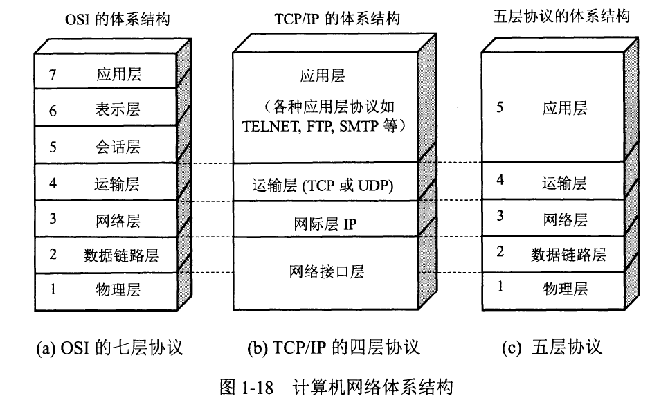
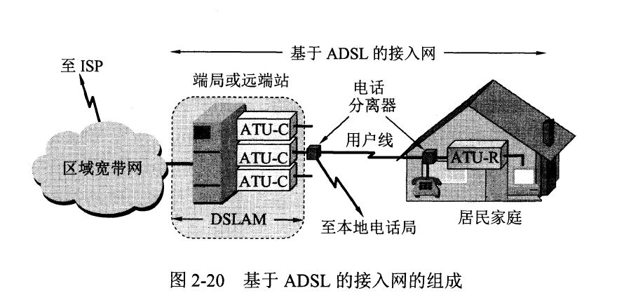
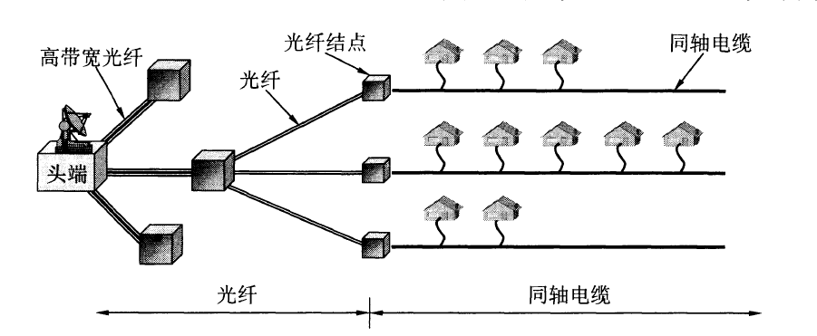
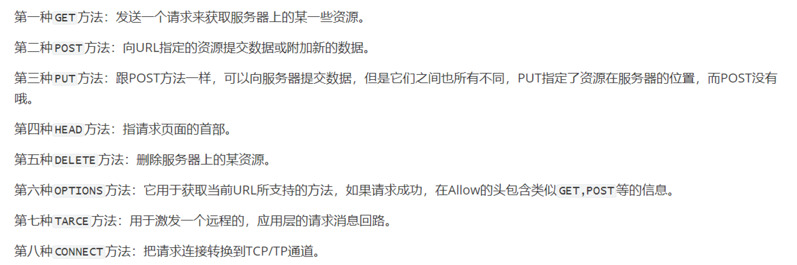

# 计算机网络

### 传输时延

时延指数据（一个报文或分组，甚至比特）从网络的一段传送到另一端所需的时间。

+ $总时延=发送时延+传播时延+处理时延+排队时延$

1. 发送时延

主机或路由器发送数据帧所需要的时间。(从发送数据帧的第一个比特算起，到该帧的最后一个比特发送完毕所需要的时间)。

$ sendTime=length of data(bit) / velocity(bit/s)$

2. 传播时延

信道中传输时间。

$propagate=length of channel(m) / electromagnetic wave velocity (m/s) $

3. 处理时延

主机或路由器收到分组，分析分组的首部、从分组中提取数据部分、进行差错检验、寻找下一个路由器地址等。

4. 排队时延

分组进入路由器在输入队列排队，在发送后输出队列排队发送。

### 网络性能指标

* 速率(bit/s)

  1K=$10^3$ M G T P E Z Y

  电脑上显示的M指的是 按照存储格式讲的，存储计算机1024bit $k=2^{10}$  K M G T P E Z Y

* 带宽

通信上讲的带宽，3.0Ghz ~3.4 Ghz  0.4  按照频率范围上讲的。

计算机网络中，带宽指的是信道传输的最大速率。

### ADSL (Asymmetric Digital Subscriber Line)

### HFC(Hybrid Fiber Coax)光纤同轴混合网

#### FTTx技术

光纤到户(FTTH)

## 数据链路层

### 1. 点对点信道

链路：一个点到邻近结点的一条物理线路。数据链路是除了链路，还要有必要的通信协议进行传输，把所有这些协议的硬件和软件加到链路，叫做数据链路。

1. 结点A把网络层IP数据报添加首部和尾部。

2. 结点A把封装好的数据发送给B的数据链路层。
3. B先进行差错检验，无错提取IP数据报，否则丢弃。

a) 封装成帧

添加首尾部。最大传输数据单元(Maximum Transfer Unit,MTU)，数据部分的最大长度上限。帧定界符 开始 SOH (00000001)  结束EOT(00000100)。

b) 透明传输

数据部分是文本文件中的字符时，不可能和控制字符相同，任何内容都可以通过帧传过去，所以是透明传输。

当信息是图片时，可能会出现控制符一样的二进制位。

解决办法，插入转义字符ESC(00011011),接收端将数据发往网络层要删除所有的ESC。

c) 差错检验

循环冗余检测(Cyclic Redundancy Check，CRC)。增加n位冗余码（除以n+1位除数）。

FCS(Frame Check Sequence)。

接收端，如果R（余数）算出来是0，则accept。否则，丢弃。

增加了帧编号、确认、重传机制。

### PPP(Point-to-Point Protocal)

1. 协议的组成

a) 封装到链路的方法。

b) **LCP链路控制协议**，建立配置和测试链路连接。RFC1661定义了11种类型的LCP分组。

c) **网络控制协议NCP**。其中的每一个协议支持不同的网络层协议，如IP、OSI的网络层。

2. 协议帧的格式

首部4个字段：7E PPP的定界符。FF 03 至今没给出定义。协议 是2字节协议字段， 0x0021时，PPP的信息是IP数据报，0xC021，是PPP协议的控制协议LCP的数据。

信息部分可变化，最长1500字节。

FCS冗余码。

3. 零比特填充（同步传输）

5个连续1后面插入0。以此来保证透明传输。

4. 协议的工作状态

PPP协议起始和终止都处于“链路静止”状态。之后用户向ISP拨号，与ISP建立物理链路，然后LCP链路开始进行协议协商，如果成功，则开始进行网络层协议（NCP）协商，如果是IP协议则是IPCP（IP控制协议），将IPCP封装成帧。网络层配置结束，数据链路开始工作（链路打开）。

图中可以看出PPP协议不是单纯的数据链路层协议，还包括物理层内容和网络层内容。

### 2.使用广播信道的数据链路层（CSMA/CD)

1. 共享信道的两种划分方法

a) 静态划分信道

频分复用、时分复用、码分复用和波分复用等。开销较大。

b) 动态媒体接入控制

* 随机接入

用户根据自己的情况随机发送信息，可能产生碰撞，需要碰撞协议。

* 受控接入

不能随机发送，比如令牌环局域网和及集中控制的轮询和多点线路探询。

2. 以太网的两个标准

IEEE 802委员会提出将数据链路层划分为 **逻辑链路控制LLC**（Logic Link Control) 和 **媒体接入控制层MAC**(Media Access Control)。

LLC与传输媒体无关，MAC处理传输媒体有关的内容。

之后因为以太网的发展，局域网技术没落，目前大部分厂商只MAC协议，LLC作用已经消失。

3. 适配器的作用

计算机和外界局域网连接需要**适配器**。适配器和计算机之间通过IO总线传输信息，适配器和局域网通过双绞线和电缆传输信息。

适配器功能不局限于数据链路层，适配器在接发各种帧时不使用CPU，当帧判断可用时，才会发出中断信息通知计算机，并交付协议栈中的网络层。

4.CSMA/CD协议(Carrier Sense Multiple Access with Collision Detection)**载波监听多点接入/碰撞**

以太网发送数据都是用 **曼彻斯特编码**。变化频率变化了一倍，所以频率开销增大。

* 多点接入：多个计算机同时连接在一根总线上。
* 载波监听：使用电子技术检测总线上有没有其他计算机在发送数据。载波只是名词，就是检测信道，检测其他计算机发没发信息。
* 碰撞检测（冲突检测）：边发送边监听，适配器边发送边检测信道上的信号电压信号，以便于发送数据时监听其他计算机发没发数据。当两个计算机同时发送数据，则碰撞，随机等待一段时间再发送。
* **电磁波在1km的电缆传播时延是5us。**
* 发送数据总有传播时延，当传播时延内另一个计算机发了数据，则碰撞。所以一个计算机最多消耗**两倍$2\tau$**的总线到端的传播时延。

可以看出，一个计算机只能半双工通信，图中看出每次计算机发送信号都不确定是否会碰撞，$2\tau$时延就是**碰撞窗口**（争用期）。

* **截断二进制指数退避**(truncated binary exponential backoff)

1. $2\tau$协议规定为51.2us。对于10Mbit/s以太网，发送512bit。所以碰撞窗口期是发送512bit时间。
2. $k=min[重传次数...10]$ 从离散整数集合$[0,1,...,(2^k-1)]$ 选取整数即为重传次数，必须小于10。
3. 重传大于16次，丢弃帧，向高层报告。

* 强化碰撞

当发送数据后，还要继续发送32或48bit人为干扰信号，让所有用户都知道已经发生了碰撞。

* 设定帧间最小间隔9.6us.给接收方96bit时间做准备处理下一次数据。

* 集线器 局域网星型拓扑，可靠性很好，使用双绞线连接，出现802.3i 10BASE-T标准。10代表10Mbit/s数据。

实际上还是抽象成总线形式，所以每个时间只允许一个站发送数据。

**集线器工作在物理层**，每个端口仅仅转发信号。

### 3. 信道利用率

### 4.mac 地址

每一个适配器都有一个MAC地址。固化在适配器ROM中的地址。

MAC的格式：

前两个字段是目的地址和源地址，分别占6个字节。第三个字段是类型，表明数据部分使用的协议是什么。最后是冗余码(fcs crc)。

数据部分最小长度46，不满46就填充够46。

MAC帧前还有8个字节，前7字节是为了同步时钟频率，最后一个帧开始界定符。

### 5. 扩展以太网

1. 物理层扩展

增加解调器扩大物理链路交流区域。

2. 数据链路层扩展

交换式集线器称为以太网交换机或者第二层交换机。实质上是多接口的网桥。其内部通过自学习算法存储帧交换表。

独占传输媒体，无碰撞地传输数据。

生成树协议STP，不改变网络拓扑，逻辑上没有闭环，防止兜圈子问题。

3. 虚拟局域网VLAN

可以防止广播风暴，A1发送信息只有A组能够看到。

帧格式：

在MAC帧中插入4字节VLAN标记，源地址后两位如果是0x8100时，表明后面加了VLAN。源地址的最后两个字节中，前3位是用户优先级字段，接着一位是规范格式符CFI，最后12位是虚拟局域网VLAN标识符VID，它标记了这个以太网帧属于哪个虚拟局域网。

## 网络层

网络层只提供尽最大努力交付服务，可以减少路由器价格成本等，因为计算机本身具有很强的计算能力，差错检验能力很强。

#### 1.网络协议IP

一般指的是第四个版本IPv4。一般和**地址解析协议**(Address Resolution Protocol,ARP)、**网际控制报文协议ICMP**(Internet Control Message Protocol)、**网际组管理协议IGMP**（Internet Group Management Protocol）。

2.网络互连的中间设备

1. 物理层使用的中间设备是**转发器**。

2. 数据链路层使用的中间设备是**网桥或桥接器**。

3. 网络层使用的中间设备是**路由器**。

4. 网络层以上使用的中间设备叫**网关**。网关连接两个不兼容的系统需要在高层进行协议转换.

   3.虚拟互联网络

由于不同的计算机网络使用相同的IP协议。因此可以看做虚拟互连网络

**直接交付**目的主机在本网络中不需要其他路由器转发。

**间接交付**目的主机不在本网络。

#### 2.分类的IP地址

IP地址就是互联网上每一台主机的每一个接口分配一个在全世界范围内唯一的32位标识符。IP地址现在由**互联网名字和数字分配机构ICANN**（Internet Corporation for Assigned Names and Numbers)进行分配。

IP地址的**第一个字段**是网络号，标志主机所连接到的网络。一个网络号在整个互联网范围内是唯一的。**第二个字段**是主机号，它标志该主机

$ IP地址 :: = {<网络号>,<主机号>}$

* A类、B类和C类网络号字段数分别是1、2和3.网络号字段的最前面有1-3位是类别位，数值分别是0,10，110。
* A类、B类和C类地址的主机号分别为3、2和1。
* D类地址用于多播。
* E类地址保留为以后使用。

#### 3.常用的3类地址

* A类 主机号占3个字节，因此每个A类网络最大主机数是$2^{24}-2$。全0主机号字段表示“这个”，保留地址意思是“本网络”，例如某主机IP5.6.7.8那么其本地网络就是5.0.0.0。全1表示网络上所有的主机。A类共有$2^{31}$个地址。
* B类 两个字节，前面两位固定，剩下14位分配网络号。14位不可能全0和全1。**所以不需要减2**。但是**128.0.0.0**是不指派的，B类最小网路地址是**128.1.0.0**。所以网络数是$2^{14}-1$。B类共$2^{30}$地址。
* C类 三个字节网络号，110。网络号还有21位可以分配。**192.0.0.0**不指派，C类**192.0.0.0**不指派，可以使用的最小网络地址是**192.0.1.0**。这样C类地址可以指派的网络总数是$2^{21}-1$。共$2^{29}$地址。

#### 4.IP地址和硬件地址

数据从高层向底层传输。网络层和网络层以上使用IP地址，数据链路层及其以下的使用硬件地址。

1. 路由器只根据目的站的IP地址的网络号进行选择。
2. 局域网链路层只看到MAC帧。IP数据报被封装在MAC帧中，MAC帧在不同网络上传送时，其MAC帧首部中的源地址和目的地址发生变化。图中可以看出，MAC从H1到R1传送，源地址和目的地址是HA1和HA3，R1收到帧后，重新添加源地址和目的地址HA4和HA4。

#### 5.地址解析协议ARP

**知道了IP地址，如何找到其对应的MAC地址呢？**

还有一个RARP逆地址解析协议，现在的DHCP协议包含了RARP，不需要再讲。

* **ARP解决**这个问题的方法是在主机ARP高速缓存中存放一个从**IP地址到硬件地址的映射表**，并且这个映射表还经常动态更新（新增或超时删除）。

A向B发数据报，先在ARP高速缓存中查看B的IP地址，如果有再找ARP映射表，找到硬件地址就放到MAC帧中。如果B刚刚加入网络，找不到B硬件地址，则：

* ARP找硬件地址步骤：

1. A发送ARP请求广播。
2. 网络上所有主机收到广播信息。
3. B收到请求，向A发送自己地址。（B可以收到A的所有ARP缓存信息，方便以后和本网络（局域网）中所有主机通信）。
4. A收到B地址更新ARP高速缓存。

* **生存时间**：10~20min。超时就剔除那个硬件地址。（防止某个时刻B的硬件更换导致硬件地址变化）。
* **实际是按照硬件地址通信的**，那么为什么还要有IP呢？

全世界不同网络使用不同的硬件地址，这些网络互相通信就必须做硬件地址转换工作，会使网络十分复杂。IP就屏蔽了这个问题。

#### 6.IP数据报格式

TCP/IP中各种数据格式常常以32位（4字节）描述。

1. 首部。

5个4字节描述（共20字节，每个4*8=32位）。

* **版本** 4位，IP协议的版本，双方通信的IP版本必须一致。
* **首部长度** 4位，可表示最大十进制数是15。一般是0101（5,5\*4=20），当首部长度为最大值1111，则60字节（15*4）。
* **区分服务** 占8位，用来获得更好的服务。这个字段在旧的标准叫做服务类型。实际一直没用过。
* **总长度** 总长度指首部和数据之和的长度，单位为字节。总长度为16位，数据报最大长度为$2^{16}-1$字节。**MTU**(Maximum Transfer Unit)。当一个IP数据报封装成链路层的帧时，此数据报的总长度一定不能超过下面数据链路层规定的MTU值。当超过就要分片。
* **标识** 占16位，IP软件有一个计数器，产生一个数据报计数器加1，赋给标识字段，解决IP数据报不是按序接收的问题。
* **标志** 占3位，目前只有两位有意义。最低位MF=1，表示后面还有分片，MF=0表示最后数据分片中最后一个。中间一位DF=1表示不能分片，DF=0允许分片。
* **片偏移** 占13位。较长的分组在分片后，某片在原分组中的相对位置，相对用户数据字段的起点。片偏移以8个字节为偏移单位，每个分片长度一定是8字节的整数倍。
* **生存时间** 8位，TTL(Time To Live)，表明这是数据报在网络中的寿命。发出数据报的源点设置这个字段。其目的是防止无法交付的数据报无限制地在互联网兜圈子。现在TTL指传几跳路由器，经过一个路由器就减一。初始TTL=1只能在本地局域网络传送。
* **协议** 占8位，协议字段指出数据报携带的数据是使用何种协议，以便使目的主机的IP层知道应将数据部分交给上层哪个协议处理。
* **首部检验和** 16位，只检验数据报的首部，不检验数据部分可以减少工作量。检验方法如图：

**发送方**将所有首部划分为16位序列，所有16位相加计算反码写入检验和字段。

**接收方**收到数据报后将首部的所有16位再使用反码算数相加，得到的和计算反码和数据报中的检验和字段相加，结果必为0，否则出错。

* **源地址** 32位。
* **目的地址** 32位。
* **可变部分** 可变从1-40字节不等。用来支持排错、测量以及安全等措施。实际上很少使用（增加计算开销）。

* 路由表中主要信息：

$(目的网络地址，下一跳地址)$

2. 默认路由

主机发送IP数据报时要查找路由表，如果一台主机连接在一个小网络上，这个网络只用一台路由器连接，那么使用默认路由。

3. 分组转发

路由器收到数据报，从路由表知道下一跳IP地址后，利用ARP将IP地址转换为硬件地址放入MAC帧首部，从而送给下一跳路由器或主机。

#### 7.划分子网

1. 从两级IP地址到三级IP地址

两级IP地址（网络号+主机号）问题：

* 浪费。A类主机数超过1000万，B类超过6万。很多公司宁愿申请A和B类也不想要C。造成IP资源浪费。

* 每一个物理网络分配网络号使得路由表太大，网络性能变差。

**三级IP**增加子网号字段：**划分子网**。

$ IP地址 ::={<网络号>，<子网号>，<主机号>}$

* 其他网络发给本单位的IP数据报，根据网络号找到本单位网络，本网络收到后，按照子网号找到目的子网。

2. 子网掩码

使用子网掩码找到子网中的目的主机。

不管网络有没有划分子网，只要把子网掩码和IP地址进行按位与，就能得到网络地址。

如果网络没有划分子网，路由器就默认使用**默认子网掩码**。

路由器现在交换信息，必须把自己的子网掩码告诉相邻路由器，这样路由表还给出了每个网络的子网掩码。

* 减少了可用主机数。
* **划分子网的分组转发**：

$(目的网络地址，下一跳地址，子网掩码)$

1. 收到的数据报提取IP地址D。
2. 判断直接交付。子网掩码与D按位与，得到网络号和**本网络**不匹配间接交付执行3，匹配直接交付。
3. 路由表有D特定主机路由，则根据路由表IP发送下一跳，否则4。
4. 对路由表每一行按位与得到结果N。若N与某行网络地址匹配，则发给下一跳，否则5。
5. 发送默认路由，否则6。
6. 分组出错。

#### 8.构造超网 （CIDR)

**无分类域间路由选择CIDR**(Class Inter-Domain Routing)。

1）消除了传统的A类、B类和C类地址以及划分子网概念。把32位地址划分前后两个部分，前面的部分是**网络前缀**，后面的部分指明主机。

$IP地址 ::=\{<网络前缀>，<主机号>\}$

在IP地址后面加上斜线“/”写上网络前缀所占的位数。例如：206.0.64.0/18

2）网络前缀都相同的连续IP组成一个“CIDR地址块”。只要知道CIDR地址块中的任何一个地址，就可以知道地址块的起始地址（最小地址）和最大地址。使用**32位地址掩码**。

3）最长前缀匹配。超网路由，网络前缀和下一跳地址组成。每次匹配可能会有多条匹配结果，选取匹配前缀最长的。

4）使用**二叉线索**查找路由表。

#### 9.网际控制报文协议ICMP

* 有**ICMP差错报告报文**和**ICMP询问报文** 两类。

1）终点不可达。 当路由器或主机不能交付数据报时就向源点发送终点不可达报文。

2）时间超过 当数据报的生存时间为0，丢弃该数据包，还要向源点发送时间超过报文。**或**终点在预定时间内不能收到数据报的全部数据片，就将数据报片丢弃，并向源点发送时间超过报文。

3）参数问题 数据报首部中有字段的值不正确时，丢弃该数据报，并向IP发送参数问题报文。

4）改变路由（重定向） 路由器把改变报文发送给主机，让主机知道下次应该发给另外的路由器。

5）回送请求和回答 由主机或路由向特定目的主机发出询问。收到此报文的主机向源主机或路由器发送ICMP回送回答报文。主要来测试目的站是否可达以及了解相关状态。

6）时间戳请求和回答。 I请求某台主机回答当前日期和时间。可用于时钟同步和时间测量。

* 应用

  **PING**测试两主机连通性。

  **traceroute（unix，windows 是tracert）** 跟踪从源点到终点的路径。

### 10. 路由选择协议

1. 分层次的路由选择协议。

1）互联网的规模非常大。路由器如果要知所有网络路径，路由表非常大处理费时。

2）许多单位不愿意外界了解自己的布局细节但是还想连接到互联网上。

所以，分成很多自治系统（Autonomous System ,AS），一个AS对其他AS表现出的是一个单一的和一致的路由选择策略。

选择协议分为两类：**内部网关协议IGP（Interior Gateway Protocol）**和**外部网关协议EGP（External Gateway Protocol）**。

IGP：自治系统内部使用的路由选择协议，与其他自治系统选择什么路由协议无关。如RIP和OSPF。**域内路由选择**。

EGP：不同的自治系统间的协议。例如BGP版本4（BGP-4）。**域间路由选择**。

2. **RIP**（Routing Information Protocol）

基于距离向量的路由选择协议。距离定义：每经过一跳路由器就+1。例如直连路由是1。所以RIP适用于（小型网络）。

* RIP不能在两个主机间同时使用多个路由，RIP选择一条最少路由器的路由，哪怕还存在另一条高速但路由器较多的路由。
* 仅和相邻路由交换信息。
* **距离选择算法**

1）对地址为X的相邻路由发来的RIP报文，把“下一跳”字段中的地址改为X，并把所有“距离”加1。每一个项目都有三个关键数据：目的网络N，距离d，下一跳路由器X。

2）对修改后的RIP报文每一个项目：

若原来路由表**没有**目的网络N，则把该项目添加到路由表中。

否则（有N）：

若下一跳路由器是X，则把收到的项目替换为原来的路由表中的项目。

否则（到目的网络N的下一跳不是X）：

收到的项目中的距离d小于路由表中的距离，则进行更新。否则什么也不做。

3）3分钟还没有收到相邻路由器的更新路由表，则把相邻路由器记为不可达的路由器，即距离设置为**16**。

4）返回。

这个算法基础是**Bellman-Ford算法**。（求A到B最短路径）

例题**直接看书P155页 例题**，看一眼如何更新表就懂了。

* RIP协议的报文格式

一个RIP报文最多携带25个路由，所以最大长度4+20*25=504字节。**使用UDP传送**。

RIP的首部占4个字节，其中命令字段指出报文的意义。例如1表示请求路由信息，2表示请求路由信息的响应或未被请求而发出的路由更新报文。首部后面的必为0为了4字节对齐。

* RIP协议存在的问题

当网络出现故障时，要经过较长时间才能将此信息传送到所有路由器。**好消息传得快，坏消息传的慢**。例子：

图中“1,1，直接“指到网络1,1跳，直接交付。 网络1出现了故障，R1无法到达网1。于是路由器R1把到网1的距离改为16。但是，很可能经过30秒钟后R1才把更新信息发送给R2。R2可能已经先把自己的路由表发给R1，其中有”1,2，R1“这一项。

R1收到R2的更新报文后，把1,2，R1更新为1,3，R2。之后会再把更新后的信息发给R2。R2又更新自己的路由表为1，4，R1。如此往复直到加到16。

3. **OSPF** 开放最短路径优先(Open Shortest Path First)

它是为克服RIP的缺点在1989年开发出来的。

使用了Dijkstra提出的**最短路径算法SPF**。

特点：

1）向本自治系统中所有路由器发送信息。使用**洪泛法**。路由器通过所有输出端口向所有相邻路由器发送信息。而每一个相邻路由器又再将此信息发往所有相邻路由器。

2）发送的信息就是**本路由器相邻的所有路由器的链路状态**。**度量**表示费用、距离、时延、带宽等等，这些都是网络管理人员决定的，较为灵活。

3）只有链路发生变化时才会向所有路由器用洪泛法发送此信息。

OSPF将一个自治系统再划分为若干个更小的范围，叫做区域。图4-34就表示一个自治系统划分为4个区域。

这样洪泛法就作用于每个区域内。上层叫**主干区域**，R3、R4和R7是**区域边界路由器**。R6是**自治系统边界路由器**。（和其他自治系统连接）

使用24字节的首部长度：

1）版本。当前版本为2。

2）类型。5种类型中的一种。

3）分组长度。包括OSPF首部在内的分组长度。

4）路由器标识符。发送改分组的路由器接口的IP地址。

5）区域标识符。分组属于区域的标识符。

6）检验和。用来检验分组中的差错。

7）鉴别类型。0（不用）1（口令）。

8）鉴别。 鉴别类型为0填0。鉴别类型1填8个字符的口令。

### 11.外部网关协议BGP

边界网关协议（BGP）

不同自治区域使用BGP的原因有：

1. 互联网规模太大。路由表维持开销太大。

2. 不同自治区域用的协议可能不同。而且有的自治区域不喜欢让别的自治区域流量通过本区域。

BGP采用**路径向量路由选择协议**，满足管理员的条件下，选择比较好的路径，并非找一条最佳路径。

一个BGP发言人与其他AS的BGP发言人要交换信息，首先建立TCP连接，端口号179，然后在此连接上交换BGP报文以建立BGP会话。

有了BGP会使得路由表简化很多，BGP协议交换路由信息的结点数量级是自治系统个数的量级，这要比网络数小很多，只要找对正确的BGP发言人，就可以发送数据报，简化路由表信息。

* BGP-4的4种报文

1）OPEN（打开）报文，用来和相邻的另一个BGP发言人建立关系，使通信初始化。

2）UPDATE（更新）报文，用来通告某一路由信息，以及列出要撤销的多条路由。

3）KEEPALIVE（保活），用来周期性地证实邻站的连通性。

4）NOTIFICATION（通知）报文，用来发送检测到的差错。

* BGP路由表包括目的网络前缀，下一跳路由以及到达该网络经过的自治系统序列。（如果一个BGP收到了其他BGP的路径通知，检查本自治系统是否在路径序列中，防止兜圈子）。

* 标记用来鉴别BGP报文，不使用鉴别，标记全部置1。长度字段指出包括通用首部在内的整个BGP报文长度，最小19，最大4096。类型1-4，上述BGP报文中的一种。

* OPEN报文共有6个字段，即版本

### 12.IPV6

IPV6将地址空间增大到128位，相当于IPV4的$2^{96}$倍。

* 首部固定40字节。
* **版本** 占4位。协议的版本，IPV6是6.
* **通信量类** 占8位，为了区分不同的IPV6数据类型和优先级。
* **流标号** 占20位。**流**指的是从特定源点到特定终点的一系列数据报，流所经过的路径上路由器都保证指明的服务质量。属于同一个流的数据报都有一样的流标号。
* **有效载荷长度** 占16位。IPV6数据报除基本首部以外的字节数。这个字段的最大值是64KB。
* **下一个首部** 占8位。

1）IPv6没有扩展首部时，指明后面的数据应该交付IP层哪一个协议。

2）出现扩展首部时，下一个字段的值标识第一个扩展首部的类型。

* **跳数限制** 占8位。防止数据报在网络中无限期存在。最大255跳。
* **源地址** 128位。发送数据报的IP地址。
* **目的地址** 128位。接收数据报的IP地址。

1. **IPV6地址**

1）**单播** 传统的点对点通信。

2）**多播** 一点对多点通信。

3）**任播** 终点是一组计算机，数据报只交付其中一个，通常是距离较近的那个。

2.**冒号十六进制法**

CIDR无分类网络地址同样可以适用。直接在后面加上/。

* 地址分类

1） 未指明地址。16字节全0地址。只能为某个主机当源地址适用，使用条件是这个主机还未分配IP地址。仅此一个。

2）环回地址。功能和V4一样。仅此一个。

3）多播地址。功能和V4一样。1/256个。

4）本地链路多播地址。有些主机没有连接到互联网上，占1/1024。

5）全球单播地址。 如图。

3. **从IPV4向IPV6过渡**

1）**双协议栈**

一部分主机装有IPV4和IPV6两个协议栈。这样这个主机可以两种类型的网络数据通信。使用**DNS**查询目的主机使用的是那种协议。

2）**隧道技术**

IPv6数据报进入IPv4网络时，使用IPv4数据报封装IPv6。这样就可以在IPv4网络中传播。在离开v4网络时，只交付数据部分（即v6）。双协议栈的主机想知道封装的是一个v6数据报，v4首部协议字段置为41。

4. **ICMPv6**

也需要使用类似ICMP反馈差错信息。

### 13.IP多播

* 一对多通信。一个源点发送给很多终点。

* 多播实际上是IP地址中D类地址。只能用于目的地址，不能用于源地址。没有ICMP差错报文。
* 协议。IGMP网际组管理协议。

IGMP让连接在本地局域网上的多播路由器知道本局域网上是否有主机参与或退出了某个多播组。

配合**多播路由选择协议**一起工作，

* IGMP两个工作阶段

1）加入。某台主机加入多播组时，该主机应向多播组的多播地址发送一个IGMP报文，声明自己要成为该组的成员。本地多播路由器收到IGMP报文后，还要利用多播路由选择协议把这种组成员关系发给其他多播路由器。

2）删除。本地多播路由器周期性探询主机，查询这些主机是否还是组的成员。只要有一台主机对某个组响应，那么多播路由器就认为这个组是活跃的。只要几次探询后没有一个主机响应，那么就不会再把这个组的成员关系转发给其他转播路由器。

* 多播路由选则协议

多播路由选择协议尚未标准化。（此部分学习了解一下即可）

多播路由选择实际上要找出以源主机为根节点的多播转发树。转发数据报使用如下方法：

1）**洪泛与剪除**

这种方法适用于较小的多播组，所有组成员接入的局域网也都是相邻接的。使用的是**反向路径广播**（RPB）。

洪泛就是广播，剪除就是。

洪泛与剪除示例：

如果多播转发树上的某个路由器发现它的下游树枝没有多播组成员，则下游树枝一起**剪除**。图中虚线椭圆就是剪除。当有新成员增加，再加回多播转发树。

2）**隧道技术**

适用于多播组位置在地理上分布很分散。

路由器R1和R2不支持多播，那么R1和R2需要对多播数据报封装，再加上普通数据报首部，使之成为向单一目的站发送的单播数据报，然后“隧道”一样从R1发到R2。

3）**基于核心的发现技术**

对每一个多播组G指定一个核心路由器，给出它的IP单播地址。核心路由器按照前面的方法创建出多播组G的转发树。如果有一个路由器R1向核心路由器发送数据报，那么它途中经过的每一个路由器都要检查其内容。

书上没讲明白（P184）。了解一下算了。

### 14 虚拟专用网和网络地址转换NAT

1. **虚拟专用网**

IPv4中有内部网络专用地址（为了防止和公网地址重叠，产生二义性问题）：

1）`10.0.0.0` 到 `10.255.255.255`(10.0.0.0/8，24位块)对应A类地址

2）`172.16.0.0`到`172.31.255.255`(172.16.0.0/12它又称为20位块) 对应B类

3）`192.168.0.0`到`196.168.255.255`（192.168.0.0/16，16位块）对应C类

这样的IP地址叫**专用互联网**或**本地互联网**。

* 利用公用的作为本机构专用网之间的通信载体，这种专用网叫**虚拟专用网VPN(Virtual Private Network)**，用于机构的内部通信。所有经过互联网传输的**数据要加密**。
* IP隧道技术

隧道技术就是封装（把原来数据放到新的数据报，以方便通信）。

从X到Y，源地址X、目的地址Y+真实数据报。A发到了R1，R1会对所有数据加密封装，发给R2.R2在解密，就知道发给Y。

逻辑上看起来就是一个从R1到R2的直接路径（实际上经过了很多路由器传输），所以叫隧道。

2. **网络地址转换NAT**

分到了本地专用地址（内部网络专用地址），但是需要和外网通信咋办？**公网IPv4地址太少啦。**

NAT就出来解决这个问题，一个NAT软件至少有一个有效的公网IP地址，使用NAT地址转换表来对应公网IP地址。

比如主机A向主机B发送信息，NAT路由器会将其地址`192.168.0.3`映射成`172.38.1.5`。B看到的A的地址实际上就是NAT的这个地址。B不知道A的实际地址是什么。B发给A信息目的地址就写NAT的IP就行。收到B的信息，NAT路由器根据NAT转换表转成A的`192.168.0.3`。

有一个问题来了，我们家庭的路由器，实际就一个IP地址，为什么那么多设备都能访问外网？

虽然只有一个公网IP地址，但是发明了**端口号**（运输层）啊！！！

这个新的表叫**网络地址与端口号转换NAPT**。实际上现在很多人还是叫NAT转换表。

### 15. 多协议标记交换 MPLS(MultiProtocol Label Switching)

增强IP功能的协议。采用面向连接的技术，每个分组携带一个叫做标记的小整数。当分组到达交换机时，交换机读取分组的标记，并采用标记值来检索分组标记，

* 基本工作过程

在传统的IP路由器查找路由表时，需要找最长匹配的前缀，耗时很大。MPLS对这个进行了优化。

在MPLS入口处，给每一个IP数据报打上固定长度的标记，然后对打上标记的IP数据报用硬件转发，速度大大加快。

使用硬件技术对打上标记的IP数据报进行转发成为标记交换，根据标记在数据链路层（硬件）上直接转发。

MPLS的基本工作流程书中没细讲，主要有：（了解一下）

1）MPLS域指各LSR（标记交换路由器）使用专门的**标记分配协议LDP**交换报文，并找出特定标记相对应的路径，即**标记交换路径LSP**，如图中的ABCD。各LSR根据路径构造**转发表**。

2）IP数据报进入MPLS就给它打标记，按照转发表发给下一个LSR。

3）一个标记仅仅在两个标记交换路由器LSR之间才有意义。每经过一个LSR，LSR就要更换新的标记并转发，即把入标记换位出标记，这叫标记交换。

如图中B从入口0收到标记为3的分组，要将出接口换为1并且标记重新打1。

4）数据离开MPLS时，MPLS的出口结点就把MPLS标记删除，交付非MPLS路由器，按照普通的转发规则继续传递。

* MPLS中的重要概念 **FEC转发等价类**

转发等价类就是路由器按照同样方式对待的IP数据报的集合，即同样的接口转发到同样的下一跳地址，具有同样的服务类别和同样的丢弃优先级等。

划分FEC的方法不受限制，只接受管理员控制。图中是FEC用于负载平衡的例子。传统的路由选择H1和H2分别向H3和H4发送信息，都只能选择最短路径ABC，导致过载。FEC可以指定H2选择ADEC。

* MPLS的首部位置和协议格式

IP数据报首部之间插入4字节的MPLS首部。把加上MPLS的IP数据报封装成帧时，以太网字段单播时为$8847_{16}$和$8848_{16}$这样来判断是否使用MPLS。

1）标记值。 最大$2^{20}$。在设置MPLS标记时可以使用所有的20位。

2）试验。 3位，目前保留用于试验。

3）栈S 。1位，“标记栈”时使用。

4）生存时间TTL。 8位，防止MPLS在MPLS兜圈子。

## 运输层

### 1. 运输层协议概述

端到端的通信实际上是两个主机中的应用进程之间的通信。

运输层“复用”和“分用”。复用指的是发送方不同的应用进程都可以使用同一个运输层协议传送数据，而“分用”是指接收方的运输层在剥去报文的首部后能够把这些数据正确交付目的应用进程。

运输层的两个主要协议：UDP(User Datagram Protocol)和TCP(Transmission Control Protocol)。

按照OSI的术语，两个对等运输实体在通信时传送的数据单位叫**运输协议数据单元**。

**协议端口号**通常又称为**端口**，虽然通信的终点是应用进程，但只要把所传送的报文交到目的主机的某个合适的目的端口，剩下的工作交由TCP或UDP来完成。（这里的端口主义和交换机或路由器上的端口区分，那个是硬件端口，这个是软件端口）。

TCP/IP运输层用一个16位（**共65535个**）的端口号来标志一个端口。端口号只具有本地意义，它只是标记本计算机应用层中的各个进程在运输层交互时的层间接口。

通信时，**不仅要知道对方的IP地址，还要知道对方的端口号**。

* **服务端**使用的端口号。

1）熟知端口号或系统端口号

数值 0~1023。

2）登记端口号。数值 1024~49151。这类端口号为了没有熟知端口号的应用程序使用的。

* **客户端**使用的端口号

数值为49152~65535。这类端口号仅在客户进程运行时才动态选择，因此又叫**短暂端口号**。

### 2. UDP 用户数据报协议

UDP(User Datagram Protocol)只在IP的数据报服务上增加了很少的一点功能。

1）无连接的。发送数据之前不需要建立连接，减少开销和发送数据之前的时延。

2）尽最大努力 交付。不需要维护复杂的连接状况。

3）面向报文的。发送方的UDP对应用程序交下来的报文，在添加首部后交付IP层。**UDP一次交付一个完整的报文**。如果报文太长，IP会对其进行分片，降低IP层的效率。

4）没有拥塞控制。网络出现的拥塞不会使源主机发送速率降低。这对实时应用很重要。

5）UDP支持一对一，一对多，多对一，多对多的交互通信。

6）UDP的首部开销少，只有8个字节，比TCP的20字节要短。

### 3.UDP的首部格式

数据字段和首部字段。首部字段中划分的每个字段**都是两个字节**。

1）源端口 源端口号。在需要对方回信时选用，不需要时全用0。

2）目的端口 目的端口号。终点交付时必须使用。

3）长度 UDP用户数据报的长度，最小值8（仅有首部）。

4） 检验和 检测UDP用户数据报在传输时是否有错。有错就丢弃。

UDP基于端口的复用：

比如UDP发现端口号不正确，丢弃该报文，由ICMP发送端口不可达差错报文给发送方。

UDP计算检验和，UDP要在用户数据报之前加上**12个字节的伪首部**。计算检验和时**临时**加在数据报前，得到临时的UDP数据报。检验和就是按照这个临时的UDP用户数据包来进行计算。**伪首部不向上传递也不想下传递**，只是为了计算检验和。

UDP的检验和是把首部和数据部分一起检验（和IP只检验首部不同）。

发送方把检验和字段记为0。伪首部以及UDP数据报看成许多16位子串。若UDP数据部分不是偶数字节，需要填入一个全零字节，按照**二进制反码**计算出16位字的和。将此二进制反码写入检验和字段，发送给目的主机。

接收方收到UDP，按二进制反码求16位字的和，无差错其结果应全为1。否则就表明差错出现。

差错检验能力并不强，但简单快速。

### 4.传输控制协议TCP

1） 面向连接。打电话一样，通信之前需要拨号建立连接，结束时需要挂断结束连接。

2）TCP只能**点对点**。 端点对端点。

3）TCP提供**可靠交付**的服务。 可以检查传送的数据无差错、不丢失、不重复并且按序到达。

4）全双工通信。通信双方的应用进程在任何时候都可以发送数据。

5）面向字节流。 流 指的是流入进程或者从进程流出的字节序列。虽然应用进程和TCP的交互是一次一个数据块，但是TCP把这些数据看成是一连串的无结构的字节流。TCP并不知道所传送的字节流的含义。TCP只保证收到的字节流和发送的字节流一样。

* TCP的连接

$套接字 socket=(IP地址 : 端口号)$ 

TCP连接 : :=${socket_1,socket_2}={(IP_1 : port_1),(IP_2,port_2)} $

* 可靠传输原理

1） 停止等待协议

正常情况下，A发送M1，B收到发送确认M1，A收到确认继续发送。

超时情况下，A发送的M1可能丢失或者错误，B没收到或者收到错误的会没有任何响应。A一段时间没收到确认需要重发。

所以，需要注意的要点是：

1）A发送后必须保留发送数据的副本，以备重传。

2）分组和确认分组都需要编号，确认哪个没收到哪个收到。

3）合理的超时重传时间十分重要。

* 确认丢失和确认迟到

图中a的情况：

1）B的确认丢失，A重发，B又收到M1，需要将M1扔掉。

2）B需要重发M1确认报文，A发了两次M1说明没收到确认。

图中b的情况：

B的确认报文因为第一次的报文迟到了，所以A要丢弃一个确认报文。

U表示信道利用率。A发送分组时间是$T_D$，收到确认时间是$T_A$。可以发现这样信道利用率比较低，很长时间才能发送下一个数据，发明了流水线发送：（ARQ协议或滑动窗口协议）

* 连续ARQ协议。

发送窗口，一下子发送5个分组。收到一个确认，窗口就向前滑动一个。

**累积确认方式，按序到达的最后一个分组确认**。例如，12345中的3丢了，会收到2的确认报文，因为只有12是有序的，这里就要重新发345。

* **首部报文格式**

首部固定20字节，可选40字节，首部最长60字节。

* 源端口 目的端口 。如字面意思。
* 序号。 4字节，$[0,2^{32}-1]$，序号增加到$2^{32}-1$后重新从0开始发。每一个字节都按顺序编号，当前发了301-400字节，那么下一个报文的序号是401。
* 确认。 **期望收到对方下一个报文段的第一个数据字节的序号**。比如B收到了A发送过来的501-600的数据。则发送601确认。若确认号等于N，则N-1个字节都收到了。
* 数据偏移。 占4位。记录数据的起始字段距离TCP报文起始距离多远。数据偏移的单位是32位字（以4字节作为基本单位），所以最大这个字段占4位最大15，15*4=60字节。所以TCP的首部长度最大60字节。
* 保留。 占6位，保留今后使用。

* 紧急URG。 URG=1时，紧急数据应该不能排队直接优先发送分组。
* 确认ACK。 连接建立后所有传送的报文段都为1。
* 推送PSH。 接收方收到PSH=1时，不能等缓冲区满才交付上层，要直接交付，事情紧急。
* 复位RST。 RST=1表示TCP发生严重错误，要释放连接。RST=1还可拒绝一个非法报文段。
* 同步SYN。 在建立连接时来同步序号。当SYN=1而ACK=0时，表明这是一个连接请求报文段。对方若同意建立连接，则应在响应的报文段中使SYN=1和ACK=1。因此SYN置1就表示这是一个连接请求或连接接受报文。
* 结束FIN。 用来释放一个连接。当FIN=1时，表明报文段发送方的数据已发送完毕，并要求释放运输连接。
* 窗口。 2字节。窗口值是[0,$2^{16}-1$]之间的整数。窗口指的是发送报文段的一方的接收窗口。窗口值告诉对方，从本报文段首部中的确认号算起，接收方目前允许对方发送的数据量，这是因为接收方的数据缓存空间是有限的。窗口值作为接收方让发送方设置其发送窗口的依据。
* 检验和。 占2字节。检验和字段检验的范围包括首部和数据两部分。
* 紧急指针。 占2字节。仅在URG=1时有意义。指出本报文段中紧急数据的字节数。紧急指针指出了紧急数据的末尾在报文段中的位置
* 选项。最长可达40字节。当没有选项时，TCP的首部是20字节。

### 5. TCP可靠传输的实现

1. 以字节为单位的滑动窗口

发送方A的发送窗口，发送窗口表示在没有收到B确认的情况下，A可以连续把窗口内的数据都发出去。凡是发过的数据都要暂时备份，以便超时重传。

TCP标准不同意窗口前沿向后收缩，因为有可能已经发送过，收缩后表示没法送这些数据，会产生错误。

p3-p1 发送窗口

P2-P1 已发送但未收到确认。

P3-P2 允许发送但未发送（可用窗口或有效窗口）

详细的窗口滑动距离可以参考书 P 222。只要明白确认号是有序序列的下一个，都能说对。

发送方：

发送窗口只是发送缓存的一部分。已确认的数据应该从缓存删除，因此发送窗口和缓存的后沿是重合的。

接收方：

缓存存放按序到达、但尚未被应用程序读取的数据。未按序到达的数据。

要点：

1）A的发送窗口是根据B的接收窗口设置的，但同一时刻A的发送窗口并不和B的接收窗口一样大（网络传送窗口值需要经历一定的时间滞后）。A可能还要根据网络拥塞情况控制发送窗口的数值。

2）接收方都是累积确认。但是不应该过分推迟发送确认，否则会导致发送方不必要的重传。

2. 超时重传时间选择

使用**自适应算法**设置重传时间。

记录报文发出的时间，以及收到相应的确认时间，时间差就是**报文段的往返时间RTT**。TCP保留RTT的加权平均往返时间。

建议$\alpha$=1/8。确认重传时间RTO：

$新的RTT_{D}=（1-\beta)\times(旧的RTT_{D})+\beta \times |RTT_{s}-新的RTT样本|$

$\beta=0.25$

正常的RTO按照上面公式计算即可。对于需要重传的数据，每次重传一次，就直接把RTO=2*RTO。两倍的原来的RTO就行。

3. 选择确认SACK

**为了减少不必要的重传**。每一个字节块都有两个边界，例如图中的L1和R1来标记接收方收到的字节。首部可变选项长度最大40字节，选项中先加上“允许SACK”。一个边界使用32位（4字节），所以一个标记需要8字节（L和R），还需要两个字节，一个指明使用SACK，一个指明这个选项占用多少字节。（书上也没讲清楚，看看得了）

### 6.TCP流量控制

流量控制指的是**发送方发送数据不要太快，接收方来得及接收**。

接收方B进行了流量控制，告诉A应该发多少。当rwnd=0 A只能等待不能发送。直到B发回新的ACK。

有一种特殊情况，如果最后rwnd=0后，B有了新的缓存空间，给A发了新的确认和窗口，但是这个消息丢了，会导致A和B互相等待死锁。为了解决这种情况，设置持续计时器，持续计时器到时，A就发送**零窗口探测报文段**，对方就在这个探测报文段给出新的窗口值。

1. TCP的传输效率

缓存只管把当前窗口内的数据交付TCP，发送的数据直接由TCP去处理。

**例子1**：TCP何时发送数据关乎网络利用率。如果用户每次只发1个字节，那么加上头部40个字节（iP20+TCP20)共41字节。接收方发送确认信息40字节。这么一个字节就传送81个字节，利用率很低。

书中提到两个方法：

1）Nagle方法：应用程序把要发送的数据缓存到发送缓存，TCP先发送第一个数据字节，缓存后面到达的数据，收到确认后，把缓存区所有数据装成一个TCP报文一起发送，同时对后续的数据继续缓存，收到前一个确认再继续发送。Nagle规定，数据达到发送窗口一半或报文段的最大长度（MSS)就立即发送一个报文段。**差不多是控制发送方接收窗口大小**。

2）糊涂窗口：糊涂窗口就是指例子1的情况，不断地发送1个字节，网络利用率很低。为了解决问题，规定让接收方等一段时间，接收缓存有足够空间或接收缓存有了一半空间。这两种情况下才让发送方发送一个长TCP。**差不多是控制接收方窗口大小，不要有一点空间就着急告诉发送方**

这两种方法可配合使用，达到效果。

### 7.TCP的拥塞控制

拥塞控制就是防止过多的数据注入网络，这样可以使网络中的路由器或链路不至于过载。网络能够承受现有的网络负荷。拥塞控制是一个全局的过程，涉及所有的主机和路由器。

简单地将处理机速率提高，可能会把瓶颈移到其他地方。比如某个结点缓存太小，我就给它弄成无限缓存，结果缓存排队的数据太多了，很多信息又全部重传，我这还没发出去你就又来一轮，越来越慢。**拥塞控制是个全局的控制，所以说拥塞不能只看某一个地方，需要全局把控**。

流量控制是点对点通信量的控制。

从控制理论的角度看拥塞控制，分为**开环控制**和**闭环控制**两种方法。

开环控制就是设计网络时事先将有关发生的拥塞因素考虑周到，力求网络在工作时不产生拥塞。但一旦整个系统运行起来，就不再中途进行改正了。

闭环控制基于反馈环路的概念，主要有：

1）检测网络系统以便检测到拥塞在何时发生、何处发生。

2）把拥塞发生的信息传送到可采取行动的地方。

3）调整网络系统的运行以解决出现的问题。

* TCP的拥塞控制

1）慢开始和拥塞避免

基于窗口的拥塞控制。发送方维持一个叫做拥塞窗口cwnd的状态变量。拥塞窗口的大小取决于网络的拥塞程度，并且动态地变化。**发送方让自己的发送窗口等于拥塞窗口。**

原则：只要网络没有出现拥塞，拥塞窗口可以再增大一些，以便发送更多分组，提高网路利用率。但只要出现拥塞，就把拥塞窗口减小。

只要发送的报文出现了丢失（需要重传）就判断为拥塞。

**慢开始**算法：当主机开始发送数据时，由于并不清楚网络状况，由小到大逐渐增大发送窗口，也就是由小到大逐渐增大拥塞窗口数值。

刚开始cwnd设置为不超过2至4个SMSS（Sender Maximum Segment Size）最大报文段的数值。

若SMSS>2190字节，则设置初始拥塞窗口cwnd=2*SMSS。且不超过2个报文段。

若SMSS>1095字节且SMSS<2190字节，则设置初始拥塞窗口cwnd=3*SMSS字节，且不超过3个报文段。

若SMSS<=1095字节，则cwnd=4*SMSS字节，不超过4个报文段。

以此限制初始窗口的拥塞字节数。每收到一个对新的报文段确认后，拥塞窗口增加最多一个SMSS数值。

$拥塞窗口cwnd每次的增加量=min(N,SMSS)$

N是原先未被确认的，现在刚收到的确认报文段所确认的字节数。

不难看出，当N<SMSS时，拥塞窗口每次的增加量要小于SMSS。

使用慢开始算法，收到确认号就根据确认号扩大窗口，可以看到窗口是成倍增加的。例如：第一次发送的收到了（窗口内是1）2。那么窗口就是（2,3）期望收到4，变为4，下次（4,5,6,7），期望收到8，变为8。

**拥塞避免**算法不像慢开始算法成倍，它只加1（1指的是一个MSS最大数据报文段），**更加缓慢地增大**。

为了防止拥塞cwnd增长过大，设置慢开始门限。慢开始门限ssthresh：

当cwnd<ssthresh时，使用上述慢开始算法。

当cwnd>sshthresh时，停止使用慢开始算法而改用拥塞避免算法。

当=时，即可使用慢开始算法，也可使用拥塞避免算法。

这幅图中讲了拥塞控制的例子，具体看书中P234。

**快速重传算法**可以让发送方**尽快知道报文发生了丢失**。图中M3丢了要不停地发确认M2，只要**一连收到3个重复确认**，发送方就知道应立即重传。

图中发现了丢失个别报文段，于是采用**快恢复算法**，调整门限值`cwnd=ssthresh=cwnd/2`，并开始执行拥塞避免算法。

在拥塞避免阶段，拥塞窗口是**线性增大**，称为**加法增大AI(Additive Increase)**。而一旦出现超时或3个重复的确认，就要把门限值设为当前拥塞窗口的一半，并且大大减少拥塞窗口的数值，称为**“乘法减小”MD（Multiplicative Decrease)**。二者合并一起就是AIMD算法

可归纳为如下流程图：

以上讨论全是假设接收方窗口无限大。接收方窗口称为通知窗口，实际运行中发送方的窗口一定不能超过对方给出的接收方窗口值rwnd。

所以$发送方窗口的上限值=Min[rwnd,cwnd]$

* 主动队列管理（AQM,Active Queue Management）

路由器缓存都有限制，如果数据报文太多，路由器队列缓存尾部会丢弃报文，导致一连串的报文丢失，重传导致判定网络拥塞。很多TCP会同时进入慢开始状态，使得全网的通信量突然下降，网络恢复正常后，这些TCP又同时信息量增大。

为了避免这种全局同步现象，提出了主动队列管理(AQM)，不要等到路由器队列长度最大值了才丢弃分组，而是当长度达到某个值时主动丢弃分组，提醒发送方放慢发送速率。

### 8.TCP的运输连接管理

* **三次握手**：

最初两台主机都处于关闭状态，A要主动连接，叫主动打开，B是被动打开连接。A和B都有传输控制模块TCB，这个模块用来发起请求。

A打算建立TCP连接时，向B发出连接请求报文段，这时首部中的同步位SYN=1，同时选择初始序号seq=x。SYN报文段不能携带数据，但要消耗一个序号。这时A主机进入SYN-SENT（同步已发送）状态。

B收到连接请求报文段后，如同意建立连接，则向A发送确认。把SYN和ACK都置为1，`ack = x+1`。选择一个初始序号`seq = y`，并消耗一个序号。服务器B进入SYN-RCVD（同步收到）状态。

TCP客户进程收到B的确认后，向B发送确认。确认报文段的ACK置1，确认号`ack=y+1`，而自己的序号`seq=x+1`。ACK报文段可以携带数据，但如果不携带数据则不消耗序号，下一个数据报文段的序号仍是seq=x+1。这时建立了连接A进入ESTABLISHED（已建立连接）状态。

**问题：为什么A还要最后发一次确认呢？**

主要是为了防止已失效的连接请求报文段突然又传到了B。本来是一个失效的报文段，如果没有确认，B会立马同意连接，这情况如果多了，B主机岂不是卡死。

* TCP连接释放

数据传输完毕后，通信双方要释放连接。A和B处于ESTABLISHED状态时，A的应用发出连接释放报文段，停止发送数据，关闭TCP连接。

A把控制位FIN置为1，其序号`seq = u`，等于前面已经传送过来数据最后一个字节加1。A进入FIN-WAIT-1(终止等待1)状态，等待B的确认。注意FIN报文段即使不携带数据，也要消耗一个序号。

B收到连接释放报文发出确认，确认号是`ack = u+1`，而这个报文段自己的序号是v，等于B前面已经发送的数据最后一个字节加1。B进入CLOSE-WAIT（关闭等待）状态。TCP处于**半关闭**状态。

A收到B的确认后，进入FIN-WAIT-2（终止等待2）状态，等待B发出的连接释放报文段。

B如果没有向A发送的数据，发送FIN=1，假定B现在的序号是w（可能B向A发了一些数据，如果没发，那序号是u+1），但B还是继续重复上次发过的确认号则`ACK = u+1`。B进入LAST-ACK（最后确认状态），等待A的确认。

A在收到对此发出确认。ACK置为1，`ack =`W+1`，而自己的序号是 seq = u+1。进入TIME-WAIT(时间等待)状态。经过**时间等待计时器（Maximum Segment Lifetime)**设置的2MSL后，A进入CLOSED状态。

**为什么A需要等待2MSL时间？**

1）为了保证A发送的最后ACK报文段到达B。这个ACK报文段可能丢失，B收不到对重传FIN+ACK报文段的确认，B会在一定时间内重传，A就能够2MSL时间内等到B的信息。A重传，并且重新启动2MSL计时器。直到A和B都进入CLOSED状态。

2）防止“已失效的连接请求报文段”出现在本连接中。A发送完最后ACK后，再经过2MSL，可使本连接持续的时间内所产生的所有报文段从网络中消失，这样就可以使下一个新的连接不会出现旧的报文请求文段。

注意，以为2MSL的存在，B结束TCP的时间比A早一些。

TCP还有**保活计时器（keepalive timeer）**如果某个client和服务器建立连接但突然故障，服务器一直等待，不能总是等啊。若服务器两个小时还没有收到客户数据，服务器就开始发送探测报文段，并且每隔75秒发送一次，若连续发送10个探测报文段client无响应，服务器认为client故障，关闭连接。

* TCP的有限状态机（相当于总体流程图）

## 应用层

### 1. 域名系统DNS

DNS(Domain Name System)是用来将机器名字转换为IP地址。互联网的命名系统中使用了很多的“域”，域是名字空间中一个可被管理的划分，还可被划分子域，出现了顶级域、二级域、三级域等等，因此就出现了“域名”这个名词。

DNS现在设计成了分布式系统，大部分解析在本地进行，少量解析在互联网上通信，DNS效率很高。

域名到IP地址的解析是由许多**域名服务器程序**共同完成，运行域名服务器程序的机器叫**域名服务器**。

解析要点：当某一个应用进程把主机名解析成IP地址时，该应用进程就要调用解析程序，并成为DNS的一个客户，把待解析的域名放在DNS请求报文中，以**UDP**的形式发送本地域名服务器。本地域名服务器查找后，把对应的IP地址放在回答报文中返回。若本地域名服务器不能找到地址，则此域名服务器暂时成为DNS中的另一个客户，并向其他应服务器请求，直到找到回答。

域名标号由英文字母和数字组成，**每一个标号不超过63个字符**，也**不区分大小写字母**，标号中除了连字符-外不能使用其他标点符号。级别最低的域名写在左边，级别高的写在右边。**由多个标号组成的完整域名不可超过255个字符**。

最高的顶级域名由ICANN管理，域名可使每一个域名在全互联网内都是唯一的。

2012年顶级域名共分为3大类：

1）国家顶级域名nTLD。cn表示中国，us表示美国，uk表示英国等。国家顶级域名达到296个。

2）通用顶级域名gTLD。com（公司企业）aero（航空运输业）asia（亚太地区）。。。等。

3）基础结构域名。只有一个arpa，用于反向域名解析，也叫**反向域名**。

我国把二级域名划分为“**类别域名**和**行政区域名**两大类：

“类别域名”共7个，分别为：ac（科研机构），com（工、商、金融等企业），edu（中国的教育机构），gov（中国的政府机构），mil（中国的国防机构），net（提供互联网网络服务机构），org（非营利性组织）。

行政域名共34个，适用于我国的各省、自治区、直辖市例如：bj（北京），js（江苏）

* 域名服务器

一个服务器所管辖的范围叫区，每一个区有权限域名服务器。区小于等于域，但不能大于域。

1）根域名服务器：知道所有顶级域名服务器域名和IP地址。本地域名服务器只要无法解析某个域名，就要请求根域名服务器。某个客户请求根域名服务，就找最近的根域名服务器地址发查询。根域名服务器会告诉本地域名服务器下一步找哪个顶级域名服务器。

2）顶级域名服务器：负责管理在该顶级域名服务器注册的所有二级域名。

3）权限域名服务器：负责一个区的域名服务器，当权限服务器不能给出最后的查询回答时，就会告诉DNS客户下一步找哪个权限域名服务器。

4）本地域名服务器：本地域名服务器不属于图6-3中的层次结构。每一个互联网服务提供者ISP，或者一个大学都可以拥有一个本地域名服务器，也叫默认域名服务器。本地域名服务器离客户很近。

主机向本地域名服务器的查询都是**递归查询**。如果本地域名服务器不知道IP地址，就以DNS客户身份向其他根域名服务器发起请求，递归查询结果。

本地域名服务器向根域名查询是**迭代查询**。当根域名服务器收到本地域名服务器发出的迭代查询请求报文时，要么给出IP地址，要么告诉本地域名服务器“下一步应该向哪个域名服务器查询（把自己知道的顶级域名服务器地址）”，然后本地域名服务器查询顶级域名服务器，查到就结束，没查到顶级域名服务器告诉它查询哪个权限域名服务器值，直到查到。

 每个服务器（本地、根、顶级等）都有高速缓存，保存最近查询过的域名地址，减少网络通信量。

### 2.FTP文件传送协议

FTP使用TCP可靠传输服务。

FTP由两大部分组成：**主进程**，负责接受新的请求。**从属进程**，负责处理单个请求。

主进程工作步骤：

1）打开熟知端口（端口号21），使客户进程能够连接上。

2）等待客户进程发出连接请求。

3）启动从属进程处理客户进程发来的请求。从属进程对客户进程的请求处理完毕后终止，但从属进程可能在运行期间根据需要创建一些其他子进程。

4）回到等待状态，继续接受其他客户进程发来的请求。主进程和从属进程的处理是并行进行的。

进行文件传输时，FTP客户和服务器之间要建立两个并行的TCP连接：“控制连接”和”数据连接“。控制连接在整个会话期间一直保持打开，FTP客户发出传送请求，通过控制连接发送给服务端的控制进程。实际传输文件的是数据连接，服务端控制进程收到FTP客户文件传输请求后就创建数据传送进程和数据连接。

网络文件系统NFS和FTP不同，NFS允许应用进程远程打开一个远地文件，并且能在该文件的某一个特定的位置上开始读写数据。

* 简单文件传送协议TFTP

TCP/IP协议族中还有一个简单文件传送协议TFTP，**使用UDP数据报**，因此TFTP需要有自己的差错改正措施。TFTP只支持文件传输而不支持交互。

TFTP可用于UDP环境。TFTP代码所占内存小。

1）它每次传送512字节数据，但最后一次不足512。

2）数据报文按序编号，从1开始。

3）支持ASCII码或二进制传送。

4）可对文件进行读写。

5）使用很简单的首部。

### 3. WWW万维网

* URL统一资源定位符

用来表示从互联网上得到的资源位置和访问这些资源的方法。URL给出资源的位置提供一种抽象的识别方法，并用这种方法给资源定位。

URL左边第一部分是协议，这里的协议是指什么协议获取该万维网文档。最常用的是http，其次是ftp。

协议后面加" ://"是规定的格式。右边是第二部分主机，指出这个万维网文档在哪一台主机上。主机指的是该主机在互联网上的域名。再后面是端口和路径，有时可以省略。

现在的浏览器为了方便用户，可以把前面的http://甚至www省略，浏览器会自动填充。

* 使用HTTP的URL

HTTP默认端口号是80。

* 超文本传输协议HTTP （**hyper transport text protocol**）

HTTP定义了浏览器怎样向万维网服务器请求万维网文档，以及服务器怎样把文档传送给浏览器。从层次的角度看，HTTP是面向事务的应用层协议，它是万维网上能够可靠地交换文件的重要基础。

服务器进程监听TCP的端口80，发现请求即建立请求，一旦监听连接建立，浏览器就向万维网服务器发出浏览某个页面的请求，服务器接着就返回所请求页面作为响应。最后TCP连接释放。

HTTP规定HTTP客户和服务器之间的每次交互，都由一个ASCII码串构成的请求和一个类似的通用互联网扩充，即“MIME(MIME-like)”的响应组成。HTTP报文都是用TCP连接传送。

HTTP1.0版本是**非持续连接**。每次同一个客户的新请求都建立新的TCP连接。不仅耗时而且导致服务器负担过重。

HTTP1.1协议较好地解决了这个问题，它使用**持续连接**，万维网服务器在发送响应之后仍然在一段时间内保持这条连接，使同一个客户和该服务器可以继续在这条连接上传送后续的HTTP请求报文和响应报文。

1.1协议持续连接有两种方式：**非流水线方式**和**流水线方式**。

非流水线：客户收到前一个响应后才能发出下一个请求。因此客户没访问以此对象都要用去一个RTT往返时间。

流水线方式：客户收到HTTP的响应报文之前就能够接着发送新的请求报文。于是一个个请求报文到达服务器后，服务器就可连续发回响应报文。使用流水线方式，客户访问**所有对象**只需花费一个RTT时间。使得TCP连接中的空闲时间减少，提高了下载文档效率。

* HTTP的报文结构

HTTP有两类报文：

1）请求报文——从客户向服务器发送请求报文。

2）响应报文——从服务器到客户的回答。

1）开始行，用于区分是请求报文还是响应报文。在请求报文中的开始行叫做请求行，而在响应报文中的开始行叫做状态行。开始行的三个字段之间都以空格分隔开，最后的“CR”和“LF”分别代表回车和换行。

2）首部行。说明浏览器、服务器或报文主体的一些信息。首部可以有好几行，但可以不使用。每一行中都有首部字段名和它的值，每一行在结束的地方都要有回车和换行。整个首部行结束时，还有一空行将首部和后面的实体主体分开。

3）实体主体，在请求报文中一般都不用这个字段，而在响应报文中也可能没有这个字段。

相应报文经常见到的状态行：

HTTP/1.1 202 Accepted {接受}

HTTP/1.1 400 Bad Request {错误的请求}

HTTP/1.1 404 Not Found {找不到}

* 服务器上存放用户信息

万维网网站点可以使用Cookie来跟踪用户。当用户A浏览某个Cookie网站时，该网站的服务器就为A产生一个唯一的识别码，并以此作为索引在服务器的后端数据库中产生一个项目。接着给A的HTTP响应报文中添加一个叫做Set-cookie的首部行。这里的首部字段名就是Set-cookie，而后面的“值”就是赋予该用户的“识别码”。

当A收到这个响应时，其浏览器就在它管理的特定Cookie文件中添加一行，其中包括这个服务器的主机名和Set-cookie后面给出的识别码。

* 超文本标记语言HTML

对HTML学习过，这里可以不用看。

* 动态文档

动态文档是指文档的内容在浏览器访问万维网服务器时才由应用程序动态创建。当浏览器请求到达时，万维网服务器要运行另一个应用程序，并把控制转移到此应用程序。应用程序对HTTP报文处理输出HTTP格式的文档，万维网服务器把应用程序的输出作为对浏览器的响应。

* 活动万维网文档

动态文档一旦建立，内容就固定下来无法刷新。所以为了解决这个问题，设计了活动万维网文档。

两种技术可用于浏览器屏幕显示的连续更新。**服务器推送**，这种技术是将所有工作都交给服务器。服务器不断地运行与动态文档相关联的应用程序，定期更新信息，并发送更新过的文档。

**活动文档**，这种技术把所有工作交给浏览器，每当请求一个活动文档，服务器就返回一段活动文档的副本，使该程序副本在浏览器端运行。这时活动文档可与用户直接交互。

* 万维网的信息检索系统

搜索引擎分为两类：**全文检索搜索引擎**和**分类目录搜索引擎**。

全文搜索引擎是一种纯技术型的检索工具。它的工作原理是通过搜索软件（爬虫）到互联网上的各网站收集信息，找到一个网站后可以从这个网站再链接到另一个网站，按照一定规则建立一个很大的在线索引数据库供用户查询。用户输入关键字从已经建立的索引数据库里进行查询。（google）

分类目录搜索利用各网站向搜索引擎提交网站信息时填写的关键词和网站描述等信息，经过人工审核后，输入分类目录数据库中，供网上用户查询。因此分类目录搜索叫分类网站搜索。

### 4.电子邮件

简单邮件传送协议SMTP(Simple Mail Transfer Protocol)和互联网文本报文格式。

邮件系统构件：用户代理、邮件服务器以及邮件发送协议(SMTP)和邮件读取协议（POP3)

POP3是邮局协议（版本3）。

SMTP和POP3都是使用TCP来作为传输协议的。

#### SMTP协议

规定了两个相互通信的SMTP进程之间如何交换信息。邮件内部格式，邮件如何存储，以及邮件系统应以多快的速度来发送邮件，SMTP也都**未**做出规定。

SMTP规定了14条命令和21种应答信息。每条命令用几个字母组成，而每一种应答信息一般都只有一行信息，由一个3位数字的代码开始，后面附上（也可以不附上）很简单的文字说明。

1）连接建立。

发件人的邮件发送到发送方的邮件服务器邮件缓存后，SMTP客户每隔一段时间对邮件缓存扫描一次。如发现有邮件，使用SMTP熟知端口25与接收方邮件服务器的SMTP服务器建立TCP连接。建立连接后，接收方SMTP服务器发出“220 Service ready”（服务就绪）应答。然后客户向SMTP服务器发送HELO命令，附上发送方的主机名。SMTP服务器若有能力接收邮件，则回答：“250 OK”，表示已准备好接收。若SMTP服务器不可用，则回答“421 Service not available”（服务不可用）。

若一定时间内（比如三天）发送不了邮件，邮件服务器就会把情况通知发件人。

SMTP不使用中间的邮件服务器，TCP连接总是点对点。

2）邮件发送

`MAIN`命令开始，如：“`MAIL FROM`：<xiexiren@tsinghua.org.cn>”。若SMTP服务器已准备好接收邮件，则回答“250 OK”。否则返回代码指出原因：

后面跟着一个或多个RCPT命令（发送一个还是多个收件人），RCPT格式：`RCPT TO:<收件人地址>`。RCPT是recipient（收件人）的缩写。每发送一个RCPT命令，都应当有相应的信息从SMTP服务器返回，如：“250 OK”，表明指明的邮箱在接收方的系统中，或“550 No such user here”,即不存在此邮箱。

RCPT命令的作用就是：先弄清楚接收方系统是否已做好接收邮件的准备，然后才发送邮件。

3）连接释放

邮件发送完毕后，SMTP客户应发送QUIT命令。SMTP服务器返回的信息是“221（服务关闭）”，表示SMTP同意释放TCP连接。邮件传送的全部过程结束。

#### 电子邮件的信息格式

一封电子邮件分为**信封**和**内容**两大部分。

`To`：后面填入一个或多个收件人的电子邮件地址。在电子邮件软件中，用户把经常通信的对象姓名和电子邮件地址写到**地址簿**。

`Subject`：是邮件的**主题**。

#### 邮件读取协议POP3和IMAP

邮局协议POP3和IMAP网际报文存取协议(Internet Message Access Protocol)。

POP3协议的一个特点就是只要用户从POP3服务器读取了邮件，POP3服务器就该把邮件删除。

IMAP比POP3复杂很多，IMAP和POP都按照客户服务器方式工作，但它们有很大区别。用户可以在不同的地方使用不同的计算机，随时处理自己的邮件服务。使用IMAP时，在用户的计算机上运行IMAP客户程序，然后与接收方的邮件服务器上的IMAP建立TCP连接。用户在自己的计算机上就可以操纵邮件服务器的邮箱，就像本地操纵一样，IMAP是一个联机协议。

* 通用互联网邮件扩充MIME

MIME主要包括以下三部分：

1）5个新的邮件首部字段，它们可以包含在原来的邮件首部中。这些字段提供了有关邮件主体的信息。

2）定义了许多邮件内容的格式，对多媒体电子邮件的表示方法进行了标准化。

3）定义了传送编码，可对任何内容格式进行转换，而不会被邮件系统改变。

其中，4）内容传送编码。MEME对ACSII码构成的邮件不进行任何转换。另一种编码方式是quoted-printable，这种编码方式等号“=”和不可打印的ACSII码，除特殊字符等号“=”外，都不可改变。（这个地方在介绍其他编码方式，可以不用看）

5)内容类型

内容类型必须有两个标识符，即“内容类型”和“子类型”，中间用“/"分开。

### 5.动态主机控制协议DHCP

协议软件参数化，让很多不同的计算机有可能使用同一个经过编译后的二进制代码。一台计算机需求不同，可以通过参数对代码行为进行控制。

协议软件中给这些参数赋值的动作叫做**协议配置**。一个协议软件在使用之前必须是正确配置的。协议软件配置的项目如下：

* IP地址
* 子网掩码
* 默认路由器的IP地址
* 域名服务器的IP地址

因为IP地址中还包括网络号，如果一个主机生产出来后就固定一个IP是不行的。

现在广泛使用的是**动态主机配置协议DHCP(Dynamic Host Configuration Protocol)**，它提供了即插即用联网机制。

DHCP使用客户服务器方式。需要IP地址的主机在启动时就向DHCP服务器广播发送**发现报文**(将目的IP地址置为全1，即255.255.255.255)，，本机地址设置为0.0.0.0（本机还不知道，只能这么设置）。这个报文只有DHCP服务器能够进行回答。DHCP服务器现在其数据库中查找该计算机的配置信息，若找到，则返回信息。若找不到，则从服务器的IP地址池中取一个地址分配给该计算机。DHCP服务器回答报文叫**提供报文**，表示“提供”了IP地址等配置信息。

为了防止DHCP服务器太多，每个网络至少有一个DHCP中继代理，通常是一台路由器，它配置了DHCP服务器的IP地址信息。当DHCP中继代理收到主机A以广播形式发送的报文后，就以单播的形式向DHCP服务器发送此报文，等待回答。

DHCP服务器分配给DHCP客户的IP的地址是临时的，因此DHCP客户只能在一段有限时间内使用这个IP地址，这个时间叫**租用期**。DHCP协议规定租用期用4字节表示，单位是秒。因此租用期范围是1秒到136年。DHCP客户也可在自己发送的报文中提出对租用期的要求。

DHCP客户使用**UDP**端口68，服务器使用67。

工作协议的解释详情看P297。

### 6. 简单网络管理协议SNMP

管理站又称为管理器，是整个网络系统的核心。它通常是个有良好图形界面的高性能工作站，并由网络管理员直接操作和控制。

SNMP中的管理程序和代理程序按客户服务器方式工作。在被管理对象上运行的SNMP服务器程序不停地监听来自客户程序的请求，一旦发现就返回所需要的信息，或者执行某个动作。

网络管理有一个基本**原理**：若要管理某个对象，就必然会给该对象添加一些软件或硬件，但这种“添加”对原有对象的影响必须尽量小些。

SNMP网络管理由三个部分组成，即SNMP本身、管理信息结构SMI和管理信息库MIB。

* 管理信息结构SMI

SMI是SNMP的重要组成部分。SMI的功能有：

1）被管对象如何命名。

2）用来存储被管对象的数据类型有哪些。

3）在网络上传送的管理数据应如何编码。

1. 被管对象的命名。

SMI规定，所有的被管对象都必须处在对象命名树上。

对象命名树的根没有名字，它下面有三个顶级对象，都是世界上著名的标准指定单位，即ITU-T，ISO以及这两个组织的联合体。internet节点下面的标号为2的节点是mgmt（管理）。再下面是mib-2，包含了所有被SNMP管理的对象。

2. 被管对象的数据类型

SMI使用基本的抽象语法记法1（即ISO制定的ASN.1)来定义数据类型。这里的ISO ASN.1不用管，它只是描述数据的结构形式。

SMI把数据类型分为两大类：**简单类型**和**结构化类型**。简单类型是最基本的、直接使用ASN.1定义的类型。

3. 编码方法

使用**基本编码规则BER(Basic Encoding Rule)**进行数据的编码。BER指明了每种数据的类型和值。ASN.1把所有数据元素都表示为T-L-V三个字段组成的序列。T字段定义数据的类型，L字段定义V字段的长度，而V字段定义数据的值。

T字段叫做**标记字段**。占1字节。T字段比较复杂，因为他要定义数据类型较多。T字段又分为以下三个子字段：

1）类别（2位）共四种：通用类（00），即ASN.1定义的类型。应用类（01）即SMI定义的类型。上下文类（10），即上下文所定义的类型；专用类（11），保留为特定厂商定义的类型。

2）格式（1位）共两种，指出数据类型的种类：简单数据类型（0）、结构化数据类型（1）。

3）编号（5位），共两种，标志不同的数据类型。编号的范围是0-30。当编号大于30时，T字段就要扩展多个字节。

L字段又叫做长度字段。L字段为单字节时，其最高位为0，后面的7位定义V字段的长度。当L字段为多个字节时，其最高位为1，而后面的7位定义后续字节的字节数。

V字段又叫值字段，用于定义数据元素的值。

* 管理信息库MIB

管理信息指互联网的网管框架中被管对象的集合。被管对象构成了一个虚拟的信息存储器，所以才称为管理信息库MIB。管理程序就使用MIB中的这些信息对网络进行管理。只有在MIB中的对象才是SNMP所能够管理的。

MIB的意义：节点`ip`下面有个名为`ipInReceives`的MIB变量，表示收到的IP数据报数量。在图6-22中，这个变量的标号是3，变量的名字是:`iso.org.dod.internet.mgmt.mib.ip.ipInReceives`，而相应的数值表示是1.3.6.1.2.1.4.3。

* SNMP的协议数据单元和报文

1）**“读”**操作，用Get报文来检测各被管对象的状况。

2）**”写“**操作，用Set报文来改变各被管对象的状况。

SNMP的这些功能通过探询操作来实现，即SNMP管理进程定时向被管理设备周期性地发送探询信息。上述时间间隔可通过SNMP的管理信息库MIB来建立。探询的好处是：第一，可使系统相对简单。第二，能限制通过网络所产生的管理信息的通信量。

SNMP同时不是完全的探寻协议，它不允许不经过询问就能发送某些信息。这种信息称为陷阱，表示它能够捕捉“事件”。但这种陷阱信息的参数是受限制的。

**使用无连接的UDP**。服务器端使用161来接收Get或Set报文和发送响应报文，但运行管理程序的客户端则使用熟知端口162来接收来自各代理的trap报文。

SNMP报文没有固定的字段，共分为以下四个部分：

1）版本

2）首部

3）安全参数

4）数据部分

### 7. 应用进程跨越网络的通信

实际上应用程序调用系统接口。此接口把控制权交给操作系统，操作系统执行完成后，在返回给应用进程。系统调用接口实际上就是应用进程的控制权和操作系统的控制权进行转换的一个接口。

书中后面在讲开发的Socket套接字接口例子(套接字现在已经成为操作系统内核的一部分），熟悉编程了这东西比书上懂得多多了。

常用的系统调用（TCP服务）

1） 连接建立阶段。

套接字创建后，它的端口号和IP地址都是空的，因此应用进程要调用bind（绑定）来指明套接字的本地地址（本地端口号和本地IP地址）。

服务器调用bind后，还必须调用listen（监听）把套接字设置为被动方式，以便随时接受客户的服务请求。UDP服务器由于只是提供无连接服务，不使用listen系统调用。

然后调用accept（接受），能够处理多个连接（并发）。

客户请求连接后，服务器把套接字的标识符返回给发起连接的客户方。

2）数据传送阶段

send系统调用传送数据，使用recv系统调用接收数据。

通常send调用把数据复制到操作系统内核的缓存种，若系统的缓存已经满了，send就暂时阻塞，直到缓存有空间存放新的数据。

3）连接释放

close调用释放连接和撤销套接字。

## 面试题

