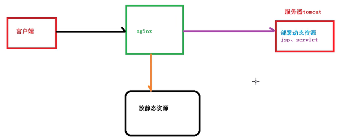
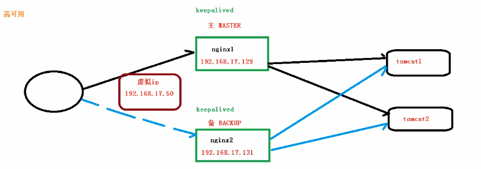
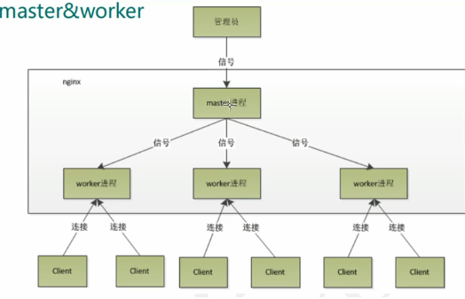
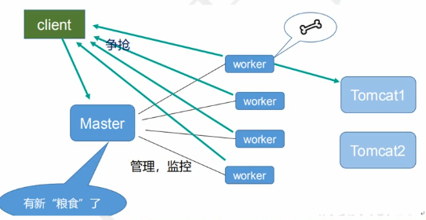

# NIGNX

## 1. 基本概念

### 1.1 正向代理

需要我们自己配置代理服务器，我们的请求都经过代理服务器，这个叫做正向代理。

### 1.2 反向代理

客户端对代理是无感知的，客户端不需要做任何配置。服务器方对外暴露反向代理服务器的地址，然后客户端所有请求都是直接与反向代理服务器交互，反向代理服务器会根据请求去和要请求的服务器尽心交互，再将结果返回给客户端。

### 1.3 负载均衡

通过代理服务器，将请求平均分到代理服务器中。


1. nginx 的 upstream目前支持 4 种方式的分配
   1)、轮询（默认）

   ```
   每个请求按时间顺序逐一分配到不同的后端服务器，如果后端服务器down掉，能自动剔除。
   ```

   2)、weight

   ```
   指定轮询几率，weight和访问比率成正比，用于后端服务器性能不均的情况。
   ```

   2)、ip_hash

   ```
   每个请求按访问ip的hash结果分配，这样每个访客固定访问一个后端服务器，可以解决session的问题。
   ```

   3)、fair（第三方）

   ```
   按后端服务器的响应时间来分配请求，响应时间短的优先分配。
   ```

   4)、url_hash（第三方）


### 1.4 动静分离

为了加快网站的解析速度，可以把动态页面和静态页面由不同的服务器来解析，加快解析速度，降低原来单个服务器的压力。




## 2. nginx 常用命令

```bash
# 前提必须进入nginx的目录中

# nginx 版本
./nginx -v

# 关闭nginx 命令
./nginx -s stop

# 重新加载 nginx
./nginx -s reload


```


## 3. nginx 配置文件

```bash
# 修改 nginx.conf 一般在/usr/local/nginx/conf/nginx.conf
```

由三部分组成，全局块、events块、HTTP块。

全局块中，从配置文件开始到events块之间的内容

### 3.1 全局部分

```bash
worker_process 1;
# 这是nginx服务器并发处理服务的关键配置，worker_process值越大，可以支持的并发处理量越多，但是受到硬件、软件等设备的制约。
```

### 3.2 events块

```bash
# 主要是nginx服务器与用户的网络连接。
events {
	worker_connections 1024; # 支持的最大连接数
}
```


### 3.3 http块

#### 3.3.1 全局块

指令包括文件引入、MIME-TYPE定义、日志自定义、连接超时时间、单链接请求数上限等。


#### 3.3.2 server块

和虚拟主机有密切关系。

每个http块可以包括多个server块，而每个server块相当于一个虚拟主机。

每个server快可以分为全局server块，以及可以同时包含多个location块。

1. 全局server块

   配置本虚拟主机的监听配置和本虚拟主机的名称和IP配置。

2. location块

   一个serve块可以配置多个location块。

   这块的主要作用是基于nginx服务器接收到的请求字符串（例如 server_name/uri-string），对虚拟主机名称（也可以是IP别名）之外的字符串（例如前面的 /uri-string）进行匹配，对特定的请求进行处理。地址定向、数据缓冲和应答控制等功能，还有许多第三方模块的配置也在这里进行。

## 4. 高可用





需要两台nginx服务器。

需要keepalived。

需要虚拟ip。

## 5. 原理

1. nginx启动后有master和worker。



2. worker的工作机制：




3. 

   

4. 一个master多个worker的好处：

5. 可以使用 nginx -s reload 热部署。

6. 对于每个worker是个独立的进程，不需要加锁。

7. 多路复用机制。（windows中没有，linux中有）。worker数和cpu数相等是最合适的，因为每个worker都可以把cpu性能发挥到极致。

8. 多少连接数最合适

9. 发送一个请求，占用了worker的几个连接数？

每次请求有和客户端的发送连接和接收连接，然后worker还要和tomcat交互也有两个连接，所以可以说成占用4个连接数，也可以说成两个（静态访问）。

2. nginx有一个master，四个worker，每个worker支持最大连接数1024。问支持的**最大并发数多少**？


    最大连接数 4 * 1024 / 2（静态访问）或 4 （反向代理，需要访问tomcat）= 并发数


## 操作

### 1.启动 Nginx

```javascript
systemctl start nginx
```

### 2.停止 Nginx

```javascript
systemctl stop nginx
```

### 3.重启 Nginx

```javascript
systemctl restart nginx
```

### 4.查看 Nginx 状态

```javascript
systemctl status nginx
```

### 5.启用开机启动 Nginx

```javascript
systemctl enable nginx
```

### 6.禁用开机启动 Nginx

```javascript
systemctl disable nginx
```

### 安装 Nginx

```javascript
sudo yum install -y nginx
```

安装成功后，默认的网站目录为： /usr/share/nginx/html

默认的配置文件为：/etc/nginx/nginx.conf

自定义配置文件目录为: /etc/nginx/conf.d/

