# 操作系统

## 1.操作系统的概念

1. 操作系统特征： 并发、 共享 、 虚拟、 异步。

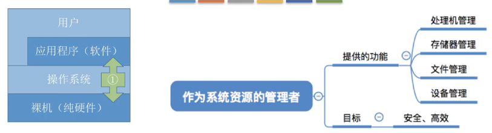

补充：进程是一个程序的执行过程。执行前需要将程序放入内存，才能被CPU处理。

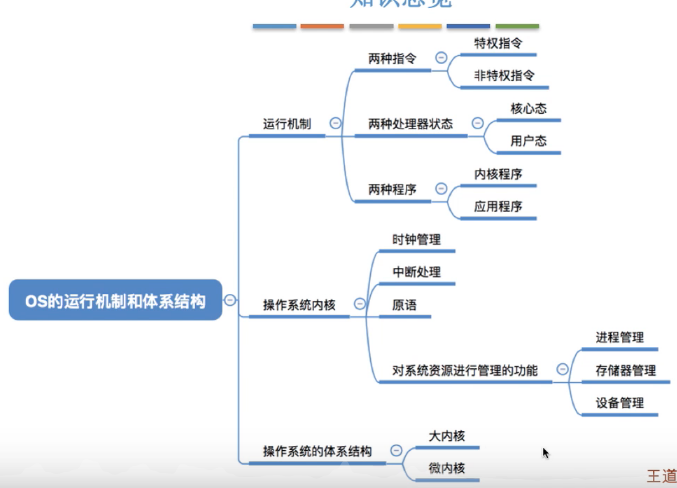

### 1.1处理器的两种状态


### 1.2 大内核微内核

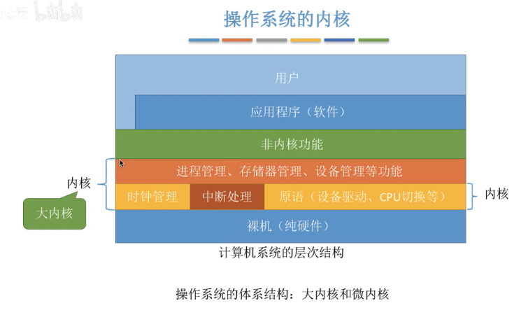

微内核：只包含一些必不可少的功能。

大内核：除了微内核还有其他非必要功能。


### 1.3 中断和异常

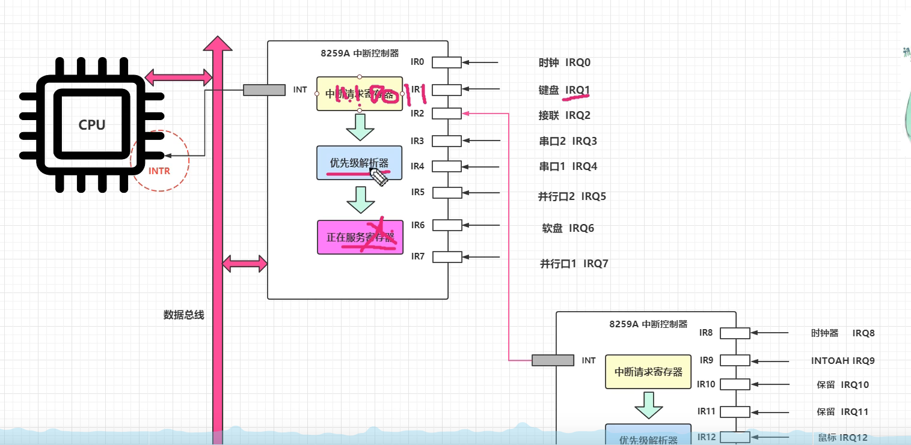


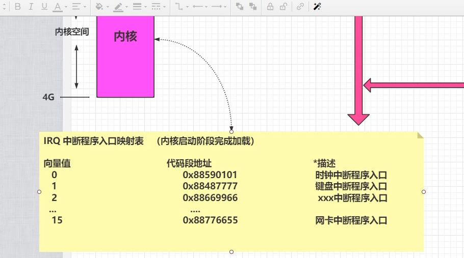

中断映射表，存储中断处理代码入口。寄存器里面解析出来的向量值，然后查映射表，就知道什么中断程序了。


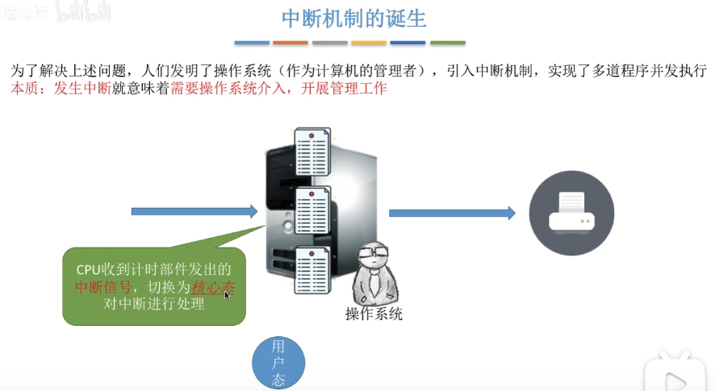

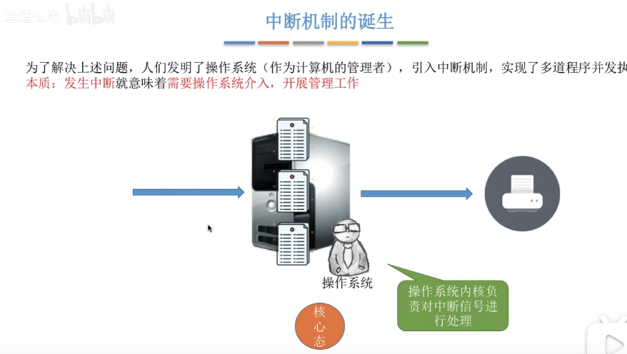

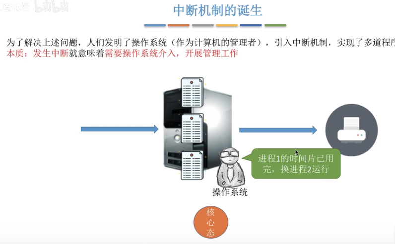

这些操作执行完成后，操作系统会把CPU的使用权交还给应用进程。

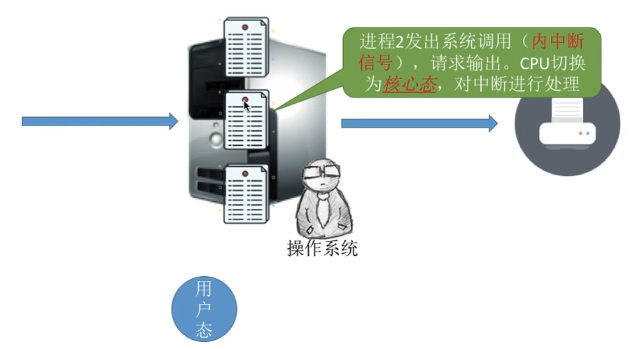

进程无法直接中断，所以只能通过系统调用的方式请求输出。

tips： 

* 由于操作系统的管理工作需要使用特权指令，因此CPU要从用户态转为核心态。中断可以使CPU从用户态切换为核心态，使操作系统获得计算机的控制权。有了中断，才能实现多道程序并发执行。
* <font color = "red">用户态--->核心态是通过中断实现的，并且中断是唯一途径。</font>核心态--->用户态的切换是通过执行特权指令，将程序状态字(PSW)的标志位设置为"用户态"。

#### 1.3.1中断的分类

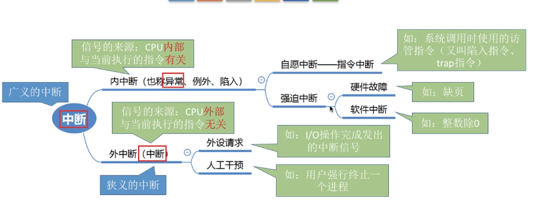

<font color = "red">看中断是来自CPU内部还是外部。</font>

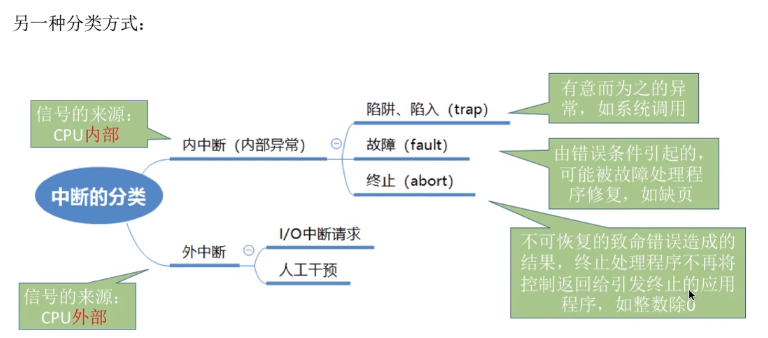


### 1.4 系统调用

* 系统调用是操作系统提供给应用程序使用的接口，可以理解为一种可供应用程序调用的特殊函数，应用程序可以发出系统调用来请求操作系统的服务。
* 系统调用和库函数有区别。

### 1.4.1库函数和系统调用的关系


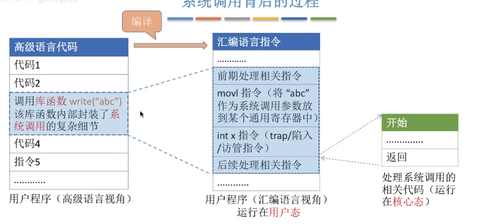

* 传递系统调用参数--->执行陷入指令（用户态）--->执行系统调用相应的服务程序(核心态)--->返回用户程序
* 陷入指令是在用户态执行的，执行陷入指令之后立即引发一个内中断，从而CPU进入核心态。
* 发出系统调用请求是在用户态，而对系统调用的相应处理在核心态进行。
* 陷入指令是唯一一个只能在用户态执行，而不可在核心态执行的指令
* 凡是与资源有关的操作、会直接影响到其他进程的操作，一定需要操作系统介入，需要系统调用来实现。

## 2. 进程与线程

### 2.1 状态转移

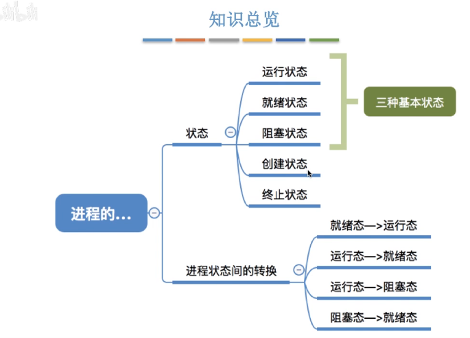

* 为了方便对各个进程的管理，操作系统将进车给划分为几种状态，三种基本状态：
  1. 运行态
  2. 就绪态
  3. 阻塞态

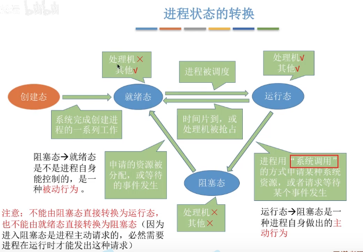

### 2.2 进程控制

对系统中的所有进程进行有效管理。

* 使用原语对进程的控制。

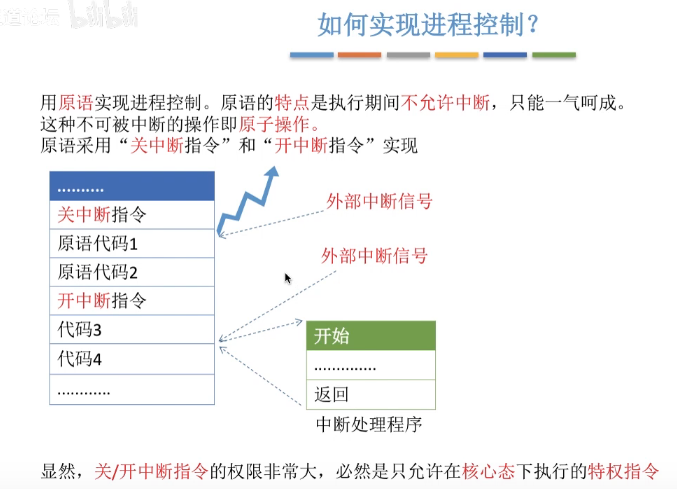

进程控制原语要做三类事情：

* 更新PCB中的信息（如修改进程状态标志、将运行环境保存到PCB）
  1. 所有进程控制原语一定都会修改进程状态标志
  2. 剥夺当前运行进程的CPU使用权必然需要保存其运行环境
  3. 某进程开始运行前必然要回复运行环境
* 将PCB插入合适队列
* 分配/回收资源

1. 进程创建原语


2. 进程撤销原语

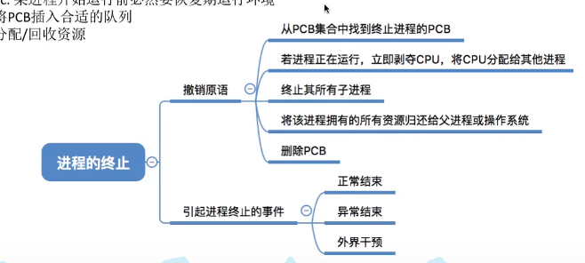

3. 进程阻塞和唤醒

阻塞和唤醒是成对出现的。

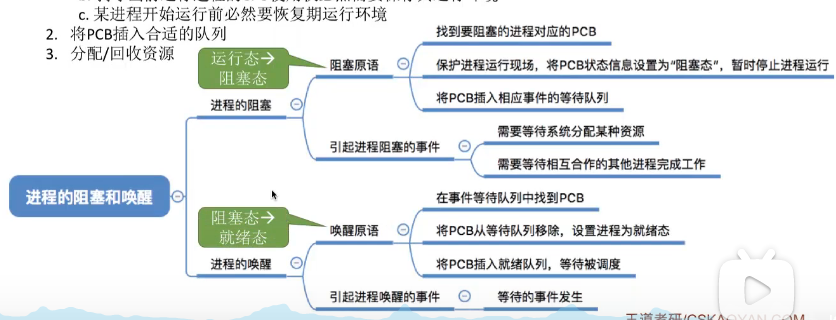

4. 进程的切换原语

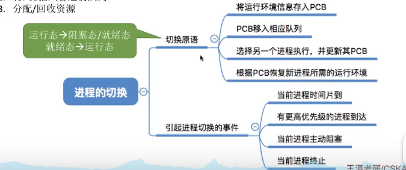

### 2.3 进程通信

* 进程之间的信息交换和传递。
* 操作系统通信分类

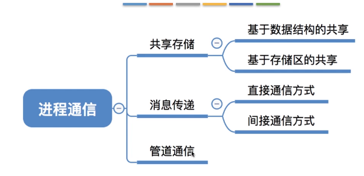

1. 共享存储

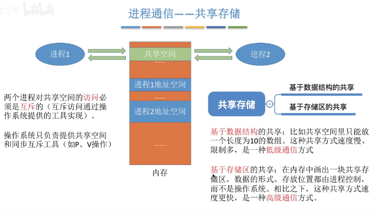

2. 管道通信

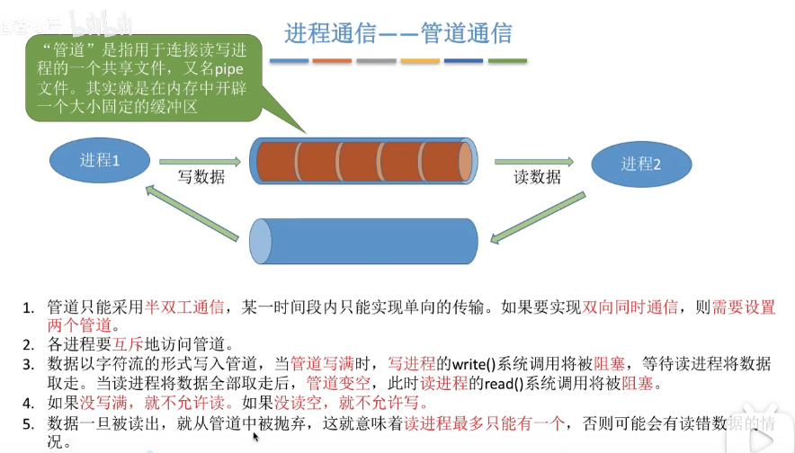

3. 消息传递

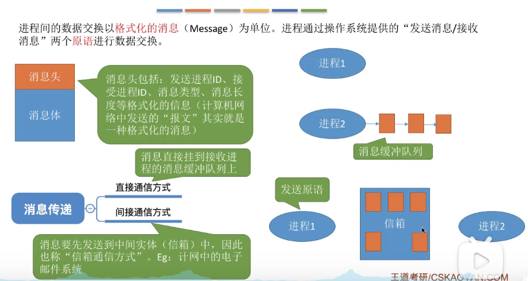

### 2.4 进程调度

调度有三个层次：

1. 高级调度 （调入内存）


2. 中级调度

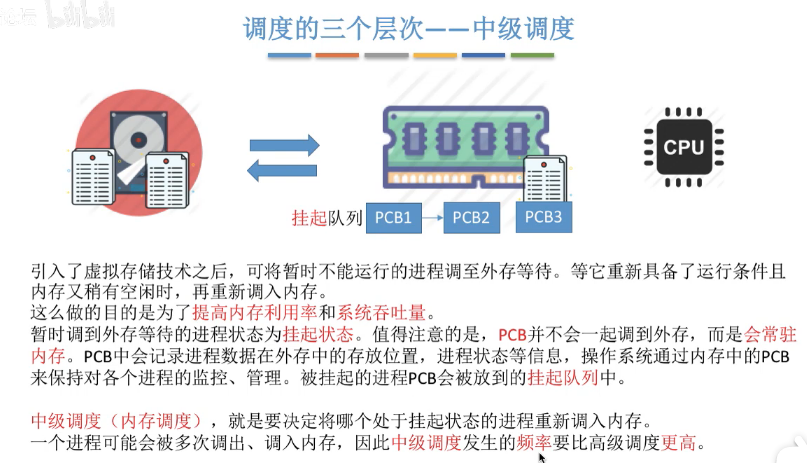

* 挂起状态的七状态模型

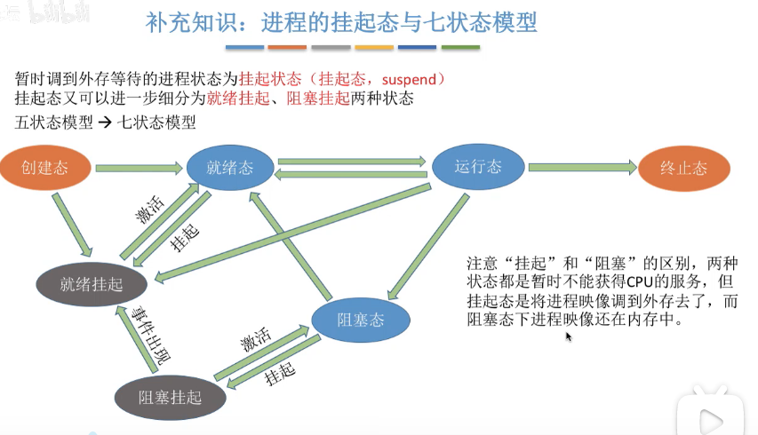

* 低级调度（进程调度）

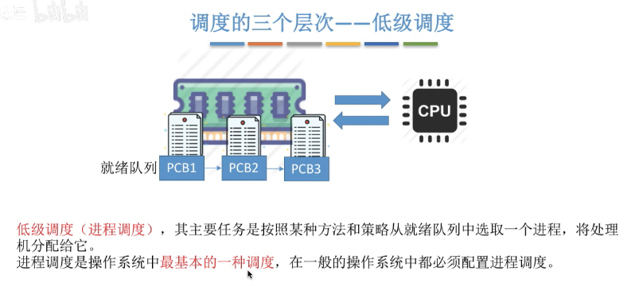

### 2.5 进程调度时机和切换过程

#### 2.5.1 调度算法

1. 先来先服务（FCFS)

* 主要从公平的角度考虑。
* 用于进程调度时，考虑的是哪个进程先到达就绪队列。
* 非抢占式算法。

2. 短作业优先（SJF）

* 当前到达的运行时间最短的进程。（默认非抢占式）
* 抢占式的短作业优先调度算法。

每当有进程加入就绪队列就需要重新调度。如果新到达的进程剩余时间比当前运行的进程剩余时间更短，则新进程抢占处理机。

3. 高响应优先（HRRN)

* 非抢占式算法

* 每次调度时先计算各个进程的响应比，选择响应比最高的作业/进程为其服务。
* 响应比= （等待时间+要求服务时间）/要求服务时间

tips:这三种算法主要适用于早期的批处理系统。

### 2.5.2 新调度算法

1. 时间片轮转

* 按照各个进程到达就绪队列的顺序，轮流让各个进程执行一个时间片。若进程未在一个时间片内执行完，则剥夺处理机，将进程重新放到就绪队列队尾重新排队。

* 分时操作系统
* 如果时间片太大，就会退化为先来先服务算法。
* 时间片太小，进程切换太频繁。
* 切换进程的开销不超过1%才是合适的时间片。

2. 优先级调度算法

* 为每一个进程设置优先级，选择优先级最高的进程

* 非抢占式
* 抢占式

当前出现的进程优先级最高，那么优先级高的会抢占处理机。

* 操作系统会更偏好I/O型进程

3. 多级反馈队列调度算法（折中平衡）

* 对其他调度算法的折中权衡
* 抢占式算法

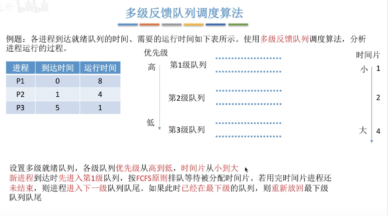

* 注意新进程先进入第一级队列。
* 优先级高的队列内容会抢占处理机。

### 2.6 进程同步和互斥

* 异步性：各并发执行的进程各自独立、不可预知的速度推进。

  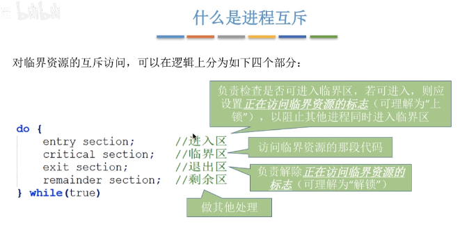

* 进程互斥的四个原则

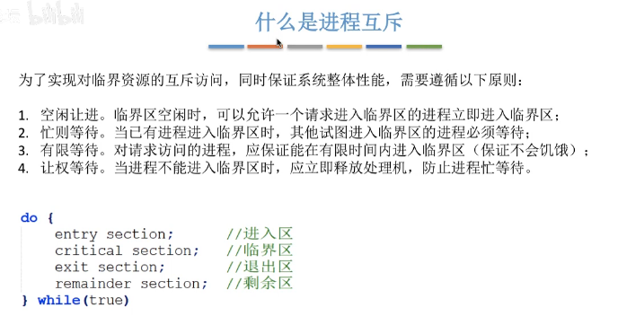

2. 软件实现方法

3. 单标志法

两个进程在访问完临界区后会把适用临界区的权限转交给另一个进程。每个进程进入临界区的权限只能被另一个进程赋予。

* 违背了空闲让进原则

2. 双标志先检查

设置布尔型数组，数组中各个元素来标记各进程想进入临界区的意愿。

* 违背忙则等待原则

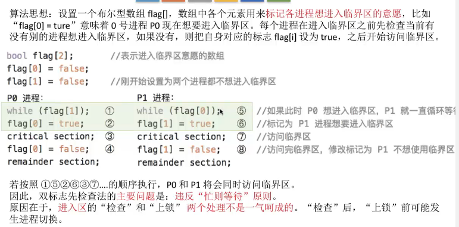

3. 双标志后检查

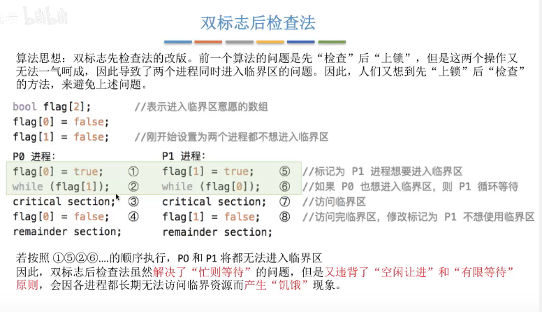

* 违背了“空闲让进”和“有限等待”

4. Peterson算法

* 孔融让梨


### 2.7 信号量机制

* 信号量其实就是一个变量，用来表示系统中某种资源的数量。

1. 整型信号量

* 表示系统中某种资源的数量。

* 一直等待

2. 记录型信号量

* 解决忙等问题


* 信号量机制在“前操作”之后对相应的同步变量执行V操作。
* 在“后操作”之前对相应的同步变量执行P操作。


### 2.8 管程

高级的同步机制。因为PV操作还得程序员自己写很复杂，所以管程相当于把这些操作封装成一个类。

管程可以直接使用这些定义的函数。

每次只允许一个进程在管程内执行某个内部过程。 

### 2.9 死锁

进程并发执行，各个进程互相等待对方手里的资源，导致被阻塞都无法向前推进。

* 饥饿。由于长期得不到想要的资源，某进程无法向前推进的现象。（操作系统分配资源不合理，比如短进程优先算法）。
* 死循环。某进程执行过程中一直跳不出来的现象。

1. 预防死锁。

破坏死锁产生的四个必要条件中的一个或几个。

* 破坏不可剥夺条件

a 当某个进程请求新的资源得不到满足时，它必须立即释放所有资源，待以后需要时再重新申请。即使某些资源尚未使用完，也需要主动释放，从而破坏了不可剥夺条件。

可能会造成某个进程之前得工作失效。

* 请求和保持条件

解释：进程已经保持了一个资源，但是提出新的资源请求，而该资源又被其他进程所占有，此时请求进程被阻塞，但是又对自己有的资源保持不放。

a 可以采用静态分配方法，即进程在运行前申请完它所需要的全部资源，在它的资源未满足前，不让它投入运行。

* 破坏循环等待条件

a 采用顺序资源分配法。首先给系统中的资源编号，规定每个进程必须按照编号递增的顺序请求资源。同类资源（即编号相同的资源）一次申请完。（一个进程只有小的资源才能申请大的资源，有大的资源后不会再申请小的资源）。

2. 避免死锁。

用某种方法防止系统进入不安全状态，从而避免死锁（银行家算法）。

* 银行家算法

如果分配了资源之后，找不到任何一种安全序列，系统进入了不安全状态。

a 检查此次申请是否超过了之前声明的最大需求数

b 检查此时系统剩余的可用资源是否还能满足这次请求

c 试探分配，更改各数据结构

d 用安全算法检查此次分配是否会导致系统进入不安全状态

3. 死锁的检测和避免。

允许死锁的发生，不过操作系统会负责检测出死锁的发生，然后采取某种措施解除死锁。

<font color = "red"> 死锁定理</font>：如果某时刻系统的资源分配图是不可完全简化的，那么此时系统死锁。

用死锁检测算法简化资源分配图后，还连这边的那些进程就是死锁进程。

解除死锁的几种方法：

* 资源剥夺法。挂起某些死锁进程，并抢占它的资源，将它的资源分配给其他死锁进程。但是应该防止被挂起的进程长时间得不到资源而饥饿。
* 撤销进程法。强制撤销部分、甚至全部死锁进程，并剥夺这些进程的资源。这种方式的优点是实现简单，但所付出的代价可能很大。因为有些进程运行了很长时间接近结束。
* 进程回退法： 让一个或多个死锁进程回退到足以避免死锁的地步。这就要求系统记录进程的历史信息，设置还原点。

### 3. 内存管理

#### 3.1 地址转换

三种装入方式：

a 绝对装入 编译时产生绝对地址 （编译器负责）

b 可重定位装入 装入时将逻辑地址转换为物理地址（装入器地址）

c 动态运行时装入 运行时将逻辑地址转换为物理地址，需设置重定位寄存器 （现代操作系统）

#### 3.2 内存保护

一个进程只能访问自己的内存空间。

两种方式：

a 设置上下限寄存器

b 利用重定位寄存器、界地址寄存器（限长寄存器）

#### 4.3 覆盖与交换

覆盖技术：

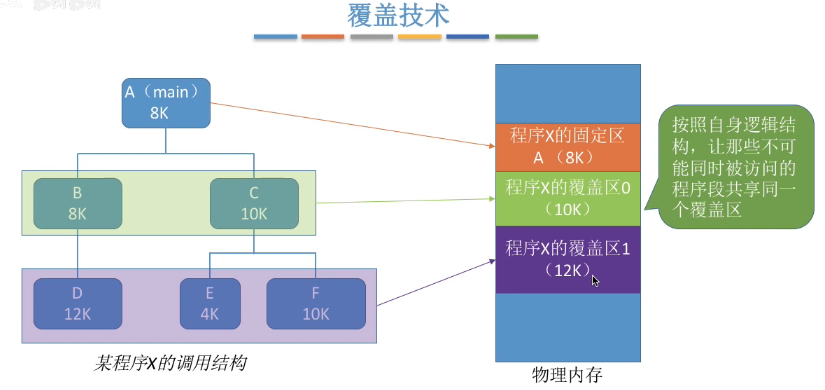

交换技术：

内存紧张，内存中某些进程暂时换出外存。 

对换区和文件区。

#### 4.4 连续分配管理方式

a 固定分区

b 单一连续分配方式

* 分区说明表 

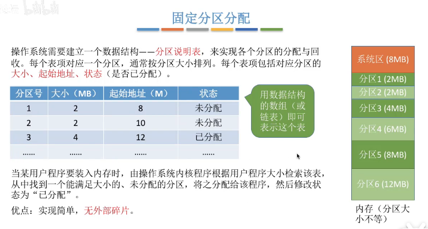

动态分区分配：不会预先划分内存分区，而是在进程装入内存时根据进程的大小动态建立分区。

使用的数据结构：空闲分区表和空闲分区链。

<font color = "red">动态分区分配算法:</font>

概念：在动态分区分配方式中，当有很多个空闲分区都能满足需求时，应该选择哪个分区进行分配？

* 首次适应算法(First Fit)

每次都从最低地址开始查找，找到第一个能满足大小的空闲分区。空闲分区以地址递增的次序排列。每次分配内存时顺序查找空闲分区链，找到大小能满足要求的第一个空闲分区。

* 最佳适应算法(Best Fit)

（为分区大小排了序）为各个进程分配的空间必须是连续的一整片区域。因此为了保证“大进程”到来时能有连续的大片空间，可以尽可能多地留下大片的空闲区，优先使用更小的空闲区。


* 最坏适应算法(Worst Fit)

优先使用最大的连续空闲分区。（为了解决最佳适应算法留下太多难以利用的小碎片）。

* 邻近适应算法(Next Fit)

解决首次适应算法中的问题。

分区以地址递增顺序排列，每次分配内存从上次查找结束的位置开始查找空闲分区链。


#### 4.5非连续分区分配


页面和页框是一一对应的关系。页号和页内偏移量。

页号=逻辑地址/页面长度(取除法的整数部分)

页内偏移量=逻辑地址%页面长度（取除法的余数部分）

<font color = "red">地址转换：</font>

1. 算出逻辑地址对应的页号
2. 该页号对应页面在内存中的起始地址
3. 算出偏移量
4. 物理地址=页面始址+页内偏移量

基本地址变换机构可以借助进程的页表将逻辑地址转换为物理地址。 页表：页表存储了几个页。每个页叫页表项。

通常会在系统中设置一个页表寄存器(PTR)，存放<font color = "red">页表在内存中的起始地址F和页表长度M</font>。进程未执行时，页表的始址和页表长度放在进程控制块（PCB）中，当进程被调度时，操作系统内核会把它们放在页表寄存器中。


每个进程有一个页表，页表项由页号和块号组成。

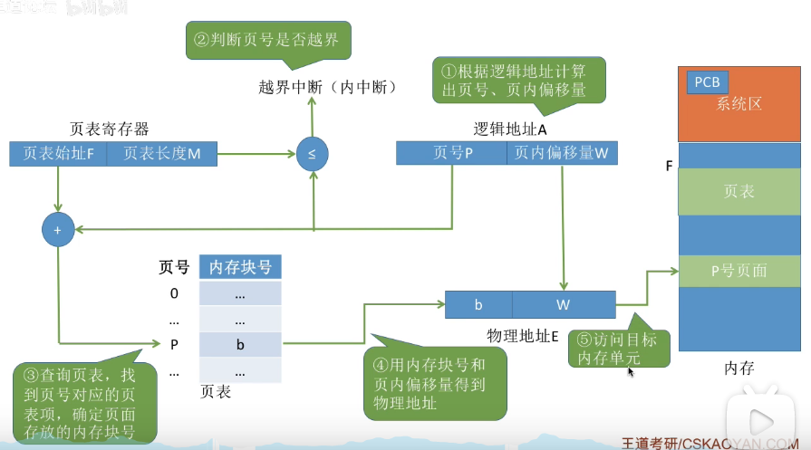


* 


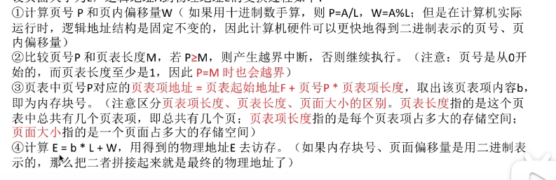


### 4.6 具有快表的地址变换结构

* 时间局部性

  不久之后某条指令会再次被执行

* 空间局部性

  一旦程序访问了某个存储单元，在不久之后，其附近的存储单元也很有可能会被访问。（很多数据在内存中都是连续存放的）。

  所以，连续很多次查到的是同一个页表项。

概念： 快表，又称为联想存储器，是一种访问速度比内存快很多的高速缓冲存储器。

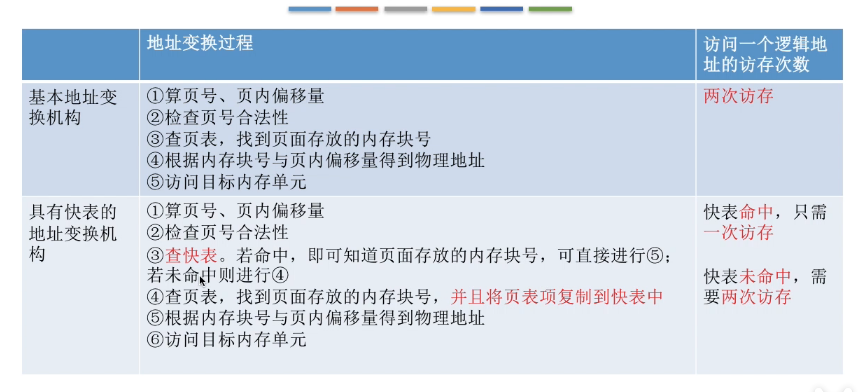


### 4.7 两级页表

* 单级页表问题

某计算机地址按字节寻址，支持32位的逻辑地址，采用分页存储管理，页面大小为4KB，页表项长度为4B。

4KB=$2^{12}$B，因此页内地址要用12位表示，剩余20位表示页号。

因此，该系统中用户进程最多有$2^{20}$页，一个进程的页表中，最多会有$2^{20}=1M$个页表项，所以一个页表项最大需要$2^{20}*4B=2^{22}B$，共需要$2^{22} / 2^{12} = 2^{10}$个页框存储该页表。

* 页表要连续存放，因此当页表很大，需要占用很多连续页框
* 没必要让整个页表常驻内存，因为进程在一段时间内只需要访问某几个特定的页面。

再分配页目录表。

* 代价，增加内存访问次数。


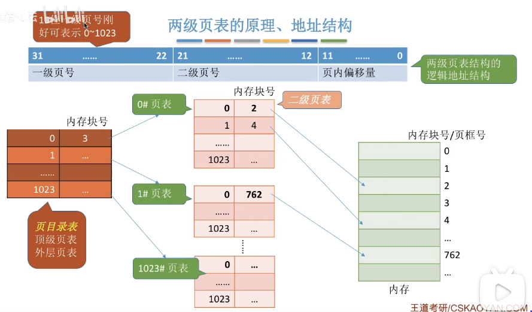

#### 4.8 基本分段存储管理

与“分页”最大的区别就是离散分配时所分配地址空间的基本单位不同。 段表寄存器。

进程的地址空间：按照程序自身的逻辑关系划分为若干段，每个段都有一个段名，每段从0开始编址。

内存分配规则：以段为单位进行分配，每个段在内存中占据连续空间，但各段之间可以不相邻。

每个进程建立一张段映射表，简称“段表”。

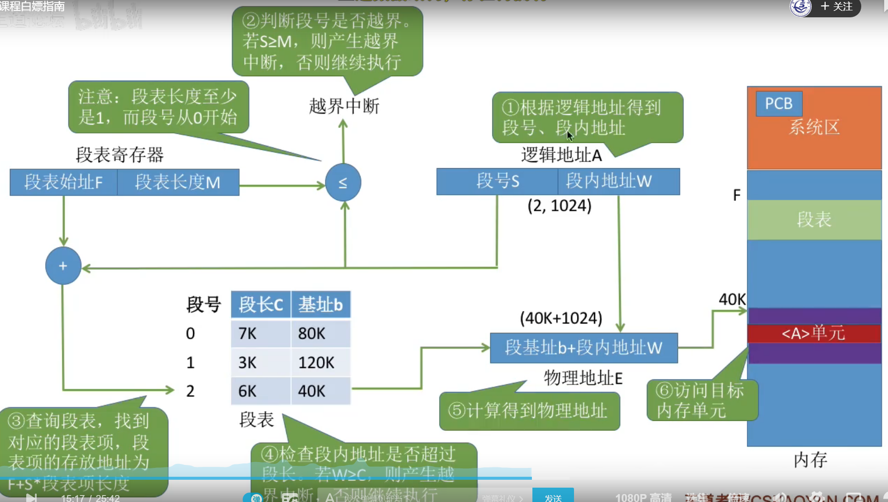

和分页管理的区别：

* 分页每个页面长度相同。分段不同
* 分页不需要对页内偏移量越界检查，分段必须要。

### 4.9 段页式存储管理

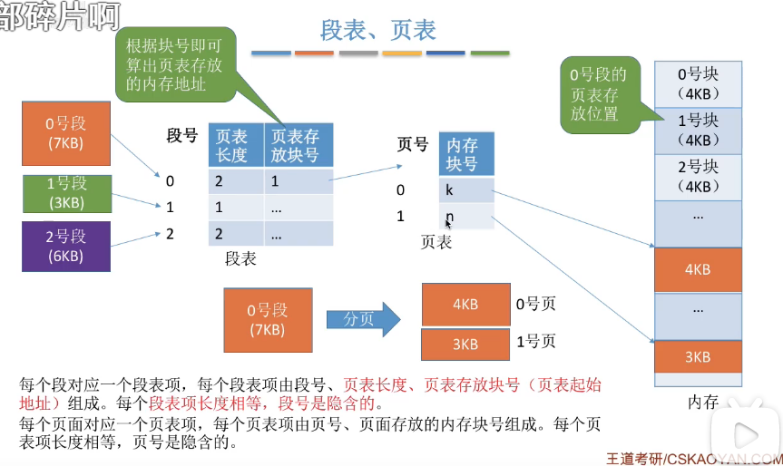

一个进程对应一个段表，一个进程可能对应多个页表。

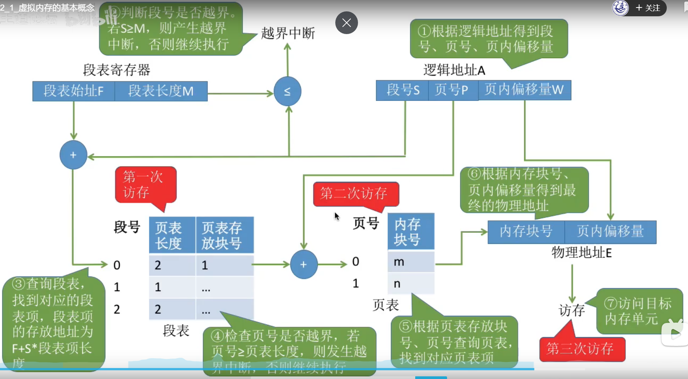


```java
int[] A = new int[10];
//分段 1 
< 10 给页内偏移量。 A[5];
```

## 5. 虚拟内存

虚拟内存的最大容量由计算机的地址结构确定的

虚拟内存的实际容量 = min(内存和外存容量之和，CPU寻址范围)


特征：

* 多次性：无需在作业运行时一次性全部装入内存，而是允许被分成多次调度内存。
* 对换性：在作业运行时无需一直常驻内存，而是允许在作业运行过程中，将作业换入、换出。
* 虚拟性：逻辑上扩充内存容量。看到的容量远远大于实际容量。

虚拟内存技术需要建立在<font color = "red">离散分配</font>的内存管理方式的基础上。


### 5.1 请求分页管理方式


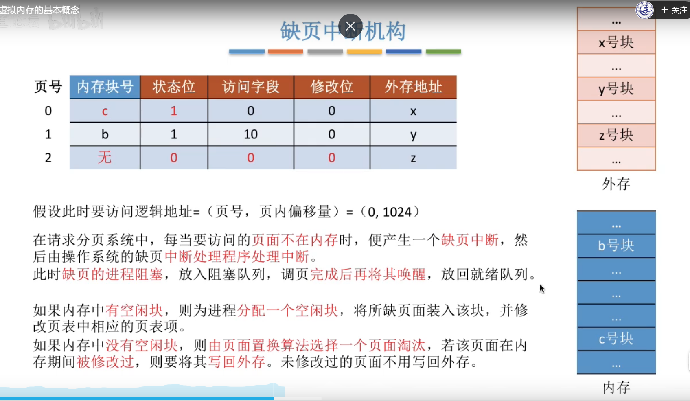

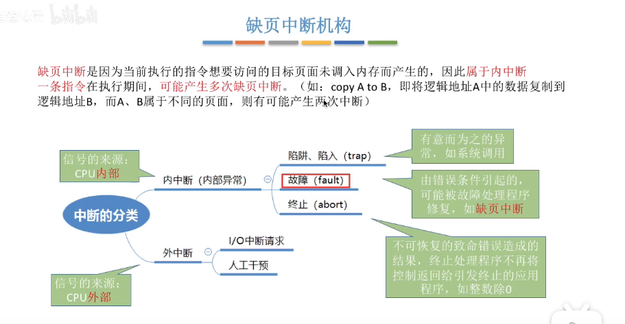

与基本分页的区别


### 页面置换算法

页面的换入换出需要磁盘IO，因此次数要尽可能少。


1. 最佳置换

每次选择淘汰的页面将是以后永不使用，或者在最长时间内不再被访问的页面。根据以后的序列的出现次序定替换哪个算法。

2. 先进先出

每次淘汰的页面是最早进入内存的页面。当为进程分配的物理块数增大时，缺页次数不减反增（belady异常）。

3. 最近最久未使用 LRU算法 

4. 时钟置换算法

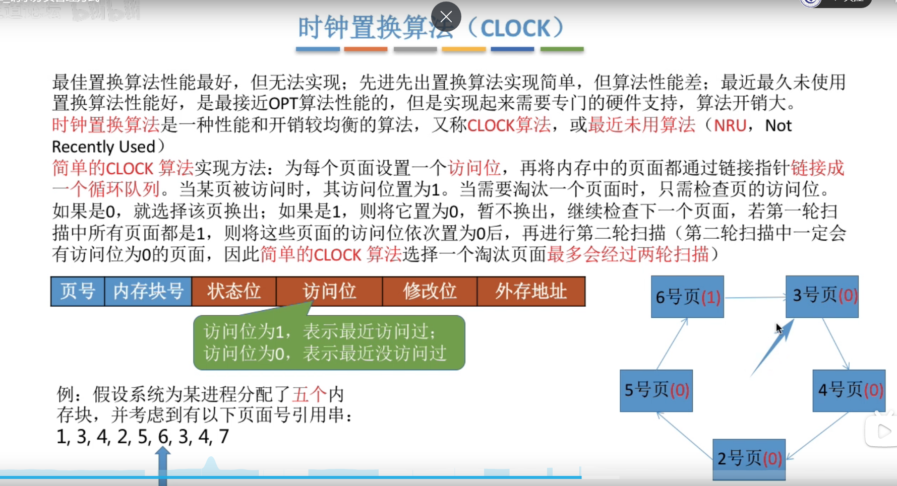

5. 改进型的时钟置换算法

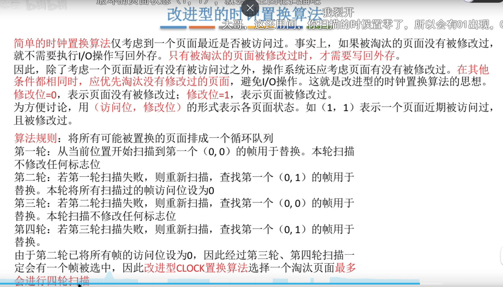

### 5.3 页面分配策略

驻留集：指请求分页存储管理中给进程分配的物理块的集合。

驻留集有固定分配和可变分配两种分配方式。区别在运行期间可以适当增加和减少。

局部置换： 发生缺页时只能选进程自己的物理块进行置换。

全局置换：将系统保留的空闲物理块分配给缺页进程。

合起来总共有三种分配策略：

1. 固定分配局部置换（固定分配没有全局置换）。
2. 可变分配全局置换。系统有一个空闲物理块队列。
3. 可变分配局部置换。根据缺页的频率动态地增加和减少进程的物理块。

* 何时调入页面

  1. 预调页策略：根据局部性原理，一次调入若干个相邻页面可能比一次调入一个页面更高效。<font color = "red">主要用于进程的首次进入</font>

  2. 请求调页策略：程序在运行期间发现缺页时才将所缺页面调入内存。

* 何处调入页面

  外存： 对换区和文件区。

### 5.4 总结

#### 5.4.1 虚拟地址空间

在早期的计算机中，程序是直接运行在物理内存上的，那个时候的计算机和程序内存都很小。程序运行时会把其全部加载到内存，只要程序所需的内存不超过计算机剩余内存就不会出现问题。

但由于程序是可以直接访问物理内存的，这也带来了内存数据的不安全性，轻则程序挂掉，重则操作系统崩溃。

所以，我们希望程序间的内存数据是安全的互不影响的。同时计算机程序直接运行在物理内存上也导致了内存使用率较低，程序运行内存地址不确定，不同的运行顺序甚至会出错。此时在程序的执行过程中，已经存在着大量在物理内存和硬盘之间的数据交换过程。

基于以上问题，那我们可以是不是考虑在物理内存之上增加一个中间层，让程序通过虚拟地址去间接的访问物理内存呢。通过虚拟内存，每个进程好像都可以独占内存一样，每个进程看到的内存都是一致的，这称为虚拟地址空间。

（这种思想在现在也用的很广泛，例如很多优秀的中间层：Nginx、Redis 等等）

这样只要系统处理好虚拟地址到物理地址的映射关系，就可以保证不同的程序访问不同的内存区域，就可以达到物理内存地址隔离的效果，进而保证数据的安全性。

#### 5.4.2 分段与分页

进程是操作系统资源分配的最小单元。操作系统分配给进程的内存空间中包含五种段：数据段、代码段、BSS、堆、栈。

- 数据段：存放程序中的静态变量和已初始化且不为零的全局变量。
- 代码段：存放可执行文件的操作指令，代码段是只读的，不可进行写操作。这部分的区域在运行前已知其大小。
- BSS 段( Block Started By Symbol)：存放未初始化的全局变量，在变量使用前由运行时初始化为零。
- 堆：存放进程运行中被动态分配的内存，其大小不固定。
- 栈：存放程序中的临时的局部变量和函数的参数值。

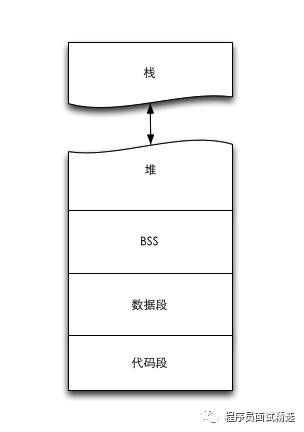


那么分段的技术可以解决什么问题呢？

> 假设程序 A 的虚拟地址空间是 0x00000000~0x00000099，映射到的物理地址空间是 0x00000600~0x00000699，程序 B 的虚拟地址空间是 0x00000100~0x00000199，映射到的物理地址空间是 0x00000300~0x00000399。
>
> 假设你手残，在程序 A 中操作了地址 0x00000150，但是此时的地址 0x00000150 是虚拟的，而虚拟化的操作是在操作系统的掌控中的，所以，操作系统有能力判断，这个虚拟地址 0x00000150 是有问题的，然后阻止后续的操作。所以，这里体现出了隔离性。（另一种体现隔离性的方式就是，操作同一个虚拟地址，实际上可能操作的是不同的物理地址）

所以通过分段机制，我们可以更好的控制不同段的属性，这有利于内存的组织安排，可以对不同的属性代码、数据进行更方便的管理。如果是打乱的放在内存中，那么读写属性就很难控制。

程序运行地址和物理地址的隔离保证了程序内存数据的安全性，也解决了同一个程序运行地址不确定的问题，但是物理内存使用效率低下的问题依然没有得到解决，因为分段机制映射的是一片连续的物理内存。

于是大佬们又提出了分页的办法。分页其实就是把段空间更细分了一下，粒度更小。此时物理内存被划分为一小块一小块，每块被称为帧(Frame)。分配内存时，帧是分配时的最小单位。

在分段方法中，每次程序的运行都会被全部加载到虚拟内存中；而分页方法则不同，单位不是整个程序，而是某个“页”，一段虚拟地址空间组成的某一页映射到一段物理地址空间组成的某一页。它将少部分要运行的代码加载到虚拟内存中，通过映射在物理内存中运行，从而提高了物理内存的使用率。

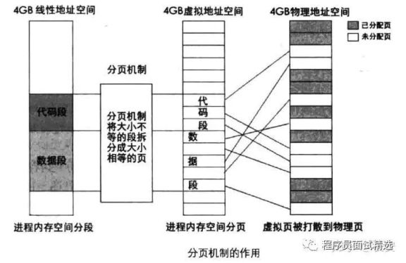


为了方便 CPU 高效执行管理物理内存，每一次都需要从虚拟内存中拿一个页的代码放到物理内存。虚拟内存页有三种状态，分别是未分配、已缓存和未缓存状态。

**未分配：**指的是未被操作系统分配或者创建的，未分配的虚拟页不存在任何数据和代码与它们关联，因此不占用磁盘资源；

**已缓存：**表示的是物理内存中已经为该部分分配的，存在虚拟内存和物理内存映射关系的；

**未缓存：**指的是已经加载到虚拟内存中的，但是未在物理内存中建立映射关系的。

#### 5.4.3 页表

虚拟内存中的一些虚拟页是要缓存在物理内存中才能被执行的，因此操作系统存在一种机制用来判断某个虚拟页是否被缓存在物理内存中，还需要知道这个虚拟页存放在磁盘上的哪个位置，从而在物理内存中选择空闲页或者更新缓存页，并将需要的虚拟页从磁盘复制到物理内存中。这些功能是由软硬件结合完成的，其存放在物理内存中一个叫页表的数据结构中。

虚拟内存和物理内存的映射通过页表(page table)来实现。每个页表实际上是一个数组，数组中的每个元素称为页表项(PTE, page table entry)，每个页表项负责把虚拟页映射到物理页上。在 物理内存中，每个进程都有自己的页表。

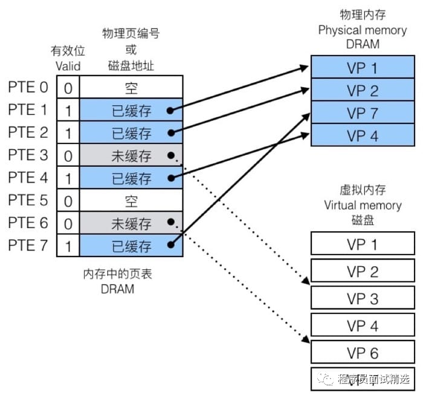

因为有一个表可以查询，就会遇到两种情况，一种是命中(Page Hit)，另一种则是未命中(Page Fault)。

命中的时候，即访问到页表中蓝色条目的地址时，因为在 DRAM 中有对应的数据，可以直接访问。

不命中的时候，即访问到 page table 中灰色条目的时候，因为在 DRAM 中并没有对应的数据，所以需要执行缺页置换。

在上图中，四个虚拟页 VP1 , VP2, VP4 , VP7 是被缓存在物理内存中。两个虚拟页 VP0, VP5 还未被分配。但是剩下的虚拟页 VP3 ,VP6 已经被分配了，但是还没有缓存到物理内存中去执行。

#### 5.4.4 总结

通过虚拟地址空间和页表的回顾，现在大家应该明白为什么要引入虚拟内存了吧。

虚拟内存是计算机系统内存管理的一种技术，虚拟地址空间构成虚拟内存。它使得应用程序认为它拥有连续可用的内存（一个连续完整的地址空间），而实际上，它通常是被分隔成多个物理内存碎片。还有部分暂时存储在外部磁盘存储器上（Swap），在需要时进行数据交换。

**虚拟内存不只是用磁盘空间来扩展物理内存** 的意思——这只是扩充内存级别以使其包含硬盘驱动器而已。把内存扩展到磁盘只是使用虚拟内存技术的一个结果。除了扩展内存空间，虚拟内存技术还有隔离运行内存和确定运行地址的作用。

使用虚拟内存主要是基于以下三个方面考虑，也就是说虚拟内存主要有三个作用：

作为缓存工具，提高内存利用率：使用 DRAM 当做部分的虚拟地址空间的缓存（虚拟内存就是存储在磁盘上的 N 个连续字节的数组，数组的部分内容会缓存在 DRAM 中）。扩大了内存空间，当发生缺页异常时，将会把内存和磁盘中的数据进行置换。

作为内存管理工具，简化内存管理：每个进程都有统一的线性地址空间（但实际上在物理内存中可能是间隔、支离破碎的），在内存分配中没有太多限制，每个虚拟页都可以被映射到任何的物理页上。这样也带来一个好处，如果两个进程间有共享的数据，那么直接指向同一个物理页即可。

作为内存保护工具，隔离地址空间：进程之间不会相互影响；用户程序不能访问内核信息和代码。页表中的每个条目的高位部分是表示权限的位，MMU 可以通过检查这些位来进行权限控制（读、写、执行）。


## 6. 文件管理


* 文件如何存储

* 文件内部应该如何组织
* 文件之间应该如何组织


### 6.1 文件的逻辑结构

* 无结构文件

  文件内部的数据是一系列二进制文件流或字符流组成。又称为”流式文件“。如windows操作系统的.txt文件。

* 有结构文件

  * 顺序文件
    * 文件中的记录一个接一个地顺序排列（逻辑上），记录可以是定长的或可变长的。各个记录在物理上可以顺序存储或链实存储。
  * 索引文件
  * 索引顺序文件

记录式文件，由一组相似的记录组成，比如excel表中的学生信息。

## 7. 程序的机器级表示


### <font color = "blue">内存管理</font>

简述进程切换的流程
涉及公司：阿里云实习生

如果想要从A进程切换到 B 进程，必定要先从用户态切换到内核态，因为这个切换的工作你不能让用户进程去实现，不然当 CPU 在用户进程手上的时候，他可以选择一直执行，不让出 CPU，这肯定是不允许的。所以操作系统需要先挂起正在占用 CPU 的 A 进程，才能切换到 B 进程。

由于从用户态切换到内核态的时候，CPU 是在用户进程手中，所以这个是通过硬中断来实现的。在从用户态切换到内核态之前需要保存用户进程的上下文，以便下一次执行时可以继续之前的工作。

这个上下文就是进程执行的环境，包括所有的寄存器变量，进程打开的文件、内存信息等。一个进程的上下文可以分为用户级上下文，寄存器上下文，系统级上下文。用户级上下文存储的是用户进程的内存数据以及堆栈数据等；寄存器上下文是一些通用寄存器；系统级上下文是内核栈、PCB (进程控制块)等。

### <font color = "blue">进程在地址空间中会划分为哪些区域</font>

涉及公司：阿里云实习生

这个问题在我之前的工作中其实还是有所涉及的，我来简单讲一下把文件加载到内存中的一个过程，以 Window 平台为例吧，PE 文件我比较熟，在 PE 文件中，有一个叫节的概念，节是PE文件中存放代码和数据的基本单元，用以存储不同类型的数据，比如 data 节、code 节等，一个节的所有原始数据必须加载到连续的内存空间里，这也就造成了在虚拟地址空间中的区块划分。

在虚拟地址空间中会按照节划分为代码段、数据段、未初始化的数据段以及堆栈这些区块。

### <font color = "blue">栈与堆有什么区别</font>

涉及公司：阿里云实习生、拼多多实习生

我们常说堆栈堆栈，其实堆栈是两个不同的概念，最直观的理解，堆是由用户来控制的，我们可以使用 malloc 这种命令来在堆中申请内存，而栈是由操作系统控制的，在栈中存储的是这个进程的局部变量等，比如我们用 malloc 来申请一块内存，内存本身是在堆中开辟的，而指向这块内存的指针存储在栈中。

### <font color = "blue">操作系统为什么分内核态和用户态，这两者之间如何切换</font>

涉及公司：拼多多实习生

因为在CPU的指令中，有一些是非常危险的，比如清理内存、设置时钟等，如果所有的程序都能使用，就可能造成系统的崩溃，所以，CPU 将指令分为特权指令和非特权指令，对于那些危险的指令，只允许操作系统使用。CPU 的特权级别有四级，从 Ring0 到 Ring3，正常使用时一般只有两级，即用户态的 Ring3 和内核态的 Ring0。Ring3 状态不能访问 Ring0 的地址空间，包括代码和数据。

### <font color = "blue">用户态切换到内核态的三种方式</font>

系统调用（系统调用是通过软中断实现的）
中断（硬）
异常

### <font color = "blue">malloc的实现机制</font>

涉及公司：阿里云实习生

malloc 本质上是维护了一个内存空闲链表，每次我们调用 malloc 申请空间的时候，链表就会从头开始遍历，来寻找一个合适的空闲内存空间，然后把这个空间给分割开，一步步分配给用户，另一部分继续标注为空闲，而当没有足够大的空闲块时，malloc 就会通过系统调用来申请更多的内存块。而我们调用 free 来释放内存块的时候，该内存块就会回到链表中，并且相邻的内存块会被合并。

搜索空闲块的算法主要有首次适配、下一次适配、最佳适配，首次适配即第一次找到足够大的内存块就分配，但这样会产生很多的内存碎片，也因此第二次适配被提出来缓解这个问题。另一个极端则是最佳适配，即找到一块刚好大于我们所需内存大小的内存块，这种做法一方面耗时长，另一方面也会产生一些极小的内存碎片。
这两种思路可以看出是在性能和空间利用率上寻找一个平衡点，在工程中实际上有很多这种没有完美解决方案，只能寻找平衡的问题。

### <font color = "blue">虚拟地址怎么映射到物理地址</font>

涉及公司：阿里云实习生、腾讯实习生

虚拟地址的构成为页目录索引 (10位) +页表索引 (10位) +表内偏移 (12位)

以 win32 系统为例，页目录和页表都为 1024 个，页大小为 4KB，一共是 4G 的虚拟内存空间

而从虚拟地址映射到物理地址实际上就是通过页目录和页表的索引找到内存页。

在页表项中有一位标志位，用来标识包含此数据的页是否在物理内存中，如果在的话，就直接做地址映射，否则，抛出缺页中断，操作系统会把次数据页调入内存。

### <font color = "blue">socket 编程中怎么处理并发请求</font>

涉及公司：阿里云实习生、腾讯实习生

对多线程的处理与单线程不同的位置在于各个不同的进程可能会访问相同的资源，如果是对资源进行修改的话，就需要用到锁

### <font color = "blue">简述 IO 多路复用</font>

涉及公司：阿里云实习生、腾讯实习生

Linux的IO访问通常是先将数据拷贝到操作系统的内核缓冲区，然后再从内核缓冲区拷贝到应用程序的地址空间。在这两个阶段中，有不同的 IO 方式，主要分为阻塞 IO、非阻塞 IO、异步 IO 以及 IO 多路复用。

阻塞 IO 即当数据还未准备好，也就是数据还在操作系统的内核缓存区时，用户进程就会一直阻塞，等待数据从操作系统内核缓冲区拷贝到应用程序的地址空间。阻塞IO在这两个阶段都是阻塞的。

非阻塞 IO 则是如果数据还没准备好，操作系统会给应用程序返回一个 error，并不阻塞应用程序，而一般应用程序会持续询问内核数据是否准备好，所以从另一个角度来说也是阻塞的。

而异步 IO 才是真正的不阻塞，当用户程序发起read后，操作系统会立即进行回复，这样用户程序就可以去做其他事情，当数据被拷贝到用户程序的地中空间后，操作系统会给用户程序发一个信号，而用户程序可以采用回调函数的方式对这个信号进行响应。

IO 多路复用则是允许一个程序同时等待多个文件描述符，当任意一个文件描述符就绪，select 函数就会返回，当然 IO 多路复用在本质上还术语阻塞IO，只不过可以同时进行多个 IO 操作。

Linux 的 IO 多路复用机制中有 select、poll、epoll 三种，
select 和 poll 的时间复杂度都是 O(n),因为他们都是在对IO列表进行轮询，不同点在于 select 能监视的文件描述符有上限，一般为 1024，当然这个是在 Linux 内核中进行的宏定义，是可以修改的，而 poll 是基于链表来存储的，所以没有这个上限。
而 epoll 是基于事件驱动的，所以不需要轮询，epoll 会把事件和每一个IO流对应起来。并且 epoll 是通过一块共享内存来实现内核空间和用户空间的通信的，比起 select 和 poll 的大量数据拷贝效率更高。
不过 lect 的优点在于兼容不同的操作系统，而 poll 和 epoll 都只能在 linux 上使用。

<font color = "blue">简述进程通信的各种方法</font>
涉及公司：腾讯实习生

进程间通信的方式通常分为管道、系统 IPC、套接字三种，其中管道有无名管道、命名管道，系统 IPC 有消息队列、信号、共享内存

无名管道的本质是在内核缓冲区的环形队列，每次读取数据后缓冲区都会移动，并且无名管道只能在有亲缘关系的进程间使用
命名管道则以文件的形式存在，由于有一个路径名，使用没有亲缘关系的进程间也可以使用命名管道
消息队列是存放在内核中的消息链表，具有特定的格式，支持多种数据类型，且允许多个进程进行读写
信号是软件层次上对中断机制的一种模拟，是一种异步通信方式，并且信号可以在用户空间进程和内核之间直接交互
共享内存顾名思义就是两个进行对同一块内存进行读写，是最快的 IPC 形式，但不适合大量的数据传输
Socket 是对 TCP/IP 协议族的封装，不仅可以用于本机上的进程间通信，更多的被用于网络通信中
进程线程管理
进程的互斥与同步
在操作系统中，进程是占有资源的最小单位，对于那种只能同时被一个进程持有的资源我们称为临界资源，对于临界资源的访问，必须是互斥的。（对于；临界资源的访问过程分为：进入区、临界区、退出区、剩余区）

而进程之间访问临界资源时可以构成同步与互斥两种关系，同步即两个进程的资源访问必须是先后关系，比如经典的生产者消费者问题，读者写着问题。而互斥则是两种在进行资源抢到，比如购票问题。

通常在软件层面可以使用替换算法来实现，即每个进程持有一个标志，每次当使用资源时则将自己的标志与资源的标志互换，如果在互换的过程中发现自己获得的标志是正在使用的状态，则在此循环等待。这种方法的缺点在于每个进程都需要进行循环等待，比较低效。所以一般是通过硬件层面的信号量即PV操作来实现进程的临界资源管理。

死锁的解决方法
涉及公司：阿里云实习生

死锁的产生是在这样一种环境中：比如我们有两个进程AB，他们都需要资源1和资源2，当进程A持有资源1，进线程B持有资源2的时候，他们都需要对方手上的进程，而一般操作系统又不允许抢占，这个时候就发生了死锁。

从这个例子中其实可以总结出死锁的几个必要条件：

1.一个资源只能被一个进程所占有，不能共享
2.一个线程请求资源失败时，它会等待而不是释放
3.一个线程在释放资源之前其他进程不能抢夺资源
4.循环等待
从死锁产生的原因未明可以设计一些方法去避免死锁的发生

1.静态分配资源，一开始就把一个进程所需的全部资源都分配给它，但这样会降低资源的使用效率
2.允许抢占，需要设置进程的不同优先级，高优先级的进程可以抢占低优先级的进程的资源
3.把资源进行编号，申请资源必须按照资源的编号顺序来申请
如果死锁已经发生了，就需要去解开死锁，其本质思想就是分配资源打破循环等待

1.可以运行抢占，从一个或多个进程中抢出资源来给其他进程
2.也可以终止一些进程，来达到释放资源的目的
进程调度算法
先来先服务调度算法
对长作业比较有利，但对短作业不利
时间片轮转调度法
每个进程只能运行一个时间片
时间片的大小对系统性能的影响很大，时间片过大就和先来先服务算法一样，时间片过小会导致进行切换开销大
短作业优先调度算法
对长作业不利，不能保证紧迫性作业（进程）被及时处理
最短剩余时间优先
允许抢占，总是选择预期剩余时间最短的进程
高响应比优先调度算法
R=(w+s)/s （R 为响应比，w 为等待处理的时间，s 为预计的服务时间），选择 R 最大的进行执行
优先级调度算法
进程优先级可以分为静态优先级和动态优先级
多级反馈队列调度算法
分为多个队列，每个队列中按时间片轮转调度算法来进行进程调度，每一级的队列时间片大小也不一样，如果进行在第一个队列的时间片内没有完成，就会进入第二个队列，以此类推，只有当第一个队列为空才执行第二个队列的进行
短作业有限且长作业不会太长时间不被处理
磁盘调度算法
先来先服务算法（FCFS）
根据进程请求访问磁盘的先后次序进行调度
优点是公平、简单
缺点是吞吐量低，寻道时间长
最短寻道时间优先算法（SSTF）
访问与当前磁头所在的磁道距离最近的磁道
优点是可以得到比较好的吞吐量
缺点是对内外边缘磁道的请求将会被无限延迟
扫描算法（SCAN）电梯调度算法
优先考虑磁头当前的移动方向，再考虑欲访问的磁道与当前磁道的距离
优点是避免了饥饿现象的出现
缺点是两侧磁道被访问的频率仍低于中间磁道
循环扫描算法（CSCAN）
在SCAN算法的基础上，磁头只单向移动，当磁头移到最外的被访问磁道时，磁头立即返回到最里的欲访磁道
优点是访问请求均匀分布
页面调度算法
先进先出调度算法（FIFO，First In First Out）
最近最少使用算法(LFU, Least Frequently Used)
最近最久未使用算法（LRU，Least Recently Used）
时钟置换算法——为每一页设置访问位和修改位，将内存中所有页面通过连接指针接成循环队列，当页面被访问时访问位置 1，被修改则修改位置 1，每次淘汰时，从指针当前位置开始循环遍历，第一次寻找访问位和修改位都为0的页面，如果没有则将扫描过的节点访问位为 1 的置为 0，找到第一个访问位为 0 的将其淘汰。这个算法的原则就的在LRU的基础上偏向于淘汰未被修改的页面。
最佳置换算法——理想算法，找一个未来最长时间才会被访问的页面进行淘汰。

## 进程

UNIX中进程将内存划分为三部分:`text segment 文本区`、`data segment 数据区`、`stack segment 栈区域`（私有变量）。数据向上增长，堆栈向下增长。

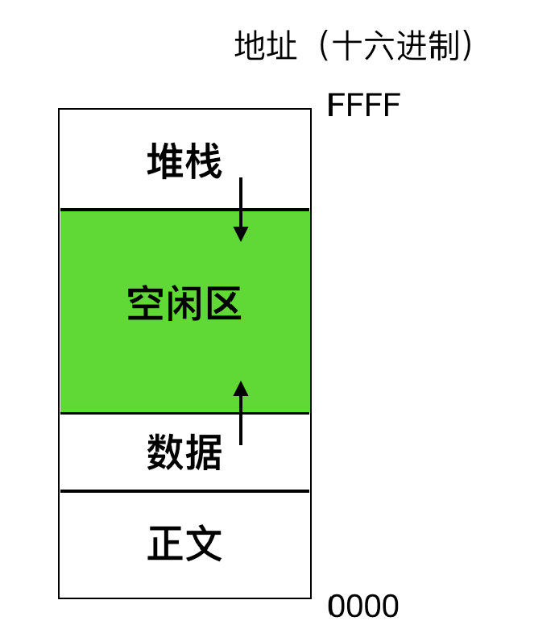

**进程是操作系统进行资源分配的基本单位，而线程是操作系统进行调度的基本单位**，即CPU分配时间的单位 。


——————————————

# operate2

## 操作系统的四大特性

- 并发：同一段时间内多个程序执行
- 共享：系统中的资源可以被内存中多个并发执行的进线程共同使用
- 虚拟：通过时分复用（如分时系统）以及空分复用（如虚拟内存）技术实现把一个物理实体虚拟为多个
- 异步：系统中的进程是以走走停停的方式执行的，且以一种不可预知的速度推进

## 操作系统基本功能

- 进程管理

  ：

  - 进程控制、进程同步、进程通信、死锁处理、处理机调度等

- 内存管理

  ：

  - 内存分配、地址映射、内存保护与共享、虚拟内存等

- 文件管理

  ：

  - 文件存储空间的管理、目录管理、文件读写管理和保护等

- 设备管理

  ：

  - 完成用户的 I/O 请求，方便用户使用各种设备，并提高设备的利用率。主要包括缓冲管理、设备分配、设备处理、虛拟设备等

## CPU

- CPU（中央处理器）
- 进程是计算机中的程序关于某数据集合上的一次运行活动，是系统进行资源分配和调度的基本单位，是操作系统结构的基础
- **资源分配的最小单位是进程，而CPU调度的最小单位是时间片**
- 系统为进程分配资源，不对线程分配资源

### CPU调度

- 高级调度（作业调度）：
  - 多道批处理操作系统中，从输入系统的一批作业中按照预定的调度策略挑选若干作业进入内存，为其分配资源并创建对应的作业用户进程
  - 作业是任务实体，进程是完成任务的执行实体。**作业的概念多用于批处理操作系统，而进程用于各种多道程序设计系统**
- 中级调度
  - 根据内存资源情况决定内存中所能容纳的进程数目，并完成外存和内存中的进程对换工作（挂起）。起到短期均衡系统负载的作用
- 低级调度（进程调度/线程调度）
  - **根据某种原则决定就绪队列中哪个进程/线程获得处理器，并将处理器出让给它使用**

### Q：某一进程CPU使用率 50% 是什么意思？

- CPU使用率是来描述CPU的使用情况的，表明了一段时间内CPU被占用的情况。使用率越高，说明你的机器在这个时间上运行了很多程序，反之较少。使用率的高低与你的CPU强弱有直接关系。
- CPU的占用率，一般指的就是对时间片的占用情况，CPU：50% 说明 CPU 有一半的时间在运行，一半的时间在休息（100MS 中50MS被进程占用，50MS处于空闲状态）

### Q：如何让CPU使用率固定在50%【仅限于单核CPU】

- CPU的占有率是由进程的忙和空闲来决定的，即 rate=(busy_time)/(busy_time+idle_time);

- 让CPU使用率固定在50%，只要让计算机有一半的时间在运行，一半的时间在休息就可以了。

- busy可以用循环（这个循环用空循环，以便好控制），idle可以用sleep

- 比如先让任务管理器的cpu使用率始终保持在50%左右，那么在一个主循环中，让空循环和sleep运行同样的一小段时间。sleep的时间好搞，空循环的怎么办呢？可以在运行的时候设定空循环的运行时间

  `public` `static` `void` `main(String args[]) ``throws` `InterruptedException{``   ``int` `busyTime = ``10``;``   ``int` `idleTime = busyTime;``   ``//设定空循环的运行时间``   ``while``(``true``){``     ``long` `startTime = System.currentTimeMillis();``     ``//busy loop:``     ``while``((System.currentTimeMillis()-startTime)<=busyTime)``       ``;``     ``Thread.sleep(idleTime);``   ``}`` ``}`

## 内存

内存的内部是由各种 IC 电路组成的，它的种类很庞大，但是其主要分为三种存储器：

- 随机存储器（RAM）：内存中最重要的一种，表示既可以从中读取数据，也可以写入数据。当机器关闭时，内存中的信息会丢失
- 只读存储器（ROM）：ROM 一般只能用于数据的读取，不能写入数据，但是当机器停电时，这些数据不会丢失
- 高速缓存（Cache）：Cache 也是我们经常见到的，它分为一级缓存（L1 Cache）、二级缓存（L2 Cache）、三级缓存（L3 Cache）这些数据，它位于内存和 CPU 之间，是一个读写速度比内存更快的存储器。当 CPU 向内存写入数据时，这些数据也会被写入高速缓存中。当 CPU 需要读取数据时，会直接从高速缓存中直接读取，当然，如需要的数据在Cache中没有，CPU会再去读取内存中的数据.

### 内存管理机制

- 操作系统的内存管理主要负责**内存的分配与回收**（malloc 函数：申请内存，free 函数：释放内存），另外地址转换也就是**将逻辑地址转换成相应的物理地址**等功能也是操作系统内存管理做的事情

- 连续分配管理方式

  ：连续分配管理方式是指为一个用户程序分配一个连续的内存空间，常见的如

  块式管理

  - **块式管理**：将内存分为几个固定大小的块，每个块中只包含一个进程。如果程序运行需要内存的话，操作系统就分配给它一块，如果程序运行只需要很小的空间的话，分配的这块内存很大一部分几乎被浪费了。这些在每个块中未被利用的空间，我们称之为碎片

- 非连续分配管理方式

  ：非连续分配管理方式允许一个程序使用的内存分布在离散或者说不相邻的内存中

  - **页式管理** ：把主存分为大小相等且固定的一页一页的形式，页较小，相对相比于块式管理的划分力度更大，提高了内存利用率，减少了碎片。**页式管理通过页表对应逻辑地址和物理地址**
  - **段式管理** ： 页式管理虽然提高了内存利用率，但是页式管理其中的页实际并无任何实际意义。 段式管理把主存分为一段段的，每一段的空间又要比一页的空间小很多 。但是，最重要的是**段是有实际意义的，每个段定义了一组逻辑信息**，例如,有主程序段 MAIN、子程序段 X、数据段 D 及栈段 S 等。 **段式管理通过段表对应逻辑地址和物理地址**
  - **段页式管理机制** ：段页式管理机制结合了段式管理和页式管理的优点。简单来说段页式管理机制就是**把主存先分成若干段，每个段又分成若干页**，也就是说**段页式管理机制中段与段之间以及段的内部的都是离散的**。

#### 分页和分段共同点和区别

- 共同点

  ：

  1. 分页机制和分段机制都是为了提高内存利用率，较少内存碎片
  2. **页和段都是离散存储的**，所以两者都是离散分配内存的方式。但是，**每个页和段中的内存是连续的**

- 分段和分页的不同

  ：

  1. **目的不同**：**分页是由于系统管理的需要**而不是用户的需要，它是信息的物理单位；**分段的目的是为了能更好地满足用户的需要**，它是信息的逻辑单位，它含有一组其意义相对完整的信息；
  2. **大小**不同：**页的大小固定且由系统决定**；而**段的长度却不固定，由其所完成的功能决定**；
  3. 地址空间不同： 段向用户提供二维地址空间；页向用户提供的是一维地址空间；
  4. 信息共享：段是信息的逻辑单位，便于存储保护和信息的共享，页的保护和共享受到限制；
  5. **内存碎片**：页式存储管理的优点是没有外碎片（因为页的大小固定），但会产生内碎片（一个页可能填充不满）；而段式管理的优点是没有内碎片（因为段大小可变，改变段大小来消除内碎片）。但段换入换出时，会产生外碎片（比如4k的段换5k的段，会产生1k的外碎片）。

#### 基本分页储存管理方式

- 在分页内存管理中，很重要的两点是：**1. 虚拟地址到物理地址的转换要快【快表】；2. 解决虚拟地址空间大，页表也会很大的问题【多级分页】**
- 因为程序数据存储在不同的页面中，而页面又离散的分布在内存中，因此需要一个**页表来记录逻辑地址和实际存储地址之间的映射关系**，**以实现从页号到物理块号的映射**
- 由于页表也是存储在内存中的，因此访问分页系统中内存数据需要两次的内存访问【一次是从内存中访问页表，从中找到指定的物理块号，加上页内偏移得到实际物理地址；第二次就是根据第一次得到的物理地址访问内存取出数据】
- **为了减少两次访问内存导致的效率影响，分页管理中引入了快表机制**，当要访问内存数据的时候，首先将页号在快表中查询，如果查找到说明要访问的页表项在快表中，那么直接从快表中读取相应的物理块号；如果没有找到，那么访问内存中的页表，从页表中得到物理地址，同时将页表中的该映射表项添加到快表中
- **在某些计算机中如果内存的逻辑地址很大，将会导致程序的页表项会很多，而页表在内存中是连续存放的，所以相应的就需要较大的连续内存空间**。为了解决这个问题，可以采用**两级页表或者多级页表的方法**
- 其中外层页表一次性调入内存且连续存放，内层页表离散存放。相应的访问内存页表的时候需要一次地址变换，访问逻辑地址对应的物理地址的时候也需要一次地址变换，而且一共需要访问内存3次才可以读取一次数据

#### 基本分段储存管理方式

- 分页是为了提高内存利用率，而分段是为了满足程序员在编写代码的时候的一些逻辑需求【比如数据共享，数据保护，动态链接等】
- **分段内存管理当中，地址是二维的，一维是段号，一维是段内地址**；其中每个段的长度是不一样的，而且每个段内部都是从0开始编址的
- 由于分段管理中，**每个段内部是连续内存分配，但是段和段之间是离散分配的**，因此也存在一个逻辑地址到物理地址的映射关系，相应的就是**段表机制**。段表中的每一个表项记录了该段在内存中的起始地址和该段的长度。段表可以放在内存中也可以放在寄存器中。
- 访问内存的时候根据段号和段表项的长度计算当前访问段在段表中的位置，然后访问段表，得到该段的物理地址，根据该物理地址以及段内偏移量就可以得到需要访问的内存。由于也是两次内存访问，所以分段管理中同样引入了[联想](https://www.nowcoder.com/jump/super-jump/word?word=联想)寄存器。

#### 段页式内存管理

- **页式存储管理能有效地提高内存利用率，而分段存储管理能反映程序的逻辑结构并有利于段的共享**

- 段页式管理就是将程序分为多个逻辑段，在每个段里面又进行分页，即将分段和分页组合起来使用。

- 为了实现地址变换，系统为每个进程建立一张段表，而每个分段有一张页表（在一个进程中，段表只有一个，而页表可能有多个）

- 在进行地址变换时，**首先通过段表查到页表起始地址，然后通过页表找到页帧号，最后形成物理地址**。如图所示，**进行一次访问实际需要至少三次访问主存**，这里同样可以使用快表以加快查找速度，其关键字由段号、页号组成，值是对应的页帧号和保护码。

- 三次内存访问

  ：

  1. 访问内存中的段表查到页表的起始地址
  2. 访问内存中的页表找到页帧号，形成物理地址
  3. 得到物理地址后，再一次访问内存，存取指令或者数据

#### Q：页式存储，段式存储，段页式存储，引入快表，访问内存次数

- 页式存储（2次）

  1. 访问内存中的页表，利用逻辑地址中的页号查找到页帧号，与逻辑地址中的页内偏移拼接形成物理地址；
  2. 得到物理地址后，再一次访问内存，存取指令或者数据。

- **段式存储（2次）**：同页式存储

- 段页式存储（3次）

  1. 访问内存中的段表查到页表的起始地址
  2. 访问内存中的页表找到页帧号，形成物理地址
  3. 得到物理地址后，再一次访问内存，存取指令或者数据

- **多级页表**：若页表划分为N级，则需要访问内存N+1次。若系统有快表，则在快表命中时，只需访问1次内存即可

- 引入快表

  ：

  - 因为把页表放在内存中，至少需要访问两次内存才能存取一条指令或者数据（一次得到物理地址地址，一次存取），比较慢；因此在地址变换机构中增设了一个具有并行查找能力的高速缓冲寄存器—— 快表（全局只有一个，不在内存中！！！），用来存放当前访问的若干页表项（比较小，只能存放部分页表项）
  - **若快表命中**，则可直接得到页帧号，与页内偏移拼接成物理地址后访问内存，进行指令或者数据的存取。（**只需访问一次内存**）
  - **若快表不命中**，则需去内存中访问页表，形成物理地址后，再一次访问内存进行指令或者数据的存取。（需要访问两次内存）

### 物理内存 & 虚拟内存

- **正在运行的一个进程，他所需的内存是有可能大于内存条容量之和**的，比如你的**内存条是256M，你的程序却要创建一个2G的数据区**，那么不是所有数据都能一起加载到内存（物理内存）中，势必有一部分数据要放到其他介质中（比如硬盘），待进程需要访问那部分数据时，在通过调度进入物理内存。所以，虚拟内存是进程运行时所有内存空间的总和，并且可能有一部分不在物理内存中，而物理内存就是我们平时所了解的内存条。有的地方呢，也叫这个虚拟内存为内存交换区。

- **虚拟内存的作用就是，将需要大内存的分块，一块一块的递给物理内存**。换言之，**虚拟内存是通过页面调度实现的**

- 虚拟内存的目的是为了

  让物理内存扩充成更大的逻辑内存，从而让程序获得更多的可用内存

  。

  - 为了更好的管理内存，操作系统将内存抽象成地址空间。每个程序拥有自己的地址空间，这个地址空间被分割成多个块，每一块称为一页。
  - 这些页被映射到物理内存，但不需要映射到连续的物理内存，也不需要所有页都必须在物理内存中。
  - 当程序引用到不在物理内存中的页时，由硬件执行必要的映射，将缺失的部分装入物理内存并重新执行失败的指令。

#### 进程的内存分配 & 内存访问

- **进程是在虚拟内存中的**，每个进程运行时都会得到4G的虚拟内存，得到的这4G虚拟内存是一个连续的地址空间（这也只是进程认为），而实际上，它通常是被分隔成多个物理内存碎片，还有一部分存储在外部磁盘存储器上，在需要时进行数据交换
- 进程内存访问
  1. 每次要访问地址空间上的某一个地址，都需要**把虚拟地址翻译为实际物理内存地址**
  2. **所有进程共享这整一块物理内存，每个进程只把自己目前需要的虚拟地址空间映射到物理内存上**
  3. 进程需要知道**哪些地址空间上的数据在物理内存上**，哪些不在（可能这部分存储在磁盘上），还有在物理内存上的哪里，这就需要通过**页表**来记录
  4. 页表的每一个表项分两部分，第一部分记录此页是否在物理内存上（页面号），第二部分记录物理内存页的地址（偏移量）
  5. **当进程访问某个虚拟地址的时候，就会先去看页表，如果发现对应的数据不在物理内存上，就会发生缺页异常**
  6. **缺页异常**的处理过程，**操作系统立即阻塞该进程，并将硬盘里对应的页换入内存**，然后使该进程就绪，如果内存已经满了，没有空地方了，那就找一个页覆盖，至于具体覆盖的哪个页，就需要看操作系统选择的**页面置换[算法](https://www.nowcoder.com/jump/super-jump/word?word=算法)**

#### 虚拟内存置换[算法](https://www.nowcoder.com/jump/super-jump/word?word=算法)

- 最佳(Optimal)置换[算法](https://www.nowcoder.com/jump/super-jump/word?word=算法)

  ：

  - 一种理论[算法](https://www.nowcoder.com/jump/super-jump/word?word=算法)，无法实现，置换策略是将当前页面中在未来最长时间内不会被访问的页置换出去。

- 先进先出(FIFO)页面置换[算法](https://www.nowcoder.com/jump/super-jump/word?word=算法)

  ：

  - 每次淘汰最早调入的页面。

- 最近最久未使用[算法](https://www.nowcoder.com/jump/super-jump/word?word=算法)LRU

  ：

  - [算法](https://www.nowcoder.com/jump/super-jump/word?word=算法)赋予每个页面一个访问字段，用来记录一个页面自上次被访问以来所经历的时间t，当须淘汰一个页面时，选择现有页面中其t值最大的，即最近最久未使用的页面予以淘汰。

- 时钟[算法](https://www.nowcoder.com/jump/super-jump/word?word=算法)clock

  (也被称为是

  最近未使用[算法](https://www.nowcoder.com/jump/super-jump/word?word=算法)NRU

  )：

  - 页面设置一个访问位，并将页面链接为一个环形队列，页面被访问的时候访问位设置为1。页面置换的时候，如果当前指针所指页面访问为为0，那么置换，否则将其置为0，循环直到遇到一个访问为位0的页面。

- 改进型Clock[算法](https://www.nowcoder.com/jump/super-jump/word?word=算法)

  ：

  - 在Clock[算法](https://www.nowcoder.com/jump/super-jump/word?word=算法)的基础上添加一个修改位，替换时根据访问位和修改位综合判断。优先替换访问位和修改位都是0的页面，其次是访问位为0修改位为1的页面。

- 最少使用[算法](https://www.nowcoder.com/jump/super-jump/word?word=算法)LFU

  ：

  - 设置寄存器记录页面被访问次数，每次置换的时候置换当前访问次数最少的。

### 用户态&内核态

- 用户态：用户态运行的进程可以直接读取用户程序的数据

- 内核态：内核态运行的进程或程序几乎可以访问计算机的任何资源，不受限制

- 两者最重要的差别就在于**特权级的不同**，即权力的不同。**运行在用户态下的程序不能直接访问操作系统内核数据结构和程序**。当我们在系统中执行一个程序时，大部分时间是运行在用户态下的，在其需要操作系统帮助完成某些它没有权力和能力完成的工作时就会切换到内核态

- 用户态切换到内核态的3种方式

  ：

  1. **系统调用**：这是用户态进程主动要求切换到内核态的一种方式，用户态进程通过系统调用申请使用操作系统提供的服务程序完成工作。而系统调用的机制其核心还是使用了操作系统为用户特别开放的一个中断来实现
  2. **异常**：当CPU在执行运行在用户态下的程序时，发生了某些事先不可知的异常，这时会触发由当前运行进程切换到处理此异常的内核相关程序中，也就转到了内核态，比如缺页异常
  3. **外围设备的中断**：当外围设备完成用户请求的操作后，会向CPU发出相应的中断信号，这时CPU会暂停执行下一条即将要执行的指令转而去执行与中断信号对应的处理程序，如果先前执行的指令是用户态下的程序，那么这个转换的过程自然也就发生了由用户态到内核态的切换。（比如硬盘读写操作完成，系统会切换到硬盘读写的中断处理程序中执行后续操作等。）

### 系统调度

- Q：什么是系统调用

  ？

  - 我们运行的程序基本都是运行在用户态，如果需要调用操作系统提供的系统态级别的子功能，就需要系统调用。也就是说在我们运行的用户程序中，凡是与系统态级别的资源有关的操作（如**文件管理、进程控制、内存管理**等)，都必须**通过系统调用方式向操作系统提出服务请求，并由操作系统代为完成**

- 常见的系统调用：

  - 设备管理。完成设备的请求或释放，以及设备启动等功能
  - 文件管理。完成文件的读、写、创建及删除等功能
  - 进程控制。完成进程的创建、撤销、阻塞及唤醒等功能
  - 进程通信。完成进程之间的消息传递或信号传递等功能
  - 内存管理。完成内存的分配、回收以及获取作业占用内存区大小及地址等功能

### Q：Debug时看到的是物理内存还是虚拟内存 ？

- 虚拟内存，通常，**在用户模式下，我们用调试器看到的内存地址都是虚拟内存**。

## 操作系统是如何实现锁的？

- 首先要搞清楚一个概念，**在硬件层面，CPU提供了原子操作、关中断、锁内存总线的机制**；**OS基于这几个CPU硬件机制，就能够实现锁**；再**基于锁，就能够实现各种各样的同步机制**（信号量、消息、Barrier等）

- 在多线程编程中，为了保证数据操作的一致性，操作系统引入了锁机制，用于保证临界区代码的安全。通过锁机制，能够保证在多核多线程环境中，在某一个时间点上，只能有一个线程进入临界区代码，从而保证临界区中操作数据的一致性。

- **锁机制的一个特点是它的同步原语都是原子操作**

- 那么操作系统是如何保证这些同步原语的原子性呢？

  - 操作系统之所以能构建锁之类的同步原语，是因为硬件已经为我们提供了一些原子操作，例如：

  1. 中断禁止和启用（interrupt enable/disable）
  2. 内存加载和存入（load/store）测试与设置（test and set）指令

- 禁止中断这个操作是一个硬件步骤，中间无法插入别的操作。同样，中断启用，测试与设置均为一个硬件步骤的指令。在这些硬件原子操作之上，我们便可以构建软件原子操作：锁，睡觉与叫醒，信号量等。

### 操作系统使用锁的原语操作

- 可以使用**中断禁止，测试与设置**两种**硬件原语来实现软件的锁原语**。这两种方式比较起来，显然**测试与设置**更加简单，也因此使用的**更为普遍**。此外，**test and set还有一个优点，就是可以在多CPU环境下工作，而中断启用和禁止则不能**

- 使用中断启用与禁止来实现锁

  ：

  - 要防止一段代码在执行过程中被别的进程插入，就要考虑在一个单处理器上，一个线程在执行途中被切换的途径。我们知道，要切换进程，必须要发生上下文切换，上下文切换只有两种可能：

  1. **一个线程自愿放弃CPU而将控制权交给操作系统调度器**（**通过yield之类的操作系统调用来实现**）；
  2. **一个线程被强制放弃CPU而失去控制权（通过中断来实现）**

  - 原语执行过程中，我们不会自动放弃CPU控制权，因此**要防止进程切换，就要在原语执行过程中不能发生中断。所以采用禁止中断**，且不自动调用让出CPU的系统调用，就可以防止进程切换，将一组操作变为原子操作。
  - 中断禁止：就是禁止打断，**使用可以将一系列操作变为原子操作**
  - 中断启用：就是从这里开始，可以被打断，允许操作系统进行调度
  - 缺点：使用中断实现锁，繁忙等待，不可重入

- 使用测试与设置指令来实现锁

  - 测试与设置（test & set）指令：以不可分割的方式执行如下两个步骤：

  1. 设置操作：将1写入指定内存单元；
  2. 读取操作：返回指定内存单元里原来的值（写入1之前的值）

  - 缺点：繁忙等待，不可重入

### 操作系统中的锁机制

- **互斥锁**：mutex，用于保证在任何时刻，都只能有一个线程访问该对象。只有取得互斥锁的进程才能进入临界区，无论读写，当获取锁操作失败时，线程会进入睡眠，等待锁释放时被唤醒

- 读写锁

  ：rwlock，分为读锁和写锁。读写锁要根据进程进入临界区的具体行为（读，写）来决定锁的占用情况。这样锁的状态就有三种了：读加锁、写加锁、无锁。

  1. 无锁。读/写进程都可以进入；
  2. 读锁。读进程可以进入。写进程不可以进入；
  3. 写锁。读/写进程都不可以进入

- 自旋锁

  ：spinlock，自旋锁是指在进程试图取得锁失败的时候选择忙等待而不是阻塞自己。

  - 选择忙等待的优点在于如果该进程在其自身的CPU时间片内拿到锁（说明锁占用时间都比较短），则相比阻塞少了上下文切换
  - 注意这里还有一个隐藏条件：**多处理器**。因为单个处理器的情况下，由于当前自旋进程占用着CPU，持有锁的进程只有等待自旋进程耗尽CPU时间才有机会执行，这样CPU就空转了

- RCU

  ：read-copy-update，在修改数据时，首先需要读取数据，然后生成一个副本，对副本进行修改，修改完成后，再将老数据update成新的数据。【有点像 copy-on-write】

  - 使用RCU时，读者几乎不需要同步开销，既不需要获得锁，也不使用原子指令，不会导致锁竞争，因此就**不用考虑死锁问题**了。
  - 对于写者的同步开销较大，它需要复制被修改的数据，还必须使用锁机制同步并行其它写者的修改操作。
  - 在有大量读操作，少量写操作的情况下效率非常高。【读多写少】

## 中断

- 早期计算机各个程序只能串行执行、系统资源利用低。为了解决上述问题，操作系统引入了中断机制，实现了**多道程序的并发执行**，提高了系统资源的利用率。
- **中断是多程序并发执行的前提条件**

1. 当一个时间片运行完后，CPU会接收到计时部件（操作系统内核的时钟管理部件）**发出的中断信号，CPU立即进入核心态**，把CPU的使用权限交还给操作系统
2. 当中断发生后，当前运行的进程暂停运行，操作系统内核对中断进程处理，切换进程（根据进程调度[算法](https://www.nowcoder.com/jump/super-jump/word?word=算法)），在完成切换进程的一系列工作后，操作系统又会将CPU的使用权交还给用户进程
3. 切换到的进程2拿到CPU执行权就会在用户态下执行

- 中断的**本质**：**发生中断就意味着需要操作系统介入**，开展管理工作

### 中断的处理过程

1. 执行完每个指令后，CPU都要检查当前是否有外部中断信号
2. **如果检测到外部中断信号，则需要保护被中断进程的CPU环境**（[如程](https://www.nowcoder.com/jump/super-jump/word?word=如程)序状态字PSW、**程序计数器、各种通用寄存器**）
3. 根据中断信号类型转入相应的中断处理程序
4. 恢复进程的CPU环境并退出中断，返回原进程继续往下执行

### 中断的分类

- 中断可以分为：内中断和外中断
- 内中断：内中断的信号来源于CPU内部、与当前执行的指令有关。如整数除0
- 外中断：外中断的信号来源于CPU外部、与当前执行的指令无关。如用户强制结束一个进程、IO设备完成操作发生的中断信号

### 缺页中断

- 在请求分页系统中，可以通过查询页表中的状态位来确定所要访问的页面是否存在于内存中。每当所要访问的页面不在内存是，会产生一次缺页中断，此时操作系统会根据页表中的外存地址在外存中找到所缺的一页，将其调入内存。
- 缺页本身是一种中断，与一般的中断一样，需要经过4个处理步骤：
  1. 保护CPU现场
  2. 分析中断原因
  3. 转入缺页中断处理程序进行处理
  4. 恢复CPU现场，继续执行
- 但是缺页中断是由于所要访问的页面不存在于内存时，由硬件所产生的一种特殊的中断，因此，与一般的中断存在区别：
  - 在指令执行期间产生和处理缺页中断信号
  - 一条指令在执行期间，可能产生多次缺页中断
  - 缺页中断返回的是，执行产生中断的一条指令，而一般的中断返回的是，执行下一条指令

## 线程

### Q：操作系统临界资源的访问

- **临界资源**：**一段时间内只允许一个线程访问的资源就称为临界资源或独占资源**
- **临界区**：对临界资源进行访问的那段代码称为临界区，通过对多线程的串行化来访问公共资源或一段代码，速度快，适合控制数据访问
- **多线程同步互斥的常见方法**：

1. **互斥量(Mutex)**：采用互斥对象机制，只有拥有互斥对象的线程才有访问公共资源的权限。因为互斥对象只有一个，所以可以保证公共资源不会被多个线程同时访问。比如 **Java 中的 synchronized 关键词和各种 Lock 都是这种机制，本质是一个计数器**

2. 信号量PV(Semphares)

   ：它

   允许同一时刻多个线程来访问同一资源

   ，但是需要控制同一时刻访问此资源的最大线程数量【用来实现生产者消费者模型】

   - 信号量的数据结构为一个值和一个指针，指针指向等待该信号量的下一个进程，信号量的值与相应资源的使用情况有关。当它的值大于0时，表示当前可用资源的数量；当它的值小于0时，其绝对值表示等待使用该资源的进程个数。
   - 注意，**信号量的值仅能由PV操作来改变**
   - p操作（wait）：申请一个单位资源，进程进入；v操作（signal）：释放一个单位资源，进程出来
   - PV操作的含义：**PV操作由P操作原语和V操作原语组成（原语是不可中断的过程），对信号量进行操作**

3. **事件event**：通过通知操作的方式来保持多线程同步，还可以方便实现多线程优先级的比较操作，Wait/Notify

### 线程通信

- **synchronized同步**：本质上就是 “共享内存” 式的通信。多个线程需要访问同一个共享变量，谁拿到了锁（获得了访问权限），谁就可以执行。

- while轮询的方式

  ：

  - 在这种方式下，ThreadA 不断地改变条件，ThreadB 不停地通过 while 语句检测这个条件比如说互斥量为0 是否成立 ，从而实现了线程间的通信。但是这种方式会浪费 CPU 资源。

- wait/notify机制

  ：

  - 当条件未满足时，ThreadA 调用 wait() 放弃 CPU，并进入阻塞状态。（不像 while 轮询那样占用 CPU）
  - 当条件满足时，ThreadB 调用 notify() 通知线程 A，所谓通知线程 A，就是唤醒线程 A，并让它进入可运行状态

- **管道通信**：java.io.PipedInputStream 和 java.io.PipedOutputStream进行通信

## 进程

- 进程控制块 (Process Control Block，PCB) 描述进程的基本信息和运行状态，所谓的创建进程和撤销进程，都是指对 PCB 的操作。

### 进程状态

- **创建状态(new)** ：进程正在被创建，尚未到就绪状态
- **就绪状态(ready)**：进程已处于准备运行状态，即进程获得了除了处理器之外的一切所需资源，一旦得到处理器资源(处理器分配的时间片)即可运行
- **运行状态(running)** ：进程正在处理器上上运行（单核 CPU 下任意时刻只有一个进程处于运行状态）
- **阻塞状态(waiting)** ：又称为等待状态，进程正在等待某一事件而暂停运行如等待某资源为可用或等待 IO 操作完成。即使处理器空闲，该进程也不能运行
- **结束状态(terminated)** ：进程正在从系统中消失。可能是进程正常结束或其他原因中断退出运行

- **只有就绪态和运行态可以相互转换，其它的都是单向转换**。**就绪状态**的进程通过**调度[算法](https://www.nowcoder.com/jump/super-jump/word?word=算法)**从而**获得 CPU 时间，转为运行状态**；而**运行状态**的进程，**在分配给它的 CPU 时间片用完之后就会转为就绪状态**，等待下一次调度。

- **阻塞状态是缺少需要的资源从而由运行状态转换而来**，**但是该资源不包括 CPU 时间，缺少 CPU 时间会从运行态转换为就绪态**

- 挂起

  （换到外存）:

  - 挂起就绪：是指进程被对换到辅存时的就绪状态，是不能被直接调度的状态，只有当主存中没有活跃就绪态进程，或者是挂起就绪态进程具有更高的优先级，系统将把挂起就绪态进程调回主存并转换为活跃就绪。

### 进程同步

1. 临界区：对临界资源进行访问的那段代码称为临界区。

2. 同步与互斥：

   - 同步：多个进程因为合作产生的直接制约关系，使得进程有一定的先后执行关系。
   - 互斥：多个进程在同一时刻只有一个进程能进入临界区。

3. 信号量

   ：信号量（Semaphore）是一个整型变量，可以对其执行 down 和 up 操作，也就是常见的 P 和 V 操作。

   - down : 如果信号量大于 0 ，执行 -1 操作；如果信号量等于 0，进程睡眠，等待信号量大于 0；
   - up ：对信号量执行 +1 操作，唤醒睡眠的进程让其完成 down 操作
   - down 和 up 操作需要被设计成原语，不可分割，通常的做法是在执行这些操作的时候**屏蔽中断**
   - 如果信号量的取值只能为 0 或者 1，那么就成为了 **互斥量**（Mutex） ，0 表示临界区已经加锁，1 表示临界区解锁。

4. 管程

   ：管程在功能上和信号量及PV操作类似，属于一种进程同步互斥工具，但是具有与信号量及PV操作不同的属性。

   管程把控制的代码独立出来，封装了同步操作，对进程隐蔽了同步细节

   ，简化了同步功能的调用界面。用户编写并发程序如同编写顺序(串行)程序。

   - 管程有一个重要特性：在一个时刻只能有一个进程使用管程。进程在无法继续执行的时候不能一直占用管程，否则其它进程永远不能使用管程。
   - 管程引入了**条件变量**以及相关的操作：**wait() 和 signal() 来实现同步操作**。对条件变量执行 wait() 操作会导致调用进程阻塞，把管程让出来给另一个进程持有。signal() 操作用于唤醒被阻塞的进程。

#### 进程同步和进程通信的区别

- 进程同步：控制多个进程按一定顺序执行
- 进程通信：进程间传输信息
- 进程通信是一种手段，而进程同步是一种目的。也可以说，为了能够达到进程同步的目的，需要让进程进行通信，传输一些进程同步所需要的信息

### Q：常见的进程间的通信方式（IPC，Inter-Process Communication）？

- 管道

  ：

  管道可用于具有亲缘关系的父子进程间的通信

  。linux 系统操作执行命令时，将一个程序的输出交给另一个程序进行处理。一个进程往管道输入数据，则会阻塞等待别的进程从管道读取数据。管道是通过调用 pipe 函数创建的，fd[0] 用于读，fd[1] 用于写。

  - 它具有以下限制：1. **只支持半双工通信（单向交替传输）**；2. **只能在父子进程或者兄弟进程中使用**

- **命名管道（FIFO）**：克服了管道没有名字的限制，**具有管道所具有的功能外，还允许无亲缘关系进程间的通信**，去除了管道只能在父子进程中使用的限制

- **信号（singal）**：**信号是在软件层次上对中断机制的一种模拟**，一种比较复杂的通信方式，用于通知接收进程某个事件已经发生。一个进程收到一个信号与处理器收到一个中断请求效果上可以说是一致的。

- 消息队列

  ：消息队列提供了从一个进程向另一个进程发送一个数据块的方法。

  - **相比于命名管道的优点**：**消息队列可以独立于读写进程存在**，从而避免了 FIFO 中同步管道的打开和关闭时可能产生的困难；**避免了 FIFO 的同步阻塞问题**，不需要进程自己提供同步方法；读进程可以**根据消息类型有选择地接收消息**，而不像 FIFO 那样只能默认地接收。
  - **缺点**：使用消息队列进行进程间通信，可能会收到数据块最大长度的限制约束等。如果频繁的发生进程间的通信行为，那么进程需要频繁地读取队列中的数据到内存，相当于间接地从一个进程拷贝到另一个进程，这需要花费时间

- 共享内存

  ：共享内存可以很好解决拷贝消耗的时间。

  - **允许多个进程共享一个给定的存储区，不同进程可以及时看到对方进程中对共享内存中数据变更**。因为数据不需要在进程之间复制，所以这是**最快的一种 IPC**
  - 共享内存需要依靠某种同步操作，如互斥锁和信号量等，**需要使用信号量用来同步对共享存储的访问**。
  - 系统加载一个进程的时候，分配给进程的内存并不是实际物理内存，而是虚拟内存空间。可以让**两个进程各自拿出一块虚拟地址空间，然后映射到相同的物理内存中**，这样，两个进程虽然有着独立的虚拟内存空间，但有一部分却是映射到相同的物理内存，这就完成了内存共享机制了

- 信号量（mutex）

  ：为了避免共享内存多进程竞争内存的问题（线程安全），使用信号量。

  - 信号量的**本质就是一个计数器**，用来**实现进程之间的互斥与同步**，**用于为多个进程提供对共享数据对象的访问**，信号量也是进程之间的一种通信方式。

- **Socket**：Socket套接字进行通信，与其他机制不同的是，它**可用于不同机器之间的进程间通信**，应用非常广泛。

### 进程的调度

一. **批处理系统**

- 批处理系统没有太多的用户操作，在该系统中，**调度[算法](https://www.nowcoder.com/jump/super-jump/word?word=算法)目标是保证吞吐量和周转时间**（从提交到终止的时间）

- 先来先服务调度[算法](https://www.nowcoder.com/jump/super-jump/word?word=算法)

  （FCFS）：

  - 每次调度是**从就绪队列中选择一个最先进入该队列的进程**，为之分配处理机，使之投入运行。该进程一直运行到完成或发生某事件而阻塞后才放弃处理机。
  - 比较有利于长作业（进程），而不利于短作业（进程）
  - **有利于CPU繁忙型作业（进程） ，而不利于I/O繁忙型作业（进程）**
  - 用于批处理系统，不适于分时系统

- 短进程优先调度[算法](https://www.nowcoder.com/jump/super-jump/word?word=算法)

  ：

  - **从就绪队列中选出一个估计运行时间最短的进程**，将处理机分配给它，使它立即执行并一直执行到完成，或发生某事件而被阻塞放弃处理机时再重新调度。
  - 对长作业不利，未考虑作业(进程)的紧迫程度，因而不能保证紧迫性作业(进程)会被及时处理

- 最短剩余时间优先

   

  shortest remaining time next（SRTN）

  - 最短作业优先的抢占式版本，按剩余运行时间的顺序进行调度。 当一个新的作业到达时，其整个运行时间与当前进程的剩余时间作比较。如果新的进程需要的时间更少，则挂起当前进程，运行新的进程。否则新的进程等待。

二. **交互式系统**

- 交互式系统有大量的用户交互操作，在该系统中调度[算法](https://www.nowcoder.com/jump/super-jump/word?word=算法)的目标是快速地进行响应

- 时间片轮转法

  ：

  - 系统将所有的就绪进程按先来先服务的原则排成一个队列，每次调度时，**把CPU分配给队首进程，并令其执行一个时间片**。当执行的时间片用完时，由一个计时器发出时钟中断请求，调度程序便据此信号来停止该进程的执行，并将它**送往就绪队列的末尾**；然后，再把处理机分配给**就绪队列中新的队首进程，同时也让它执行一个时间片**。
  - 紧迫任务响应慢。

- 多级反馈队列调度[算法](https://www.nowcoder.com/jump/super-jump/word?word=算法)

  ：

  1. **设置多个就绪队列**，并为各个队列赋予不同的**优先级**；该[算法](https://www.nowcoder.com/jump/super-jump/word?word=算法)赋予**各个队列中进程执行时间片**的大小也各不相同，在**优先权愈高**的队列中，为**每个进程所规定的执行时间片就愈小**。
  2. 当一个新进程进入内存后，首先将它放入**第一队列的末尾**，**按FCFS原则排队等待调度**；当轮到该进程执行时，如它能在该时间片内完成，便可准备撤离系统；**如果它在一个时间片结束时尚未完成，调度程序便将该进程转入第二队列的末尾**，**再同样地按FCFS原则等待调度执行**；
  3. **仅当第一队列空闲时，调度程序才调度第二队列中的进程运行**

- 优先权调度[算法](https://www.nowcoder.com/jump/super-jump/word?word=算法)

  ：

  把处理机分配给就绪队列中优先权最高的进程

  - **非抢占式优先权[算法](https://www.nowcoder.com/jump/super-jump/word?word=算法)**：系统一旦把处理机分配给就绪队列中优先权最高的进程后，该进程便一直执行下去，直至完成；
  - **抢占式优先权调度[算法](https://www.nowcoder.com/jump/super-jump/word?word=算法)**：系统把处理机分配给优先权最高的进程，使之执行。但**在其执行期间**，**只要出现了另一个其优先权更高的进程**，**进程调度程序就立即停止当前进程**(原优先权最高的进程)的执行，**重新将处理机分配给新到的优先权最高的进程**。
  - 这种抢占式的优先权调度[算法](https://www.nowcoder.com/jump/super-jump/word?word=算法)能更好地满足紧迫作业的要求，故而常用于要求比较严格的实时系统中，以及对性能要求较高的批处理和分时系统中

三. **实时系统**

- 实时系统要求一个请求在一个确定时间内得到响应。分为硬实时和软实时，前者必须满足绝对的截止时间，后者可以容忍一定的超时。

#### Q：有5个任务，每个任务权重15524，执行时间15534，如何用最短的时间执行完？

- **WARNING：这是我面试中遇到的问题，以下为我个人思考的答案，仅供参考**
- 可以采用**多级反馈队列调度[算法](https://www.nowcoder.com/jump/super-jump/word?word=算法)**，可以看成时间片轮转调度和优先级调度的结合
- 最上面的队列，优先级最高，首先调度优先级高的队列中的进程。若高优先级中队列中已没有调度的进程，则调度次优先级队列中的进程
- **如果它在一个时间片结束时尚未完成，调度程序便将该进程转入第二队列的末尾**，若第二队列的时间片用完后作业还不能完成，一直进入下一级队列，直至完成
- 在低优先级的队列中的进程在运行时，又有新到达的作业，那么在运行完这个时间片后，CPU马上分配给新到达的作业即抢占式调度CPU

## 进程和线程的区别

- 拥有资源：进程是资源分配的基本单位，但是线程不拥有资源，线程可以访问隶属进程的资源
- 调度：线程是独立调度的基本单位，在同一进程中，线程的切换不会引起进程切换，从一个进程中的线程切换到另一个进程中的线程时，会引起进程切换【一个进程有多个线程】
- 系统开销：由于创建或撤销进程时，系统都要为之分配或回收资源，如内存空间，I/O 设备等，所付出的开销远大于创建或撤销线程时的开销；类似地，在进行进程切换时，涉及当前执行进程 CPU 环境的保存及新调度进程 CPU 环境的设置，而线程切换时只需保存和设置少量寄存器内容，开销很小。
- 通信：线程间可以通过直接读写同一进程中的数据进行通信【线程共享进程内存空间】，但是进程通信需要借助 IPC

## 多进程 & 多线程

- 进程

  ：

  - **优点**：1. 顺序程序的特点：具有封闭性和可再现性；2.**程序的并发执行和资源共享**。多道程序设计出现后，实现了程序的并发执行和资源共享，提高了系统的效率和系统的资源利用率。
  - **缺点**：1. **操作系统调度切换多个线程要比切换调度进程在速度上快的多**。而且**进程间内存无法共享**，通讯也比较麻烦；2. 线程之间由于共享进程内存空间，所以交换数据非常方便；在创建或撤消进程时，由于系统都要为之分配和回收资源，导致系统的开销明显大于创建或撤消线程时的开销。

- 线程

  ：

  - **优点**：

  1. 启动一个线程所花费的空间远远小于启动一个进程所花费的空间，而且，线程间彼此切换所需的时间也远远小于进程间切换所需要的时间（因为在Linux系统下，启动一个新的进程必须分配给它独立的地址空间，建立众多的数据表来维护它的代码段、堆栈段和数据段。**线程之间却可以使用相同的地址空间，共享大部分数据**）；
  2. **线程间方便的通信机制**，由于同一进程下的线程之间共享数据空间，所以一个线程的数据可以直接为其它线程所用，这不仅快捷，而且方便；
  3. 使多CPU系统更加有效。操作系统会保证当线程数不大于CPU数目时，不同的线程运行于不同的CPU上；

  - **缺点**：**调度时, 要保存线程状态**，频繁调度, 需要占用大量的机时；程序设计上容易出错（**线程同步问题**）

- 多进程

  - **多进程优点**：1. **每个进程互相独立，不影响主程序的稳定性，子进程崩溃没关系**；2. 通过增加CPU，就可以容易扩充性能；3. 可以**尽量减少线程加锁/解锁的影响，极大提高性能**，就算是线程运行的模块[算法](https://www.nowcoder.com/jump/super-jump/word?word=算法)效率低也没关系；4. 每个子进程都有2GB地址空间和相关资源，总体能够达到的性能上限非常大。
  - **多进程缺点**：1. 逻辑控制复杂，需要和主程序交互；2. 需要跨进程边界，如果有大数据量传送，就不太好，适合小数据量传送、密集运算；3. 多进程调度开销比较大。

- 多线程

  ：

  - **多线程的优点**：1. 无需跨进程边界；2. 程序逻辑和控制方式简单；3. 所有线程可以直接共享内存和变量等；4. 线程方式消耗的总资源比进程方式好；
  - **多线程缺点**：

  1. 每个线程与主程序共用地址空间，受限于2GB地址空间；
  2. **线程之间的同步和加锁控制比较麻烦**；
  3. 一个线程的崩溃可能影响到整个程序的稳定性；
  4. 到达一定的线程数程度后，即使再增加CPU也无法提高性能，例如Windows Server 2003，大约是1500个左右的线程数就快到极限了（线程堆栈设定为1M），如果设定线程堆栈为2M，还达不到1500个线程总数；
  5. **线程能够提高的总性能有限**，而且线程多了之后，线程本身的调度也是一个麻烦事儿，需要消耗较多的CPU

## 协程

- 进程/线程/协程区别

  - **进程拥有自己独立的堆和栈**，**既不共享堆，亦不共享栈**，进程**由操作系统调度**
  - **线程拥有自己独立的栈**和**共享的堆**，共享堆，不共享栈，**线程亦由操作系统调度**
  - **协程**和线程一样**共享堆，不共享栈**，协**程由程序员在协程的代码里显示调度**

- 协程与线程区别

  ：

  - 一个线程可以多个协程，一个进程也可以单独拥有多个协程，这样python中则能使用多核CPU
  - **线程进程都是同步机制，而协程则是异步**
  - 协程能保留上一次调用时的状态，每次过程重入时，就相当于进入上一次调用的状态
  - **协程避免了无意义的调度**，由此可以提高性能，但也因此，**程序员必须自己承担调度的责任**，同时，**协程也失去了标准线程使用多CPU的能力**

### Q：协程是如何更少占用资源的

- 协程切换完全在用户空间进行，线程切换涉及用户态和内核态切换，需要在内核空间完成
  - 协程不依赖操作系统和其提供的线程
  - **协程之间的切换完全在用户态执行，在用户态没有时钟中断，系统调用等机制，因此效率高**。**协程切换只涉及基本的CPU上下文切换**（寄存器保存 CPU运行任务所需要的信息），协程切换非常简单，就是把当前协程的 CPU 寄存器状态保存起来，然后将需要切换进来的协程的 CPU 寄存器状态加载的 CPU 寄存器上。
  - 系统内核调度的对象是线程，**线程的调度只有拥有最高权限的内核空间才可以完成，所以线程的切换涉及到用户空间和内核空间的切换**，现代操作系统一般都采用抢占式调度，**上下文切换一般发生在时钟中断和系统调用返回前**，调度器计算当前线程的时间片，如果需要切换就从运行队列中选出一个目标线程，保存当前线程的环境，并且恢复目标线程的运行环境。
- 协程占用内存少
  - 线程除了和协程相同基本的 CPU 上下文，还有线程私有的栈和寄存器等，上下文比协程多一些

## 孤儿进程 & 僵尸进程【怎么产生的？有什么危害？怎么去预防？】

- 一般进程，正常情况下：子进程由父进程创建，子进程再创建新的进程。父子进程是一个异步过程，父进程永远无法预测子进程的结束，所以，当子进程结束后，它的父进程会调用wait()或waitpid()取得子进程的终止状态，回收掉子进程的资源。

- **孤儿进程**：**父进程结束了，而它的一个或多个子进程还在运行**，那么这些子进程就成为孤儿进程(father died)。子进程的资源由init进程回收

- **僵尸进程**：**子进程退出了，但是父进程没有用wait或waitpid去获取子进程的状态信息，子进程的进程描述符仍然保存在系统中**

- 危害

  ：

  - 如果父进程不调用wait或waitpid的话，那么保留的信息就不会被释放，其进程号就会被一直占用，但是系统所能使用的进程号是有限的，如果大量产生僵死进程，**将因没有可用的进程号而导致系统无法产生新的进程**，这就是僵尸进程的危害
  - 孤儿进程是没有父进程的进程，它由init进程循环的wait()回收资源，init进程充当父进程。因此孤儿进程并没有什么危害

- 预防/解决方法

  ：

  - fork()两次，将子进程变成孤儿进程，从而其父进程变成init进程，通过init进程处理僵尸进程【fork函数的作用是从已经存在的进程中创建一个子进程，而原进程称为父进程】
  - 通过信号机制，在处理函数中调用wait，回收资源

### 同步 & 异步

- 同步需要等待（阻塞），异步无需等待（不阻塞）

- 同步

  ：可以理解为在执行完一个函数或方法之后，一直等待系统返回值或消息，这时程序是出于阻塞的，只有接收到返回的值或消息后才往下执行其他的命令

  - 同步就是整个处理过程**顺序执行**，当各个过程都执行完毕，并返回结果。是一种**线性执行的方式**，**执行的流程不能跨越**。一般用于流程性比较强的程序，比如用户登录，需要对用户验证完成后才能登录系统。

- 异步

  ：执行完函数或方法后，不必阻塞性地等待返回值或消息，只需要向系统委托一个异步过程，那么当系统接收到返回值或消息时，系统会自动触发委托的异步过程，从而完成一个完整的流程

  - **异步**则是只是发送了调用的指令，调用者无需等待被调用的方法完全执行完毕，而是继续执行下面的流程。**是一种并行处理的方式**，不必等待一个程序执行完，可以执行其它的任务，比如页面数据加载过程，不需要等所有数据获取后再显示页

## 操作系统中的堆栈

- **操作系统的堆和栈是指对内存进行操作和管理的一些方式**这和数据结构中的堆和栈是有区别的

- 栈

  ：

  - 栈也可以称之为栈内存是一个具有动态内存区域，存储函数内部（包括main函数）的局部变量，方法调用及函数参数值
  - **由编译器/系统自动分配和释放**。例如，声明在函数中一个局部变量，即int b，系统自动在栈中为变量b开辟空间
  - 栈存放**函数的参数值，局部变量的值**等。其操作方式类似于数据结构中的栈，满足：“先进后出”的原则存取，也就是位于栈内的元素，必须等到其上面（对应的地址为较低的地址）的数据或函数执行完成后，弹出后才可以进行下面的元素的操作
  - 栈是由系统自动分配的，一般速度较快（**栈的速度高于堆的速度**）
  - 申请大小的限制：栈是向低地址扩展的，是一块连续的内存的区域。栈顶的地址和栈的最大容量**是系统预先规定好的**，栈的大小是2M（也有的说是1M，总之是一个编译时就确定的常数 ) ，**如果申请的空间超过栈的剩余空间时，将提示overflow**。因此，**能从栈获得的空间较小**。

- 堆

  ：

  - 一般由程序员分配释放，并指明大小，堆被程序申请使用的内存在被主动释放前一直有效。堆需要由由程序员手动释放，**不及时回收容易产生内存泄露**。 程序结束时可能由操作系统回收。
  - 栈是存放在一级缓存中的，而堆则是存放在二级缓存中的，**堆的生命周期由虚拟机的垃圾回收[算法](https://www.nowcoder.com/jump/super-jump/word?word=算法)来决定**（并不是一旦成为孤儿对象就能被回收），所以调用这些对象的速度要相对来得低一些，故堆的速度慢于栈的速度
  - 与数据结构中的堆是不同的，分配方式类似于[链表](https://www.nowcoder.com/jump/super-jump/word?word=链表)（空闲[链表](https://www.nowcoder.com/jump/super-jump/word?word=链表)法），**堆是向高地址扩展的数据结构，是不连续的内存区域**，这是由于系统是用[链表](https://www.nowcoder.com/jump/super-jump/word?word=链表)来存储空闲内存地址的，自然是不连续的，而[链表](https://www.nowcoder.com/jump/super-jump/word?word=链表)的遍历方向是由低地址向高地址。**堆的大小受限于计算机系统中有效的虚拟内存**。由此可见，堆获得的空间比较灵活，也比较大。

- 区别

  ：

  - 空间分配：栈由操作系统自动分配释放；堆一般由程序员分配释放
  - 申请效率对比：栈使用一级缓存，被调用时通常处于存储空间中，调用后被立即释放；.堆使用二级缓存，生命周期与虚拟机的GC[算法](https://www.nowcoder.com/jump/super-jump/word?word=算法)有关，调用速度相对较低。
  - 申请大小的限制：栈是向低地址扩展的数据结构，是一块连续的内存的区域；堆是向高地址扩展的数据结构，是不连续的内存区域

## 死锁

[参考文章](https://juejin.im/post/5c37577e6fb9a049fd100da8#heading-0)

- 死锁是指**多个进程**在运行过程中因**争夺资源**而造成的一种僵局，当进程处于这种僵持状态时，若无外力作用，它们都将无法再向前推进

### 产生死锁的原因

- **多个进程竞争资源**
- **进程间推进顺序不当**

### 产生死锁的必要条件

- **互斥**条件，在任何时刻一个资源只能被一个进程使用
- **拥有和请求**（请求和保持条件），已经得到某个资源的进程可以再请求新的资源
- **不可抢占**（不剥夺条件），已经分配给进程的资源不能被抢占，而只能被显式释放
- **循环等待**（环路等待条件），系统中有两个或多个的进程组成一条循环，该循环中的每个进程都等待着另一个进程占有的资源

### 处理策略

1. 解决死锁：【**撤销进程法**】

2. 死锁预防

   ：破坏死锁产生的四个必要条件中的一个或多个，以避免发生死锁。【

   资源有序分配法

   】

   - 破坏互斥：不让资源被一个进程独占，可通过假脱机技术允许多个进程同时访问资源；
   - 破坏拥有和请求：1. 已拥有资源的进程不能再去请求其他资源，要求进程在开始执行前请求需要的所有资源；2. 要求进程请求资源时，先暂时释放其当前拥有的所有资源，再尝试一次获取所需的全部资源
   - 破坏不可抢占：有些资源可以通过虚拟化方式实现可抢占
   - 破坏循环等待：1. 保证每个进程在任何时刻只能占用一个资源，如果要请求另一个资源，必须先释放第一个资源；是将所有资源进行统一编号，进程可以在任何时刻请求资源，但要求进程必须按照顺序请求资源

3. **避免死锁**：判断是否会出现死锁就是看是否能找到一个安全序列，使得进程按推进顺序为每个进程分配其所需资源，使每个进程都能顺序执行。例如：【**银行家[算法](https://www.nowcoder.com/jump/super-jump/word?word=算法)**】

4. **检测死锁并恢复**：资源分配图；从一个或多个进程中抢占资源分配给死锁进程；终止所有的死锁进程。【**资源分配图化简法**】

### 如何发现死锁？

- 通过死锁检测工具，例如通过jdk工具jps、jstack排查死锁问题

1. **使用jsp查找程序进行**：jps是jdk提供的一个工具，可以查看到正在运行的java进程
2. **使用jstack查看线程堆栈信息**：jstack：jdk提供的一个工具，可以查看java进程中线程堆栈信息，后面可以查看到具体在代码哪一行。
3. 也通过jdk提供的工具**jconsole排查死锁问题**：jconsole是**jdk提供的一个可视化的工具**，方便排查程序的一些问题，如：程序内存溢出、死锁问题等等。


### 1. [字节终面：CPU 是如何读写内存的？ - 知乎 (zhihu.com)](https://zhuanlan.zhihu.com/p/522038503?utm_source=wechat_session&utm_medium=social&utm_oi=901481854685822976&utm_campaign=shareopn)


  