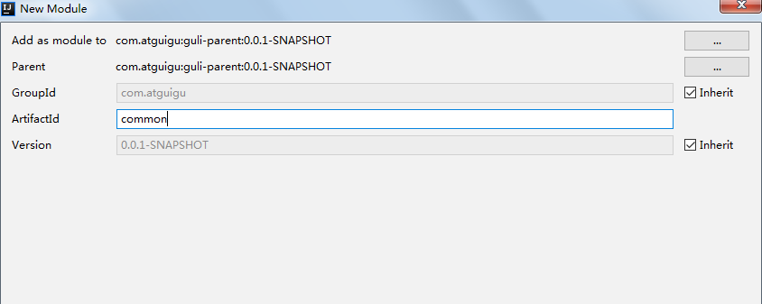

# 在线教育平台

## 1.结构

本平台商业模式是B2B2C模式。

拥有系统后台（管理员使用）、系统前台（普通用户使用）。

|     后台（7大模块）      |                 前台                  |
| :----------------------: | :-----------------------------------: |
|       讲师管理模块       |             首页数据显示              |
|     课程分类管理模块     |            讲师列表和详情             |
|  课程管理模块（1）视频   | 课程列表和课程详情（1）视频的在线播放 |
|       统计分析模块       |              登录和注册               |
|         订单管理         |             微信扫码登录              |
| banner管理（幻灯片切换） |             微信扫码支付              |
|         权限管理         |                                       |

### 1.1 使用技术

项目使用 前后端分离开发


| 后端            | 前端       |
| --------------- | ---------- |
| springboot      | vue        |
| springcloud     | element-ui |
| MybatisPlus     | axios      |
| spring security | node.js    |
| redis           |            |
| maven           |            |
| easyExcel       |            |
| jwt             |            |
| OAuth2          |            |

其他技术：阿里云oss、阿里云视频点播服务、阿里云短信服务、微信支付和登录、docker、git、jenkins

## 2.MybatisPlus

官网：http://mp.baomidou.com/

参考教程：http://mp.baomidou.com/guide/

MP是一个MyBatis的增强工具，在Mybatis的基础上只做增强不做改变，为简化开发、提高效率而生。

### 2.1 开发步骤

#### 2.1.1 创建数据库

创建数据库表，添加数据，用于mp操作。

```mysql
USE `mybatis_plus`;

CREATE TABLE `user`(

`id` BIGINT(20) NOT NULL COMMENT '主键id',
`name` VARCHAR(30) NULL DEFAULT NULL COMMENT '姓名',
`age` INT(11) NULL DEFAULT NULL COMMENT '年龄',
`email` VARCHAR(50) NULL DEFAULT NULL COMMENT '邮箱',
PRIMARY KEY (id)
);

INSERT INTO `user` (id,`name`,age,email) VALUES 
(1, 'Jone',18,'test1@baomidou.com'),
(2, 'Jack', 20, 'test2@baomidou.com'),
(3, 'Tom', 28, 'test3@baomidou.com'),
(4, 'Sandy', 21, 'test4@baomidou.com'),
(5, 'Billie', 24, 'test5@baomidou.com');

```

#### 2.1.2 创建springboot工程

主要就是操作idea，springboot版本使用2.2.1.RELEASE

#### 2.1.3 引入依赖

springboot和mp的依赖。

```xml
<dependencies>
    <dependency>
        <groupId>org.springframework.boot</groupId>
        <artifactId>spring-boot-starter</artifactId>
    </dependency>

    <dependency>
        <groupId>org.springframework.boot</groupId>
        <artifactId>spring-boot-starter-test</artifactId>
        <scope>test</scope>
        <exclusions>
            <exclusion>
                <groupId>org.junit.vintage</groupId>
                <artifactId>junit-vintage-engine</artifactId>
            </exclusion>
        </exclusions>
    </dependency>

    <dependency>
        <groupId>com.baomidou</groupId>
        <artifactId>mybatis-plus-boot-starter</artifactId>
        <version>3.0.5</version>
    </dependency>

    <dependency>
        <groupId>mysql</groupId>
        <artifactId>mysql-connector-java</artifactId>
        <version>8.0.23</version>
    </dependency>

    <dependency>
        <groupId>org.projectlombok</groupId>
        <artifactId>lombok</artifactId>
        <version>1.18.18</version>
    </dependency>

</dependencies>
```

#### 2.1.4 配置application.properties

```xml
spring.datasource.driver-class-name=com.mysql.cj.jdbc.Driver #如果是mysql 8+ 需要加cj和下面的时区
spring.datasource.url=jdbc:mysql://localhost:3306/mybatis_plus?serverTimezone=GMT%2B8
spring.datasource.username=root
spring.datasource.password=000
```

另一种配置文件是yml，也可以。

#### 2.1.5 写代码

* 实体类

```java
@Data
@AllArgsConstructor
@NoArgsConstructor
public class User {

    private Long id;
    private String name;
    private Integer age;
    private String email;

}
```

* 启动类

启动类加mapperscan，自动扫描对应的mapper

#### 2.1.6 性能分析插件

性能分析拦截器：

1. 在配置类中加上性能分析插件：

```java
@Bean
@Profile({"dev","test"})//有三种环境：dev : 开发环境，test : 测试环境， prod : 生产环境
public PerformanceInterceptor performanceInterceptor(){
    PerformanceInterceptor performanceInterceptor = new PerformanceInterceptor();
    performanceInterceptor.setMaxTime(100);//ms,超过此处设置的ms则sql不执行
    performanceInterceptor.setFormat(true);
    return performanceInterceptor;
}
```

2. Springboot中设置dev环境

```xml
spring.profiles.active=dev
```

## 3. 搭建项目

### 3.1模块说明

**guli-parent：在线教学根目录（父工程），管理四个子模块：**

  **canal-client**：canal数据库表同步模块（统计同步数据）**

  **common**：公共模块父节点**

​    common-util：工具类模块，所有模块都可以依赖于它

​    service-base：service服务的base包，包含service服务的公共配置类，所有service模块依赖于它

​    spring-security：认证与授权模块，需要认证授权的service服务依赖于它

  **infrastructure**：基础服务模块父节点**

​    api-gateway：api网关服务

  **service**：api接口服务父节点**

> > > service-acl：用户权限管理api接口服务（用户管理、角色管理和权限管理等）
>
> > > service-cms：cms api接口服务
>
> > > service-edu：教学相关api接口服务
>
> > > service-msm：短信api接口服务
>
> > > service-order：订单相关api接口服务
>
> > > service-oss：阿里云oss api接口服务
>
> > > service-statistics：统计报表api接口服务
>
> > > service-ucenter：会员api接口服务
>
> > > service-vod：视频点播api接口服务

### 3.2 父工程中添加依赖 

在<artifactId>节点后面添加pom类型

```xml
<artifactId>guli-parent</artifactId>
<packaging>pom</packaging>
```

添加properties确定依赖版本

```xml
<properties>
    <java.version>1.8</java.version>
    <guli.version>0.0.1-SNAPSHOT</guli.version>
    <mybatis-plus.version>3.0.5</mybatis-plus.version>
    <velocity.version>2.0</velocity.version>
    <swagger.version>2.7.0</swagger.version>
    <aliyun.oss.version>2.8.3</aliyun.oss.version>
    <jodatime.version>2.10.1</jodatime.version>
    <poi.version>3.17</poi.version>
    <commons-fileupload.version>1.3.1</commons-fileupload.version>
    <commons-io.version>2.6</commons-io.version>
    <httpclient.version>4.5.1</httpclient.version>
    <jwt.version>0.7.0</jwt.version>
    <aliyun-java-sdk-core.version>4.3.3</aliyun-java-sdk-core.version>
    <aliyun-sdk-oss.version>3.1.0</aliyun-sdk-oss.version>
    <aliyun-java-sdk-vod.version>2.15.2</aliyun-java-sdk-vod.version>
    <aliyun-java-vod-upload.version>1.4.11</aliyun-java-vod-upload.version>
    <aliyun-sdk-vod-upload.version>1.4.11</aliyun-sdk-vod-upload.version>
    <fastjson.version>1.2.28</fastjson.version>
    <gson.version>2.8.2</gson.version>
    <json.version>20170516</json.version>
    <commons-dbutils.version>1.7</commons-dbutils.version>
    <canal.client.version>1.1.0</canal.client.version>
    <docker.image.prefix>zx</docker.image.prefix>
    <cloud-alibaba.version>0.2.2.RELEASE</cloud-alibaba.version>
</properties>
```

配置`dependencyManagement`

```xml
<dependencyManagement>
    <dependencies>
        <!--Spring Cloud-->
        <dependency>
            <groupId>org.springframework.cloud</groupId>
            <artifactId>spring-cloud-dependencies</artifactId>
            <version>Hoxton.RELEASE</version>
            <type>pom</type>
            <scope>import</scope>
        </dependency>

        <dependency>
            <groupId>org.springframework.cloud</groupId>
            <artifactId>spring-cloud-alibaba-dependencies</artifactId>
            <version>${cloud-alibaba.version}</version>
            <type>pom</type>
            <scope>import</scope>
        </dependency>
        <!--mybatis-plus 持久层-->
        <dependency>
            <groupId>com.baomidou</groupId>
            <artifactId>mybatis-plus-boot-starter</artifactId>
            <version>${mybatis-plus.version}</version>
        </dependency>

        <!-- velocity 模板引擎, Mybatis Plus 代码生成器需要 -->
        <dependency>
            <groupId>org.apache.velocity</groupId>
            <artifactId>velocity-engine-core</artifactId>
            <version>${velocity.version}</version>
        </dependency>

        <!--swagger-->
        <dependency>
            <groupId>io.springfox</groupId>
            <artifactId>springfox-swagger2</artifactId>
            <version>${swagger.version}</version>
        </dependency>
        <!--swagger ui-->
        <dependency>
            <groupId>io.springfox</groupId>
            <artifactId>springfox-swagger-ui</artifactId>
            <version>${swagger.version}</version>
        </dependency>

        <!--aliyunOSS-->
        <dependency>
            <groupId>com.aliyun.oss</groupId>
            <artifactId>aliyun-sdk-oss</artifactId>
            <version>${aliyun.oss.version}</version>
        </dependency>

        <!--日期时间工具-->
        <dependency>
            <groupId>joda-time</groupId>
            <artifactId>joda-time</artifactId>
            <version>${jodatime.version}</version>
        </dependency>

        <!--xls-->
        <dependency>
            <groupId>org.apache.poi</groupId>
            <artifactId>poi</artifactId>
            <version>${poi.version}</version>
        </dependency>
        <!--xlsx-->
        <dependency>
            <groupId>org.apache.poi</groupId>
            <artifactId>poi-ooxml</artifactId>
            <version>${poi.version}</version>
        </dependency>

        <!--文件上传-->
        <dependency>
            <groupId>commons-fileupload</groupId>
            <artifactId>commons-fileupload</artifactId>
            <version>${commons-fileupload.version}</version>
        </dependency>

        <!--commons-io-->
        <dependency>
            <groupId>commons-io</groupId>
            <artifactId>commons-io</artifactId>
            <version>${commons-io.version}</version>
        </dependency>

        <!--httpclient-->
        <dependency>
            <groupId>org.apache.httpcomponents</groupId>
            <artifactId>httpclient</artifactId>
            <version>${httpclient.version}</version>
        </dependency>

        <dependency>
            <groupId>com.google.code.gson</groupId>
            <artifactId>gson</artifactId>
            <version>${gson.version}</version>
        </dependency>

        <!-- JWT -->
        <dependency>
            <groupId>io.jsonwebtoken</groupId>
            <artifactId>jjwt</artifactId>
            <version>${jwt.version}</version>
        </dependency>

        <!--aliyun-->
        <dependency>
            <groupId>com.aliyun</groupId>
            <artifactId>aliyun-java-sdk-core</artifactId>
            <version>${aliyun-java-sdk-core.version}</version>
        </dependency>
        <dependency>
            <groupId>com.aliyun.oss</groupId>
            <artifactId>aliyun-sdk-oss</artifactId>
            <version>${aliyun-sdk-oss.version}</version>
        </dependency>
        <dependency>
            <groupId>com.aliyun</groupId>
            <artifactId>aliyun-java-sdk-vod</artifactId>
            <version>${aliyun-java-sdk-vod.version}</version>
        </dependency>
        <dependency>
            <groupId>com.aliyun</groupId>
            <artifactId>aliyun-java-vod-upload</artifactId>
            <version>${aliyun-java-vod-upload.version}</version>
        </dependency>
        <dependency>
            <groupId>com.aliyun</groupId>
            <artifactId>aliyun-sdk-vod-upload</artifactId>
            <version>${aliyun-sdk-vod-upload.version}</version>
        </dependency>
        <dependency>
            <groupId>com.alibaba</groupId>
            <artifactId>fastjson</artifactId>
            <version>${fastjson.version}</version>
        </dependency>
        <dependency>
            <groupId>org.json</groupId>
            <artifactId>json</artifactId>
            <version>${json.version}</version>
        </dependency>

        <dependency>
            <groupId>commons-dbutils</groupId>
            <artifactId>commons-dbutils</artifactId>
            <version>${commons-dbutils.version}</version>
        </dependency>

        <dependency>
            <groupId>com.alibaba.otter</groupId>
            <artifactId>canal.client</artifactId>
            <version>${canal.client.version}</version>
        </dependency>
    </dependencies>
</dependencyManagement>
```

### 3.3 子模块service

1. 添加模块类型是pom

artifactId节点后面添加pom类型

```xml
<artifactId>service</artifactId>
<packaging>pom</packaging>
```

2. 添加依赖

```xml
<dependencies>
    <dependency>
        <groupId>org.springframework.cloud</groupId>
        <artifactId>spring-cloud-starter-netflix-ribbon</artifactId>
    </dependency>

    <!--hystrix依赖，主要是用  @HystrixCommand -->
    <dependency>
        <groupId>org.springframework.cloud</groupId>
        <artifactId>spring-cloud-starter-netflix-hystrix</artifactId>
    </dependency>

    <!--服务注册-->
    <dependency>
        <groupId>org.springframework.cloud</groupId>
        <artifactId>spring-cloud-starter-alibaba-nacos-discovery</artifactId>
    </dependency>
    <!--服务调用-->
    <dependency>
        <groupId>org.springframework.cloud</groupId>
        <artifactId>spring-cloud-starter-openfeign</artifactId>
    </dependency>

    <dependency>
        <groupId>org.springframework.boot</groupId>
        <artifactId>spring-boot-starter-web</artifactId>
    </dependency>

    <!--mybatis-plus-->
    <dependency>
        <groupId>com.baomidou</groupId>
        <artifactId>mybatis-plus-boot-starter</artifactId>
    </dependency>

    <!--mysql-->
    <dependency>
        <groupId>mysql</groupId>
        <artifactId>mysql-connector-java</artifactId>
    </dependency>

    <!-- velocity 模板引擎, Mybatis Plus 代码生成器需要 -->
    <dependency>
        <groupId>org.apache.velocity</groupId>
        <artifactId>velocity-engine-core</artifactId>
    </dependency>

    <!--swagger-->
    <dependency>
        <groupId>io.springfox</groupId>
        <artifactId>springfox-swagger2</artifactId>
    </dependency>
    <dependency>
        <groupId>io.springfox</groupId>
        <artifactId>springfox-swagger-ui</artifactId>
    </dependency>

    <!--lombok用来简化实体类：需要安装lombok插件-->
    <dependency>
        <groupId>org.projectlombok</groupId>
        <artifactId>lombok</artifactId>
    </dependency>

    <!--xls-->
    <dependency>
        <groupId>org.apache.poi</groupId>
        <artifactId>poi</artifactId>
    </dependency>

    <dependency>
        <groupId>org.apache.poi</groupId>
        <artifactId>poi-ooxml</artifactId>
    </dependency>

    <dependency>
        <groupId>commons-fileupload</groupId>
        <artifactId>commons-fileupload</artifactId>
    </dependency>

    <!--httpclient-->
    <dependency>
        <groupId>org.apache.httpcomponents</groupId>
        <artifactId>httpclient</artifactId>
    </dependency>
    <!--commons-io-->
    <dependency>
        <groupId>commons-io</groupId>
        <artifactId>commons-io</artifactId>
    </dependency>
    <!--gson-->
    <dependency>
        <groupId>com.google.code.gson</groupId>
        <artifactId>gson</artifactId>
    </dependency>

    <dependency>
        <groupId>junit</groupId>
        <artifactId>junit</artifactId>
        <version>4.12</version>
    </dependency>
</dependencies>
```

### 3.4开发讲师管理模块

1. 创建application.properties文件

2. 编写controller、 service 、 mapper 内容

mp提供了代码生成器，生成相关代码

**resources目录下创建文件 application.properties**

 

```
# 服务端口
server.port=8001
# 服务名
spring.application.name=service-edu
# 环境设置：dev、test、prod
spring.profiles.active=dev
# mysql数据库连接
spring.datasource.driver-class-name=com.mysql.cj.jdbc.Driver
spring.datasource.url=jdbc:mysql://localhost:3306/guli?serverTimezone=GMT%2B8
spring.datasource.username=root
spring.datasource.password=root
#mybatis日志
mybatis-plus.configuration.log-impl=org.apache.ibatis.logging.stdout.StdOutImpl
```

## 

**或者在resources目录下创建文件 application.yml**

 ```properties
# 服务端口
server.port=8001
# 服务名
spring.application.name=service-edu

# 环境设置：dev、test、prod
spring.profiles.active=dev

# mysql数据库连接
spring.datasource.driver-class-name=com.mysql.cj.jdbc.Driver
spring.datasource.url=jdbc:mysql://localhost:3306/guli?serverTimezone=GMT%2B8
spring.datasource.username=root
spring.datasource.password=000

#返回json的全局时间格式
spring.jackson.date-format=yyyy-MM-dd HH:mm:ss
spring.jackson.time-zone=GMT+8


#mybatis日志
mybatis-plus.configuration.log-impl=org.apache.ibatis.logging.stdout.StdOutImpl
 ```

或者：

```yaml
#### application.yml
spring:
  application:
    name: service-edu
profiles:
    active: dev
####  application-dev.yml
server:
  port: 8001
mybatis-plus:
  configuration:
    log-impl: org.apache.ibatis.logging.stdout.StdOutImpl
mapper-locations: classpath:com/atguigu/service/*/mapper/*.xml
global-config:
    db-config:
      logic-delete-value: 1
logic-not-delete-value: 0
spring:
datasource:
    type: com.zaxxer.hikari.HikariDataSource
driver-class-name: com.mysql.cj.jdbc.Driver
url: jdbc:mysql://localhost:3306/guli?serverTimezone=GMT%2B8
username: root
password: root
hikari:
      connection-test-query: SELECT 1
connection-timeout: 60000
idle-timeout: 500000
max-lifetime: 540000
maximum-pool-size: 12
minimum-idle: 10
pool-name: GuliHikariPool
jackson:
    date-format: yyyy-MM-dd HH:mm:ss
time-zone: GMT+8
```

#### 3.4.1 创建MP代码生成器 

在test/java目录下创建包`com.atguigu.eduservice`，创建代码生成器：`CodeGenerator.java`

```java
public class getCode {
    @Test
    public void main1() {
        // 1、创建代码生成器
        AutoGenerator mpg = new AutoGenerator();
        // 2、全局配置
        GlobalConfig gc = new GlobalConfig();
        String projectPath = System.getProperty("user.dir");
        System.out.println(projectPath);
        gc.setOutputDir(projectPath + "/src/main/java");
        gc.setAuthor("atguigu");
        gc.setOpen(false); //生成后是否打开资源管理器
        gc.setFileOverride(false); //重新生成时文件是否覆盖
        /*
         * mp生成service层代码，默认接口名称第一个字母有 I
         * UcenterService
         * */
        gc.setServiceName("%sService"); //去掉Service接口的首字母I
        gc.setIdType(IdType.ID_WORKER); //主键策略
        gc.setDateType(DateType.ONLY_DATE);//定义生成的实体类中日期类型
        gc.setSwagger2(true);//开启Swagger2模式
        mpg.setGlobalConfig(gc);
        // 3、数据源配置
        DataSourceConfig dsc = new DataSourceConfig();
        dsc.setUrl("jdbc:mysql://localhost:3306/guli?serverTimezone=GMT%2B8");
        dsc.setDriverName("com.mysql.cj.jdbc.Driver");
        dsc.setUsername("root");
        dsc.setPassword("root");
        dsc.setDbType(DbType.MYSQL);
        mpg.setDataSource(dsc);
        // 4、包配置
        PackageConfig pc = new PackageConfig();
        pc.setModuleName("serviceedu"); //模块名
        pc.setParent("com.atguigu");
        pc.setController("controller");
        pc.setEntity("entity");
        pc.setService("service");
        pc.setMapper("mapper");
        mpg.setPackageInfo(pc);
        // 5、策略配置
        StrategyConfig strategy = new StrategyConfig();
        strategy.setInclude("edu_teacher");
        strategy.setNaming(NamingStrategy.underline_to_camel);//数据库表映射到实体的命名策略
        strategy.setTablePrefix(pc.getModuleName() + "_"); //生成实体时去掉表前缀
        strategy.setColumnNaming(NamingStrategy.underline_to_camel);//数据库表字段映射到实体的命名策略
        strategy.setEntityLombokModel(true); // lombok 模型 @Accessors(chain = true) setter链式操作
        strategy.setRestControllerStyle(true); //restful api风格控制器
        strategy.setControllerMappingHyphenStyle(true); //url中驼峰转连字符
        mpg.setStrategy(strategy);
        // 6、执行
        mpg.execute();
    }
}
```

#### 3.4.2 编写后台管理api接口

**1、编写controller代码**

```java
@Autowired
private TeacherService teacherService;
@GetMapping
public List<Teacher> list(){
    return teacherService.list(null);
}
```

**2. 创建SpringBoot配置类**

在edu包下创建config包，创建MyBatisPlusConfig.java

```java
package com.guli.edu.config;
@Configuration
@EnableTransactionManagement
@MapperScan("com.atguigu.eduservice.mapper")
public class MyBatisPlusConfig {
    
}
```

**3、配置SQL执行性能分析插件**

```java
/**
     * SQL 执行性能分析插件
     * 开发环境使用，线上不推荐。 maxTime 指的是 sql 最大执行时长
     */
@Bean
@Profile({"dev","test"})// 设置 dev test 环境开启
public PerformanceInterceptor performanceInterceptor() {
    PerformanceInterceptor performanceInterceptor = new PerformanceInterceptor();
    performanceInterceptor.setMaxTime(1000);//ms，超过此处设置的ms则sql不执行
    performanceInterceptor.setFormat(true);
    return performanceInterceptor;
}
```

#### 3.4.3 创建SpringBoot启动类**

创建启动类 EduApplication.java，注意启动类的创建位置

```java
@SpringBootApplication
public class EduApplication {
    public static void main(String[] args) {
        SpringApplication.run(EduApplication.class, args);
    }
}
```

#### 3.4.4 运行启动类

访问http://localhost:8001/eduservice/teacher

得到json数据

#### 3.4.5 统一返回的json时间格式

默认情况下json时间格式带有时区，并且是世界标准时间，和我们的时间差了八个小时

在application.properties中设置

```xml
#返回json的全局时间格式
spring.jackson.date-format=yyyy-MM-dd HH:mm:ss
spring.jackson.time-zone=GMT+8
```

### 3.5 讲师逻辑删除

#### 3.5.1 EduTeacherController添加删除方法

```java
@DeleteMapping("{id}")
public boolean removeById(@PathVariable String id){
    return teacherService.removeById(id);
}
```

#### 3.5.2 配置逻辑删除插件

```
MyBatisPlusConfig中配置
```

 

```java
/**
      * 逻辑删除插件
      */
@Bean
public ISqlInjector sqlInjector() {
    return new LogicSqlInjector();
}
```

### 3.6 Swagger2介绍 

前后端分离开发模式中，api文档是最好的沟通方式。

Swagger 是一个规范和完整的框架，用于生成、描述、调用和可视化 RESTful 风格的 Web 服务。

及时性 (接口变更后，能够及时准确地通知相关前后端开发人员)规范性 (并且保证接口的规范性，如接口的地址，请求方式，参数及响应格式和错误信息)一致性 (接口信息一致，不会出现因开发人员拿到的文档版本不一致，而出现分歧)可测性 (直接在接口文档上进行测试，以方便理解业务)

#### 3.6.1 配置Swagger2

**1、创建common模块**

**在guli-parent下创建模块common**

配置：

`groupId：com.atguigu`

`artifactId：common`



**2、在common中引入相关依赖**

```xml
 <dependencies>
        <dependency>
            <groupId>org.springframework.boot</groupId>
            <artifactId>spring-boot-starter-web</artifactId>
            <scope>provided </scope>
        </dependency>
        <!--mybatis-plus-->
        <dependency>
            <groupId>com.baomidou</groupId>
            <artifactId>mybatis-plus-boot-starter</artifactId>
            <scope>provided </scope>
        </dependency>
        <!--lombok用来简化实体类：需要安装lombok插件-->
        <dependency>
            <groupId>org.projectlombok</groupId>
            <artifactId>lombok</artifactId>
            <scope>provided </scope>
        </dependency>
        <!--swagger-->
        <dependency>
            <groupId>io.springfox</groupId>
            <artifactId>springfox-swagger2</artifactId>
            <scope>provided </scope>
        </dependency>
        <dependency>
            <groupId>io.springfox</groupId>
            <artifactId>springfox-swagger-ui</artifactId>
            <scope>provided </scope>
        </dependency>
        <!-- redis -->
        <dependency>
            <groupId>org.springframework.boot</groupId>
            <artifactId>spring-boot-starter-data-redis</artifactId>
        </dependency>
        <!-- spring2.X集成redis所需common-pool2
        <dependency>
            <groupId>org.apache.commons</groupId>
            <artifactId>commons-pool2</artifactId>
            <version>2.6.0</version>
        </dependency>-->
    </dependencies>
```

**3.在模块service-base中，创建swagger的配置类**

创建包`com.atguigu.servicebase.config`，创建类`SwaggerConfig`

```java
@Configuration
@EnableSwagger2
public class SwaggerConfig {
    @Bean
    public Docket webApiConfig(){
        return new Docket(DocumentationType.SWAGGER_2)
                .groupName("webApi")
                .apiInfo(webApiInfo())
                .select()
                .paths(Predicates.not(PathSelectors.regex("/admin/.*")))
                .paths(Predicates.not(PathSelectors.regex("/error.*")))
                .build();
    }
    
    private ApiInfo webApiInfo(){
        return new ApiInfoBuilder()
                .title("网站-课程中心API文档")
                .description("本文档描述了课程中心微服务接口定义")
                .version("1.0")
                .contact(new Contact("Helen", "http://atguigu.com", "55317332@qq.com"))
                .build();
    }
}
```

**4、在模块service模块中引入service-base**

```xml
<dependency>
    <groupId>com.atguigu</groupId>
    <artifactId>service-base</artifactId>
    <version>0.0.1-SNAPSHOT</version>
</dependency>
```

**5、在service-edu启动类上添加注解，进行测试**


#### 3.6.2 API模型

可以添加一些自定义设置，例如：

定义样例数据

```java
@ApiModelProperty(value = "创建时间", example = "2019-01-01 8:00:00")
@TableField(fill = FieldFill.INSERT)
private Date gmtCreate;
@ApiModelProperty(value = "更新时间", example = "2019-01-01 8:00:00")
@TableField(fill = FieldFill.INSERT_UPDATE)
private Date gmtModified;
```


#### 3.6.3 定义接口说明和参数说明

定义在类上：@Api

定义在方法上：@ApiOperation

定义在参数上：@ApiParam

```java
@Api(description="讲师管理")
@RestController
@RequestMapping("/admin/edu/teacher")
public class TeacherAdminController {
    @Autowired
    private TeacherService teacherService;
    @ApiOperation(value = "所有讲师列表")
    @GetMapping
    public List<Teacher> list(){
        return teacherService.list(null);
    }
    @ApiOperation(value = "根据ID删除讲师")
    @DeleteMapping("{id}")
    public boolean removeById(
            @ApiParam(name = "id", value = "讲师ID", required = true)
            @PathVariable String id){
        return teacherService.removeById(id);
    }
}
```

### 3.7 统一返回数据格式

项目中我们会将响应封装成`json`返回，一般我们会将所有接口的数据格式统一， 使前端(iOS Android, Web)对数据的操作更一致、轻松。

一般情况下，统一返回数据格式没有固定的格式，只要能描述清楚返回的数据状态以及要返回的具体数据就可以。但是一般会包含状态码、返回消息、数据这几部分内容

例如，我们的系统要求返回的基本数据格式如下：

**列表：**

```json
{
  "success": true,
  "code": 20000,
  "message": "成功",
  "data": {
    "items": [
      {
        "id": "1",
        "name": "刘德华",
        "intro": "毕业于师范大学数学系，热爱教育事业，执教数学思维6年有余"
      }
    ]
  }
}
```

**分页：**

```json
{
  "success": true,
  "code": 20000,
  "message": "成功",
  "data": {
    "total": 17,
    "rows": [
      {
        "id": "1",
        "name": "刘德华",
        "intro": "毕业于师范大学数学系，热爱教育事业，执教数学思维6年有余"
      }
    ]
  }
}
```

**没有返回数据：**

```json
{
  "success": true,
  "code": 20000,
  "message": "成功",
  "data": {}
}
```

**失败：**

```json
{
  "success": false,
  "code": 20001,
  "message": "失败",
  "data": {}
}
```

因此，我们定义统一结果

```json
{
  "success": 布尔, //响应是否成功
  "code": 数字, //响应码
  "message": 字符串, //返回消息
  "data": HashMap //返回数据，放在键值对中
}
```

#### 3.7.2 创建统一结果返回类 

**1、在common模块下创建子模块common-utils**


**2、创建接口定义返回码**

**创建包com.atguigu.commonutils，创建接口 ResultCode.java**

 

```java
package com.atguigu.commonutils;
public interface ResultCode {
    public static Integer SUCCESS = 20000;
    public static Integer ERROR = 20001;
}
```

**3、创建结果类**

**创建类 R.java**

 

```java
@Data
public class R {
    @ApiModelProperty(value = "是否成功")
    private Boolean success;
    @ApiModelProperty(value = "返回码")
    private Integer code;
    @ApiModelProperty(value = "返回消息")
    private String message;
    @ApiModelProperty(value = "返回数据")
    private Map<String, Object> data = new HashMap<String, Object>();
    private R(){}
    public static R ok(){
        R r = new R();
        r.setSuccess(true);
        r.setCode(ResultCode.SUCCESS);
        r.setMessage("成功");
        return r;
    }
    public static R error(){
        R r = new R();
        r.setSuccess(false);
        r.setCode(ResultCode.ERROR);
        r.setMessage("失败");
        return r;
    }
    public R success(Boolean success){
        this.setSuccess(success);
        return this;
    }
    public R message(String message){
        this.setMessage(message);
        return this;
    }
    public R code(Integer code){
        this.setCode(code);
        return this;
    }
    public R data(String key, Object value){
        this.data.put(key, value);
        return this;
    }
    public R data(Map<String, Object> map){
        this.setData(map);
        return this;
    }
}
```

二、统一返回结果使用

1、在service模块中添加依赖

```xml
<dependency>
    <groupId>com.atguigu</groupId>
    <artifactId>common_utils</artifactId>
    <version>0.0.1-SNAPSHOT</version>
</dependency>
```

2、修改Controller中的返回结果

列表

```java
@ApiOperation(value = "所有讲师列表")
@GetMapping
public R list(){
    List<Teacher> list = teacherService.list(null);
    return R.ok().data("items", list);
}
```

删除

```java
@ApiOperation(value = "根据ID删除讲师")
@DeleteMapping("{id}")
public R removeById(
    @ApiParam(name = "id", value = "讲师ID", required = true)
    @PathVariable String id){
    teacherService.removeById(id);
    return R.ok();
}
```

### 3.8 分页

#### 3.8.1 MyBatisPlusConfig中配置分页插件

```java
/**
 * 分页插件
 */
@Bean
public PaginationInterceptor paginationInterceptor() {
    return new PaginationInterceptor();
}
```

#### 3.8.2 分页Controller方法

`TeacherAdminController`中添加分页方法

```java
@ApiOperation(value = "分页讲师列表")
@GetMapping("{page}/{limit}")
public R pageList(
    @ApiParam(name = "page", value = "当前页码", required = true)
    @PathVariable Long page,
    @ApiParam(name = "limit", value = "每页记录数", required = true)
    @PathVariable Long limit){
    Page<Teacher> pageParam = new Page<>(page, limit);
    teacherService.page(pageParam, null);
    List<Teacher> records = pageParam.getRecords();
    long total = pageParam.getTotal();
    return  R.ok().data("total", total).data("rows", records);
}
```

3、Swagger中测试

### 3.9 条件查询

根据讲师名称name，讲师头衔level、讲师入驻时间gmt_create（时间段）查询

#### 3.9.1 创建查询对象

创建`com.guli.edu.query`包，创建`TeacherQuery.java`查询对象

```java
package com.guli.edu.query;
@ApiModel(value = "Teacher查询对象", description = "讲师查询对象封装")
@Data
public class TeacherQuery implements Serializable {
    private static final long serialVersionUID = 1L;
    @ApiModelProperty(value = "教师名称,模糊查询")
    private String name;
    @ApiModelProperty(value = "头衔 1高级讲师 2首席讲师")
    private Integer level;
    
    @ApiModelProperty(value = "查询开始时间", example = "2019-01-01 10:10:10")
    private String begin;//注意，这里使用的是String类型，前端传过来的数据无需进行类型转换
    @ApiModelProperty(value = "查询结束时间", example = "2019-12-01 10:10:10")
    private String end;
}
```

#### 3.9.2 service 

接口

```java
package com.guli.edu.service;
public interface TeacherService extends IService<Teacher> {
    void pageQuery(Page<Teacher> pageParam, TeacherQuery teacherQuery);
}
```

实现

```java
package com.guli.edu.service.impl;
@Service
public class TeacherServiceImpl extends ServiceImpl<TeacherMapper, Teacher> implements TeacherService {
    @Override
    public void pageQuery(Page<Teacher> pageParam, TeacherQuery teacherQuery) {
        QueryWrapper<Teacher> queryWrapper = new QueryWrapper<>();
        queryWrapper.orderByAsc("sort");
        if (teacherQuery == null){
            baseMapper.selectPage(pageParam, queryWrapper);
            return;
        }
        String name = teacherQuery.getName();
        Integer level = teacherQuery.getLevel();
        String begin = teacherQuery.getBegin();
        String end = teacherQuery.getEnd();
        if (!StringUtils.isEmpty(name)) {
            queryWrapper.like("name", name);
        }
        if (!StringUtils.isEmpty(level) ) {
            queryWrapper.eq("level", level);
        }
        if (!StringUtils.isEmpty(begin)) {
            queryWrapper.ge("gmt_create", begin);
        }
        if (!StringUtils.isEmpty(end)) {
            queryWrapper.le("gmt_create", end);
        }
        baseMapper.selectPage(pageParam, queryWrapper);
    }
}
```

#### 3.9.3 controller

TeacherAdminController中修改 pageList方法：

增加参数TeacherQuery teacherQuery，非必选

```java
@ApiOperation(value = "分页讲师列表")
@GetMapping("{page}/{limit}")
public R pageQuery(
    @ApiParam(name = "page", value = "当前页码", required = true)
    @PathVariable Long page,
    @ApiParam(name = "limit", value = "每页记录数", required = true)
    @PathVariable Long limit,
    @ApiParam(name = "teacherQuery", value = "查询对象", required = false)
    TeacherQuery teacherQuery){
    Page<Teacher> pageParam = new Page<>(page, limit);
    teacherService.pageQuery(pageParam, teacherQuery);
    List<Teacher> records = pageParam.getRecords();
    long total = pageParam.getTotal();
    return  R.ok().data("total", total).data("rows", records);
}
```

#### 3.9.4 Swagger中测试

一、自动填充封装

1、在service-base模块中添加

**创建包handler，创建自动填充类 MyMetaObjectHandler** 

```java
@Component
public class MyMetaObjectHandler implements MetaObjectHandler {
    @Override
    public void insertFill(MetaObject metaObject) {
        this.setFieldValByName("gmtCreate", new Date(), metaObject);
        this.setFieldValByName("gmtModified", new Date(), metaObject);
    }
    @Override
    public void updateFill(MetaObject metaObject) {
        this.setFieldValByName("gmtModified", new Date(), metaObject);
    }
}
```

2、在实体类添加自动填充注解


**二、controller方法定义**

1、新增 

```java
@ApiOperation(value = "新增讲师")
@PostMapping
public R save(
    @ApiParam(name = "teacher", value = "讲师对象", required = true)
    @RequestBody Teacher teacher){
    teacherService.save(teacher);
    return R.ok();
}
```

2、根据id查询

```java
@ApiOperation(value = "根据ID查询讲师")
@GetMapping("{id}")
public R getById(
    @ApiParam(name = "id", value = "讲师ID", required = true)
    @PathVariable String id){
    Teacher teacher = teacherService.getById(id);
    return R.ok().data("item", teacher);
}
```

3、根据id修改 

```java
@ApiOperation(value = "根据ID修改讲师")
@PutMapping("{id}")
public R updateById(
    @ApiParam(name = "id", value = "讲师ID", required = true)
    @PathVariable String id,
    @ApiParam(name = "teacher", value = "讲师对象", required = true)
    @RequestBody Teacher teacher){
    teacher.setId(id);
    teacherService.updateById(teacher);
    return R.ok();
}
```

### 3.10 统一异常处理

**1、制造异常**

除以0 

```
int a = 10/0;
```


我们想让异常结果也显示为统一的返回结果对象，并且统一处理系统的异常信息，那么需要统一异常处理

**1、创建统一异常处理器**

在service-base中创建统一异常处理类GlobalExceptionHandler.java：

```java
/**
 * 统一异常处理类
 */
@ControllerAdvice
public class GlobalExceptionHandler {
    @ExceptionHandler(Exception.class)
    @ResponseBody
    public R error(Exception e){
        e.printStackTrace();
        return R.error();
    }
}
```

**2、测试** 

返回统一错误结果


处理特定异常

**1、添加异常处理方法** 

GlobalExceptionHandler.java中添加

```java
@ExceptionHandler(ArithmeticException.class)
@ResponseBody
public R error(ArithmeticException e){
    e.printStackTrace();
    return R.error().message("执行了自定义异常");
}
```

**2、测试**


**四、自定义异常**

1、创建自定义异常类

```java
@Data
@AllArgsConstructor
@NoArgsConstructor
public class GuliException extends RuntimeException {
    @ApiModelProperty(value = "状态码")
    private Integer code;
    private String msg;
    
}
```

2、业务中需要的位置抛出GuliException

```java
try {
    int a = 10/0;
}catch(Exception e) {
    throw new GuliException(20001,"出现自定义异常");
}
```

3、添加异常处理方法

GlobalExceptionHandler.java中添加

```java
@ExceptionHandler(GuliException.class)
@ResponseBody
public R error(GuliException e){
    e.printStackTrace();
    return R.error().message(e.getMsg()).code(e.getCode());
}
```

4、测试 


### 3.11 统一日志处理

1、配置日志级别

日志记录器（Logger）的行为是分等级的。如下表所示：

分为：OFF、FATAL、ERROR、WARN、INFO、DEBUG、ALL

默认情况下，spring boot从控制台打印出来的日志级别只有INFO及以上级别，可以配置日志级别 

```xml
# 设置日志级别
logging.level.root=WARN
```

这种方式只能将日志打印在控制台上

二、Logback日志

spring boot内部使用Logback作为日志实现的框架。

Logback和log4j非常相似，如果你对log4j很熟悉，那对logback很快就会得心应手。

logback相对于log4j的一些优点：https://blog.csdn.net/caisini_vc/article/details/48551287

1、配置logback日志

删除application.properties中的日志配置

安装idea彩色日志插件：grep-console

resources 中创建 logback-spring.xml  

```xml
<?xml version="1.0" encoding="UTF-8"?>
<configuration  scan="true" scanPeriod="10 seconds">
    <!-- 日志级别从低到高分为TRACE < DEBUG < INFO < WARN < ERROR < FATAL，如果设置为WARN，则低于WARN的信息都不会输出 -->
    <!-- scan:当此属性设置为true时，配置文件如果发生改变，将会被重新加载，默认值为true -->
    <!-- scanPeriod:设置监测配置文件是否有修改的时间间隔，如果没有给出时间单位，默认单位是毫秒。当scan为true时，此属性生效。默认的时间间隔为1分钟。 -->
    <!-- debug:当此属性设置为true时，将打印出logback内部日志信息，实时查看logback运行状态。默认值为false。 -->
    <contextName>logback</contextName>
    <!-- name的值是变量的名称，value的值时变量定义的值。通过定义的值会被插入到logger上下文中。定义变量后，可以使“${}”来使用变量。 -->
    <property name="log.path" value="D:/guli_log/edu" />
    <!-- 彩色日志 -->
    <!-- 配置格式变量：CONSOLE_LOG_PATTERN 彩色日志格式 -->
    <!-- magenta:洋红 -->
    <!-- boldMagenta:粗红-->
    <!-- cyan:青色 -->
    <!-- white:白色 -->
    <!-- magenta:洋红 -->
    <property name="CONSOLE_LOG_PATTERN"
              value="%yellow(%date{yyyy-MM-dd HH:mm:ss}) |%highlight(%-5level) |%blue(%thread) |%blue(%file:%line) |%green(%logger) |%cyan(%msg%n)"/>
    <!--输出到控制台-->
    <appender name="CONSOLE" class="ch.qos.logback.core.ConsoleAppender">
        <!--此日志appender是为开发使用，只配置最底级别，控制台输出的日志级别是大于或等于此级别的日志信息-->
        <!-- 例如：如果此处配置了INFO级别，则后面其他位置即使配置了DEBUG级别的日志，也不会被输出 -->
        <filter class="ch.qos.logback.classic.filter.ThresholdFilter">
            <level>INFO</level>
        </filter>
        <encoder>
            <Pattern>${CONSOLE_LOG_PATTERN}</Pattern>
            <!-- 设置字符集 -->
            <charset>UTF-8</charset>
        </encoder>
    </appender>
    <!--输出到文件-->
    <!-- 时间滚动输出 level为 INFO 日志 -->
    <appender name="INFO_FILE" class="ch.qos.logback.core.rolling.RollingFileAppender">
        <!-- 正在记录的日志文件的路径及文件名 -->
        <file>${log.path}/log_info.log</file>
        <!--日志文件输出格式-->
        <encoder>
            <pattern>%d{yyyy-MM-dd HH:mm:ss.SSS} [%thread] %-5level %logger{50} - %msg%n</pattern>
            <charset>UTF-8</charset>
        </encoder>
        <!-- 日志记录器的滚动策略，按日期，按大小记录 -->
        <rollingPolicy class="ch.qos.logback.core.rolling.TimeBasedRollingPolicy">
            <!-- 每天日志归档路径以及格式 -->
            <fileNamePattern>${log.path}/info/log-info-%d{yyyy-MM-dd}.%i.log</fileNamePattern>
            <timeBasedFileNamingAndTriggeringPolicy class="ch.qos.logback.core.rolling.SizeAndTimeBasedFNATP">
                <maxFileSize>100MB</maxFileSize>
            </timeBasedFileNamingAndTriggeringPolicy>
            <!--日志文件保留天数-->
            <maxHistory>15</maxHistory>
        </rollingPolicy>
        <!-- 此日志文件只记录info级别的 -->
        <filter class="ch.qos.logback.classic.filter.LevelFilter">
            <level>INFO</level>
            <onMatch>ACCEPT</onMatch>
            <onMismatch>DENY</onMismatch>
        </filter>
    </appender>
    <!-- 时间滚动输出 level为 WARN 日志 -->
    <appender name="WARN_FILE" class="ch.qos.logback.core.rolling.RollingFileAppender">
        <!-- 正在记录的日志文件的路径及文件名 -->
        <file>${log.path}/log_warn.log</file>
        <!--日志文件输出格式-->
        <encoder>
            <pattern>%d{yyyy-MM-dd HH:mm:ss.SSS} [%thread] %-5level %logger{50} - %msg%n</pattern>
            <charset>UTF-8</charset> <!-- 此处设置字符集 -->
        </encoder>
        <!-- 日志记录器的滚动策略，按日期，按大小记录 -->
        <rollingPolicy class="ch.qos.logback.core.rolling.TimeBasedRollingPolicy">
            <fileNamePattern>${log.path}/warn/log-warn-%d{yyyy-MM-dd}.%i.log</fileNamePattern>
            <timeBasedFileNamingAndTriggeringPolicy class="ch.qos.logback.core.rolling.SizeAndTimeBasedFNATP">
                <maxFileSize>100MB</maxFileSize>
            </timeBasedFileNamingAndTriggeringPolicy>
            <!--日志文件保留天数-->
            <maxHistory>15</maxHistory>
        </rollingPolicy>
        <!-- 此日志文件只记录warn级别的 -->
        <filter class="ch.qos.logback.classic.filter.LevelFilter">
            <level>warn</level>
            <onMatch>ACCEPT</onMatch>
            <onMismatch>DENY</onMismatch>
        </filter>
    </appender>
    <!-- 时间滚动输出 level为 ERROR 日志 -->
    <appender name="ERROR_FILE" class="ch.qos.logback.core.rolling.RollingFileAppender">
        <!-- 正在记录的日志文件的路径及文件名 -->
        <file>${log.path}/log_error.log</file>
        <!--日志文件输出格式-->
        <encoder>
            <pattern>%d{yyyy-MM-dd HH:mm:ss.SSS} [%thread] %-5level %logger{50} - %msg%n</pattern>
            <charset>UTF-8</charset> <!-- 此处设置字符集 -->
        </encoder>
        <!-- 日志记录器的滚动策略，按日期，按大小记录 -->
        <rollingPolicy class="ch.qos.logback.core.rolling.TimeBasedRollingPolicy">
            <fileNamePattern>${log.path}/error/log-error-%d{yyyy-MM-dd}.%i.log</fileNamePattern>
            <timeBasedFileNamingAndTriggeringPolicy class="ch.qos.logback.core.rolling.SizeAndTimeBasedFNATP">
                <maxFileSize>100MB</maxFileSize>
            </timeBasedFileNamingAndTriggeringPolicy>
            <!--日志文件保留天数-->
            <maxHistory>15</maxHistory>
        </rollingPolicy>
        <!-- 此日志文件只记录ERROR级别的 -->
        <filter class="ch.qos.logback.classic.filter.LevelFilter">
            <level>ERROR</level>
            <onMatch>ACCEPT</onMatch>
            <onMismatch>DENY</onMismatch>
        </filter>
    </appender>
    <!--
        <logger>用来设置某一个包或者具体的某一个类的日志打印级别、以及指定<appender>。
        <logger>仅有一个name属性，
        一个可选的level和一个可选的addtivity属性。
        name:用来指定受此logger约束的某一个包或者具体的某一个类。
        level:用来设置打印级别，大小写无关：TRACE, DEBUG, INFO, WARN, ERROR, ALL 和 OFF，
              如果未设置此属性，那么当前logger将会继承上级的级别。
    -->
    <!--
        使用mybatis的时候，sql语句是debug下才会打印，而这里我们只配置了info，所以想要查看sql语句的话，有以下两种操作：
        第一种把<root level="INFO">改成<root level="DEBUG">这样就会打印sql，不过这样日志那边会出现很多其他消息
        第二种就是单独给mapper下目录配置DEBUG模式，代码如下，这样配置sql语句会打印，其他还是正常DEBUG级别：
     -->
    <!--开发环境:打印控制台-->
    <springProfile name="dev">
        <!--可以输出项目中的debug日志，包括mybatis的sql日志-->
        <logger name="com.guli" level="INFO" />
        <!--
            root节点是必选节点，用来指定最基础的日志输出级别，只有一个level属性
            level:用来设置打印级别，大小写无关：TRACE, DEBUG, INFO, WARN, ERROR, ALL 和 OFF，默认是DEBUG
            可以包含零个或多个appender元素。
        -->
        <root level="INFO">
            <appender-ref ref="CONSOLE" />
            <appender-ref ref="INFO_FILE" />
            <appender-ref ref="WARN_FILE" />
            <appender-ref ref="ERROR_FILE" />
        </root>
    </springProfile>
    <!--生产环境:输出到文件-->
    <springProfile name="pro">
        <root level="INFO">
            <appender-ref ref="CONSOLE" />
            <appender-ref ref="DEBUG_FILE" />
            <appender-ref ref="INFO_FILE" />
            <appender-ref ref="ERROR_FILE" />
            <appender-ref ref="WARN_FILE" />
        </root>
    </springProfile>
</configuration>
```

2. 将错误日志输出到文件

GlobalExceptionHandler.java 中

类上添加注解

```java
 @Slf4j
```

异常输出语句

```java
 log.error(e.getMessage());
```

3. 将日志堆栈信息输出到文件

定义工具类

guli-framework-common下创建util包，创建ExceptionUtil.java工具类

```java
package com.guli.common.util;
public class ExceptionUtil {
    public static String getMessage(Exception e) {
        StringWriter sw = null;
        PrintWriter pw = null;
        try {
            sw = new StringWriter();
            pw = new PrintWriter(sw);
            // 将出错的栈信息输出到printWriter中
            e.printStackTrace(pw);
            pw.flush();
            sw.flush();
        } finally {
            if (sw != null) {
                try {
                    sw.close();
                } catch (IOException e1) {
                    e1.printStackTrace();
                }
            }
            if (pw != null) {
                pw.close();
            }
        }
        return sw.toString();
    }
}
```

调用

```java
log.error(ExceptionUtil.getMessage(e));
```

GuliException中创建toString方法

```java
@Override
public String toString() {
    return "GuliException{" +
        "message=" + this.getMessage() +
        ", code=" + code +
        '}';
}
```

## 4. 前端


## 其他知识

### 1.主键的生成策略

1. 自动增长 

在MYSQL中是AUTO_INCREMENT。在分表中，比如将用户数据放入3张表中，下一张表需要得到上一张表的最后一个值加1才能自动增长。

2. UUID 

每次生成随机唯一的一个值。但是排序不方便，不好索引。

3. Redis生成ID。
4. mp中自带策略

使用snowflake算法生成。19位id。10bit作为机器的ID（5bit是数据中心，5bit是机器ID），12bit作为毫秒内的流水号，最后还有符号位，永远是0。

```java
@TableId(type= IdType.AUTO)
private Long id;
```

`IdType`的类型`AUTO`——自动增长、`ID_WORKER`——生成19位值，数字类型使用这种类型，比如long、`ID_WORKER_STR`——生成19位值，字符串类型使用这种类型，比如String、`INPUT——设置id值`、`NONE：输入`、`UUID`——随机唯一值。

### 2.自动填充

不需要set到对象里面的值，使用mq方式实现数据添加。

1. 在实体类自动填充属性上添加注解：

```java
@TableField(fill= FieldFill.INSERT)
private Date createTime;

@TableField(fill = FieldFill.INSERT_UPDATE)
private Date updateTime;
```

2. 自定义实现类，实现接口`MetaObjectHandler`和接口的方法

```java
@Component
public class MyMetaObjectHandler implements MetaObjectHandler {

    //使用mq实现添加操作，这个方法执行
    @Override
    public void insertFill(MetaObject metaObject) {
        this.setFieldValByName("createTime", new Date(), metaObject);
        this.setFieldValByName("updateTime", new Date(), metaObject);
    }

    //使用mq实现修改操作，这个方法执行
    @Override
    public void updateFill(MetaObject metaObject) {
        this.setFieldValByName("updateTime", new Date(), metaObject);
    }
}
```

### 3.乐观锁

解决丢失更新问题（多个人同时修改同一条记录，最后提交的把之前提交的数据覆盖）。

乐观锁的实现方式：

1. 取出记录时，获取当前的version。
2. 更新时，带上这个version。
3. 执行更新时，`set version = newVersion where version = oldVersion`
4. 如果version不对，就更新失败。

代码中的实现：

1. 表中加字段version


2. 类中加属性version，并且添加`@Version`注解

```java
@Version
private Integer version;
```

3. 配置乐观锁插件

### 4.分页查询

1. 配置分页插件

```java
//分页插件
@Bean
public PaginationInterceptor paginationInterceptor(){
    return new PaginationInterceptor();
}
```

2. 编写分页代码

直接new page对象，传入两个参数。调入mp方法实现分页查询。

```java
@Test
public void testPage(){
    //第一个参数 当前页 第二个 每页显示记录数
    Page<User> page = new Page<>(1, 3);
    //调用mp分页查询过程中，底层封装把分页所有数据封装到page对象里面。
    userMaper.selectPage(page, null);
    //通过page对象获取所有数据
    System.out.println(page.getCurrent());
    System.out.println(page.getRecords());
}
```

### 5. 逻辑删除

数据库表中加上一列`deleted`

* 物理删除：数据真的不在了，在硬件上删除。

```java
@Test
public void testDeleteById(){
    int i = userMaper.deleteById(1L);//物理删除
}

@Test
public void testDeleteBatchIds(){
    int result = userMaper.deleteBatchIds(Arrays.asList(1,2));//批量删除
}
```

* 逻辑删除：逻辑上删除，但数据实际还存在。

1. 表中添加逻辑删除字段，对应实体类添加属性。

```java
@TableLogic
private Integer deleted;
```

2. 配置逻辑插件

```java
@Bean
public ISqlInjector sqlInjector(){
    return new LogicSqlInjector();
}
```

3. 再调用删除语句，就会将deleted字段置为1。（假装删除）

其底层的sql语句是`UPDATE user SET deleted=1 WHERE id=? AND deleted=0 `


