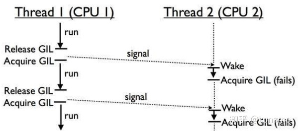

# 安装

### windows

```python
https://blog.csdn.net/weixin_40844416/article/details/80889165
```

python2 和 python3 共存的方法：

[Windows10系统下安装python2和python3双版本 - 暮光微凉 - 博客园 (cnblogs.com)](https://www.cnblogs.com/schut/p/10344597.html)

## 命名规范

| 类别         | 规范                                         | 示例          |
| ------------ | -------------------------------------------- | ------------- |
| 模块名       | 小写字母，单词之间用_分割                    | ad_stats.py   |
| 包名         | 小写字母，单词之间用_分割                    |               |
| 类名         | 单词首字母大写                               | PersonInfo    |
| 全局变量名   | 大写字母，单词之间用_分割                    | COLOR_WRITE   |
| 普通变量     | 小写字母，单词之间用_分割                    | this_is_a_var |
| 实例变量     | 以_开头，其他和普通变量一样                  | _is_var       |
| 私有实例变量 | 以__开头（两个下划线），其他和普通变量一样   | __private_var |
| 专有变量     | 以__开头，\_\_结尾，一般为python的自有变量   | \_\_doc\_\_   |
| 普通函数     | 小写字母，单词之间用_分割                    | dfs           |
| 私有函数     | 以\_\_开头（两个下划线），其他和普通变量一样 | __dfs         |
| 文件名       | 全小写，可使用下划线                         | test.py       |

## 1. Python线程模块

GIL（Global Interpreter Lock，全局解释器锁）不是Python独有的特性，它只是在实现CPython（Python解释器）时，引入的一个概念。在官方网站中定义如下：

> In CPython, the global interpreter lock, or GIL, is a mutex that prevents multiple native threads from executing Python bytecodes at once. This lock is necessary mainly because CPython’s memory management is not thread-safe. (However, since the GIL exists, other features have grown to depend on the guarantees that it enforces.)

由定义可知，==GIL是一个互斥锁（mutex）==。它阻止了 多个线程同时执行Python字节码，毫无疑问，这降低了执行效率。理解GIL的必要性，需要了解CPython对于线程安全的内存管理机制。

首先，我们来看看单核CPU下，多线程任务是如何调度的。


由图可知，由于GIL的机制，单核CPU在同一时刻只有一个线程在运行。当线程遇到IO操作或Timer Tick到期，释放GIL锁。其他的两个线程去竞争这把锁，得到锁之后，才开始运行。

线程释放GIL锁有两种情况，一是遇到IO操作，二是Time Tick到期。IO操作很好理解，比如发出一个http请求，等待响应。那么Time Tick到期是什么呢？Time Tick规定了线程的最长执行时间，超过时间后自动释放GIL锁。

虽然都是释放GIL锁，但这两种情况是不一样的。比如，Thread1遇到IO操作释放GIL，由Thread2和Thread3来竞争这个GIL锁，Thread1不再参与这次竞争。如果是Thread1因为Time Tick到期释放GIL，那么三个线程可以同时竞争这把GIL锁，可能出现Thread1在竞争中胜出，再次执行的情况。单核CPU下，这种情况不算特别糟糕。因为只有1个CPU，所以CPU的利用率是很高的。

在多核CPU下，由于GIL锁的全局特性，无法发挥多核的特性，GIL锁会使得多线程任务的效率大大降低。



Thread1在CPU1上运行，Thread2在CPU2上运行。GIL是全局的，CPU2上的Thread2需要等待CPU1上的Thread1让出GIL锁，才有可能执行。如果在多次竞争中，Thread1都胜出，Thread2没有得到GIL锁，意味着CPU2一直是闲置的，无法发挥多核的优势。

为了避免同一线程霸占CPU，在python3.x中，线程会自动的调整自己的优先级，使得多线程任务执行效率更高。

既然GIL降低了多核的效率，那保留它的目的是什么呢？这就和线程执行的安全有关。

准确的说，GIL的线程安全是粗粒度的。也就是说，有GIL都不意味着线程安全。比如下面这个例子:

```python3
def add():
    global n
    for i in range(10**1000):
        n = n +1
def sub():
    global n
    for i in range(10**1000):
        n = n - 1
n = 0
import threading
a = threading.Thread(target=add,)
b = threading.Thread(target=sub,)
a.start()
b.start()
#join 用于阻塞主线程，避免过早打印n
a.join()
b.join()
print n
```

上面的程序对n做了同样数量的加法和减法，那么n理论上是0。但运行程序，打印n，发现它不是0。问题出在哪里呢，问题在于python的每行代码不是原子化的操作。比如n = n+1这步，不是一次性执行的。如果去查看python编译后的字节码执行过程，可以看到如下结果。

```text
19 LOAD_GLOBAL              1 (n)
22 LOAD_CONST               3 (1)
25 BINARY_ADD          
26 STORE_GLOBAL             1 (n)
```

从过程可以看出，n = n +1 操作分成了四步完成。因此，n = n+1不是一个原子化操作。

1.加载全局变量n，2.加载常数1，3.进行二进制加法运算，4.将运算结果存入变量n。

根据前面的线程释放GIL锁原则，线程a执行这四步的过程中，有可能会让出GIL。如果这样，n=n+1的运算过程就被打乱了。最后的结果中，得到一个非零的n也就不足为奇。

这就是为什么我们说GIL是粗粒度的，它只保证了一定程度的安全。如果要做到线程的绝对安全，是不是所有的非IO操作，我们都需要自己再加一把锁呢？答案是否定的。在python中，有些操作是是原子级的，它本身就是一个字节码，GIL无法在执行过程中释放。对于这种原子级的方法操作，我们无需担心它的安全。比如sort方法，[1,4,2].sort()，翻译成字节码就是CALL METHOD 0。只有一行，无法再分，所以它是线程安全的。

**总结**

对于IO密集型应用，多线程的应用和多进程应用区别不大。即便有GIL存在，由于IO操作会导致GIL释放，其他线程能够获得执行权限。由于多线程的通讯成本低于多进程，因此偏向使用多线程。

对于计算密集型应用，多线程处于绝对劣势，可以采用多进程或协程。

### 1.1 实际使用

python主要通过`thread`和`threading`这两个模块来实现多线程支持。python的thread模块是比较底层的模块，`threding`是对thread做了一些封装，可以更方便的被使用。但是python由于GIL的存在无法使用threading充分利用GPU资源，如果想充分发挥多核CPU的计算能力需要使用`multiprocessing`模块。

### 1.1.1 如何创建线程

`python3.x`中已经放弃了`python2.x`中采用函数式`thread`模块中的`start_new_thread()`函数来产生新线程的方式。

python3中通过threading模块创建新的线程有两种方法：

第一种是通过threading.Thread(Target=executable Method)——即传递给Thread对象一个可执行方法（或对象）。

第二种是继承threading.Thread定义子类并重写run()方法。

（1）通过threading.Thread进行创建多线程

### 1.1.2 为什么python设计了GIL

There are several implementations of Python, for example, CPython, IronPython, RPython, etc.

Some of them have a GIL, some don't. For example, CPython has the GIL:

From http://en.wikipedia.org/wiki/Global_Interpreter_Lock

Applications written in programming languages with a GIL can be designed to use separate processes to achieve full parallelism, as each process has its own interpreter and in turn has its own GIL.

Benefits of the GIL

Increased speed of single-threaded programs.
Easy integration of C libraries that usually are not thread-safe.
Why Python (CPython and others) uses the GIL

From http://wiki.python.org/moin/GlobalInterpreterLock
In CPython, the global interpreter lock, or GIL, is a mutex that prevents multiple native threads from executing Python bytecodes at once. This lock is necessary mainly because CPython's memory management is not thread-safe.

The GIL is controversial because it prevents multithreaded CPython programs from taking full advantage of multiprocessor systems in certain situations. Note that potentially blocking or long-running operations, such as I/O, image processing, and NumPy number crunching, happen outside the GIL. Therefore it is only in multithreaded programs that spend a lot of time inside the GIL, interpreting CPython bytecode, that the GIL becomes a bottleneck.

From http://www.grouplens.org/node/244
Python has a GIL as opposed to fine-grained locking for several reasons:

It is faster in the single-threaded case.

It is faster in the multi-threaded case for i/o bound programs.

It is faster in the multi-threaded case for cpu-bound programs that do their compute-intensive work in C libraries.

It makes C extensions easier to write: there will be no switch of Python threads except where you allow it to happen (i.e. between the Py_BEGIN_ALLOW_THREADS and Py_END_ALLOW_THREADS macros).

It makes wrapping C libraries easier. You don't have to worry about thread-safety. If the library is not thread-safe, you simply keep the GIL locked while you call it.

The GIL can be released by C extensions. Python's standard library releases the GIL around each blocking i/o call. Thus the GIL has no consequence for performance of i/o bound servers. You can thus create networking servers in Python using processes (fork), threads or asynchronous i/o, and the GIL will not get in your way.

Numerical libraries in C or Fortran can similarly be called with the GIL released. While your C extension is waiting for an FFT to complete, the interpreter will be executing other Python threads. A GIL is thus easier and faster than fine-grained locking in this case as well. This constitutes the bulk of numerical work. The NumPy extension releases the GIL whenever possible.

Threads are usually a bad way to write most server programs. If the load is low, forking is easier. If the load is high, asynchronous i/o and event-driven programming (e.g. using Python's Twisted framework) is better. The only excuse for using threads is the lack of os.fork on Windows.

The GIL is a problem if, and only if, you are doing CPU-intensive work in pure Python. Here you can get cleaner design using processes and message-passing (e.g. mpi4py). There is also a 'processing' module in Python cheese shop, that gives processes the same interface as threads (i.e. replace threading.Thread with processing.Process).

Threads can be used to maintain responsiveness of a GUI regardless of the GIL. If the GIL impairs your performance (cf. the discussion above), you can let your thread spawn a process and wait for it to finish.


