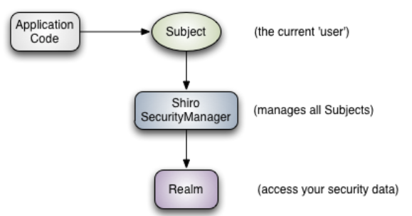
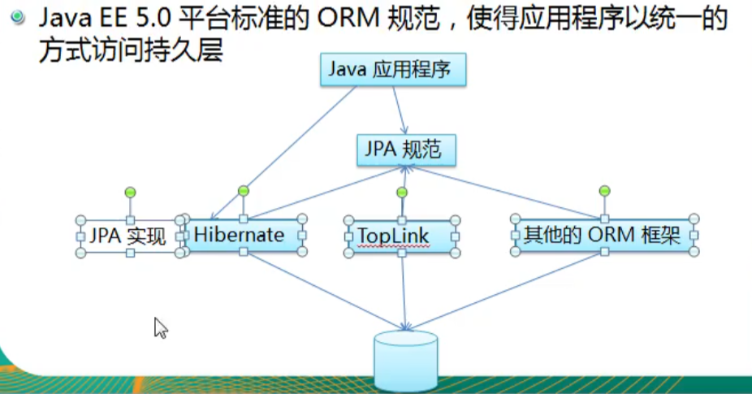

# SpringBoot

## 1.1 自动装配原理

1. springboot在启动时，从类路径下/META-INF/spring.factories 获取指定的值。
2. 将这些自动配置的类导入容器，自动配置就会生效，帮我进行自动配置
3. 以前需要自动配置的东西，springboot帮我们做了。
4. 整合javaEE解决方案和自动配置的东西都在`springbootautoconfiguration`下面


## 2 yaml

```yaml
# 普通
name: qinjiang

# 对象
student:
  name: qinjiang
  age:3
# 行内写法
student: {name: qinjiang, age: 3}

# 数组
pets:
  - cat
  - dog
  - pig
  
pets: [cat,dog,pig]
```


## 3. Shiro

一个Java安全（权限）框架。



* subject：直接交互的对象是subject。
* SecurityManager：安全管理器，所有与安全相关的操作都与此交互，并且管理所有的Subject，相当于SpringMVC中的DispatcherServlet的角色。
* Realm：Shiro从Realm获取安全数据（如用户，角色，权限），就是说SecurityManager要验证用户身份，那么它需要从Realm获取相应的用户进行比较，来确定用户的身份是否合法，可以把Realm看成是DataSource。

## 4.RestTemplate

提供了多种便捷访问远程Http服务的方法。

是一种简单便捷的访问resful服务模板类，是Spring提供的用于访问Rest服务的客户端模板工具集。

（url，requestMap，ResponseBean.class）这三个参数分别代表：

Rest请求地址、请求参数、HTTP响应转换被转换成的对象类型。

## 5. spring jpa

`Java Persistence API` ： 用于持久化的API。这是一种规范。 



统一访问ORM框架的方式。

### 5.1 JPA 技术

* ORM映射元数据
  * 支持xml和jdk 5.0注解两种元数据的形式，元数据描述对象和表之间的映射关系。
* JAP的API
  * 用来操作实体对象，执行CRUD操作，框架在后台完成所有的事情，开发者从繁琐的JDBC和SQL代码中解脱出来。
* 查询语言（JPQL）
  * 通过面向对象而非面向数据库的查询语言查询数据，避免程序和具体的SQL紧密耦合。


:ice_cream: 基本注解：

`@Entity` `@Transient` `@Temporal` `@Table` `@Id` `@GeneratedValue` `@Column` `@Basic`

### 5.2 注解

#### 5.2.1 Table

* 当实体类与其映射的数据库表名不同名时需要使用@Table标注说明，该标注与@Entity标注并列使用。（name 属性指定表的名字）

* catalog : 所属数据库目录，通常为数据库名。
* schema: 模式。
* uniqueConstraints: 约束条件。

#### 5.2.2 Id GeneratedValue

标注主键（一般标注在get方法上，或者lombok里面直接 变量上）。

对于GeneratedValue，有：

* IDENTITY 采用数据库ID自增长的方式来自增主键字段，Oracle不支持。

* SEQUENCE 序列产生主键，通过@SequenceGenerator 注解指定序列名，Mysql不支持。

* TABLE 通过表产生主键，由表模拟序列产生主键。

  * 这种方式用的情形比较少。

  * ```java
    @TableGenerator(name="生成器名字",
                   table="表名字",
                   pkColumnName="通过哪个列去定位行",
                   pkColumnValue="这个列的值，这样可以找到这一行",
                   pkColumnName="这一行中使用哪一列的值",
                   allocationSize = 100(每次增长100）)
    @GeneratedValue(strategy=GenerationType.TABLE, generator="ID_GENERATOR")
    ```

* AUTO 默认，自动选择。

#### 5.2.3 Basic

表示一个简单的属性到数据库表的字段映射，没有任何标注的字段默认basic。

* fetch: 属性的读取策略，eager和lazy。表示主支抓取和延迟加载，默认为EAGER。
* optional：表示属性是否允许为null，默认为true。

#### 5.2.4 Column

列不同名可以使用name属性。此外，可以更加精准地映射：

* unique
* nullable 
* length 限制长度

#### 5.2.5 Transient

标明这个属性不用映射到数据库中。

#### 5.2.6 Temporal

Date类型默认对应数据库中的datetime类型。

```java
@Temporal(TemporalType.DATE) // 日期
@Temporal(TemporalType.TIME) // 时间
@Temporal(TemporalType.TIMESTAMP)// 日期 + 时间
```

### 5.3 API

#### 5.3.1 Persistence

* 获取EntityManagerFactory实例。该类包含一个名为createEntityManagerFactory静态方法。
* createEntityManagerFactory方法：
  * 从配置文件persistence.xml中的持久化单元名为参数。
  * 带有两个参数的方法，第二个参数是map<String, Object> 。

#### 5.3.2 EntityManagerFactory

* createEntityManager() : 用于创建管理器对象实例。
* createEntityManager(Map map): 用于创建实体管理器对象实例的重载方法。
* isOpen(): 检查entitymanagerfactory是否打开。
* close ： 关闭。


## 1、 面试题总结springboot

### 1.1 springboot的装配原理

springboot的装配原理主要是java的SPI机制，可以从它的启动入口`SpringBootApplicationConfiguration`来看，这个注解上有三个比较重要的注解：`@ComponentScan`、`@EnableAutoConfiguration`、`@Confuguration`。

1. @ComponentScan 这个注解可以将我们的代码中标注 @service @controller等的类放到IOC容器中。

2. @Configuration 这个注解允许在上下文中注册额外的bean或导入其他配置类。

3. @EnableAutoConfiguration 这个注解很重要，它实现了我们的自动装配机制。

   在这个注解上，有@AutoConfigurationImportSelector.class 这个类的，这个类它又继承了ImportSelector这个类，这个类中的方法获取了符合条件的类的全限定类名，这些类被加载到IoC容器中。

   它的运行流程可以总结为：

   1. 判断自动装配的开关是否打开。
   2. 获取`EnableAutoConfiguration`注解中的`exclude`和`excludeName`。
   3. 获取需要自动装配的所有配置类，读取`META-INF/spring.factories`。读取配置文件中所有组件信息。
   4. @ConditionOnXXX 中所有条件的都满足，该类才会生效。

## Spring


### 1.1 spring是一种轻量级的开发框架，它有很多模块。

1. 核心模块。 其中有core组件是所有组件的核心，主要提供IOC依赖注入功能。
2. AOP：提供了切面编程的实现。
3. 数据集成：JDBC等数据库的连接。
4. Test：提供了对Junit和TestNG测试的支持。
5. web：创建web应用提供了支持。
6. 


### 1.2 spring的六大特征

1. 核心技术： 依赖注入、AOP，资源，验证，i18n。。。
2. 测试：模拟对象，TestContext框架，Spring MVC测试，WebTestClient。
3. 数据访问：事务，DAO支持，JDBC，ORM，组件XML。
4. Web支持： Spring MVC 和 Spring WebFlux Web框架。
5. 集成：远程处理，JMS，JCA，JMX，电子邮件，任务，调度，缓存。
6. 语言：Kotlin，Groovy，动态语言。

### 1.3 @RestController @Controller

Controller返回一个页面，这是前后端不分离，传统的SpringMVC的开发方式。

@RestController = @Controller + @ResponseBody 。返回json或xml。

### 1.4 IOC和AOP的理解

IOC是个容器，底层其实就是个map<K,V>形式进行存储，是用concurrentHashMap实现的。它是一种设计思想，将对象的创建和依赖关系的管理交给容器，这样可以避免传统开发中，一个service往往底层依赖很多其他类，这对程序员来说管理对象是一种灾难。Spring是用xml配置管理对象，后来xml配置过于繁杂，开发了springboot简化配置。

它的初始化过程是：

1. 查找XML文件。
2. 将XML文件读取成Resource。
3. 将resource解析成BeanDefination。
4. 注册BeanFactory。这就有了bean。


AOP 动态代理实现的。如果被代理的类实现了接口，那么就可以使用JDK代理。如果没有接口，就使用CGLIB动态代理。动态代理可以复用代码并且减少耦合度。


### 1.5 SpringAOP和Aspect AOP有什么区别？

这两功能类似做切面编程的。如果切面较少，那么他两差不多，切面较多，最好是Aspect AOP，因为更快。

Spring是运行时增强，而Aspect AOP是编译时增强。spring基于代理，Aspect基于字节码操作。spring相对Aspect比较简单。

### 1.6 Spring bean的作用域。

* singleton：唯一的bean实例，Spring中的bean默认都是单例的。
* prototype：每次请求都会创建一个新的bean实例。
* request：每次HTTP请求都会有一个新的bean，并且仅在当前HTTP request内有效。
* session： 每一次HTTP请求都会产生一个bean，尽在session有效。
* global-session：全局session作用域，仅仅在基于portlet的web应用中才有意义，Spring5已经没有了。

### 1.7 bean的线程安全？

当多个线程对当前bean操作，这个成员变量的写操作会存在线程安全问题。

我们常用Controller service 这些bean是无状态的。无状态的bean不保存数据，因此是线程安全的。

解决线程安全：

1. 可以通过在类中定义ThreadLocal变量，将可能访问的变量放到threalocal中。

2. 更改bean的作用域为prototype。

### 1.8 @Component和@Bean的区别是什么

1. Component注解用于类，bean用于方法。
2. component通常通过类路径扫描来自动侦测以及自动装配到spring容器中，可以通过使用@ComponentScan注解定义要扫描的路径从中找出需要装配的类自动装配到spring的bean容器中）。@Bean注解通常是我们在标有该注解的方法中定义产生bean，@Bean告诉Spring这是某个类的示例，在我需要它的时候把他给我。
3. Bean的自定义性更强，而且很多地方只能通过@Bean注解来注册bean。比如当我们引用第三方库中的类需要装配到spring容器时，只能通过@Bean来实现。


