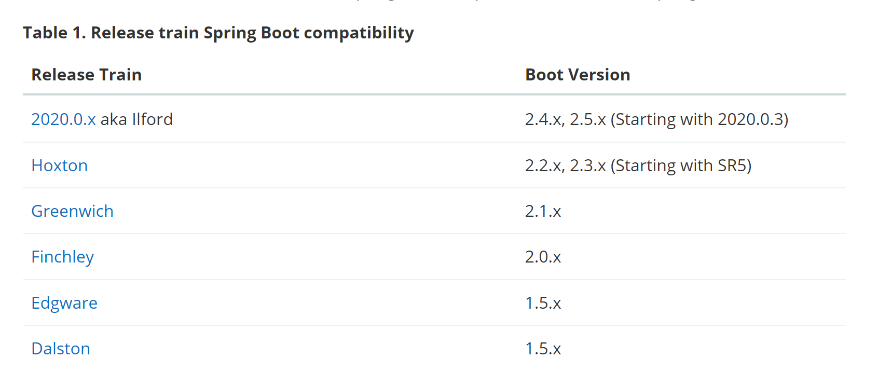
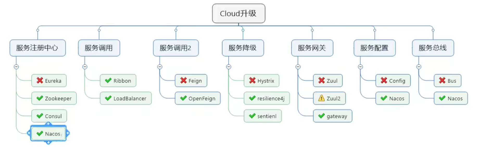
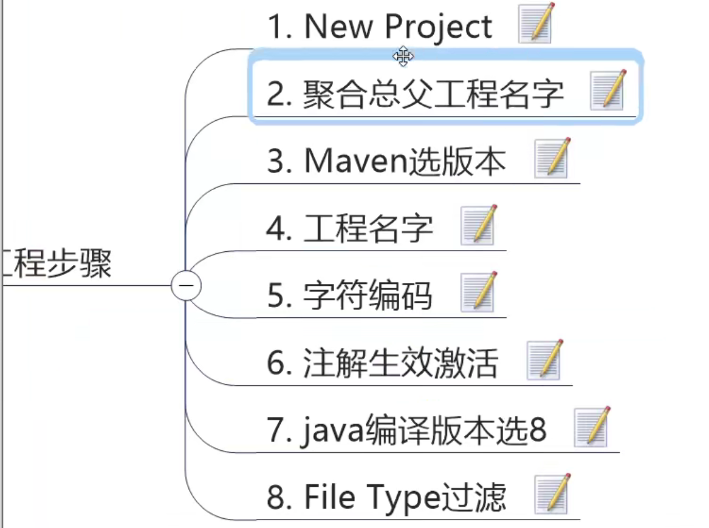
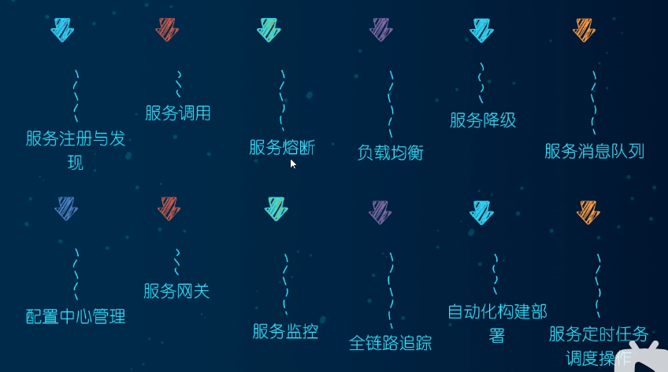
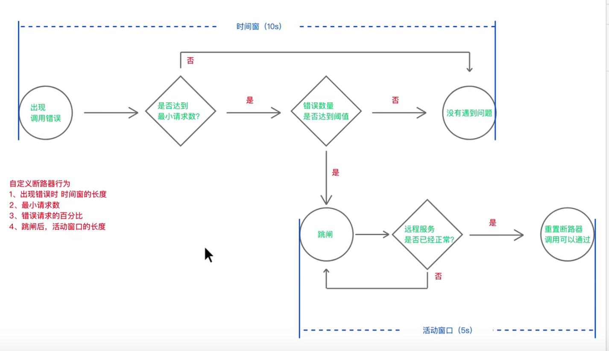
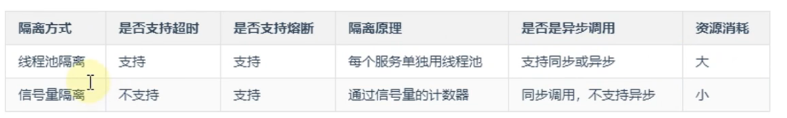

# Springcloud

## 摘要介绍

* springcloud 版本以英文字母 H、D等开头。springboot以数字开头2.2.x。
* spingboot必须使用2.0.x以上版本。bugfix。

## boot和cloud依赖关系

[Spring Cloud](https://spring.io/projects/spring-cloud)



查看具体的版本对应网址： start.spring.io/actuator/info

:angel: cloud升级：


# 建工程步骤



编码： seting->Editor-> File Encodings

注解： Build,Execution,Deployment-> Compiler-> Annotation Processors 对Enable annotation processing打勾

编译版本：Build,Execution,Deployment-> Compiler-> Java Compiler

文件过滤：Editor -> File Types

## 1. 微服务架构

### 1.1 为什么


### 2.2 是什么

将单一应用划分成一组小的服务，服务之间相互协调、互相配合，为用户提供最终价值。

springcloud=多种微服务架构落地技术的集合体，微服务全家桶



### 1.3 pom文件

`dependencyManagement` 是maven提供的一种管理依赖版本号的方式。

使用`pom.xml`中的dependencyManagement元素能让所有在子项目中引用一个依赖而不用显示的列出版本号。Maven会沿着父子层次向上走，直到找到一个拥有dependencyManagement元素的项目，然后它会使用这个dependencymanagement元素中指定的版本号。

<font color = "red">`dependencyManagement` 只是声明依赖，并不实现引入，因此子项目需要显示的声明需要用的依赖。</font>


## 2.服务注册中心

### 2.1 Zookeeper


### 2.2 Consul

#### 2.2.1 是什么

Consul是一套开源的分布式服务发现和配置管理系统，有hashiCorp用go语言开发。


### 2.3 Nacos


### 2.4 Eureka

#### 2.4.1 基础知识

* 服务治理

Spring Cloud封装了Netflic公司开发的Eureka模块来实现服务治理。

在传统的rpc远程调用框架中，管理每个服务与服务之间的依赖关系比较复杂，需要使用服务治理管理服务与服务之间的依赖关系，可以实现服务调用、负载均衡、容错等，实现服务的注册与发现。

#### 2.4.2 单机Eureka构建步骤

#### 2.4.3  集群Eureka构建步骤

#### 2.4.4 Eureka 理论

保护模式主要用于一组客户端和Eureka Server之间存在网络分区场景下的保护。一旦进入保护模式，Eureka Server将会尝试保护其服务注册表中的信息，不再删除服务注册表中的数据，也就是不会注销任何微服务。

其实就是某时刻某一个微服务不可用，Eureka不会立即清理，依旧会对该微服务的信息进行保存。

### 2.5 zookeaper


## 3.Hytrix

Hytrix可以防止服务的级联故障：雪崩效应。

#### 3.1 工作流程

1. 当调用出现错误的时候，开启一个时间窗，默认10s。
2. 在这个时间窗内，统计调用次数是否达到最小请求数。如果没有达到，则重置回到第一步。如果达到了，则统计失败的请求数占所有请求数的百分比，是否达到阈值？达到阈值则不再请求对应服务，则跳闸。如果没有达到则回到第一步。
3. 如果跳闸，则开启活动窗口（默认5s），每隔5sHystrix会让一个请求通过，到达那个服务，看是否调用成功。成功则回到第一步，失败则回到第三步。




#### 3.2 线程池隔离

一个业务出现故障不会影响其他接口的业务。如果需要隔离上千个，不推荐。毕竟上下文切换开销等大。

#### 3.3 信号量隔离

每次调用线程，当前请求通过计数信号量进行限制，当信号量大于了最大请求数`maxConcurrentRequest`时，进行限制，调用fallback接口快速返回。信号量的调用是异步的，每次调用都得阻塞调用方的线程，直到结果返回。导致无法对访问做超时（只能调用协议超时，无法主动释放）。

一般用来非网络请求，因为网络有超时，信号量无法处理超时。




### 4. 雪崩的解决方案

雪崩是系统的蝴蝶效应导致，其发生的原因多种多样，从源头我们无法完全杜绝雪崩的发生。

可以有：

1. 请求缓存：将请求与返回结果做缓存处理。
2. 请求合并：将相同的请求进行合并然后调用批处理接口。
3. 服务隔离：限制调用分布式服务的资源，某一个调用的服务出现问题不会影响其他服务调用。
4. 服务熔断：牺牲局部服务，保全整体系统稳定性的措施。
5. 服务降级：服务熔断以后，客户端用自己本地方法返回缺省值。


## 4. OpenFeign


## 工程依赖

```xml
<dependency>
    <groupId>org.springframework.cloud</groupId>
    <artifactId>spring-cloud-starter-openfeign</artifactId>
</dependency>
<dependency>
    <groupId>com.alibaba.cloud</groupId>
    <artifactId>spring-cloud-starter-alibaba-nacos-discovery</artifactId>
</dependency>
<!--spring cloud Hoxton.SR1-->
<dependency>
    <groupId>org.springframework.cloud</groupId>
    <artifactId>spring-cloud-dependencies</artifactId>
    <type>pom</type>
    <scope>import</scope>
</dependency>
<!--spring cloud alibaba 2.1.0.RELEASE-->
<dependency>
    <groupId>com.alibaba.cloud</groupId>
    <artifactId>spring-cloud-alibaba-dependencies</artifactId>
    <type>pom</type>
    <scope>import</scope>
</dependency>
```


