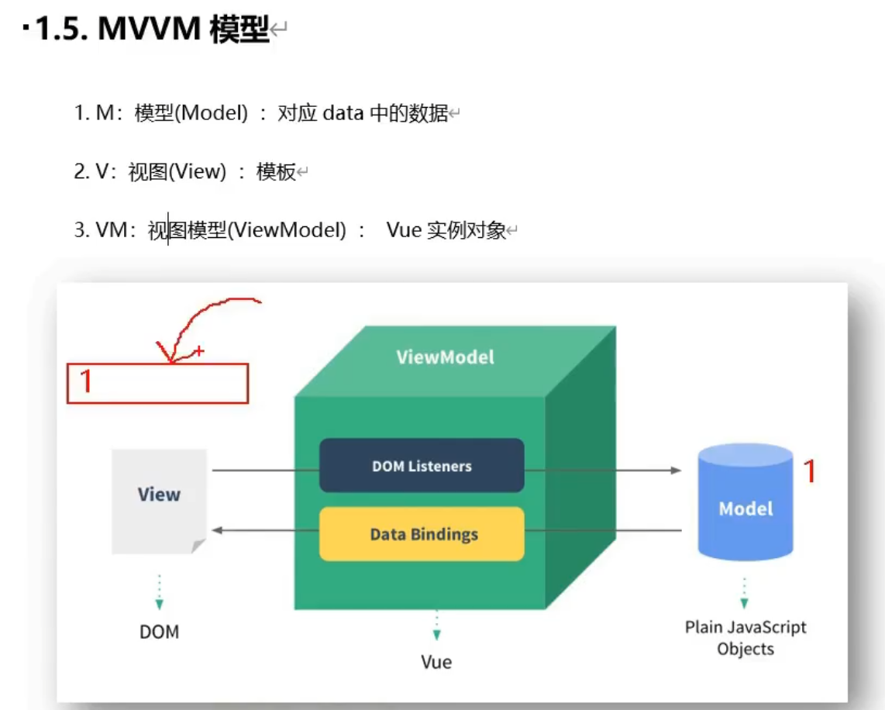
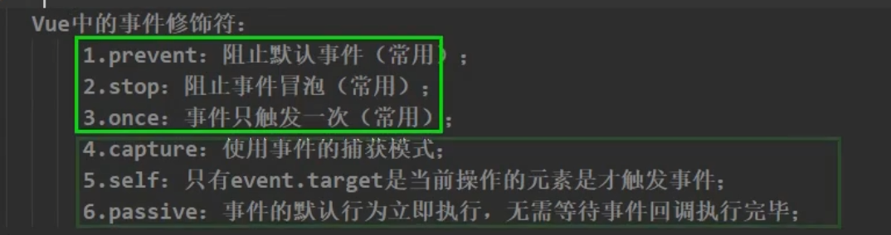

# Vue

## 1. Vue 简介

一套用于构建用户界面的渐进式JavaScript框架。（vue可以自底向上逐层的应用，简单应用（只需要一个轻量小巧的核心库）——》可以引入各式各样的Vue插件的复杂应用。

## 2. Vue技术

**容器和vue实例之间是一对一的关系。**

### 2.1 数据绑定

```vue
v-model: 双向绑定（页面和data中的数据），双向绑定只能应用在表单类元素中（输入类元素，有value值）
v-bind: 单向绑定（页面和data中的数据），简写:
v-on:click:简写 @click

```

* el 与 data

  ```vue
  el:'#root'// 直接在vue属性中指定使用哪个容器
  v.$mount('#root') // 选择使用哪个容器
  ```

  ```vue
  data:function(){ // 函数式写法,必须要返回一个对象
  	return {
  		name:'尚硅谷'
  	
  	}
  }
  // 或者直接data
  data:{
  key:value
  }
  ```

  

* MVVM模型



* 数据代理

```html
Object.defineproperty()
<script>
    let number = 18
	let person = {
        name:'张三',
        sex:'男'
    }
    Object.defineProperty(person, 'age', {
        value:18,
        enumberable:true,
        writable:true,
        configurable:true,
        // 当有人读取person的age属性时，get函数（getter）就会被调用，且返回值就是age的值。
        get(){
            return number
        },
        // 当有人修改person的age属性时，set函数（setter）就会被调用，且会收到修改的具体值
        set(value){
            number = value;
        }
    })
</script>
```

**vue中的数据代理**

vue中会将data中定义的key放入vm对象中，方便开发人员调用。

### 2.2 事件处理

1. 使用v-on:xxx 或 @xxx 绑定事件，其中xxx是事件名。





