# 什么是高可用

为什么就不说了吧，系统都要保证这一点的，否则经常奔溃那这系统还能用吗？

## 1. 是什么

高可用HA(High Availability)是分布式系统架构设计种必须考虑的因素之一。指通过设计减少系统不可用的时间。

如果系统能够一直提供服务，那么系统的可用性是100%。如果系统每运行100个时间单位，会有1个时间单位无法提供服务，那么可用性是99%。

## 2. 怎么做

1. 首先要做的就是冗余。

   通过集群化，如果只有一个节点挂了，那么其他节点可以继续提供服务。

2. 自动转移故障机制。

   有了冗余，如果每次故障都需要人为接入那么太拉跨了。

如何故障转移呢，这就涉及到了典型的互联网架构。

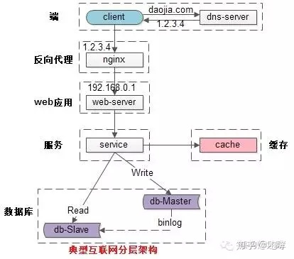

（1）客户端层：典型调用方是浏览器browser或者手机应用APP

（2）反向代理层：系统入口，反向代理

（3）站点应用层：实现核心应用逻辑，返回html或者json

（4）服务层：如果实现了服务化，就有这一层

（5）数据-缓存层：缓存加速访问存储

（6）数据-数据库层：数据库固化数据存储

## 3. 每层架构的高可用

### 3.1客户端层->反向代理层的高可用

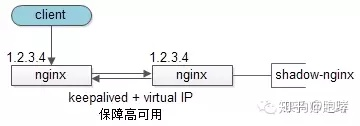

客户端层】到【反向代理层】的高可用，是通过反向代理层的冗余来实现的。以nginx为例：有两台nginx，一台对线上提供服务，另一台冗余以保证高可用，常见的实践是keepalived存活探测，相同virtual IP提供服务。

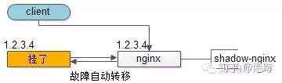

自动故障转移：当nginx挂了的时候，keepalived能够探测到，会自动的进行故障转移，将流量自动迁移到shadow-nginx，由于使用的是相同的virtual IP，这个切换过程对调用方是透明的。

### 3.2 反向代理层 -> 站点层 高可用

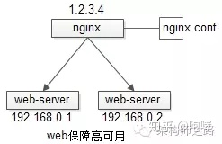

【反向代理层】到【站点层】的高可用，是通过站点层的冗余来实现的。假设反向代理层是nginx，nginx.conf里能够配置多个web后端，并且nginx能够探测到多个后端的存活性。

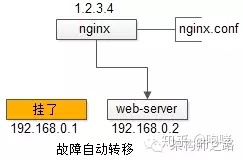

自动故障转移：当web-server挂了的时候，nginx能够探测到，会自动的进行故障转移，将流量自动迁移到其他的web-server，整个过程由nginx自动完成，对调用方是透明的。

### 3.3 站点层->服务层的高可用

【站点层】到【服务层】的高可用，是通过服务层的冗余来实现的。“服务连接池”会建立与下游服务多个连接，每次请求会“随机”选取连接来访问下游服务。

自动故障转移：当service挂了的时候，service-connection-pool能够探测到，会自动的进行故障转移，将流量自动迁移到其他的service，整个过程由连接池自动完成，对调用方是透明的（所以说RPC-client中的服务连接池是很重要的基础组件）。

### 3.4 服务层>缓存层的高可用

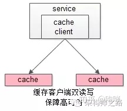

【服务层】到【缓存层】的高可用，是通过缓存数据的冗余来实现的。

缓存层的数据冗余又有几种方式：第一种是利用客户端的封装，service对cache进行双读或者双写。

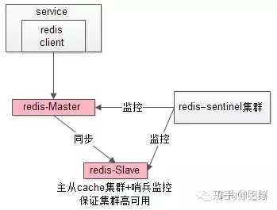

缓存层也可以通过支持主从同步的缓存集群来解决缓存层的高可用问题。

以redis为例，redis天然支持主从同步，redis官方也有sentinel哨兵机制，来做redis的存活性检测。

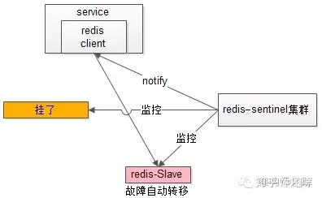

自动故障转移：当redis主挂了的时候，sentinel能够探测到，会通知调用方访问新的redis，整个过程由sentinel和redis集群配合完成，对调用方是透明的。

说完缓存的高可用，这里要多说一句，业务对缓存并不一定有“高可用”要求，更多的对缓存的使用场景，是用来“加速数据访问”：把一部分数据放到缓存里，如果缓存挂了或者缓存没有命中，是可以去后端的数据库中再取数据的。

这类允许“cache miss”的业务场景，缓存架构的建议是：

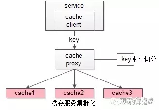

将kv缓存封装成服务集群，上游设置一个代理（代理可以用集群冗余的方式保证高可用），代理的后端根据缓存访问的key水平切分成若干个实例，每个实例的访问并不做高可用。

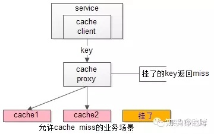

缓存实例挂了屏蔽：当有水平切分的实例挂掉时，代理层直接返回cache miss，此时缓存挂掉对调用方也是透明的。key水平切分实例减少，不建议做re-hash，这样容易引发缓存数据的不一致。

### 3.5服务层>数据库层的高可用

大部分互联网技术，数据库层都用了“主从同步，读写分离”架构，所以数据库层的高可用，又分为“读库高可用”与“写库高可用”两类。

【服务层>数据库层“读”】的高可用

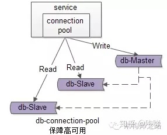

【服务层】到【数据库读】的高可用，是通过读库的冗余来实现的。

既然冗余了读库，一般来说就至少有2个从库，“数据库连接池”会建立与读库多个连接，每次请求会路由到这些读库。

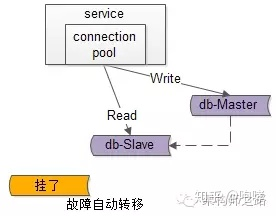

自动故障转移：当读库挂了的时候，db-connection-pool能够探测到，会自动的进行故障转移，将流量自动迁移到其他的读库，整个过程由连接池自动完成，对调用方是透明的（所以说DAO中的数据库连接池是很重要的基础组件）。

### 3.6服务层>数据库层“写”的高可用

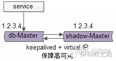

【服务层】到【数据库写】的高可用，是通过写库的冗余来实现的。

以mysql为例，可以设置两个mysql双主同步，一台对线上提供服务，另一台冗余以保证高可用，常见的实践是keepalived存活探测，相同virtual IP提供服务。

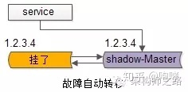

自动故障转移：当写库挂了的时候，keepalived能够探测到，会自动的进行故障转移，将流量自动迁移到shadow-db-master，由于使用的是相同的virtual IP，这个切换过程对调用方是透明的。

