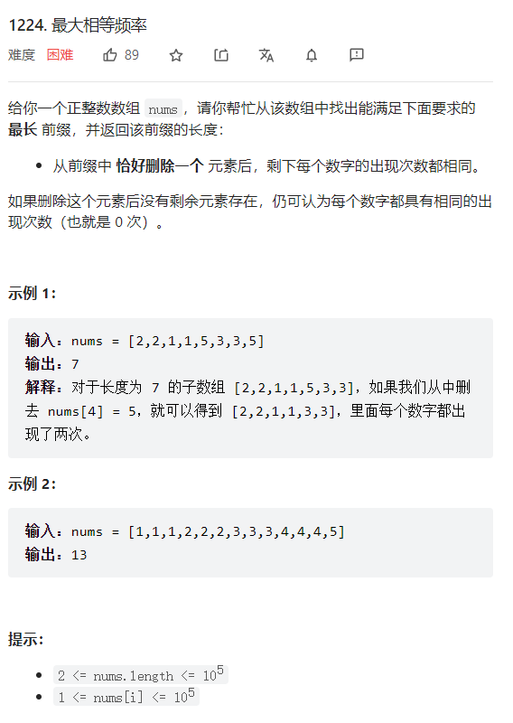

[toc]

# 算法必知

做题上来必须首先**估算题目要求的时间复杂度**，首先看题目中的数据量大小。

| 复杂度      | 数据量      | 常见算法/问题距离 |
| ----------- | ----------- | ----------------- |
| O(logn)     | 10^20       | 简单二分          |
| O(n^1/2)    | 10^14       | 判断素数          |
| O(n)        | 10^7 - 10^8 | 简单遍历          |
| O(nlogn)    | 10^5 - 10^6 | 二分排序          |
| O(nsqrt(n)) | 10^5        |                   |
| O(n^2)      | 5000        |                   |
| O(n^3)      | 300         |                   |
| O(n^4)      | 50          |                   |
| O(2^n)      | 25          | 穷举              |
| O(n!)       | 10          |                   |

# 1. 图

## 1.1 建立图的形式

### 1.1.1 矩阵的形式

* 链式星存图

图的稀疏矩阵，建立方式有邻接表和邻接矩阵。 邻接矩阵好写但是效率不好（空间+时间）
邻接表不好写但是效率高。然后链式星存图是两种方式的折中，好写效率还可接受。

链式星存图中的关键数组解释：
**head[i] = he[i] ：** 表示以这个节点i起始的最后一条边的编号
**e[idx] ：** 表示存在边i 的下一个节点
**next[idx] = ne[idx]: **表示边idx的同一个起点的上一条边的编号（这样就可以找到同起点的所有边——相邻边）

```java
// 链式星存图
    int N = 10010;
    int M = N * 2;
    int[] e = new int[M]; // 边如果是无向图，一般是双向的
    int[] he = new int[N];// 顶点和图中的顶点数目一致
    int[] ne = new int[M];// 
    int idx;

    public void init() {
        // 为了帮助判断是否还有下一个边，是否结束遍历
        Arrays.fill(he, -1);
    }

    public void add(int a, int b) {
        e[idx] = b;
        ne[idx] = he[a]; // 同一个起点的上一条边的编号
        he[a] = idx++; //以a为结尾的最后一条边的编号
    }

    // 遍历图方式， 以节点a为例
    public void traverse(int a) {
        for (int i = he[a]; i != -1; i = ne[i]) {
            System.out.println(e[i]); // 得到边的顶点（相邻的顶点）
        }
    }
```


## 2.博弈

* 博弈知识

  博弈问题中的三个概念：必胜状态、必败状态和必和状态。

  1. 对于特定状态，如果游戏已经结束，则根据结束时的状态决定必胜状态、必败状态与必和状态。
     * 如果分出胜负，则该特定状态对于获胜方为必胜状态。
     * 如果是平局，则该特定状态对于双方都是必和状态。
  2. 从特定状态开始，如果存在一种操作将状态变为必败状态，则当前玩家可以选择该操作，将必败状态留给对方玩家，因此该特定状态对于当前玩家为必胜状态。
  3. 从特定状态开始，如果**所有**操作都会将状态变为必胜状态（当前玩家选了之后对方，就只有必胜状态了），则无论当前玩家选择哪种操作，都会将必胜状态留给对方玩家，因此该特定状态对于当前玩家为必败状态。
  4. 从特定状态开始，如果任何操作都不能将状态变为必败状态，但是存在一种操作将状态变为必和状态，则当前玩家可以选择该操作，将必和状态留给对方玩家，因此该特定状态对于双方玩家都为必和状态。

对于每个玩家，最有策略如下：

1. 争取将必胜状态留给自己，将必败状态留给对方。
2. 在自己无法到达必胜状态的情况下，争取将必和状态留给自己。

### 2.1 例题

#### 2.1.1 猫和老鼠

[猫和老鼠 - 猫和老鼠 - 力扣（LeetCode）](https://leetcode.cn/problems/cat-and-mouse/solution/mao-he-lao-shu-by-leetcode-solution-444x/)

一般都是动态规划进行解决，枚举所有的状态。每个状态选择最优决策。

#### 2.1.2 我能赢吗？

题目中说，两位玩家都选择最佳的状态。对所有状态进行枚举，看先手能不能在某种状态下获胜，那么先手肯定就赢了。

所有状态就是能选择的最大数，2^(maxChoosableInteger - 1)，这么多种状态，然后对每个状态枚举，看看当前的先手在某种状态下

能不能赢游戏。

* 如果后手赢不了，那么先手肯定就赢了。
* 如果当前的选择数已经大于想要达到的目标和，那么已经赢了。
* 所有状态列举完了，赢不了，那么就是输了。

## 3. 区间修改和区间查询

### 3.1 线段树

线段树可以在 的时间复杂度内实现单点修改、区间修改、区间查询（区间求和，求区间最大值，求区间最小值）等操作。


线段树是一种二叉树。比如一个长度为4的线段，可以表示成这样：


二叉树节点和数组索引正好一一对应。


最上面的根节点表示线段1-4的和。跟的两个儿子分别表示这个线段的1-2的和，3-4的和，一次类推。

同时，线段树有一个重要性质：

**节点i的权值=左儿子+右儿子权值**

#### 3.1.1 构建

将每个长度不为1的区间划分成左右两个区间递归求解，把整个线段划分成一个树形结构，通过合并左右两区间信息来求得该区间的信息。其形态如图片中所示。


```java
int[] tree;
int[] A;
int size = 0;

public SegmentTree(int n, int[] A) {
    tree = new int[n * 2 - 1]; // N个叶子节点，N - 1 个上层的根
    size = 2 * n - 1;
    this.A = A;
    build(0, 0, n - 1);
}


void build(int node, int start, int end) {
        if (start == end) {
            // Leaf node will have a single element
            tree[node] = A[start];
        } else {
            int mid = (start + end) / 2;
            // Recurse on the left child
            build(2 * node, start, mid);
            // Recurse on the right child
            build(2 * node + 1, mid + 1, end);
            // Internal node will have the sum of both of its children
            tree[node] = tree[2 * node] + tree[2 * node + 1];
        }
    }
```

对于线段树的空间，如果采用堆式存储（2p是p的左儿子，2p+1是p的右儿子），若有n个叶子结点，则d数组的最大范围$2^{log(n)+1}$。

线段树的最大深度是$log(n)$的，在堆式存储情况下叶子节点（包括无用的叶子节点）数量为$2^{log(n)}$，因为其是一颗完全二叉树，其总结点个数为$2^{log(n) + 1} - 1$。当n为$n=2^x + 1$时，取得最大值$2^{log(n) + 1} - 1 = 2^{x+2} - 1=4n-5 \approx 4n$。

#### 3.1.2 查询

一般地，如果要查询的区间是[l,r] ，则可以将其拆成最多为 O(logn)个 **极大** 的区间，合并这些区间即可求出[l,r] 的答案。

```java
int query(int node, int start, int end, int l, int r) {
        if (r < start || end < l) {
            // range represented by a node is completely outside the given range
            return 0;
        }
        if (l <= start && end <= r) {
            // range represented by a node is completely inside the given range
            return tree[node];
        }
        // range represented by a node is partially inside and partially outside the given range
        int mid = (start + end) / 2;
        int p1 = query(2 * node, start, mid, l, r);
        int p2 = query(2 * node + 1, mid + 1, end, l, r);
        return (p1 + p2);
    }
```

#### 3.1.3 区间更新

```java
void update(int node, int start, int end, int idx, int val) {
        if (start == end) {
            // Leaf node
            A[idx] += val;
            tree[node] += val;
        } else {
            int mid = (start + end) / 2;
            if (start <= idx && idx <= mid) {
                // If idx is in the left child, recurse on the left child
                update(2 * node, start, mid, idx, val);
            } else {
                // if idx is in the right child, recurse on the right child
                update(2 * node + 1, mid + 1, end, idx, val);
            }
            // Internal node will have the sum of both of its children
            tree[node] = tree[2 * node] + tree[2 * node + 1];
        }
    }
```

#### 3.1.4 懒惰标记

惰标记，简单来说，就是通过延迟对节点信息的更改，从而减少可能不必要的操作次数。每次执行修改时，我们通过打标记的方法表明该节点对应的区间在某一次操作中被更改，但**不更新该节点的子节点**的信息。实质性的修改则在**下一次访问带有标记的节点**时才进行。

区间更新：

```java
void update(int node, int l, int r, int idx, int val, int start, int end) {

        if (l <= start && r >= end) {
            tree[node] += val * (end - start);
            flag[node] += val;
        } else {
            int mid = (start + end) / 2;

            if (flag[node] != 0) {
                tree[node * 2] += flag[node] * (mid - start + 1);
                tree[node * 2 + 1] += flag[node] * (end - mid + 1);
                // 传递给子节点
                flag[node * 2] += flag[node];
                flag[node * 2 + 1] += flag[node];
                // 本节点标记清除
                flag[node] = 0;
            }

            if (start <= idx && idx <= mid) {
                // If idx is in the left child, recurse on the left child
                update(2 * node, l, r, idx, val, start, mid);
            } else {
                // if idx is in the right child, recurse on the right child
                update(2 * node + 1, l, r, idx, val, mid + 1, end);
            }
            // Internal node will have the sum of both of its children
            tree[node] = tree[2 * node] + tree[2 * node + 1];
        }
    }
```

区间查询：

```java
int query(int node, int start, int end, int l, int r) {
        if (r < start || end < l) {
            // range represented by a node is completely outside the given range
            return 0;
        }
        if (l <= start && end <= r) {
            // range represented by a node is completely inside the given range
            return tree[node];
        }
        // range represented by a node is partially inside and partially outside the given range
        int mid = (start + end) / 2;

        if (flag[node] != 0) {
            tree[node * 2] += flag[node] * (mid - start + 1);
            tree[node * 2 + 1] += flag[node] * (end - mid + 1);
            // 传递给子节点
            flag[node * 2] += flag[node];
            flag[node * 2 + 1] += flag[node];
            // 本节点标记清除
            flag[node] = 0;
        }

        int p1 = query(2 * node, start, mid, l, r);
        int p2 = query(2 * node + 1, mid + 1, end, l, r);
        return (p1 + p2);
    }
```

#### 3.1.5 动态开点

动态开点在以上的基础上，不用全部每次都把所有空间开辟完毕。根据需求动态开辟。当新来一个结点，我们就使用计数器cnt来统计当前总共有多少，对于与二叉树的性质且正好和数组索引对应，可以直接利用cnt为结点索引，进行动态开辟空间。

```java
void lazyCreate(int node) {
        if (tree[node] == null) tree[node] = new Node();
        if (tree[node].ls == 0) {
            tree[node].ls = ++cnt;
            tree[tree[node].ls] = new Node();
        }

        if (tree[node].rs == 0) {
            tree[node].rs = ++cnt;
            tree[tree[node].rs] = new Node();
        }
    }
```

动态开点整体版本：

```java
class Node {
        int ls, rs, value, flag;
    }
    int N = (int) 1e9;
    int M = 4 * 400 * 20, cnt = 1; // 注意起点右移1位,利用cnt来统计当前节点索引
    Node[] tree = new Node[M];

    void update(int node, int l, int r, int start, int end, int val) {
        if (l <= start && r >= end) {
            tree[node].value += val;
            tree[node].flag += val;
            return ;
        }
        lazyCreate(node);
        pushDown(node);
        int mid = start + ((end - start) >> 1);
        if (l <= mid) update(tree[node].ls, l, r, start, mid, val);
        if (r > mid) update(tree[node].rs, l, r, mid + 1, end, val);
        pushUp(node);
    }

    int query(int node, int l, int r, int start, int end) {
        if (l <= start && r >= end) {
            return tree[node].value;
        }
        lazyCreate(node);
        pushDown(node);
        int mid = start + ((end - start) >> 1);
        int ans = 0;
        if (l <= mid) {
            ans = query(node, l, r, start, mid);
        }
        if (r > mid) {
            ans = Math.max(query(node, l, r, mid + 1, end), ans) ;
        }
        return ans;
    }


    void pushDown(int node) {
        if (tree[node].flag != 0) {
            tree[tree[node].ls].value += tree[node].flag;
            tree[tree[node].ls].flag += tree[node].flag;
            tree[tree[node].rs].value += tree[node].flag;
            tree[tree[node].rs].flag += tree[node].flag;
            tree[node].flag = 0;
        }
    }

    void pushUp(int node) {
        tree[node].value = Math.max(tree[tree[node].ls].value, tree[tree[node].rs].value);
    }

    void lazyCreate(int node) {
        if (tree[node] == null) tree[node] = new Node();
        if (tree[node].ls == 0) {
            tree[node].ls = ++cnt; //本身是二叉树，所以正好对应数组的索引位置
            tree[tree[node].ls] = new Node();
        }

        if (tree[node].rs == 0) {
            tree[node].rs = ++cnt;
            tree[tree[node].rs] = new Node();
        }
    }
```

## 4. 动态规划

### 4.1 最长公共子序列

当前的字符相等的话，那么序列数量就会 + 1， 且是在前面序列的基础上+1，前面的数量独立于本次计算，所以是动态规划。

推导转移方程：

状态： 第一个字符串 i 索引  第二个字符串 j索引，就这两个状态。

那么 设数组 dp[i][j]  表示 字符串 0 - i处 和 字符串2 0 - j处 的最长公共子序列数量。

* 当s.charAt(i) == s.charAt(j)

  `dp[i][j] = dp[i - 1][j - 1] + 1 `（前面的序列基础+1）

* `dp[i][j] = Math.max(dp[i - 1][j], dp[i][j - 1])` 则看用哪个数量更多

具体看这个链接，讲的很清晰有图解。https://mp.weixin.qq.com/s/ZhPEchewfc03xWv9VP3msg

```java
int len1 = text1.length();
int len2 = text2.length();
int[][] dp = new int[len1 + 1][len2 + 1];
for (int i = 1; i <= len1; i++) {
    for (int j = 1; j <= len2; j++) {
        if (text1.charAt(i - 1) == text2.charAt(j - 1)) {
            dp[i][j] = dp[i - 1][j - 1] + 1; 
        } else {
            dp[i][j] = Math.max(dp[i - 1][j], dp[i][j - 1]);
        }
    }
}
return dp[len1][len2];
```


## 5. 回溯

解决的题型有：排列组合子集类型，岛屿题目。

### 5.1 排列组合子集问题

#### 5.1.1 划分k个子集

[leetcode698]([698. 划分为k个相等的子集 - 力扣（LeetCode）](https://leetcode.cn/problems/partition-to-k-equal-sum-subsets/))

#### 5.1.2 公平分发饼干

题目要求我们求得最公平的糖果数量，所以回溯方法可以穷尽所有的组合数。思路如下：

1. 每个糖果随机发给一个小孩子，这种情况肯定能够包括每个小孩子有一个糖果的情况（肯定比有的小孩子没有糖果的情况公平数小）。
1. 统计所有情况下的公平数，取最小值。

```java
	int ans = Integer.MAX_VALUE;
    public int distributeCookies(int[] cookies, int k) {
        // 穷尽所有的分发情况，统计最小不公平程度
        // k 个小孩子
        int[] child = new int[k];
        return dfs(child, cookies, 0, 0);
    }

    public int dfs(int[] child, int[] cookies, int index, int max) {
        if (index == cookies.length) {
            return max;
        }
        int ans = Integer.MAX_VALUE;
        for (int i = 0; i < child.length; i++) {
            // 第一个饼干发给哪个小孩子，他们之后的回溯情况本质上是一样的。
            if (index == 0 && i > 0) return ans;
            child[i] += cookies[index];
            ans = Math.min(ans, dfs(child, cookies, index + 1, Math.max(max, child[i])));
            child[i] -= cookies[index];
        }
        return ans;
    }
```

优化思路：

情况一：第一个饼干发给任意一个小孩子，回溯树的形状都是长得一样的，所以第一个饼干的情况只需要遍历一次。

`if (index == 0 && i > 0) return ans;`

情况二：对饼干排序，先发饼干数量多的包。<font color="blue">如果某位小朋友的饼干数量比当前的答案还多，显然继续回溯下去也无法成为最优答案，直接返回。</font>这样可以让回溯尽快结束。

```java
int cur = 0;
for (int i : child) {
    cur = Math.max(cur, i);
}
if (cur > ans) return ans;
```

综上：

```java
int ans = Integer.MAX_VALUE;
    public int distributeCookies(int[] cookies, int k) {
        // 穷尽所有的分发情况，统计最小不公平程度
        // k 个小孩子
        Arrays.sort(cookies);
        int[] child = new int[k];
        return dfs(child, cookies, cookies.length - 1, 0);
    }

    public int dfs(int[] child, int[] cookies, int index, int max) {
        if (index == -1) {
            return max;
        }
        int cur = 0;
        for (int i : child) {
            cur = Math.max(cur, i);
        }
        if (cur > ans) return ans;
        for (int i = 0; i < child.length; i++) {
            if (index == cookies.length - 1 && i > 0) return ans;
            child[i] += cookies[index];
            ans = Math.min(ans, dfs(child, cookies, index - 1, Math.max(max, child[i])));
            child[i] -= cookies[index];
        }
        return ans;
    }
```

优化结果：


# 其他

## 1. 蓄水池抽样

总的样本数量未知，从所有样本中抽取若干个，要求每个样本被抽到的概率相等。

具体做法：从前往后处理每个样本，每个样本成为答案的概率为`1/i`，其中`i`为样本编号（编号从1开始），最终可以确保每个样本成为答案的概率均为`1/n`（其中`n`为样本总数）。

证明：容易证明该做法的正确性，假设最终成为答案的样本编号为 `k`，那么 成为答案的充要条件为「在遍历到 时被选中」并且「遍历大于`k` 的所有元素时，均没有被选择（没有覆盖 `k`）」

对应事件概率为：


首项 `1/k`为选中 的概率，后面每项分别为编号[k + 1, n] 的样本 **「不被选中」** 的概率。


```java
class Solution {
    ListNode head;
    Random random = new Random(20220116);
    public Solution(ListNode _head) {
        head = _head;
    }
    public int getRandom() {
        int ans = 0, idx = 0;
        ListNode t = head;
        while (t != null && ++idx >= 0) {
            if (random.nextInt(idx) == 0) ans = t.val; # 被选中
            t = t.next; // 其他的不选择
        }
        return ans;
    }
}
```

### 2. AStar算法

AStar算法一般在BFS模板中，对搜索方向有了新的优先级。详细可以参考[【宫水三叶】一题三解 :「BFS」&「AStar 算法」&「并查集预处理」 - 为高尔夫比赛砍树 - 力扣（LeetCode）](https://leetcode.cn/problems/cut-off-trees-for-golf-event/solution/by-ac_oier-ksth/)

其中，AStar算法的汇总：[标签 - AStar 算法 - 宫水三叶的刷题日记 (sharingsource.github.io)](https://sharingsource.github.io/tags/AStar-算法/)

### 3. 寻找缺失的数

> 求和

根据题意，给定 `nums` 的长度为 m 且缺失了两个数，所有的 `nums[i]` 加上缺失数字组成连续排列长度为 `n = m + 2n=m+2`。

根据等差数量求和公式可知，补齐后的排列总和为 $\frac{n \times (1 + n)}{2} $，补全后的理论总和与实际总和之间的差值 

$cur = \frac{n \times (1 + n)}{2} - \sum_{i = 0}^{m - 1}nums[i] $为缺失数值之和。

根据补全后数值各不相同可知，两者必不可能同时位于 $t = \left \lfloor \frac{cur}{2} \right \rfloor$ 的同一侧或共点（偏大、偏小或数值重复），因此我们可以计算 [1, t] 范围内的理论总和与实际总和之间的差值来确定其一（将问题转换为求解缺失一值），再结合缺失两值之和 sum 算得答案。

```java
public int[] missingTwo(int[] nums) {
        int n = nums.length + 2, cur = n * (1 + n) / 2;
        for (int x : nums) cur -= x;
        int sum = cur, t = cur / 2;
        cur = t * (1 + t) / 2;
        for (int x : nums) {
            if (x <= t) cur -= x;
        }
        return new int[]{cur, sum - cur};
}
```

> 原地哈希

```c++
class Solution {
public:
    vector<int> missingTwo(vector<int>& nums) {
        for (int i = 0; i < 3; i ++) nums.push_back(-1);

        for (int i = 0; i < nums.size(); i ++)
            while (i != nums[i] && nums[i] != -1)
                swap(nums[i], nums[nums[i]]);
        
        vector<int> ans;
        for (int i = 1; i < nums.size(); i ++) 
            if (nums[i] == -1) ans.push_back(i);
        return ans; 
    }
};
```


## 3. 找规律题目

### 3.1 <font color = "red">在数组中找到最大的相等频率</font>

力扣第1224题目。



本题目仔细阅读后，会发现没有固定的套路来解决它。所以，是个找规律解答的题目类型。

分析问题，关键的问题是，如何能够知道，当删除一个元素后，当前的前缀剩下的每个数字出现的次数都相同。如果知道了这个，那么就能够知道前缀的长度。

思路：如果题目中每个元素出现的次数都是偶数的话，那么可以使用异或直接解决（偶数出现后和为0）。所以得重新找思路，只能先看一下各种case。对于一个前缀，当前新出现的数字`x`，有以下几种情况：

1. 1 2 3 4
   每个都是出现了一次，这种删除谁都行吧。 此时能够看到数字出现`最大的频率是1`。
2. 111 222 333 4 or 111 222 3 444
   应该删除4 或者 3。 此时数字出现的频率为 `最大频率 * 最大频率对应的数字种类 == 当前前缀长度 - 1`
3. 111 222 3333
   应该删除3。此时数字出现的频率： `最大频率 = （当前前缀长度 - 1）/ 数字种类 + 1`

   综上，需要记录 最大频率 最大频率对应的数字种类数量 出现的数字种类数量即可。

   ```java
        public int maxEqualFreq(int[] nums) {
        int n = (int) (1e5 + 1);
        int[] hashed = new int[n];
        int res = 0;
        int maxFrequency = 0;
        int maxType = 0;
        int curType = 0;
   
        for (int i = 0; i < nums.length; i++) {
            if (hashed[nums[i]]++ == 0) {
                curType++;
            }
            if (hashed[nums[i]] > maxFrequency) {
                maxFrequency = hashed[nums[i]];
                maxType = 1;
            } else if (hashed[nums[i]] == maxFrequency){
                maxType++;
            }
            // 1 2 3 anyone can delete
            // 111 222 333 4 should delete 4 or 111 222 3 444 should delete 3 
            // 111 222 3333 should delete 3
            if (maxFrequency == 1 || (maxType * maxFrequency == i) || (maxType == 1 && (maxFrequency == i / curType + 1))) {
                res = i + 1;
            }
        }
   
        return res;
    }
   ```

## 4. 括号类型题目

### 4.1 括号分数


> 分析

这个题目统计分数，遇到右括号要找到对应的左括号，明显是个栈的形式，所以肯定需要栈这个数据结构。

因为有统计的形式，当我们遇到字符：

1. `')'`时，需要将左括号找到，并且这对括号包含的所有（`((..))`）括号计算出来。如果当前栈顶元素不是0， 那么2*栈顶元素。

   如果是0，则push（1）即可。遇到当前的右括号，将当前的分数全部统计出来，所以需要判断其他栈顶元素，使用prev2，每次将前一个分数算进来与当前元素相加合并为一个元素。为了方便计算，初始化栈时压入0。

2. `'('`时，压栈，将分数0压栈。0代表当前是`(`。

```java
Deque<Integer> stack = new ArrayDeque<>();
stack.push(0);
for(char c : s.toCharArray()){
    if(c == '('){
        stack.push(0);
    } else {
        int prev1 = stack.pop();
        int prev2 = stack.pop();
        stack.push(prev2 + Math.max(1, prev1 * 2));
    }
}
return stack.pop();
```


1 3 6 4 5


