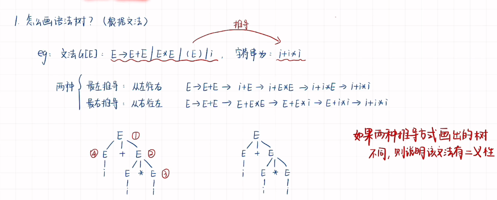
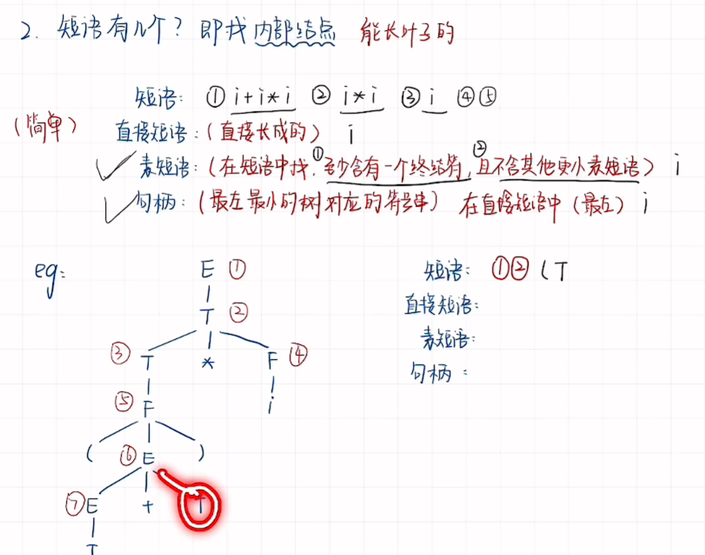
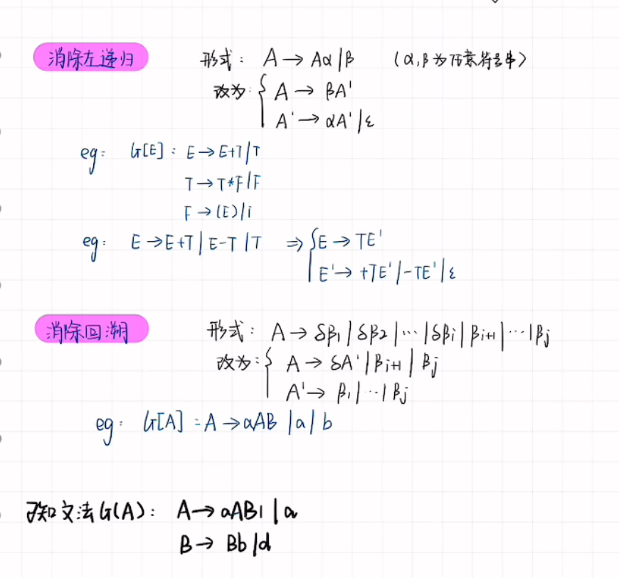
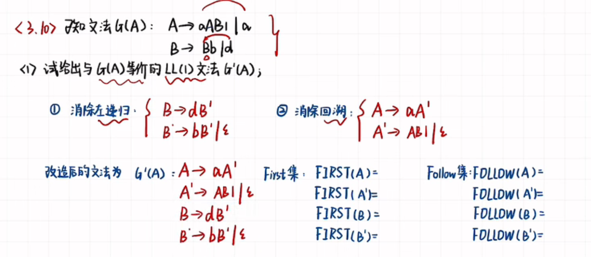
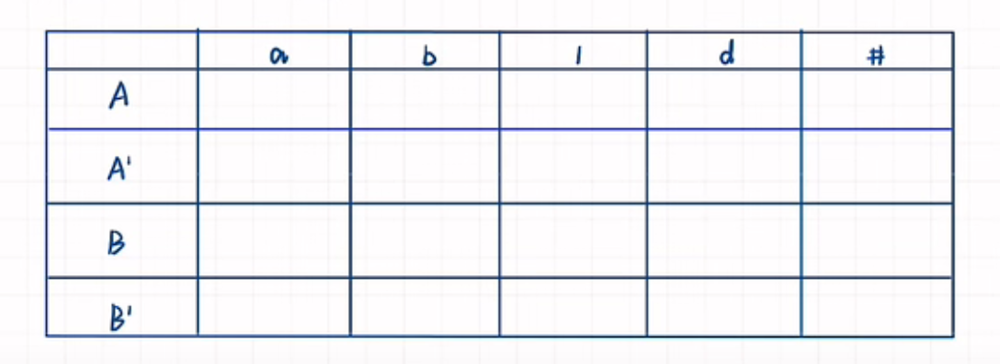
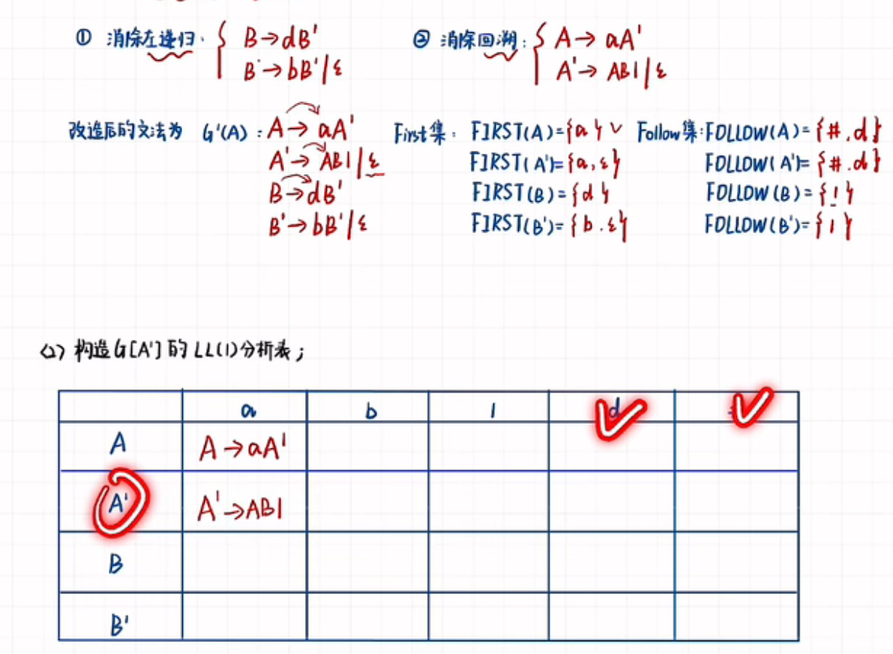
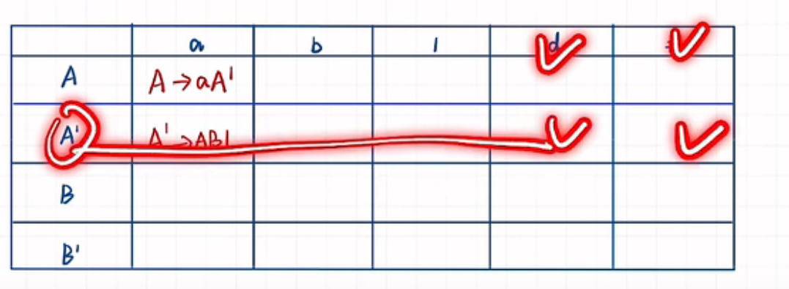
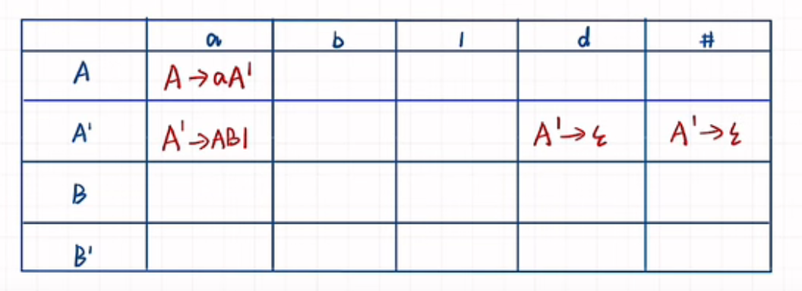
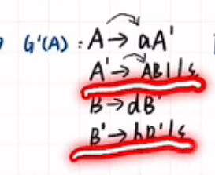
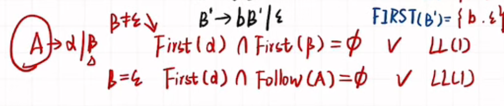

# 编译原理

## 1. 介绍

### 1.1 编译器

* 编译器

程序 -> 编译器 -> 可执行文件。 编译器不是实时的，只是对程序进行预处理。

* 解释器

程序和数据 -> 解释器 -> 输出。 这个是online的，实时的。

### 1.1.1 历史

IBM的704的机子，软件开销比硬件开销还大。这让很多人考虑如何让代码编程更有效——speedcoding， 快速编码（1953），但是这个东西又慢又花费很多内存，没有流行。

后来同样的动机诞生了fortran，第一个编译器，是理论和实践的结合。

现在对编译器的总结，大概有五个部分：

1. 词法分析 lexical analysis
    Recognize words。
    编译器分析文本将程序文本变为 word 或者 token。关键词、变量名等。
2. 语法分析 parsing
   通过分析关键词等构建语法树。
3. 语义分析 semantic analysis
4. 优化 optimization (运行的更快，占用更少内存)
   优化，相当于对句子进行编辑，对于程序而言是跑的更快并且使用更少的内存。
5. Code Generation 代码生成 
   代码生成

### 1.2 识别单词

### 1.3 定义

Alphabet = English characters
Language = English sentences
Meaning funciton L maps syntax to semantics.

## 1. 语法树

> 是什么

你如果分析出来了token。为了利用token分析语法语义，你得构造一个东西来进行解析啊，不然怎么解析呢？

> 为什么

树状的形式能更好的对字符进行提取和表征。

> 怎么做

构造语法树 -》 求解语法树的短语、素短语、直接短语和句柄。

对于图中的红色二义性表达有误，其实二义性指的是你能画出来两种不同结构的树，那就是二义性，

> 短语

### 1.1 消除左递归和回溯
> 是什么

在构造语法树的过程中发现了很多无限循环的恶心案例，为了解决这些东西，有了消除递归和回溯。

> 为什么

同是什么。

> 怎么做

左递归，你看式子里面箭头后面紧跟着的和箭头前的字符是一样的，那就是递归了啊。
所以你得消除他，不然语法解析会一直无限循环。怎么消除呢？

要想让它别循环了，停下来肯定得有终结符啊，所以你直接把后面的终结符提上来先写上去。构造一`字符的撇`。

下面对这个`字符的撇`的处理，为了还原式子原意，所以你得把这个字符原来式子中前面的东西得继续写上，后面的因为已经提取了，成了空的了，所以有了这个推导。

消除回溯

回溯的式子中每个都有相同的起始字符。所以为了消除回溯，只留下一个这个字符，后面的改造成新的`字符撇`。对新的字符撇，前面字符已经提取，所以直接写后面的字符即可。

### 1.2 LL语法

> 是什么

LL语法是分析token，组织有效的语义的一种自顶向下的分析算法。它规定不能有左递归和不能有二义性和不能有回溯。

> 为什么

为了分析语义啊。自顶向下的一个算法罢了。

> 怎么做

一般是构造First和Fllow集，来分析下一步能不能走到最终的target语义。

看名字就知道，看当前碰到的和下一个碰到的字符就行了。

.png)

求First集，如果看箭头紧挨着的那个字符，如果是终结符，将这个终结符加入first集合。如果不是终结符，那么继续找这个非终结符的是否有终结符，直到找到终结符。（只看箭头紧挨着的那个终结字符）

求follow集，如果看途中可以看到有3中情况，对照规则来就行。

我对其中的这么做的原因做一下解释，对于其中的第二条，如果B后面是空，那么怎么告诉当前字符的下一个follow是谁呢（主要是告诉他该停止了）？已经是空了所以需要当前A的终结符来对本次语法匹配进行终止（follow集合）。需要加入A的follow集合。

对于第三条，如果是终结符，那么直接写下来就好，如果不是，你就需要对当前的β的终止符加入到follow啦，因为你需要看到当前β的终止符才能停下来，你直接查β的first集合就好啦。

**完整分析过程**

根据消除左递归和回溯的语法，构造first和follow集，然后再构造LL（1）分析表。

在改造文法里面，加上＃， 构造这个分析表：

步骤：

1. 对文法消除左递归和消除回溯，写出来改造文法。

2. 根据构造文法，求每个非终结符的First集和Follow集。

3. 构造分析表，左侧列是非终结符，上面一行是终结符。
   在分析表中，看First集中的每个终结符出现在谁的First集里，把这个推First集的式子写道分析表中。其中，如果first集中有空串，那么需要看这个非终结符的Follow集，需要把推出空串的式子写到Follow集中的终结符上。如下图，d和＃需要写上A撇的那个式子
   
   
   

4. 构造等价的LL(1)文法，首先确定是有效的LL（1）文法，确定在改造的文法里面，如果出现一个非终结符能推出两种情况，就需要对两种情况分析（因为防止两种情况能推出一个语义，那么二义性不行的）：
   
   

上图是分析两种情况的规则，看β是否是空串，分别选择不同的条件进行判断，看最后是不是空集。

### 1.3 LR语法

> 是什么

LR 语法是一种自动状态机表示的语法规则。

> 为什么

LL语法虽然很容易自顶向下构造，但是并不能表示全部的语法规则。LR（1）是一种更加泛化的规则，它是通过自底向上构造的。

> 怎么做

构造LR(0)分析表，步骤：拓广文法->列项目->项目集规范簇->分析表。

对于拓广文法，首先使用一个字符，来指向开始符。

（途中圆圈框出来的就是一个指向E开始符。）

画点，如果遇到的是终结符，可以停下来。如果当前遇到的不是终结符，需要把非终结符（除去拓广文法）的也写出来：

在这个图中，对于左括号'('， 点号遇到了E， 那么需要把$I~0$中的E表达式全部写出来，在这期间点号又遇到了T，所以T的也写出来。

