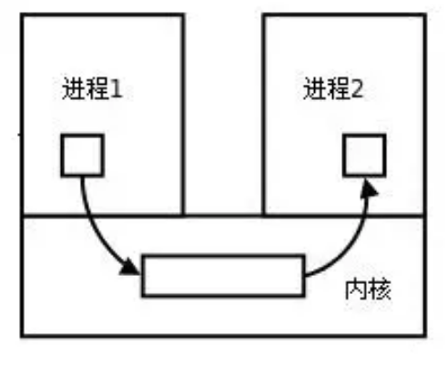
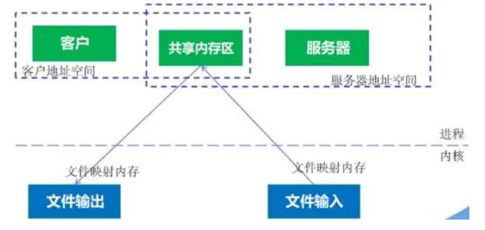
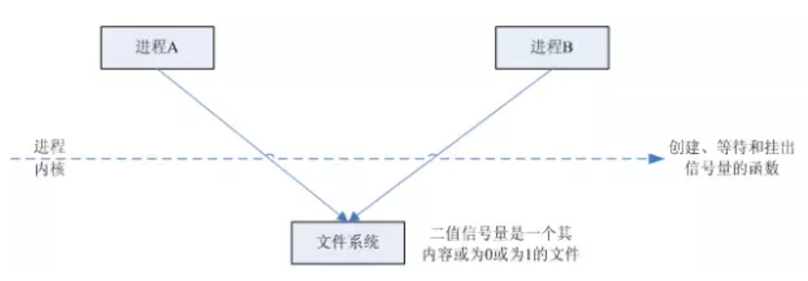
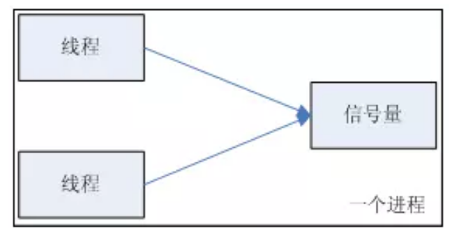
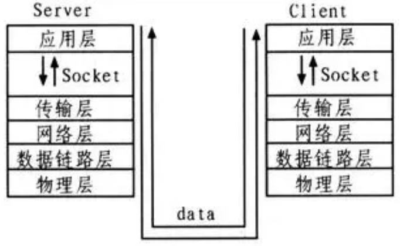

#### 一、进程间通信的概念

每个进程各自有不同的用户地址空间，任何一个进程的全局变量在另一个进程中都看不到，所以进程之间要交换数据必须通过内核，在内核中开辟一块缓冲区，进程1把数据从用户空间拷到内核缓冲区，进程2再从内核缓冲区把数据读走，内核提供的这种机制称为**进程间通信（IPC，InterProcess Communication）**

进程间通信模型

#### 二、进程间通信的7种方式

**第一类：传统的Unix通信机制**
 **1. 管道/匿名管道(pipe)**

- 管道是半双工的，数据只能向一个方向流动；需要双方通信时，需要建立起两个管道。

- 只能用于父子进程或者兄弟进程之间(具有亲缘关系的进程);

- 单独构成一种独立的文件系统：管道对于管道两端的进程而言，就是一个文件，但它不是普通的文件，它不属于某种文件系统，而是自立门户，单独构成一种文件系统，并且只存在与内存中。

- 数据的读出和写入：一个进程向管道中写的内容被管道另一端的进程读出。写入的内容每次都添加在管道缓冲区的末尾，并且每次都是从缓冲区的头部读出数据。

  

  进程间管道通信模型

**管道的实质：**
 管道的实质是一个内核缓冲区，进程以先进先出的方式从缓冲区存取数据，管道一端的进程顺序的将数据写入缓冲区，另一端的进程则顺序的读出数据。
 该缓冲区可以看做是一个循环队列，读和写的位置都是自动增长的，不能随意改变，一个数据只能被读一次，读出来以后在缓冲区就不复存在了。
 当缓冲区读空或者写满时，有一定的规则控制相应的读进程或者写进程进入等待队列，当空的缓冲区有新数据写入或者满的缓冲区有数据读出来时，就唤醒等待队列中的进程继续读写。

**管道的局限：**
 管道的主要局限性正体现在它的特点上：

- 只支持单向数据流；
- 只能用于具有亲缘关系的进程之间；
- 没有名字；
- 管道的缓冲区是有限的（管道制存在于内存中，在管道创建时，为缓冲区分配一个页面大小）；
- 管道所传送的是无格式字节流，这就要求管道的读出方和写入方必须事先约定好数据的格式，比如多少字节算作一个消息（或命令、或记录）等等；

**2. 有名管道(FIFO)**
 匿名管道，由于没有名字，只能用于亲缘关系的进程间通信。为了克服这个缺点，提出了有名管道(FIFO)。
 有名管道不同于匿名管道之处在于它提供了一个路径名与之关联，**以有名管道的文件形式存在于文件系统中**，这样，**即使与有名管道的创建进程不存在亲缘关系的进程，只要可以访问该路径，就能够彼此通过有名管道相互通信**，因此，通过有名管道不相关的进程也能交换数据。值的注意的是，有名管道严格遵循**先进先出(first in first out)**,对匿名管道及有名管道的读总是从开始处返回数据，对它们的写则把数据添加到末尾。它们不支持诸如lseek()等文件定位操作。**有名管道的名字存在于文件系统中，内容存放在内存中。**

> **匿名管道和有名管道总结：**
>  （1）管道是特殊类型的文件，在满足先入先出的原则条件下可以进行读写，但不能进行定位读写。
>  （2）匿名管道是单向的，只能在有亲缘关系的进程间通信；有名管道以磁盘文件的方式存在，可以实现本机任意两个进程通信。
>  （3）**无名管道阻塞问题：**无名管道无需显示打开，创建时直接返回文件描述符，在读写时需要确定对方的存在，否则将退出。如果当前进程向无名管道的一端写数据，必须确定另一端有某一进程。如果写入无名管道的数据超过其最大值，写操作将阻塞，如果管道中没有数据，读操作将阻塞，如果管道发现另一端断开，将自动退出。
>  （4）**有名管道阻塞问题：**有名管道在打开时需要确实对方的存在，否则将阻塞。即以读方式打开某管道，在此之前必须一个进程以写方式打开管道，否则阻塞。此外，可以以读写（O_RDWR）模式打开有名管道，即当前进程读，当前进程写，不会阻塞。

[延伸阅读：该博客有匿名管道和有名管道的C语言实践](https://link.jianshu.com?t=http://blog.chinaunix.net/uid-26833883-id-3227144.html)

**3. 信号(Signal)**

- 信号是Linux系统中用于进程间互相通信或者操作的一种机制，信号可以在任何时候发给某一进程，而无需知道该进程的状态。
- 如果该进程当前并未处于执行状态，则该信号就有内核保存起来，知道该进程回复执行并传递给它为止。
- 如果一个信号被进程设置为阻塞，则该信号的传递被延迟，直到其阻塞被取消是才被传递给进程。

> **Linux系统中常用信号：**
>  （1）**SIGHUP：**用户从终端注销，所有已启动进程都将收到该进程。系统缺省状态下对该信号的处理是终止进程。
>  （2）**SIGINT：**程序终止信号。程序运行过程中，按`Ctrl+C`键将产生该信号。
>  （3）**SIGQUIT：**程序退出信号。程序运行过程中，按`Ctrl+\\`键将产生该信号。
>  （4）**SIGBUS和SIGSEGV：**进程访问非法地址。
>  （5）**SIGFPE：**运算中出现致命错误，如除零操作、数据溢出等。
>  （6）**SIGKILL：**用户终止进程执行信号。shell下执行`kill -9`发送该信号。
>  （7）**SIGTERM：**结束进程信号。shell下执行`kill 进程pid`发送该信号。
>  （8）**SIGALRM：**定时器信号。
>  （9）**SIGCLD：**子进程退出信号。如果其父进程没有忽略该信号也没有处理该信号，则子进程退出后将形成僵尸进程。

**信号来源**
 信号是软件层次上对中断机制的一种模拟，是一种异步通信方式，，信号可以在用户空间进程和内核之间直接交互，内核可以利用信号来通知用户空间的进程发生了哪些系统事件，信号事件主要有两个来源：

- 硬件来源：用户按键输入`Ctrl+C`退出、硬件异常如无效的存储访问等。
- 软件终止：终止进程信号、其他进程调用kill函数、软件异常产生信号。

**信号生命周期和处理流程**
 （1）信号被某个进程产生，并设置此信号传递的对象（一般为对应进程的pid），然后传递给操作系统；
 （2）操作系统根据接收进程的设置（是否阻塞）而选择性的发送给接收者，如果接收者阻塞该信号（且该信号是可以阻塞的），操作系统将暂时保留该信号，而不传递，直到该进程解除了对此信号的阻塞（如果对应进程已经退出，则丢弃此信号），如果对应进程没有阻塞，操作系统将传递此信号。
 （3）目的进程接收到此信号后，将根据当前进程对此信号设置的预处理方式，暂时终止当前代码的执行，保护上下文（主要包括临时寄存器数据，当前程序位置以及当前CPU的状态）、转而执行中断服务程序，执行完成后在回复到中断的位置。当然，对于抢占式内核，在中断返回时还将引发新的调度。

信号的生命周期

**4. 消息(Message)队列**

- 消息队列是存放在内核中的消息链表，每个消息队列由消息队列标识符表示。
- 与管道（无名管道：只存在于内存中的文件；命名管道：存在于实际的磁盘介质或者文件系统）不同的是消息队列存放在内核中，只有在内核重启(即，操作系统重启)或者显示地删除一个消息队列时，该消息队列才会被真正的删除。
- 另外与管道不同的是，消息队列在某个进程往一个队列写入消息之前，并不需要另外某个进程在该队列上等待消息的到达。[延伸阅读：消息队列C语言的实践](https://link.jianshu.com?t=http://blog.csdn.net/yang_yulei/article/details/19772649)

> **消息队列特点总结：**
>  （1）消息队列是消息的链表,具有特定的格式,存放在内存中并由消息队列标识符标识.
>  （2）消息队列允许一个或多个进程向它写入与读取消息.
>  （3）管道和消息队列的通信数据都是先进先出的原则。
>  （4）消息队列可以实现消息的随机查询,消息不一定要以先进先出的次序读取,也可以按消息的类型读取.比FIFO更有优势。
>  （5）消息队列克服了信号承载信息量少，管道只能承载无格式字 节流以及缓冲区大小受限等缺。
>  （6）目前主要有两种类型的消息队列：POSIX消息队列以及System V消息队列，系统V消息队列目前被大量使用。系统V消息队列是随内核持续的，只有在内核重起或者人工删除时，该消息队列才会被删除。

**5. 共享内存(share memory)**

- 使得多个进程可以可以直接读写同一块内存空间，是最快的可用IPC形式。是针对其他通信机制运行效率较低而设计的。

- 为了在多个进程间交换信息，内核专门留出了一块内存区，可以由需要访问的进程将其映射到自己的私有地址空间。进程就可以直接读写这一块内存而不需要进行数据的拷贝，从而大大提高效率。

- 由于多个进程共享一段内存，因此需要依靠某种同步机制（如信号量）来达到进程间的同步及互斥。

  延伸阅读：Linux支持的主要三种共享内存方式：mmap()系统调用、Posix共享内存，以及System V共享内存实践

  

  共享内存原理图

**6. 信号量(semaphore)**
 信号量是一个计数器，用于多进程对共享数据的访问，信号量的意图在于进程间同步。
 为了获得共享资源，进程需要执行下列操作：
 （1）**创建一个信号量**：这要求调用者指定初始值，对于二值信号量来说，它通常是1，也可是0。
 （2）**等待一个信号量**：该操作会测试这个信号量的值，如果小于0，就阻塞。也称为P操作。
 （3）**挂出一个信号量**：该操作将信号量的值加1，也称为V操作。

为了正确地实现信号量，信号量值的测试及减1操作应当是原子操作。为此，信号量通常是在内核中实现的。Linux环境中，有三种类型：**Posix（[可移植性操作系统接口](https://link.jianshu.com?t=http://baike.baidu.com/link?url=hYEo6ngm9MlqsQHT3h28baIDxEooeSPX6wr_FdGF-F8mf7wDp2xJWIDtQWGEDxthtPNiJtlsw460g1_N0txJYa)）有名信号量（使用Posix IPC名字标识）**、**Posix基于内存的信号量（存放在共享内存区中）**、**System V信号量（在内核中维护）**。这三种信号量都可用于进程间或线程间的同步。

两个进程使用一个二值信号量

两个进程所以用一个Posix有名二值信号量

一个进程两个线程共享基于内存的信号量

> **信号量与普通整型变量的区别：**
>  （1）信号量是非负整型变量，除了初始化之外，它只能通过两个标准原子操作：wait(semap) , signal(semap) ; 来进行访问；
>  （2）操作也被成为PV原语（P来源于荷兰语proberen"测试"，V来源于荷兰语verhogen"增加"，P表示通过的意思，V表示释放的意思），而普通整型变量则可以在任何语句块中被访问；

> **信号量与互斥量之间的区别：**
>  （1）互斥量用于线程的互斥，信号量用于线程的同步。这是互斥量和信号量的根本区别，也就是互斥和同步之间的区别。
>  **互斥：**是指某一资源同时只允许一个访问者对其进行访问，具有唯一性和排它性。但互斥无法限制访问者对资源的访问顺序，即访问是无序的。
>  **同步：**是指在互斥的基础上（大多数情况），通过其它机制实现访问者对资源的有序访问。
>  在大多数情况下，同步已经实现了互斥，特别是所有写入资源的情况必定是互斥的。少数情况是指可以允许多个访问者同时访问资源
>  （2）互斥量值只能为0/1，信号量值可以为非负整数。
>  也就是说，一个互斥量只能用于一个资源的互斥访问，它不能实现多个资源的多线程互斥问题。信号量可以实现多个同类资源的多线程互斥和同步。当信号量为单值信号量是，也可以完成一个资源的互斥访问。
>  （3）互斥量的加锁和解锁必须由同一线程分别对应使用，信号量可以由一个线程释放，另一个线程得到。

**7. 套接字(socket)**
 套接字是一种通信机制，凭借这种机制，客户/服务器（即要进行通信的进程）系统的开发工作既可以在本地单机上进行，也可以跨网络进行。也就是说它可以让不在同一台计算机但通过网络连接计算机上的进程进行通信。

Socket是应用层和传输层之间的桥梁

套接字是支持TCP/IP的网络通信的基本操作单元，可以看做是不同主机之间的进程进行双向通信的端点，简单的说就是通信的两方的一种约定，用套接字中的相关函数来完成通信过程。

**套接字特性**
 套接字的特性由3个属性确定，它们分别是：域、端口号、协议类型。
 **（1）套接字的域**
 它指定套接字通信中使用的网络介质，最常见的套接字域有两种：
 **一是AF_INET，它指的是Internet网络。**当客户使用套接字进行跨网络的连接时，它就需要用到服务器计算机的IP地址和端口来指定一台联网机器上的某个特定服务，所以在使用socket作为通信的终点，服务器应用程序必须在开始通信之前绑定一个端口，服务器在指定的端口等待客户的连接。
 **另一个域AF_UNIX，表示UNIX文件系统，**它就是文件输入/输出，而它的地址就是文件名。
 **（2）套接字的端口号**
 每一个基于TCP/IP网络通讯的程序(进程)都被赋予了唯一的端口和端口号，端口是一个信息缓冲区，用于保留Socket中的输入/输出信息，端口号是一个16位无符号整数，范围是0-65535，以区别主机上的每一个程序（端口号就像房屋中的房间号），低于256的端口号保留给标准应用程序，比如pop3的端口号就是110，每一个套接字都组合进了IP地址、端口，这样形成的整体就可以区别每一个套接字。
 **（3）套接字协议类型**
 因特网提供三种通信机制，
 **一是流套接字，**流套接字在域中通过TCP/IP连接实现，同时也是AF_UNIX中常用的套接字类型。流套接字提供的是一个有序、可靠、双向字节流的连接，因此发送的数据可以确保不会丢失、重复或乱序到达，而且它还有一定的出错后重新发送的机制。
 **二个是数据报套接字，**它不需要建立连接和维持一个连接，它们在域中通常是通过UDP/IP协议实现的。它对可以发送的数据的长度有限制，数据报作为一个单独的网络消息被传输,它可能会丢失、复制或错乱到达，UDP不是一个可靠的协议，但是它的速度比较高，因为它并一需要总是要建立和维持一个连接。
 **三是原始套接字，**原始套接字允许对较低层次的协议直接访问，比如IP、 ICMP协议，它常用于检验新的协议实现，或者访问现有服务中配置的新设备，因为RAW SOCKET可以自如地控制Windows下的多种协议，能够对网络底层的传输机制进行控制，所以可以应用原始套接字来操纵网络层和传输层应用。比如，我们可以通过RAW SOCKET来接收发向本机的ICMP、IGMP协议包，或者接收TCP/IP栈不能够处理的IP包，也可以用来发送一些自定包头或自定协议的IP包。网络监听技术很大程度上依赖于SOCKET_RAW。

> **原始套接字与标准套接字的区别在于：**
>  原始套接字可以读写内核没有处理的IP数据包，而流套接字只能读取TCP协议的数据，数据报套接字只能读取UDP协议的数据。因此，如果要访问其他协议发送数据必须使用原始套接字。

**套接字通信的建立**

Socket通信基本流程

**服务器端**
 （1）首先服务器应用程序用系统调用socket来创建一个套接字，它是系统分配给该服务器进程的类似文件描述符的资源，它不能与其他的进程共享。
 （2）然后，服务器进程会给套接字起个名字，我们使用系统调用bind来给套接字命名。然后服务器进程就开始等待客户连接到这个套接字。
 （3）接下来，系统调用listen来创建一个队列并将其用于存放来自客户的进入连接。
 （4）最后，服务器通过系统调用accept来接受客户的连接。它会创建一个与原有的命名套接不同的新套接字，这个套接字只用于与这个特定客户端进行通信，而命名套接字（即原先的套接字）则被保留下来继续处理来自其他客户的连接（建立客户端和服务端的用于通信的流，进行通信）。

**客户端**
 （1）客户应用程序首先调用socket来创建一个未命名的套接字，然后将服务器的命名套接字作为一个地址来调用connect与服务器建立连接。
 （2）一旦连接建立，我们就可以像使用底层的文件描述符那样用套接字来实现双向数据的通信（通过流进行数据传输）。